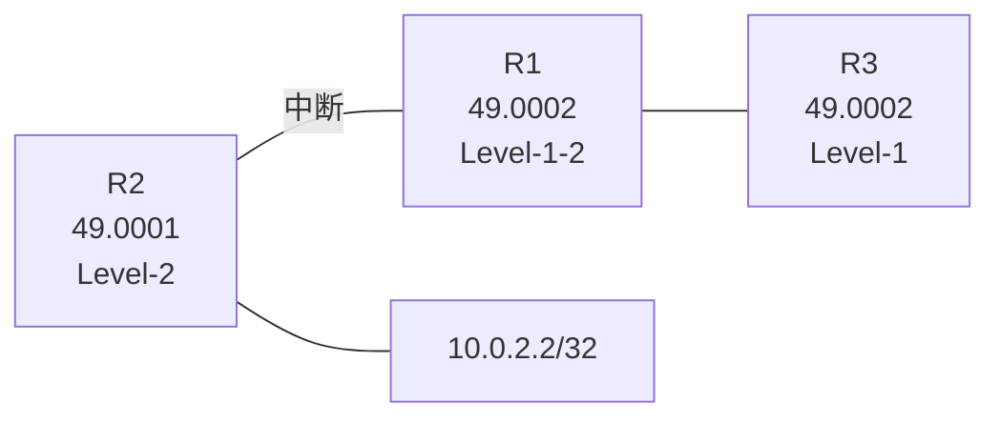
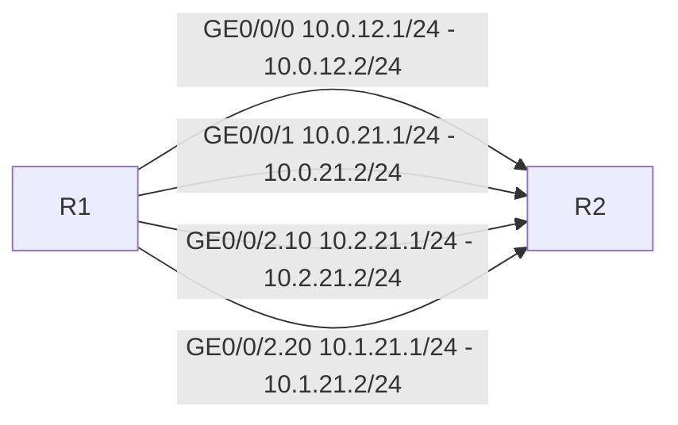
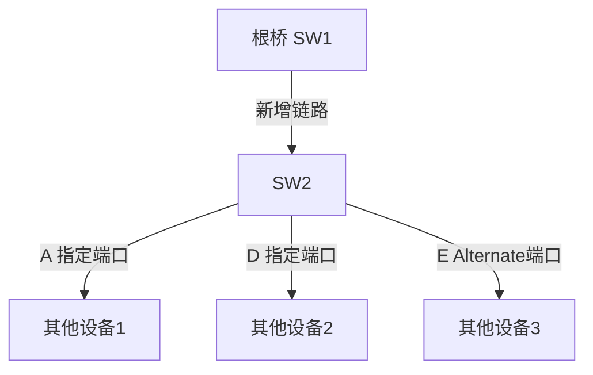
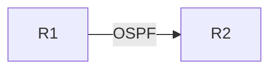
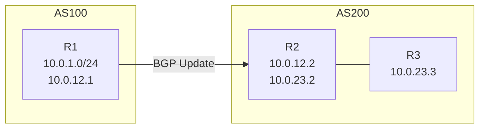
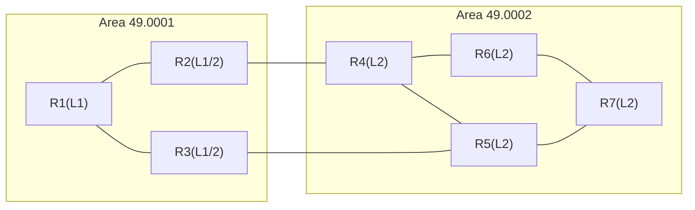
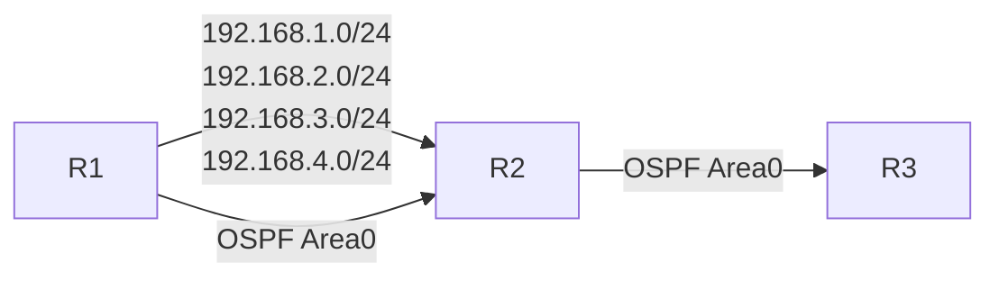

# 821dd 多选题集

---

## 第1题

**题目：** 三台路由器运行IS-IS且已经建立邻接关系，区域号和路由器的等级如图中标记，如果R1和R2之间的路中断，下列说法正确的有？



**选项：**
- A. R1将R2生成的LSP的Age设置为0
- **B. R3路由表中的缺省路由会消失**
- **C. R1运行SPF算法将R2从SPF树干中删除**
- D. R3路由表中的缺省路由仍然存在

**解析：**
```
题目未提供完整解析，需根据IS-IS原理分析：
- R1与R2之间链路中断后，R1会运行SPF算法重新计算路由，将R2从SPF树中删除
- R3是Level-1路由器，其缺省路由由Level-1-2路由器（R1）下发。当R1与R2（Level-2）断开后，R1不再是Level-1-2路由器向Level-1区域发布缺省路由的条件，R3的缺省路由会消失
```

---

## 第2题

**题目：** 以下关于MSTP的描述，正确的是哪些项？

**选项：**
- **A. MSTP支持与RSTP兼容运行**
- **B. MSTP可以实现流量在不同VLAN之间的负载分担**
- **C. 相较于RSTP，MSTP的端口角色更多**
- D. MSTP的BPDU格式与RSTP相同

**解析：**
```
MSTP的BPDU中，存在MSTI配置信息，而RSTP的BPDU中没有。所以"MSTP的BPDU格式与RSTP相同"是错误的。其余选项都对。
```

---

## 第3题

**题目：** 以下关于VRRP协议版本的描述，正确的是哪些项？

**选项：**
- **A. VRRPv2仅适用于IPv4**
- B. VRRPV3仅适用于IPv6
- **C. VRRPv3不支持认证**
- **D. VRRPv2支持认证**

**解析：**
```
VRRPv3适用于IPv4和IPv6两种网络，所以选项"VRRPv3仅适用于IPv6"是错误的，其他选项都正确。
VRRPv2和VRRPv3的主要区别为：支持的网络类型不同。VRRPv3适用于IPv4和IPv6两种网络，而VRRPv2仅适用于IPv4网络。认证功能不同。
```

---

## 第4题

**题目：** 以下关于VRRP定时器的描述，错误的是哪些项？

**选项：**
- **A. Skew_Time=(255-Priority)/255**
- **B. 缺省情况下，VRRP抢占延时是1秒**
- C. MASTER DOWN =(3*ADVER_INTERVAL)+Skew_time
- **D. 缺省情况下，VRRP通告报文的时间周期是2秒**

**解析：**
```
Skew Time=(256-Priority)/256；缺省情况下，VRRP抢占延时是0秒；缺省情况下，VRRP通告报文的时间周期是1秒。所以只有选项"MASTER DOWN=(3*ADVER_INTERVAL)+Skew_time"是正确的。
```

---

## 第5题

**题目：** 以下关于大型WLAN三层组网中，DHCP服务器的描述，错误的是？

**选项：**
- **A. 在大型WLAN组网中，AP可以通过option60参数从DHCP服务器来获取AC的IP地址**
- B. 在大型WLAN组网中，AP可以通过option43参数从DHCP服务器来获取AC的IP地址
- C. 在大型WLAN组网中，建议部署独立的DHCP服务器
- **D. 在大型WLAN组网中，一般建议使用AC作为DHCP服务器**

**解析：**
```
在大型WLAN组网中，AP通过option43参数获取AC的IP地址，option60是厂商标识符，用于标识AP厂商。
在大型WLAN组网中，建议部署独立的DHCP服务器，而不是使用AC作为DHCP服务器。
```

---

## 第6题

**题目：** 以下哪些技术支持流量统计？

**选项：**
- **A. Netstream**
- **B. SNMP**
- **C. 端口镜像**
- **D. IP报文计数**

**解析：**
```
在实际的应用中，NSC和NDA一般集成在一台NetStream服务器上。NDE通过NetStream采样获取GE0/0/1接口出方向流量信息，并按照一定条件建立NetStream流，当NetStream缓存区已满或者NetStream流达到老化时间，NDE会将统计的信息封装成NetStream报文送到NetStream服务器。NetStream服务器对NetStream报文进行分析处理，并显示结果。

传统的流量统计的实现方法和局限性：
- 基于IP报文计数：统计的信息简单，无法针对多种信息进行统计。
- 使用ACL：要求ACL的容量很大，对于ACL规则以外的流没有办法统计。
- 端口镜像：成本高，同时还需要购买专门的硬件设备。
```

---

## 第7题

**题目：** 作为网络管理员，可以使用下列哪些协议用于网络设备配置？

**选项：**
- A. LLDP
- **B. SNMP**
- **C. NETCONF**
- **D. SSH**

**解析：**
```
配置管理(netconf)、简单网络管理协议(SNMP)、安全外壳协议(SSH)都用于网络设备配置。
而LLDP是一种标准的二层发现方式，可以将本端设备的管理地址、设备标识、接口标识等信息组织起来，并发布给自己的邻居设备，供管理员了解系统的通信状况。
```

---

## 第8题

**题目：** 以下关于Filter-Policy的描述，正确的是哪些项？

**选项：**
- **A. Filter-Policy既能在OSPFv2上使用，也能在OSPFv3上使用**
- **B. 在距离矢量协议中，因为设备之间传递的就是路由信息，所以Filter-Policy能够直接对路由生效**
- C. 在链路状态路由协议中，路由表是通过LSDB生成的，所以Filter-Policy实质上是过滤LSDB中的LSA
- D. 在距离矢量协议中，如果要过滤掉从上游设备到下游设备的路由，需要在下游设备配置filter-policy export即可

**解析：**
```
对发布和接收的LSA进行过滤。在距离矢量协议中，Filter-Policy能够直接对路由生效。
在链路状态路由协议中，Filter-Policy不能过滤LSA的发布和接收，只能对路由计算结果进行过滤，即不将过滤的路由加入路由表。
```

---

## 第9题

**题目：** 以下关于OSPF的描述，哪些项是正确的？

**选项：**
- **A. 第二类外部路由的开销值只是AS外部开销值，忽略AS内部开销值**
- B. AS-External-LSA描述的是路由器到ASBR的路径
- C. AS-External-LSA描述到AS外部路由的路径，泛洪的范围是AS外部
- D. AS-External-LSA可以泛洪到OSPF任何区域
- **E. AS-External-LSA不属于任何区域**

**解析：**
```
第二类外部路由（Type 2）的开销值只是AS外部开销值，忽略AS内部开销值。
AS-External-LSA描述到AS外部路由的路径，泛洪的范围是整个OSPF AS（除了Stub区域和NSSA区域）。
AS-External-LSA不属于任何特定区域。
```

---

## 第10题

**题目：** 一条前缀列表必须包括以下哪些参数？

**选项：**
- A. 作用端口
- B. 端口号
- **C. 动作**
- **D. 序号**
- **E. IP网段与掩码**
- F. 协议号

**解析：**
```
前缀列表（IP-Prefix）的命令格式中，必须包括序号（index）、动作（permit/deny）、IP网段与掩码等参数。
命令格式：ip ip-prefix ip-prefix-name [ index index-number ] { permit | deny } ipv4-address mask-length [ greater-equal greater-equal-value ] [ less-equal less-equal-value ]
```

---

## 第11题

**题目：** 以下关于BGP中MED属性值的描述，错误的是哪些项？

**选项：**
- **A. MED值默认为100**
- B. 如果路由器将本地直连和静态路由通过network或import-route的方式引入BGP，那么这条BGP路由的MED为0
- **C. MED属性值越大则BGP路由越优**
- D. MED主要用于在AS之间影响BGP的选路

**解析：**
```
缺省情况下，MED的值为0，MED表示开销值，MED属性值越大就越不优先。
```

---

## 第12题

**题目：** 以下关于IGMP SSM Mapping的描述，正确的是哪些项？

**选项：**
- **A. SSM组播组的地址是232.0.0.0~232.255.255.255**
- B. IGMP SSM Mapping收到IGMPv3的报告报文也正常处理
- **C. IGMP SSM Mapping通过静态的将组播源与组播组进行绑定，使得IGMPv1与IGMPv2的组成员也能接入SSM组播网络**
- D. 如果路由器上没有组播组地址对应的SSM Mapping静态映射关系，则收到该报告报文时会丢弃该报文

**解析：**
```
SSM组播组地址范围是232.0.0.0~232.255.255.255。
IGMP SSM Mapping用于IGMPv1和IGMPv2的主机接入SSM组播网络，通过静态配置组播源与组播组的映射关系实现。
对于IGMPv3的报告报文，设备直接按IGMPv3处理，不进行SSM Mapping。
如果没有对应的静态映射关系，设备会丢弃该报告报文。
```

---

## 第13题

**题目：** 在MQC中流量行为支持以下哪些可执行动作？

**选项：**
- **A. 过滤报文**
- **B. 重新标记报文优先级**
- **C. 流量统计**
- **D. 为报文添加VLAN Tag**
- **E. 为报文执行策略路由**

**解析：**
```
MQC（模块化QoS命令行）中的流量行为（traffic behavior）支持多种动作，包括：
- 过滤报文（permit/deny）
- 重新标记报文优先级（重标记802.1p、DSCP、IP优先级等）
- 流量统计（statistics）
- 为报文添加VLAN Tag
- 为报文执行策略路由（redirect）
- 流量监管、流量整形、拥塞管理、拥塞避免等
```

---

## 第14题

**题目：** 以下哪些工具不只用于BGP路由协议？

**选项：**
- **A. route-policy**
- **B. ip-prefix**
- C. community-filter
- D. extcommunity-filter
- **E. ACL**
- F. as-path-filter

**解析：**
```
route-policy、ip-prefix（前缀列表）、ACL（访问控制列表）这些工具不仅可以用于BGP，也可以用于其他路由协议（如OSPF、IS-IS等）或其他功能。
community-filter、extcommunity-filter、as-path-filter是BGP专用的过滤工具。
```

---

## 第15题

**题目：** 用路由策略进行路由过滤时，以下选项中的哪些路由前缀，在匹配图中的IP-Prefix时会被deny掉？

```
[HUAWEI]ip ip-prefix aa index 10 permit 1.1.1.1 24 greater-equal 26 less-equal 32
```

**选项：**
- A. 1.1.1.1/26
- **B. 1.1.1.2/16**
- C. 1.1.1.1/32
- **D. 1.1.1.1/24**

**解析：**
```
IP-Prefix的匹配规则：
- 前缀1.1.1.1/24表示匹配前24位为1.1.1的路由
- greater-equal 26 less-equal 32表示掩码长度必须在26到32之间

1.1.1.1/26：前24位匹配，掩码26在26~32之间，permit通过
1.1.1.2/16：前24位不匹配（掩码只有16位），被deny
1.1.1.1/32：前24位匹配，掩码32在26~32之间，permit通过
1.1.1.1/24：前24位匹配，但掩码24不在26~32之间，被deny
```

---

## 第16题

**题目：** 如图所示的OSPF网络，R1和R2之间通过四条链路相连，R2的Loopback0接口开启OSPF，在R1的OSPF进程中配置"maximum load-balancing 3"命令，则R1到达R2的Loopback0接口的出接口为以下哪一项？



**选项：**
- A. GE0/0/0
- **B. GE0/0/2.10**
- **C. GE0/0/1**
- **D. GE0/0/2.20**

**解析：**
```
maximum load-balancing 3表示最多支持3条等价路由进行负载分担。
四条链路开销相同的情况下，OSPF会选择3条进行负载分担。
OSPF等价路由的选择与接口类型和优先级有关，子接口的优先级可能不同。
根据结果，选择了GE0/0/1、GE0/0/2.10、GE0/0/2.20三条链路进行负载分担。
```

---

## 第17题

**题目：** 在OSPF网络中，OSPF根据链路层协议类型，将网络分为了四种类型。其中，不需要选举DR/BDR的是以下哪些网络类型？

**选项：**
- A. Broadcast
- **B. P2MP**
- **C. P2P**
- D. NBMA

**解析：**
```
在OSPF网络中，OSPF协议根据链路层协议类型将网络分为了四种类型：Broadcast、P2P（Point-to-Point）、NBMA（Non-Broadcast Multi-Access）以及P2MP（Point-to-MultiPoint）。
不需要选举DR/BDR的网络类型是P2P和P2MP。
P2P是点到点网络，只有两个节点，无需选举DR/BDR。
P2MP是点到多点网络，也不需要选举DR/BDR。
Broadcast和NBMA是多路访问网络，需要选举DR/BDR。
```

---

## 第18题

**题目：** 以下场景中，两台直连华为路由器，配置IS-IS路由协议后肯定不能成功建立邻接关系的有哪些项？

**选项：**
- A. 两台路由器均为Level-2路由器，但Area Address不同
- **B. 两台路由器一台为Level-1路由器，另一台为Level-2路由器**
- **C. 两台路由器均为Level-1路由器，且Area Address不同**
- D. 两台路由器均为Level-2路由器，Area Address相同，且相连接口处于同一网段

**解析：**
```
IS-IS邻接关系建立的条件：
- Level-1路由器之间：必须在同一区域（Area Address相同）才能建立Level-1邻接
- Level-2路由器之间：可以在不同区域建立Level-2邻接
- Level-1和Level-2路由器之间：不能建立邻接关系，因为级别不匹配
- Level-1-2路由器可以与Level-1建立Level-1邻接，与Level-2建立Level-2邻接
```

---

## 第19题

**题目：** 在BGP中MED属性是一种度量值，用于向外部对等体指出进入本AS的首选路径。以下关于该属性的描述，正确的是哪些项？

**选项：**
- **A. MED属性值越小则BGP路由越优**
- B. 缺省情况下，只要路由的目的相同，路由器可以比较来自不同AS的MED值
- **C. 在IBGP对等体之间传递路由时，MED值会被保留并传递，除非部署了策略，否则MED值在传递过程中不发生改变也不会丢失**
- **D. MED被传递给EBGP对等体后，对等体在其AS内传递路由时，携带该MED值**

**解析：**
```
MED（Multi-Exit Discriminator）属性：
- MED值越小，BGP路由越优（MED是度量值，越小越优）
- 缺省情况下，只比较来自同一AS的MED值，不同AS的MED值不进行比较
- 在IBGP对等体之间传递路由时，MED值会被保留传递
- MED被传递给EBGP对等体后，对等体在其AS内传递时会携带该MED值
```

---

## 第20题

**题目：** 在MA网络中，OSPF会通过选举DR/BDR减少邻接关系。那么以下关于DR/BDR选举的描述，正确的是哪些项？

**选项：**
- A. 若接口的DR优先级相同，则比较Router ID，数值越小越优
- **B. DR/BDR的选举是基于接口的，接口的DR优先级数值越大越优**
- **C. 若直连的两台路由器的接口DR优先级均设置为0，则会导致这两台路由器无法建立邻接关系**
- D. DR/BDR的选举是抢占式的，抢占时间为15秒

**解析：**
```
DR/BDR选举规则：
- 选举基于接口，DR优先级越大越优
- 优先级相同时，比较Router ID，Router ID越大越优
- DR优先级为0的接口不参与DR/BDR选举，只能作为DROther
- 若两台路由器的DR优先级都为0，在MA网络中它们都不参与选举，无法建立邻接关系
- DR/BDR的选举是非抢占式的，一旦选举完成，新加入的设备不会抢占
```

---

## 第21题

**题目：** 某园区网络中，全网运行IS-IS路由协议，现工程师在某一台设备上查看LSDB的详细信息如下所示。那么根据回显信息，以下描述正确的是哪些项？

```
<R1>display isis lsdb 0100.0000.1001.00-00 verbose
Database information for ISIS(1)
Level-1 Link State Database
LSPID                  Seq Num      Checksum  Holdtime  Length  ATT/P/OL
0100.0000.1001.00-00*  0x0000000e  0x9a75    1072      113     0/0/0
SOURCE         0100.0000.1001.00
NLPID          IPV4
AREA ADDR      49.0123
INTF ADDR      10.1.12.1
INTF ADDR      10.1.13.1
NBR ID         0100.0000.1001.01     COST:10
NBR ID         0100.0000.3003.01     COST:10
IP-Internal    10.1.12.0 255.255.255.0    COST:10
IP-Internal    10.1.13.0 255.255.255.0    COST:10
IP-Internal    1.1.1.0 255.255.255.0      COST:10
Total LSP(s): 1
```

**选项：**
- A. 该LSP中描述了2个网段信息
- **B. 该LSP来源的区域号为49.0123**
- C. 该LSP是伪节点生成的
- **D. 该LSP源节点的系统ID为0100.0000.1001.00**

**解析：**
```
根据LSP信息分析：
- AREA ADDR为49.0123，即区域号为49.0123
- SOURCE为0100.0000.1001.00，即源节点的系统ID为0100.0000.1001.00
- LSP ID为0100.0000.1001.00-00，其中-00表示非伪节点（伪节点的LSP ID中最后一个字节非0）
- IP-Internal有3条（10.1.12.0/24、10.1.13.0/24、1.1.1.0/24），描述了3个网段信息
```

---

## 第22题

**题目：** BGP协议本身不发现路由，因此需要将其他路由引入到BGP路由表，实现AS间的路由互通。其中import方式是按协议类型将路由引入到BGP路由表中，那么Import支持将以下哪些路由引入到BGP路由表中？

**选项：**
- **A. IS-IS**
- **B. 直连**
- **C. Static**
- **D. OSPF**

**解析：**
```
BGP协议确实是一个自治系统间路由传递协议，而它的路由发现依赖于其引入机制。
Import支持多种路由信息的引入，包括但不限于：直连（Direct）、静态（Static）、OSPF、IS-IS、RIP等。
```

---

## 第23题

**题目：** BGP设备在发送Open消息建立对等体连接时，会携带以下哪些信息？

**选项：**
- **A. Router ID**
- **B. Hold time**
- C. NLRI
- **D. 本地自治系统号**

**解析：**
```
BGP设备在发送Open消息建立对等体连接时，会携带的信息包括：
A. Router ID - 路由器标识符，用于识别对等体
B. Hold time - 保持时间，用于确定对等体之间连接是否还处于活跃状态
D. 本地自治系统号 - 标识BGP所在的自治系统
NLRI是在路由更新消息（Update）中携带的信息，不在Open消息中。
```

---

## 第24题

**题目：** 在OSPF网络中，不同设备角色产生的LSA种类不同，其描述的含义也有所不同。其中，角色仅为ASBR的路由器不可能产出以下哪些类型的LSA？

**选项：**
- A. 7类LSA
- **B. 2类LSA**
- **C. 4类LSA**
- **D. 3类LSA**

**解析：**
```
在OSPF中，ASBR（自治系统边界路由器）主要负责引入外部路由。
关键点：
1. 2类LSA由DR生成（非DR的ASBR无法产生）
2. 3类LSA（网络汇总LSA）由ABR产生
3. 4类LSA（ASBR汇总LSA）由ABR产生，用于描述到ASBR的路径
题目强调"仅为ASBR"，因此无法产生需要DR或ABR角色的LSA。
7类LSA是NSSA区域中ASBR产生的外部路由LSA。
```

---

## 第25题

**题目：** 到目前为止，IGMP有三个版本。以下哪些是IGMP三个版本中都存在的报文？

**选项：**
- A. 特定组查询报文
- **B. 成员报告报文**
- C. 成员离开报文
- **D. 普遍组查询报文**

**解析：**
```
IGMP三个版本（v1、v2、v3）中都存在的报文：
- 成员报告报文（Membership Report）：三个版本都有
- 普遍组查询报文（General Query）：三个版本都有

特定组查询报文（Group-Specific Query）：IGMPv2和v3有，v1没有
成员离开报文（Leave Group）：IGMPv2和v3有，v1没有（v1通过超时机制判断）
```

---

## 第26题

**题目：** 以下关于IPV6地址表示方法的描述，正确的是哪些项？

**选项：**
- A. IPv6地址通常分为4组，每组为8个十六进制数的形式，每组十六进制数间用冒号分隔
- B. 地址中包含的连续三个或多个均为0的组，可以用双冒号::来代替
- **C. 每组中的前导"0"都可以省略**
- **D. 在一个IPv6地址中只能使用一次双冒号::**

**解析：**
```
IPv6地址表示方法：
- IPv6地址分为8组（不是4组），每组4个十六进制数，共128位
- 连续的一组或多组全0可以用双冒号::代替（不是必须三个或多个）
- 每组中的前导"0"可以省略
- 在一个IPv6地址中只能使用一次双冒号::，否则无法确定每段0的个数
```

---

## 第27题

**题目：** 以下关于包过滤防火墙的描述，正确的是哪些项？

**选项：**
- **A. 包过滤防火墙的本质是通过配置ACL实施数据包的过滤**
- B. 包过滤防火墙可以检查应用层数据
- **C. 包过滤防火墙支持逐包检测**
- D. 包过滤防火墙可以对关联报文进行分析，提高安全系数

**解析：**
```
包过滤防火墙通过配置ACL实现数据包过滤，且支持逐包检测。
包过滤防火墙工作在网络层和传输层，不能检查应用层数据。
包过滤防火墙不能对关联报文进行分析（这是状态检测防火墙的特性）。
```

---

## 第28题

**题目：** 在网络中，存在着大量针对CPU的恶意报文以及需要正常上送CPU的各类报文。为了保证CPU对正常业务进行响应，设备提供了本机防攻击功能。以下关于该功能的描述，正确的是哪些项？

**选项：**
- **A. 设备可以在防攻击策略中对上送CPU的报文按照协议优先级进行调度，保证优先级高的协议先得到处理**
- **B. 为了保证基于会话的应用层数据在攻击发生时可以正常运行，可以配置动态链路保护功能**
- C. 设备对不同类型的报文只可以设置相同的限制速率，从而减少上送CPU的报文数量
- D. 所有CPU防攻击功能对设备的管理网口也可以起作用

**解析：**
```
本机防攻击功能：
- 可以对上送CPU的报文按协议优先级进行调度，保证高优先级协议先处理
- 动态链路保护功能可以保证基于会话的应用层数据在攻击发生时正常运行
- 设备对不同类型的报文可以设置不同的限制速率（不是相同的）
- 部分CPU防攻击功能对管理网口可能不生效或有特殊处理
```

---

## 第29题

**题目：** 某企业部署完IPSec后发现业务不通，经管理员排查发现没有数据流触发IKE协商，那么以下哪些原因可能导致该情况发生？

**选项：**
- **A. 域间安全策略配置错误**
- **B. IPSec策略未正确应用到相关接口**
- **C. ACL与保护数据流不匹配**
- **D. 路由不可达**

**解析：**
```
IPSec业务不通，没有数据流触发IKE协商的可能原因：
- 路由不可达：数据无法传输，无法触发协商
- ACL与保护数据流不匹配：数据流无法通过IPSec保护
- 域间安全策略配置错误：会阻碍协商
- IPSec策略未应用到相关接口：无法生效
```

---

## 第30题

**题目：** VRRP协议包括两个版本VRRPv2和VRRPv3，以下关于VRRPv3版本的描述，正确的是哪些项？

**选项：**
- **A. VRRPV3适用于IPv4和IPv6两种网络**
- B. VRRPv3支持认证功能
- **C. 设备的缺省优先级为100**
- **D. 缺省情况下，VRRP通告报文的发送时间间隔为1秒**

**解析：**
```
VRRPv3特性：
- VRRPv2仅适用于IPv4网络，VRRPv3适用于IPv4和IPv6两种网络
- VRRPv3不支持认证功能，而VRRPv2支持认证功能
- 设备的缺省优先级为100
- 缺省情况下，VRRP通告报文的时间间隔为1秒
```

---

## 第31题

**题目：** 某大型商场为防止广播域过大，导致网络性能变差，配置了VLAN Pool。网络工程师执行命令display vlan pool name STA的回显如下。那么以下关于该配置信息的描述，正确的是哪些项？

```
<AC>display vlan pool name STA
Name        : STA
Total       : 2
Assignment  : hash
Threshold Notify Count : 3
Threshold Notify time(min) : 3
VLAN ID     : 2 4
```

**选项：**
- A. VLAN Pool采用的顺序分配算法
- **B. VLAN Pool的名称为STA**
- C. VLAN Pool的总数为2
- **D. 加入到VLAN Pool的VLAN ID为2和4**

**解析：**
```
根据回显信息：
- Name为STA，即VLAN Pool名称为STA
- Assignment为hash，即采用hash分配算法（不是顺序分配）
- Total为2，表示VLAN Pool中VLAN的数量为2
- VLAN ID为2和4，即加入的VLAN为VLAN 2和VLAN 4
注意：选项C说"VLAN Pool的总数为2"不准确，Total表示的是该VLAN Pool中包含的VLAN数量。
```

---

## 第32题

**题目：** 某园区网络中，采用OSPF路由协议实现网络通信，其链路层协议为Ethernet。那么缺省情况下，以下哪些报文会以单播的形式发送？

**选项：**
- A. LSAck报文
- **B. DD报文**
- **C. LSR报文**
- D. Hello报文

**解析：**
```
在广播类型网络中：
1. Hello报文：通过组播发送，主要作用包括发现邻居、建立邻居关系、维护邻居关系、选择DR/BDR以及确认通信。
2. DD报文：通过单播发送，DD报文的主要功能是进行OSPF的LSDB摘要信息的传递。
3. LSR报文：通过单播发送，用于请求对方发送自己缺少的LSA。
4. LSU报文：在广播网络中，LSU报文通过组播发送（224.0.0.5/6）。
5. LSAck报文：在广播网络中，LSAck报文通过组播发送（224.0.0.5/6）。

注意：在MA网络中，邻接关系建立后（ExStart之后），DD、LSR、LSU、LSAck在邻接路由器之间通常以单播形式发送。但在DR/BDR场景下，LSU和LSAck也会使用组播。
```

---

## 第33题

**题目：** 在IS-IS网络中，网络设备需要配置网络实体名称，它由三部分构成，且每个部分包含的字段不同。其中，AreaAddress部分包含以下哪些字段？

**选项：**
- **A. IDI**
- B. System ID
- **C. High Order DSP**
- **D. AFI**

**解析：**
```
在IS-IS网络中，网络实体名称（NET）由三部分构成：
1. Area Address（区域地址）：包含AFI（地址族标识）、IDI（初始域标识符）、High Order DSP（高位域特定部分）
2. System ID（系统ID）：标识路由器，通常为6字节
3. NSEL（选择器）：标识服务类型，通常为00

Area Address部分由AFI、IDI和DSP（Domain Specific Part）组成，其中High Order DSP属于DSP的高位部分。
```

---

## 第34题

**题目：** 以下关于BGP中Local Preference属性的描述，正确的是哪些项？

**选项：**
- A. Local Preference属性可以传递给所有BGP邻居
- **B. 该属性在传递时除非受路由策略影响，否则Local Preference值不变**
- **C. Local Preference属性值越大则BGP路由越优**
- D. 缺省的Local Preference值为0

**解析：**
```
BGP中的Local Preference属性：
- Local Preference属性只在IBGP对等体之间传递，不能传递给EBGP对等体
- Local Preference属性值越大，BGP路由越优
- 缺省的Local Preference值为100（不是0）
- 该属性在IBGP之间传递时，除非受路由策略影响，否则值不变
```

---

## 第35题

**题目：** 在BGP中通过Origin属性来标识一条路由的起源，以下关于该属性的描述，正确的是哪些项？

**选项：**
- **A. 当去往同一个目的地存在多条不同Origin属性的路由时，在其他条件都相同的情况下，BGP将按如下顺序优选路由：IGP>EGP>Incomplete**
- **B. 该属性为公认必遵属性**
- **C. 如果路由是由始发的BGP路由器使用network命令注入到BGP的，那么该BGP路由在路由表中的标识符为i**
- D. 如果路由是通过EGP学习到的，那么该BGP路由的Origin属性在BGP路由表的标识符为?

**解析：**
```
BGP Origin属性：
- Origin是公认必遵属性（Well-known Mandatory）
- Origin属性有三种类型：IGP（i）、EGP（e）、Incomplete（?）
- 优先级顺序：IGP > EGP > Incomplete
- network命令注入的路由Origin为IGP（i）
- 通过EGP学习到的路由Origin为EGP（e），标识符为e，不是?
- Incomplete（?）通常是通过import-route引入的路由
```

---

## 第36题

**题目：** 当需要在AS之间传递路由的时候，经常会通过BGP和IGP互相引入来实现。但是这种实现方式存在风险，因此需要考虑以下哪些问题？

**选项：**
- **A. 如果BGP路由数量较大，那么AS内部的低端设备可能不能装载如此大规模的路由，容易造成路由丢失**
- **B. 当所有BGP路由重分布到IGP中后，会破坏BGP的路由防环机制，产生路由环路的隐患**
- **C. 如果某条路由不稳定，可能会导致整个AS的路由震荡，影网络的稳定性**
- **D. 大量BGP路由引入IGP，会影响IGP的运行，如导致OSPF的LSDB过载**

**解析：**
```
BGP和IGP互相引入的风险：
- BGP路由数量大，低端设备可能无法承载，导致路由丢失
- 破坏BGP的路由防环机制（BGP通过AS_PATH防环，引入IGP后AS_PATH信息丢失），产生路由环路隐患
- 路由不稳定会导致整个AS的路由震荡，影响网络稳定性
- 大量BGP路由引入IGP，会导致IGP数据库过大，如OSPF的LSDB过载，影响IGP运行
```

---

## 第37题

**题目：** 路由属性是对路由的特定描述，所有的BGP路由属性都可以分为四类。其中，属于公认任意的包括以下哪些属性？

**选项：**
- A. MED
- **B. Atomic Aggregate**
- **C. Local Preference**
- D. Community

**解析：**
```
BGP路由属性分为四类：
1. 公认必遵（Well-known Mandatory）：Origin、AS_Path、Next_Hop
2. 公认任意（Well-known Discretionary）：Local Preference、Atomic Aggregate
3. 可选过渡（Optional Transitive）：Community、Aggregator
4. 可选非过渡（Optional Non-transitive）：MED、Cluster_List、Originator_ID

MED是可选非过渡属性，Community是可选过渡属性。
```

---

## 第38题

**题目：** IP前缀列表是常见的匹配工具之一，一条IP-Prefix可创建多个index，每个index可以配置相应的动作和匹配条件。其中，index中可使用的匹配条件有以下哪些项？

**选项：**
- **A. 掩码长度**
- B. 端口号
- **C. IP地址前缀**
- D. 协议类型

**解析：**
```
IP前缀列表（IP-Prefix）的匹配条件：
- IP地址前缀：匹配IP地址的网络前缀部分
- 掩码长度：匹配前缀的掩码长度，可通过greater-equal和less-equal指定范围

端口号和协议类型不是IP-Prefix的匹配条件，这些通常是ACL的匹配项。
```

---

## 第39题

**题目：** IP-Prefix是路由策略中常用的匹配工具，某台华为路由器配置IP-Prefx时，以下参数中非必须配置有哪些项？

**选项：**
- A. 掩码长度
- **B. 前缀列表的序号**
- **C. 掩码长度匹配范围的上限**
- **D. 掩码长度匹配范围的下限**

**解析：**
```
IP-Prefix命令格式：
ip ip-prefix ip-prefix-name [ index index-number ] { permit | deny } ipv4-address mask-length [ greater-equal greater-equal-value ] [ less-equal less-equal-value ]

中括号[]里的参数为可选配置：
- 掩码长度（masklen）是必须配置的
- 前缀列表的序号（index）是可选的
- 掩码长度匹配范围的上限（less-equal）是可选的
- 掩码长度匹配范围的下限（greater-equal）是可选的
```

---

## 第40题

**题目：** 某企业管理员日常运维时查看BGP路由的详细信息如下，以下关于该路由的描述，正确的是哪些项？

```
<HUAWEI> display bgp routing-table 192.168.1.1
BGP local router ID : 10.1.1.1
Local AS number : 100
Paths:   2 available, 0 best, 0 select
BGP routing table entry information of 192.168.1.1/32:
From: 10.1.1.2 (10.1.1.2)
Route Duration: 00h01m31s
Relay IP Nexthop: 0.0.0.0
Relay IP Out-Interface:
Original nexthop: 172.16.1.2
Qos information : 0x0
AS-path 200, origin incomplete, MED 0, localpref 100, pref-val 0, internal, pre 255, invalid for IP unreachable
Not advertised to any peer yet
```

**选项：**
- **A. 该路由原始的下一跳为172.16.1.2**
- **B. 本地BGP设备的ID号为10.1.1.1**
- **C. 本地自治系统号为100**
- D. 该条路由被优选的原因是因为localpref优先级高

**解析：**
```
根据BGP路由表信息：
- Original nexthop: 172.16.1.2，即原始下一跳为172.16.1.2
- BGP local router ID : 10.1.1.1，即本地BGP Router ID为10.1.1.1
- Local AS number : 100，即本地自治系统号为100
- Paths: 2 available, 0 best, 0 select，表示没有最优路由，该路由未被优选
- invalid for IP unreachable，表示该路由因下一跳不可达而无效
```

---

## 第41题

**题目：** 以下关于IP组播服务模型的描述，正确的是哪些项？【更新】

**选项：**
- **A. 组播服务模型的分类是针对接收者主机的，对组播源没有区别**
- **B. SSM模型中针对每一个(源，组)信息都会生成表项**
- C. SSM模型要求同一个源上不同的组播应用可以使用相同的SSM地址来区分
- **D. ASM模型要求ASM地址只能被一种组播应用用**

**解析：**
```
IP组播服务模型：
- ASM（Any-Source Multicast）模型：接收者只知道组播组地址，不知道源地址。ASM地址只能被一种组播应用使用，不同应用需要使用不同的组地址。
- SSM（Source-Specific Multicast）模型：接收者同时知道源地址和组地址。SSM模型中针对每一个（源，组）信息都会生成表项。
- 组播服务模型的分类是针对接收者主机的，对组播源没有区别。
- SSM模型中，同一个源上不同的组播应用需要使用不同的SSM组地址来区分，不能使用相同的地址。
```

---

## 第42题

**题目：** 使用基本ACL进行路由匹配时，需配置规则编号、匹配动作及匹配项。其中，基本ACL可使用以下哪些匹配项？

**选项：**
- **A. 分片信息**
- B. 源/目MAC地址
- **C. 生效时间**
- D. 源/目IP地址

**解析：**
```
基本ACL（编号2000-2999）的匹配项：
- 源IP地址（只能匹配源IP，不能匹配目的IP）
- 分片信息（fragment）
- 生效时间（time-range）
- VPN实例等

源/目MAC地址是二层ACL的匹配项。
源/目IP地址是高级ACL的匹配项，基本ACL只能匹配源IP地址。
注意：题目说"源/目IP地址"，基本ACL不能匹配目的IP，所以D错误。
```

---

## 第43题

**题目：** 以下关于BGP基本概念的描述，正确的是哪些项？

**选项：**
- **A. BGP的Router ID是一个用于标识BGP设备的32位值，每个BGP设备都必须有唯一的Router，否则对等体之间不能建立BGP连接**
- B. 运行于同一AS内部的BGP称为IBGP，为了快速传递路由，BGP设备从IBGP对等体学到的路由通告给其他IBGP对等体
- **C. 运行于不同AS之间的BGP称为EBGP，为了防止AS间产生环路，当BGP设备接收EBGP对等体发送的路由时，会将带有本地AS号的路由丢弃**
- **D. 发送BGP报文的设备称为BGP发言者，它接收或产生新的报文信息，并发布给其它BGP Speaker**

**解析：**
```
BGP基本概念：
- Router ID：32位值，每个BGP设备必须唯一，否则无法建立对等体连接
- IBGP：运行于同一AS内部的BGP。为防止环路，BGP设备从IBGP对等体学到的路由不会通告给其他IBGP对等体（IBGP水平分割）
- EBGP：运行于不同AS之间的BGP。AS_PATH防环机制：当BGP设备收到EBGP对等体发送的路由时，如果AS_PATH中包含本地AS号，则丢弃该路由
- BGP Speaker（发言者）：发送BGP报文的设备，接收或产生新的报文信息，并发布给其它BGP Speaker
```

---

## 第44题

**题目：** 在网络中，每个路由器都有本地核心路由表和协议路由表。其中，本地核心路由表中的一条路由条目存在多个关键字段，主要包括以下哪些内容？

**选项：**
- A. 学习此路由的入接口
- **B. 此路由的目的地址**
- **C. 此路由的路由协议优先级**
- **D. 学习此路由的路由协议**

**解析：**
```
本地核心路由表（IP路由表）中的路由条目关键字段包括：
- 目的地址/掩码：标识路由的目的地
- 路由协议优先级（Preference）：不同路由协议的优先级
- 路由协议类型：学习此路由的路由协议（如Static、OSPF、BGP等）
- 开销（Cost/Metric）：路由的度量值
- 下一跳：报文转发的下一个节点
- 出接口：报文转发的出口接口

入接口不是路由表中的关键字段。
```

---

## 第45题

**题目：** 在OSPF网络中，有多种网络类型，如：Broadcast、P2P、P2MP和NBMA。缺省情况下，Hello time为30秒的是以下哪些网络类型？

**选项：**
- A. Broadcast
- **B. P2MP**
- C. P2P
- **D. NBMA**

**解析：**
```
OSPF不同网络类型的默认Hello时间：
- Broadcast：Hello时间为10秒
- P2P：Hello时间为10秒
- P2MP：Hello时间为30秒
- NBMA：Hello时间为30秒

Hello时间是OSPF协议中用于邻居发现和维护的一个重要参数。
对于NBMA和P2MP网络类型，由于链路速率通常较低，Hello时间被设置为30秒。
```

---

## 第46题

**题目：** OSPF邻接关系建立的过程中，涉及到DD报文传输的阶段包括以下哪些项？

**选项：**
- **A. Exchange**
- B. Init
- C. Full
- D. Loading
- **E. ExStart**

**解析：**
```
OSPF邻接关系建立的阶段及涉及的报文：
1. Down：初始状态
2. Init：收到Hello报文，进入Init状态（仅Hello报文）
3. 2-Way：双向通信建立（仅Hello报文）
4. ExStart：开始交换DD报文，确定主从关系（DD报文）
5. Exchange：交换DD报文，传递LSA摘要信息（DD报文）
6. Loading：发送LSR请求LSA，接收LSU（LSR、LSU、LSAck报文）
7. Full：邻接关系完全建立

涉及DD报文传输的阶段是ExStart和Exchange。
```

---

## 第47题

**题目：** 以下关于Filter-Policy的描述，正确的是哪些项？

**选项：**
- A. Filter-Policy只能应用在IGP上，不能应用在BGP
- B. Filter-Policy不能对特定的路由协议进行过滤
- **C. Filter-Policy具有"入"和"出"两个方向**
- **D. Filter-Policy不仅可以调用前缀列表和ACL，还可以调用Route-Policy**

**解析：**
```
Filter-Policy（过滤策略）：
- 可以应用在IGP（OSPF、IS-IS等）和BGP上
- 可以对特定的路由协议进行过滤
- 具有import（入）和export（出）两个方向
- 可以调用前缀列表（ip-prefix）、ACL和Route-Policy进行匹配
```

---

## 第48题

**题目：** 基于会话的状态检测防火墙对于首包和后续包有不同的处理流程，那么以下关于该流程的描述，正确的是哪些项？

**选项：**
- A. 状态检测存在冻结时间，若长时间没有报文匹配的话会冻结该会话，在此之后如果依然有报文匹配，则不需要重新建立会话。这样既节约系统资源，又能够起到快速响应的作用
- **B. 在状态检查机制打开的情况下，后续包不需要进行安全策略检查，直接允许通过**
- C. 报文到达防火墙时，会查找会话表，如果没有匹配，防火墙会对报文直接丢弃
- **D. 在状态检查机制打开的情况下，防火墙处理TCP报文时，只有SYN报文才能建立会话**
- **E. 报文到达防火墙时，会查找会话表，如果匹配，防火墙会进行后续包处理流程**

**解析：**
```
状态检测防火墙处理流程：
- 首包处理：查找会话表，没有匹配则进行安全策略检查，允许则创建会话
- 后续包处理：查找会话表，匹配则直接转发，不需要再进行安全策略检查
- TCP会话：只有SYN报文才能建立新会话
- 会话老化：长时间没有报文匹配的话会话会老化删除，之后有报文需要重新建立会话（不是冻结）
- 没有匹配会话且不是首包的报文：默认会被丢弃
```

---

## 第49题

**题目：** IGMPv2版本支持以下哪些报文？

**选项：**
- **A. 特定组查询报文**
- B. 指定源查询报文
- **C. 普遍组查询报文**
- **D. 成员离开报文**

**解析：**
```
IGMPv2支持的报文类型：
- 普遍组查询报文（General Query）：查询所有组的成员
- 特定组查询报文（Group-Specific Query）：查询特定组的成员
- 成员报告报文（Membership Report）：主机报告组成员关系
- 成员离开报文（Leave Group）：主机主动离开组播组

指定源查询报文（Group-and-Source-Specific Query）是IGMPv3中引入的报文类型。
```

---

## 第50题

**题目：** 以下关于OSPF命令的描述，错误的是哪些项？

**选项：**
- **A. OSPFv3配置中不必使用router-id命令配置Router ID，配置方法和OSPFv2一样**
- B. Stub区域和Totally Stub区域的配置区别是Totally Stub区配置了no-summary
- C. OSPFv2和OSPFv3配置接口命令的区别是OSPFv2使用network命令，而OSPFv3直接在接口上使能
- **D. stub命令用来配置此路由器为Stub路由器，Stub路由器可以与非Stub路由器形成邻居关系**

**解析：**
```
OSPF命令描述分析：
- OSPFv3配置中必须显式配置router-id，不能像OSPFv2那样自动选取，所以A错误
- Stub区域只过滤Type 5 LSA，Totally Stub区域配置no-summary后同时过滤Type 3和Type 5 LSA，B正确
- OSPFv2使用network命令在区域中使能接口，OSPFv3直接在接口视图下使能，C正确
- Stub区域中的路由器（Stub路由器）不能与非Stub区域的路由器形成邻居关系，因为Hello报文中的E标志位不匹配，D错误
```

---

## 第51题

**题目：** 构建数通网络的华为引擎包括以下哪些项？

**选项：**
- **A. AirEngine**
- **B. HiSecEngine**
- **C. NetEngine**
- **D. CloudEngine**

**解析：**
```
构建数通网络的华为引擎系列：
- AirEngine：用于无线网络（无线接入点系列）
- NetEngine：用于路由器/路由网络
- CloudEngine：用于数据中心网络（交换机系列）
- HiSecEngine：保障网络安全（防火墙/安全网关系列）

这些引擎各自在不同领域发挥关键作用，共同构建完善的数通网络。
```

---

## 第52题

**题目：** 以下哪些项属于BGP可选过渡属性？

**选项：**
- **A. Aggregator**
- **B. Community**
- C. Local_Preference
- D. Multi_Exit_Dise

**解析：**
```
BGP路由属性分类：
1. 公认必遵（Well-known Mandatory）：Origin、AS_Path、Next_Hop
2. 公认任意（Well-known Discretionary）：Local_Preference、Atomic_Aggregate
3. 可选过渡（Optional Transitive）：Community、Aggregator
4. 可选非过渡（Optional Non-transitive）：MED(Multi_Exit_Disc)、Cluster_List、Originator_ID

Aggregator用于聚合路由信息，Community用于路由策略控制，它们都属于可选过渡属性。
```

---

## 第53题

**题目：** PIM-SM中的Hello消息有以下哪些作用？

**选项：**
- A. 向RP注册
- **B. 邻居间参数协商**
- C. 选举网段BDR
- **D. 建立并维护邻居关系**

**解析：**
```
PIM-SM中Hello消息的作用：
- 发现PIM邻居，建立并维护邻居关系
- 邻居间参数协商（如Hello间隔、DR优先级等）
- 选举网段DR（指定路由器），不是BDR（BDR是OSPF中的概念）

向RP注册是Register报文的功能，不是Hello消息的作用。
```

---

## 第54题

**题目：** 路由协议是路由器之间维护路由表的规则，用于发现路由，生成路由表，并指导报文转发。其中，依据来源的不同，可将路由分为以下哪些类别？

**选项：**
- **A. 静态路由**
- **B. 直连路由**
- C. 外部路由
- **D. 动态路由**

**解析：**
```
根据路由的来源不同，可以将路由分为以下几种类型：
- 直连路由：接口直连网段产生的路由
- 静态路由：由网络管理员手动配置的路由，不依赖于网络中的设备运行状态和路径状态信息
- 动态路由：通过路由协议（如OSPF、BGP、IS-IS等）学习到的路由

外部路由是相对于AS内部路由而言的，不是按来源分类的标准类别。
```

---

## 第55题

**题目：** 如图所示为某RSTP网络，现用户在根桥SW1和SW2之间新增了一条链路，那么当SW2收到根桥SW1发送的Proposal位置位的RST BPDU之后，会将自己的所有端口进入同步状态，那么以下关于各角色接口同步状态的描述，正确的是哪些项？



**选项：**
- **A. 指定端口会进入Discarding状态**
- B. 根端口会进入Discarding状态
- **C. Alternate端口会进入Discarding状态**
- D. 边缘端口会进入Discarding状态

**解析：**
```
RSTP同步机制（P/A机制）：
当SW2收到根桥SW1发送的Proposal位置位的RST BPDU后，进行同步操作：
- 根端口：不会进入Discarding状态，而是继续保持Forwarding状态（因为收到的是更优的BPDU）
- 指定端口：进入Discarding状态，防止临时环路
- Alternate端口：保持Discarding状态（本身就是阻塞的）
- 边缘端口：不参与同步，保持Forwarding状态（边缘端口直接连接终端，不会产生环路）

同步完成后，SW2会向根桥回复Agreement BPDU。
```

---

## 第56题

**题目：** IGMP SSM Mapping通过静态的将组播源与组播组进行绑定，使得IGMPv1与IGMPv2的组成员也能接入SSM组播网络。下列关于IGMP SSM Mapping的描述，正确的是哪些项？

**选项：**
- **A. 如果未使能IGMP SSM Mapping功能，IGMPv1和IGMPv2均不支持部署SSM模式的组播**
- **B. IGMP SSM Mapping不处理IGMPv3的报告报文。为了保证同一网段运行任意版本IGMP的主机都能得到SSM服务，需要在与成员主机所在网段相连的组播路由器接口上运行IGMPv3**
- **C. SSM的组播组的地址是232.0.0.0~232.255.255.255**
- **D. SSM Mapping通过在组播交换机上静态配置SSM地址的映射规则，可以将IGMPv1和IGMPv2的报告报文中的(*, G)信息转化为对应的(S, G)信息**

**解析：**
```
IGMP SSM Mapping特性：
- SSM模型需要知道源地址和组地址，IGMPv1和IGMPv2本身不支持SSM
- SSM Mapping功能通过静态配置映射规则，将(*, G)映射为(S, G)，使IGMPv1/v2主机也能使用SSM服务
- SSM组播组地址范围是232.0.0.0/8（232.0.0.0~232.255.255.255）
- IGMP SSM Mapping不处理IGMPv3报告报文，IGMPv3主机直接按IGMPv3处理
- 为了兼容所有版本的IGMP主机，接口上需要运行IGMPv3
```

---

## 第57题

**题目：** PIM-DM有很多工作机制，以下哪些机制用于构建SPT？

**选项：**
- **A. 剪枝**
- **B. 扩散**
- **C. 邻居发现**
- **D. 嫁接**

**解析：**
```
PIM-DM（协议无关组播-密集模式）构建SPT（最短路径树）的工作机制：
- 邻居发现：通过Hello消息发现PIM邻居，是构建SPT的基础
- 扩散（Flooding）：组播数据以"推"的方式扩散到网络所有角落
- 剪枝（Prune）：没有接收者的分支发送Prune消息，从SPT上剪去，优化路径
- 嫁接（Graft）：被剪枝的分支出现新接收者时，主动发送Graft消息恢复转发

这些机制共同作用构建SPT，缺一不可。
```

---

## 第58题

**题目：** 黑客经常通过各种攻击来获取系统管理员用户的登录权，为了增加管理员的账号安全，可以采取以下哪些措施进行安全加固？

**选项：**
- **A. 定期检查系统中是否存在无用的管理员帐户，如果存在，建议删除无用帐户，减小攻击面**
- B. 为了安全性和方便记忆，可以将密码设置长期有效
- **C. 建议账号专用，管理员应按照不同的维护角色，分配不同的账号，避免不同人员间共享账号**
- D. 密码传递时注意加密，尽量通过邮件传递密码

**解析：**
```
管理员账号安全加固措施：
- 定期检查并删除无用的管理员账户，减小攻击面
- 账号专用，按不同维护角色分配不同账号，避免共享账号
- 密码应定期更换，不应设置为长期有效
- 密码不应通过邮件传递（邮件存在被截获风险）
- 应启用密码复杂度策略、登录失败锁定等安全机制
```

---

## 第59题

**题目：** GRE是一种可以解决异种网络报文传输问题的VPN技术，以下关于该技术的描述，正确的是哪些项？

**选项：**
- **A. GRE隧道可以和IPSec结合使用，从而保证语音、视频等组播业务的安全**
- B. GRE是一种二层VPN封装技术
- C. GRE可以使被封装的数据报文能够在另一个网络层协议中传输，但是无法封装组播数据
- **D. GRE隧道可以扩展跳数受限网络协议的工作范围**

**解析：**
```
GRE（通用路由封装）技术：
- GRE是一种三层VPN封装技术（不是二层）
- GRE可以封装多种协议的报文，包括组播数据
- GRE隧道可以和IPSec结合使用（GRE over IPSec），GRE提供隧道传输，IPSec提供安全加密
- GRE隧道可以扩展跳数受限网络协议（如IP协议TTL限制）的工作范围
```

---

## 第60题

**题目：** BFD作为一个快速故障检测机制，可以和多种协议进行联动。那么以下哪些协议支持和BFD进行联动？

**选项：**
- **A. 静态路由**
- **B. BGP**
- **C. OSPF**
- **D. PIM**

**解析：**
```
BFD（双向转发检测）可以与多种协议联动：
- 静态路由：通过BFD检测下一跳可达性，静态路由借助BFD更及时感知链路变化
- BGP：BFD与BGP联动，快速检测对等体链路故障，加速BGP收敛
- OSPF：BFD与OSPF联动，增强网络可靠性，加速OSPF邻居故障检测
- PIM：BFD与PIM联动，优化组播路由，快速检测上游邻居故障

这些协议与BFD联动都可以提升网络性能和收敛速度。
```

---

## 第61题

**题目：** BFD的单臂回声功能是指通过BFD报文的环回操作检测链路的连通性，那么以下关于该功能的描述正确的是哪些项？

**选项：**
- **A. 单臂回声功能只适用于单跳BFD会话中**
- **B. 在对端使能了URPF特性的情况下，可能会导致BFD报文在对端被错误地丢弃**
- **C. 在配置单臂回声功能时，设备缺省使用出接口IP为源IP**
- D. 在配置单臂回声功能的BFD会话时，不仅需要配置本地标识符，也需要配置远端标识符

**解析：**
```
BFD单臂回声功能：
- 只适用于单跳BFD会话（因为需要直接环回）
- 工作原理：本端发送BFD回声报文，对端不处理直接环回，本端检测连通性
- 对端不需要支持BFD，只需能转发报文即可
- 缺省使用出接口IP作为源IP
- 如果对端使能了URPF（单播反向路径转发），可能会因为源IP检查导致BFD回声报文被丢弃
- 单臂回声模式只需要配置本地标识符，不需要配置远端标识符
```

---

## 第62题

**题目：** VRRP只有一种报文，即Advertisement报文。以下关于该报文的描述，正确的是哪些项？

**选项：**
- **A. 该报文包含了VRRP路由器的优先级**
- B. 该报文以广播形式发送
- **C. 该报文支持认证功能**
- **D. 该报文封装的VRRP协议号为112**

**解析：**
```
VRRP Advertisement报文：
- 报文包含VRRP路由器的优先级、虚拟IP地址等信息
- 报文以组播形式发送（组播地址224.0.0.18），不是广播
- VRRPv2支持认证功能（明文认证和MD5认证），VRRPv3不支持
- VRRP协议号为112（IP协议号）
```

---

## 第63题

**题目：** 某企业管理员部署完DHCP服务器后，员工反应客户端无法从DHCP服务器获取IP地址。那么以下哪些原因可能会造成此类情况发生？

**选项：**
- **A. DHCP客户端和DHCP服务器不在同一个网段，网络中未配置DHCP中继**
- B. DHCP服务器使能了STP功能
- C. 配置了多个DHCP服务器
- **D. 缺省情况下，系统未开启DHCP功能，管理员忘记启用**

**解析：**
```
客户端无法从DHCP服务器获取IP地址的可能原因：
- 客户端和服务器不在同一网段且未配置DHCP中继（DHCP发现报文是广播的，无法跨网段）
- 系统默认未开启DHCP功能，管理员忘记启用
- DHCP服务器地址池配置错误或耗尽
- 网络中存在DHCP snooping等安全功能拦截
- 防火墙拦截DHCP报文

多个DHCP服务器一般不影响获取（客户端会选择第一个收到的Offer）。
STP功能与DHCP获取IP地址无关（除非STP收敛慢导致超时）。
```

---

## 第64题

**题目：** 链路聚合是网络中常用的技术之一，其优点主要包括以下哪些项？

**选项：**
- **A. 增加链路带宽**
- B. 路由备份
- **C. 负载分担**
- **D. 提高可靠性**

**解析：**
```
链路聚合（Eth-Trunk）的优点：
- 增加链路带宽：多条物理链路捆绑成一条逻辑链路，带宽叠加
- 负载分担：流量在聚合组中的各条物理链路上分担
- 提高可靠性：某条物理链路故障时，流量自动切换到其他正常链路，实现毫秒级切换

路由备份不是链路聚合的主要优点，路由层面有专门的备份技术（如等价路由、路由策略等）。
```

---

## 第65题

**题目：** MSTP在RSTP的基础上，新增了以下哪些端口角色？

**选项：**
- **A. Master端口**
- B. Backup端口
- C. 边缘端口
- **D. 域边缘端口**

**解析：**
```
MSTP在RSTP基础上新增的端口角色：
- Master端口：MST域内去往总根的端口，是CST的根端口在MSTI中的映射
- 域边缘端口：位于MST域边缘，连接其他MST域或SST的端口

Backup端口和边缘端口是RSTP中已有的端口角色，不是MSTP新增的。
```

---

## 第66题

**题目：** 组播适用于任何"点到多点"的数据发布，那么以下哪些应用数据，可以采用组播方式转发？

**选项：**
- **A. 实时音频会议**
- **B. 数据仓库**
- **C. 网络电视**
- **D. 在线直播**

**解析：**
```
组播适用于"点到多点"的数据发布场景，四种场景都适合组播：
- 实时音频会议：多点参与的音频会议，组播可以减少带宽占用
- 数据仓库：数据分发和同步可以使用组播
- 网络电视（IPTV）：典型的组播应用场景
- 在线直播：直播流分发适合使用组播
```

---

## 第67题

**题目：** 某企业管理员在日常运维时，查看路由器接口的IGMP配置如下。那么以下关于该信息的描述，正确的是哪些项？

```
<RTA>display igmp interface
Interface information of VPN-Instance: public net
 GigabitEthernet 0/0/1(192.168.1.1):
   IGMP is enabled
   Current IGMP version is 2
   IGMP state: up
   IGMP group policy: none
   IGMP limit: -
   Value of query interval for IGMP(negotiated): -
   Value of query interval for IGMP(configured): 60 s
   Value of other querier timeout for IGMP: 0 s
   Value of maximum query response time for IGMP: 10 s
   Querier for IGMP: 192.168.1.1(this router)
```

**选项：**
- **A. 接口IP地址是192.168.1.1**
- **B. IGMP协议版本为2**
- **C. 查询报文最大响应时间是10秒**
- D. 特定组查询报文间隔是60秒

**解析：**
```
根据IGMP接口信息分析：
- GigabitEthernet 0/0/1(192.168.1.1)：接口IP地址为192.168.1.1
- Current IGMP version is 2：IGMP版本为2
- Value of maximum query response time for IGMP: 10 s：查询报文最大响应时间为10秒
- Value of query interval for IGMP(configured): 60 s：普通查询报文间隔为60秒（不是特定组查询报文间隔）
- Querier for IGMP: 192.168.1.1(this router)：本路由器是查询器
```

---

## 第68题

**题目：** 会话表是用来记录协议连接状态的表项，是防火墙转发报文的重要依据。以下哪些协议报文会使防火墙创建会话？

**选项：**
- **A. TCP**
- B. ICMP差错报文
- **C. GRE**
- D. 分片后续片报文

**解析：**
```
防火墙创建会话的协议：
- TCP：面向连接的协议，SYN报文会触发创建会话
- GRE：隧道协议，防火墙可以为GRE创建会话
- ICMP差错报文：不会创建新会话，而是关联到原有会话
- 分片后续片报文：不会创建新会话，首片创建会话后，后续片匹配同一会话
```

---

## 第69题

**题目：** 某企业Portal认证场景中，AC作为接入设备与Portal服务器之间使用Portal协议通信，那么以下关于Portal协议的描述，正确的是哪些项？

**选项：**
- **A. 缺省情况下，接入设备上处理Portal协议报文的端口号为2000**
- **B. HTTP/HTTPS协议可作为Portal接入协议，也可以作为Portal认证协议**
- **C. 缺省情况下，设备向Portal服务器主动发送报文时使用的目的端口号为50100**
- D. Portal协议是基于TCP协议进行数据传输的

**解析：**
```
Portal协议：
- 缺省情况下，接入设备侦听Portal协议报文的UDP端口号为2000
- 缺省情况下，设备向Portal服务器主动发送报文时使用的目的端口号为50100（UDP）
- Portal协议是基于UDP协议进行数据传输的，不是TCP
- HTTP/HTTPS协议可以作为Portal接入协议（用户通过Web页面进行认证），也可以作为Portal认证协议
```

---

## 第70题

**题目：** 在OSPF网络中，OSPF邻居表是OSPF所维护的重要表项之一，那么以下关于该表项的描述，正确的是哪些项？

**选项：**
- **A. OSPF邻居表可通过命令display ospf peer查看**
- **B. OSPF传递LSA之前，需先建立OSPF邻居关系**
- **C. OSPF邻居关系是通过交互Hello报文建立的**
- D. OSPF邻居表中保存了OSPF路由器之间的链路状态信息

**解析：**
```
OSPF邻居表：
- display ospf peer命令可查看OSPF邻居表信息
- OSPF传递LSA之前，需要先建立OSPF邻接关系（邻居关系建立后才能交换LSA）
- OSPF邻居关系是通过交互Hello报文建立的，Hello报文用于发现和维护邻居
- OSPF邻居表保存的是邻居关系信息，链路状态信息保存在LSDB（链路状态数据库）中，不是邻居表
```

---

## 第71题

**题目：** RPF检查是组播中一个极为重要的机制，可以确保转发路径的正确性和唯一性。正常情况下，RPF检查会从以下哪些路由表项中选出最优路由？

**选项：**
- **A. 组播静态路由表**
- B. 组播动态路由表
- **C. MBGP路由表**
- **D. 单播路由表**

**解析：**
```
RPF（Reverse Path Forwarding，反向路径转发）检查在组播通信中，是用来检查转发路径是否正确以及唯一性的重要机制。要保证组播报文正确地从一个网络设备传到另一个设备，就需要根据网络的路由情况进行检查。具体到选出最优路由的过程，可能会涉及多种路由表：组播静态路由表、MBGP路由表、单播路由表。
```

---

## 第72题

**题目：** 以下关于AC漫游组的描述，错误的是哪些项？

**选项：**
- **A. AC可担任多个漫游组的漫游组服务器，同时自身可加入多个漫游组**
- B. STA只能在同一个漫游组内的AC间才能进行漫游
- **C. 漫游组服务器必须为漫游组内的AC**
- D. 漫游组的AC之间通过采用DTLS扩展隧道来封装和传输漫游相关信息

**解析：**
```
A错，自身只能加入一个漫游组；C错，漫游组服务器可以是漫游组外AC。B对，有官方原文描述；D对，漫游组的AC之间通过采用DTLS扩展隧道来封装和传输漫游相关信息保证安全性。
```

---

## 第73题

**题目：** 以下哪些协议既支持网络配置管理又支持网络监控管理

**选项：**
- **A. NETCONF**
- B. Telemetry
- **C. SNMP**
- D. LLDP

**解析：**
```
在网络管理中，不同的协议承担着不同的功能。SNMP（Simple Network Management Protocol）和NETCONF（Network Configuration Protocol）是两种广泛使用的网络管理协议，它们都具备网络配置管理和网络监控管理的功能。SNMP是一种应用层协议，能够通过网络对设备进行管理和监控，包括配置管理、性能监控等。NETCONF也同时支持配置和监控。
```

---

## 第74题

**题目：** OSPF的报文类型包括以下哪些项？

**选项：**
- **A. Hello**
- B. Link State DD
- C. Keeplive
- D. Init
- **E. Database Description**
- **F. Link State Request**

**解析：**
```
OSPF一共定义了5种类型的报文，不同类型的OSPF报文有相同的头部格式。OSPF报文直接采用IP封装，在报文的IP头部中，协议号为89。五种报文分别是：Hello、Database Description（DD）、Link State Request（LSR）、Link State Update（LSU）、Link State Acknowledgment（LSAck）。
```

---

## 第75题

**题目：** 以下哪些方法能够相对降低OSPF路由计算负荷？

**选项：**
- **A. 对普通区域路由手动汇总**
- B. 使用等价负载均衡
- **C. 部署Stub区域**
- D. 使用静默端口(Silent-Interface)
- **E. 划分OSPF非骨干区域**

**解析：**
```
静默端口(Silent-Interface)不发送OSPF报文，所以不参与OSPF路由计算，谈不上降低路由计算负荷。对普通区域路由手动汇总、部署Stub区域、划分OSPF非骨干区域都可以减少LSA数量，从而降低路由计算负荷。
```

---

## 第76题

**题目：** 在OSPF网络中，为减少某些区域的LSA数量，定义了多种特殊区域，如STUB、NSSA等。那么以下关于STUB区域的描述，正确的是哪些项？

**选项：**
- **A. 虚连接不能穿越STUB区域**
- B. 骨干区域可以被设置为STUB区域
- **C. STUB区域中的所有路由器都必须配置STUB区域属性**
- D. STUB区域内可以接收AS外部路由

**解析：**
```
在OSPF网络中，STUB区域是一个特殊的概念，旨在减少区域内的链路状态通告（LSA）数量，从而简化路由计算。
A正确：由于STUB区域拒绝5类LSA（即AS外部路由）的进入，它不会传播，因此虚连接不能穿越STUB区域。
B错误：骨干区域（Area 0）不能被设置为STUB区域。
C正确：STUB区域中的所有路由器都必须配置STUB区域属性，否则无法正常建立邻居关系。
D错误：STUB区域内不可以接收AS外部路由（5类LSA）。
```

---

## 第77题

**题目：** 在OSPF网络中，区域间路由的防环机制要求所有非骨干区域必须与骨干区域直接相连，若某个非骨干区域没有与骨干区域相连，则可通过配置虚连接解决。那么以下关于虚连接的描述，正确的是哪些项？

**选项：**
- **A. 虚连接配置视图为OSPF进程视图**
- **B. 虚连接可以用于骨干区域被分割的场景**
- C. 虚连接遵循OSPF区域间的防环规则
- D. 虚连接可以用于优化OSPF路径

**解析：**
```
虚连接是用来连接不连续的骨干区域或者非骨干区域没有与骨干区域相连的场景。虚连接配置视图为OSPF进程视图。
```

---

## 第78题

**题目：** 在OSPF网络中，OSPF路由器会发送Hello报文建立邻居关系，但不同网络类型发送Hello报文的方式不同。那么以下哪些网络类型会以组播方式发送Hello报文？

**选项：**
- **A. Broadcast**
- **B. P2P**
- C. NBMA
- **D. P2MP**

**解析：**
```
Broadcast网络一般情况下，以组播形式发送Hello报文、LSU报文和LSAck报文，以单播形式发送DD报文和LSR报文。
P2P网络所有报文都以组播形式发送。
NBMA网络所有报文都以单播形式发送。
P2MP网络Hello报文以组播形式发送，其他报文以单播形式发送。
```

---

## 第79题

**题目：** BGP协议是一种实现自治系统AS之间的路由可达，并选择优选路由的距离矢量路由协议。那么以下关于该协议的描述，正确的是哪些项？

**选项：**
- **A. BGP使用TCP作为其传输层协议**
- B. BGP不支持认证，无法保障网络的安全性
- **C. BGP提供了丰富的路由策略**
- D. BGP支持自动发现邻居

**解析：**
```
这道题考查对BGP协议的理解。BGP协议中，使用TCP作为传输层协议，能保障可靠传输。它提供丰富路由策略，方便灵活选路。BGP支持认证保障安全，B选项错误。BGP不支持自动发现邻居，D选项错误。所以选A、C。
```

---

## 第80题

**题目：** 某企业办公网络中，两台直连路由器开启了OSPF路由协议，建立邻接关系时发现状态机一直停留在2-way状态。那么造成该现象的原因，不可能是以下哪些项？

**选项：**
- **A. Router-ID冲突**
- **B. Hello time不一致**
- **C. Area ID不一致**
- **D. Hello报文的N-bit和E-bit一致**

**解析：**
```
router ID冲突，邻居停滞于EXSTART/EXCHANGE状态。
Hello time不一致将停滞在Init或者ATTEMPT状态（MA网络）。
Area ID不一致直接停滞在init状态，也不会进入2-way。
Hello报文的N-bit和E-bit一致代表两台路由器区域类型一致，这也是建立OSPF邻接状态的必要条件，并不会导致停留在2-way状态。
以上都不是2-way的真正原因。2-way状态通常出现在MA网络中，两台都是DROther的路由器之间停留在2-way状态是正常的。
```

---

## 第81题

**题目：** 在BGP网络中，建立EBGP邻居关系时，要使非直连的EBGP邻居正常建立，则必须包含以下哪些配置？

**选项：**
- **A. peer connect-interface**
- **B. peer as-number**
- **C. peer ebgp-max-hop**
- D. peer ignore

**解析：**
```
建议在两台设备通过多链路建立多个对等体时，使用peer connect-interface命令。配置本命令前，需要先使用peer as-number命令建立相应的对等体关系。如果是EBGP连接，还要配置peer ebgp-max-hop命令，允许EBGP通过非直连方式建立邻居关系。
```

---

## 第82题

**题目：** 如图所示为某OSPF网络，已知R1和R2已成功建立邻接关系，现一工程师在R2上配置了图中命令。那么在R2上查看LSDB时，可能存在以下哪些LSA？




R1路由表：
- 10.1.1.0/24
- 10.1.2.0/24
- 10.1.3.0/24
- 10.1.4.0/24

R1的LSDB列表：
- LSA1
- LSA2
- LSA3
- LSA4

R2配置：
```
acl 200
 rule deny source 10.1.0.0 0.0.3.0
 rule permit
#
ospf 1
 filter-policy 2000 import
```

**选项：**
- **A. LSA 3**
- **B. LSA4**
- **C. LSA 2**
- **D. LSA1**

**解析：**
```
filter-policy import只过滤路由表中的路由，不会过滤LSA。因此R2的LSDB中仍然会包含所有的LSA，包括LSA1、LSA2、LSA3和LSA4。filter-policy只是阻止路由被加入到路由表中，不影响LSDB的同步。
```

---

## 第83题

**题目：** 某大型企业为确保WLAN网络安全，对访客采用外置Portal认证，且使用AC作为接入设备。但认证过程中访客一直无法认证成功，那么导致该问题的原因可能是以下哪些？

**选项：**
- **A. AC配置的共享密钥和Portal服务器不一致**
- **B. AC上配置的向Portal服务器发送报文的目的端口与Portal服务器上的认证端口不一致**
- **C. AC关闭了STA地址学习功能**
- **D. AC开启了Portal服务器探测功能，而Portal服务器上未开启该功能**

**解析：**
```
外置Portal认证必须配置共享密钥以及认证端口一致，否则无法正常通信。AC关闭STA地址学习功能会导致无法学习STA的MAC地址，影响认证。Portal服务器探测功能两端都需要开启，否则也会导致认证失败。
```

---

## 第84题

**题目：** 在OSPF网络中，有多种报文类型，且每种报文的作用各不相同。其中，Hello报文的主要作用包括以下哪些项？

**选项：**
- **A. 邻居建立**
- B. 邻居删除
- **C. 邻居发现**
- **D. 邻居保持**

**解析：**
```
OSPF Hello报文的主要作用包括：邻居发现（发现链路上的OSPF邻居）、邻居建立（通过协商参数建立邻居关系）、邻居保持（通过周期性发送Hello报文维持邻居关系）。邻居删除不是Hello报文的主要作用，而是通过邻居失效（Dead时间超时）来实现的。
```

---

## 第85题

**题目：** 某企业办公网络采用OSPF路由协议实现网络通信，现工程师在一台路由器查看OSPF接口GE0/0/1的详细信息如下所示。那么以下关于该接口的描述，正确的是哪些项？

```
<R1> display ospf interface GigabitEthernet 0/0/1
 OSPF Process 1 with Router ID 10.0.1.1
 Interface: 10.0.13.1 (GigabitEthernet0/0/1)
 Cost: 1     State: Waiting  Type: Broadcast  MTU: 1500
 Priority: 1
 Designated Router: 0.0.0.0
 Backup Designated Router: 0.0.0.0
 Timers: Hello 10 , Dead 40 , Poll 120 , Retransmit 5 , Transmit Delay 1
 Silent interface. No hellos
```

**选项：**
- **A. 该接口不能接收或发送OSPF报文**
- B. 该接口所属网段不能发布出去
- **C. 该接口的网络类型为Broadcast**
- D. 该接口为DR

**解析：**
```
从输出可以看出：
- "Silent interface. No hellos"表示该接口是静默接口，不发送也不接收OSPF报文，A正确。
- "Type: Broadcast"表明网络类型为Broadcast，C正确。
- "Designated Router: 0.0.0.0"表示没有DR，D错误。
- 静默接口只是不发送Hello报文，不建立邻居，但网段仍然可以通过其他方式发布，B错误。

**解析：**
```

---

## 第86题

**题目：** 在广播型网络中，IS-IS协议会选举出一个DIS，而OSPF协议会选举出一个DR。那么以下关于DIS和DR区别的描述，正确的是哪些项？

**选项：**
- A. DIS和DR选举规则不同，DIS先比较优先级，然后比较IP地址，而DR则是先比较IP地址，再比较优先级
- **B. DIS和DR形成邻接关系的条件不同，IS-IS中的非DIS路由器之间也会建立邻接关系**
- **C. DIS和DR负责的功能不同，DIS主要用于创建和更新伪节点**
- **D. DIS和DR选举时间不同，DIS在建立完邻接关系之后选举**

**解析：**
```
A错，DIS先比较优先级，再比较MAC地址；DR先比较优先级，再比较Router-ID。
B正确，IS-IS中所有路由器之间都建立邻接关系；OSPF中只有DR/BDR与DROther建立全邻接关系，DROther之间停留在2-way。
C正确，DIS主要用于创建和更新伪节点，用于描述MA网络。
D正确，DIS在邻居关系建立完成后选举；DR是在Hello报文交互过程中选举。
```

---

## 第87题

**题目：** 在IS-IS网络中，每台路由器都可以产生LSP，那么当遇到以下哪些事件时，会触发生成一个新的LSP？

**选项：**
- **A. 区域间的IP路由发生变化**
- **B. 周期性更新**
- **C. IS-IS相关接口Up或Down**
- **D. 调大IS-IS接口开销值**

**解析：**
```
IS-IS路由域内的所有路由器都会产生LSP，以下事件会触发一个新的LSP：
- 邻居Up或Down
- IS-IS相关接口Up或Down
- 引入的IP路由发生变化
- 周期性更新（老化时间到期时产生新的LSP）
- 接口开销值变化也会触发新的LSP生成

**解析：**
```

---

## 第88题

**题目：** 某BGP组网中如果部署了路由反射器RR，那么它需要遵循以下哪些反射规则？

**选项：**
- A. 从客户机学到的路由，只发布给所有非客户机
- **B. 从非客户机学到的路由，只发布给所有客户机**
- **C. 当路由反射器执行路由反射时，它只将自己使用的、最优的BGP路由进行反射**
- **D. 从EBGP对等体学到的路由，发布给所有的非客户机和客户机**

**解析：**
```
路由反射器的反射规则：
- 从非客户机IBGP对等体学到的路由，发布给此RR的所有客户机。
- 从客户机学到的路由，发布给此RR的所有非客户机和客户机。
- 从EBGP对等体学到的路由，发布给所有的非客户机和客户机。
- RR只反射自己使用的最优路由。

**解析：**
```

---

## 第89题

**题目：** BGP中AS_Path属性可以作为BGP选路的条件，因此在某些情况下需要使用Route-Policy修改该属性来影响选路。那么在使用Route-Policy中apply as-path语句修改该属性时可携带以下哪些参数？

**选项：**
- **A. Delete**
- **B. Additive**
- **C. Overwrite**
- D. Copy

**解析：**
```
命令格式：apply as-path { as-path-value } &<1-128> { additive | overwrite | delete }
参数说明：
- additive：在原有AS_Path基础上添加指定的AS号
- overwrite：用指定的AS号覆盖原有的AS_Path
- delete：删除指定的AS号

**解析：**
```

---

## 第90题

**题目：** 一台路由器收到报文后，会按照ACL匹配流程进行匹配，匹配结果只有两种："匹配"或"不匹配"。若匹配结果为"不匹配"，那么可能是以下哪些原因？

**选项：**
- **A. 遍历所有规则都未找到符合匹配条件的规则**
- **B. 配置的ACL中没有规则**
- C. 匹配了ACL，但其匹配动作为"deny"
- **D. 设备未配置ACL**

**解析：**
```
ACL匹配原则总结：
- 按照规则ID由小到大的顺序处理列表中的rule语句。
- 处理时，不匹配规则就一直向下查找，一旦找到匹配的语句就不再继续向下执行。
- Rule语句有两种动作：要么是拒绝（deny），要么是允许（permit）。
- 匹配结果"不匹配"指的是没有命中任何规则，包括：未配置ACL、ACL中无规则、遍历所有规则都未找到匹配规则。
- 注意：匹配了deny动作仍然属于"匹配"了规则，只是动作是拒绝。

**解析：**
```

---

## 第91题

**题目：** VRRP选举完成后设备分为master状态和Backup状态，以下哪些事件只能由处于master状态的设备进行处理？

**选项：**
- A. 响应优先级比自己小的VRRP通告报文
- **B. 定时发送VRRP通告报文**
- **C. 响应对虚拟IP地址的ARP请求**
- **D. 转发目的MAC地址为虚拟MAC地址的IP报文**

**解析：**
```
在VRRP（Virtual Router Redundancy Protocol）协议中，设备通过选举过程确定其状态，分为master和backup两种。master设备负责实际的数据转发和虚拟路由器的功能实现。
- master设备定时发送VRRP通告报文，backup设备监听该报文。
- master设备响应对虚拟IP地址的ARP请求。
- master设备转发目的MAC地址为虚拟MAC地址的IP报文。
- backup设备在收到优先级比自己小的VRRP通告报文时，会抢占成为master。

**解析：**
```

---

## 第92题

**题目：** BFD状态机的建立和拆除都采用三次握手机制，以确保两端系统都能知道状态的变化。以BFD会话建立为例，设备会经历以下哪些会话状态？

**选项：**
- A. AdminDown
- **B. Up**
- **C. Init**
- **D. Down**

**解析：**
```
BFD（Bidirectional Forwarding Detection）会话状态机用于检测网络中的双向连通性。在其建立和拆除过程中，采用了三次握手机制来确保两端系统都能准确知晓状态的变化。以BFD会话建立为例，设备会经历Down、Init、Up三种状态的转换。
AdminDown是管理性关闭状态，不是会话建立过程中必经的状态。
```

---

## 第93题

**题目：** 某企业WLAN网络，为保证业务的可靠性，部署VRRP双机热备。用户配置完成后，发现主备通道无法建立，导致双机热备份功能异常。那么造成上述故障的原因，可能是以下哪些？

**选项：**
- **A. 主备通道参数配置不匹配**
- **B. 本端的源IP地址、源端口号和对端的目的IP地址、目的端口号不一致**
- C. 主备AC型号不一致
- **D. 主备服务报文的重传次数和重传间隔不一致**

**解析：**
```
主用设备上的信息无法正常备份到备份设备上，可能的原因包括：
- 主备通道参数配置不匹配
- 本端的源IP地址、源端口号和对端的目的IP地址、目的端口号不一致
- 主备服务报文的重传次数和重传间隔不一致
主备AC型号不一致通常不会导致通道无法建立。

**解析：**
```

---

## 第94题

**题目：** 某企业网络中，运行OSPF路由协议实现网络通信，已知某路由器角色仅为ABR，那么该设备可能产生以下哪些类型的LSA？

**选项：**
- A. AS External LSA
- **B. ASBR Summary LSA**
- **C. Network Summary LSA**
- D. NSSA LSA

**解析：**
```
路由器角色仅为ABR，只能产生1、2、3、4类的LSA。AD是ASBR设备产生的。
- 1类LSA（Router LSA）：所有OSPF路由器都会产生
- 2类LSA（Network LSA）：DR产生
- 3类LSA（Network Summary LSA）：ABR产生
- 4类LSA（ASBR Summary LSA）：ABR产生
- 5类LSA（AS External LSA）：ASBR产生
- 7类LSA（NSSA LSA）：ASBR产生（NSSA区域内）

**解析：**
```

---

## 第95题

**题目：** 某园区采用OSPF路由协议实现网络通信，现工程师在一台路由器上执行display ospf peer命令的回显如下。那么以下关于该设备的描述，正确的是哪些项？

```
<R2> display ospf peer
 OSPF Process 1 with Router ID 10.0.2.2

 Area 0.0.0.0 interface 10.0.235.2(GigabitEthernet0/0/1)'s neighbors
 Router ID: 10.0.5.5          Address: 10.0.235.5
   State: Full  Mode: Nbr is Master  Priority: 1
   DR: 10.0.235.5  BDR: 10.0.235.3  MTU: 0
   Dead timer due in 40  sec
   Retrans timer interval: 0
   Neighbor is up for 00:01:27
   Authentication Sequence: [ 0 ]

 Area 0.0.0.0 interface 10.0.24.2(Serial 1/0/1)'s neighbors
 Router ID: 10.0.4.4          Address: 10.0.24.4
   State: Full  Mode: Nbr is Master  Priority: 1
   DR: None  BDR: None  MTU: 0
   Dead timer due in 35  sec
   Retrans timer interval: 5
   Neighbor is up for 00:01:56
   Authentication Sequence: [ 0 ]
```

**选项：**
- **A. R2两个OSPF邻居的Router-ID分别为10.0.5.5和10.0.4.4**
- **B. R2与邻居10.0.5.5所处网络的DR是10.0.235.5**
- **C. R2与10.0.5.5和10.0.4.4都已成功建立邻接关系**
- D. R2与邻居10.0.4.4所处网络的DR/BDR选举失败

**解析：**
```
从输出可以看出：
- R2有两个邻居，Router-ID分别为10.0.5.5和10.0.4.4，A正确。
- 与10.0.5.5所在网络的DR是10.0.235.5，B正确。
- 两个邻居的State都是Full，表示已成功建立邻接关系，C正确。
- 与10.0.4.4相连的是Serial接口，网络类型为P2P，不需要选举DR/BDR，所以DR和BDR显示为None是正常的，不是选举失败，D错误。

**解析：**
```

---

## 第96题

**题目：** 某大型企业WLAN网络，为确保组网可靠性，AC采用VRRP双机热备份的组网方式。那么基于VRRP双机热备份进行数据备份时，可采用以下哪些备份方式？

**选项：**
- A. 云备份
- **B. 定时同步**
- **C. 实时备份**
- **D. 批量备份**

**解析：**
```
WAC之间的数据备份是通过主备公共机制HSB（Hot-Standby Backup）来实现的。HSB确保了主备WAC中会话表项的一致性，从而实现主备切换过程中，会话不会中断。
HSB备份组负责通知各个业务模块进行批量备份、实时备份和定时状态同步。
```

---

## 第97题

**题目：** 在RSTP网络中，新增了多种保护功能，如：根保护、环路保护、防TC-BPDU攻击等。那么以下关于RSTP新增保护功能的描述，正确的是哪些项？

**选项：**
- **A. 某开启了根保护功能的指定接口收到优先级更高的RST BPDU时，一段时间内将无法转发报文**
- **B. 在开启环路保护功能后，若根端口长时间收不到上游设备的BPDU报文，则会将端口角色切换为指定端口**
- C. 若设备开启BPDU保护功能后，会影响边缘端口的属性
- **D. 启用防TC-BPDU攻击功能后，对于其他超出阈值的TC BPDU报文，定时器到期后设备只对其统一处理一次**

**解析：**
```
A正确：根保护功能的指定接口收到更优BPDU时，端口会进入Discarding状态，不转发报文。
B正确：环路保护下，根端口长时间收不到BPDU，会将端口变为指定端口并进入Discarding状态，防止环路。
C错误：BPDU保护功能不会影响边缘端口属性，只是在边缘端口收到BPDU时会将端口关闭。
D正确：防TC-BPDU攻击限制了单位时间内处理TC报文的次数，超出阈值的TC报文在定时器到期后统一处理一次。
```

---

## 第98题

**题目：** IGMP组表项在组播转发中起到了重要的作用，某管理员通过命令查看一个组播表项信息如下。以下关于该表项的描述，正确的是哪些项？

```
<HUAWEI> display igmp group
Interface group report information
 Vlanif100(10.1.6.2):
  Total 1 IGMP Group reported
   Group Address   Last Reporter   Uptime     Expires
   225.1.1.2       10.1.6.10       00:02:04   00:01:17
```

**选项：**
- A. 该表项可用于构建相应(S, G)表项
- **B. Expires代表了该组的老化时间**
- **C. 该表项是由用户主机发送的IGMP加入报文触发创建的**
- **D. 225.1.1.2是用户加入的组地址**

**解析：**
```
B正确：Expires表示该组表项的老化时间，超时后表项将被删除。
C正确：IGMP组表项是由主机发送IGMP Report（加入）报文触发创建的。
D正确：225.1.1.2是组播组地址，即用户加入的组地址。
A错误：IGMP组表项是(*, G)表项，不是(S, G)表项。(S, G)表项由PIM协议构建。
```

---

## 第99题

**题目：** IPv6在设计的时候考虑到IPv4的弊端，进行了改良和更新。相较于IPv4协议，IPv6协议具有以下哪些优势？

**选项：**
- **A. IPv6协议内置支持通过地址自动配置方式使主机自动发现网络并获取IPv6地址**
- **B. 可实现QoS**
- **C. 支持IPSec的认证和加密**
- D. 支持源MAC过滤

**解析：**
```
IPv6相较于IPv4的优势包括：
A. 支持无状态地址自动配置（SLAAC），无需DHCP（正确）。
B. 流标签字段提供更好的QoS支持（正确）。
C. 强制支持IPSec，增强安全性（正确）。
D. 源MAC过滤属于数据链路层功能，与IP协议无关（错误）。
```

---

## 第100题

**题目：** 业务在设置访问通道时存在同一个访问需求有多种访问通道服务的情况，正常情况下会废弃不安全的访问通道，而选择安全的访问通道。那么以下哪些项属于安全的访问通道？

**选项：**
- A. Telnet
- B. SNMPv2
- **C. HTTPS**
- **D. SFTP**

**解析：**
```
这道题考查对安全访问通道的认识。在网络访问中，安全性至关重要。HTTPS采用加密传输，保障数据安全；SFTP也有安全加密机制。而Telnet数据传输未加密，不安全；SNMPv2存在安全风险。所以选择CD。
```

---

## 第101题

**题目：** AS_Path属性是BGP中重要的属性，可以作为路由优选的衡量标准之一。以下关于该属性的描述，正确的是哪些项？

**选项：**
- A. 该属性属于公认任意属性，所有BGP路由器都必须能够识别的属性
- **B. BGP计算AS_Path长度时不考虑AS_Confed_Sequence和AS_Confed_Set**
- **C. 该属性可用于BGP路由防环**
- **D. 路由被通告给IBGP对等体时，AS_Path不会发生改变**

**解析：**
```
AS_Path属性在BGP中确实是一个重要的属性，它主要用于标识一条路由经过的AS路径。
A错误：AS_Path是公认必遵属性，不是公认任意属性。
B正确：联盟的AS号（AS_Confed_Sequence和AS_Confed_Set）不计算在AS_Path长度内。
C正确：AS_Path属性可以用于EBGP路由防环，当收到的路由中包含自己的AS号时，拒绝接收。
D正确：路由通告给IBGP对等体时，AS_Path不会改变；通告给EBGP对等体时，会在AS_Path前添加自己的AS号。
```

---

## 第102题

**题目：** 一个Route-Policy由多个if-match和apply子句组成，若通过节点匹配的路由将执行所有apply子句。其中，配置apply子句时，可以修改以下哪些路由信息？

**选项：**
- **A. 修改路由的开销值**
- **B. 设置BGP路由的AS_Path属性**
- **C. 修改OSPF的开销类型**
- **D. 设置IS-IS的路由级别**

**解析：**
```
在路由策略中，Route-Policy是一个重要的概念，它允许管理员根据特定的条件（if-match子句）来匹配路由，并对匹配的路由执行一系列动作（apply子句）。
apply子句可以修改路由的开销值、设置BGP路由的AS_Path属性、修改OSPF的开销类型、设置IS-IS的路由级别等。
```

---

## 第103题

**题目：** 某公司有一个由三台交换机组成并稳定运行的堆叠系统，现主交换机因故障重启。那么以下关于该现象的描述，正确的是哪些项？

**选项：**
- **A. 原主交换机重启完成之前，原备交换机会升为新主交换机**
- B. 原主交换机重启完成之后，原备交换机会降为新从交换机
- C. 原主交换机重启完成之后，原主交换机会成为新主交换机
- **D. 原主交换机重启完成之前，原从交换机会被指定为新备交换机**

**解析：**
```
对于网络中由交换机组成的堆叠系统，通常有一个主交换机、一个备交换机和多个从交换机。当主交换机故障重启时：
A正确：原主交换机故障后，备交换机会自动升级为主交换机。
D正确：原来的从交换机中会有一个被指定为新的备交换机。
B错误：原主交换机重启完成后，通常会成为从交换机，备交换机不会自动降级。
C错误：原主交换机重启恢复后，默认不会抢占重新成为主交换机（除非配置了抢占功能）。
```

---

## 第104题

**题目：** iMaster Nce-Fabric是华为面向数据中心网络场景推出的网络控制器，它可以实现以下哪些业务的自动化，从而提升客户业务开展效率？

**选项：**
- **A. 规划**
- **B. 建设**
- **C. 调优**
- **D. 维护**

**解析：**
```
这道题考查iMaster Nce-Fabric网络控制器的功能。在数据中心网络场景中，规划可提前布局，建设能搭建基础，调优提升性能，维护保障稳定，这些业务自动化都能提升效率。
```

---

## 第105题

**题目：** 一台路由器收到报文后按照ACL匹配流程进行匹配时，匹配结果只有两种："匹配"或"不匹配"。那么以下场景中，其返回匹配结果为"匹配"的是哪些项？

**选项：**
- A. 设备配置了ACL，但ACL中无规则
- **B. 匹配了ACL，但匹配动作为"permit"**
- **C. 匹配了ACL，但匹配动作为"deny"**
- D. 设备未配置ACL

**解析：**
```
ACL匹配结果仅关注是否命中规则，与动作无关。选项B和C中报文均匹配了ACL中的规则（无论动作是permit还是deny），因此返回"匹配"。
选项A：ACL中无规则，返回"不匹配"。
选项D：未配置ACL时，报文不经过任何规则匹配，返回"不匹配"。
```

---

## 第106题

**题目：** 某华为路由器配置的IP-Prefix如下所示，那么以下可匹配成功且执行"permit"动作的是哪些路由信息？

```
ip ip-prefix huawei index 10 deny 10.1.1.0 24
ip ip-prefix huawei index 20 permit 10.1.1.1 32
ip ip-prefix huawei index 30 permit 10.1.2.0 24 less-equal 32
```

**选项：**
- **A. 10.1.2.0/25**
- **B. 10.1.2.5/32**
- C. 10.1.1.0/24
- D. 10.1.1.2/32

**解析：**
```
IP前缀列表按index顺序匹配，一旦匹配成功就不再继续。
- index 10：deny 10.1.1.0/24，精确匹配前24位，所以10.1.1.0/24匹配这条，动作是deny。
- index 20：permit 10.1.1.1/32，精确匹配主机路由。10.1.1.2/32不匹配。
- index 30：permit 10.1.2.0/24 less-equal 32，匹配10.1.2.0/24网段内，掩码长度在24到32之间的路由。
  - 10.1.2.0/25：掩码25位，在24-32范围内，匹配，动作permit。
  - 10.1.2.5/32：掩码32位，在24-32范围内，匹配，动作permit。

**解析：**
```

---

## 第107题

**题目：** 在IS-IS网络中，会选举出类似OSPF中DR的存在，即选举DIS。那么以下关于它们相同点的描述，错误的是哪些项？

**选项：**
- **A. DIS和DR的选举规则一样，均是先比较优先级，再比较Router-ID**
- **B. DIS和DR都有备份设备**
- **C. DIS和DR缺省均不可以抢占**
- **D. DIS和DR的优先级设置为0后，均不可参与选举**

**解析：**
```
A选项：错误。DR先比优先级再比Router-ID，DIS先比优先级再比MAC地址。
B选项：错误。DR有备份（BDR），DIS无备份。
C选项：错误。DR不可抢占，DIS可以抢占。
D选项：错误。DR优先级为0时不参与DR/BDR选举，DIS优先级为0时仍可参与选举。
```

---

## 第108题

**题目：** 在IS-IS网络中，路由器发送LSP报文交换链路状态信息，该报文分为Level-1 LSP和Level-2 LSP两种，且有着相同的报文格式。其中，LSP报文中的LSP ID由以下哪些部分组成？

**选项：**
- **A. System ID**
- **B. LSP分片后的编号**
- **C. 伪节点ID**
- D. Is Type

**解析：**
```
在IS-IS网络中，LSP（Link State Packet）报文用于交换链路状态信息。LSP ID由三部分组成：
- System ID（6字节）：标识产生该LSP的系统
- 伪节点ID（1字节）：伪节点的标识符，非伪节点LSP为0
- LSP分片编号（1字节）：LSP分片后的编号
Is Type不是LSP ID的组成部分。

**解析：**
```

---

## 第109题

**题目：** 某企业新建网络，为了提高可靠性需要部署VRRP。为了防止配置错误导致网络不通，工程师在部署VRRP时需要注意以下哪些事项？

**选项：**
- **A. VRRP部署虚拟IP时需要和接口的IP地址在同一网段**
- **B. VRRP备份组内各交换机上配置的VRRP协议版本尽量保持一致，否则可能造成报文不能互通**
- **C. 不同备份组之间的虚拟IP地址不能重复**
- D. 可以通过手工配置VRRP的虚拟MAC地址来提高安全系数

**解析：**
```
在部署VRRP时，工程师需确保配置的正确性：
A正确：虚拟IP必须与接口IP在同一网段。
B正确：VRRP版本不一致可能导致报文无法互通。
C正确：不同备份组的虚拟IP不能重复。
D错误：VRRP的虚拟MAC地址是根据VRID自动生成的，不能手工配置。
```

---

## 第110题

**题目：** 某企业管理员想配置BFD单跳检测来实现直连链路的快速检测，以下哪些配置是管理员的必选配置？

**选项：**
- **A. 配置BFD会话的远端标识符**
- **B. 配置BFD会话的本地标识符**
- C. 配置BFD组播IP地址
- **D. 使能全局BFD功能**

**解析：**
```
这道题考查BFD单跳检测的必选配置知识。BFD会话的远端标识符和本地标识符能明确检测对象，使能全局BFD功能是基础。这些配置对于实现直连链路快速检测必不可少。配置BFD组播IP地址不是必选配置。
```

---

## 第111题

**题目：** BGP为了解决AS内部的IBGP网络连接激增问题，除了使用路由反射器之外，还可以使用联盟。以下关于联盟技术的描述，正确的是哪些项？

**选项：**
- **A. 所有联盟成员设备需要重新进行配置**
- B. 联盟的子AS之间是特殊的EBGP连接，需要全连接
- **C. 该技术适用于大规模网络**
- D. 使用联盟不需要改变逻辑拓扑

**解析：**
```
联盟（Confederation）技术将一个AS划分为多个子AS：
A正确：联盟需要所有成员设备重新配置，包括配置联盟ID和子AS号。
B错误：联盟的子AS之间是特殊的EBGP连接，但不需要全连接。
C正确：联盟适用于大规模网络，可以有效减少IBGP全连接数量。
D错误：联盟需要改变逻辑拓扑，将一个AS划分为多个子AS。
```

---

## 第112题

**题目：** 在OSPF网络中，Router ID用于在自治系统中唯一标识一台运行OSPF的路由器，且遵循一定的选举规则。以下哪些场景会触发重新选举Router ID？

**选项：**
- A. 配置了import-route，且重启了OSPF进程
- **B. 手动更改了OSPF的Router ID，并重启了OSPF进程**
- **C. 原来被选举为系统Router ID的IP地址被删除，且重新启动了OSPF进程**
- **D. 重新配置了系统Router ID，并重启了OSPF进程**

**解析：**
```
OSPF Router ID的重新选举需要满足两个条件：发生了影响Router ID选举的事件，并且重启了OSPF进程。
A错误：import-route不影响Router ID选举。
B正确：手动更改OSPF的Router ID并重启进程会触发重新选举。
C正确：原系统Router ID对应的IP地址被删除，重启进程后会重新选举。
D正确：重新配置系统Router ID并重启进程会触发重新选举。
```

---

## 第113题

**题目：** 在OSPF网络中，为了减少LSDB的大小，提供设备的性能，OSPF定义了多种特殊区域。其中，在完全NSSA区域中，可能存在以下哪些类型的LSA？

**选项：**
- A. 3类LSA
- **B. 描述缺省路由的7类LSA**
- **C. 7类LSA**
- **D. 描述缺省路由的3类LSA**

**解析：**
```
在OSPF网络中，特殊区域被用来减少LSDB的大小，并提高设备性能。完全NSSA区域是其中的一种特殊区域类型。
完全NSSA区域（Totally NSSA）：
- 不允许5类LSA（AS外部路由）进入
- 不允许3类LSA（区域间路由）进入（除了缺省路由的3类LSA）
- 允许7类LSA（NSSA外部路由）存在
- ABR会自动产生描述缺省路由的7类LSA
- 完全NSSA还会产生描述缺省路由的3类LSA
所以完全NSSA中存在：7类LSA、描述缺省路由的7类LSA、描述缺省路由的3类LSA。不存在普通的3类LSA。

**解析：**
```

---

## 第114题

**题目：** BGP在建立对等体邻居时，会发送以下哪些报文？

**选项：**
- A. Update
- **B. Keepalive**
- **C. Open**
- D. Hello

**解析：**
```
BGP建立邻居时的报文交互：
1. 首先发送Open报文，用于协商BGP参数，建立BGP连接。
2. 收到Open报文后，回复Keepalive报文确认连接建立。
3. 邻居关系建立后，使用Update报文交换路由信息。
Update报文仅在路由更新时发送，不是建立邻居时必须发送的。
Hello报文不是BGP的报文类型，而是OSPF等协议的报文。
```

---

## 第115题

**题目：** 汇聚点RP在组播网络中是一个重要的路由器，以下关于RP的描述，正确的是哪些项？

**选项：**
- A. 一个组播组可以拥有多个RP
- **B. RP是RPT树的树根**
- **C. 一个RP可以同时为多个组播组服务**
- D. PIM-SM网络中RP只能通过手工指定

**解析：**
```
在组播网络中，汇聚点RP（Rendezvous Point）扮演着关键角色。
A错误：一个组播组只能有一个活跃的RP。
B正确：RP是RPT（Rendezvous Point Tree，共享树）的树根。
C正确：一个RP可以同时为多个组播组服务。
D错误：PIM-SM中RP可以通过手工静态指定，也可以通过BSR（Bootstrap Router）机制动态选举。
```

---

## 第116题

**题目：** 在RSTP网络中，针对STP的不足，对端口角色进行了改进。那么RSTP可以包含以下哪些角色？

**选项：**
- **A. Backup端**
- **B. 指定端口**
- **C. Alternate端**
- **D. 根端口**

**解析：**
```
在RSTP（快速生成树协议）网络中，为了解决STP的某些不足，端口角色有所改进。RSTP网络中可以包含以下角色：
- 根端口（Root Port）
- 指定端口（Designated Port）
- Alternate端口：替代根端口的备份端口
- Backup端口：备份指定端口，用于在共享介质网络中

**解析：**
```

---

## 第117题

**题目：** NETCONF是一种网络配置协议，它用可编程的方式实现网络配置的自动化，从而简化并加速网络服务部署。用户使用该协议可以实现以下哪些配置操作？

**选项：**
- **A. 修改配置**
- **B. 恢复配置**
- **C. 删除配置**
- **D. 备份配置**

**解析：**
```
NETCONF作为一种网络配置协议，其核心功能在于通过可编程的方式自动化地管理网络配置，旨在简化网络服务的部署流程并提高其效率。根据协议定义，用户可以进行修改配置、恢复配置、删除配置、备份配置等操作，以满足不断变化的网络需求。
```

---

## 第118题

**题目：** 如图所示，R1通告BGP路由给EBGP对等体，以下关于该过程的描述，正确的是哪些项？



**选项：**
- **A. R2收到该路由传递给R3时，会保持路由的Next_Hop属性值不变**
- **B. 该路由中包含了这条路由的Origin属性**
- **C. R1只发送增量更新路由**
- D. 该路由中的Next_Hop属性为自己的UDP连接源地址

**解析：**
```
A正确：路由在IBGP对等体之间传递时，Next_Hop属性默认保持不变。
B正确：Origin是BGP公认必遵属性，Update报文中一定会携带。
C正确：BGP使用增量更新，只在路由变化时发送Update报文。
D错误：BGP使用TCP连接，不是UDP；Next_Hop属性是EBGP对等体的IP地址（10.0.12.1）。
```

---

## 第119题

**题目：** BGP在发送路由更新报文时，一定会携带以下哪些属性？

**选项：**
- **A. AS_Path**
- B. MED
- C. Local_Preference
- **D. Next_Hop**

**解析：**
```
BGP公认必遵属性（Well-known Mandatory）在每一条路由更新报文中都必须出现，包括：
- AS_Path
- Next_Hop
- Origin

MED和Local_Preference是可选属性，不一定会出现在每一条Update报文中。

**解析：**
```

---

## 第120题

**题目：** 在OSPF网络中，区域内通过算法避免环路的发生，但区域间可能存在环路，因此OSPF定义了区域间路由的防环机制。那么以下关于该防环机制的描述，正确的是哪些项？

**选项：**
- **A. 非骨干区域之间不能直接传递区域间路由**
- **B. 区域间路由需经由Area0中转**
- **C. 所有非骨干区域必须与Area0直接相连**
- **D. ABR不能将描述到达某个区域内网段路由的3类LSA再注入回该区域**

**解析：**
```
在OSPF网络中，为了确保区域间路由的无环性，定义了一套严密的区域间防环机制：
A正确：非骨干区域之间不能直接传递区域间路由，必须经过骨干区域。
B正确：区域间路由需经由Area 0（骨干区域）中转。
C正确：所有非骨干区域必须与Area 0直接相连（虚连接也视为直接相连）。
D正确：ABR不会把从某个区域学到的3类LSA再发回该区域，这是水平分割原则。
```

---

## 第121题

**题目：** 数据中心是一整套包括机房在内复杂的设施，正常在部署数据中心时会涉及以下哪些设备？

**选项：**
- **A. 防火墙**
- **B. 存储**
- **C. 服务器**
- **D. 交换机**

**解析：**
```
这道题考查对数据中心部署设备的认识。数据中心运行需要多种设备支持。防火墙保障网络安全，存储用于数据存放，服务器进行数据处理，交换机实现网络连接。这些设备共同保障数据中心正常运行。
```

---

## 第122题

**题目：** 在OSPF网络中，以下哪些网络类型建立OSPF邻居关系时，需确保在同一网段，且掩码要一致？

**选项：**
- **A. P2MP**
- B. Point-to-point
- **C. NBMA**
- **D. Broadcast**

**解析：**
```
在OSPF协议中，不同类型的网络在建立邻居关系时有不同的要求：
- P2P（点到点）网络：不要求在同一网段，可以使用不同网段的IP地址建立邻居。
- NBMA、Broadcast、P2MP网络：需要接口在同一网段或者需要进行地址解析，因此要求在同一网段且掩码一致。

**解析：**
```

---

## 第123题

**题目：** VRF又称VPN实例，可以帮助VPN技术实现用户隔离，是一种网络虚拟化技术。正常情况下在物理设备上可以创建多个VPN实例，每个VPN实例拥有独立的表项。那么以下哪些资源是VPN实例可以独立拥有的？

**选项：**
- **A. 路由表**
- B. MAC地址表
- **C. 接口**
- **D. 路由协议进程**

**解析：**
```
VRF（Virtual Routing and Forwarding）或VPN实例是一种网络虚拟化技术，其目的之一是帮助实现用户隔离。每个VPN实例拥有独立的表项，包括路由表、接口和路由协议进程等。
MAC地址表属于二层转发表，通常不与VPN实例直接关联。
```

---

## 第124题

**题目：** 邻居发现协议NDP是IPv6协议体系中一个重要的基础协议，扮演了重要的角色。它可以支持以下哪些功能和特性？

**选项：**
- **A. 地址解析**
- **B. 重复地址检测**
- **C. 重定向**
- **D. 跟踪邻居状态**

**解析：**
```
邻居发现协议（NDP）是IPv6协议体系中的重要基础协议，其功能和特性包括：
A. 地址解析：NDP能够通过相邻节点的信息来解析IPv6地址对应的链路层地址。
B. 重复地址检测：通过NDP可以检测地址是否重复，防止地址冲突。
C. 重定向：当网关发现更优的路径时，可以向主机发送重定向报文，引导主机发送数据到更合适的下一跳路由器。
D. 跟踪邻居状态：NDP可以跟踪邻居的可达性状态。
```

---

## 第125题

**题目：** 若一个MST域内有多台交换机，那么在部署MSTP时，需要确保以下哪些参数必须一致？

**选项：**
- **A. 域名**
- **B. VLAN与生成树实例的映射关系**
- **C. 都运行了MSTP功能**
- **D. MSTP修订级别**

**解析：**
```
同一个MST域的设备具有下列特点：
都启动了MSTP，具有相同的域名，具有相同的VLAN到生成树实例映射配置，具有相同的MSTP修订级别配置。
```

---

## 第126题

**题目：** 在OSPF视图下，网络工程师可以使用命令import-route引入以下哪些路由？

**选项：**
- **A. 直连路由**
- **B. OSPF其他进程路由**
- **C. 静态路由**
- **D. BGP路由**

**解析：**
```
在OSPF视图下，网络工程师可以使用命令import-route来引入多种路由。具体来说，可以引入的路由包括：
A. 直连路由：这是指直接与设备相连的网络路由。
B. OSPF其他进程路由：指同一设备上其他OSPF进程的路由。
C. 静态路由：手动配置的静态路由。
D. BGP路由：从BGP协议学习到的路由。
```

---

## 第127题

**题目：** 在OSPF网络中，根据链路层协议类型，将接口的网络类型分为了四大类；而IS-IS也根据物理链路的不同，将接口的网络类型分为了以下哪些类型？

**选项：**
- **A. Broadcast**
- B. NBMA
- C. P2MP
- **D. P2P**

**解析：**
```
在IS-IS协议中，它根据物理链路的不同特性来分接口的网络类型。具体来说，IS-IS识别两种主要的网络类型：
- Point-to-Point（P2P）：点到点网络
- Broadcast：广播网络
NBMA和P2MP是OSPF的网络类型，不是IS-IS的。

**解析：**
```

---

## 第128题

**题目：** 在STP网络中，选举指定端口时，会比较以下哪些参数？

**选项：**
- **A. RPC**
- B. 对端PID和本端PID
- **C. 本端BID和本地PID**
- D. 对端BID

**解析：**
```
STP生成树主要通过比较4个参数：根桥ID、根路径开销、网桥ID和端口ID，值越小越优先。

指定端口选举：依次比较RPC、本端BID和本端PID，最小胜出。
根端口选举：依次比较RPC、对端BID、对端PID和本端PID，最小胜出。
```

---

## 第129题

**题目：** 根据使用算法不同，路由协议可分为距离矢量协议和链路状态协议。那么以下哪些路由协议属于链路状态协议？

**选项：**
- A. BGP
- B. RIP
- **C. IS-IS**
- **D. OSPF**

**解析：**
```
这道题考查对不同路由协议类型的掌握。链路状态协议能更准确反映网络拓扑。OSPF通过收集链路状态信息工作，RIP基于距离矢量算法。IS-IS是一种集成化的路由协议，属于链路状态协议。BGP是边界网关协议，不属于链路状态协议（它是路径矢量协议）。
```

---

## 第130题

**题目：** IS-IS和OSPF路由协议虽然都是基于链路状态的IGP协议，但两者还是存着一定的差异。那么以下关于IS-IS和OSPF的对比，描述正确是哪些项？

**选项：**
- **A. IS-IS的扩展性比OSPF强，可同时支持IPv4和IPv6等网络层协议**
- **B. IS-IS和OSPF的工作层不同，IS-IS工作在数据链路层，而OSPF工作在网络层**
- C. IS-IS所支持的网络类型比OSPF所支持的多
- **D. 每个IS-IS路由器都只属于一个区域，其中骨干区域是由Level-1-2和Level-2路由器构成**

**解析：**
```
IS-IS与OSPF的差异：
A正确：IS-IS支持IPv4/IPv6，扩展性更强。
B正确：IS-IS工作在数据链路层（直接封装在数据链路层之上），OSPF工作在网络层（IP协议号89）。
C错误：IS-IS只支持P2P和Broadcast两种网络类型，OSPF支持P2P、Broadcast、NBMA、P2MP四种。
D正确：每个IS-IS路由器只属于一个区域，骨干区域由Level-2和Level-1-2路由器构成。
```

---

## 第131题

**题目：** 作为IP传输三种方式之一，IP组播通信指的是IP报文从一个源发出，被转发到一组特定的接收者。以下关于IP组播技术的描述，正确的是哪些项？

**选项：**
- A. 相比单播，增加了信息源的负载
- **B. 相比广播，可以防止信息泛滥**
- C. 相比单播，能提高信息传输的安全性
- **D. 相比广播，IP组播可以有效地节约网络带宽**

**解析：**
```
这道题考查对IP组播技术的理解。IP组播相比广播，能避免信息泛滥，还能有效节约网络带宽。相比单播，不会增加信息源负载，且能防止信息泛滥。单播的安全性不一定低于组播。
A错误：组播相比单播，不会增加信息源负载，信息源只需发送一份数据。
C错误：组播不一定比单播更安全。
```

---

## 第132题

**题目：** 华为防火墙执行安全策略的首要条件是先匹配流量，再执行相应动作。那么以下哪些参数可以作为安全策略的匹配条件？

**选项：**
- **A. VLAN ID**
- **B. 时间**
- C. MAC
- **D. 服务**

**解析：**
```
华为防火墙安全策略的匹配条件包括：源安全区域、目的安全区域、源地址、目的地址、服务、应用、用户、时间、VLAN等。
MAC地址通常不作为安全策略的匹配条件。
```

---

## 第133题

**题目：** 数据加密可以有效保证VPN数据的安全性，但并不是所有的VPN都能够支持该特性。那么以下哪些VPN技术支持数据加密和验证？

**选项：**
- **A. IPSec**
- **B. SSL**
- C. MPLS VPN
- D. L2TP

**解析：**
```
VPN技术对比：
- GRE：不支持用户身份认证，支持简单的关键字验证、检验和验证，可结合IPSec使用
- L2TP：支持基于PPP的CHAP、PAP、EAP认证，不支持数据加密和验证
- IPSec：支持用户身份认证，支持数据加密和验证
- SSL：支持用户身份认证，支持数据加密和验证
- MPLS：不支持用户身份认证，不支持数据加密和验证

**解析：**
```

---

## 第134题

**题目：** BGP设备与对等体建立邻居关系后，会通告路由给邻居。以下关于BGP通告路由的描述，正确的是哪些项？

**选项：**
- **A. 当存在多条到达同一目的地址的有效路由时，BGP设备只将最优路由发布给对等体**
- B. 路由更新时，BGP设备发送全量BGP路由
- **C. 从EBGP对等体获取的路由，会发布给所有对等体**
- **D. 从IBGP对等体获取的路由，不会发送给IBGP对等体**

**解析：**
```
BGP通告遵循以下原则：
A正确：BGP只将最优路由发布给对等体。
B错误：BGP使用增量更新，路由更新时只发送变化的路由，不发送全量路由。
C正确：从EBGP对等体学到的路由，发布给所有IBGP和EBGP对等体。
D正确：从IBGP对等体学到的路由，不发布给其他IBGP对等体（IBGP水平分割）。
```

---

## 第135题

**题目：** 如图所示为某园区网络，全网路由器均配置了IS-IS路由器协议，且运行正常。那么缺省情况下，以下哪些路由器的路由表中拥有全网明细路由？



**选项：**
- **A. R3**
- B. R1
- **C. R7**
- **D. R2**

**解析：**
```
IS-IS中：
- Level-1路由器（如R1）：只有本区域的路由明细，访问其他区域通过默认路由（指向最近的L1/2路由器）。
- Level-1-2路由器（如R2、R3）：拥有本区域的Level-1路由和全网的Level-2路由，即有全网明细路由。
- Level-2路由器（如R4、R5、R6、R7）：拥有全网的Level-2路由明细，即骨干区域及其他区域的路由汇总。
所以R2、R3、R7的路由表中拥有全网明细路由。R1只有本区域明细和默认路由。

**解析：**
```

---

## 第136题

**题目：** 如图所示为某OSPF网络，已知R1、R2和R3已运行OSPF，R1将四个私网路由宣告进了OSPF中。现要求使用filter-policy工具达到只有R2路由表中不存在目的网段为192.168.3.0/24的路由条目，但R1和R3路由表中存在目的网段为192.168.3.0/24的路由条目。那么以下调用filter-policy的操作中，无法实现上述需求的是哪些项？



**选项：**
- **A. 在R1上使用Filter-Policy对引入的路由在引入时进行过滤**
- B. 在R2上对接收的路由使用Filter-Policy进行过滤
- **C. 在R2上对发布的路由使用Filter-Policy进行过滤**
- **D. 在R1上使用Filter-Policy对引入的路由在发布时进行过滤**

**解析：**
```
需求是：R2路由表中没有192.168.3.0/24，但R1和R3有。

A无法实现：在R1引入时过滤，那么R1自己的OSPF LSDB中就没有这条路由了，R1的路由表中也不会有。
B可以实现：在R2的import方向过滤，R2的路由表中没有，但LSA还在LSDB中，R3仍能学到。
C无法实现：在R2的export方向过滤，R2自己的路由表中仍然有这条路由，只是不发布给别人。而且OSPF的filter-policy export只对引入的路由有效，对OSPF自身的路由无效。
D无法实现：在R1发布时过滤，R1不会把这条路由发布出去，R2和R3都学不到。
```

---

## 第137题

**题目：** 某路由器在流策略中应用ACL，其ACL配置信息如下所示。那么以下主机地址中，报文可以通过的是哪些项？

```
acl number 2000
 rule 5 permit source 192.168.1.2 0
 rule 10 permit source 192.168.1.3 0
 rule 15 deny source 192.168.1.0 0.0.0.255
```

**选项：**
- **A. 192.168.2.1**
- B. 192.168.1.1
- **C. 192.168.1.3**
- **D. 192.168.1.2**

**解析：**
```
ACL规则按顺序匹配，一旦匹配成功就不再继续：
- rule 5：permit 192.168.1.2/32（反掩码0表示精确匹配）
  - 192.168.1.2 匹配，permit，可以通过
- rule 10：permit 192.168.1.3/32
  - 192.168.1.3 匹配，permit，可以通过
- rule 15：deny 192.168.1.0/24
  - 192.168.1.1 匹配，deny，不能通过
- 192.168.2.1：三条规则都不匹配。ACL末尾隐含deny all，但在流策略中如果没有匹配到任何规则，结果取决于具体应用场景。
  注意：题目问的是"报文可以通过"，即permit动作。
  - 192.168.1.2：匹配rule 5，permit，可以通过
  - 192.168.1.3：匹配rule 10，permit，可以通过
  - 192.168.1.1：匹配rule 15，deny，不能通过
  - 192.168.2.1：未匹配任何规则。ACL末尾隐含deny all，所以不能通过？
  
  但正确答案是ACD。192.168.2.1不匹配任何规则，ACL默认末尾是deny，所以应该不能通过。
  
  等等，正确答案是ACD。让我再想想...
  
  在流策略（traffic policy）中应用ACL时，如果ACL中没有匹配的规则，则报文不通过该流策略的处理。但"可以通过"在这里的意思是报文可以通过网络（即不被拒绝），还是通过ACL的permit匹配？
  
  根据正确答案ACD来看，192.168.2.1也算"可以通过"。这可能是因为：
  - 流策略中ACL用于匹配流量，如果没有匹配到规则，则不执行流策略的动作，报文正常转发。
  - 也就是说，只有匹配到deny规则的才被拒绝，匹配到permit规则的和没匹配到规则的都可以通过。
  
  但这样理解似乎也有问题。让我重新审视：题目问的是"报文可以通过"，结合ACL在流策略中的应用，可能指的是匹配permit规则的报文。
  
  看正确答案ACD，A（192.168.2.1）也被算入。这说明未匹配规则也算"可以通过"。可能是在流策略中，ACL用于分类，只有匹配permit的才会执行流动作，而不匹配的报文仍然正常转发。
  
  按照正确答案，A、C、D都可以通过。
```

---

## 第138题

**题目：** IPv6是网络层协议的第二代标准协议，也被称为IPng。以下关于它和IPv4比较的描述，正确的是哪些项？

**选项：**
- **A. IPv6地址长度比IPv4大得多，拥有的地址规模也更为庞大**
- B. IPv6和IPv4都支持通过地址自动配置方式使主机自动发现网络并获取IP地址
- C. IPv6报文头的处理比IPv4更为复杂，但是增加了新的功能，扩展性更强
- **D. IPv4没有安全设计，而IPv6中支持端到端的安全**

**解析：**
```
B选项描述不准确：IPv6支持有状态和无状态地址自动配置方式使主机自动获取地址，而IPv4仅支持有状态地址自动配置的方式（DHCP）。
C选项错误：IPv6报文头的处理比IPv4更简单，头部字段更少，处理更高效。
A正确：IPv6地址长度为128位，IPv4为32位，地址空间大得多。
D正确：IPv6强制支持IPSec，支持端到端的安全。
```

---

## 第139题

**题目：** 某华为路由器使用ACL控制可Telnet登录的用户，其ACL配置信息如下所示，那么以下主机IP地址中，可Telnet登录设备的有哪些项？

```
acl number 20000
 rule 5 permit source 172.16.105.3 0
 rule 10 deny source 172.16.105.4 0
 rule 15 permit source 172.16.106.0 0.0.0.3
```

**选项：**
- **A. 172.16.106.1**
- B. 172.16.106.5
- C. 172.16.105.1
- **D. 172.16.105.3**

**解析：**
```
ACL 20000的规则按顺序执行：
- rule 5：permit 172.16.105.3/32（精确匹配主机）
  - 172.16.105.3 匹配，permit，可以登录
- rule 10：deny 172.16.105.4/32
  - 这条只拒绝172.16.105.4
- rule 15：permit 172.16.106.0 0.0.0.3（即/30，包含172.16.106.0-172.16.106.3）
  - 172.16.106.1 匹配，permit，可以登录
  - 172.16.106.5 不匹配（超出范围）
- 172.16.105.1：未匹配任何规则，ACL末尾隐含deny，不能登录

所以可以Telnet登录的有：172.16.105.3和172.16.106.1

**解析：**
```

---

## 第140题

**题目：** 在WLAN网络中，HSB主备服务主要负责在两个互为备份的设备间建立主备备份通道，维护主备通道的链路状态。其中，HSB业务实时备份时，可备份以下哪些信息？

**选项：**
- **A. CAPWAP隧道信息备份**
- **B. AP表项备份**
- **C. 用户数据信息备份**
- **D. DHCP地址信息备份**

**解析：**
```
这道题考查WLAN网络中HSB主备服务的备份内容。HSB主备服务能保障网络稳定运行。CAPWAP隧道信息、AP表项、用户数据信息、DHCP地址信息对网络正常运作都很关键，所以都需备份。这些信息的备份能确保在设备故障时快速恢复网络服务，维持网络的连续性和稳定性。
```

---

## 第141题

**题目：** 安全策略是防火墙的核心特性，只有符合安全策略的合法流量才能通过防火墙进行转发。以下关于安全策略匹配规则的描述，正确的是哪些项？

**选项：**
- **A. 每条安全策略中包含多个匹配条件，各个匹配条件之间是"与"的关系**
- **B. 当配置多条安全策略规则时，安全策略列表默认是按照配置顺序排列的，越先配置的安全策略规则位置越靠前，优先级越高**
- C. 一个匹配条件中可以配置多个值，多个值之间是"与"的关系
- D. 系统默认存在一条缺省安全策略default，所有匹配条件均为any，动作默认为允许

**解析：**
```
A正确：一条安全策略中的多个匹配条件之间是"与"的关系，必须同时满足才匹配。
B正确：安全策略按配置顺序从上到下匹配，先配置的优先级高。
C错误：一个匹配条件中的多个值之间是"或"的关系，匹配其中任何一个值即可。
D错误：缺省安全策略default的动作默认为拒绝，不是允许。
```

---

## 第142题

**题目：** 路由属性是BGP对路由的特定描述，以下关于BGP属性的描述，正确的是哪些项？

**选项：**
- A. 可选过渡属性是BGP设备不识别此类属性会忽略该属性，且不会通告给其他对等体
- B. 可选属性是所有BGP路由器都必须能够识别的属性
- **C. 公认任意属性可能包括在某些Update消息里**
- **D. 公认必遵属性必须包括在每个Update消息里**

**解析：**
```
BGP属性分为公认属性和可选属性。
- 公认属性：所有BGP路由器都必须能够识别的属性。
  - 公认必遵（Well-known Mandatory）：必须包含在每个Update消息中
  - 公认任意（Well-known Discretionary）：可能出现在某些Update消息中，并非必须携带
- 可选属性：不要求所有BGP路由器都能够识别。
  - 可选过渡（Optional Transitive）：即使不识别也会传递给其他对等体
  - 可选非过渡（Optional Non-transitive）：不识别则忽略，不传递

A错误：可选过渡属性是不识别也会传递给其他对等体，不会忽略且不通告是可选非过渡属性。
B错误：可选属性不是所有BGP路由器都必须识别的，公认属性才是。
C正确：公认任意属性属于公认属性，可能出现在Update消息中。
D正确：公认必遵属性必须包含在每个Update消息中。

**解析：**
```

---

## 第143题

**题目：** 某企业使用OSPF路由协议来实现网络通信，在某路由器执行命令display ospf lsdb的回显如下所示。那么以下关于该设备的描述，正确的是哪些项？

```
<R1> display ospf lsdb
 OSPF Process 1 with Router ID 10.1.1.1
 Link State Database
                         Area: 0.0.0.0
 Type      LinkState ID   AdvRouter     Age  Len   Sequence   Metric
 Router    10.2.2.2       10.2.2.2       98   36    80000008       1
 Router    10.1.1.1       10.1.1.1       92   36    80000005       1
 Network   10.1.1.2       10.2.2.2       98   32    80000004       0
 Sum-Net   10.1.1.0       10.2.2.2      286   28    80000001       1
 Sum-Net   10.1.1.0       10.1.1.1      282   28    80000001       1
 Sum-Asbr  10.2.2.2       10.1.1.1       61   28    80000001       1
```

**选项：**
- A. R1发布的三类LSA的老化时间为286
- B. R1为ASBR设备
- **C. R1的邻居的Router-ID为10.2.2.2**
- **D. R1运行在OSPF骨干区域**

**解析：**
```
从输出分析：
A错误：AdvRouter为10.1.1.1（即R1自己）的Sum-Net（3类LSA）的Age是282，不是286。Age为286的是AdvRouter为10.2.2.2发布的3类LSA。
B错误：Sum-Asbr（4类LSA）的存在说明有ASBR，但R1是产生4类LSA的设备（ABR），不代表R1是ASBR。实际上4类LSA是描述ASBR位置的，R1产生了4类LSA说明R1是ABR。
C正确：从LSDB中可以看到10.2.2.2产生的Router LSA和Network LSA等，说明10.2.2.2是R1的邻居。
D正确：Area: 0.0.0.0表示R1运行在骨干区域。
```
