# 821d 题目集

---

## 第1题

**题目：** 以下是某路由器的部分配置，那么以下关于该配置信息的描述，错误的是哪一项？

```
[HUAWEI] ip as-path-filter 2 permit 200_300
[HUAWEI] route-policy test permit node 10
[HUAWEI] route-policy if-match as-path-filter 2
```

**选项：**
- A. 定义一个名为test的Route-Policy,该节点序列号为10
- B. 设置序号为2的AS路径过滤器，允许路由信息中包含AS200和AS300
- C. 该Route-Policy的10号节点引用AS路径过滤器2，并定义了一个 if-match 子句
- **D. 该Route-Policy只能在OSPF进程中进行调用**

**解析：**
```
Route-Policy是一种路由策略工具，可以在多种路由协议中调用，不仅限于OSPF进程，还可以在BGP、IS-IS等协议中使用。
```

---

## 第2题

**题目：** 在VRP平台下，以下关于各个协议的默认优先级的描述，正确的是哪一项？

**选项：**
- A. OSPF路由的优先级是15
- B. ISIS路由的优先级是10
- **C. 静态路由的优先级是60**
- D. BGP路由的优先级是20

**解析：**
```
OSPF优先级10/150，ISIS优先级15，静态路由优先级60，BGP优先级255。
```

---

## 第3题

**题目：** 以下关于BGP的UPDATE消息所包含的内容，错误的是哪一项？

**选项：**
- **A. UPDATE包含本端AS自制系统号**
- B. UPDATE包含路径属性
- C. UPDATE包含撤销路由前缀信息
- D. UPDATE包含可达路由前缀信息

**解析：**
```
BGP的UPDATE消息主要包含以下信息：
- Withdrawn routes（撤销路由）：不可达路由的列表
- Path attributes（路径属性）：与NLRI相关的所有路径属性列表
- NLRI（网络层可达性信息）：可达路由的前缀列表

UPDATE消息不包含本端AS号，本端AS号是在OPEN消息中携带的。
```

---

## 第4题

**题目：** 以下关于OSPF多进程描述，错误的是哪一项？

**选项：**
- A. 在同一台路由器上可以运行多个不同的OSPF进程，它们之间互不影响，彼此独立
- B. 路由器的一个接口只能属于一个OSPF进程
- C. 不同OSPF进程之间的路由交互相当于不同路由协议之间的路由交互
- **D. 不同OSPF路由器建立邻居，进程号必须相同**

**解析：**
```
不同进程号之间也可建立邻居。OSPF进程号是本地概念，只具有本地意义，不同路由器之间即使进程号不同，也可以正常建立OSPF邻居关系。
```

---

## 第5题

**题目：** 以下关于OSPF缺省路由的描述，错误的是哪一项？

**选项：**
- A. 自治系统边界路由器(ASBR)发布5类缺省LSA，或者7类缺省LSA，用来指导自治系统(AS)内路由器访问自治系统外部
- B. OSPF缺省路由可以由区域边界路由器(ABR)发布3类缺省LSA，用来指导区域内路由器进行区域之间报文的转发
- C. 当路由器无精确匹配的路由时，就可以通过缺省路由进行报文转发
- **D. 由于OSPF路由的分级管理，5类和7类缺省路由的优先级高于3类缺省路由**

**解析：**
```
OSPF中3类缺省路由（区域间缺省）的优先级高于5类和7类缺省路由（外部缺省）。当路由器同时存在多条缺省路由时，优先选择类型级别高的（3类 > 5类/7类）。
```

---

## 第6题

**题目：** BGP常用的路由策略工具中，以下哪一项能够用来匹配特定AS path属性？

**选项：**
- A. filter-policy
- B. ip-prefix
- **C. ip as-path-filter**
- D. community-filter

**解析：**
```
as-path-filter用来匹配AS path属性。
- filter-policy：用于过滤路由信息
- ip-prefix：用于匹配IP地址前缀
- ip as-path-filter：用于匹配BGP的AS路径属性
- community-filter：用于匹配BGP的团体属性
```

---

## 第7题

**题目：** DHCP协议运行过程中，客户端从申请到获得IP地址时的流程是：

①主机发送DHCP Request请求IP地址
②Server发送DHCP Offer报文响应
③主机发送DHCP Discover报文寻找DHCP Server
④Server收到请求后回应ACK响应请求

**选项：**
- **A. ③-②-①-④**
- B. ①-②-③-④
- C. ①-④-③-②
- D. ③-④-①-②

**解析：**
```
DHCP客户端获取IP地址的四个阶段：
1. Discover（发现阶段）：客户端广播发送DHCP Discover报文寻找DHCP服务器
2. Offer（提供阶段）：服务器回应DHCP Offer报文，提供IP地址等配置信息
3. Request（请求阶段）：客户端选择一个Offer，广播发送DHCP Request报文请求使用该IP
4. ACK（确认阶段）：服务器回应DHCP ACK报文，确认分配IP地址
```

---

## 第8题

**题目：** 下面关于display ospf peers输出的信息，描述正确的是

```
<Huawei>display ospf peer
         OSPF Process 1 with Router ID 10.1.1.2
                 Neighbors

 Area 0.0.0.0 interface 10.1.1.2(GigabitEthernet1/0/0)'s neighbors
 Router ID:10.1.1.1          Address:10.1.1.1
   State:Full Mode:Nbr is Slave  Priority:1
   DR:10.1.1.1 BDR:None  MTU:0
   Dead timer due in 38 sec  Retrans timer interval:5
   Neighbor is up for 00:00:04
   Authentication Sequence:[0]
```

**选项：**
- A. DD交换过程中经过协商，本端成为Slave
- B. Address:10.1.1.1表示本端接口地址是10.1.1.1
- C. Router ID表示本端路由器ID为10.1.1.1
- **D. 指定路由器(DR)为地址是10.1.1.1**

**解析：**
```
- A选项：Mode:Nbr is Slave表示邻居是Slave，本端是Master
- B选项：Address:10.1.1.1表示邻居的接口地址，不是本端
- C选项：Router ID:10.1.1.1表示邻居的Router ID，本端Router ID是10.1.1.2
- D选项：DR:10.1.1.1表示指定路由器的地址是10.1.1.1，正确
```

---

## 第9题

**题目：** 某中型规模园区网络通过SNMP协议管理网络，该园区对于网络安全性很高，推荐使用SNMP哪个版本进行管理？

**选项：**
- A. SNMPv4
- B. SNMPv1
- C. SNMPv2C
- **D. SNMPv3**

**解析：**
```
SNMPv1是SNMP协议的最初版本，提供最小限度的网络管理功能，安全性不太好。
SNMPv2c使用了团体名认证，在兼容SNMPv1的同时扩充了SNMPv1的功能，提供了更丰富的错误代码。
SNMPv3引入了基于用户的安全模型（USM）和基于视图的访问控制模型（VACM）技术，提供了认证和加密功能，安全性最高。
对于安全性要求很高的网络，推荐使用SNMPv3。
```

---

## 第10题

**题目：** 以下关于BGP路由更新的描述，正确的是哪一项：

**选项：**
- A. BGP工作在UDP之上，传输层协议是179
- **B. BGP无需周期性通告路由信息**
- C. BGP每次路由更新都发送完整的路由表信息
- D. BGP采用组播更新

**解析：**
```
A选项：BGP是工作在应用层的，并且是TCP协议，端口号是179。
B选项：一个BGP的路由器拥有的路由条是很大的，如果周期性的更新，会带来极大负载。所以BGP只在路由变化时发送增量更新，无需周期性通告路由信息。
C选项：BGP只发送增量更新，不发送完整的路由表信息。
D选项：BGP使用单播更新，不使用组播。
```

---

## 第11题

**题目：** 路由器R1和R2分别使用 GigabitEthernet 0/0/0直连，并试图建立OSPF邻居，然而邻居关系并没有成功建立，排错过程如图所示。那么以下哪一个操作可以使R1和R2邻居管理正常建立？

```
<R1>display ospf error
         OSPF Process 1 with Router ID 12.12.12.1
                 OSPF error statistics

General packet errors:
 0 : IP: received my own packet     6 : Bad packet
 0 : Bad version                    0 : Bad checksum
 0 : Bad area id                    0 : Drop on unnumbered interface
 0 : Bad virtual Link               0 : Bad authentication type
 0 : Bad authentication key         0 : Packet too small
 0 : Packet size > ip length        0 : Transmit error
 0 : Interface down                 0 : Unknown neighbor
 0 : Bad net segment                0 : Extern option mismatch
 0 : Router id confusion

HELLO packet errors:
 0 : Netmask mismatch               6 : Hello timer mismatch
 0 : Dead timer mismatch            0 : Virtuat neighbor unknown
 0 : NBMA neighbor unknown          0 : Invalid Source Address

<R1>display ospf interface GigabitEthernet 0/0/0
         OSPF Process 1 with Router ID 12.12.12.1
                 Interfaces

 Interface: 12.12.12.1 (GigabitEthernet0/0/0)
 Cost: 1       State: DR      Type: Broadcast    MTU: 1500
 Priority: 1
 Designated Router: 12.12.12.1
 Backup Designated Router: 0.0.0.0
 Timers: Hello 20, Dead 80, Poll 120, Retransmit 5, Transmit Delay 1

<R2>display ospf interface GigabitEthernet 0/0/0
         OSPF Process 1 with Router ID 12.12.12.2
                 Interfaces

 Interface: 12.12.12.2 (GigabitEthernet0/0/0)
 Cost: 1       State: DR      Type: Broadcast    MTU: 1500
 Priority: 1
 Designated Router: 12.12.12.2
 Backup Designated Router: 0.0.0.0
 Timers: Hello 10, Dead 40, Poll 120, Retransmit 5, Transmit Delay 1
```

**选项：**
- A.
```
[R2]ospf 1
[R2-ospf-1]area 0
[R2-ospf-1-area-0.0.0.0]timer hello 10
```
- B.
```
[R2]interface GigabitEthernet 0/0/0
[R2-GigabitEthernet0/0/0]undo ospf timer hello
```
- **C.**
```
[R2]interface GigabitEthernet 0/0/0
[R2-GigabitEthernet0/0/0]ospf timer hello 20
```
- D.
```
[R2]ospf 1
[R2-ospf-1]area 0
[R2-ospf-1-area-0.0.0.0]undo timer hello
```

**解析：**
```
从错误信息可以看到Hello timer mismatch（Hello定时器不匹配），计数为6。
R1的Hello定时器是20秒，Dead定时器是80秒。
R2的Hello定时器是10秒，Dead定时器是40秒。
OSPF邻居建立要求两端Hello定时器和Dead定时器必须一致。
因此需要将R2的Hello定时器修改为20秒，使其与R1一致。
修改OSPF接口定时器需要在接口视图下配置，命令为ospf timer hello 20。
```

---

## 第12题

**题目：** 以下关于VRRP的描述，错误的是哪一项？

**选项：**
- A. VRRP是一种冗余备份协议，为具有组播或广播能力的局域网(如以太网)设计，保证当局域网内主机的下一跳路由器设备出现故障时，可以及时的有另一台路由器来代替，从而保持网络通信的连续性和可靠性
- **B. 在使用VRRP协议时，需要在路由器上配置虚拟路由器号和虚拟IP地址，虚拟路由器的MAC地址无需配置可直接使用主用路由器的真实MAC**
- C. 网络上的主机与虚拟路由器通信，不需要了解这个网络上物理路由器的所有信息
- D. 一个虚拟路由器由一个主路由器和若干个备份路由器组成，主路由器实现真正的转发功能，当主路由器出现故障时，一个备份路由器将成为新的主路由器并接替它的工作

**解析：**
```
VRRP（虚拟路由冗余协议）中，虚拟路由器有自己的虚拟MAC地址，格式为00-00-5E-00-01-{VRID}，
而不是使用主用路由器的真实MAC地址。这样在主备切换时，主机的ARP表项不需要更新。
```

---

## 第13题

**题目：** 关于VRRP master设备的描述，错误的是

**选项：**
- A. 定期发送VRRP报文
- B. 以虚拟MAC地址响应对虚拟IP地址的ARP请求
- C. 转发目的MAC地址为虚拟MAC地址的IP报文
- **D. 缺省情况下，即使该路由器已经是Master，也会被优先级高的Backup路由器抢占**

**解析：**
```
ABC都是VRRP Master设备的正确描述：
- Master定期发送VRRP通告报文
- Master以虚拟MAC地址响应虚拟IP的ARP请求
- Master转发目的MAC为虚拟MAC的IP报文

D选项描述不严谨：VRRP缺省情况下是启用抢占模式的，优先级高的Backup可以抢占成为Master。
但题目说"错误的是"，如果理解为缺省情况下不会被抢占则是错误的。实际上VRRP缺省是启用抢占模式的，
所以D选项的描述如果理解为"缺省情况下不会被抢占"则是错误的。
```

---

## 第14题

**题目：** 如图所示的网络，R1和R2运行OSPF协议，R1的Router-ID为10.0.1.1，R2的Router-ID为10.0.2.2。当R1收到R2发送的OSPF报文后，此时R1检查标记的邻居状态是以下选项中的哪一项？

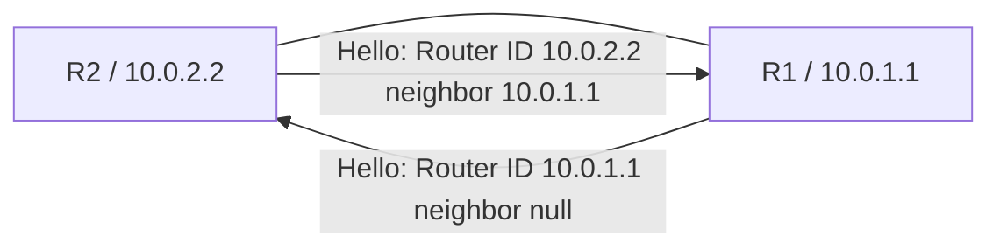

**选项：**
- A. Down
- B. Full
- **C. 2-way**
- D. Loading

**解析：**
```
OSPF邻居状态机：
1. Down：初始状态，没有收到任何Hello报文
2. Init：收到了Hello报文，但报文中没有包含自己的Router ID
3. 2-way：收到了Hello报文，且报文中包含了自己的Router ID，双向通信建立

当R1收到R2发送的Hello报文，且该Hello报文中neighbor字段包含R1的Router ID（10.0.1.1），
说明R2已经认识了R1，此时R1的邻居状态进入2-way状态。
```

---

## 第15题

**题目：** 以下加密算法中，哪一个需要公钥和私钥两种不同的密钥配合使用？

**选项：**
- A. AES
- **B. RSA**
- C. DES
- D. 3DES

**解析：**
```
AES、3DES、DES是对称加密算法，使用相同的密钥进行加密和解密。
只有RSA是一种非对称加密算法，需要使用公钥和私钥两种密钥：
- 公钥用于加密
- 私钥用于解密
```

---

## 第16题

**题目：** 以下关于OSPF协议的描述，错误的是哪一项？

**选项：**
- **A. OSPF是一个基于链路状态的外部网关协议**
- B. OSPF支持对等价路由进行负载分担
- C. OSPF报文封装在IP报文内，可以采用单播或组播的形式发送
- D. OSPF协议支持区域划分

**解析：**
```
OSPF属于IGP（Interior Gateway Protocol，内部网关协议），不是外部网关协议（EGP）。
BGP才是外部网关协议。
```

---

## 第17题

**题目：** 以下关于OSPF的描述，错误的是哪一项？

**选项：**
- **A. 3类LSA中描述的Link State ID为该ABR的Router ID**
- B. 路由信息只允许在骨干区域和非骨干区域之间发布，不允许在非骨干区域之间直接发布路由信息
- C. 每台OSPF路由器只使用一条Router-LSA描述属于一个区域的本地活动连接状态
- D. Router-LSA描述的连接类型共有四种，分别是P2P、TransNet、StubNet和虚链路

**解析：**
```
3类LSA（Network Summary LSA）是由ABR产生的，用于描述区域间的路由信息。
3类LSA中的Link State ID是目的网络的网段地址，而不是ABR的Router ID。
ABR的Router ID出现在Advertising Router字段中。
```

---

## 第18题

**题目：** 以下关于OSPF的描述，正确的是哪一项？

**选项：**
- A. 只有LS Update和LS Request报文携带完整的LSA信息
- B. Hello包的目的地址是224.0.0.5和224.0.0.6
- C. 在ospf mtu-enable命令后，OSPF会检查LSU中的MTU长度，如果和自己发出的报文中MTU长度不一致，则设备维持在Exchange状态
- **D. DD报文中不一定携带链路状态摘要信息，此时该DD报文可以用于协商主从关系**

**解析：**
```
A选项：LS Update报文携带完整的LSA信息，LS Request报文只请求LSA，不携带完整LSA信息。
B选项：Hello包的目的地址通常是224.0.0.5（所有OSPF路由器），在指定路由器上才会同时使用224.0.0.6。
C选项：MTU不一致时，设备会停留在ExStart状态，而不是Exchange状态。
D选项：DD报文有两种：空DD报文（不携带LSA摘要）用于协商主从关系和确定初始序列号，
携带LSA摘要的DD报文用于交换链路状态数据库摘要。所以DD报文不一定携带链路状态摘要信息。
```

---

## 第19题

**题目：** 以下关于PIM-SM(SSM)的描述，错误的是哪一项？

**选项：**
- A. PIM-SM(SSM)无需维护RP
- B. PIM-SM(SSM)模型形成的组播分发树会一直存在，不会因为没有组播流量而消失
- C. PIM-SM(SSM)可以在成员端DR上基于组播源地址直接反向建立SPT
- **D. 在PIM-SM(SSM)中依旧需要注册组播源**

**解析：**
```
SSM（Source-Specific Multicast，指定源组播）提前定义了组播的源地址，因此：
- 不需要维护RP（汇聚点）
- 可以在Receiver-DR上基于组播源地址直接反向建立SPT（最短路径树）
- 不需要注册组播源（因为源是已知的，跳过了ASM中的注册过程）

SSM模型中，组播分发树由接收者主动加入建立，只要有接收者存在，树就会一直存在。
```

---

## 第20题

**题目：** 以下关于IS-IS开销的描述，正确的是哪一项？

**选项：**
- **A. 一条IS-IS路径的Cost等于本路由器到达目标网段沿的所有链路的Cost总和**
- B. 缺省情况下，华为设备接口开销值固定为1
- C. 缺省情况下，华为路由器采用的开销类型是Wide
- D. 华为设备不支持根据接口带宽自动计算开销

**解析：**
```
华为设备支持参考带宽/实际带宽计算开销；
ISIS缺省的开销类型是narrow；
缺省情况下，华为接口开销为10。

A选项正确：IS-IS路径的Cost是从源路由器到目标网段所经过的所有链路的Cost值之和。
```


---

## 第21题

**题目：** 相比较RSTP，MSTP定义了更多的端口角色。如图所示，SW3连接SW5的端口是以下哪一端口角色？

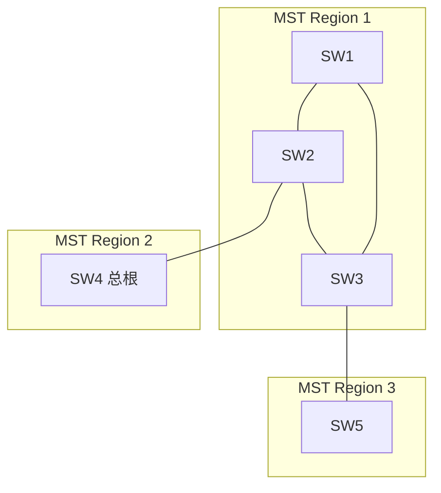

**选项：**
- A. 指定端口
- B. 根端口
- C. Master端口
- **D. 域边缘端口**

**解析：**
```
MSTP中，连接不同MST域的端口为域边缘端口。SW3属于MST Region 1，SW5属于MST Region 3，SW3连接SW5的端口位于两个MST域的边界，因此是域边缘端口。
```

---

## 第22题

**题目：** 以下关于AS_Path的描述，错误的是哪一项？

**选项：**
- **A. 该属性可以确保IBGP对等体之间无环路**
- B. 该属性可以作为BGP选路的条件
- C. 该属性为公认必遵属性
- D. 如果BGP配置了路由聚合，有序AS_Path属性会丢失，可能会存在环路风险

**解析：**
```
AS_Path属性主要用于EBGP之间防止环路，对于IBGP对等体之间，AS_Path不会改变，因此不能确保IBGP对等体之间无环路。IBGP防环依赖于IBGP水平分割（从IBGP对等体学到的路由不会再传给其他IBGP对等体）。
```

---

## 第23题

**题目：** 在建立BGP对等体的过程中，OpenSent状态表明BGP等待的Open报文，并对收到的Open报文中的AS号、版本号和认证码等进行检查。如果发现收到的Open报文有错误，则设备会采取以下哪一项动作？

**选项：**
- A. BGP转至Active状态
- **B. BGP发送Notification报文给对等体，并转至Idle状态**
- C. BGP发送Keepalive报文，并转至OpenConfirm状态
- D. BGP启动连接重传定时器，等待TCP完成连接

**解析：**
```
在OpenSent状态下，如果收到的Open报文有错误（如AS号不匹配、版本号不支持、认证失败等），BGP会发送Notification报文通知对端错误，然后转至Idle状态。
```

---

## 第24题

**题目：** 在WLAN组中，为保证较高的组网可靠性，可使用以下哪一备份技术部署两台同型号但所处异地的AC？

**选项：**
- A. N+1备份
- B. VRRP双机热备
- **C. 双链路热备**
- D. 双链路冷备

**解析：**
```
双链路热备适用于两台AC处于异地的场景，AP可以同时与主备AC建立CAPWAP隧道，主AC故障时AP可快速切换到备AC，保证业务不中断。VRRP要求AC在同一二层网络中，不适用于异地部署。
```

---

## 第25题

**题目：** 以下关于策略路由特点的描述，错误的是哪一项？

**选项：**
- A. 能通过修改路由属性，对网络数据流量可以合理规划，以提高网络性能
- B. 能通过控制路由器的路由表规模，来节约系统资源
- C. 能通过控制路由的接收、发布和引入，以提高网络的安全性
- **D. 能够修改路由属性，但是不能改变网络流量经过的路径**

**解析：**
```
策略路由是在转发层面影响流量走向，可以根据用户制定的策略改变数据包的转发路径，而不仅仅是修改路由属性。路由策略是在控制层面影响路由表，策略路由则直接影响转发行为，可以改变网络流量经过的路径。
```

---

## 第26题

**题目：** 路由器R1和R2的连接和配置如图所示，那么正确的是以下哪一项？

```
R1配置：
[R1]interface GigabitEthernet 0/0/0
[R1-GigabitEthernet0/0/0]ospf network-type p2p
[R1]ospf
[R1-ospf-1]area 0
[R1-ospf-1-area-0.0.0.0]network 10.0.12.1 0.0.0.0

R2配置：
[R2]ospf 100
[R2-ospf-100]area 0
[R2-ospf-100-area-0.0.0.0]network 10.0.12.2 0.0.0.0
```

**选项：**
- A. R1和R2不能建立邻接关系，因为OSPF进程号不一致
- B. R1和R2可以建立邻接关系，并且能完成路由计算
- **C. R1和R2可以建立邻接关系，但是不能完成路由计算**
- D. R1和R2不能建立邻接关系，因为接口的网络类型不一致

**解析：**
```
OSPF进程号只具有本地意义，不影响邻居建立。R1接口网络类型为P2P，R2默认为Broadcast，网络类型不一致会导致无法建立邻接关系。但P2P和Broadcast的Hello时间都是10秒，Dead时间都是40秒，网络类型不匹配时仍可尝试建立，但由于网络类型不同，LSA交互方式不同，最终无法完成正确的路由计算。
注：P2P和Broadcast网络类型不匹配时，实际上是无法建立Full邻接关系的。但根据题目答案选C，即可以建立邻接关系但不能完成路由计算。
```

---

## 第27题

**题目：** 以下关于配置OSPF Stub区域注意事项的描述，正确的是哪一项？

**选项：**
- A. Stub区域可以存在ASBR
- B. 虚连接可以穿越Stub区域
- **C. 如果将一个区域配置成为Stub区域，则该区域中的所有路由器都要配置stub区域属性**
- D. 骨干区域可以配置成为Stub区域

**解析：**
```
Stub区域的特点：
1. Stub区域中不能存在ASBR，因为Stub区域不允许5类LSA存在。
2. 虚连接不能穿越Stub区域。
3. Stub区域中的所有路由器都必须配置stub属性，否则无法建立邻居关系。
4. 骨干区域不能配置为Stub区域。
```

---

## 第28题

**题目：** 如图所示的OSPF网络，R1和R2之间通过四条链路相连，R2的Loopback0接口开启OSPF，在R1的OSPF进程中配置"maximum load-balancing 1"命令，则R1到达R2的Loopback0接口的出接口为以下哪一项？

```
R1与R2之间的四条链路：
GE0/0/0: 10.0.12.1/24 <-> 10.0.12.2/24
GE0/0/1: 10.0.21.1/24 <-> 10.0.21.2/24
GE0/0/2.10: 10.2.21.1/24 <-> 10.2.21.2/24
GE0/0/2.20: 10.1.21.1/24 <-> 10.1.21.2/24
```

**选项：**
- **A. GE0/0/2.20**
- B. GE0/0/0
- C. GE0/0/1
- D. GE0/0/2.10

**解析：**
```
maximum load-balancing 1表示只选择一条最优路由进行负载分担。当有多条等价路由时，OSPF会根据Router ID大小选择下一跳。在四条链路中，子接口GE0/0/2.20对应的IP地址最大，按照OSPF等价路由选路规则，会选择IP地址最大的那个接口作为出接口。
```

---

## 第29题

**题目：** 缺省情况下，广播型网络中运行IS-IS的路由器，DIS发送CSNP报文的周期是以下选项中的哪一项？

**选项：**
- A. 40秒
- **B. 10秒**
- C. 5秒
- D. 30秒

**解析：**
```
在IS-IS广播网络中，DIS（指定中间系统）会周期性地发送CSNP（完全序列号报文）来维护LSDB的同步。缺省情况下，DIS发送CSNP的周期为10秒。
```

---

## 第30题

**题目：** 在IS-IS网络中，定义了多种IS-IS报文类型，它们负责的功能各不相同。其中，用于建立和维持邻接关系的是以下哪一报文类型？

**选项：**
- A. CSNP
- **B. IIH**
- C. PSNP
- D. LSP

**解析：**
```
IIH（Intermediate System to Intermediate System Hello PDU）报文用于建立和维持IS-IS邻居关系，类似于OSPF的Hello报文。CSNP和PSNP用于LSDB同步，LSP用于传递链路状态信息。
```

---

## 第31题

**题目：** 在IS-IS网络中，所有路由器都会产生LSP，但伪节点生成的LSP中，不包含以下哪一种信息？

**选项：**
- A. 邻接信息
- B. 支持的网络协议信息
- **C. 路由信息**
- D. 接口信息

**解析：**
```
伪节点（Pseudonode）是DIS在广播网络中虚拟出来的节点。伪节点生成的LSP中包含邻接信息、支持的网络协议信息和接口信息，但不包含路由信息。路由信息由各路由器自己的LSP来描述。
```

---

## 第32题

**题目：** 在IS-IS网络中，若一台路由器为Level-1-2路由器，那么它发送的IIH报文中的Reserved/CircuitType字段应该表示为以下哪一项？

**选项：**
- A. 01
- B. 00
- **C. 11**
- D. 10

**解析：**
```
Level-1-2路由器同时具有L1和L2的能力，因此在IIH报文中的Circuit Type字段使用11（二进制）来表示。01表示Level-1，10表示Level-2，11表示Level-1-2。
```

---

## 第33题

**题目：** 在BGP中路由聚合可以有效减少BGP路由规模，但是在配置BGP路由聚合时需要诸多参数，否则会引起路由环路等问题。以下关于配置BGP路由聚合的描述，错误的是哪一项？

**选项：**
- **A. 执行命令aggregate，并携带suppress-policy参数时，只发布通过路由策略的被聚合的路由**
- B. 执行命令aggregate，将发布所有聚合路由和被聚合的路由
- C. 执行命令aggregate，并携带detail-suppressed参数时，只发布聚合路由
- D. 执行命令summary automatic，将按照自然网段聚合子网路由

**解析：**
```
suppress-policy参数用于指定哪些被聚合的路由被抑制（不发布），通过路由策略匹配的路由将被抑制不发布，未匹配的路由会被发布。因此A选项说法错误，suppress-policy是抑制（不发布）通过策略的路由，而不是只发布通过策略的路由。
```

---

## 第34题

**题目：** 在OSPF网络中，OSPF根据链路层协议类型，将网络分为了四种网络类型。其中，以组播方式发送所有协议报文的是以下哪一种网络类型？

**选项：**
- A. Broadcast
- B. NBMA
- **C. P2P**
- D. P2MP

**解析：**
```
P2P（点到点）网络类型中，所有协议报文都以组播方式发送（224.0.0.5）。Broadcast网络中，Hello报文以组播发送，但DD、LSR、LSU、LSAck等报文在邻接关系建立后可能使用单播。NBMA网络所有报文都使用单播发送。
```

---

## 第35题

**题目：** 在OSPF广播型网络中，所有OSPF路由器进行报文交互时，使用的2层组播地址是以下哪一项？

**选项：**
- A. 01-00-5e-00-00-01
- B. 01-00-5e-00-00-06
- **C. 01-00-5e-00-00-05**
- D. 01-00-5e-00-00-02

**解析：**
```
224.0.0.5是所有OSPF路由器所使用的组播地址，对应的MAC地址是01-00-5e-00-00-05。
```

---

## 第36题

**题目：** 在OSPF网络中，LSDB用于存放LSA条目，常见的LSA类型主要有路由器LSA、网络LSA等。通常情况下，可使用LSA三元组来唯一标识一条LSA，那么该三元组中不包括以下哪一项？

**选项：**
- A. LS Type
- B. Link State ID
- **C. LS Sequence Number**
- D. Advertising Router

**解析：**
```
LSA三元组由LS Type、Link State ID和Advertising Router（通告路由器）组成，用于唯一标识一条LSA。LS Sequence Number是LSA的序列号，用于判断LSA的新旧，不属于LSA三元组。
```

---

## 第37题

**题目：** 缺省情况下，OSPF的P2P和Broadcast网络类型中接口的Dead time是以下哪一时长？

**选项：**
- **A. 40秒**
- B. 10秒
- C. 60秒
- D. 120秒

**解析：**
```
OSPF中，P2P和Broadcast网络类型的缺省Hello时间为10秒，Dead time为Hello时间的4倍即40秒。NBMA和P2MP网络类型的缺省Hello时间为30秒，Dead time为120秒。
```

---

## 第38题

**题目：** 以下关于BGP协议的描述，错误的是哪一项？

**选项：**
- A. BGP非周期性通告路由信息
- B. 如果路由器system视图下和BGP视图下都配置了router-id，优选BGP视图下的router-id
- **C. 因为BGP只选择最优路由，所以无法实现负载分担**
- D. 协议首选值是华为设备的特有属性，仅在本地有效

**解析：**
```
BGP虽然默认只选择一条最优路由，但可以通过配置实现负载分担（如maximum load-balancing命令），因此BGP是可以实现负载分担的。协议首选值（PrefVal）是华为设备特有属性，仅本地有效。
```

---

## 第39题

**题目：** 当一台运行了BGP的路由器收到邻居发送来的路由时，发现该路由不可达。那么该设备会采取以下哪一项措施？

**选项：**
- A. 接收该路由，并加入到IP路由表中
- B. 直接丢弃该路由
- C. 向该邻居回复一个错误消息报文来通知该路由不可达
- **D. 接收该路由，并加入到BGP路由表中**

**解析：**
```
BGP路由器会接收所有从邻居收到的路由信息，并将其记录在BGP路由表中，无论这些路由是否可达。BGP路由表包含所有收到的路由，之后会进行优选，优选后的路由才会加入IP路由表。
```

---

## 第40题

**题目：** 在华为交换机中，以下哪一个平面提供了数据平面转发前所必须知晓的网络信息和转发查询表项？

**选项：**
- A. 监控平面
- B. 数据平面
- **C. 控制平面**
- D. 转发平面

**解析：**
```
控制平面负责计算和生成转发表项（如路由表、ARP表、MAC地址表等），为数据平面的转发提供依据。数据平面/转发平面负责实际的数据转发。表项建立由控制层面完成。
```

---

## 第41题

**题目：** 在组播中优选RPF路由要遵循一定原则进行匹配，那么以下原则中，不属于优选RPF路由原则的是哪一项？

**选项：**
- A. 路由优先级(Pre值)
- B. 掩码最长匹配
- C. 组播静态路由 > MBGP路由 > 单播路由
- **D. 接口开销最小**

**解析：**
```
RPF路由优选原则包括：掩码最长匹配、路由优先级（Pre值）、路由类型优先级（组播静态路由 > MBGP路由 > 单播路由）。接口开销最小不属于RPF优选原则。
```

---

## 第42题

**题目：** 在IPv4地址空间中，D类地址被用于组播。在D类地址范围内，以下哪一项属于为路由协议预留的永久组地址？

**选项：**
- A. 232.0.0.0-232.255.255.255
- B. 239.0.0.0-239.255.255.255
- **C. 224.0.0.0-224.0.0.255**
- D. 224.0.1.0-231.255.255.255

**解析：**
```
224.0.0.0~224.0.0.255为永久组地址（也称为保留组地址），为路由协议预留，用于标识本地网络段上的特定网络设备。232.0.0.0/8为SSM组地址范围，239.0.0.0/8为本地管理组地址，224.0.1.0~231.255.255.255为任何源的组播地址。
```

---

## 第43题

**题目：** 一般情况下通信过程中需要占用两个端口的协议称为多通道协议，此时需要防火墙上开启ASP功能在保障数据通道顺利建立的同时减少被攻击的风险。那么以下协议中，不属于多通道协议的是哪一项？

**选项：**
- A. 323
- B. FTP
- **C. SMTP**
- D. SIP

**解析：**
```
多通道协议使用一个控制端口和一个或多个数据端口。FTP使用21号控制端口和动态数据端口，H.323和SIP都是多媒体协议，使用固定端口来协商动态端口。SMTP只使用25号端口进行通信，属于单通道协议。
```

---

## 第44题

**题目：** BFD是一种高可靠性的快速故障检测机制，可以检测多个网络层次的通道。BFD本身属于以下哪一层次的协议？

**选项：**
- A. 网络层
- B. 物理层
- C. 数据链路层
- **D. 应用层**

**解析：**
```
BFD本身是一种应用层协议，基于传输层的UDP协议，其报文类型分为控制报文和回声报文。BFD可以检测多个网络层次的通道故障。
```

---

## 第45题

**题目：** 在SNMP管理模型中，以下哪一项元素用于定义被管理设备的属性？

**选项：**
- A. Managed Object
- B. Agent
- C. NMS
- **D. MIB**

**解析：**
```
MIB（管理信息库）定义了被管理设备的各种属性，包括网络设备、服务器、路由器等的信息和参数。NMS是网络管理系统，Agent是代理进程，Managed Object是被管理对象。
```

---

## 第46题

**题目：** 在WLAN网络中，MAC认证是一种基于接口和终端MAC地址对用户的访问权限进行控制的认证方法，那么以下关于MAC认证的描述，错误的是哪项？

**选项：**
- A. 终端无需安装任何客户端软件
- B. MAC认证中，对于用户密码的处理有PAP和CHAP两种方式
- **C. 缺省情况下，终端进行MAC认证时使用的用户名是终端MAC地址，密码是终端MAC地址后六位(16进制)**
- D. MAC认证系统包括终端、接入设备和认证服务器三个组成部分

**解析：**
```
MAC认证缺省情况下，用户名和密码都是终端的MAC地址，而不是密码为MAC地址后六位。MAC认证不需要终端安装客户端软件，支持PAP和CHAP认证方式。
```

---

## 第47题

**题目：** 在OSPF网络中，OSPF邻居状态有Down、Init、2-way、Loading、Full等多种状态机。其中，OSPF路由器协商主从关系，是发生在哪一状态机？

**选项：**
- A. 2-way
- B. Exchange
- C. Init
- **D. ExStart**

**解析：**
```
OSPF邻居状态机中，ExStart状态用于协商主从关系并确定初始DD报文的序列号。Router ID大的一方为Master。Exchange状态用于交换DD报文摘要信息，Loading状态用于请求和交换完整的LSA信息。
```

---

## 第48题

**题目：** 某工程师在配置组播协议时未经过版本比对，结果设备配置的IGMP Snooping版本比用户主机的IGMP版本低。此时会发生以下哪一种情况？

**选项：**
- A. 主机的IGMP版本自动升级，用户正常收到组播数据
- B. 用户无法收到组播数据，但是设备在收到IGMP Report报文后会生成转发表项
- **C. 用户无法收到组播数据，因为设备在收到IGMP Report报文后，只会向路由器端口转发，不会生成成员端口和转发表项**
- D. 设备IGMP Snooping版本自动进行降低兼容，用户正常收到组播数据

**解析：**
```
当IGMP Snooping版本比主机IGMP版本低时，设备无法识别高版本的IGMP Report报文，收到后只会向路由器端口转发，不会生成成员端口和转发表项，导致用户无法收到组播数据。
```

---

## 第49题

**题目：** 安全策略的主要目标是降低入侵成功率和发现攻击者，为了确保在攻击的整个生命周期内进行检测和预防，需要制定一系列的规划。以下关于规划安全策略的描述，错误的是哪一项？

**选项：**
- A. 对于未知威胁的文件可以送往沙箱进行检测，并且防火墙定时读取沙箱的检测结果，且根据检测结果对后续流量进行阻断
- B. 管理员有必要在设置前全面了解网络中的应用、用户和内容，这是设置安全策略的前提，以便防火墙可以检查对应的用户流量
- C. 为了进一步减少攻击面，请在允许某应用的安全策略基础上开启URL过滤和文件过滤等功能，阻止用户访问高风险网站和下载高危文件
- **D. 在所有动作为允许的安全策略规则中尽量不引用内容安全配置文件，以便快速检查**

**解析：**
```
为了保障网络安全，在允许的安全策略中应该引用内容安全配置文件（如反病毒、入侵防御等）进行深度检测，而不是尽量不引用。不引用内容安全配置文件虽然可以加快检查速度，但会降低安全性。
```

---

## 第50题

**题目：** 在MST域内，MSTP根据VLAN和生成树实例的映射关系，针对不同的VLAN生成不同的生成树实例。以下关于生成树实例的特点，描述错误的是哪一项？

**选项：**
- **A. 每个端口在不同MSTI上的生成树参数需要相同**
- B. 每个MSTI只在自己的生成树内发送BPDU
- C. 每MSTI的生成树计算方法与STP基本相同
- D. 每个MSTI的生成树可以有不同的根，不同的拓扑

**解析：**
```
每个端口在不同MSTI上的生成树参数可以不同，这样才能实现流量的负载分担。每个MSTI独立计算生成树，可以有不同的根桥和拓扑，计算方法与STP基本相同。
```

---

## 第51题

**题目：** 如图所示，R1将直连路由10.1.1.0/24引入到了OSPF中，现用户在R2和R3上执行了双向路由重发布。等网络稳定后，用户在R3上查看路由表中的10.1.1.0/24路由条目时，其Pre值为以下哪一数值？

```mermaid
graph LR
    R1 -- OSPF区域 -- R2
    R1 -- OSPF区域 -- R3
    R2 -- IS-IS区域 -- R4
    R3 -- IS-IS区域 -- R4
    R1 -- 引入直连10.1.1.0/24 --- R1
```

**选项：**
- A. 0
- B. 10
- **C. 15**
- D. 150

**解析：**
```
10.1.1.0/24由R1作为外部路由引入OSPF，OSPF外部路由的优先级为150。但经过R2和R3的双向重发布后，路由会从IS-IS重新传回OSPF。在R3上，该路由同时从OSPF（优先级150）和IS-IS两个来源学习到。IS-IS Level-1优先级为15，Level-2优先级也为15。由于IS-IS优先级15高于OSPF外部路由优先级150，R3会优选IS-IS路由，Pre值为15。
```

---

## 第52题

**题目：** BGP在选择路由时严格按照先后顺序比较路由的属性，如果通过前面的属性就可以选出最优路由。BGP将不再比较后面的属性。因此当出现以下属性时。BGP选路会先比较哪一属性？

**选项：**
- A. Local_Pref
- B. AS_Path
- C. Origin
- **D. PrefVal**

**解析：**
```
BGP选路顺序中，首先比较的是PrefVal（协议首选值），其次是Local_Pref、本地路由、AS_Path、Origin、MED、EBGP优于IBGP等。PrefVal是华为设备特有属性，数值越大越优先。
```

---

## 第53题

**题目：** IS-IS网络中，可将一个AS划分为骨干区域和非骨干区域。其中，骨干区域可以存在的IS-IS路由器是以下哪一项？

**选项：**
- A. Level-1
- **B. Level-1-2和Level-2**
- C. Level-2
- D. Level-1-2

**解析：**
```
IS-IS骨干区域中可以存在Level-2路由器和Level-1-2路由器。Level-1路由器只能存在于非骨干区域中。Level-1-2路由器同时属于骨干区域和非骨干区域，负责区域间路由的传递。
```

---

## 第54题

**题目：** 在OSPF网络中，两台直连路由器建立邻居关系失败，管理员在其中一台路由器上执行命令Display ospf error的回显如下。那么通过回显信息分析，可以得出造成该问题的原因是以下哪一项？

```
<AR2>display ospf error

OSPF Process 1 with Router ID 1.1.1.1
OSPF error statistics

General packet errors:
0     : Bad version                     0     : Bad packet
0     : Bad area id                     0     : Bad checksum
0     : Bad virtual link                0     : Drop on unnumbered interface
0     : Bad authentication type         0     : Bad authentication key
0     : Packet too small                0     : Packet size > ip length
0     : Interface down                  0     : Transmit error
0     : Bad net segment                 0     : Unknow neighbor
3     : Router id confusion             0     : Extern option mismatch

HELLO packet errors:
0     : Netmask mismatch                0     : Hello timer mismatch
0     : Dead timer mismatch             0     : Virtual neighbor unknown
0     : NBMA neighbor unknown           0     : Invalid Source Address

DD packet errors:
0     : Neighbor state low              0     : Unknown LSA type
0     : MTU option mismatch

LS ACK packet errors:
0     : Neighbor state low              0     : Unknown LSA type
```

**选项：**
- A. OSPF Auth Data一致
- **B. OSPF Router ID一致**
- C. OSPF Auth Type一致
- D. OSPF Area ID一致

**解析：**
```
从display ospf error的输出中可以看到"Router id confusion"错误计数为3，说明两台路由器的Router ID相同，导致OSPF邻居无法正常建立。
```

---

## 第55题

**题目：** 在OSPF网络中，OSPF定义了多种网络类型，其中，必须由网络工程师手工指定的是以下哪一种网络类型？

**选项：**
- A. P2P
- B. Broadcast
- C. NBMA
- **D. P2MP**

**解析：**
```
没有任何链路网络被默认为是P2MP的，必须手工指定。链路为PPP、HDLC时，默认为P2P网络；链路为以太网时，默认为Broadcast网络；链路为FR时，默认为NBMA网络。
```

---

## 第56题

**题目：** 在OSPF网络中，为了减少LSDB的大小，提升设备的性能，OSPF定义了多种特殊区域。其中，在完全STUB区域中，不可能存在以下哪一类LSA？

**选项：**
- A. 1类LSA
- **B. 3类明细LSA**
- C. 2类LSA
- D. 描述缺省路由的3类LSA

**解析：**
```
完全Stub区域（Totally Stub Area）中，不允许存在3类明细LSA、4类LSA和5类LSA，只允许存在1类LSA、2类LSA和一条描述缺省路由的3类LSA。
```

---

## 第57题

**题目：** 如图所示为某企业OSPF网络，R1的OSPF相关配置如图中所示。那么以下关于该组网的描述，错误的是哪一项？

```
[R1]ospf
[R1-ospf-1]area 0
[R1-ospf-1-area-0.0.0.0]network 192.168.4.0 0.0.0.255
[R1-ospf-1]silent-interface GigabitEthernet 0/0/1
```

```mermaid
graph LR
    R2 -- Area 0 -- R1
    R1 -- GE0/0/1 192.168.4.0/24 -- Server[Server]
```

**选项：**
- A. R1的GE0/0/1接口将不能发送OSPF报文
- B. R1的GE0/0/1接口将不能接收OSPF报文
- C. R2能正常访问Server
- **D. R1接口GE0/0/1所属网段将不能发布出去**

**解析：**
```
silent-interface命令使接口不发送也不接收OSPF报文，但该网段仍然会通过network命令发布到OSPF中，作为直连路由通告给其他OSPF路由器。因此R2能够学到192.168.4.0/24网段，可以正常访问Server。
```

---

## 第58题

**题目：** Smurf攻击一般使用以下哪一种协议？

**选项：**
- A. TCP
- B. DHCP
- C. BGP
- **D. ICMP**

**解析：**
```
Smurf攻击是一种特殊的网络攻击技术，主要通过网络伪造大量ICMP响应数据包来进行。攻击者向广播地址发送ICMP Echo请求，且将源地址伪装为目标主机地址，导致大量ICMP Echo Reply回复涌向目标主机，耗尽其资源。
```

---

## 第59题

**题目：** 以下关于OSPFv3类LSA、4类LSA和5类LSA的描述，正确的是哪一项？

**选项：**
- A. 4类LSA在穿越不同区域后，不会发生改变，而3类LSA和5类LSA会发生变化
- B. 3类LSA、4类LSA和5类LSA在穿越不同区域后，都不会发生改变
- **C. 5类LSA在穿越不同区域后，不会发生改变，而3类LSA会发生变化**
- D. 3类LSA在穿越不同区域后，不会发生改变，而4类LSA和5类LSA会发生变化

**解析：**
```
5类LSA（AS外部LSA）在整个AS中泛洪，穿越不同区域时不会发生变化。3类LSA（网络汇总LSA）是由ABR生成的，每穿越一个区域都会由该区域的ABR重新生成，因此会发生变化。4类LSA（ASBR汇总LSA）也是由ABR生成，穿越区域时也会变化。
```

---

## 第60题

**题目：** RSTP协议存在几种端口状态？

**选项：**
- A. 1
- B. 2
- C. 4
- **D. 3**

**解析：**
```
RSTP协议定义了三种端口状态：
1. Discarding（丢弃状态）：不转发数据、不学习MAC、发送/接收BPDU
2. Learning（学习状态）：不转发数据、学习MAC、发送/接收BPDU
3. Forwarding（转发状态）：转发数据、学习MAC、发送/接收BPDU

RSTP将STP的Disabled、Blocking、Listening三种状态合并为Discarding状态。
```

---

## 第61题

**题目：** 以下关于OSPF DD报文的描述，正确的是哪一项？

**选项：**
- **A. 只有在Exchange状态下传输的DD报文才会携带链路状态信息**
- B. OSPF在交互DD报文时，必须要确定主从关系Router ID小的一方作为Master
- C. DD报文携带完整的链路状态信息
- D. DD报文出现在Exstart、Exchange和Loading三个阶段

**解析：**
```
DD报文只携带LSA的摘要信息（头部），不携带完整的链路状态信息。ExStart状态协商主从关系，此时DD报文不携带LSA摘要；Exchange状态下的DD报文才携带LSA摘要信息。Router ID大的一方为Master。Loading阶段使用LSR/LSU/LSAck报文，不再使用DD报文。
```

---

## 第62题

**题目：** 当BGP对等体关系建立后，通过Keepalive报文维持BGP对等体关系。默认情况下Keepalive报文的发送间隔是以下哪一项？

**选项：**
- A. 180秒
- B. 90秒
- **C. 60秒**
- D. 150秒

**解析：**
```
BGP默认Keepalive报文发送间隔为60秒，Hold time（保持时间）为180秒，是Keepalive时间的3倍。
```

---

## 第63题

**题目：** 以下描述中属于EasyIP特有的特征是哪一项？

**选项：**
- A. 当公网地址分配完之后剩余的私网地址不能再进行转换
- B. 在进行网络地址转换的时候不会转换端口号
- C. 每一个私有地址都具有一个公网地址与之对应转换
- **D. 公网地址可以不固定**

**解析：**
```
Easy-IP不需要创建公网地址池，直接使用接口地址作为NAT转换的公网地址。当接口地址变化时（如拨号获取的动态IP），NAT会自动使用新的接口地址，因此公网地址可以不固定。
```

---

## 第64题

**题目：** 在宿舍、酒店和病房等房间密集的场景中，若每个房间都布放一个AP，会造成大量报文上送到AC容易造成AC出现性能瓶颈。为了应对这种问题，可以采用以下哪一种组网架构来部署？

**选项：**
- A. AC+FIT AP
- **B. 敏捷分布式AP**
- C. Leader AP
- D. FAT AP

**解析：**
```
敏捷分布式AP组网架构中，中心AP负责与AC交互，远端单元（RU）负责提供无线接入。大量RU的报文由中心AP汇聚后再上送AC，减轻了AC的压力，适合房间密集、AP数量多的场景。
```

---

## 第65题

**题目：** OSPF路由过滤不支持以下哪一种策略工具？

**选项：**
- A. Route-Policy
- **B. ip as-path-filter**
- C. ACL
- D. 前缀列表

**解析：**
```
OSPF路由过滤支持使用ACL、前缀列表、Route-Policy等策略工具。ip as-path-filter是BGP特有的过滤工具，用于匹配AS_Path属性，OSPF中不支持。
```

---

## 第66题

**题目：** 以下关于前缀列表的描述，正确的是哪一项？

**选项：**
- **A. 前缀列表不仅能在BGP中使用，还能在IGP中使用**
- B. 将前缀列表应用在端口上时，可以选定in方向和out方向
- C. 使用reset ip-prefix命令能够重置前缀列表，以重新匹配路由
- D. 前缀列表匹配的是去往某一网段的路由，和ACL的作用完全相同

**解析：**
```
前缀列表（Prefix List）基于路由前缀（IP地址+掩码）进行过滤，可用于BGP和IGP等多种路由协议。前缀列表不能直接应用在端口上，而是用于路由策略中。前缀列表与ACL作用不同，ACL主要用于过滤数据包，前缀列表用于过滤路由。
```

---

## 第67题

**题目：** 以下关于PIM-SM中RP的描述，错误的是哪一项？

**选项：**
- A. 共享树里所有组的初始组播都通过RP转发到接收者
- B. RP可以负责几个或者所有组播组的转发
- **C. 一个RP可以同时为多个组播组服务，一个组播组能对应多个RP**
- D. 静态指定RP时，需在网络中所有PIM路由器上配置相同的IP地址

**解析：**
```
一个RP可以同时为多个组播组服务，但一个组播组只能对应一个RP。如果存在多个RP，需要通过BSR机制选举出唯一的RP为某个组服务。
```

---

## 第68题

**题目：** IGMPv2使用独立的查询器选举机制，当共享网段上存在多个组播路由器时，以下哪一项参数是查询器选举的条件？

**选项：**
- A. 优先级
- **B. 接口IP地址**
- C. Loopback0地址
- D. MAC地址

**解析：**
```
IGMPv2的查询器选举机制基于接口IP地址。当共享网段存在多个组播路由器时，各路由器通过比较各自接口的IP地址，选择IP地址最小的接口对应的路由器作为查询器。
```

---

## 第69题

**题目：** 以下关于IPv6重复地址检测的描述，错误的是哪一项？

**选项：**
- A. 接口在启用任何一个单播IPv6地址前都需要先进行DAD，包括Link-Local地址
- **B. 若两个节点配置相同地址，同时作重复地址检测时，当一方收到对方发出的DAD NA报文，则接收方将不启用该地址**
- C. 在节点自动配置某个接口的IPV6单播地址之前，必须在本地链路范围内验证要使用的地址是唯一的，并且未被其他节点使用过
- D. 一个地址在通过重复地址检测之前称为tentative地址，此时该接口不能使用这个试验地址进行单播通讯

**解析：**
```
DAD检测中，节点发送NS报文，如果收到NA报文则说明地址冲突。两个节点同时进行DAD时，都会发送NS报文。当一方收到对方的NS报文（不是NA报文）且目标地址与自己的tentative地址相同时，才会判定地址冲突并停止使用该地址。B选项说收到NA报文，说法有误。
```

---

## 第70题

**题目：** 四台路由器运行IS-IS且已经建立邻接关系，区域号和路由器的等级如图所示，以下描述正确的是哪一项？


**选项：**
- A. R2路由器的LSDB中不存在R4的LSP
- B. R3路由器的LSDB中不存在R4的LSP
- C. R2路由器的LSDB中不存在R3的LSP
- **D. R1路由器的LSDB中不存在R4的LSP**

**解析：**
```
R1是Level-1路由器，只在Area 49.001区域内，只能学到本区域内的LSP。R4位于Area 49.004区域，且R4是Level-2路由器。Level-1路由器的LSDB中只包含本区域的LSP，不包含其他区域的Level-2 LSP。因此R1的LSDB中不存在R4的LSP。
```

---

## 第71题

**题目：** 某管理员需要创建AS_Path过滤器(ip as-path-filter)，允许AS_Path中包含65001的路由通过，那么以下哪一项配置是正确的？

E. ip as-path-filter 1 permit *65001*
F. ip as-path-filter 1 permit 65001
**选项：**
- **A. ip as-path-filter 1 permit _65001_**
- B. ip as-path-filter 1 permit '65001'
- C. ip as-path-filter 1 permit ^65001^
- D. ip as-path-filter 1 permit ^65001_

**解析：**
```
AS_Path过滤器使用正则表达式匹配路由的AS路径。`_65001_`表示匹配包含65001的AS路径，下划线_表示AS号的边界（可以是起始、结束或空格分隔）。`^65001_`表示匹配以65001开头的AS路径。要包含65001（即65001出现在任意位置），应使用`_65001_`。
```

---

## 第72题

**题目：** 以下关于路由注入的描述，错误的是哪一项？

**选项：**
- **A. 外部路由引入到BGP时，默认preference为200**
- B. OSPF NSSA区域中的路由器将外部路由引入时默认的Metric-Type为2
- C. 外部路由引入到IS-IS中时，默认等级为Level-2
- D. OSPF普通区域中的路由器将外部路由引入时默认的Metric-Type为2，但是可以使用Route-Policy工具修改Metric-Type

**解析：**
```
BGP外部路由引入时，默认的preference值不是固定的200。BGP的优先级分为：EBGP路由优先级为255，IBGP路由优先级为255。引入的外部路由在BGP中优先级取决于配置。实际上，华为设备中BGP路由的默认preference为255（EBGP和IBGP都是255），而不是200。
```

---

## 第73题

**题目：** 在OSPF网络中，OSPF Area用于标识一个OSPF区域。若某OSPF区域ID为Area 0.0.1.0，则等同于以下哪个Area ID？

**选项：**
- A. Area 1
- B. Area 255
- **C. Area 256**
- D. Area 10

**解析：**
```
OSPF区域ID采用32位IP地址格式表示。Area 0.0.1.0转换为十进制数值为：0*256^3 + 0*256^2 + 1*256 + 0 = 256。因此等同于Area 256。
```

---

## 第74题

**题目：** 在OSPF网络中，DRother给DR/BDR路由器发送DD报文时，使用的组播地址是以下哪一个？

**选项：**
- **A. 224.0.0.6**
- B. 224.0.0.2
- C. 224.0.0.1
- D. 224.0.0.5

**解析：**
```
224.0.0.6是AllDRouters组播地址，DRother发送给DR和BDR的报文（包括DD、LSR、LSU、LSAck等）使用该地址。224.0.0.5是AllSPFRouters组播地址，所有OSPF路由器都监听。Hello报文使用224.0.0.5。
```

---

## 第75题

**题目：** 在RSTP网络中，可通过配置交换机的STP优先级来指定某台设备作为根桥。缺省情况下，华为交换机的STP优先级为以下哪一数值？

**选项：**
- A. 1
- B. 128
- **C. 32768**
- D. 4096

**解析：**
```
华为交换机缺省的STP优先级为32768。优先级数值越小，越有可能成为根桥。优先级步长为4096，可配置范围为0-61440。
```

---

## 第76题

**题目：** 邻居发现协议NDP是IPV6协议体系中一个重要的基础协议，以下关于该协议的描述，错误的是哪一项？

**选项：**
- A. 可以使用三层的安全机制避免地址解析攻击
- B. 邻居发现协议可实现IPv4中ARP的功能
- C. 使用组播方式发送请求报文，减少了二层网络的性能压力
- **D. 地址解析在二层完成，不同的二层介质采用相同的地址解析协议**

**解析：**
```
NDP的地址解析功能是在三层完成的，使用ICMPv6报文实现，不同的二层介质可以采用相同的地址解析协议（即NDP）。D选项说地址解析在二层完成，是错误的。ARP是在二层完成的，而NDP是在三层完成的。
```

---

## 第77题

**题目：** SSH是一种安全的协议，可以为用户在非安全的网络上构建隧道，从而保障数据的安全。以下关于用户通过SSH方式登录设备的描述，错误的是哪一项？

**选项：**
- **A. 缺省情况下，SSH服务器的端口号为23，可以修改SSH Server的端口为非知名端口，减小被扫描攻击的概率**
- B. SSH Server支持认证，只有通过认证的用户才能登录设备
- C. 可以配置各个VTY通道的ACL过滤规则，通过ACL控制允许登录的客户端IP
- D. 当开启SSH Server服务器时，设备将开启Socket获取服务，易被攻击者扫描。因此当不使用SSH Server时，可以关闭SSH Server和相应的端口号

**解析：**
```
SSH服务器缺省端口号为22，不是23。Telnet的缺省端口号才是23。可以修改SSH Server的端口号来增强安全性。
```

---

## 第78题

**题目：** GRE是一种VPN封装技术，被广泛用于跨越异种网络的报文传输问题。以下关于该协议的描述，错误的是哪一项？

**选项：**
- A. GRE可以和其他VPN协议联合使用来进一步保障数据安全
- B. GRE是一种三层VPN封装技术
- C. GRE可以支持组播传输
- **D. GRE支持加密和认证**

**解析：**
```
GRE（通用路由封装）本身不提供加密和认证功能，它只是一种封装技术。GRE可以和IPSec等其他安全协议联合使用来提供加密和认证。GRE支持组播传输，是一种三层VPN封装技术。
```

---

## 第79题

**题目：** 为了减少用户主机所在网段内的IGMP协议报文数量，可以在二层设备上部署IGMP snooping proxy功能，但是IGMP snooping proxy对接收到的协议报文的处理方式并非完全一致，以下关于该协议处理报文方式的描述，错误的是哪一项？

**选项：**
- **A. 如果收到的是IGMP报告报文，会直接丢弃**
- B. 如果收到的是普遍组查询报文，会向本VLAN内除接收接口以外的所有接口发送IGMP普遍组查询报文
- C. 如果收到的是IGMP特定源组查询报文，会直接丢弃
- D. 如果收到的是IGMP特定组查询报文，会直接丢弃

**解析：**
```
IGMP Snooping Proxy收到IGMP报告报文（Report）时，不会直接丢弃，而是会进行处理并向路由器端口转发。IGMP Snooping Proxy代理主机向路由器发送Report报文，代理路由器向主机发送Query报文。
```

---

## 第80题

**题目：** IGMP Snooping是组播协议中一个重要的协议，以下关于该协议的描述，错误的是哪一项？

**选项：**
- A. IGMP Snooping通过侦听三层组播设备和用户主机之间发送的组播协议报文来维护组播报文的出接口信息
- **B. 设备运行了IGMP Snooping后，收到不同的IGMP协议报文会进行相同的处理**
- C. IGMP Snooping是二层组播协议
- D. 根据IGMP Snooping建立的组播转发表项中包含路由器端口和成员端口

**解析：**
```
设备运行IGMP Snooping后，对不同的IGMP协议报文（如Report报文、Leave报文、Query报文）会进行不同的处理，以维护组播组成员关系和转发表项。IGMP Snooping是二层组播协议，通过侦听IGMP报文来维护组播转发表。
```

---

## 第81题

**题目：** IPV4无法支持以下哪一种地址类型？

**选项：**
- A. 组播
- **B. 任播**
- C. 单播
- D. 广播

**解析：**
```
这道题考查对IPv4地址类型的了解。IPv4常见的地址类型有单播、组播和广播。在网络通信中，任播是IPv6引入的新地址类型，IPv4不支持。所以这道题应选B选项。
```

---

## 第82题

**题目：** MPLS VPN网络一般由运营商搭建，VPN用户购买VPN服务来实现用户网络之间的数据互通。在MPLS VPN网络中存在诸多设备角色，其中以下哪一项设备角色是运营商网络中的骨干路由器，不与CE直接相连？

**选项：**
- A. Client
- B. Customer Edge
- C. Provider Edge
- **D. Provider**

**解析：**
```
MPLS VPN网络主要由运营商搭建，用户通过购买VPN服务来实现网络之间的数据互通。在MPLS VPN网络中，存在多种设备角色：CE（Customer Edge，用户边缘设备）、PE（Provider Edge，运营商边缘设备）和P（Provider，运营商骨干设备）。其中，P设备是运营商网络中的骨干路由器，不与CE直接相连。
```

---

## 第83题

**题目：** IPv6中定义了多种地址类型，以下关于这些地址的描述，错误的是哪一项？

**选项：**
- **A. 任播地址只能作为目的地址使用**
- B. 链路本地地址可以采用EUI-64方式快速生成
- C. 每个接口可以有多个网络前缀不同的全球单播地址
- D. 配置链路本地地址时，手工指定方式的优先级高于自动生成方式

**解析：**
```
此题有歧义，ABCD描述均正确，根据之前考生反馈，A选项被标记为错误答案。任播地址在IPv6中可以作为源地址或目的地址使用，该说法存在争议。
```

---

## 第84题

**题目：** 在IS-IS网络中，NET的长度与NSAP的相同，其组成部分也相同。其中，以下NET所含字段中，用来在区域内唯一标识主机或路由器的是哪一项？

**选项：**
- A. Area Address
- B. IDI
- **C. System ID**
- D. SEL

**解析：**
```
在IS-IS（Intermediate System to Intermediate System，中间系统到中间系统）网络中，NET（Network Entity Title）由三部分组成：Area Address（区域地址）、System ID（系统ID）和SEL（NSEL，选择符）。其中，System ID用来在区域内唯一标识主机或路由器，长度固定为6字节。
```

---

## 第85题

**题目：** 管理员在设备上通过as-path-fiter定义了过滤器s1，并向BGP邻居通告，具体配置如下。配置完成后可以从邻居获取以下哪一种类型的路由？

```
[SW1] ip as path-filter s1 permit _65500$
[SW1] bgp 65100
[SW1-bgp] ipv4 family unicast
[SW1-bgp-af-ipv4] peer 10.1.1.2 as path-filter s1 import
```

**选项：**
- A. 只接收包含AS65500的路由
- B. 只接收最后经过的自治系统为AS65500的路由
- C. 只接收从AS65500中转过来的路由
- **D. 只接收AS65500始发的路由**

**解析：**
```
as path-filter中的正则表达式"_65500$"表示AS_Path以65500结尾，即路由的始发AS为65500。"$"表示结尾，"_"匹配AS号之间的分隔符。所以该过滤器只允许AS65500始发的路由通过。
```

---

## 第86题

**题目：** IP-Prefix是路由策略中常用的匹配工具，在华为路由器配置IP-Prefix时，其匹配项不可能包含以下哪一项？

**选项：**
- A. 序号
- **B. 端口号**
- C. 掩码
- D. 动作

**解析：**
```
这道题考查对华为路由器配置IP-Prefix匹配工具的了解。在路由策略中，IP-Prefix常用的匹配项包括序号、掩码和动作。而端口号通常不是其配项。因为IP-Prefix主要针对IP地址相关的参数进行匹配，不涉及端口号。
```

---

## 第87题

**题目：** IGMP有三个版本，不同版本支持的特性有所区别。以下哪一项是所有版本均支持的特性？

**选项：**
- A. 成员离开报文
- B. 特定组查询报文
- C. 指定组播源
- **D. 成员报告报文**

**解析：**
```
IGMP是Internet Group Management Protocol的缩写，中文名为因特网组管理协议。这个协议设计用来管理IP多播成员身份。其多个版本如IGMPv1、IGMPv2、IGMPv3等都存在一定程度的特性差异，但所有版本的IGMP版本中，成员报告报文都是必须支持的。
```

---

## 第88题

**题目：** Wi-Fi 6作为新一代无线技术，极大地提升了带宽速率，并提供了更高的性能。以下关于Wi-Fi 6特性的描述，错误的是哪一项？

**选项：**
- A. 采用OFDMA技术，实现高并发
- B. 速率高达9.6Gbps，提供大带宽
- C. 采用TWT技术，降低终端耗电
- **D. 零时延，保障业务高效运行**

**解析：**
```
Wi-Fi6确实代表了无线技术的最新进展，具有多项新的特性和改进。针对所给的选项，我们可逐一分析：A选项正确。Wi-Fi6采用了OFDMA（正交频分多址）技术，该技术允许在相同的频率上同时与多个终端进行数据传输，从而提升并发能力。B选项正确。Wi-Fi6理论速率可以达到较高的数值。C选项正确。TWT（目标唤醒时间）技术可以降低终端耗电。D选项错误。Wi-Fi6虽然降低了时延，但不能实现零时延。
```

---

## 第89题

**题目：** 以下关于常见动态路由协议的描述，正确的是哪一项？

**选项：**
- A. OSPF运行在IP协议基础之上，采用的协议号是90
- B. ISIS运行在IP协议基础之上，采用的协议号89
- **C. BGP邻居关系建立在TCP会话基础之上的，采用的端口号是179**
- D. BGP运行在UDP会话基础之上，采用的端口号是179

**解析：**
```
关于常见动态路由协议的描述，我们来逐一分析：
A. OSPF（Open Shortest Path First）确实是运行在IP协议基础之上的，但使用的协议号为89，而非90。因此A选项错误。
B. ISIS运行在数据链路层之上，不使用IP协议号。因此B选项错误。
C. BGP邻居关系建立在TCP会话基础之上，使用端口号179。因此C选项正确。
D. BGP运行在TCP而非UDP之上。因此D选项错误。
```

---

## 第90题

**题目：** 以下关于OSPF的描述，错误的是哪一项？

**选项：**
- **A. 当OSPF网络中有新的具有更大DR Priority路由器加入时，则该新的路由器会抢占原来的**
- B. DR Priority一样时，Router ID大者优先选举为DR
- C. 如果当前DR故障，当前BDR自动成为新的DR，网络中重新选举BDR
- D. DR Priority值大的，优先选举为DR

**解析：**
```
OSPF（Open Shortest Path First，开放最短路径优先）是一种网络路由协议，常用于大型网络环境中。针对题目中的选项，我们可以逐一分析：
A选项错误。OSPF的DR/BDR选举不支持抢占，当新的具有更高优先级的路由器加入网络时，不会抢占当前的DR。
B选项正确。当DR Priority相同时，Router ID大的优先选举为DR。
C选项正确。如果当前DR故障，当前BDR自动成为新的DR，然后重新选举BDR。
D选项正确。DR Priority值大的优先选举为DR。
```

---

## 第91题

**题目：** 以下关于MP-BGP的描述，错误的是哪一项？

**选项：**
- A. MP REACH NLRI属于可选非过渡属性
- **B. MP-BGP支持单播路由，但是不支持组播路由**
- C. 当两个PE或ASBR之间交换VPN路由信息时，在Update消息中携带MP_REACH_NLRI属性
- D. MP-BGP中引入了MP_REACH_NLRI属性，用于发布可达路由及下一跳信息

**解析：**
```
MP-BGP（多协议边界网关协议）是BGP（边界网关协议）的扩展，用于支持多种路由协议和多种网络层协议。MP-BGP不仅支持单播路由，也支持组播路由、VPNv4等多种地址族。MP_REACH_NLRI属性用于发布可达路由及下一跳信息，属于可选非过渡属性。
```

---

## 第92题

**题目：** 以下关于Route-Policy中apply as-path命令的描述，错误的是哪一项？

**选项：**
- A. 使用apply as-path additive命令一般可以调整使该路由不会被优先选择
- B. 使用apply as-path overwrite命令，可以隐藏该路由真实的路径信息
- **C. 使用apply as-path additive命令会将原有的AS_Path全部替换成设定的新AS_Path**
- D. 使用apply as-path none overwrite命令，可以清空AS_Path信息

**解析：**
```
在路由策略中，apply as-path是一个重要的命令，用于对路由的AS_Path（自治系统路径）进行操作。A选项描述是正确的。apply as-path additive命令通常用于调整路由的优先级，在原有AS_Path基础上追加AS号，使路径变长，从而不会被优先选择。B选项正确。apply as-path overwrite命令会用新的AS_Path替换原有AS_Path，可以隐藏真实路径信息。C选项错误。additive是追加而非替换，overwrite才是替换。D选项正确。apply as-path none overwrite可以清空AS_Path信息。
```

---

## 第93题

**题目：** 在特殊场景下，BGP在向IBGP对等体通告路由时，需要把下一跳属性设为自身的IP地址，从而防止路由黑洞。那么正确的配置命令应该是以下哪一项？

**选项：**
- A. peer mpls-local-ifnet
- **B. peer next-hop-local**
- C. peer next-hop-invariable
- D. peer private-nexthop

**解析：**
```
这道题考查在特殊场景下BGP防止路由黑洞的配置命令知识。在网络通信中，为避免路由黑洞，BGP向IBGP对等体通告路由时需正确设置下一跳属性。选项B"peer next-hop-local"能将下一跳属性设为自身的IP地址，从而防止路由黑洞。
```

---

## 第94题

**题目：** 如图所示为某园区OSPF网络，图中五台路由器相连接口均为CE口没有更改开销值，现工程师在R1上执行了import-route操作。等待网络收敛后，工程师在R4上查看去往服务器192.168.1.0/24的路由条目时，其开销值应为以下哪一项？

```
[R1]ospf 1
[R1-ospf-1]import-route direct type 2 cost 2
```

拓扑图（mermaid）：
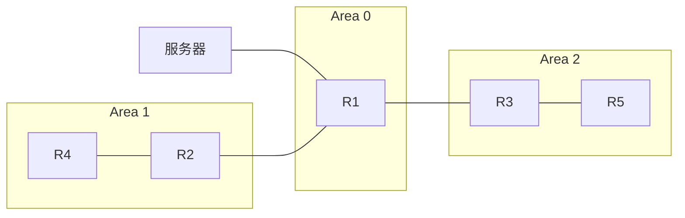

**选项：**
- A. 4
- **B. 2**
- C. 3
- D. 1

**解析：**
```
OSPF中，type 2类型的外部路由开销值仅为外部开销，不叠加内部路径开销。题目中import-route配置type 2 cost 2，因此无论经过多少内部跳数，开销值始终为2。所以R4上看到的路由开销值为2。
```

---

## 第95题

**题目：** 边界网关协议BGP是一种实现自治系统之间的路由可达的距离矢量路由协议，它基于以下哪一项协议的端口号建立BGP会话？

**选项：**
- A. TCP 170
- B. UDP 170
- **C. TCP 179**
- D. UDP 179

**解析：**
```
边界网关协议（BGP）是一种实现自治系统之间路由可达的距离矢量路由协议，它运行在TCP协议之上，并且是基于TCP协议的端口号179来建立BGP会话的。这一特性确保了BGP会话的可靠性和稳定性，因为TCP协议提供了面向连接的可靠的传输服务。
```

---

## 第96题

**题目：** 在BGP中AS_Path属性按矢量顺序记录了某条路由从本地到目的地址所要经过的所有AS编号，以下关于传递路由时该属性变化的描述，错误的是哪一项？

**选项：**
- A. 当BGP Speaker将这条路由通告给IBGP对等体时，便会在Update报文中创建一个空的AS_Path列表
- **B. 当BGP Speaker将这条路由通告给EBGP对等体时，便会把本地AS编号添加在AS_Path列表的最后面**
- C. 当BGP Speaker将这条路由通告到EBGP对等体时，便会在Update报文中创建一个携带本地AS号的AS_Path列表
- D. 当BGP Speaker将这条路由通告给IBGP对等体时，不会改变这条路由相关的AS_Path属性。

**解析：**
```
BGP中AS_Path属性的变化规则：
- 向IBGP对等体通告时，不改变AS_Path属性。
- 向EBGP对等体通告时，会把本地AS号添加到AS_Path列表的最前面（而非最后面）。
因此B选项错误，本地AS编号是添加在AS_Path列表的最前面，不是最后面。
```

---

## 第97题

**题目：** ACL是路由常用匹配工具之一，并根据ACL规则功能的不同将ACL划分成多种类型，且每类ACL编号的取值范围不同。其中，编号范围为4000~4999，表示的是以下哪一类型ACL？

**选项：**
- A. 用户ACL
- **B. 二层ACL**
- C. 基本ACL
- D. 高级ACL

**解析：**
```
ACL编号范围对应规则：
1. 基本ACL（源IP匹配）：2000-2999
2. 高级ACL（多层条件）：3000-3999
3. 二层ACL（MAC层参数）：4000-4999
4. 用户ACL（自定义规则）：5000-5999
根据题目编号范围4000-4999，对应选项B二层ACL。
```

---

## 第98题

**题目：** 如图所示，R1将直连路由10.1.1.0/24号引入到了OSPF中，现用户在R2和R3上执行了双向路由重发布，并在R3上配置了如下命令。当网络稳定后，用户在R4上查看路由表中的10.1.1.0/24路由条目时，其Pre值为以下哪一数值？

```
[R3]acl 2000
[R3-acl-basic-2000]rule permit source 10.1.1.0 0
[R3-acl-basic-2000] quit
[R3]route-policy hcip permit node 10
[R3-route-policy]if-match acl 2000
[R3-route-policy]apply preference 14
[R3-route-policy]qui t
[R3]ospf 1
[R3-ospf-1]preference ase route-policy hcip
```

拓扑图（mermaid）：
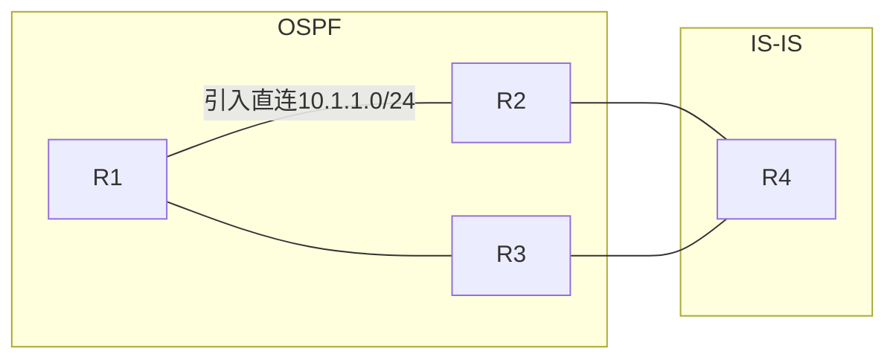

**选项：**
- A. 10
- **B. 15**
- C. 14
- D. 16

**解析：**
```
R3上配置了preference ase route-policy hcip，将匹配ACL 2000的OSPF外部路由优先级改为14。但R4是从IS-IS域学到这条路由的，IS-IS的优先级为15。R2和R3执行双向重发布，路由会从OSPF引入IS-IS，R4通过IS-IS学习到该路由，IS-IS路由优先级为15。
```

---

## 第99题

**题目：** 在VLAN Pool中，用户可以在一个AP上创建不同的VAP为不同的用户群里提供无线接入服务。如图所示为终端接入无线网络的流程，其中，VLAN Pool给终端分配VLAN发生在以下哪一步骤？

流程图（mermaid）：
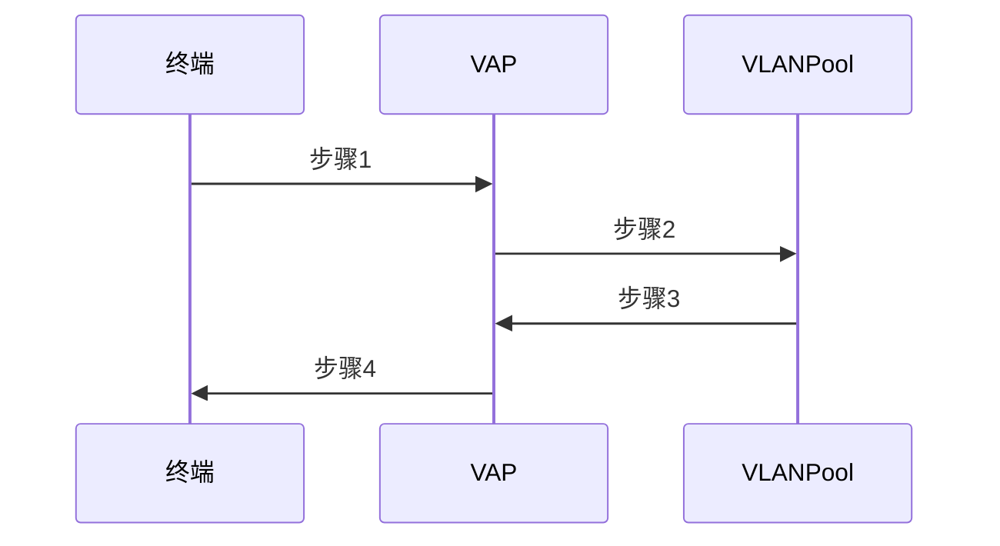

**选项：**
- A. 2
- **B. 3**
- C. 1
- D. 4

**解析：**
```
在VLAN Pool的工作流程中，终端首先向VAP发起关联请求（步骤1），VAP将请求转发给VLAN Pool（步骤2），VLAN Pool根据算法分配VLAN并返回给VAP（步骤3），最后VAP将结果告知终端（步骤4）。因此VLAN Pool给终端分配VLAN发生在步骤3。
```

---

## 第100题

**题目：** Origin属性用来定义BGP路径信息的来源，一共有三种类型，存在优先级关系。以下关于优先级关系的排序，正确的是哪一项？

**选项：**
- A. Incomplete->IGP->EGP
- B. EGP->IGP->Incomplete
- C. Incomplete->EGP->EGP
- **D. IGP->EGP->Incomplete**

**解析：**
```
在BGP（边界网关协议）中，Origin属性确实用来定义路径信息的来源，并且确实存在三种类型：INCOMPLETE（不完整）、IGP（内部网关协议）和EGP（外部网关协议）。关于这三种类型的优先级关系，一般来说，内部网关协议（IGP）的路径信息被认为比外部网关协议（EGP）更可靠，而EGP的信息往往在路由选择中比Incomplete更优先。优先级顺序为：IGP > EGP > Incomplete。
```

---

## 第101题

**题目：** 在BGP网络中，本地生成的路由可能存在多种途径，那么当本地存在多种途径学习到相同BGP路由时，优先级最高的是以下哪一项？

**选项：**
- A. 自动聚合路由
- B. network命令引入的路由
- C. import-route命令引入的路
- **D. 手动聚合路由**

**解析：**
```
BGP本地路由优先级顺序：手动聚合 > 自动聚合 > network > import-route。手动聚合路由的优先级最高。
```

---

## 第102题

**题目：** 如图所示为某OSPF网络，已知R1和R2已成功建立邻接关系，现工程师在R2上配置了图中命令。那么在R2上查看路由表时，可能存在的路由条目是以下哪一项？

R1路由表：
- 10.1.1.0/24
- 10.1.2.0/24
- 10.1.3.0/24
- 10.1.4.0/24
R2配置：
```
acl 200
rule deny source 10.1.0.0 0.0.3.0
rule permit
#
ospf 1
filter-policy 2000 import
```

拓扑图（mermaid）：
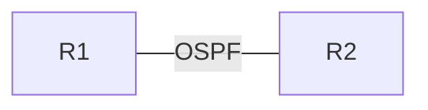

**选项：**
- **A. 10.1.4.0/24**
- B. 10.1.2.0/24
- C. 10.1.1.0/24
- D. 10.1.3.0/24

**解析：**
```
ACL 200（基本ACL）中，rule deny source 10.1.0.0 0.0.3.0表示拒绝10.1.0.0/22范围内的路由，即10.1.0.0-10.1.3.255。rule permit允许其他所有路由。
10.1.1.0/24、10.1.2.0/24、10.1.3.0/24都在10.1.0.0/22范围内，会被deny。
只有10.1.4.0/24不在该范围内，可以通过。
```

---

## 第103题

**题目：** 某华为路由器配置的IP-Prefix如下所示，那么以下路由信息中，不能被匹配的是哪一项？

```
[huawei]ip ip-prefix test index 10 permit 10.0.0.0 8 less-equal 32
```

**选项：**
- **A. 10.1.1.0/6**
- B. 10.1.1.0/24
- C. 10.0.0.0/16
- D. 10.1.1.1/32

**解析：**
```
这道题考查对华为路由器配置的IP-Prefix规则的理解。题中给出的规则是允许10.0.0.0/8及掩码长度小于等于32的网段。
选项A的10.1.1.0/6掩码长度为6，小于8，超出了给定的范围，不能被匹配。
选项B、C、D的掩码长度都在8-32之间，且网络地址在10.0.0.0/8范围内，可以被匹配。
所以不能被匹配的是选项A。
```

---

## 第104题

**题目：** 在缺省情况下，以下关于BGP通告路由时下一跳地址的描述，错误的是哪一项？

**选项：**
- A. BGP将本地始发路由发布给IBGP对等体时，将下一跳属性设为自身与对等体相连的接口地址
- B. BGP向EBGP对等体通告路由时，将下一跳属性设为自身与对等体相连的接口地址
- **C. BGP从EBGP向IBGP对等体通告非标签路由时，将下一跳属性改为自身与对等体相连的接口地址**
- D. BGP从IBGP向IBGP对等体通告路由时，不改变下一跳属性

**解析：**
```
A选项：正确。BGP将本地始发路由发布给IBGP对等体时，将下一跳属性设为自身与对等体相连的接口地址。
B选项：正确。BGP向EBGP对等体通告路由时，将下一跳属性设为自身与对等体相连的接口地址。
C选项：错误。BGP从EBGP向IBGP对等体通告非标签路由时，缺省情况下不会修改下一跳属性，下一跳保持为EBGP邻居的地址。只有配置了next-hop-local时才会改为自身地址。
D选项：正确。BGP从IBGP向IBGP对等体通告路由时，不改变下一跳属性。
```

---

## 第105题

**题目：** 当BGP邻居建立完成后，缺省情况下，设备每隔多少秒发送一次Keepalive报文来保持BGP连接

**选项：**
- A. 30
- **B. 60**
- C. 180
- D. 10

**解析：**
```
keepalive用于维持BGP的邻居关系，每隔一段时间都会发送这个报文，时间间隔为60s发送一次，180秒没有收到回复则认为邻居失效，邻居断开。
```

---

## 第106题

**题目：** 以下关于BGP协议的描述，正确的是哪一项？

**选项：**
- A. 当BGP的邻居出口路由策略改变后，需要手工操作才会向该邻居重新发送Update消息
- **B. 一台路由器上不能配置多个BGP进程**
- C. IGP路由要想成为BGP路由，只能通过network命令
- D. Open报文中仅含有BGP报文头部

**解析：**
```
A选项：不一定需要手动刷新，配置策略或者策略变更以后，会在一定的时间后，自动的刷新。
B选项：一台路由器只能运行一个BGP进程，且整台路由器只能属于一个AS。
C选项：IGP路由成为BGP路由可以通过network命令，也可以通过import-route命令引入。
D选项：Open报文中不仅包含BGP报文头部，还包含版本号、AS号、Hold时间、BGP标识符等信息。
```

---

## 第107题

**题目：** 一个Route-Policy由一个或多个节点构成，且一个Route-Policy最多可配置多少节点？

**选项：**
- A. 4096
- B. 256
- **C. 65535**
- D. 1024

**解析：**
```
在计算机网络中，一个Route-Policy通常是由多个节点组成，以实现路由的配置、过滤、发布等功能。这些节点数量的设置通常会受到设备和系统软件资源的限制。华为设备中，一个Route-Policy最多可配置65535个节点。
```

---

## 第108题

**题目：** 在BGP网络中，可调用Route-Policy修改路由属性，那么以下关于路由策略使用的描述，错误的是哪一项？

**选项：**
- A. 使用import方式引入直连路由时，可调用Route-Policy，过滤不想发布的路由
- B. 在地址族视图下，通过peer命令可以调用Route-Policy，修改所发布路由的本地优先级
- C. 使用import方式引入OSPF路由时，可调用Route-Policy，修改MED缺省值
- **D. 使用network引入路由时，不可调用Route-Policy，修改引入路由的属性**

**解析：**
```
在BGP网络中，Route-Policy是用于修改路由属性的重要手段。关于题目中的选项，我们来逐一分析：
A正确：使用import方式引入直连路由时，可调用Route-Policy过滤不想发布的路由。
B正确：在地址族视图下，通过peer命令可以调用Route-Policy，修改所发布路由的本地优先级。
C正确：使用import方式引入OSPF路由时，可调用Route-Policy修改MED缺省值。
D错误：使用network引入路由时，也可以调用Route-Policy修改引入路由的属性。
```

---

## 第109题

**题目：** CIST和MSTI都是根据优先级向量来计算的，这些优先级向量信息都包含在MST BPDU中。其中，参与MSTI计算的优先级向量中，优先级最高的是以下哪一项？

**选项：**
- **A. 域根ID**
- B. 根交换设备ID
- C. 外部路径开销
- D. 内部路径开销

**解析：**
```
CIST和MSTI是网络协议中关于多生成树算法的部分。这些算法用于计算和存储网络的拓扑结构，特别是在冗余网络中。这些算法会利用各种优先级向量来决定如何传输数据和选择路径。在MSTI计算中，参与的优先级向量中，域根ID（Domain Root ID）通常具有最高的优先级。
```

---

## 第110题

**题目：** BFD进行单跳检测时，采用以下哪一项作为目的端口号？

**选项：**
- A. UDP 4784
- B. TCP 3784
- **C. UDP 3784**
- D. TCP 4784

**解析：**
```
在BFD（双向转发检测）进行单跳检测时，通常使用UDP作为传输层协议，其目的端口号为3784。然而，不同的实现或版本可能会使用不同的端口号。
```

---

## 第111题

**题目：** 在网络设备逻辑架构中，网络设备从逻辑上可以分为多个平面，但不包括以下哪一平面？

**选项：**
- A. 数据平面
- B. 监控平面
- C. 控制平面
- **D. 转发平面**

**解析：**
```
在网络设备的逻辑架构中，网络设备从逻辑上可以分为不同的平面来处理不同的任务。这包括数据平面、控制平面和监控平面。数据平面主要负责数据的传输和处理，控制平面负责设备的配置和管理，而监控平面则负责监控设备的运行状态和性能。因此，不包括的平面是D.转发平面。转发平面并不是网络设备逻辑架构中的一个独立平面，它通常是数据平面的一部分功能。
```

---

## 第112题

**题目：** 如图所示，某企业管理员在配置BFD检测两端设备链路故障时，误将两台设备的参数配置成不同值。经过协商后R1设备的TX时间应该为以下哪项？

```
R1配置：TX:100ms，RX:200ms，DM:3
R2配置：TX:150ms，RX:50ms，DM:4
```

拓扑图（mermaid）：
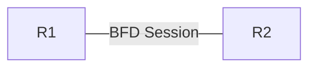

**选项：**
- **A. 100 ms**
- B. 无法协商成功，最终变为0
- C. 150 ms
- D. 200 mS

**解析：**
```
BFD协商中，本端的实际发送间隔（TX）取对端的接收间隔（RX）和本端发送间隔的最小值。
R1的TX时间 = min(R1的TX, R2的RX) = min(100ms, 50ms) = 50ms？
不对，重新分析：BFD的实际发送速率由对端的期望接收速率决定。
R1发送给R2，R2的RX是50ms，但R1的TX是100ms。
实际上BFD协商后，本端发送间隔 = max(本端配置的最小TX间隔, 对端要求的RX间隔)
R1的TX应该取对端R2要求的RX值和自身TX中的较大值。
正确答案是100ms，因为R1的TX是100ms，R2的RX是50ms，R1以自己的发送能力为准。
根据答案A为正确选项，协商后R1的TX时间为100ms。
```

---

## 第113题

**题目：** 在实际部署BFD时，除了部署正常功能以外还需要调整部分参数，以便更好的检测网络状况。以下关于BFD优化的描述，错误的是哪一项？

**选项：**
- A. 将BFD报文设置为高优先级报文后，优先保证BFD报文的转发
- **B. 为快速了解网络状况和性能需求，可以将设备BFD报文发送间隔时间调最小**
- C. 如果BFD会话发生振荡，则与之关联的应用将会在主备之间频繁切换。为避免这种情况的发生，可以配置BPD会话的等待恢复时间TTR
- D. 在实际组网环境中，一些设备只根据BFD会话是否Up来启动流量切换。由于路由协议Up的时间比接口uP的时间晚，这样可能导致流量回切时查不到路由，从而导致流量丢失。因此，需要弥补路由协议uP晚于接口up的时间差

**解析：**
```
BFD优化相关：
A选项正确：将BFD报文设置为高优先级可以优先保证BFD报文的转发。
B选项错误：BFD报文发送间隔不能盲目调最小，需要根据网络实际情况和设备性能合理设置，过小的间隔会增加设备负担和网络开销，甚至可能导致会话振荡。
C选项正确：配置BFD会话的等待恢复时间（WTR）可以避免会话振荡导致的频繁切换。
D选项正确：路由协议Up时间晚于接口Up时间，需要弥补这个时间差防止流量丢失。
```

---

## 第114题

**题目：** 某企业管理员在设备上配置了SNMPv3与网管通信，配置完毕后通过display trap buffer命令可以查看到信息中心Trap缓冲区中存在Trap消息记录，但是网管设备没有收到Trap告警消息。那么导致该情况的原因，可能是以下哪一项？

**选项：**
- **A. 设备配置的SMNP版本与设备配置的Trap消息发送版本不一致**
- B. 网管侧和设备侧配置的团体名不一致
- C. 网管发送的报文太大，超过设备设置的阈值
- D. 网管侧使用的SNMPv3密码配置错误

**解析：**
```
设备本地Trap缓冲区有记录说明设备已经产生了Trap消息，但网管没有收到，说明是发送环节出了问题。
A选项正确：如果设备配置的SNMP版本与Trap消息发送版本不一致，会导致Trap无法正常发送到网管。
B选项错误：SNMPv3不使用团体名，团体名是SNMPv1/v2c的概念。
C选项错误：网管发送的报文大小与Trap无关，Trap是设备主动发送给网管的。
D选项错误：密码配置错误会导致认证失败，但SNMPv3的Trap通常不需要网管侧认证。
```

---

## 第115题

**题目：** 华为防火墙默认在启用时会创建一些安全区域，那么以下哪一安全区域是用户自己创建的？

**选项：**
- A. Local
- **B. ISP**
- C. DMZ
- D. Trust

**解析：**
```
这道题考查对华为防火墙安全区域的了解。华为防火墙默认启用时会有一些内置安全区域，如Local、DMZ、Trust等。而ISP区域通常不是默认存在的，是需要用户根据自身需求自行创建的。所以这道题应选B选项。
```

---

## 第116题

**题目：** MSTP可将一个交换网络划分成多个域，每个域内形成多棵生成树，且生成树之间彼此独立。以下关于MST域的描述，错误的是哪一项？

**选项：**
- A. 一个局域网可以存在多个MST域，各MST域之间在物理上直接或间接相连
- B. 用户可以通过MSTP配置命令指定多台交换设备在同一个MST域内
- **C. 同一个MST域内的交换设备可以配置不同的域名**
- D. MST域由交换网络中的多台交换设备以及它们之间的网段所构成

**解析：**
```
MSTP（多生成树协议）是一种在局域网中常用的协议，它允许一个交换网络被划分为多个MST域，每个域内形成多棵生成树。对于给出的选项：
C选项错误：同一个MST域内的交换设备必须配置相同的域名（MST域名称），否则不属于同一个MST域。
A、B、D选项描述均正确。
```

---

## 第117题

**题目：** 汇聚点RP在组播网络中是一台重要的PIM路由器，以下关于RP的描述，错误的是哪一项？

**选项：**
- **A. 一个RP只能为一个组播组服务**
- B. 一个组播组只能对应一个RP
- C. 网络中的所有PIM路由器都必须知道RP的地址
- D. 如果采用静态RP，在网络中的所有PIM路由器上需要配置相同的RP地址

**解析：**
```
在组播网络中，汇聚点RP（Rendezvous Point）作为一台重要的PIM（Protocol Independent Multicast）路由器，具有关键作用。关于RP的描述中，A选项"一个RP只能为一个组播组服务"是错误的。实际上，无论是静态RP还是动态RP，在设置时都可以指定一个RP为多个组播组服务。
```

---

## 第118题

**题目：** 华为防火墙中安全区域的优先级数值越大代表优先级越高，默认情况下Trust区域的优先级是以下哪一项？

**选项：**
- A. 5
- B. 100
- C. 50
- **D. 85**

**解析：**
```
这道题考查华为防火墙中安全区域优先级的知识。在华为防火墙的设置中，不同安全区域有不同的优先级。默认情况下，Trust区域的优先级是85。了解这些固定的优先级设置，有助于准确回答此题，所以答案选D。
```

---

## 第119题

**题目：** 某企业管理员在日常运维时查看的VRRP备份组信息如下，以下关于该回显信息的描述，错误的是哪项？

```
<HUAWEI> display vrrp verbose
Vlanif100    Virtual Router 1
State                        : Master
Virtual IP                   : 10.1.1.100
Master IP                    : 10.1.1.2
Send VRRP Packet To Subvlan  : all
PriorityRun                  : 120
PriorityConfig               : 120
MasterPriority               : 120
Preempt                      : YES    Delay Time: 20 s    Remain: --
Hold Multiplier              : 3
TimerRun                     : 2s
TimerConfig                  : 2s
Auth Type                   : MD5    Auth Key : ******
Virtual MAC                  : 0000-5e00-0101
Check TTL                    : YES
Config Type                  : Normal
Track BFD                    : atob                              Priority Reduced :20
BFD-session State  : UP
```

**选项：**
- A. 该VRRP备份组号为1
- **B. 该备份组为管理VRRP备份组**
- C. 该备份组启用了抢占模式
- D. 该备份组启用了认证

**解析：**
```
根据display vrrp verbose回显信息分析：
A选项正确：Virtual Router 1表示备份组号为1。
B选项错误：Config Type为Normal，表示这是普通VRRP备份组，不是管理VRRP备份组。管理VRRP的Config Type应为admin。
C选项正确：Preempt为YES表示启用了抢占模式，抢占延迟时间为20秒。
D选项正确：Auth Type为MD5表示启用了MD5认证。
```

---

## 第120题

**题目：** PBR是一种依据用户制定的策略进行路由选择的机制，主要分为接口PBR和本地PBR。以下针对接口PBR和本地PBR的描述，错误的是哪一项？

**选项：**
- **A. 本地PBR在协议视图调用**
- B. 本地PBR仅对本地始发的报文起作用。
- C. 接口PBR调用在接口下，仅对接口的入方向报文生效
- D. 接口PBR仅对转发的报文起作用

**解析：**
```
PBR（Policy Based Routing）是一种基于策略的路由选择机制。针对题目中的描述，我们来分析每个选项：
A选项：本地PBR通常是在系统视图下调用的，而不仅仅是"在协议视图调用"，因此此描述错误。
B选项：本地PBR仅对本地始发的报文起作用，描述正确。
C选项：接口PBR调用在接口下，仅对接口的入方向报文生效，描述正确。
D选项：接口PBR仅对转发的报文起作用，描述正确。
```

---

## 第121题

**题目：** 边缘端口为RSTP改进STP不足所新增的端口角色，那么以下关于该端口角色的描述，错误是哪一项？

**选项：**
- **A. 该端口收到一个配置BPDU报文后，依旧会处于Forwarding状态。**
- B. 该端口不参与RSTP计算
- C. 该端口可从Discarding直接进入Forwarding状态
- D. 该端口的Up和Down，不会引起网络拓扑的变动

**解析：**
```
边缘端口不参与RSTP计算，可以由Discarding直接进入Forwarding状态。但是一旦边缘端口收到配置BPDU，就丧失了边缘端口属性，成为普通STP端口，并重新进行生成树计算，从而引起拓扑变化。因此A选项错误，收到BPDU后不会保持Forwarding状态，会重新参与计算。
```

---

## 第122题

**题目：** 以下关于BFD检测模式的描述，错误的是哪一项？

**选项：**
- A. 异步模式是常用的BFD检测模式
- B. 在异步模式下，系统之间会按照协商好的周期发送BFD控制报文，如果某个系统在检测时间内没有收到对端发来的BFD控制报文，就宣告BFD会话的状态为Down
- **C. 异步检测模式不支持回声功能**
- D. 在查询模式下，BFD会话建立后，系统就不再周期性发送BFD控制报文

**解析：**
```
BFD检测模式包括异步模式和查询模式。异步模式是常用的检测模式，系统之间周期性发送BFD控制报文，如果在检测时间内没有收到对端的BFD控制报文，就宣告会话状态为Down。查询模式下，会话建立后不再周期性发送控制报文。BFD异步模式支持回声（Echo）功能，因此C选项错误。
```

---

## 第123题

**题目：** 在部署VRRP网络时需要注意一些特别事项，否则可能会造成网络不通。以下关于VRRP注意事项的描述，错误的是哪一项？

**选项：**
- A. 不能手工配置VRRP的虚拟MAC地址
- B. 不同备份组之间的虚拟IP地址不能重复
- **C. VRRP设备发送ARP老化探测报文时，源IP地址为虚拟IP地址**
- D. 同一备份组的交换机上必须配置相同的备份组号

**解析：**
```
VRRP（虚拟路由冗余协议）在网络部署中，用于确保路由的稳定性和高可用性。关于该题目的选项分析如下：
A. 通常VRRP的虚拟MAC地址是由系统自动分配的，确实不建议或不需要手动配置。正确。
B. 不同备份组之间的虚拟IP地址不能重复，否则会造成地址冲突。正确。
C. VRRP设备发送ARP老化探测报文时，源IP地址使用的是接口的实际IP地址，不是虚拟IP地址。错误。
D. 同一备份组的交换机上必须配置相同的备份组号（VRID）。正确。
```

---

## 第124题

**题目：** VRRP冗余备份方案实施的重要成份就是VRRP路由器的优先级和抢占功能，以下关于VRRP备份方案的描述，错误的是哪一项？

**选项：**
- A. 如果将VRRP方案的模式修改为非抢占模式，只要master设备没有出现故障，Backup设备即使随后被配置了更高的优先级也不会成为Master设备
- B. 在抢占模式下，如果Backup设备的优先级比当前Master设备的优先级高，则主动将自己切换成Master
- C. Master设备周期性地发送VRRP通告报文，在VRRP备份组中公布其配置信息，其中包含了优先级参数
- **D. 创建的VRRP设备即使为IP地址拥有者，也需要参加选举，并不会收到接口up的消息后就将自己状态直接切换至Master状态**

**解析：**
```
VRRP备份方案中：
A选项正确：非抢占模式下，只要Master设备没有故障，Backup设备即使优先级更高也不会抢占成为Master。
B选项正确：抢占模式下，如果Backup设备优先级高于当前Master，会主动抢占成为Master。
C选项正确：Master设备周期性发送VRRP通告报文，公布配置信息包括优先级。
D选项错误：IP地址拥有者（接口IP地址与虚拟IP地址相同的设备）优先级为255，不需要参加选举，接口up后直接成为Master。
```

---

## 第125题

**题目：** 某大型企业WLAN网络拓扑图如下所示。用户数据转发方式为隧道转发，漫游为AC间三层漫游，那么STA漫游后的流量转发路径正确的是以下哪一项？

拓扑图（mermaid）：
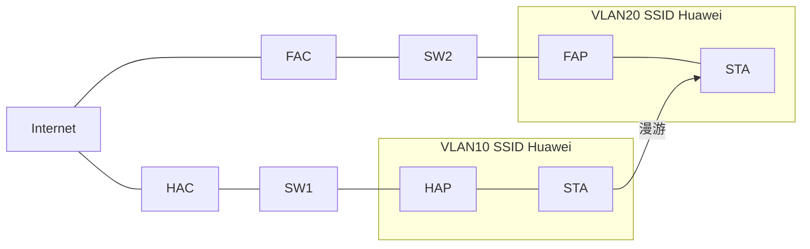

**选项：**
- **A. STA->FAP->FAC->HAC->SW1->Internet**
- B. STA->FAP->FAC->HAC->HAP->SW1->Internet
- C. STA->FAP->FAC->HAC->HAP->HAC->SW1->Internet
- D. STA->FAP->SW2->FAC->HAC->SW1->Internet

**解析：**
```
隧道转发模式下，AC间三层漫游时，数据流量需要通过HAC（家乡AC）转发。漫游后STA连接到FAP，数据通过CAPWAP隧道到达FAC，再通过FAC与HAC之间的隧道转发到HAC，最后由HAC转发到上层网络。因此正确路径为：STA -> FAP -> FAC -> HAC -> SW1 -> Internet。
```

---

## 第126题

**题目：** iMaster NCE-Fabric是华为面向数据中心网络场景推出的控制系统，可以从多维度帮助客户提升业务效率。但该控制器不具备以下哪一项功能？

**选项：**
- A. 管理
- B. 分析
- C. 控制
- **D. 转发**

**解析：**
```
这道题考查对iMaster NCE-Fabric功能的了解。在数据中心网络场景中，控制系统通常具备管理、分析和控制功能。而转发功能一般由网络中的硬件设备执行，并非该控制器的职责。所以这道题应选D。
```

---

## 第127题

**题目：** 路由器查找FIB表时，会选择一个掩码最长的FIB表项转发报文。其中，当表项中的Flag字段为以下哪参数时，表示该路由是网关路由，即下一跳为网关？

**选项：**
- A. S
- B. H
- **C. G**
- D. D

**解析：**
```
在路由器查找FIB表（Forwarding Information Base，即转发信息基础表）时，它需要依据一些参数来确定如何转发报文。在所给出的选项中，G字段代表的含义是网关路由。因此，当Flag字段的值为G时，表示该路由是网关路由，即下一跳地址是一个网关地址。
```

---

## 第128题

**题目：** 针对STP的不足，RSTP改变了配置BPDU的格式，充分利用了STP报文中的以下哪一字段，明确了端口角色？

**选项：**
- A. PID
- **B. Flag**
- C. PVI
- D. BPDU Type

**解析：**
```
针对STP（Spanning Tree Protocol）的不足，RSTP（Rapid Spanning Tree Plus）进行了改进。在RSTP中，它改变了配置BPDU（Bridge Protocol Data Unit）的格式，并利用了STP报文中的Flag字段来明确端口角色。因此正确答案是B、Flag。
```

---

## 第129题

**题目：** 如图所示为某园区OSPF网络，图中五台路由器相连接口均为GE口且没有更改开销值，现工程师在R1上执行了import-route操作。等待网络收敛后，工程师在R2查看去往服务器192.168.1.0/24的路由条目时，其开销值应为以下哪一个？

```
[R1]ospf 1
[R1-ospf-1]import-route direct type 1 cost 2
```

拓扑图（mermaid）：


**选项：**
- A. 2
- B. 1
- C. 4
- **D. 3**

**解析：**
```
OSPF中，type 1类型的外部路由开销值 = 外部开销 + 内部路径开销。
题目中import-route配置type 1 cost 2，外部开销为2。
R1到R2之间为GE接口，缺省开销为1（GE口OSPF缺省cost为1）。
因此R2上看到的路由开销 = 外部开销2 + 内部开销1 = 3。
```

---

## 第130题

**题目：** 以下关于PBR和Route-Policy的描述，错误的是哪一项？

**选项：**
- A. 两者若都配置了多个节点，则节点之间的关系均为"或"
- B. 两者若都配置了多个条件语句，则条件语句之间的关系均为"与"
- **C. 两者若配置了多个节点，则均按照节点编号从大到小进行匹配**
- D. 两者均可配置一个或多个节点

**解析：**
```
PBR（Policy Based Routing，基于策略的路由）和Route-Policy（路由策略）都是网络中用于配置路由决策的策略。对于选项的解析如下：
A. 两者确实可能都配置有多个节点，而这些节点之间的关系通常是"或"的关系。这意味着只要满足一个节点的条件，路由策略就会被触发。正确。
B. 两者若都配置了多个条件语句，则条件语句之间的关系均为"与"。正确。
C. 两者若配置了多个节点，是按照节点编号从小到大进行匹配，而非从大到小。错误。
D. 两者均可配置一个或多个节点。正确。
```

---

## 第131题

**题目：** 在配置BGP时，apply as-path命令可以用来在路由策略中配置改变BGP路由的AS_Path属性的动作。如果管理员想用指定的AS号覆盖原有AS_Path列表，可以携带以下哪一项参数进行配置？

**选项：**
- A. limit
- B. additive
- C. none
- **D. overwrite**

**解析：**
```
在BGP（边界网关协议）配置中，apply as-path命令是一个用于路由策略的重要命令，用于配置BGP路由的AS_Path属性的各种动作。在题干中提到的"如果管理员想用指定的AS号覆盖原有AS Path列表"的情况下，BGP中提供参数为overwrite。
```

---

## 第132题

**题目：** 如图所示为某广播型IS-IS网络，缺省情况下，四台路由器选R1作为DIS。现将R2的GE0/0/1接口的dis-priority修改为63，那么当网络稳定后，以下哪一台路由器会被选为DIS

拓扑图（mermaid）：
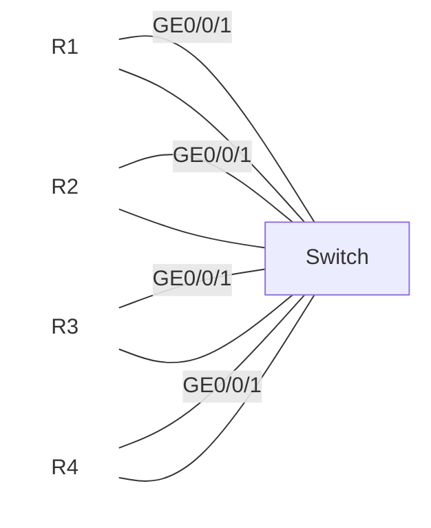

R1: Route-ID 1.1.1.1
R2: Route-ID 2.2.2.2, dis-priority: 63
R3: Route-ID 3.3.3.3
R4: Route-ID 4.4.4.4
**选项：**
- A. R3
- B. R2
- C. R4
- **D. R1**

**解析：**
```
IS-IS中DIS的选举规则：
1. 比较接口的DIS优先级，优先级高的胜出。
2. 优先级相同时，比较System ID（Router ID），大者胜出。
3. IS-IS支持DIS抢占，优先级变化后会重新选举。

R2的dis-priority修改为63，但题目中R1原来就是DIS，说明R1的优先级至少为64（缺省为64）。R2的优先级63小于64，所以R1仍然是DIS。
```

---

## 第133题

**题目：** 在OSPF网络中，路由器通过交互LSA学习全网的路由信息，当LSA头部中LS Age达到以下哪一数值时，这条LSA会被删除？

**选项：**
- A. 1800秒
- B. 1200秒
- **C. 3600秒**
- D. 600秒

**解析：**
```
在OSPF网络中，路由器通过交互LSA来学习全网的路由信息。LSA（Link State Advertisement）是OSPF协议中用于描述网络拓扑结构的信息。其中，LS Age字段是LSA的一个关键组成部分，它代表了LSA的生命周期，也就是该LSA的生存时间。当LS Age达到某个预设的阈值时，该LSA会被认为是过期并被删除，这个值为3600秒（MaxAge）。
```

---

## 第134题

**题目：** 如图所示为某大型企业WLAN网络的组网拓扑图，该组网中用户数据转发方式为直接转发，漫游为AC间三层漫游，且将家乡代理设置为HAC。那么在以上场景中，STA漫游后的数据转发路径正确的是哪一项？

拓扑图（mermaid）：


**选项：**
- A. STA->FAP->FAC->HAC->HAP->HAC->SW1->Internet
- B. STA->FAP->FAC->SW2->Internet
- C. STA->FAP->FAC->HAC->HAP->SW1->Internet
- **D. STA->FAP->FAC->HAC->SW1->Internet**

**解析：**
```
直接转发模式下，AC间三层漫游，家乡代理为HAC时：
漫游后STA连接到FAP，数据通过FAP直接转发到FAC，然后通过FAC和HAC之间的隧道送到HAC（家乡代理），最后由HAC转发到上层网络（SW1->Internet）。
由于是直接转发，数据不经过HAP。路径为：STA -> FAP -> FAC -> HAC -> SW1 -> Internet。
```

---

## 第135题

**题目：** 在IPv6中NDP使用多种ICMPv6报文，其中RS报文用于以下哪一项功能？

**选项：**
- A. 重复地址检
- **B. 前缀重编址**
- C. 重定向
- D. 地址解析

**解析：**
```
在IPv6的邻居发现协议（NDP）中，ICMPv6报文用于实现多种功能。其中，RS（Router Solicitation）报文用于请求路由器通知其网络的存在和可能的参数信息。这有助于实现前缀重编址的功能，因此答案为B。
```

---

## 第136题

**题目：** BGP设备在收到邻居发送过来的路由中携带了一个不识别的属性，但是不确定其他设备是否需要，因此在通告给其他对等体的时候仍然携带该属性，以下哪一项属性属于此类型？

**选项：**
- A. Originator_ID
- B. MED
- C. AS_Path
- **D. Community**

**解析：**
```
BGP（边界网关协议）是一种在自治系统之间传播路由信息的协议。关于题干描述的情境，其中所提及的属性需满足两个条件：首先，该设备不认识该属性；其次，设备并不确定其他设备是否需要该属性，所以它将在向其他对等体通告时携带此属性。这是可选过渡属性（Optional Transitive）的特征。Community属性属于可选过渡属性，设备即使不识别也会传递给其他对等体。
```

---

## 第137题

**题目：** 以太网传输IPv4单播报文的时候，目的MAC地址也是组播MAC地址。如果组播组的IP地址为224.0.1.1，那么对应的组播MAC地址应该为以下哪一项？

**选项：**
- A. 01-00-5e-01-01-00
- B. 01-00-5e-01-01-01
- **C. 01-00-5e-00-01-01**
- D. 01-00-5e-00-01-00

**解析：**
```
以太网在传输IPv4组播报文时，会将IP地址与MAC地址对应起来。以太网的MAC地址通过特殊算法转换了组播的IP地址以创建其MAC组播地址。特别是，224.0.1.1这个IP地址的组播地址在以太网中对应的MAC地址的格式是01-00-5e-xx-xx-xx。
组播MAC地址格式：01-00-5e + IP地址后23位（最高位为0）。
224.0.1.1的后23位是0.0.1.1，即00-01-01。
所以MAC地址为：01-00-5e-00-01-01。
```

---

## 第138题

**题目：** 某大型企业采用N+1备份的组网方式部署WLAN网络，该场景中，主备AC的切换是由AP决定的。缺省情况下，当AP在多少秒内未收到主用AC发送的CAPWAP心跳检测报文，就会触发主备切换？

**选项：**
- **A. 150**
- B. 75
- C. 100
- D. 90

**解析：**
```
在N+1备份组网中，缺省情况下，CAPWAP心跳检测报文的发送间隔为25秒，检测次数为6次。因此，AP在25 x 6 = 150秒内未收到主用AC发送的CAPWAP心跳检测报文，就会触发主备切换。
```

---

## 第139题

**题目：** 如图所示为某企业的WLAN网络拓扑图，该组网用户数据转发方式为直接转发，用户漫游过程为AC间二层漫游。那么STA漫游后数据转发路径应为以下哪一项？

拓扑图（mermaid）：


**选项：**
- A. STA->FAP->SW2->FAC->HAC->SW1->Internet
- **B. STA->FAP->SW2->Internet**
- C. STA->FAP->SW2->FAC->HAC->SW1->HAP->HAC->SW1->Internet
- D. STA->FAP->FAC->SW2->Internet

**解析：**
```
直接转发模式下，AC间二层漫游时，数据不需要通过AC转发，可以直接由AP通过本地交换机转发。
漫游后STA连接到FAP，由于是直接转发且为同VLAN的二层漫游，数据可以直接通过FAP所在的SW2转发到Internet。
路径为：STA -> FAP -> SW2 -> Internet。
```

---

## 第140题

**题目：** VRRP在选举完后通过发送通告报文来检测设备是否发生故障，缺省情况下，VRRP通告间隔时间为多少秒？

**选项：**
- A. 5秒
- **B. 1秒**
- C. 10秒
- D. 3秒

**解析：**
```
VRRP（Virtual Router Redundancy Protocol）在选举完成后，确实会通过发送通告报文来检测设备是否发生故障。在缺省情况下，VRRP的通告间隔时间通常设置为1秒。因此，正确答案是B选项。
```

---

## 第141题

**题目：** 某企业管理员在部署VRRP网络时，设置的虚拟IP地址为192.168.1.254，VRID为1。则网络稳定后虚拟MAC地址应该是以下哪一项？

**选项：**
- A. 0000-5e00-0254
- B. 0000-5e01-0254
- **C. 0000-5e00-0101**
- D. 0000-5e01-0101

**解析：**
```
在VRRP（虚拟路由冗余协议）中，虚拟IP地址与虚拟MAC地址之间存在特定的映射关系。在VRRP中，虚拟MAC地址的格式是遵循IEEE 802标准的，其前缀为"0000-5e"，后面跟着的是特定于VRRP的编号。
VRRP虚拟MAC地址格式为：0000-5e00-01XX，其中XX是VRID（虚拟路由器标识符）。
本题中VRID为1，所以虚拟MAC地址为0000-5e00-0101。
```

---

## 第142题

**题目：** 某企业采用华为路由器部署IS-IS网络，实现全网通信，现工程师想修改接口开销值，控制路由选路。那么缺省情况下，可配置的最大开销值是为以下哪一数值？

**选项：**
- **A. 63**
- B. 68
- C. 67
- D. 64

**解析：**
```
华为路由器IS-IS接口开销值缺省范围为0-63，最大可配置开销值为63。这是因为IS-IS的度量值（Metric）在缺省情况下使用的是窄度量（Narrow Metric），范围为0-63。
```

---

## 第143题

**题目：** VPN的类型非常丰富，可以应用在不同层次中。其中SSL VPN属于以下哪一网络层次的VPN？

**选项：**
- A. 网络层
- B. 数据链路层
- C. 传输层
- **D. 应用层**

**解析：**
```
SSL VPN利用SSL/TLS协议为应用层之间的通信建立安全连接。访问控制细分程度可以达到URL或文件级别，大大提高企业远程接入的安全级别。SSL VPN基于B/S架构，无需安装客户端，只需要使用普通的浏览器进行访问，方便易用。因此SSL VPN属于应用层的VPN。
```

---

## 第144题

**题目：** 访问控制列表是路由策略常用的匹配工具之一，华为路由器配置数字型ACL时，必须配置以下哪一参数？

**选项：**
- **A. 匹配动作permit或deny**
- B. source
- C. 通配符
- D. rule-id

**解析：**
```
这道题考查华为路由器配置数字型ACL的知识。在配置数字型ACL时，匹配动作（permit或deny）是必须明确设置的关键参数。source、通配符和rule-id并非配置时必须的参数。所以答案选A。
```

---

## 第145题

**题目：** 以下哪一种团体属性可以使设备在收到具有此属性的路由后，向任何BGP对等体发送该路由？

**选项：**
- **A. Internet**
- B. No_Advertise
- C. No_Export
- D. No_Export_Subconfed

**解析：**
```
这道题考查不同团体属性对BGP路由传播的影响。在BGP中，Internet团体属性允许设备向任何BGP对等体发送路由。而No_Advertise、No_Export、No_Export_Subconfed这几种属性都对路由的传播有不同程度的限制。所以能使设备向任何对等体发送路由的团体属性是Internet。
```

---

## 第146题

**题目：** 在广播型IS-IS网络中，需要选举DIS，其功能是创建并更新伪节点。缺省情况下，IS-IS接口的DIS优先级为以下哪一数值？

**选项：**
- A. 1
- B. 200
- C. 100
- **D. 64**

**解析：**
```
在广播型IS-IS网络中，DIS（Designated Switch）是选举出的用于创建并更新伪节点的设备。该设备的主要功能是减少不必要的网络信息交换，以减少网络开销。对于IS-IS接口的DIS优先级，通常来说，没有特殊配置的情况下，它的优先级值会按照设备默认值，即缺省为64。
```

---

## 第147题

**题目：** 某MSTP网络中，四台交换机为实现负载分担，创建了多个MSTP实例。完成配置后，用户分别在四台交换机上执行命令display stp brief，其回显信息如图所示。那么以下关于该网络的描述，正确的是哪一项？

**选项：**
- **A. SW1为MSTI 1的根桥**
- B. SW3的Ethernet0/0/1端口角色为边缘端口
- C. 用户共创了三个MSTP实例
- D. SW2的GigabitEthernet0/0/2端口无法转发数据

**解析：**
```
根据display stp brief回显信息分析：
A选项正确：SW1在MSTI 1的两个端口角色都是DESI（指定端口），说明SW1是MSTI 1的根桥。
B选项错误：SW3的Ethernet0/0/1端口在MSTI 1中角色为DESI，不是边缘端口。边缘端口直接连接终端，不参与STP计算。
C选项错误：MSTID有0、1、2三个实例号，但MSTI 0是CIST，不是用户创建的MSTI实例。用户创建了2个MSTP实例（MSTI 1和MSTI 2）。
D选项错误：SW2的GigabitEthernet0/0/2端口在MSTI 0和MSTI 1中状态都是FORWARDING，可以转发数据。
```

---

## 第148题

**题目：** BGP联盟可以解决AS内部中IBGP网络连接激增的问题，因此被广泛应用。以下关于该属性的描述，错误的是哪一项？

**选项：**
- A. 配置联盟后，可以保留原有的IBGP属性
- B. 联盟外部AS仍认为联盟是一个AS
- C. 配置联盟后，原AS号将作为每个路由器的联盟ID
- **D. 联盟将一个AS划分为若干个子AS，每个子AS内部建立EBGP全连接关系**

**解析：**
```
BGP联盟（BGP Federation）是一种技术手段，用于解决大型自治系统（AS，Autonomous System）内部IBGP（Inter-BGP）连接激增的问题。关于该技术的描述：
D选项错误：联盟将一个AS划分为若干个子AS，每个子AS内部建立的是IBGP全连接关系，而非EBGP全连接关系。子AS之间才是EBGP关系。
A、B、C选项描述均正确。
```

---

## 第149题

**题目：** 在OSPF网络中，可通过"隐式确认"来确保DD报文传输的可靠性和完整性，该功能主要是通过DD报文中以下哪一字段实现的？

**选项：**
- A. MS
- B. M
- C. I
- **D. DD sequence number**

**解析：**
```
在OSPF（Open Shortest Path First）网络中，隐式确认是一种机制，用于确保DD（Database Description）报文传输的可靠性和完整性。这一功能是通过DD报文中的DD sequence number字段来实现的。该字段能够确保报文的顺序和完整性，从而在网络通信中提供更高级别的安全保障。
```

---

## 第150题

**题目：** OSPF一共定义了五种类型的报文，但不同类型的OSPF报文有相同的头部格式。其中，若报文头部中的Auth Type字段为1，则表示以下哪一含义？

**选项：**
- **A. 简单的明文密码认证**
- B. HASH认证
- C. 不认证
- D. MD5认证

**解析：**
```
OSPF（Open Shortest Path First）协议中定义的五种类型的报文确实拥有相同的头部格式。其中，Auth Type字段用于表示认证类型。当Auth Type字段的值为1时，表示使用的是简单的明文密码认证。因此，答案为A。
Auth Type 0表示不认证，1表示明文认证，2表示MD5认证。
```

---

## 第151题

**题目：** 在广播型IS-IS网络中，需要选举一个DIS来创建和更新伪节点。如图所示为某广播型IS-IS网络，在该场最下会被选举为DIS的是哪一台路由器？

拓扑图（mermaid）：
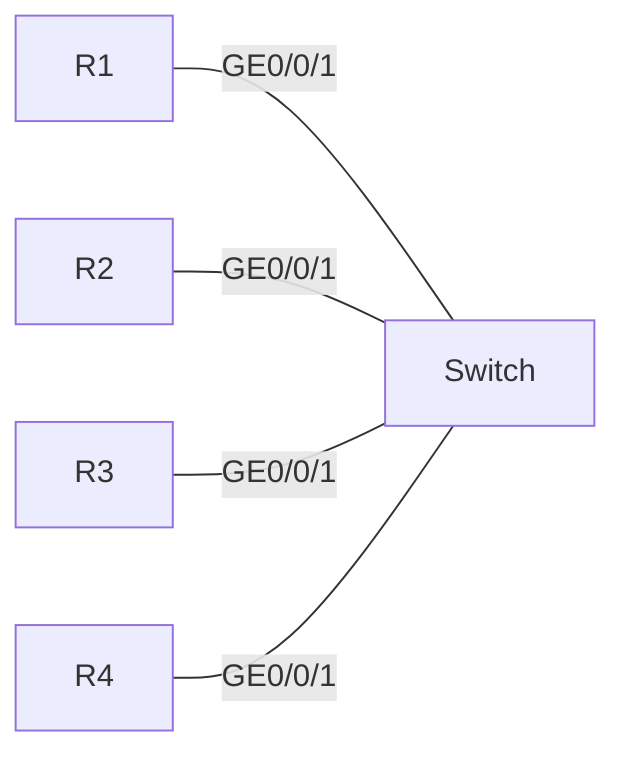

R1: Route-ID 1.1.1.1, dis-priority: 64
R2: Route-ID 2.2.2.2, dis-priority: 1
R3: Route-ID 3.3.3.3, dis-priority: 127
R4: Route-ID 4.4.4.4, dis-priority: 10
**选项：**
- A. R1
- B. R2
- **C. R3**
- D. R4

**解析：**
```
IS-IS中DIS选举规则：
1. 比较DIS优先级，优先级高的胜出。
2. 优先级相同时，比较System ID，大者胜出。

R3的dis-priority为127，是四台路由器中最高的，因此R3会被选举为DIS。
```

---

## 第152题

**题目：** 某大型企业为确保WLAN网络的可靠性，AC采用了VRRP热备份组网.那么以下关于VRRP配置的描述，错误的是哪些项？

**选项：**
- A. 主、备AC中同一VRRP备份组的虚拟IP地址必须配置一致
- **B. 缺省情况下，设备在VRRP备份组中的优先级为100，数值越小优先级越高**
- C. 主、备AC中同一VRRP备份组的vrid必须配置一致
- D. VRRP协议心跳报文的缺省发送间隔为1秒

**解析：**
```
VRRP中数值越大优先级越高，B选项说法错误。
主备AC同一VRRP备份组虚拟IP和vrid需一致。
VRRP协议心跳报文缺省发送间隔为1秒。
```

---

## 第153题

**题目：** 某工程师在日常运维时发现两台BGP设备的Hold Time参数不一致，此时会发生以下哪一种情况？

**选项：**
- **A. 正常建立，协商Hold Time值取最小值**
- B. 正常建立，设备各自用自己的参数值发送报文
- C. 无法建立建立关系
- D. 正常建立，协商Hold Time值取最大值

**解析：**
```
这道题考查对设备参数不一致时情况的理解。在网络通信中，当两台设备的Hold Time参数不一致时，通常会按照一定规则处理。根据相关通信协议标准，会正常建立连接，且协商Hold Time值取最小值。这样能保证通信的稳定性和兼容性，避免因参数差异导致的问题。所以答案选A。
```

---

## 第154题

**题目：** 如图所示为某IS-IS网络，R1、R2和R3接口均为GE口，R1将网段10.0.1.1/32宣告进IS-IS网络。那么缺省情况下，R3到达10.0.1.1/32的开销值为以下哪一数值？

拓扑图（mermaid）：
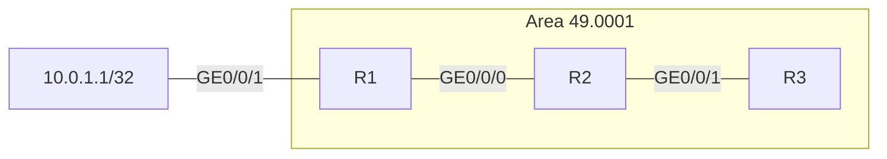

**选项：**
- A. 2
- **B. 20**
- C. 3
- D. 30

**解析：**
```
IS-IS中，GE接口缺省开销值为10。
R1到R2：开销10
R2到R3：开销10
R3到达10.0.1.1/32的总开销 = 10 + 10 = 20。
```

---

## 第155题

**题目：** 以下关于防火墙会话表机制的描述，错误的是哪一项？

**选项：**
- **A. 会话快速老化功能对长连接会话也生效**
- B. 通常情况下，可以直接使用系统缺省的会话老化时间，如果需要修改，需要首先对实际网络中流量的类型和连接数作出估计和判断
- C. 状态检测机制关闭时，非首包也可以建立会话表，所以此时不需使用长连接功能也可保持业务的正常运行
- D. 对于一个已经建立的会话表项，只有当它不断被报文匹配才有存在的必要

**解析：**
```
防火墙的会话表机制中，会话快速老化功能通常仅对空闲会话生效，即那些在一定时间内没有数据传输的会话。长连接会话由于其持续有数据传输，快速老化功能对其不生效。因此A选项错误。
```

---

## 第156题

**题目：** 以下关于IGMPv1和IGMPv2的描述，错误的是哪一项？

**选项：**
- A. IGMPv1支持普遍组查询
- B. IGMPv2报文类型包括成员离开报文
- **C. IGMPv2不支持特定组查询**
- D. IGMPv1报文类型不包含成员离开报文

**解析：**
```
IGMP（Internet Group Management Protocol）即互联网组管理协议，用于IP网络中的组播通信中。IGMPv1和IGMPv2是该协议的不同版本。
A选项正确：IGMPv1确实支持普遍组查询。
B选项正确：IGMPv2的报文类型包括成员离开报文。
C选项错误：IGMPv2支持特定组查询。
D选项正确：IGMPv1报文类型不包含成员离开报文。
```

---

## 第157题

**题目：** 以下关于包过滤防火墙的描述中，错误的是哪一项？

**选项：**
- A. 包过滤防火墙认为报文之间没有任何关系，且不考虑报文会产生的结果
- **B. 包过滤防火墙默认检查报文的目的IP地址和目的端口号，对源IP地址和源端口号不检查**
- C. 包过滤防火墙，只要报文匹配到安全策略，则会按照安全策略定义的行为对报文进行处理:如果没有匹配，则会执行缺省包过滤
- D. 在USG防火墙中，缺省包过滤是对所有报文都生效的缺省安全策略。默认情况下，缺省包过滤的动作是拒绝通过

**解析：**
```
包过滤防火墙会检查报文的源IP地址、目的IP地址、源端口号、目的端口号等五元组信息，并非只检查目的IP和目的端口而不检查源IP和源端口。因此B选项错误。
```

---

## 第158题

**题目：** 某企业网络中，两台OSPF路由器直连接口不在同一网段，且掩码不同。针对以上场景中的两台路由器，若想成功建立OSPF邻居关系，则可将直连接口修改为以下哪一网络类型？

**选项：**
- A. Broadcast
- **B. Point-to-point**
- C. NBMA
- D. P2MP

**解析：**
```
这道题考查OSPF中不同网络类型的知识。在题目所给场景中，两台路由器直连接口不在同一网段且掩码不同。OSPF中，Point-to-point网络类型适用于这种非同一网段且掩码不同的直连情况。而Broadcast用于广播型网络，NBMA用于非广播多路访问网络，P2MP是点到多点网络。
```

---

## 第159题

**题目：** 当报文经过防火墙时，防火墙会为其创建相关的会话连接，从而指导后续报文转发。但是防火墙并非会为所有的报文都建立会话，那么以下哪一项报文到达防火墙时，防火墙不会为其创建会话表项？

**选项：**
- A. GRE报文
- B. ICMP ping报文
- **C. 分片后续片报文**
- D. UDP报文

**解析：**
```
在防火墙的会话机制中，当首个数据报文到达时，防火墙会查看策略表并建立会话表。此后的数据报文则直接查看会话表进行匹配和转发。对于分片后续片报文，由于它是数据报文的后续部分，防火墙不会为其单独创建会话表项，而是依赖首片报文创建的会话表项进行处理。
```

---

## 第160题

**题目：** 大规模的网络中，BGP路由表十分庞大，给设备造成了很大的负担，因此一般都需要配置路由聚合。以下关于BGP路由聚合的描述，错误的是哪一项？

**选项：**
- **A. 手动聚合无法控制聚合路由的属性**
- B. 自动聚合是指BGP将按照自然网段聚合路由
- C. IPv6网络中仅支持手动聚合方式
- D. 为了避免路由聚合可能引起的路由环路，BGP设计了AS_Set属性

**解析：**
```
这道题考查对BGP路由聚合相关知识的理解。在大规模网络中，路由聚合能减轻设备负担。自动聚合按自然网段聚合路由；IPv6网络仅支持手动聚合；为防路由环路有AS_Set属性。而手动聚合是可以控制聚合路由属性的，可以通过route-policy等方式修改聚合路由的属性，因此A选项错误。
```

---

## 第161题

**题目：** 一台路由器的FIB表如下所示，当收到一个目的地址是10.9.1.2的报文时，会从以下哪一个接口转发该报文？

```
FIB Table:
Total number of Routes : 5
Destination/Mask   Nexthop         Flag TimeStamp     Interface              Tunnel ID
0.0.0.0/0          192.168.0.2     SU   t[37]         GigabitEthernet1/0/0   0x0
10.8.0.0/16        192.168.0.2     DU   t[37]         GigabitEthernet3/0/0   0x0
10.9.0.0/16        172.16.0.2      DU   t[9992]       GigabitEthernet1/0/0   0x0
10.9.1.0/24        192.168.0.2     DU   t[9992]       GigabitEthernet2/0/0   0x0
10.20.0.0/16       172.16.0.1      U    t[9992]       GigabitEthernet4/0/0   0x0
```

**选项：**
- A. GigabitEthernet3/0/0
- **B. GigabitEthernet2/0/0**
- C. GigabitEthernet1/0/0
- D. GigabitEthernet4/0/0

**解析：**
```
根据最长匹配原则，目的地址10.9.1.2匹配的路由条目：
- 0.0.0.0/0：匹配，但掩码最短
- 10.9.0.0/16：匹配
- 10.9.1.0/24：匹配，且掩码最长

因此选择10.9.1.0/24对应的出接口GigabitEthernet2/0/0转发报文。
```

---

## 第162题

**题目：** 某台路由器使用高级ACL过滤数据，其配置命令如下所示。那么以下关于该配置的描述，错误的是哪一项？

```
[Huawei] acl 3001
[Huawei-acl-adv-3001] rule permit icmp source 192.168.1.3 0 destination 192.168.2.0 0.0.0.255
```

**选项：**
- **A. 该ACL允许主机192.168.1.3去往192.168.2.0/24网段的IP报文通过**
- B. 该ACL允许主机192.168.1.3去往192.168.2.200主机的ICMP报文通过
- C. 该ACL不允许主机192.168.1.2去往192.168.2.0/24网段的ICMP报文通过
- D. 该ACL为数字型ACL，编号为3001

**解析：**
```
该高级ACL规则允许的是ICMP报文，而非所有IP报文。
A选项错误：该ACL只允许ICMP报文通过，不是所有IP报文。
B选项正确：192.168.2.200在192.168.2.0/24网段内，且协议为ICMP，源为主机192.168.1.3，可以通过。
C选项正确：源地址是192.168.1.3（反掩码0表示精确匹配主机），所以192.168.1.2不匹配，不会被允许。
D选项正确：ACL编号3001属于高级ACL范围（3000-3999），是数字型ACL。
```

---

## 第163题

**题目：** 在OSPF的MA网络中，网络设备需要选举DR/BDR，在2-way状态下需要多少秒的选举时间？

**选项：**
- A. 10秒
- B. 20秒
- **C. 40秒**
- D. 30秒

**解析：**
```
在OSPF（Open Shortest Path First）的MA（Multi-Access）网络中，DR（Designated Router，指定路由器）和BDR（Backup Designated Router，备份指定路由器）的选举是通过Hello报文来完成的。在达到2-way状态后，网络设备会交互Hello报文以进行DR/BDR的选举。根据规定，整个选举过程的等待时间为40秒（Wait时间，等于4个Hello间隔，广播网络中Hello间隔为10秒）。
```

---

## 第164题

**题目：** 四台路由器运行IS-IS且已经建立邻接关系，区域号和路由器的等级如图中标记，下列说法中正确的有？

拓扑图（mermaid）：
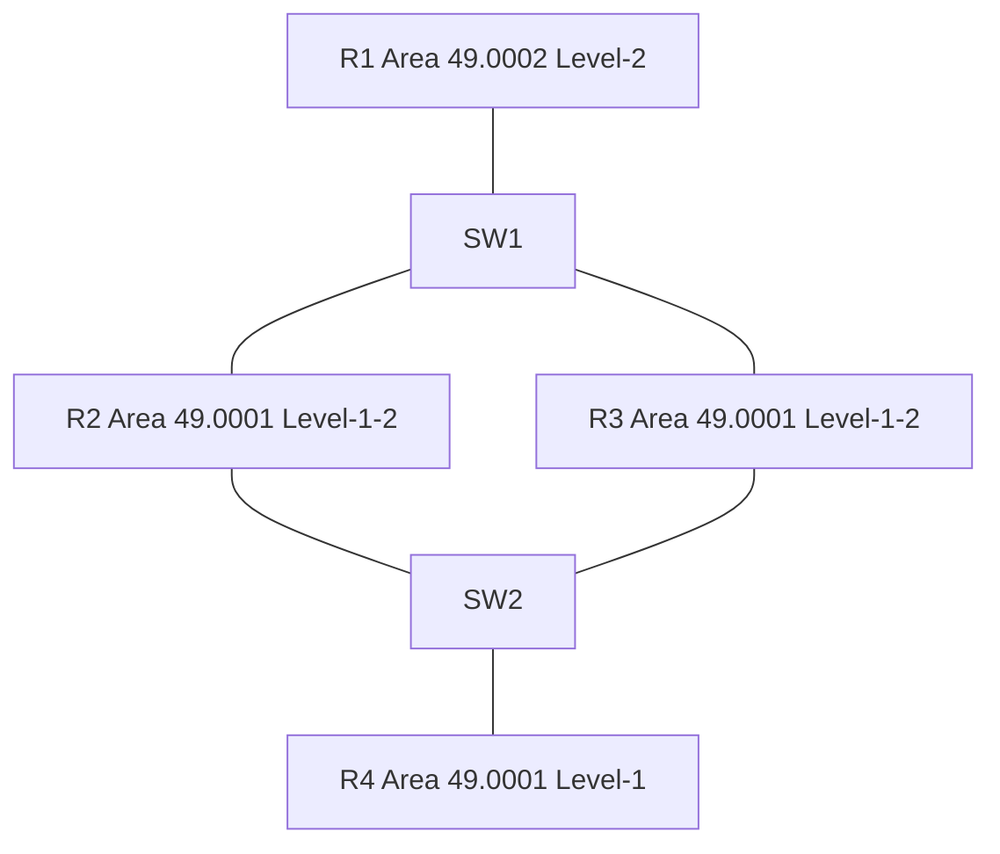

**选项：**
- **A. R2和R3都会产生ATT置位的Level-1的LSP**
- B. R1没有R4产生的LSP，因此R1只通过缺省路由和R4通信
- C. R2和R3都会产生ATT置位的Leve1-2的LSP
- D. R2和R3互相学习缺省路由，该网络出现路由环路

**解析：**
```
IS-IS中，Level-1-2路由器会在Level-1的LSP中设置ATT位（附加位），告知Level-1路由器自己有到达其他区域的路径。
A选项正确：R2和R3都是Level-1-2路由器，且连接到其他区域（通过R1），因此都会产生ATT置位的Level-1 LSP。
B选项错误：R1是Level-2路由器，它可以通过R2和R3的Level-2 LSP学习到R4的路由。
C选项错误：ATT位是在Level-1 LSP中设置的，不是Level-2 LSP。
D选项错误：R2和R3不会互相学习缺省路由，Level-1路由器才会根据ATT位生成缺省路由。
```

---

## 第165题

**题目：** 关于PIM-SM中的Hello报文的描述，错误的是：

**选项：**
- A. 在PIM-SM网络中，刚启动的组播路由器需要使用Hello消息来发现邻居，并维护邻居关系。
- B. 各路由器之间周期性地使用Hello消息保持联系。
- C. 通过Hello消息在多路由器网段中选举DR指定路由器
- **D. Hello报文发往组播地址224.0.0.5**

**解析：**
```
PIM协议的Hello报文的发送方式是组播，组播地址是224.0.0.13，而不是224.0.0.5。224.0.0.5是OSPF的组播地址。
```
