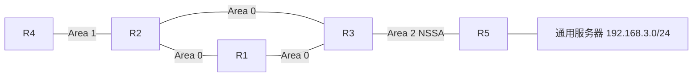
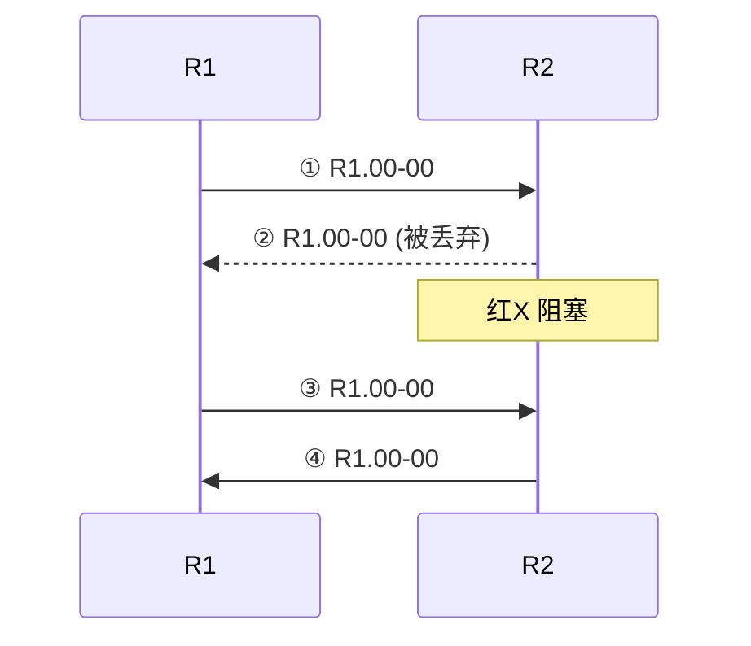
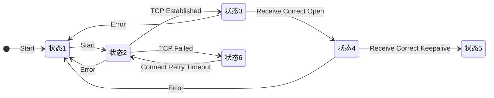
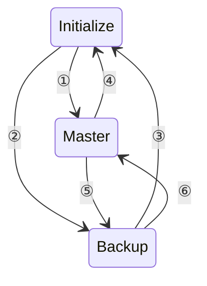

# 821连线题集

---

## 第1题

**题目：** 如图所示为某广播型网络，已知R1、R2、R3、R4和R5开启了OSPF路由协议，且Area2被配置为NSSA区域。现工程师在R5上引入了去往通用服务器的路由，那么请将以下LSA类型和各路由器所存在的LSA类型相匹配。

**配图：**



**左侧选项（LSA类型组合）：**
- 1类LSA、2类LSA、3类LSA
- 1类LSA、2类LSA、3类LSA、5类LSA
- 1类LSA、2类LSA、3类LSA、4类LSA、5类LSA
- 1类LSA、2类LSA、3类LSA、7类LSA
- 1类LSA、2类LSA、3类LSA、5类LSA、7类LSA

**右侧选项（路由器）：**
- R1
- R4
- R5

**正确连线关系：**

| 路由器 | LSA类型 |
|--------|---------|
| R1 | 1类LSA、2类LSA、3类LSA |
| R4 | 1类LSA、2类LSA、3类LSA、5类LSA |
| R5 | 1类LSA、2类LSA、3类LSA、4类LSA、5类LSA |

**解析：**
```
R1位于Area 0（骨干区域）内部，作为区域内路由器，其LSDB中包含本区域的1类和2类LSA，以及从其他区域传来的3类LSA。
R4位于Area 1（常规区域）内部，除了1类、2类、3类LSA外，还存在5类LSA（外部路由，由NSSA区域的7类LSA转换而来）。
R5位于NSSA区域Area 2，作为ASBR引入外部路由，其LSDB中包含1类、2类、3类LSA，以及4类和5类LSA。
注意：NSSA区域中ASBR产生的外部路由以7类LSA形式存在，在ABR（R3）上转换为5类LSA向其他区域泛洪。
```

---

## 第2题

**题目：** 在OSPF网络中，两台路由器邻居关系建立完成后，会交互DD报文，该报文中包含多个字段，请将以下字段与其表达的含义进行匹配。

**左侧选项（DD报文字段）：**
- MS-bit=1
- I-bit=1
- M-bit=1
- DD Seq

**右侧选项（含义）：**
- 保证DD报文传输的可靠性和完整性
- 表示发送方为Master
- 表示这是第一个DD报文
- 表示后面还有其他的DD报文

**正确连线关系：**

| 字段 | 含义 |
|------|------|
| MS-bit=1 | 表示发送方为Master |
| I-bit=1 | 表示这是第一个DD报文 |
| M-bit=1 | 表示后面还有其他的DD报文 |
| DD Seq | 保证DD报文传输的可靠性和完整性 |

**解析：**
```
MS-bit（Master/Slave位）：用于标识发送方是否为Master。MS-bit=1表示发送方是Master。
I-bit（Init位）：用于标识是否为第一个DD报文。I-bit=1表示这是第一个DD报文。
M-bit（More位）：用于标识是否还有更多的DD报文。M-bit=1表示后面还有其他DD报文。
DD Seq（DD序列号）：用于DD报文的可靠传输，保证DD报文传输的可靠性和完整性，Master和Slave通过序列号来确认和应答。
```

---

## 第3题

**题目：** BGP路由属性是对路由的特定描述，请将以下BGP属性和对应的描述进行匹配。

**左侧选项（BGP属性）：**
- Origin
- Local_Pref
- MED
- 团体属性

**右侧选项（描述）：**
- 用于判断流量进入AS时的最佳路由
- 用来定义路径信息的来源，标记一条路由是怎么成为BGP路由
- 用于标识具有相同特征的BGP路由，使路由策略的应用更加灵活。同时降低了维护管理的难度
- 用于判断流量离开AS时的最佳路由

**正确连线关系：**

| BGP属性 | 描述 |
|---------|------|
| Origin | 用来定义路径信息的来源，标记一条路由是怎么成为BGP路由 |
| Local_Pref | 用于判断流量离开AS时的最佳路由 |
| MED | 用于判断流量进入AS时的最佳路由 |
| 团体属性 | 用于标识具有相同特征的BGP路由，使路由策略的应用更加灵活。同时降低了维护管理的难度 |

**解析：**
```
Origin属性：用来定义路径信息的来源，标记一条路由是怎么成为BGP路由的。取值包括IGP、EGP、Incomplete。
Local_Pref属性：用于判断流量离开AS时的最佳路由，仅在IBGP邻居之间传递，值越高越优先。
MED属性：用于判断流量进入AS时的最佳路由，在EBGP邻居之间传递，值越小越优先，相当于IGP的度量值。
团体属性（Community）：用于标识具有相同特征的BGP路由，使路由策略的应用更加灵活，可以对一组路由统一施加策略，降低维护管理难度。
```

---

## 第4题

**题目：** 在IP网络中，策略路由和路由策略常用于路由和流量控制，两者存在一定的差异性。请将策略路由和路由策略与其所能实现的功能相匹配。

**左侧选项：**
- 策略路由
- 路由策略

**右侧选项（功能）：**
- 操作对象是路由信息
- 操作对象是数据包
- 配置后可能会对路由表产生一定影响
- 配置后不会改变路由表

**正确连线关系：**

| 类型 | 功能 |
|------|------|
| 策略路由 | 操作对象是数据包 |
| 策略路由 | 配置后不会改变路由表 |
| 路由策略 | 操作对象是路由信息 |
| 路由策略 | 配置后可能会对路由表产生一定影响 |

**解析：**
```
策略路由（Policy-based Routing）：
- 操作对象是数据包，根据策略直接决定数据包的转发路径
- 配置后不会改变路由表，仅影响数据包的转发行为，不影响路由表的内容
- 基于源地址、报文长度等条件对数据包进行转发决策

路由策略（Routing Policy）：
- 操作对象是路由信息，用于控制路由的生成、发布和接收
- 配置后可能会对路由表产生一定影响，通过过滤、修改路由属性等方式改变路由表
- 常用于路由引入、路由过滤、路由属性修改等场景
```

---

## 第5题

**题目：** 在某点到点类型的IS-IS网络中，R1和R2建立邻接关系后，R2发现LSDB没有同步。因此R2需向R1索取相应的LSP同步LSDB，索取后其同步流程如下图所示，请将以下报文类型与过程中所使用的报文类型相匹配。

**配图：**



**左侧选项（报文类型）：**
- P2P IIH
- LSP
- PSNP
- CSNP

**右侧选项（流程步骤）：**
- 1
- 2
- 3
- 4

**正确连线关系：**

| 步骤 | 报文类型 |
|------|----------|
| 1 | P2P IIH |
| 2 | PSNP |
| 3 | LSP |
| 4 | CSNP |

**解析：**
```
IS-IS点到点网络LSDB同步过程：
步骤1 - P2P IIH：点到点Hello报文，用于建立和维护邻接关系。
步骤2 - PSNP（部分序列号报文）：R2向R1发送PSNP请求缺少的LSP（R1.00-00），图中显示该报文被丢弃/阻塞。
步骤3 - LSP（链路状态报文）：R1向R2发送请求的LSP（R1.00-00）。
步骤4 - CSNP（完全序列号报文）：用于描述完整的LSDB摘要信息。

在P2P网络中，PSNP用于请求LSP和确认收到LSP。LSP的可靠传输通过PSNP确认和超时重传机制实现。
```

---

## 第6题

**题目：** 如图所示为BGP状态机切换机制，请将以下BGP的状态和对应的序号进行匹配。

**配图：**



**左侧选项（BGP状态）：**
- Openconfirm
- Idle
- OpenSent
- Connect
- Established
- Active

**右侧选项（序号）：**
- 1
- 2
- 3
- 4
- 5
- 6

**正确连线关系：**

| 序号 | BGP状态 |
|------|---------|
| 1 | Idle |
| 2 | Connect |
| 3 | OpenSent |
| 4 | OpenConfirm |
| 5 | Established |
| 6 | Active |

**解析：**
```
BGP状态机正常建立过程：
1. Idle状态：BGP初始状态，拒绝所有入站连接。收到Start事件后转入Connect状态。
2. Connect状态：等待TCP连接建立。若TCP连接成功，发送Open报文后转入OpenSent状态；若TCP连接失败，转入Active状态。
3. OpenSent状态：已发送Open报文，等待对端的Open报文。收到正确的Open报文后，转入OpenConfirm状态。
4. OpenConfirm状态：已收到正确的Open报文，等待Keepalive报文。收到正确的Keepalive报文后，转入Established状态。
5. Established状态：BGP连接完全建立，可以交换Update、Keepalive等报文。
6. Active状态：TCP连接失败后进入此状态，尝试重新建立TCP连接。Connect Retry定时器超时后回到Connect状态。

任何状态下发生Error事件都会回到Idle状态。
```

---

## 第7题

**题目：** 在STP网络中，会依次选举出根桥、根端口、指定端口等，且每个端口的选举规则不同，请按顺序排列出选举根端口的步骤。

**左侧选项（比较规则）：**
- 比较桥ID，越小越优
- 比较RPC，越小越优
- 比较对端BID，越小越优
- 比较本端BID，越小越优
- 比较本端PID，越小越优
- 比较对端PID，越小越优

**右侧选项（步骤序号）：**
- 1
- 2
- 3
- 4

**正确连线关系：**

| 步骤 | 比较规则 |
|------|----------|
| 1 | 比较RPC，越小越优 |
| 2 | 比较对端BID，越小越优 |
| 3 | 比较对端PID，越小越优 |
| 4 | 比较本端PID，越小越优 |

**解析：**
```
STP根端口选举步骤（在非根交换机上选举根端口）：
第1步：比较RPC（根路径开销），RPC最小的端口成为根端口。RPC是该端口到根桥的路径总开销。
第2步：如果RPC相同，比较对端BID（对端交换机的桥ID），BID较小的对应端口为根端口。
第3步：如果对端BID也相同，比较对端PID（对端端口的端口ID），PID较小的对应端口为根端口。
第4步：如果对端PID也相同（如两端口连接到同一台设备的同一端口，如EtherChannel场景），比较本端PID，本端PID较小的为根端口。

注：比较桥ID是根桥选举的规则，不是根端口选举的步骤。比较本端BID也不是根端口选举的标准步骤。
```

---

## 第8题

**题目：** 如图所示是VRRP状态的切换事件，请将以下对应的切换事件和序号进行匹配。

**配图：**



**左侧选项（切换事件）：**
- 收到Startup且Priority小于255
- 收到Startup且Priority等于255
- 收到Shutdown消息
- Master_Down定时器超时或者收到优先级为0的通告报文或者收到优先级比本地小的报文
- 收到优先级比本地大的报文

**右侧选项（序号）：**
- 1
- 2
- 3
- 4
- 5
- 6

**正确连线关系：**

| 序号 | 切换事件 |
|------|----------|
| 1 | 收到Startup且Priority等于255 |
| 2 | 收到Startup且Priority小于255 |
| 3 | 收到Shutdown消息 |
| 4 | 收到Shutdown消息 |
| 5 | 收到优先级比本地大的报文 |
| 6 | Master_Down定时器超时或者收到优先级为0的通告报文或者收到优先级比本地小的报文 |

**解析：**
```
VRRP状态切换事件说明：
① Initialize → Master：收到Startup事件且优先级等于255时，设备立即成为Master。优先级255表示IP地址拥有者。
② Initialize → Backup：收到Startup事件且优先级小于255时，设备进入Backup状态。
③ Backup → Initialize：收到Shutdown消息，关闭VRRP功能。
④ Master → Initialize：收到Shutdown消息，关闭VRRP功能。
⑤ Master → Backup：Master收到优先级比本地大的VRRP通告报文时，让出Master地位，转为Backup。
⑥ Backup → Master：Backup设备的Master_Down定时器超时（未收到Master的通告），或收到优先级为0的通告报文，或收到优先级比本地小的报文时，成为Master。
```

---

## 第9题

**题目：** CPU防攻击采用多级安全机制，从而实现对设备的分级保护。请将以下不同级别和对应的保护功能进行匹配。

**左侧选项（防护级别）：**
- 第一级
- 第二级
- 第三级
- 第四级

**右侧选项（保护功能）：**
- 对上送CPU的报文统一限速，对超过统一限速值的报文随机丢弃，保证整体上送CPU的报文不会过多，保护CPU安全
- 通过黑名单来过滤上送CPU的非法报文
- 对上送CPU的报文，按照协议优先级进行调度，保证优先级高的协议先得到处理
- 对上送CPU的报文按照协议类型进行速率限制，保证每种协议上送CPU的报文不会过多

**正确连线关系：**

| 级别 | 保护功能 |
|------|----------|
| 第一级 | 通过黑名单来过滤上送CPU的非法报文 |
| 第二级 | 对上送CPU的报文统一限速，对超过统一限速值的报文随机丢弃，保证整体上送CPU的报文不会过多，保护CPU安全 |
| 第三级 | 对上送CPU的报文，按照协议优先级进行调度，保证优先级高的协议先得到处理 |
| 第四级 | 对上送CPU的报文按照协议类型进行速率限制，保证每种协议上送CPU的报文不会过多 |

**解析：**
```
CPU防攻击多级安全机制：
第一级 - 黑名单过滤：通过黑名单来过滤上送CPU的非法报文，从源头上阻止攻击报文上送CPU。
第二级 - 统一限速：对上送CPU的报文统一限速，对超过统一限速值的报文随机丢弃，保证整体上送CPU的报文不会过多，保护CPU安全。
第三级 - 协议优先级调度：对上送CPU的报文，按照协议优先级进行调度，保证优先级高的协议先得到处理。
第四级 - 协议类型限速：对上送CPU的报文按照协议类型进行速率限制，保证每种协议上送CPU的报文不会过多。
```

---

## 第10题

**题目：** 请将以下IPv4组播地址的范围和对应的含义进行匹配。

**左侧选项（地址范围）：**
- 224.0.0.0~224.0.0.255
- 224.0.1.0~231.255.255.255
- 232.0.0.0~232.255.255.255
- 239.0.0.0~239.255.255.255

**右侧选项（含义）：**
- 缺省情况下的SSM组播地址，全网范围内有效
- IANA为路由协议预留的IP地址，用于标识一组特定的网络设备，供路由协议、拓扑查找等使用，不用于组播转发
- ASM组播地址，全网范围内有效
- 本地管理组地址，仅在本地管理域内有效

**正确连线关系：**

| 地址范围 | 含义 |
|----------|------|
| 224.0.0.0~224.0.0.255 | IANA为路由协议预留的IP地址，用于标识一组特定的网络设备，供路由协议、拓扑查找等使用，不用于组播转发 |
| 224.0.1.0~231.255.255.255 | ASM组播地址，全网范围内有效 |
| 232.0.0.0~232.255.255.255 | 缺省情况下的SSM组播地址，全网范围内有效 |
| 239.0.0.0~239.255.255.255 | 本地管理组地址，仅在本地管理域内有效 |

**解析：**
```
IPv4组播地址分类：
224.0.0.0~224.0.0.255（224.0.0.0/24）：永久组地址/链路本地组地址，IANA为路由协议等预留。
  - 如224.0.0.5（OSPF所有路由器）、224.0.0.6（OSPF DR）、224.0.0.2（所有路由器）等。
  - TTL=1，只在本地链路有效，不用于组播转发。

224.0.1.0~231.255.255.255：ASM（任意源组播）地址范围，全网范围内有效，用于Any-Source Multicast。

232.0.0.0~232.255.255.255（232.0.0.0/8）：缺省的SSM（特定源组播）地址范围，全网范围内有效。
  - SSM直接指定组播源，不需要RP，安全性更高。

239.0.0.0~239.255.255.255（239.0.0.0/8）：本地管理组地址（Administratively Scoped）。
  - 仅在本地管理域内有效，不同管理域可以使用相同的组播地址，类似私有IP地址。
```


---

## 第11题

**题目：** 路由属性是对路由的特定描述，所有的BGP路由属性都可以分为4类。请将以下BGP常见属性和对应的类型进行匹配。

**左侧选项（属性类型）：**
- 公认必须遵循
- 公认任意
- 可选过渡
- 可选非过渡

**右侧选项（具体属性）：**
- Origin属性
- 团体属性
- Next_Hop属性
- Local_Pref属性
- Originator_ID属性
- Cluster_list属性

**正确连线关系：**

| 属性类型 | 具体属性 |
|----------|----------|
| 公认必须遵循 | Origin属性 |
| 公认必须遵循 | Next_Hop属性 |
| 公认任意 | Local_Pref属性 |
| 可选过渡 | 团体属性 |
| 可选非过渡 | Originator_ID属性 |
| 可选非过渡 | Cluster_list属性 |

**解析：**
```
BGP路由属性分为四大类：

1. 公认必须遵循（Well-known Mandatory）：
   - 所有BGP路由器都必须识别并支持的属性
   - 必须出现在所有Update报文中
   - 包括：Origin、AS_Path、Next_Hop

2. 公认任意（Well-known Discretionary）：
   - 所有BGP路由器都能识别，但不要求必须出现在Update报文中
   - 包括：Local_Pref、Atomic_Aggregate

3. 可选过渡（Optional Transitive）：
   - 不要求所有BGP路由器都支持
   - 如果路由器不识别该属性，会将其原样传递给其他BGP对等体
   - 包括：Community（团体属性）、Aggregator

4. 可选非过渡（Optional Non-transitive）：
   - 不要求所有BGP路由器都支持
   - 如果路由器不识别该属性，会忽略该属性，不会传递给其他对等体
   - 包括：MED、Originator_ID、Cluster_list
```

---

## 第12题

**题目：** 在wlan网络中，工程师可以通过VLAN pool将接入的用户分配到不同的VLAN，从而减少广播域，提升网络性能。其中VLAN pool提供顺序分配和HASH分配两种分配方式，请将以下两种分配方式与其优缺点相对应。

**左侧选项（分配方式）：**
- 顺序分配方式
- HASH分配方式

**右侧选项（特点）：**
- 各个VLAN用户数目划分不均衡
- 各个VLAN用户数目划分均匀
- 用户多次上线可分配相同的VLAN和IP地址
- 用户重新上线后VLAN和IP地址容易变更

**正确连线关系：**

| 分配方式 | 特点 |
|----------|------|
| 顺序分配方式 | 各个VLAN用户数目划分不均衡 |
| 顺序分配方式 | 用户重新上线后VLAN和IP地址容易变更 |
| HASH分配方式 | 各个VLAN用户数目划分均匀 |
| HASH分配方式 | 用户多次上线可分配相同的VLAN和IP地址 |

**解析：**
```
VLAN Pool两种分配方式对比：

顺序分配方式：
- 原理：按用户上线顺序依次分配VLAN，先将第一个VLAN分配满再分配下一个
- 优点：实现简单，顺序分配
- 缺点：
  - 各个VLAN用户数目划分不均衡，可能出现某个VLAN用户很多，其他VLAN用户很少的情况
  - 用户重新上线后VLAN和IP地址容易变更，因为用户分配的VLAN取决于当时的用户数量顺序

HASH分配方式：
- 原理：根据用户的特定信息（如MAC地址）进行HASH计算，根据HASH结果分配VLAN
- 优点：
  - 各个VLAN用户数目划分均匀，通过HASH算法保证用户在各VLAN中分布相对均匀
  - 用户多次上线可分配相同的VLAN和IP地址，同一用户（相同HASH输入）始终分配到同一VLAN
- 缺点：当VLAN Pool中VLAN数量变化时，用户的VLAN分配可能会发生变化
```

---

## 第13题

**题目：** 在VRRP组网中选举完成后设备角色将分为Master和Backup。请将以下两个角色和其对应的工作机制进行匹配。

**左侧选项（角色）：**
- Master
- Backup

**右侧选项（工作机制）：**
- 定时发送VRRP通告报文
- 以虚拟MAC地址响应对虚拟IP地址的ARP请求
- 如果收到比自己优先级大的报文，立即成为Backup
- 丢弃目的IP地址为虚拟IP地址的IP报文

**正确连线关系：**

| 角色 | 工作机制 |
|------|----------|
| Master | 定时发送VRRP通告报文 |
| Master | 以虚拟MAC地址响应对虚拟IP地址的ARP请求 |
| Master | 如果收到比自己优先级大的报文，立即成为Backup |
| Backup | 丢弃目的IP地址为虚拟IP地址的IP报文 |

**解析：**
```
VRRP Master设备的工作机制：
- 定时发送VRRP通告报文：周期性地向组播地址发送VRRP通告报文，宣告自己的存在和状态
- 以虚拟MAC地址响应对虚拟IP地址的ARP请求：当收到虚拟IP地址的ARP请求时，Master用虚拟MAC地址进行应答
- 转发目的IP为虚拟IP的报文：Master负责处理和转发目的IP地址为虚拟IP地址的报文
- 如果收到比自己优先级大的报文，立即成为Backup：当Master收到优先级更高的VRRP通告时，会主动让出Master地位，转为Backup

VRRP Backup设备的工作机制：
- 不主动发送VRRP通告报文，只监听Master的通告
- 丢弃目的IP地址为虚拟IP地址的IP报文：Backup不承担转发任务，丢弃目的为虚拟IP的报文
- 不对虚拟IP地址的ARP请求进行应答
- 当Master_Down定时器超时或收到优先级为0的通告时，升级为Master
```

---

## 第14题

**题目：** 请将以下IPv6的报头按顺序进行排序。

**左侧选项（报头类型）：**
- 逐跳选项扩展报头
- IPv6基本报头
- 目的选项扩展报头
- 路由扩展报头
- 分段扩展报头

**右侧选项（顺序）：**
- 1
- 2
- 3
- 4
- 5

**正确连线关系：**

| 顺序 | 报头类型 |
|------|----------|
| 1 | IPv6基本报头 |
| 2 | 逐跳选项扩展报头 |
| 3 | 目的选项扩展报头 |
| 4 | 路由扩展报头 |
| 5 | 分段扩展报头 |

**解析：**
```
IPv6报头的推荐顺序（RFC 2460）：
1. IPv6基本报头：每个IPv6报文必须有的基本头，包含源地址、目的地址、跳数限制等基本信息
2. 逐跳选项扩展报头（Hop-by-Hop Options）：如果存在，必须紧跟在基本报头之后，每个经过的节点都需要处理
3. 目的选项扩展报头（Destination Options）：用于中间目的节点处理的选项（出现在路由扩展报头之前时）
4. 路由扩展报头（Routing Header）：用于指定报文在传输路径中需要经过的节点
5. 分段扩展报头（Fragment Header）：用于报文分片和重组

后续还有：认证头（AH）、封装安全载荷头（ESP）、目的选项扩展报头（最终目的节点处理）、上层协议头

注意：目的选项扩展报头可以出现两次，一次在路由扩展报头之前（供路由头中列出的中间节点处理），一次在传输层协议头之前（供最终目的节点处理）。
```

---

## 第15题

**题目：** 华为框式设备具有多个硬件模块，其负责的功能有所不同，请将以下硬件模块与其负责的功能相匹配。

**左侧选项（硬件模块）：**
- MPU
- SFU
- LPU

**右侧选项（功能）：**
- 作为整个系统的数据平面
- 作为提供数据转发功能的模块，提供不同速率的光口、电口
- 作为整个系统的控制平面和管理平面

**正确连线关系：**

| 硬件模块 | 功能 |
|----------|------|
| MPU | 作为整个系统的数据平面 |
| SFU | 作为整个系统的控制平面和管理平面 |
| LPU | 作为提供数据转发功能的模块，提供不同速率的光口、电口 |

**解析：**
```
华为框式设备三大硬件模块：

MPU（Main Processing Unit，主控板）：
- 作为整个系统的数据平面
- 提供高速数据交换能力

SFU（Switch Fabric Unit，交换网板）：
- 作为整个系统的控制平面和管理平面
- 负责系统的控制、管理和维护

LPU（Line Processing Unit，线路板/业务板）：
- 作为提供数据转发功能的模块，提供不同速率的光口、电口
- 负责数据报文的接收、发送和处理
- 提供各种类型的业务接口（如GE、10GE、40GE、100GE等光口和电口）
```


---

## 第16题

**题目：** IS-IS与OSPF一样都是使用Cost作为路由度量值，且数值越小越优。但在IS-IS网络中，支持多种方式确定接口的开销，请将以下IS-IS所支持的开销类型，按照优先级从高到低进行排序。

**左侧选项（开销类型）：**
- 自动计算开销
- 接口开销
- 全局开销

**右侧选项（优先级从高到低）：**
- 1（最高）
- 2
- 3（最低）

**正确连线关系：**

| 优先级 | 开销类型 |
|--------|----------|
| 1（最高） | 全局开销 |
| 2 | 接口开销 |
| 3（最低） | 自动计算开销 |

**解析：**
```
IS-IS接口开销的优先级（从高到低）：

1. 全局开销：
   - 在IS-IS进程视图下配置的全局开销，对所有接口生效
   - 优先级最高，当配置了全局开销时，所有接口统一使用该开销值
   - 命令：circuit-cost cost-value

2. 接口开销：
   - 在具体接口视图下配置的接口开销，只对该接口生效
   - 优先级次之，可以针对不同接口配置不同的开销值
   - 命令：isis cost cost-value

3. 自动计算开销：
   - 根据接口带宽自动计算的开销值，是默认方式
   - 优先级最低，当没有手动配置开销时，自动根据接口带宽计算
   - 计算公式：Cost = 参考带宽 / 接口带宽（参考带宽默认为1000M）
   - 可以通过auto-cost enable命令启用

注意：开销值越小，路由越优。不同级别（Level-1和Level-2）可以分别配置开销。
```

---

## 第17题

**题目：** 在OSPF网络中，OSPF根据链路层协议类型，将网络分为了四种类型。缺省情况下，请将以下链路层协议与对应的网络类型进行匹配。

**左侧选项（OSPF网络类型）：**
- Broadcast
- P2P
- P2MP
- NBMA

**右侧选项（链路层协议）：**
- 帧中继
- Ethernet
- PPP
- HDLC

**正确连线关系：**

| OSPF网络类型 | 链路层协议 |
|--------------|------------|
| Broadcast | Ethernet |
| P2P | PPP |
| P2MP | HDLC |
| NBMA | 帧中继 |

**解析：**
```
OSPF四种网络类型及缺省对应的链路层协议：

1. Broadcast（广播型网络）：
   - 对应链路层协议：Ethernet（以太网）
   - 特点：支持广播，需要选举DR和BDR
   - 以组播方式发送Hello报文（224.0.0.5）
   - Hello间隔10秒，Dead间隔40秒

2. P2P（点到点网络）：
   - 对应链路层协议：PPP
   - 特点：只有两个节点，不需要选举DR/BDR
   - 以组播方式发送Hello报文（224.0.0.5）
   - Hello间隔10秒，Dead间隔40秒

3. P2MP（点到多点网络）：
   - 说明：P2MP不是某种链路层协议的缺省网络类型，需要手动配置
   - 特点：可以看作是多个点到点链路的集合，不需要选举DR/BDR
   - 以组播方式发送Hello报文
   - 常用于部分连接的帧中继、ATM等网络

4. NBMA（非广播多路访问网络）：
   - 对应链路层协议：帧中继（Frame Relay）、ATM、X.25等
   - 特点：支持多节点接入但不支持广播，需要选举DR和BDR
   - 需要手动指定邻居，以单播方式发送报文
   - Hello间隔30秒，Dead间隔120秒
```

---

## 第18题

**题目：** 某AR路由器配置了2条IP前缀列表，请将该路由器收到的路由与其能够匹配上（被permit）的IP前缀列表进行一一对应。

**配置命令：**
```
ip ip-prefix List 1 index 10 permit 1.1.1.0 24 greater-equal 24 less-equal 27
ip ip-prefix List 2 index 10 permit 0.0.0.0 27 less-equal 32
```

**左侧选项（IP前缀列表）：**
- List 1：permit 1.1.1.0 24 greater-equal 24 less-equal 27
- List 2：permit 0.0.0.0 27 less-equal 32

**右侧选项（路由条目）：**
- 1.1.1.1/32
- 1.1.1.0/30
- 1.1.1.0/28
- 1.1.1.0/26
- 1.1.1.0/24

**正确连线关系：**

| 路由条目 | 匹配的前缀列表 |
|----------|---------------|
| 1.1.1.1/32 | List 2 |
| 1.1.1.0/30 | List 2 |
| 1.1.1.0/28 | List 2 |
| 1.1.1.0/26 | List 1 |
| 1.1.1.0/24 | List 1 |

**解析：**
```
IP前缀列表匹配规则：
- 网络地址和掩码长度定义匹配的网络范围
- greater-equal（ge）：掩码长度大于等于该值
- less-equal（le）：掩码长度小于等于该值
- 只有ge和le之间的掩码长度才匹配

List 1分析：permit 1.1.1.0 24 greater-equal 24 less-equal 27
- 网络范围：1.1.1.0/24（前24位匹配1.1.1.0）
- 掩码长度范围：24 ≤ mask ≤ 27
- 匹配结果：
  1.1.1.0/24：掩码24，在24-27范围内 → 匹配 ✓
  1.1.1.0/26：掩码26，在24-27范围内 → 匹配 ✓
  1.1.1.0/28：掩码28，大于27 → 不匹配 ✗
  1.1.1.0/30：掩码30，大于27 → 不匹配 ✗
  1.1.1.1/32：掩码32，大于27 → 不匹配 ✗

List 2分析：permit 0.0.0.0 27 less-equal 32
- 网络范围：0.0.0.0/27（前27位匹配）
- 掩码长度范围：27 ≤ mask ≤ 32（ge默认等于前面的掩码长度27）
- 匹配掩码长度在27到32之间的路由

匹配总结：
- List 1匹配：1.1.1.0/24、1.1.1.0/26（掩码24-27的路由）
- List 2匹配：掩码长度在27-32之间的路由（1.1.1.0/28、1.1.1.0/30、1.1.1.1/32）
```

---

## 第19题

**题目：** 华为防火墙默认的安全区域的优先级无法更改，请将以下华为防火墙的区域和默认的安全优先级进行匹配。

**左侧选项（安全区域）：**
- Local
- DMZ
- Trust
- Untrust

**右侧选项（安全优先级）：**
- 5
- 100
- 50
- 85

**正确连线关系：**

| 安全区域 | 默认优先级 |
|----------|-----------|
| Local | 100 |
| DMZ | 50 |
| Trust | 85 |
| Untrust | 5 |

**解析：**
```
华为防火墙默认安全区域及优先级：

1. Local区域（优先级100）：
   - 最高优先级的安全区域
   - 代表防火墙本身，所有发往防火墙自身的报文以及防火墙主动发出的报文都属于Local区域
   - 优先级固定为100，不可修改

2. Trust区域（优先级85）：
   - 高优先级安全区域
   - 通常用于连接内部网络（企业内网），属于可信网络
   - 优先级固定为85，不可修改

3. DMZ区域（优先级50）：
   - 中等优先级安全区域
   - 通常用于连接需要对外提供服务的服务器区域（非军事区）
   - 优先级固定为50，不可修改

4. Untrust区域（优先级5）：
   - 最低优先级的安全区域
   - 通常用于连接外部网络（如Internet），属于不可信网络
   - 优先级固定为5，不可修改

安全级别越高的区域，优先级数值越大。数据从高优先级区域流向低优先级区域称为"出方向"，反之称为"入方向"。
```

---

## 第20题

**题目：** 请将以下IPv4组播协议和对应的功能进行匹配。

**左侧选项（组播协议）：**
- IGMP
- PIM
- IGMP Snooping

**右侧选项（功能）：**
- 负责IPv4组成员管理的协议，运行在组播网络中的最后一段，即三层网络设备与用户主机相连的网段内
- 主要用于将网络中的组播数据流发送到有组播数据请求的组成员所连接的组播设备上，从而实现组播数据的路由查找与转发
- 用于管理和控制组播数据报文的转发，进而有效抑制组播数据在二层网络中扩散

**正确连线关系：**

| 组播协议 | 功能 |
|----------|------|
| IGMP | 负责IPv4组成员管理的协议，运行在组播网络中的最后一段，即三层网络设备与用户主机相连的网段内 |
| PIM | 主要用于将网络中的组播数据流发送到有组播数据请求的组成员所连接的组播设备上，从而实现组播数据的路由查找与转发 |
| IGMP Snooping | 用于管理和控制组播数据报文的转发，进而有效抑制组播数据在二层网络中扩散 |

**解析：**
```
IPv4组播三大协议功能对比：

IGMP（Internet Group Management Protocol，互联网组管理协议）：
- 负责IPv4组成员管理的协议
- 运行在组播网络中的最后一段，即三层网络设备（组播路由器）与用户主机相连的网段内
- 主机通过IGMP报文通知本地组播路由器希望加入或离开某个组播组
- 组播路由器通过IGMP报文维护组成员关系
- 版本包括IGMPv1、IGMPv2、IGMPv3

PIM（Protocol Independent Multicast，协议无关组播）：
- 组播路由协议，运行在三层组播设备之间
- 主要用于将网络中的组播数据流发送到有组播数据请求的组成员所连接的组播设备上
- 实现组播数据的路由查找与转发，构建组播分发树
- 模式包括PIM-DM（密集模式）、PIM-SM（稀疏模式）、PIM-SSM（指定源模式）
- 协议无关是指可以使用任何单播路由协议提供的路由表进行RPF检查

IGMP Snooping（IGMP侦听）：
- 二层组播协议，运行在二层交换机上
- 用于管理和控制组播数据报文的转发
- 通过侦听主机和路由器之间的IGMP报文，建立和维护二层组播转发表
- 有效抑制组播数据在二层网络中的扩散（防止组播报文广播式泛滥）
- 实现组播数据只向有组成员的端口转发，节省带宽
```
