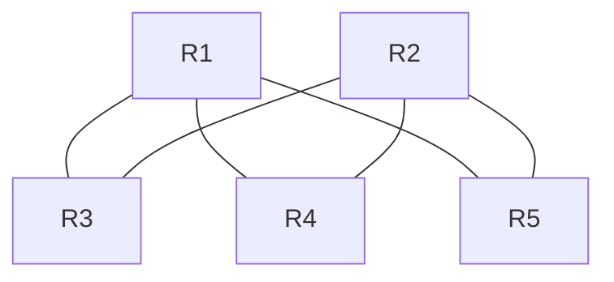
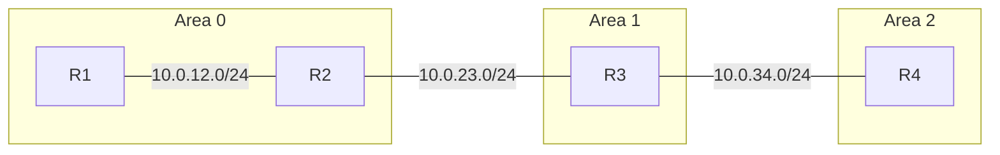
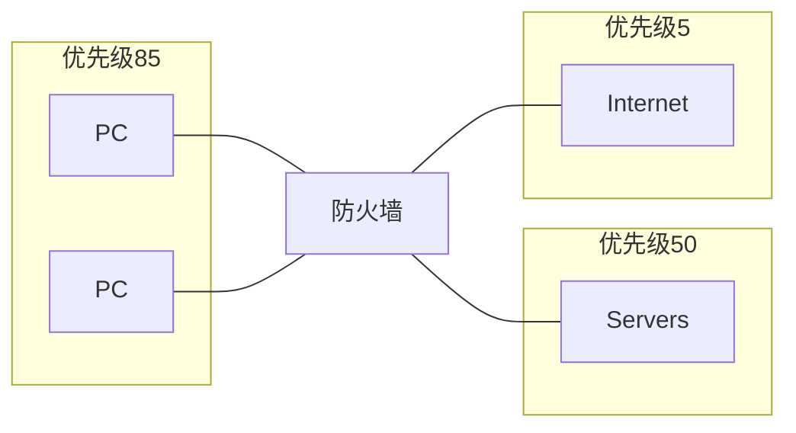
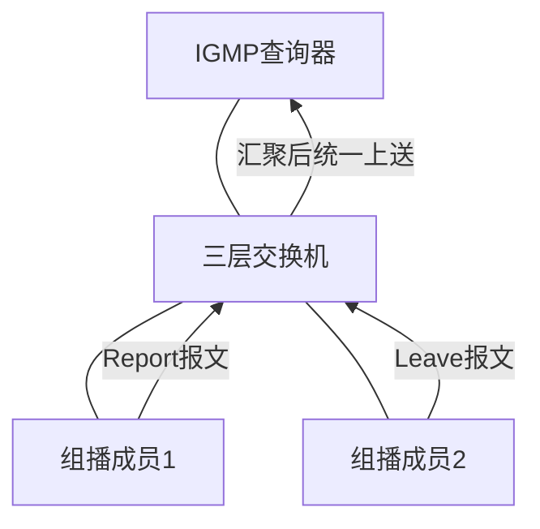

---

## 第1题

**题目：** 如图所示，在MA网络中，若要实现R1一定为DR，R2一定为BDR，R3、R4、R5不参与选举，那么R1的dr-priority最大为（____），R2的dr-priority最大为（____），R3的dr-priority为（____），R4的dr-priority为（____），R5的dr-priority为（____）。（请填写阿拉伯数字）



Router ID信息：
- R1: 10.0.255.1
- R2: 10.0.255.2
- R3: 10.0.255.3
- R4: 10.0.255.4
- R5: 10.0.255.5

**答案：** 255、254、0、0、0

**解析：**
```
在OSPF的MA网络中，DR/BDR选举规则如下：
1. dr-priority值越大越优先，最大值为255。
2. dr-priority为0表示不参与选举。
3. 要使R1一定为DR，其dr-priority应设为最大值255。
4. 要使R2一定为BDR，其dr-priority应设为次大值254。
5. R3、R4、R5不参与选举，dr-priority设为0。
```

---

## 第2题

**题目：** R1、R2、R3和R4运行OSPF，区域ID如图所示，则（____）会产生Type-3 LSA。（请填写设备名称，例如R1）



**答案：** R2

**解析：**
```
在OSPF协议中，Type-3 LSA（网络汇总LSA）由ABR（区域边界路由器）产生，用于描述区域间的路由信息。
R2同时连接Area 0和Area 1，是ABR，因此会产生Type-3 LSA。
R3连接Area 1和Area 2，但Area 2不是骨干区域，R3不是骨干区域的ABR。
注意：Type-3 LSA只能由连接骨干区域的ABR产生。
```

---

## 第3题

**题目：** VRRP协议中定义了三种状态机，其中只有处于（____）状态的设备才可以转发那些发送到虚拟IP地址的报文。（英文全称，首字母大写）

**答案：** Master

**解析：**
```
VRRP协议中存在Master状态和Backup状态，只有处于Master状态的设备才会实际承担转发任务，处理发送到虚拟IP地址的报文。
Backup设备处于监听状态，当Master设备故障时，Backup设备会接管成为新的Master。
```

---

## 第4题

**题目：** SPT PIM网络中存在两种路由表项，其中（S，G）路由表项主要用于在PIM网络中建立（____），对于PIM-DM和PIM-SM网络均适用。（英文缩写，全大写）

**答案：** SPT

**解析：**
```
在SPT PIM网络中，(S, G)路由表项主要用于建立Source Tree Path（SPT），也就是源树路径。
无论是在PIM-DM还是PIM-SM网络中，(S, G)路由表项都发挥着相同的作用，即用于构建从源节点到所有接收者节点的路径树。
```

---

## 第5题

**题目：** IS-IS路由协议与OSPF路由协议相比，具有更好的扩展性，主要是因为IS-IS构建报文时，使用了（____）结构。（英文缩写，全大写）

**答案：** TLV

**解析：**
```
IS-IS（Intermediate System to Intermediate System，中间系统到中间系统）路由协议与OSPF相比，具有更好的扩展性。
这一优势主要归因于IS-IS在构建报文时使用了TLV（Type-Length-Value）结构。
TLV结构是一种灵活的数据结构，用于网络通信中的数据封装：
- "T"代表类型（Type），用于标识数据种类或类别
- "L"代表长度（Length），用于描述数据的长度
- "V"代表值（Value），包含具体的数据内容
由于TLV结构的灵活性，IS-IS可以很方便地扩展新的功能，只需增加新的TLV类型即可，而不需要改变整个报文结构。
```

---

## 第6题

**题目：** 一条BGP路由都拥有多个路径属性，当路由器通告BGP路由给它的对等体时，该路由将会携带多个路径属性，这些属性描述了BGP路由的各项特征，同时在某些场景下也会影响BGP路由优选的决策。其中（____）属性是华为设备的特有属性，该属性仅在本地有效，不会传递给BGP邻居。（按BGP路由表中的回显，全小写）

**答案：** prefval

**解析：**
```
prefval属性是华为设备的特有属性，它仅在本地有效，不会传递给BGP邻居。
该属性用于BGP路由优选，值越大越优先，是华为设备独有的本地优先级属性。
```

---

## 第7题

**题目：** 华为路由器收到报文后，会按照ACL匹配规则进行报文匹配。缺省情况下，华为路由器采用的ACL匹配顺序是（____）模式。（英文全称，全小写）

**答案：** config

**解析：**
```
华为设备的ACL匹配顺序有两种模式：
1. config模式（配置顺序）：按照ACL规则的配置顺序进行匹配，先配置的规则优先匹配。
2. auto模式（自动顺序）：按照深度优先原则自动排序进行匹配。
缺省情况下，华为路由器采用config模式，即按照规则的配置顺序进行匹配。
```

---

## 第8题

**题目：** 某路由器配置了一条IP-Prefix，配置命令为：`ip ip-prefix huawei index 10 permit 10.1.1.0 24 greater-equal 26`，那么此时greater-equal-value=（____），less-equal-value=（____）。（请填写阿拉伯数字）

**答案：** 26、32

**解析：**
```
在配置IP-Prefix时，命令 ip ip-prefix huawei index 10 permit 10.1.1.0 24 greater-equal 26 表示：
- 匹配的IP前缀范围是10.1.1.0/24网段
- greater-equal 26 表示掩码长度大于等于26位
- 如果只配置了greater-equal而没有配置less-equal，则less-equal-value默认为32（即最大掩码长度）
因此，greater-equal-value = 26，less-equal-value = 32
```

---

## 第9题

**题目：** 在实际的网络环境中，某些特殊的业务数据流的会话信息需要长时间不被老化。管理员可以通过命令（____）enable，启用长连接功能，从而可以保证此类业务正常运行。（英文全称，全小写）

**答案：** long-link

**解析：**
```
long-link enable命令用于在防火墙上启用长连接功能。
对于某些特殊业务（如数据库连接、金融交易等），其会话需要长时间保持，
启用长连接功能后，这些会话不会因为超时而被老化断开，从而保证业务的正常运行。
```

---

## 第10题

**题目：** 如图所示，缺省情况下华为防火墙已创建四个区域，并有着对应的优先级。其中优先级数值为100的区域是（____）区域。（英文全称，首字母大写）



**答案：** Local

**解析：**
```
华为防火墙缺省创建四个安全区域及其优先级：
1. Local区域：优先级100，防火墙自身接口所在区域
2. Trust区域：优先级85，通常用于内网
3. DMZ区域：优先级50，通常用于服务器区
4. Untrust区域：优先级5，通常用于外网/Internet

优先级数值越大，安全级别越高。Local区域优先级最高（100），因为防火墙自身最可信。
```

---

## 第11题

**题目：** 在VRRP组网中，VRRP备份组通过收发VRRP协议报文进行主备状态的协商，以实现设备的冗余备份功能。当VRRP备份组之间的链路出现故障时，由于此时VRRP报文无法正常协商，Backup设备需要等待（____）倍协商周期后才会切换为Master设备。（阿拉伯数字）

**答案：** 3

**解析：**
```
在VRRP组网中，VRRP备份组通过收发VRRP协议报文来协商主备状态。
AdverInt字段在VRRP协议报文中表示报文发送的时间间隔，默认为1秒。
当链路出现故障，导致VRRP报文无法正常协商时，Backup设备不会立即切换为Master设备，
而是会等待3倍的AdverInt时间间隔后，才进行切换。
这是为了确保在网络轻微抖动或短暂丢包时不会发生不必要的主备切换。
```

---

## 第12题

**题目：** 在IS-IS网络中，某台路由器区域号为49.0001，Router-ID为10.10.1.1，为了便于管理，一般根据RouterID配置SystemID。那么其对应的NET地址应该为：（____）（填写阿拉伯数字，用"."分开）

**答案：** 49.0001.0100.1000.1001.00

**解析：**
```
NET（Network Entity Title，网络实体标识）由三部分组成：
区域ID + 系统ID（System ID） + 协议标识符（NSEL）

转换方法：
1. 区域ID为49.0001
2. System ID根据Router-ID（IPv4地址）转换：
   - 将IPv4地址每段补前导0扩展成三位：010.010.001.001
   - 重新划分成3部分，每部分4位数字：0100.1000.1001
3. 协议标识符（NSEL）为00

因此NET地址为：49.0001.0100.1000.1001.00
```

---

## 第13题

**题目：** 现网中可能存在一台IGMP查询器需要管理大量组成员的情况，大量成员主机频繁加入/离开组播组时，会产生大量的IGMP成员关系报告/离开报文，从而给IGMP查询器带来较大的处理压力。为了减轻IGMP查询器压力，可以在三层交换机上部署IGMP（____）功能，来减少IGMP查询器接收IGMP成员关系报告/离开报文的数量，由该设备将成员关系报告/离开报文汇聚后统一上送给IGMP查询器。（英文全称，首字母大写）



**答案：** Proxy

**解析：**
```
IGMP Proxy（IGMP代理）功能部署在三层交换机上，用于减轻IGMP查询器的压力。
IGMP Proxy设备负责：
1. 下游侧：作为IGMP查询器，与组成员交互IGMP报文
2. 上游侧：作为组成员，向IGMP查询器发送汇聚后的报告/离开报文
这样IGMP查询器只需与Proxy设备交互，大大减少了需要处理的IGMP报文数量。
```

---

## 第14题

**题目：** 在OSPF网络中，缺省接口开销的计算方式是缺省参考值除以接口实际带宽。其中，默认情况下，缺省参考值为（____）mbit/s。（请填写阿拉伯数字）

**答案：** 100

**解析：**
```
在OSPF网络中，接口开销（Cost）的计算公式为：
接口开销 = 参考带宽 / 接口实际带宽

默认情况下，OSPF的缺省参考值为100 Mbit/s。
例如：
- 100M接口的开销 = 100 / 100 = 1
- 10M接口的开销 = 100 / 10 = 10
- 1000M接口的开销 = 100 / 1000 = 1（不足1时按1计算）

注意：当接口带宽超过参考带宽时，所有高速接口的开销都为1，无法区分，
此时可以通过调整参考带宽（auto-cost reference-bandwidth）来解决。
```

---

## 第15题

**题目：** 在OSPF网络中，每台OSPF路由器都会产生Router LSA，若该报文中E位置1，则表示产生此LSA的路由器角色是（____）。（英文缩写，全大写）

**答案：** ASBR

**解析：**
```
在OSPF中，Router LSA（Type 1 LSA）是每台路由器都会产生的LSA，用于描述该路由器的链路状态信息。
Router LSA中包含多个标志位：
- E位（External bit）：置1表示该路由器是ASBR（Autonomous System Boundary Router，自治系统边界路由器），即引入了外部路由。
- B位（Border bit）：置1表示该路由器是ABR（Area Border Router，区域边界路由器）。
- V位：置1表示该路由器是虚连接的端点。

因此，E位置1表示产生该LSA的路由器角色是ASBR。
```

---

## 第16题

**题目：** 在OSPF网络中，若路由表的协议字段显示为（____），则表示该路由为OSPF的外部路由。（英文字母全大写）

**答案：** O_ASE

**解析：**
```
在OSPF网络中，路由表的协议字段用于标识路由的来源和类型：
- O：OSPF区域内路由（Intra-area）
- O IA：OSPF区域间路由（Inter-area）
- O_ASE：OSPF外部路由（ASE - AS External），即由ASBR引入的外部路由

当协议字段显示为O_ASE时，表示该路由是OSPF的外部路由。
```

---

## 第17题

**题目：** 在初始形成STP树的过程中，所有STP交换机都认为自己是根桥，因此缺省情况下，会周期性地（每（____）秒）主动产生并发送配置BPDU。（阿拉伯数字）

**答案：** 2

**解析：**
```
在STP（生成树协议）初始形成过程中，所有交换机都认为自己是根桥，
会周期性地发送配置BPDU（桥协议数据单元）来进行根桥选举。
缺省情况下，配置BPDU的发送周期为2秒（Hello Time）。
这个时间参数是STP协议中的重要参数，用于判断交换机状态和生成树稳定性。
```

---

## 第18题

**题目：** 为了书写方便，IPv6提供了压缩格式。那么该IPv6地址：FC00:0000:130F:0000:0000:09C0:876A:130B以最简的形式书写应该简化为（____）。

**答案：** FC00:0:130F::9C0:876A:130B

**解析：**
```
IPv6地址压缩规则：
1. 每个分段中的前导零可以省略，例如0000可以简写为0，09C0可以简写为9C0。
2. 地址中连续的全零分段可以用双冒号"::"表示，但整个地址中"::"只能出现一次。
3. 如果有多处连续零段，应选择最长的那段用"::"表示。

对于FC00:0000:130F:0000:0000:09C0:876A:130B：
- 省略前导零：FC00:0:130F:0:0:9C0:876A:130B
- 第4段和第5段是连续的零段，用"::"替换
- 最终结果：FC00:0:130F::9C0:876A:130B

注意：第2段的单个零段和第4-5段的两个连续零段，选择更长的连续零段用"::"压缩。
```

---

## 第19题

**题目：** 工程师在配置BGP聚合路由时，可以通过设置关键字（____）来抑制聚合路由所包含的所有具体路由，只发布聚合路由。这样生成的聚合路由只携带Atomic-aggregate属性并且不能携带原具体路由的团体属性。（英文全称，全小写）

**答案：** detail-suppressed

**解析：**
```
在BGP聚合路由配置中，detail-suppressed关键字用于抑制聚合路由所包含的所有具体路由，只发布聚合路由。
与suppress-policy不同，detail-suppressed是抑制所有具体路由，不需要配置策略。
使用detail-suppressed生成的聚合路由：
- 只携带Atomic-aggregate属性
- 不能携带原具体路由的团体属性
- 只发布聚合路由，不发布具体路由明细
```

---

## 第20题

**题目：** 当AC和AP间是三层组网时，AP可通过DHCP服务器回应报文中所携带的Option（____）字段获取AC的IP地址10.100.30.10。（请填写阿拉伯数字）

**答案：** 43

**解析：**
```
在DHCP（动态主机配置协议）中，Option 43是一个特定的厂商特定选项，
用于在DHCP响应报文中携带额外信息。

当AC（接入控制器）和AP（接入点）之间采用三层组网时，
AP需要通过某种方式获取AC的IP地址以便进行通信和注册。
DHCP服务器可以在其响应报文中使用Option 43字段来提供AC的IP地址信息，
AP解析该字段后即可获取到AC的IP地址，从而完成后续的通信和配置过程。
```

---

## 第21题

**题目：** 在BGP中Keepalive报文用于维持BGP对等体关系。当BGP路由器收到对端发送的Keepalive报文，将对等体状态置为已建立，同时后续定期发送Keepalive报文用于保持连接。默认情况下，设备每隔（____）秒发送一次Keepalive报文。（阿拉伯数字）

**答案：** 60

**解析：**
```
BGP Keepalive报文用于维持BGP对等体关系，确保连接的有效性。
默认情况下：
- Keepalive报文发送间隔为60秒
- 保持时间（Hold Time）为180秒（即3倍的Keepalive间隔）
如果在保持时间内未收到对端的Keepalive报文，则认为对等体连接中断。
```

---

## 第22题

**题目：** 在OSPF网络中，AS-external LSA用于描述到达AS外部的路由，其中该LSA（____）的字段为0.0.0.0时，才会将到达该外部网络的流量发往引入这条外部路由的ASBR。（请填写字段缩写，且英文字母全大写）

**答案：** FA

**解析：**
```
在OSPF中，AS-external LSA（Type 5 LSA）用于描述到达自治系统外部的路由信息。
其中FA（Forwarding Address，转发地址）字段起着关键作用：
- 当FA字段为0.0.0.0时，表示流量需要发往引入这条外部路由的ASBR本身。
- 当FA字段不为0.0.0.0时，表示流量可以直接发往该转发地址，不需要经过ASBR转发。
FA字段的存在可以优化路由转发路径，避免不必要的迂回。
```
