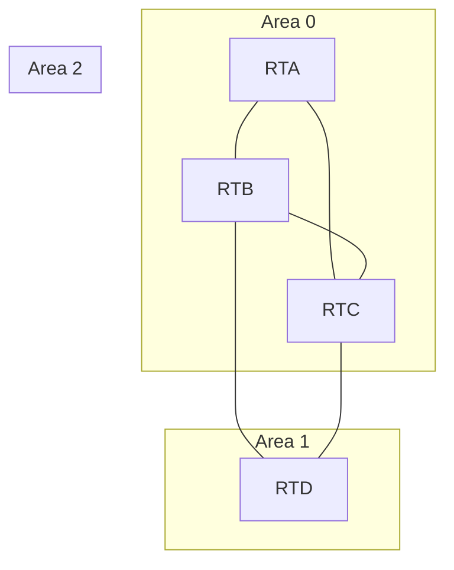
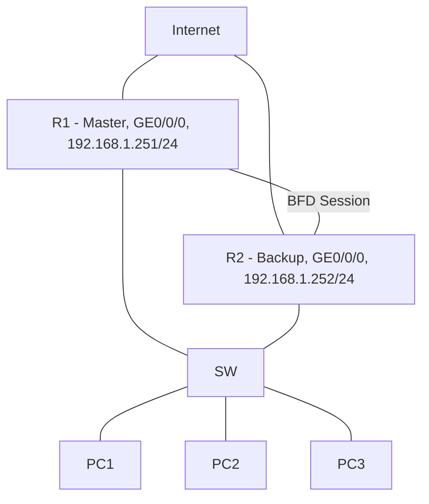

# 821y 判断题集

---

## 第1题

**题目：** 某网络结构和OSPF分区如图所示，图中除了RTA之外，RTB、RTC和RTD都是ABR路由器。



**答案：** **错误**

**解析：**
```
ABR（区域边界路由器）是指同时连接骨干区域（Area 0）和非骨干区域的路由器。
- RTB连接Area 0和Area 1，是ABR
- RTC连接Area 0和Area 2，是ABR
- RTD连接Area 1和Area 2，但没有连接骨干区域Area 0，因此不是ABR
因此"RTB、RTC和RTD都是ABR路由器"的说法错误。
```

---

## 第2题

**题目：** ospf dr-priority命令默认值为1，取值范围为0~255.

**答案：** **正确**

**解析：**
```
优先级默认为1，取值范围0-255
```

---

## 第3题

**题目：** MP-BGP用于实现BGP-4的的扩展以允许BGP带多种网络层协议。这种扩展有很好的后向兼容性，即一个支持MP-BGP的路由器可以和一个仅支持BGP-4的路由器交互

**答案：** **正确**

**解析：**
```
标准BGP-4仅支持IPv4 Unicast地址（单播协议使用的地址），即仅能传播IPv4 Unicast Route信息。为了支持更多的网络层协议，提出MP-BGP，作为BGP-4的多协议扩展。MP-BGP允许在BGP中同时分发不同类型的AF（地址族，Address Family），具有良好的后向兼容性。
```

---

## 第4题

**题目：** 在BGP中，路由反射器RR会将学习的路由反射出去，从而使得IBGP路由在AS内传播无需建立IBGP全互联。

**答案：** **正确**

**解析：**
```
路由反射器（RR）的作用主要是为了简化IBGP邻居配置，使用反射器后允许反射器将来自IBGP邻居的路由信息发给另一个或一组IBGP邻居。路由器让被配置为路由反射器的路由器向其他IBGP对等体传输由IBGP所学到的路由来修改BGP的横向隔离规则，也就不再需要全互连的IBGP对等体。
```

---

## 第5题

**题目：** DHCPv6使用IPv6组播地址FF05::1:3用于中继代理和服务器之间的通信。

**答案：** **正确**

**解析：**
```
FF05::1:3（All DHCP Servers）：所有DHCPv6服务器组播地址，这个地址是站点范围的，用于中继代理和服务器之间的通信，站点内的所有DHCPv6服务器都是此组的成员。
```

---

## 第6题

**题目：** Community属性是可选过渡属性，是一种路由标记，用于简化路由策略的执行

**答案：** **正确**

**解析：**
```
该属性为可选传递属性，是一种路由标记，用于简化路由策略的执行，可以将某些路由分配一个特定的Community属性值，之后就可以基于Community值而不是网络号/掩码信息来抓取路由并执行相应的策略了。
```

---

## 第7题

**题目：** 在BGP中，当一条路由被反射器反射后，该RR的Cluster_ID就会被添加至路由的Cluster List属性中，用于判断是否存在环路。

**答案：** **正确**

**解析：**
```
每一个经过RR反射的路由条目，都会在自己的cluster-list中添加RR的cluster-id，用于在不同的簇之间防止环路的发生。
```

---

## 第8题

**题目：** VRF路由表里的OSPF外部路由不允许被路由汇总（asbr-summary）

**答案：** **错误**

**解析：**
```
VRF路由表里的OSPF外部路由允许被路由汇总（asbr-summary）。
```

---

## 第9题

**题目：** SFTP相比于FTP来讲更安全，因为使用了SSH来提供文件传输时的保护，一般情况下，SFTP使用TCP 22端口来进行数据的传输。

**答案：** **正确**

**解析：**
```
SFTP具有更高的安全性，其利用SSH保障文件传输，通常通过TCP 22端口传输数据，此说法符合实际情况。
```

---

## 第10题

**题目：** 在OSPFv2网络中，一台路由器可以同时运行多个不同的OSPF进程，并可以将同一个接口网段宣告进不同的进程中，它们之间是互不影响，彼此独立的。

**答案：** **错误**

**解析：**
```
在OSPFv2网络中，虽然一台路由器可以运行多个OSPF进程，但每个接口网段在同一时间只能宣告加入一个OSPF进程中。这是因为OSPF协议设计时，为了保证路由信息的准确性和一致性，不允许同一个接口网段同时宣告进不同的OSPF进程。因此，多个OSPF进程之间并不是完全互不影响、彼此独立的。
```

---

## 第11题

**题目：** 在IS-IS网络中，直连的两台路由器不管是P2P网络类型或是Broadcast网络类型，缺省情况下，都是3次握手建立邻居关系。

**答案：** **正确**

**解析：**
```
在IS-IS（Intermediate System to Intermediate System）网络协议中，无论是P2P（点对点）网络类型还是Broadcast（广播）网络类型，直连的两台路由器在缺省情况下都是通过3次握手来建立邻居关系的。这是IS-IS协议的一个基本特性，确保了网络邻居关系的可靠建立。
```

---

## 第12题

**题目：** BGP中Next Hop属性记录了路由的下一跳信息，和IGP中的下一跳一样，一定是邻居接口的IP地址。

**答案：** **错误**

**解析：**
```
BGP（边界网关协议）中的Next Hop属性确实记录了路由的下一跳信息。然而，它并不一定是邻居接口的IP地址。在BGP中，Next Hop可以是其他设备，包括其他路由器或交换机等网络设备。所以这个叙述是不完全准确的，BGP的Next Hop信息不一定仅限于邻居接口的IP地址。
```

---

## 第13题

**题目：** 当BGP收到到达同一目的地的多条路由时，会根据选路规则选择出最优路由，因此无法实现负载分担。

**答案：** **错误**

**解析：**
```
当BGP收到到达同一目的地的多条路由时，会根据选路规则选择出最优路由，但在特定条件下也能实现负载分担。
```

---

## 第14题

**题目：** BGP路由表路由数量通常比较大，传递大量的路由对设备来说是一个很大的负担，为了减小路由发送规模，需要对发布的路由进行控制，只发送自己想要发布的路由或者只发布对等体需要的路由。

**答案：** **正确**

**解析：**
```
BGP路由表中路由数量众多，传递大量路由会给设备造成很大的负担，需对发布的路由进行控制，只发送自己想要发布的路由或者只发布对等体需要的路由。
```

---

## 第15题

**题目：** 在配置EBGP时，缺省情况下EBGP连接允许的最大跳数为1，即只能在物理直连链路上建立EBGP连接。

**答案：** **正确**

**解析：**
```
在配置EBGP时，缺省情况下EBGP连接允许的最大跳数为1，即只能在物理直连链路上建立EBGP连接。可通过ebgp-max-hop命令修改跳数。
```

---

## 第16题

**题目：** 网络实体名称是一种特殊的NSAP，由区域地址和SystemID组成，且SEL固定取值00，主要用于路由计算。

**答案：** **正确**

**解析：**
```
网络实体名称（Network Entity Title，NET）是一种特殊的网络服务访问点（NSAP）地址，在OSI网络模型中用于标识网络层实体。它由区域地址和System ID两部分组成，其中SEL（Selector）字段固定取值为00。
```

---

## 第17题

**题目：** 在IS-IS网络中，每台路由器都至少拥有一个，若某台路由器同时配置了多个NET，应确保这些NET的SystemID相同。

**答案：** **正确**

**解析：**
```
在IS-IS网络中，每台路由器都至少拥有一个NET。若某台路由器同时配置了多个NET，应确保这些NET的System ID相同，因为System ID标识了路由器本身。
```

---

## 第18题

**题目：** 在IS-IS网络中，区域是根据路由器来划分的，一台路由器只能属于一个区域，因此IS-IS路由器只需要维护当前所在区域的LSDB即可。

**答案：** **错误**

**解析：**
```
Level-1-2路由器需维护Level-1和Level-2两个区域的LSDB，并非仅当前所在区域。
```

---

## 第19题

**题目：** AI时代的典型特征是关注数据，挖掘数据价值并提升AI运行效率，因此AI对数据中心网络的核心诉求是要快，即低时延。

**答案：** **正确**

**解析：**
```
AI时代关注数据、挖掘数据价值并提升AI运行效率，这使得AI对数据中心网络的核心诉求为低时延，以实现快速处理，满足其运行需求。
```

---

## 第20题

**题目：** 某企业办公网络中，运行了OSPF路由协议且划分了多个OSPF区域，为减少路由表规模和优化设备资源利用率，该企业网络工程师可在ASBR上执行路由汇总，减少区域间的三类LSA。

**答案：** **错误**

**解析：**
```
为减少路由表规模和优化设备资源利用率，该企业网络工程师可在ABR上执行路由汇总，减少区域间的三类LSA。三类LSA是由ABR产生的，路由汇总也应在ABR上配置。
```

---

## 第21题

**题目：** 在OSPF网络中，若网络类型为NBMA，则路由器会以单播形式发送所有协议报文；若网络类型为Broadcast，则路由器会以组播形式发送所有协议报文。

**答案：** **错误**

**解析：**
```
在OSPF网络中，网络类型的不同确实会影响路由器的报文发送方式。对于NBMA网络类型，路由器会使用单播形式发送部分协议报文，但并非"所有"协议报文。而对于Broadcast网络类型，路由器确实可能使用组播形式发送某些协议报文，但具体发送方式还需根据OSPF的具体实现和配置来确定，不一定是"所有"协议报文。
```

---

## 第22题

**题目：** 在OSPF网络中，某台路由器收到一条LSA，检查发现该LSA的checksum错误，则会忽略该LSA，并终止泛洪。

**答案：** **正确**

**解析：**
```
在OSPF网络中，LSA（Link State Advertisement）是路由器之间交换信息的一种方式。收到LSA后若checksum错误，会忽略该LSA并终止泛洪，这样做是为了保证路由协议的稳定性和网络的健壮性。
```

---

## 第23题

**题目：** 某企业使用OSPF路由协议实现网络通信，为确保数据来源的合法性及安全性，开启了OSPF支持的所有认证方式。针对上述情况，OSPF路由器将优先使用接口认证。

**答案：** **正确**

**解析：**
```
OSPF支持区域认证和接口认证两种方式。当同时开启时，OSPF路由器会优先使用接口认证。接口认证通过验证接口上的数据包来确认其来源的合法性。
```

---

## 第24题

**题目：** 在OSPF网络中，若两台Router-ID相同的路由器运行在不同区域，且其中一台路由器为ASBR，则会造成LSA振荡。

**答案：** **正确**

**解析：**
```
在OSPF网络中，Router-ID是路由器的唯一标识符。如果两台具有相同Router-ID的路由器运行在不同的区域，且其中一台是ASBR（自治系统边界路由器），那么确实可能会造成LSA（链路状态通告）的振荡。LSA振荡是由于路由信息的不稳定导致的，可能会对网络的稳定性和性能产生负面影响。
```

---

## 第25题

**题目：** 在IP组播中，RPF路由只可以从单播路由和组播静态路由中选举产生。

**答案：** **错误**

**解析：**
```
在IP组播中，RPF路由可以从单播路由、组播静态路由和MBGP路由中选举产生。
```

---

## 第26题

**题目：** 在防火墙中，对于一个已经建立的会话表项，只有当它不断被报文匹配才有存在的必要，如果长时间，不再需要该条会话表项了。此时，为了节约系统资源没有报文匹配，则说明可能通信双方已经断开了连接系统会在一条表项连续未匹配一段时间后，将其删除。

**答案：** **正确**

**解析：**
```
在防火墙的工作机制中，会话表项用于记录通信双方的连接状态。当一个新的会话建立时，防火墙会创建一个对应的会话表项。这个表项会持续存在，以便防火墙能够根据会话状态对后续的报文进行快速处理。然而，如果会话表项长时间没有报文匹配，即通信双方不再通过该会话进行数据传输，那么这个表项就失去了存在的必要。为了节约系统资源，防火墙会在一条表项连续未匹配一段时间后将其删除。
```

---

## 第27题

**题目：** 在OSPF网络中，若某台路由器收到一条LSA，发现本地LSDB已存在，但收到的更新，则会更新LSDB并泛洪该LSA

**答案：** **正确**

**解析：**
```
在OSPF协议中，LSA（链路状态通告）是用于描述网络拓扑结构的信息。当一台路由器收到一条LSA时，它会首先检查本地的LSDB（链路状态数据库）是否已存在该LSA。如果本地LSDB已存在该LSA，但收到的LSA是一个更新（即序列号更高或内容有所变化），那么路由器会更新本地的LSDB，并且为了确保网络中的其他路由器也能获得这条更新信息，它会泛洪这条更新的LSA给其邻居。
```

---

## 第28题

**题目：** 在IS-IS网络中，同一Level-1区域内的所有路由器必须配置相同的区域地址才能通信，但同一Level-2区域内的路由器配置不同的区域地址也可进行通信。

**答案：** **正确**

**解析：**
```
在IS-IS网络中，对于Level-1区域，同一区域内的所有路由器必须配置相同的区域地址才能进行通信。而对于Level-2区域，路由器可以配置不同的区域地址，Level-2路由器负责不同区域之间的路由，因此不同区域地址的Level-2路由器也可以进行通信。
```

---

## 第29题

**题目：** 当设备遭到恶意攻击或者网络中出现错误配置时，会导致BGP从邻居接收到大量的路由，从而消耗大量设备的资源。因此管理员必须根据网络规划和设备容量，对运行时所使用的资源进行限制。BGP提供了基于对等体的路由控制，限定邻居发来的路由数量，这样可以避免上述问题。

**答案：** **正确**

**解析：**
```
BGP（边界网关协议）是一种用于在不同自治系统之间交换路由信息的协议。为了应对恶意攻击或错误配置导致接收大量路由的情况，管理员需要根据网络规划和设备容量对运行时所使用的资源进行限制。BGP提供了基于对等体的路由控制机制，允许管理员限定邻居发来路由数量。
```

---

## 第30题

**题目：** 在BGP中MED属性仅在相邻两个AS之间传递，收到此属性的AS一方不会再将其通告给任何其他第三方AS，同时，缺省情况下路由器只比较来自同一相邻AS的BGP路由的MED值，也就说如果去往同一个目的地的两条路由来自不同的相邻AS，则不进行MED值的比较。

**答案：** **正确**

**解析：**
```
在BGP中，MED（Multi-Exit Discriminator）属性是一种可选非传递属性。MED属性仅在相邻的两个自治系统（AS）之间传递，当一个AS收到此属性后，它不会再将该属性通告给任何其他第三方AS。此外，在缺省情况下，路由器仅会比较来自同一相邻AS的BGP路由的MED值，以确定最优路径。如果去往同一个目的地的两条路由来自不同的相邻AS，则不进行MED值的比较。
```

---

## 第31题

**题目：** BGP存在两种对等体关系类型：EBGP及IBGP，其中在配置EBGP时，Peer命令所指定的对等体IP地址要求路由可达，并且UDP连接能够正确建立

**答案：** **错误**

**解析：**
```
后半句有误，是TCP连接能够正确建立，不是UDP连接。BGP使用TCP端口179建立连接。
```

---

## 第32题

**题目：** 路由器分别定义了外部优先级和内部优先级，路由器选择路由时会先比较路由的内部优先级，若内部优先级相同，则比较外部优先级，数值越小越优

**答案：** **错误**

**解析：**
```
路由器的确会定义外部优先级和内部优先级，但并不是所有路由器都遵循"内部优先级相同，再比较外部优先级"的规则。具体选择路由时如何比较这些优先级，需要根据路由器的具体配置和使用的路由协议来确定。实际比较顺序通常是先比较外部优先级，再比较内部优先级。
```

---

## 第33题

**题目：** 在BGP中notification报文用于在改变路由策略后请求对等体重新发送路由信息。

**答案：** **错误**

**解析：**
```
改变路由策略后并不通过Notification报文来请求对等体重新发送路由信息。Notification报文用于通知错误。实际上，如果需要更新或重新发送路由信息，可能会使用其他类型的BGP消息，如Update报文或Route-Refresh报文。
```

---

## 第34题

**题目：** 访问控制列表是路由策略中常用匹配工具之一，在一台路由器配置ACL后，即可用于匹配相应路由

**答案：** **错误**

**解析：**
```
访问控制列表（ACL）确实是路由策略中常用的一种匹配工具，它主要用于过滤网络流量，控制数据包的传输。然而，ACL本身并不能直接用于"匹配相应路由"。路由的匹配和选择是由路由协议和路由表共同完成的，与ACL的功能有所区别。ACL需要配合路由策略工具（如route-policy）使用才能匹配路由。
```

---

## 第35题

**题目：** 某华为路由器配置了PBR，因为PBR策略的优先级高于传统路由表，因此被匹配的报文会优先根据PBR的策略进行转发。

**答案：** **正确**

**解析：**
```
PBR策略优先级高于传统路由表，所以匹配的报文会优先依据PBR策略转发，这符合华为路由器的配置规则和网络原理。
```

---

## 第36题

**题目：** MQC和PBR均可在设备接口上调用，对接收和发送的报文进行流量过滤或控制报文的转发路径

**答案：** **错误**

**解析：**
```
PBR只能在接口入方向（接收方向）的报文进行过滤和控制；而MQC可以应用在接口入方向和出方向，对接收和发送的报文进行过滤和控制。
```

---

## 第37题

**题目：** 在RSTP网络中，如果一个接口收到一个RST BPDU，发现自身缓存的RST BPDU优于收到的RST BPDU，则会直接丢弃收到的RST BPDU，不做其他回应。

**答案：** **错误**

**解析：**
```
如果该端口缓存的RST BPDU优于收到的RST BPDU，那么该端口会直接丢弃收到的RST BPDU，立即回应自身缓存的RST BPDU，从而加快收敛速度，而不是"不做其他回应"。
```

---

## 第38题

**题目：** 互联网编号分配委员会将D类地址空间分配给IPV4组播使用，IPv4地址一共32位，D类地址最高4位为1111。

**答案：** **错误**

**解析：**
```
D类地址高四位为1110，不是1111。D类地址范围是224.0.0.0~239.255.255.255。
```

---

## 第39题

**题目：** 在IPv6网络中，为了减少中间转发设备的处理压力，中间转发设备不对IPv6报文进行分片，报文的分片只在源节点进行。

**答案：** **正确**

**解析：**
```
在IPv6网络中，为了优化网络传输效率和减轻中间转发设备的负担，采用了只在源节点进行报文分片的设计。当IPv6报文在中间转发设备上被处理时，如果报文长度超过了转发接口的MTU值，中间设备不会尝试对报文进行分片。相反，它会丢弃这个超长的报文，并通过ICMPv6发送一个"Packet Too Big"的消息给源节点。源节点在收到这个消息后，会根据MTU值重新调整报文大小，并进行分片，然后再次发送。
```

---

## 第40题

**题目：** 当一个TCP会话的两个连续报文到达防火墙的时间间隔大于该会话的老化时间时，为保证网络的安全性，防火墙将从会话表中删除相应会话信息

**答案：** **正确**

**解析：**
```
当一个TCP会话的两个连续报文到达防火墙的时间间隔大于该会话的老化时间时，防火墙从会话表中删除相应会话信息，这是为了释放系统资源，提高防火墙的性能和效率，保证网络的安全性。
```

---

## 第41题

**题目：** 工程师配置组播协议之前，必须先使能IP组播路由功能，使能IP组播路由功能是配置一切组播功能的前提

**答案：** **正确**

**解析：**
```
在配置组播协议的过程中，IP组播路由功能是所有组播功能的前提。这是因为组播协议的传输依赖于IP组播路由的支撑和协助，如果没有先使能IP组播路由功能，后续的组播协议配置将无法进行。因此，工程师在配置组播协议之前，确实需要先使能IP组播路由功能。
```

---

## 第42题

**题目：** IGMPv2离组使用超时机制，组成员只能静默离组。在未超时的时间内，组播流量依然会被组播路由器转发，因此存在缺陷

**答案：** **错误**

**解析：**
```
超时机制是IGMPv1的，IGMPv2有离组机制，成员离开之后会发成员离开报文（Leave Group Message），路由器收到后会主动查询该组是否还有成员，从而更快速地停止转发。
```

---

## 第43题

**题目：** 在OSPF网络中，若将某末端区域设置为STUB区域，则该区域内不能存在ASBR。

**答案：** **正确**

**解析：**
```
在OSPF网络中，当一个区域被设置为STUB区域时，该区域确实不能存在ASBR（自治系统边界路由器）。这是OSPF协议的一种特性，Stub区域不允许引入外部路由，因此不能有ASBR，用于优化路由信息的传播，减少不必要的路由更新，从而提高网络性能和稳定性。
```

---

## 第44题

**题目：** 在OSPF网络中，7类LSA只能由NSSA区域或STUB区域中的ASBR产生，用于描述到达OSPF域外的路由。

**答案：** **错误**

**解析：**
```
7类LSA（NSSA External LSA）只能在NSSA区域中由ASBR产生，用于描述到达OSPF域外的路由。STUB区域中不能存在ASBR，也不会产生7类LSA。因此说"STUB区域中的ASBR产生7类LSA"是错误的。
```

---

## 第45题

**题目：** 为了防止路由震荡，BGP可以采用路由聚合提高网络的稳定性

**答案：** **正确**

**解析：**
```
在大规模的网络中，BGP路由表十分庞大，给设备造成了很大的负担，同时使发生路由振荡的几率也大大增加，影响网络的稳定性。路由聚合是将多条路由合并的机制，它通过只向对等体发送聚合后的路由而不发送所有的具体路由的方法，减小路由表的规模。并且被聚合的路由如果发生路由振荡，也不再对网络造成影响，从而提高了网络的稳定性。
```

---

## 第46题

**题目：** 多主检测MAD是一种检测和处理堆叠分裂的协议，有直连检测方式和代理检测方式。在同一堆叠系统中，可同时配置两种检测方式，从而避免检查标记IP和MAC冲突对业务产生影响。

**答案：** **错误**

**解析：**
```
在同一堆叠系统中，不可同时配置两种检测方式。MAD（多主检测）有直连检测方式和代理检测方式，但同一堆叠系统中只能配置其中一种。
```

---

## 第47题

**题目：** USG防火墙上提供了Local区域，代表防火墙本身。凡是由防火墙主动发出的报文均可认为是从Local区域中发出，凡是需要防火墙响应并处理（不是转发）的报文均可认为是由Local区域接收。

**答案：** **正确**

**解析：**
```
Local区域是USG防火墙上的一个特殊区域，代表防火墙本身。防火墙主动发出的报文，如向其他设备发送的管理信息等，可认为是从Local区域发出。而需要防火墙响应并处理的报文，如接收其他设备的管理请求等，可认为是由Local区域接收。
```

---

## 第48题

**题目：** 当OSPF网络类型被指定为NBMA网络时，必须在接口视图下使用ospf nbma peer x.x.x.x.x命令来互相指邻居，否则OSPF邻居关系不会建立。

**答案：** **错误**

**解析：**
```
NBMA网络不支持组播和广播，因此需要通过peer命令来单播指定邻居建立邻居关系。但peer命令是在OSPF进程视图下配置的，不是在接口视图下配置。在接口视图下无法指定邻居。
```

---

## 第49题

**题目：** 使用Route-Policy工具可以使用if-match子项匹配BGP路由的Local Preference属性。

**答案：** **错误**

**解析：**
```
if-match是用来匹配路由信息的，local-preference是BGP路由的一个属性，不能被if-match用来匹配，只能被apply用来修改。
```

---

## 第50题

**题目：** 用户购买设备后，若需要使用BFD增值特性时，需获取设备对应功能或资源的License，以满足业务的需求。

**答案：** **错误**

**解析：**
```
BFD无需license即可使用，BFD是设备基础功能，不是增值特性。
```

---

## 第51题

**题目：** 路由汇总对OSPF路由进程占用的带宽、CPU周期和内存资源有直接的影响

**答案：** **正确**

**解析：**
```
路由汇总，也称为路由聚合，是减少路由表中路由条目数量的一种方法。通过汇总多个具体路由条目为一个更概括的路由条目，可以简化路由表，从而改善路由器性能。对于OSPF这样的动态路由协议来说，路由汇总可以减少路由更新信息的大小和频率，进而减少路由器处理路由更新所需的带宽、CPU周期和内存资源。因此，路由汇总确实对OSPF路由进程占用的带宽、CPU周期和内存资源有直接的影响。
```

---

## 第52题

**题目：** NSSA区域的ABR不会向NSSA泛洪4类和5类LSA，会将7类LSA转换成5类LSA泛洪给其他区域。

**答案：** **正确**

**解析：**
```
在OSPF路由协议中，NSSA的ABR（区域边界路由器）确实不会向NSSA泛洪4类和5类LSA。同时，NSSA的ABR会把7类LSA转换成5类LSA泛洪给其他区域。这是因为7类LSA包含了到其他非本地网络和ASBR的路径信息，转换为5类LSA可以使其成为NSSA以外的区域也认识的路由信息，更好地在整个网络中传播路由信息。
```

---

## 第53题

**题目：** 路由器查找FIB表时，将报文的目的IP地址和FIB表中的各表项的掩码进行按位"逻辑或"，得到的地址符合FIB表中的网络地址则匹配。

**答案：** **错误**

**解析：**
```
路由器在查找FIB表时，不是将报文的目的IP地址和FIB表中的各表项的掩码进行按位"逻辑或"操作，而是按位"逻辑与"操作。路由器根据报文的目的IP地址和掩码做按位与运算，查找FIB表中是否存在匹配的网络前缀。
```

---

## 第54题

**题目：** 某企业OSPF网络的NSSA区域引入了大量外部路由，现用户要求减少非特殊区域的LSA数量，那么该企业工程师可在NSSA区域中的ABR上，对由7类LSA转化成的5类LSA进行路由汇总。

**答案：** **正确**

**解析：**
```
在NSSA区域中，ABR执行7类LSA转化成5类LSA动作，此时它也是ASBR。若配置路由汇总，则对由7类LSA转化成的5类LSA进行汇总，从而减少非特殊区域的LSA数量。
```

---

## 第55题

**题目：** 在OSPF网络中，某一台路由器角色为ABR，则该路由器也肯定是BR。

**答案：** **正确**

**解析：**
```
BR（Backbone Router）是骨干路由器，至少一个接口必须连接到骨干区域；ABR（Area Border Router）区域边界路由器是连接骨干区域和非骨干区域。因此某一台路由器角色为ABR，那它一定有一边是连接骨干区域的，因此也肯定属于BR。
```

---

## 第56题

**题目：** 在STP网络中，若拓扑发生变更，必须先将拓扑变化信息传递给根桥，再由根桥向下泛洪拓扑变更信息

**答案：** **正确**

**解析：**
```
在STP（生成树协议）网络中，当拓扑发生变更时，存在特定的信息传播机制。根据STP的工作原理，若网络中的拓扑发生变化，这一变化信息并不是由发现变化的网桥直接泛洪到整个网络，而是首先传递给根桥。随后，根桥会负责将这一拓扑变更信息向下泛洪，以确保网络中的所有交换机都能及时更新其生成树信息，从而维持网络的无环状态和路径的最优性。
```

---

## 第57题

**题目：** IGMP snooping功能可以使交换机工作在三层时，通过侦听上游的三层设备和用户主机之间发送的IGMP报文来建立组播数据报文的三层转发表，管理和控制组播数据报文的转发，进而有效抑制组播数据在三层网络中扩散。

**答案：** **错误**

**解析：**
```
IGMP Snooping工作在二层，不是三层。IGMP Snooping是二层组播协议，通过侦听IGMP报文来建立二层组播转发表，管理和控制组播数据报文在二层网络中的转发。
```

---

## 第58题

**题目：** 在IPv6中，当主机需要和目标主机通信时，必须先通过ARP协议获得目的主机的链路层地址。

**答案：** **错误**

**解析：**
```
IPv6使用的不是ARP协议，用的是NDP（Neighbor Discovery Protocol，邻居发现协议）来获取目的主机的链路层地址。
```

---

## 第59题

**题目：** L2TP本身不提供安全加密，因此需要借助其他安全手段比如IPSec，保证整个隧道的安全，进行传输数据。

**答案：** **正确**

**解析：**
```
L2TP（Layer 2 Tunneling Protocol，第二层隧道协议）是一种用于在两点之间建立隧道以传输数据的协议。然而，L2TP本身并不包含加密机制，因此无法确保传输数据的安全性。为了确保隧道中的数据传输安全，通常会结合使用IPsec协议。IPsec提供了一套完整的加密和验证机制，能够与L2TP协同工作，为隧道中的数据提供保护。
```

---

## 第60题

**题目：** 在IPV6中每个接口只能有一个链路本地地址，为了避免链路本地地址冲突，推荐使用链路本地地址的自动生成方式。

**答案：** **正确**

**解析：**
```
在IPv6中，每个接口只能有一个链路本地地址。链路本地地址具有链路本地范围，仅在同一链路上有效。为了避免链路本地地址冲突，推荐使用EUI-64自动生成方式来生成链路本地地址。
```

---

## 第61题

**题目：** 华为防火墙的默认安全区域不能删除，但是管理员可以手工修改安全优先级

**答案：** **错误**

**解析：**
```
华为防火墙的默认安全区域（如Local、Trust、Untrust、DMZ等）不能删除，同时默认安全区域的安全优先级也不能手工修改。只有自定义安全区域的优先级可以修改。
```

---

## 第62题

**题目：** IPsec SA是IPSec的重要组成部分，用于为IKE SA协商建立安全通道，但它本身是单向的逻辑连接，因此两个IPSec对等体之间的双向通信，最少需要建立两个SA来分别对两个方向的数据流进行安全保护。

**答案：** **正确**

**解析：**
```
IPsec SA（Security Association，安全关联）是IPSec的重要组成部分，它定义了通信双方的安全参数，如加密算法、认证方式等。由于IPsec SA是单向的逻辑连接，这意味着它只负责保护一个方向的数据流。因此，在两个IPSec对等体之间进行双向通信时，为了确保两个方向的数据流都能得到安全保护，最少需要建立两个SA，分别用于保护从A到B和从B到A的数据流。
```

---

## 第63题

**题目：** VRRP目前有两个版本，其中VRRPV2仅适用于IPV4网络，VRRPV3仅适用于IPv6网络。

**答案：** **错误**

**解析：**
```
目前，VRRP协议包括两个版本：VRRPv2和VRRPv3。VRRPv2仅适用于IPv4网络；VRRPv3适用于IPv4和IPv6两种网络。基于不同的网络类型，VRRP可以分为VRRP for IPv4（简称VRRP4）和VRRP for IPv6（简称VRRP6）。VRRP for IPv4支持VRRPv2和VRRPv3，而VRRP for IPv6仅支持VRRPv3。
```

---

## 第64题

**题目：** 在STP网络中，为了避免环路，指定端口选举完成后必须等待足够长的时间，使全网的端口状态全部确定后才能进行转发，针对STP上述问题，RSTP通过P/A机制加快了下游端口进入Forwarding状态的速度。

**答案：** **错误**

**解析：**
```
RSTP通过P/A机制加快的是上游端口转到Forwarding状态的速度，而不是下游端口。下游设备继续执行P/A协商过程。事实上对于STP，指定端口的选择可以很快完成，主要的速度瓶颈在于：为了避免环路，必须等待足够长的时间，使全网的端口状态全部确定，也就是说必须要等待至少一个Forward Delay所有端口才能进行转发。而RSTP的主要目的就是消除这个瓶颈，通过阻塞自己的非根端口来保证不会出现环路，而使用P/A机制加快了上游端口转到Forwarding状态的速度。
```

---

## 第65题

**题目：** 二层交换机支持多种以太网接口类型，其中hybrid接口与trunk接口一样，可以允许多个vlan的数据帧通过，且可以指定hybrid接口在发送某个vlan的数据帧时是否携带Tag。

**答案：** **正确**

**解析：**
```
二层交换机的hybrid接口和trunk接口在功能上有相似之处，都能允许多个vlan的数据帧通过，且能指定发送某个vlan数据帧时是否携带Tag，此表述准确无误。Hybrid接口的特点是可以灵活配置哪些VLAN带标签、哪些VLAN不带标签通过。
```

---

## 第66题

**题目：** VPN实例是一种虚拟化技术。一台物理设备上可以创建多个VPN实例，每个VPN实例拥有独立的接口、路由表和路由协议进程等。即使同一台设备有多个相同的网段，也不用担心IP地址冲突的问题。

**答案：** **正确**

**解析：**
```
VPN实例通过虚拟化技术实现。在一台物理设备上能创建多个，每个实例具备独立的接口、路由表及路由协议进程等。即使设备上存在多个相同网段，也不会出现IP地址冲突情况，这是由于VPN实例的隔离机制。
```

---

## 第67题

**题目：** 路由聚合是将多条路由合并的机制，BGP在IPV6网络中支持自动聚合和手动聚合两种方式

**答案：** **错误**

**解析：**
```
路由聚合（Route Aggregation）是网络技术中一个重要的概念，其目的是为了减少路由表的规模和复杂度。BGP确实支持在IPv6网络中进行路由聚合，但它通常只支持手动聚合，而不支持自动聚合。BGP在IPv4网络中支持自动聚合和手动聚合两种方式，而IPv6网络中仅支持手动聚合方式。
```

---

## 第68题

**题目：** 为了避免路由聚合可能引起的路由环路，BGP设计AS_Set属性，该属性是一种有序的AS_PATH属性，标明聚合路由所经过的AS号。当聚合路由重新进入AS_Set属性中列出的任何一个AS时，BGP将会检测到自己AS号在聚合路由的AS_Set属性中，于是会丢弃该聚合路由，从而避免了路由环路的形成

**答案：** **错误**

**解析：**
```
AS_Set属性是一种无序的AS_PATH属性，不是有序的。AS_SET是聚合路由中经过的AS号的集合，是无序的。而AS_SEQUENCE才是有序的AS_PATH属性。当聚合路由重新进入AS_Set属性中列出的任何一个AS时，BGP会检测到自己的AS号在AS_Set中，从而丢弃该聚合路由以避免环路，但AS_Set本身是无序的。
```

---

## 第69题

**题目：** 路由器配置访问控制列表时，可以通过ACL编号标识ACL，也可以通过名称来标识ACL。其中，配置命名型ACL时，需手工指定ACL的名字和ACL的编号。

**答案：** **错误**

**解析：**
```
配置命名型ACL时，只需手工指定ACL的名字，无需指定ACL的编号。命名型ACL通过名称来标识，系统会自动分配编号。
```

---

## 第70题

**题目：** 在WLAN网络中，网络工程师可以通过VLAN POOL将接入的用户分配到不同的VLAN中，从而减少广播域，提升网络性能。

**答案：** **正确**

**解析：**
```
在WLAN（无线局域网）网络中，VLAN POOL是一种技术，它允许网络工程师将接入的用户分配到不同的VLAN中。这样做的主要目的是通过隔离不同的用户群体来减少广播域的大小。广播域是指网络中能够接收到同一广播消息的设备集合，较小的广播域可以减少广播报文对网络带宽的占用，从而提升整体网络性能。VLAN POOL功能不仅实现了这一点，还确保了无线终端在重新上线时能够获取到相同的地址，这对于维持网络连接的稳定性和连续性至关重要。
```

---

## 第71题

**题目：** 在对等体关系建立过程中和建立之后都可能发生错误连接，当BGP检测到错误状态时，就会向对等体发送Notification，告知对端错误原因

**答案：** **正确**

**解析：**
```
题目描述的是BGP（边界网关协议）在对等体关系建立过程中和建立之后处理错误连接的方式。BGP是一个在自治系统间传递路由信息的协议，当BGP检测到错误状态时，会向对等体发送Notification报文，以告知对端错误原因。这是BGP协议的标准操作过程，用于保证网络连接稳定性和正确性。
```

---

## 第72题

**题目：** 在OSPF网络中，若两台Router-ID相同的直连路由器运行在同一区域内，会导致DD报文的主从无法选举。

**答案：** **正确**

**解析：**
```
在OSPF（开放最短路径优先）网络中，Router-ID是路由器的唯一标识符。如果两台Router-ID相同的直连路由器运行在同一区域内，确实会导致DD报文（数据库描述报文）的主从关系无法正常选举。这是因为在OSPF协议中，Router-ID用于标识路由器并参与各种选举过程，如果Router-ID相同，协议将无法区分这两台路由器，从而导致网络问题。
```

---

## 第73题

**题目：** 当BGP路由发生变化时，BGP需要对非直连的下一跳重新进行迭代。如果不对迭代后的路由进行任何限制，则BGP可能会将下一跳迭代到一个错误的转发路径上，从而造成流量损失。

**答案：** **正确**

**解析：**
```
当BGP路由发生变化时，BGP需要对非直连的下一跳重新进行迭代。如果不对迭代的结果路由进行任何限制，则BGP可能会将下一跳迭代到一个错误的转发路径上，从而造成流量丢失。此时，可配置BGP按路由策略迭代下一跳。如果迭代结果路由不能通过指定路由策略的过滤，则将该路由标识为不可达，从而避免流量丢失。
```

---

## 第74题

**题目：** 在路由器上配置ACL时，可通过指定一个唯一的数字标识该ACL，或通过名称代替编号来标识ACL。其中，命名型ACL一旦创建成功，用户便无法修改，只能删除该ACL，重新配置

**答案：** **错误**

**解析：**
```
在路由器配置访问控制列表（ACL）时，可以通过指定一个唯一的数字或名称来标识ACL。对于命名型ACL，一旦创建成功，其名称是无法修改的，但这并不意味着用户无法对ACL进行任何更改。用户仍然可以通过该名称或编号来引用和管理ACL，包括添加、删除或修改ACL中的条目。然而，如果想要更改ACL的名称，则需要删除原ACL后重新配置。题目中说"用户便无法修改"表述不准确，命名型ACL的规则是可以修改的，只是名称不能改。
```

---

## 第75题

**题目：** 一般情况下，BGP都应用于复杂的网络环境中，路由变化十分频繁。而频繁的路由振荡会消耗大量的带宽资源和CPU资源，严重时会影响到网络的正常工作，这是BGP应用过程中无法避免的问题，也无法解决。

**答案：** **错误**

**解析：**
```
一般情况下，BGP都应用于复杂的网络环境中，路由变化十分频繁。而频繁的路由振荡会消耗大量的带宽资源和CPU资源，严重时会影响到网络的正常工作，但这并非是BGP应用过程中无法避免且无法解决的问题。BGP有多种机制可以解决路由振荡问题，例如路由抑制（Route Dampening）等。
```

---

## 第76题

**题目：** 在BGP中非客户机角色既不是RR也不是客户机的IBGP设备，在AS内部非客户机与RR之间，以及所有的非客户机之间必须建立全连接关系

**答案：** **正确**

**解析：**
```
AS内部非客户机之间需要建立全互联，因为非客户机发布的路由，RR只会反射给客户机。在BGP的路由反射器（RR）场景中，非客户机（既不是RR也不是客户机的IBGP设备）之间必须建立全连接，因为RR只将从客户机收到的路由反射给其他客户机和非客户机，而从非客户机收到的路由只反射给客户机，因此非客户机之间需要全互联来保证路由的完整性。
```

---

## 第77题

**题目：** 访问控制列表可以匹配路由或数据，但不能同时匹配IP地址前缀长度和掩码长度。

**答案：** **正确**

**解析：**
```
访问控制列表（ACL）只能匹配路由的前缀，无法匹配前缀长度和掩码长度。ACL主要用于匹配IP地址范围，对于需要精确匹配前缀长度的场景，通常使用IP前缀列表（IP-prefix）来实现。
```

---

## 第78题

**题目：** 在OSPF网络中，某台路由器的Router ID配置错误，应在OSPF进程1中配置为1.1.1.1。那么网络工程师可在该设备的系统视图下，通过命令ospf 1 router-id 1.1.1.1直接修改。

**答案：** **正确**

**解析：**
```
以下3种情况会进行Router ID的重新选取：
1. 通过命令ospf router-id router-id重新配置OSPF的Router ID，并且重新启动OSPF进程
2. 重新配置全局Router ID，并且重新启动OSPF进程
3. 原来被选举为全局Router ID的IP地址被删除并且重新启动OSPF进程。
此题存在一点歧义的地方，在于题目没有强调修改后重新启动进程。但按照题目答案为正确来看，可以通过该命令进行修改配置。
```

---

## 第79题

**题目：** 在OSPF网络中，OSPF路由器是通过交互LSA实现链路状态数据库同步的，若一台OSPF路由器发现收到的LSA本地没有，则会更新LSDB并泛洪该LSA。

**答案：** **正确**

**解析：**
```
在OSPF协议中，路由器通过比较收到的LSA（链路状态通告）与本地LSDB（链路状态数据库）中的记录来判断是否需要更新。若收到的LSA本地不存在，或序列号更高（表示更新），则路由器会将其添加到LSDB并泛洪转发。题目描述符合协议机制，因此正确。
```

---

## 第80题

**题目：** IS-IS的DIS和OSPF的DR一样，在广播类型网络中需要进行选举。但不同的是，OSPF的DR默认是抢占模式而IS-IS的DIS默认是非抢占模式。

**答案：** **错误**

**解析：**
```
OSPF协议中的DR与ISIS协议的DIS的区别：
- DR选举先看优先级，再比较router-id，DIS先看优先级，再比较mac地址
- DR默认为1，取值范围为0-255，DIS默认为64，取值范围为0-127
- DR的值为0，代表放弃DR选取，DIS的值为0，只是值小，并不放弃DIS选举
- DR主要为了减少LSA泛洪，DIS是为周期发送CSNP，同步LSDB
- DR有备份的设备BDR，DIS没有备份的DIS
- DR的选举是在链路上选举的，DIS的选举分为Level-1和Level-2，在路由器上选举
- DR默认不开启抢占，DIS默认抢占
- OSPF选举DR/BDR需要waiting time达40秒，过程也较为复杂，而ISIS选举DIS等待两个Hello报文

题目说法正好相反，OSPF的DR默认是非抢占模式，IS-IS的DIS默认是抢占模式。
```

---

## 第81题

**题目：** 缺省情况下，如果没有配置Router ID但配置了多个LoopBack接口地址，那么BGP会优选Loopback接口中最大的IP地址作为Router ID

**答案：** **正确**

**解析：**
```
在BGP（边界网关协议）中，Router ID是一个重要的参数，用于唯一标识BGP路由器的身份。缺省情况下，如果没有手动配置Router ID，但配置了多个LoopBack接口地址，BGP会优选Loopback接口中最大的IP地址作为Router ID。如果没有Loopback接口，则选择物理接口中最大的IP地址。
```

---

## 第82题

**题目：** Telemetry采样的原始数据只可来自网络设备的转发面，目前支持采集设备的接口流量统计、CPU或内存数据等信息。

**答案：** **错误**

**解析：**
```
Telemetry采样的原始数据可以来自网络设备的多个方面，不仅仅是转发面。同时，Telemetry技术当前的确可以支持采集设备的接口流量统计、CPU或内存数据等信息。Telemetry的数据来源包括控制面、转发面等多个层面。
```

---

## 第83题

**题目：** 在OSPF网络中，若两台Router-ID相同的非直连路由器运行在同一区域，会导致1类LSA计算出现问题。

**答案：** **正确**

**解析：**
```
在OSPF（Open Shortest Path First）网络中，Router-ID是路由器的唯一标识符，对于OSPF路由器的正常运行和参与的路由信息交换非常重要。如果两台Router-ID相同的非直连路由器试图在同一区域运行，那么确实可能会导致一类LSA（Link State Advertisement）计算出现问题。这是因为OSPF协议需要使用Router-ID来区分不同的路由器和它们之间的连接关系，以计算最短路径。
```

---

## 第84题

**题目：** 在WLAN三层漫游场景中，用户漫游前后由于所在子网不同，为使得用户漫游后仍能正常访问漫游前的网络需将用户流量通过隧道转发到原来的子网进行中转。

**答案：** **正确**

**解析：**
```
在WLAN三层漫游场景中，用户漫游前后可能会因为所在子网的不同而导致无法直接访问漫游前的网络资源。为解决这一问题，需要将用户流量通过隧道转发到原来的子网进行中转。这是通过AC（接入控制器）间的隧道来实现的，该隧道作为数据同步和报文转发的通道，能够支持AC间的漫游，确保用户在漫游后仍然能够正常访问之前的网络资源。
```

---

## 第85题

**题目：** 某大型企业部署WLAN网络，要求减少广播域的同时，确保无线用户多次上线时可分配相同的VLAN和IP地址，则可以通过配置VLAN Pool的顺序分配算法实现。

**答案：** **错误**

**解析：**
```
在大型企业部署WLAN网络时，为了减少广播域并确保无线用户多次上线时可分配相同的VLAN和IP地址，配置VLAN Pool的顺序分配算法不能实现该需求。顺序分配算法是按顺序依次分配VLAN，不能保证同一用户多次上线时分配到相同的VLAN。要实现用户每次上线都分配到相同的VLAN，需要使用VLAN Pool的哈希分配算法（基于用户MAC地址哈希）或其他相关机制。
```

---

## 第86题

**题目：** VRRP中，主备设备都会对虚拟IP地址的ARP请求进行响应，以便故障时进行快速切换。

**答案：** **错误**

**解析：**
```
在VRRP（虚拟路由冗余协议）中，主设备确实会对虚拟IP地址的ARP请求进行响应，以便在需要时进行快速切换。然而，备份设备通常不会主动对虚拟IP地址的ARP请求进行响应，而是在主设备故障时接管主设备的IP地址和路由功能。只有Master设备响应虚拟IP的ARP请求，Backup设备不响应。
```

---

## 第87题

**题目：** 二层交换机的以太网接口支持多种接口类型，但无论哪种接口类型，都会存在缺省VLAN ID，且在华为交换机上，该缺省VLAN ID为11。

**答案：** **错误**

**解析：**
```
在华为交换机上，缺省VLAN ID为1，而不是11。无论是Access接口还是Trunk接口，其缺省VLAN（PVID）默认为VLAN 1。
```

---

## 第88题

**题目：** 管理员在配置组播协议时，如果RPF接口忘记使能PIM协议，则会导致组播分发树无法正确建立。

**答案：** **正确**

**解析：**
```
因为PIM协议是组播路由协议的一部分，它负责在路由器之间建立和维护组播分发树。RPF接口是组播报文的入接口，如果该接口没有使能PIM协议，则无法建立PIM邻居关系，组播分发树也就无法正确建立。
```

---

## 第89题

**题目：** 当SSH客户端首次访问SSH服务器，而SSH客户端没有配置SSH服务器端的公钥时，用户可以选择使能SSH客户端首次认证继续访问该SSH服务器，并在SSH客户端保存该主机公钥。这样当SSH客户端下次访问该SSH服务器时，可以用已保存的主机公钥来认证该SSH服务器。

**答案：** **正确**

**解析：**
```
在SSH（Secure Shell）协议中，公钥认证是一种常用的认证方式。当SSH客户端首次访问SSH服务器时，如果客户端没有预先配置服务器的公钥，客户端通常会提示用户是否信任并接受服务器的公钥。如果用户选择接受，这个公钥会被保存在客户端的known_hosts文件中。之后，当客户端再次访问该服务器时，它会使用保存的公钥来验证服务器的身份，确保连接的安全性。
```

---

## 第90题

**题目：** 当防火墙接收到一个报文且没有命中会话表时会直接丢弃，从而防止外部攻击，可以有效保障企业内部的信息安全。

**答案：** **错误**

**解析：**
```
当防火墙接收到一个报文且没有命中会话表时，不会直接丢弃，而是会根据预设的规则进行处理，从而防止外部攻击，可以有效保障企业内部的信息安全。防火墙会根据安全策略来决定是否允许报文通过，而不是直接丢弃所有未命中会话表的报文。
```

---

## 第91题

**题目：** 在华为路由器上，若未配置ACL或配置了ACL但没有配置规则，那么它们返回ACL的匹配结果均为不匹配。

**答案：** **正确**

**解析：**
```
在华为路由器上，若未配置ACL或配置了ACL但没有配置规则，那么它们返回ACL的匹配结果均为不匹配，这符合华为路由器的工作原理和配置规则。
```

---

## 第92题

**题目：** 双向路由重发布是指在边界路由器上把两个路由域的路由相互引入，但是容易造成次优路由和路由环路等问题。

**答案：** **正确**

**解析：**
```
双向路由重发布的这种操作确实存在容易造成次优路由和路由环路等问题。双向重发布时，由于不同路由协议的度量值不同，可能导致路由选择不是最优的，同时路由信息的相互引入可能产生路由环路，因此在配置双向重发布时需要使用路由策略进行过滤和控制。
```

---

## 第93题

**题目：** 使用ACL进行路由匹配时，不管是基本ACL还是高级ACL，或者是用户ACL，缺省情况下它们的ACL规则步长均为10。

**答案：** **错误**

**解析：**
```
缺省情况下，ACL步长为5，而不是10。步长是指ACL规则编号之间的间隔，华为设备缺省步长为5。
```

---

## 第94题

**题目：** 在OSPF或IS-IS网络中，路由器可以通过命令filter-policy import过滤掉其他邻居转发给它的LSA。

**答案：** **错误**

**解析：**
```
filter-policy import代表本地从ospf路由表进入到IP路由表中的路由进行过滤，不影响LSA的传递和本地ospf路由的计算。filter-policy只能过滤路由表中的路由，不能过滤LSA本身。LSA的泛洪是链路状态协议的基本机制，filter-policy无法阻止LSA的传递。
```

---

## 第95题

**题目：** 在设备上部署DHCP Snooping功能时，如果需要上线的用户数目超过了设备支持的DHCP Snooping绑定表规格，那么超出的用户将无法上线。

**答案：** **正确**

**解析：**
```
在设备上部署DHCP Snooping功能时，若需上线的用户数量超出设备支持的DHCP Snooping绑定表规格，那么超出部分的用户确实无法上线，这是该功能的正常限制。
```

---

## 第96题

**题目：** 在大型WLAN网络中，网络工程师通常采用漫游技术实现无线终端在不同AP覆盖范围之间移动的同时确保用户业务不中断。

**答案：** **正确**

**解析：**
```
在大型WLAN网络中，采用漫游技术能有效保障无线终端在不同AP覆盖范围间移动时用户业务的连续性。漫游技术允许无线用户在移动过程中保持网络连接不中断，是WLAN网络的基本功能之一。
```

---

## 第97题

**题目：** 在WLAN网络跨AC漫游场景中，一个AC可以同时作为多个漫游组的漫游服务器，但是自身只能加入一个漫游组。

**答案：** **正确**

**解析：**
```
在WLAN网络跨AC漫游场景中，一个AC可以同时作为多个漫游组的漫游服务器，但是自身只能加入一个漫游组。这是华为WLAN漫游的官方文档规定。
```

---

## 第98题

**题目：** 在某路由器的OSPF进程中，可使用命令import-route将其他OSPF进程的路由引入到当前OSPF进程中

**答案：** **正确**

**解析：**
```
在路由器的OSPF（可能是指OSPFv3，即OSPF版本3）进程中，可以使用import-route命令来将其他OSPF进程的路由引入到当前OSPF进程中。这一操作的前提是引入路由的OSPFv3进程是处于激活（active）状态的。因此，题目中的描述是准确的。
```

---

## 第99题

**题目：** 在STP网络中，用于角色选举的参数，如：根桥ID、根路径开销、网桥ID等，均为BPDU报文中的字段。

**答案：** **正确**

**解析：**
```
在STP（生成树协议）网络中，角色选举是一个关键过程，它决定了网络中各个交换机的角色，如根桥、指定桥等。这一选举过程依据多个参数进行，包括根桥ID、根路径开销以及网桥ID等。这些参数都包含在BPDU（Bridge Protocol Data Unit）报文中，BPDU是STP用于在网络中传播生成树信息的报文格式。
```

---

## 第100题

**题目：** 二层交换机的以太网接口有多种类型，其中，一个Access接口只能加入到一个VLAN中，而一个Trunk接口可以同时允许多个VLAN的数据帧通过。

**答案：** **正确**

**解析：**
```
在二层交换机的以太网接口中，Access接口被设计为只能加入到一个VLAN中，它通常用于连接终端设备，如计算机或打印机，且不携带VLAN标签。相对地，Trunk接口则能够同时支持多个VLAN的数据传输，允许多个VLAN的数据帧通过，这通常用于交换机之间的连接，以便在不同的VLAN之间传输数据。因此，题目中的描述是准确的。
```

---

## 第101题

**题目：** 工程师在配置VRRP时需要注意各备份组之间的虚拟IP地址不能重复，但是同属一个备份组的设备接口可以使用不同的VRID。

**答案：** **错误**

**解析：**
```
VRID是用于标识不同VRRP备份组的唯一标识符，如果同一备份组内的设备使用了不同的VRID，那么它们将无法被识别为同一备份组的一部分，也就无法实现冗余备份的目的。同一备份组的设备必须使用相同的VRID。
```

---

## 第102题

**题目：** 在OSPF网络中，两台直连路由器，一台设备的网络类型为P2P，另一台为P2MP。针对以上场景，若将两台设备的Hello时间修改一致后，则不影响邻居的建立及LSDB的同步。

**答案：** **正确**

**解析：**
```
在OSPF（Open Shortest Path First）协议中，Hello时间是用于邻居发现和维持邻居关系的一个重要参数。对于两台直连的路由器，即使它们的网络类型不同，分别为P2P（点对点）和P2MP（点对多点），只要它们的Hello时间被修改为一致，就不会影响它们之间邻居关系的建立以及链路状态数据库（LSDB）的同步。这是因为OSPF协议在设计时考虑到了不同网络类型之间的互操作性，确保了在Hello时间一致的前提下，不同类型的路由器可以正常进行通信和同步。
```

---

## 第103题

**题目：** 设备在首次创建单跳BFD会话时，必须绑定对端IP地址和本端相应接口，且创建后不可修改。如果需要修改，则只能删除后重新创建。

**答案：** **正确**

**解析：**
```
首次创建单跳BFD会话时的相关设置符合设备的正常操作规范。单跳BFD会话需要绑定对端IP地址和本端接口，且创建后这些关键参数不可直接修改，如需修改需要删除后重新创建。
```

---

## 第104题

**题目：** VRRP默认是抢占模式，当Backup路由器发现Master路由器的优先级比自己更低时，它将立即切换至Master状态，成为新的Master路由器。

**答案：** **正确**

**解析：**
```
VRRP采用默认的抢占模式，当Backup路由器察觉到Master路由器的优先级低于自身时，会迅速转变为Master状态，成为新的Master路由器。这符合VRRP的工作机制和原理。
```

---

## 第105题

**题目：** IPv6中的接口ID可以手工配置、系统自动生成，或基于IEEE EUI-64规范生成。

**答案：** **正确**

**解析：**
```
IPv6中的接口ID确实可以通过手工配置、系统自动生成，或基于IEEE EUI-64规范生成，这是IPv6地址分配的常见方式。
```

---

## 第106题

**题目：** IGMP Snooping Proxy功能在IGMP Snooping的基础上使交换机代替上游三层设备向下游主机发送IGMP Query报文和代替下游主机向上游设备发送IGMP Report和Leave报文，这样能够有效的节约上游设备和本设备之间的带宽。

**答案：** **正确**

**解析：**
```
IGMP Snooping Proxy功能在IGMP Snooping的基础上，让交换机代替上游三层设备向下游主机发送IGMP Query报文，并代替下游主机向上游设备发送IGMP Report和Leave报文，此举能有效节省上游设备与本设备间的带宽，提高网络效率。
```

---

## 第107题

**题目：** 在WLAN网络解决方案中，可采用iMaster NCE-Campus作为准入服务器，对无线用户进行身份验证。

**答案：** **正确**

**解析：**
```
iMaster NCE-Campus作为华为推出的新一代自动驾驶网络管理控制系统，专为园区网络设计，集成了网络自动化与智能化的多项功能。其中，无线用户身份验证是其功能之一。因此，在构建WLAN网络解决方案时，可以选用iMaster NCE-Campus作为准入服务器，来实现对无线用户的身份验证。这一描述与题目中的说法相符。
```

---

## 第108题

**题目：** 广域网是连接不同地区局域网或城域网通信的远程网，常用于实现园区网络、数据中心网络的互联。

**答案：** **正确**

**解析：**
```
广域网（WAN）是连接不同地区局域网或城域网通信的远程网，覆盖范围广，常用于实现园区网络、数据中心网络的互联。广域网通常由运营商提供，用于跨地区、跨城市甚至跨国家的网络连接。
```

---

## 第109题

**题目：** 在VRRP组网中，如果用户未配置VRRP监视上行端口，则当VRRP备份组中的Master设备的上行接口或者链路出现故障时，此时主备不会发生切换，导致出现流量黑洞。

**答案：** **正确**

**解析：**
```
在VRRP（Virtual Router Redundancy Protocol）组网中，VRRP备份组通过监视指定的接口或链路状态来决定是否进行主备切换。如果用户未配置VRRP监视上行端口，那么当VRRP备份组中的Master设备的上行接口或链路出现故障时，VRRP备份组将无法感知到这一故障。因此，Master设备将继续保持其角色，不会触发主备切换，导致Master无法向外转发流量，进而产生流量黑洞。
```

---

## 第110题

**题目：** 某企业管理员在日常检查中发现部分交换机的端口没有使用，因此他登录到设备上将相关端口手工关闭，这样可以进一步保障设备安全。

**答案：** **正确**

**解析：**
```
没用的端口关闭，避免设备乱接。关闭未使用的端口是网络安全的基本措施之一，可以防止未经授权的设备接入网络，提高网络安全性。
```

---

## 第111题

**题目：** 在OSPF网络中，属于Area 0的IR肯定是BR，而ASBR不一定是ABR。

**答案：** **正确**

**解析：**
```
IR是指区域内部路由器，同时题干说的是属于Area 0的IR；而BR（骨干路由器）是只要一个接口属于区域0即可，因此属于Area 0的IR肯定是BR。
ASBR不一定是ABR。ASBR（自治系统边界路由器）是引入外部路由的路由器，它可以在区域内部，不一定是区域边界路由器（ABR）。
```

---

## 第112题

**题目：** 某WLAN网络中，AC与AP为三层组网，且AC与AP均采用IPv6地址。此时AP可通过DHCPv6服务器响应报文中所携带的Option43字段来获取AC的IPv6地址fc00:1::1。

**答案：** **错误**

**解析：**
```
AP通过DHCPv6服务器响应报文中的Option43字段来获取IPv6地址的过程，通常不是直接获取特定地址（如fc00:1::1）的方式。Option43字段主要用于传递IPv6地址或其他参数信息，AP会根据网络配置和DHCPv6服务器的响应来获取或设置其相关的IPv6地址。因此，这个过程中并不意味着AP会直接获取到fc00:1::1这样的特定IPv6地址。具体地址的分配取决于DHCPv6服务器的配置和网络设置。

另外需要注意：在IPv6场景下，AP发现AC使用的是Option52字段，而不是Option43（Option43用于IPv4场景）。
```

---

## 第113题

**题目：** 在VRRP组网中，当VRRP设备发送ARP老化探测报文时，ARP老化探测报文中源IP地址会采用接口的IP地址，而不会采用虚拟IP地址。

**答案：** **正确**

**解析：**
```
在VRRP（Virtual Router Redundancy Protocol）组网环境中，VRRP设备会发送ARP（Address Resolution Protocol）老化探测报文以确认网络中IP地址的使用情况。这些报文的源IP地址采用的是发送报文的接口的实际IP地址，而非VRRP配置的虚拟IP地址。
```

---

## 第114题

**题目：** 某企业网络中，用户要求研发人员的流量需按照特定的转发路径进行数据转发，而非研发人员的流量则根据路由表进行转发。针对上述需求，可通过配置filter-policy实现。

**答案：** **错误**

**解析：**
```
可通过配置policy-based-route（策略路由）实现，而不是filter-policy。filter-policy用于过滤路由，不能控制数据报文的转发路径。策略路由（PBR）可以根据源地址等条件为特定流量指定不同的转发路径。
```

---

## 第115题

**题目：** 在BGP中AS_Path属性按矢量顺序记录了某条路由从本地到目的地址所要经过的所有AS编号，如果BGP Speaker将这条路由通告给IBGP对等体时，会在Open报文中创建一个空的AS_Path列表，从而避免了AS间的路由环路。

**答案：** **错误**

**解析：**
```
当BGP Speaker将这条路由通告到本地AS时，便会在Update消息中创建一个空的AS_Path列表（因为必须带有此属性，并不是为了避免AS间环路）。AS间的环路是通过AS之间路由通告的时候记录的AS列表来避免的，而不是AS内的空列表。

另外，题目中的错误还包括：AS_Path是在Update报文中携带的，不是在Open报文中。Open报文用于建立BGP对等体连接，不携带路由信息。
```

---

## 第116题

**题目：** 在OSPF网络中，NSSA区域与STUB区域都是为了减少LSA数量，两者最主要的区别在于，NSSA区域可以引入外部路由，并同时接收OSPF其他区域引入的外部路由。

**答案：** **错误**

**解析：**
```
在OSPF网络中，NSSA区域与STUB区域确实都旨在减少LSA的数量。然而，它们之间的主要区别并不在于NSSA区域可以引入外部路由并接收其他OSPF区域的外部路由这一点。实际上，主要的区别在于NSSA区域是允许ASBR将外部路由信息引入OSPF区域的一种方式，但它本身不自动接收来自其他OSPF区域的5类LSA外部路由（通过7类LSA转换为5类LSA后进入骨干区域，再由骨干区域传播到其他区域）。而STUB区域则完全不允许引入外部路由，也不接收5类LSA。

NSSA区域不能直接接收其他区域引入的外部路由（5类LSA），它只能通过7类LSA引入本区域的外部路由。
```

---

## 第117题

**题目：** 在BGP对等体建立后，改变BGP的Router ID会导致BGP对等体关系重置。

**答案：** **正确**

**解析：**
```
在BGP（边界网关协议）中，Router ID是一个关键参数，用于在对等体之间唯一标识一个BGP路由器。当BGP对等体关系建立后，如果改变其中一方的Router ID，BGP协议会识别为对等体发生了重大变化，因为这会影响到BGP路由的选择和最优路径的计算。因此，改变BGP的Router ID会导致原有的BGP对等体关系被重置，双方需要重新进行BGP会话的建立和路由信息的交换。
```

---

## 第118题

**题目：** 在IS-IS网络中，Level-1路由器只能通过Level-1-2路由器接入IS-IS骨干区域从而访问其他区域。

**答案：** **正确**

**解析：**
```
在IS-IS（Intermediate System to Intermediate System）协议中，路由器被分为不同的级别以管理网络拓扑和路由信息。Level-1路由器主要负责区域内路由，它们了解区域内的路由信息但不了解其他区域的路由信息。为了访问其他区域或骨干区域，Level-1路由器必须依赖于Level-1-2路由器，后者同时了解区域内和区域间的路由信息，并能与骨干区域通信。因此，Level-1路由器只能通过Level-1-2路由器接入IS-IS骨干区域，从而访问其他区域。
```

---

## 第119题

**题目：** 在IS-IS网络中，一台路由器只能属于一个区域；而在OSPF网络中，一台路由器的不同接口可以属于不同的区域。

**答案：** **正确**

**解析：**
```
在IS-IS（Intermediate System to Intermediate System，中间系统到中间系统）网络中，每个路由器确实通常只属于一个特定的区域，这是IS-IS协议的一种设计方式。而在OSPF（Open Shortest Path First，开放最短路径优先）网络中，为了提高路由效率和适应不同的网络拓扑，允许一台路由器的不同接口属于不同的区域。这样的设计能够使OSPF更灵活地适应各种网络环境。
```

---

## 第120题

**题目：** 运行BGP的路由器在Connect状态下，BGP会启动连接重传定时器，等待TCP完成连接，如果连接重传定时器超时，BGP仍没有收到BGP对等体的响应，那么BGP继续尝试和其它BGP对等体进行TCP连接，并停留在Connect状态。

**答案：** **正确**

**解析：**
```
在Connect状态下，BGP启动连接重传定时器（Connect Retry），等待TCP完成连接。
- 如果TCP连接成功，那么BGP向对等体发送Open报文，并转至OpenSent状态。
- 如果TCP连接失败，那么BGP转至Active状态。
- 如果连接重传定时器超时，BGP仍没有收到BGP对等体的响应，那么BGP继续尝试和其它BGP对等体进行TCP连接，停留在Connect状态。

详见产品文档说明。
```

---

## 第121题

**题目：** 在配置组播协议时，需要注意运行IGMP高版本的交换机可以识别低版本的成员报告，但是低版本的交换机不能识别高版本的成员报告。为了保证IGMP的正常运行，建议在交换机上配置和成员主机相同或高于成员主机的版本。

**答案：** **正确**

**解析：**
```
在配置组播协议时，需要注意IGMP（Internet Group Management Protocol）版本的兼容性问题。根据网络协议的标准，运行高版本IGMP的交换机能够识别并处理低版本的IGMP成员报告，这是因为高版本通常会包含对低版本功能的兼容。因此，为了确保IGMP的正常运行和组播通信的稳定性，建议在交换机上配置与成员主机相同或高于成员主机的IGMP版本。
```

---

## 第122题

**题目：** BGP发起TCP连接后，如果成功建立起TCP连接，则关闭连接重传定时器。如果TCP连接建立不成功，则会在连接重传定时器超时后重新尝试建立连接。

**答案：** **正确**

**解析：**
```
BGP协议使用TCP作为传输层协议，邻居建立过程中若TCP连接成功则关闭连接重传定时器，若连接失败则等待定时器超时后重新尝试建立连接。这是BGP协议的标准机制。
```

---

## 第123题

**题目：** 如图所示，通过配置VRRP与BFD联动，当Backup设备通过BFD感知故障发生之后，等待Master_Down_Timer计时器超时后Backup设备会立即切换VRRP状态。



**答案：** **错误**

**解析：**
```
VRRP与BFD联动时，当Backup设备通过BFD感知到故障后，不需要等待Master_Down_Timer计时器超时，而是会立即切换VRRP状态，直接抢占成为新的Master。BFD的作用就是实现快速故障检测和切换，绕过VRRP自身较长的检测时间。题目中说"等待Master_Down_Timer计时器超时后"是错误的，配置BFD联动的目的就是为了避免等待该定时器超时。
```

---

## 第124题

**题目：** 在IS-IS广播网中，同一网段上的同一级别的路由器之间都会形成邻接关系，包括所有的非DIS路由器之间也会形成邻接关系。

**答案：** **正确**

**解析：**
```
在IS-IS广播网中，同一网段上的同一级别的路由器之间都会形成邻接关系，包括所有的非DIS路由器之间也会形成邻接关系。而在OSPF中，路由器只与DR和BDR建立邻接关系。这是IS-IS和OSPF在广播网络中的一个重要区别。
```

---

## 第125题

**题目：** 在使用Ethernet链路层协议的IS-IS网络中，缺省情况下，所有路由器都需要互相建立邻接关系。

**答案：** **错误**

**解析：**
```
在使用Ethernet链路层协议的IS-IS网络中，缺省情况下，不是所有路由器都需要互相建立邻接关系。IS-IS在广播网络中会选举DIS，虽然同一级别的路由器之间都建立邻接关系，但不同级别（Level-1和Level-2）的路由器之间不一定建立邻接关系。此外，Level-1路由器只能与同区域的Level-1和Level-1-2路由器建立邻接关系，不能直接与其他区域的路由器建立邻接。
```

---

## 第126题

**题目：** IP组播可以有效地节约网络带宽、降低网络负载，所以被广泛应用于IPTV、实时数据传送和多媒体会议等网络业务中。

**答案：** **正确**

**解析：**
```
IP组播技术是一种网络通信方法，它允许网络中的数据包同时发送到多个特定的接收者，而不是像广播那样发送到网络中的所有节点。这种方法的一个显著优点是能够有效地节约网络带宽和降低网络负载，因为它避免了不必要的数据重复传输。正是由于这些优势，IP组播被广泛应用于需要高效数据传输的业务中，如IPTV（网络电视）、实时数据传送以及多媒体会议等。这些应用通常要求较高的带宽利用率和低延迟，而IP组播技术正好满足这些需求。
```

---

## 第127题

**题目：** 组播并不独立维护网络中的单播路由信息，在创建PIM路由表项时必须依赖网络中现有的单播路由信息执行RPF检查。如果到达某确定地址的单播路由不存在，则无法通过RPF检查。

**答案：** **错误**

**解析：**
```
RPF可以依靠三种路由表进行查找：有单播路由表、MBGP路由、组播静态路由。不单单依赖于单播路由。

RPF检查过程：
除单播路由外，MBGP路由、组播静态路由也是RPF检查的依据。当路由器收到一份组播报文后，如果这三种路由表都存在，具体检查过程如下：
首先，通过报文源地址，分别从单播路由表、MBGP路由表和组播静态路由表中各选出最优路由。单播路由、MBGP路由的出接口为RPF接口，下一跳为RPF邻居。需要注意的是，组播静态路由实际上属于手工配置的组播路由，已经明确指定了RPF接口与RPF邻居。
```

---

## 第128题

**题目：** BGP是一种实现自治系统AS之间的路由可达，并选择最佳路由的矢量性协议。它使用TCP作为其传输层协议(端口号为179)，并周期性进行路由更新

**答案：** **错误**

**解析：**
```
BGP使用触发式更新，非周期性更新。BGP是一种路径矢量协议，确实通过TCP端口179在自治系统之间交换路由信息，但BGP的路由更新是触发式的，只有在路由发生变化时才发送更新报文，而不是周期性更新。
```

---

## 第129题

**题目：** 某企业管理员在配置VPN实例时为了减轻工作量，可以先将接口IP地址和特性通过脚本批量导入到设备，然后再手工将接口与相关VPN实例绑定。

**答案：** **错误**

**解析：**
```
执行ip binding vpn-instance命令将删除接口上已经配置的IP地址、路由协议等三层特性，如果需要应重新配置。因此，不能先配置IP地址再绑定VPN实例，因为绑定VPN实例时会清除接口上已有的IP地址等三层配置。正确的做法是先绑定VPN实例，再配置IP地址。
```

---

## 第130题

**题目：** 在三层网络中，所有路由协议自身都拥有故障检查机制，但是由于响应时间较慢，在发生故障时可能会造成大量数据丢失。

**答案：** **错误**

**解析：**
```
在三层网络中，静态路由本身没有故障检查机制。常用路由协议的Hello报文机制检测时间较长，检测时间超过1秒钟。当应用在网络中传输的数据超过GB/s时，秒级的检测时间将会导致应用传输的数据大量丢失。

因此，题目中说"所有路由协议自身都拥有故障检查机制"是错误的，静态路由就没有故障检查机制。
```

---

## 第131题

**题目：** 在OSPF网络中，路由器发送的第一个DD报文中的I位、M位和MS位都会置1。

**答案：** **正确**

**解析：**
```
在OSPF网络中，路由器发送的第一个DD报文，因为开始不知道谁是MASTER，所以，报文中的I位、M位和MS位都会置1，是OSPF协议的正常工作机制，符合其标准规范。

I位（Init）：表示这是第一个DD报文，值为1表示初始化。
M位（More）：表示后面还有更多的DD报文，值为1表示还有后续报文。
MS位（Master/Slave）：表示主从关系，值为1表示发送方认为自己是Master。
```

---

## 第132题

**题目：** GRE是一种二层VPN封装技术，可以对某些数据链路层协议的报文进行封装，最后使封装后的报文都能够在IP网络中传输。

**答案：** **错误**

**解析：**
```
GRE是一种三层VPN封装技术，可以对某些网络层协议的报文进行封装，最后使封装后的报文都能够在IP网络中传输。GRE（Generic Routing Encapsulation，通用路由封装）工作在网络层，是三层VPN技术，不是二层VPN技术。
```

---

## 第133题

**题目：** 在STP网络中，只有指定端口会处理次优BPDU，而在RSTP网络中，任何端口角色都会处理次优BPDU

**答案：** **正确**

**解析：**
```
处理次优BPDU：
- RSTP：处理次优BPDU报文不再依赖于任何定时器（即不再依赖于BPDU老化），解决拓扑收敛慢的问题，同时RSTP的任何端口角色都会处理次优BPDU，从而加快了拓扑收敛。
- STP：只有在指定端口会立即处理次优BPDU，其他端口会忽略次优BPDU，等到Max Age（缺省值：20秒）计时器超时后，缓存的次优BPDU才会老化，然后发送自身更优的BPDU，进行新一轮的拓扑收敛。
```

---

## 第134题

**题目：** 路由器查找FIB表时，若匹配表项中的Tunnel ID为0，则表示匹配该项的报文通过隧道转发，如：MPLS隧道转发。

**答案：** **错误**

**解析：**
```
FIB表中的Tunnel ID为0表示报文通过普通IP转发，而不是通过隧道转发。当Tunnel ID不为0时，才表示报文需要通过隧道转发，如MPLS隧道转发。

display fib命令输出信息描述：
- FIB Table：FIB表
- Total number of Routes：路由表总数
- Destination/Mask：目的地址/掩码长度
- Nexthop：下一跳
- Flag：当前标志，G、H、U、S、D、B、L的组合
  - G（Gateway网关路由）：表示下一跳是网关
  - H（Host主机路由）：表示该路由为主机路由
  - U（Up可用路由）：表示路由状态是Up
  - S（Static静态路由）
  - D（Dynamic动态路由）
  - B（Black Hole黑洞路由）：表示下一跳是空接口
  - L（Vlink Route）：表示Vlink类型路由
```

---

## 第135题

**题目：** 在IGMPv1中，查询器的选择由组播路由协议（比如PIM）决定。在IGMPv2和IGMPv3中，由IP地址最大的设备接口充当查询器

**答案：** **错误**

**解析：**
```
IGMPv2查询器选举机制与IGMPv1有较大差异。IGMPv2使用独立的查询器选举机制，当共享网段上存在多个组播路由器时，IP地址最小的路由器成为查询器。

题目中说"由IP地址最大的设备接口充当查询器"是错误的，正确的说法是IP地址最小的路由器成为查询器。
```

---

## 第136题

**题目：** BFD提供了一个通用的、标准化的、跟介质无关的、协议无关的快速故障检测机制，如果想要通过该机制检测链路是否连通，两端设备必须都需要支持该特性。

**答案：** **错误**

**解析：**
```
一端不支持BFD的情况下，可通过BFD Echo功能实现。

配置单臂Echo功能的BFD会话：
通过配置单臂Echo功能，快速检测和监控网络中的直连链路。
应用环境：在两台直接相连的设备中，其中一台设备可以配置BFD功能，另一台设备不能支持或不需要支持BFD，通过配置BFD单臂Echo功能也可以检测链路的连通性。

因此，题目中说"两端设备必须都需要支持该特性"是错误的。
```
