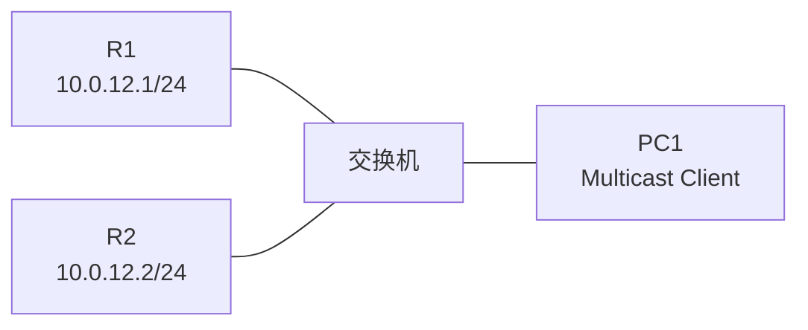
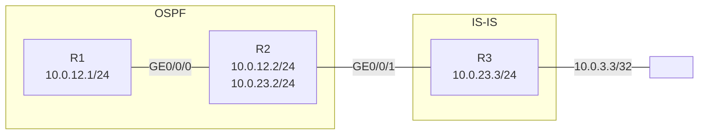
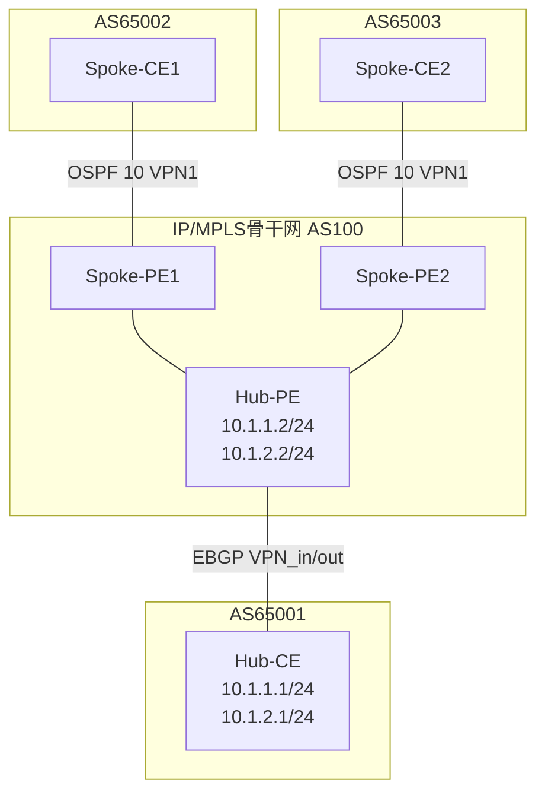
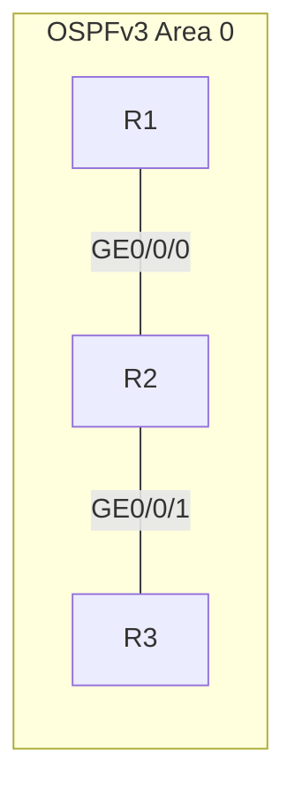
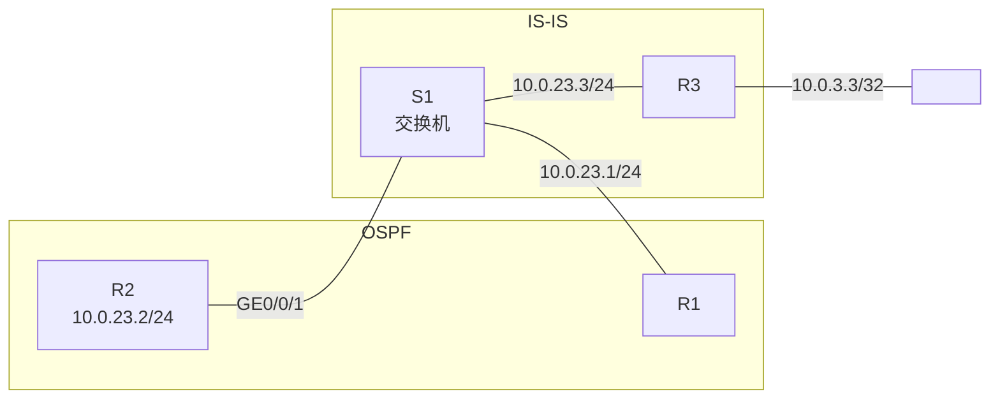

# 831填空题集

---

## 第1题

**题目：** 为防止攻击者伪造BGP报文对设备进行攻击，可以通过配置GTSM功能检测IP报文头中的TTL值的范围来对设备进行保护。如果某台设备配置了`peer x.x.x.x valid-ttl-hops 100`，则被检测的报文的TTL值有效范围为{（____）, 255}。

**答案：** 156

**解析：**
```
GTSM（Generalized TTL Security Mechanism，通用TTL安全机制）通过检测IP报文头中的TTL值范围来保护设备。

valid-ttl-hops命令中，hops参数指定需要检测的TTL跳数值，取值范围是1~255，缺省值是255。
被检测的报文的TTL值有效范围为[255 - hops + 1, 255]。

当hops=100时：
有效范围 = [255 - 100 + 1, 255] = [156, 255]

因此填入的值为156。
```

---

## 第2题

**题目：** 如图所示，网络工程师在进行故障处理时，将某一个组播网络的示意图画出，R1和R2启用的IGMP版本为2，使用PIM-SM作为组播路由协议，其它配置均为默认配置，则该组播网络中的查询器是（____）。



**答案：** R1

**解析：**
```
IGMPv2版本做了改进，规定同一网段上有多个组播路由器时，具有最小IP地址的组播路由器被选举出来充当查询器。

R1的接口IP地址为10.0.12.1，R2的接口IP地址为10.0.12.2。
由于10.0.12.1 < 10.0.12.2，因此R1的IP地址更小。
根据IGMPv2查询器选举规则，R1会被选举为查询器。
```

---

## 第3题

**题目：** R1和R2使用直连接口建立EBGP邻居关系，R1将2000::1/128引入BGP。缺省情况下，R2到达2000::1/128的下一跳地址为（____）。

```
接口信息：
- R1 GE0/0/0: 10.0.12.1/24
- R2 GE0/0/0: 10.0.12.2/24
- R1 GE0/0/1: 2001:12::1/64
- R2 GE0/0/1: 2001:12::2/64
- R1 GE0/0/2.10: 2002:12::1/64
- R2 GE0/0/2.10: 2002:12::2/64
- R1 GE0/0/2.20: 2003:12::1/64
- R2 GE0/0/2.20: 2003:12::2/64
- R1环回: 2000::1/128
```

**答案：** 2001:12::1

**解析：**
```
在BGP中，当使用直连接口建立EBGP邻居关系时，缺省情况下BGP路由的下一跳优选对等体的IPv6地址中较小的那个。

R1与R2之间有多个直连IPv6网段：
- 2001:12::1/64 和 2001:12::2/64
- 2002:12::1/64 和 2002:12::2/64
- 2003:12::1/64 和 2003:12::2/64

缺省情况下，EBGP邻居会优选对等体小的IPv6地址作为下一跳。
比较R1的三个IPv6地址：2001:12::1 < 2002:12::1 < 2003:12::1
因此R2到达2000::1/128的下一跳地址为2001:12::1。
```

---

## 第4题

**题目：** 某交换网络中部署了VLAN聚合功能，其中Sub-VLAN 2和Sub-VLAN 3均加入到Super-VLAN 10中，若不同Sub-VLAN内的主机想要实现互通，则应在Super-VLAN对应的VLANIF 10接口视图下，输入命令（____）inter-sub-vlan-proxy enable。（所有字母小写）

**答案：** arp-proxy

**解析：**
```
VLAN聚合（VLAN Aggregation）也称为Super VLAN，它将一个Super-VLAN和多个Sub-VLAN关联起来。
Super-VLAN包含所有Sub-VLAN的上行接口，Sub-VLAN包含实际的物理接口。

不同Sub-VLAN内的主机属于同一个IP网段，但由于处于不同的广播域（不同Sub-VLAN），
二层无法直接互通。要实现不同Sub-VLAN间的三层互通，需要在Super-VLAN的VLANIF接口上
配置VLAN间ARP代理功能。

命令格式：arp-proxy inter-sub-vlan-proxy enable
该命令用于在Super-VLAN的VLANIF接口下启用Sub-VLAN间的ARP代理功能，
使不同Sub-VLAN中的主机可以通过ARP代理实现三层互通。
```

---

## 第5题

**题目：** 网络管理员在接入交换机上部署IPSG功能来预防IP地址欺骗攻击，那么他需要在交换机的接口视图或（____）视图中使能IP报文检查功能。（若填写英文，请所有字母大写）

**答案：** VLAN

**解析：**
```
IPSG（IP Source Guard，IP源防攻击）功能用于防止IP地址欺骗攻击，
通过检查IP报文的源IP地址、源MAC地址等信息与绑定表是否匹配来决定是否转发报文。

IP报文检查功能可以在以下两个视图中使能：
1. 接口视图：在接口下配置ip source check user-bind check-item，对该接口收到的所有报文进行检查。
2. VLAN视图：在VLAN下配置ip source check user-bind check-item，对该VLAN内所有接口收到的报文进行检查。

当使能了IP报文的检查功能后，默认会对IP报文中的IP、MAC、VLAN、接口信息进行表匹配检查。
只有与绑定表匹配的IP报文才能被转发，否则被丢弃。
```

---

## 第6题

**题目：** 如图所示的网络，R2与R1之间部署OSPF协议，且R2的GE0/0/1接口也使能了OSPF协议。R2与R3之间部署IS-IS协议，为了让R1能获取到达10.0.3.3/32的路由，在R2上做了将IS-IS路由引入OSPF路由的操作，则R2产生的Type5 LSA中的FA地址为（____）。



**答案：** 10.0.23.253

**解析：**
```
FA（Forwarding Address，转发地址）是OSPF Type5 LSA中的一个重要字段，用于指导流量转发。

FA地址不为0.0.0.0的条件：
1. 引入该外部路由的接口使能了OSPF协议
2. 引入该外部路由的接口使能了IP
3. 引入该外部路由的接口类型不是P2P和P2MP

本题中，R2的GE0/0/1接口（10.0.23.2/24）也使能了OSPF协议，
且该接口所在网段正是到达外部路由10.0.3.3/32的出接口所在网段。
满足FA地址不为0.0.0.0的条件，因此FA地址会被设置为该网段的IS-IS下一跳地址10.0.23.253。

当FA不为0.0.0.0时，OSPF设备计算路由后，流量会被直接发往FA地址，而不需要经过ASBR转发。
```

---

## 第7题

**题目：** 如图所示的网络，R2与R1之间部署OSPF协议，R2与R3之间部署IS-IS协议，为了让R1能获取到10.0.3.3/32的路由，在R2上做了将IS-IS路由引入OSPF路由的操作，则R2产生的Type5 LSA中的FA地址为（____）。


**答案：** 0.0.0.0

**解析：**
```
FA（Forwarding Address，转发地址）是OSPF Type5 LSA中的字段。

当FA为0.0.0.0时，到达该外部网段的流量会被发往引入这条外部路由的ASBR（即R2）。
而如果FA不为0.0.0.0，则流量会被发往这个转发地址。

FA地址不为0.0.0.0需要同时满足以下条件：
1. 引入该外部路由的出接口使能了OSPF协议
2. 引入该外部路由的出接口使能了IP
3. 引入该外部路由的出接口类型不是P2P和P2MP

本题中，R2的GE0/0/1接口（连接IS-IS区域的接口）没有使能OSPF协议，
不满足FA不为0.0.0.0的条件，因此Type5 LSA中的FA地址为0.0.0.0。
```

---

## 第8题

**题目：** 网络工程师使用capture-packet工具抓取接口收到的报文，图中给出了部分输出信息，已知该报文是某一种动态路由协议的报文，则该协议为（____）（填写术语，全大写）

```
FA ED AD 0D 00 10 FA ED AD 0D 00 00 08 00 45 00
00 30 04 2C 00 00 FF 11 8B 8E 0A 00 0C 01 0A 00
0C 02 75 E3 75 E3 00 1C E7 D1 00 00 00 14 00 00
00 06 00 00 00 01 00 00 00 00 00 00 00 00
```

**答案：** RIP

**解析：**
```
从报文中可以分析出：
1. 以太网头：FA ED AD 0D 00 10 FA ED AD 0D 00 00 08 00
   - 08 00 表示上层协议为IPv4

2. IP头：45 00 00 30 04 2C 00 00 FF 11 8B 8E 0A 00 0C 01 0A 00 0C 02
   - 45 表示IPv4，首部长度20字节
   - FF 表示TTL=255
   - 11 表示上层协议为UDP（十进制17）
   - 0A 00 0C 01 表示源IP 10.0.12.1
   - 0A 00 0C 02 表示目的IP 10.0.12.2

3. UDP头：75 E3 75 E3 00 1C E7 D1
   - 75 E3 表示源端口=30179
   - 75 E3 表示目的端口=30179（RIPng使用UDP 521端口，RIP使用520）
   （注：RIP使用UDP 520端口，报文中端口号需要仔细分析。使用UDP协议的动态路由协议是RIP。）

使用UDP的动态路由协议是RIP（Routing Information Protocol）。
OSPF使用IP协议号89，BGP使用TCP 179端口，IS-IS直接运行在数据链路层。
```

---

## 第9题

**题目：** 在MPLS网络中，当Egress设备收到的MPLS报文的S字段取值为（____）时，表明该标签是栈底标签，直接进行IP转发。（填写阿拉伯数字）

**答案：** 1

**解析：**
```
MPLS标签头格式中包含以下字段：
- Label：标签值，20比特
- Exp：实验位，3比特，通常用于QoS
- S：栈底标识，1比特
- TTL：生存时间，8比特

S字段（Stack底位）用于标识标签栈的底部：
- S=1：表示该标签是栈底标签（最后一层标签），弹出该标签后直接进行IP转发
- S=0：表示该标签不是栈底标签，下面还有其他标签

当Egress设备收到MPLS报文时，如果发现S字段为1，说明这是最后一层标签，
弹出标签后直接进行IP转发处理。
```

---

## 第10题

**题目：** 在MPLS网络中，倒数第二跳LSR（Label Switching Router）进行标签交换时，如果发现交换后的标签值为（____），则将标签弹出，并将报文发给最后一跳。（填写阿拉伯数字）

**答案：** 3

**解析：**
```
MPLS标签栈中，有一些特殊的标签值具有特定含义：

标签值 | 含义 | 描述
-------|------|-----
0 | IPv4 Explicit NULL Label | 表示该标签必须被弹出，且报文的转发必须基于IPv4
2 | IPv6 Explicit NULL Label | 表示该标签必须被弹出，且报文的转发必须基于IPv6
3 | Implicit NULL Label | 隐式空标签，用于倒数第二跳弹出（PHP）

当出节点分配给倒数第二跳节点的标签值为3（隐式空标签）时，
倒数第二跳节点不需要将值为3的标签正常压入报文标签栈顶部，
而是直接将标签弹出，转发给最后一跳。
最后一跳发现报文已经没有标签了，则直接进行IP转发。

这种机制称为倒数第二跳弹出（Penultimate Hop Popping, PHP），
可以减少最后一跳设备的处理负担。
```

---

## 第11题

**题目：** 在如图所示的Hub&Spoke组网中，为了实现路由的正确传递，管理员必须在Hub-PE的BGP-VPN_out视图中，手工配置命令`peer 10.1.2.1 （____）`（所有字母小写）



**答案：** allow-as-loop

**解析：**
```
在Hub and Spoke组网方式下，如果在Hub节点的PE和CE之间运行EBGP，
为了实现路由的正确传递，需要在Hub-PE上配置allow-as-loop命令。

原因如下：
1. Spoke-PE将Spoke-CE的路由通过MP-BGP发给Hub-PE，路由中携带的AS号包含Spoke-CE的AS号。
2. Hub-PE将路由发给Hub-CE时，会加上自己的AS号。
3. Hub-CE将路由发回给Hub-PE时，又会加上自己的AS号。
4. 当Hub-PE再将路由发回给Spoke-PE时，Spoke-PE的BGP邻居收到路由后，
   会检查路由的AS路径中是否包含自己的AS号，如果包含则拒绝接收。

为了解决这个问题，需要在Hub-PE上配置peer x.x.x.x allow-as-loop命令，
该命令用来配置本地AS号的重复次数，允许AS路径中包含本地AS号的路由被接收和传递，
从而保证Hub&Spoke组网中路由的正确传递。
```

---

## 第12题

**题目：** 如图所示的OSPFv3网络，R1的LSDB中有（____）条Link-LSA。（填写阿拉伯数字）



**答案：** 2

**解析：**
```
Link-LSA是OSPFv3中新增的LSA类型（Type 8 LSA），具有以下特点：
1. 每个路由器在每个链路上都会产生一条Link-LSA
2. Link-LSA仅在所在链路上传播，不会跨链路泛洪
3. Link-LSA用于提供链路本地地址和IPv6前缀信息

在本题中，R1只有一个接口（GE0/0/0）连接到链路上，因此：
- R1自己会在GE0/0/0接口所在链路上产生1条Link-LSA
- R2也会在GE0/0/0接口所在链路上产生1条Link-LSA

由于Link-LSA仅在本地链路传播，R1不会收到R3产生的Link-LSA。
因此R1的LSDB中有2条Link-LSA：一条是自己产生的，一条来自于R2。
```

---

## 第13题

**题目：** 如图所示的网络，R2与R1之间部署OSPF协议，且R2的GE0/0/1接口也使能了OSPF协议。R2与R3之间部署IS-IS协议，为了让R1能获取到达10.0.3.3/32的路由，在R2上做了将IS-IS路由引入OSPF路由的操作，则在R1的路由表中，到达10.0.3.3/32的下一跳地址为（____）。


**答案：** 10.0.23.253

**解析：**
```
由于R2的GE0/0/1接口也使能了OSPF协议，在将IS-IS路由引入OSPF时，
Type5 LSA中的FA（Forwarding Address）地址不为0.0.0.0，而是设置为10.0.23.253。

当FA地址不为0.0.0.0时，OSPF路由器计算外部路由的下一跳时，
不是指向ASBR（R2），而是直接指向FA地址。

R1在OSPF域内学习到10.0.23.0/24网段的路由，并且能够通过OSPF计算出到达FA地址10.0.23.253的路径。
因此，R1路由表中到达10.0.3.3/32的下一跳地址就是FA地址10.0.23.253。

OSPF路由优于IS-IS路由，所以优先使用OSPF计算出的FA地址作为下一跳，
这样流量可以直接转发到FA地址，而不需要经过ASBR（R2）绕行。
```

---

## 第14题

**题目：** 在系统升级或降级之前，使用`display （____）`命令来查看设备本次及下次启动相关的系统软件、备份系统软件、配置文件、License文件、补丁文件以及语音文件。（所有字母小写）

**答案：** startup

**解析：**
```
display startup命令用于查看设备本次及下次启动相关的文件信息，包括：

项目 | 描述
-----|-----
Startup system software | 本次启动所使用的系统软件文件
Backup startup system software | 备份的系统软件
Next startup system software | 下次启动使用的系统软件
Startup config file | 本次启动使用的配置文件
Next startup config file | 下次启动使用的配置文件
Startup patch package | 本次启动所使用的补丁文件
License文件 | License相关文件
语音文件 | 语音相关文件

在进行系统升级或降级之前，管理员通常需要使用display startup命令确认：
1. 当前运行的系统软件版本
2. 下次启动使用的系统软件是否正确设置
3. 配置文件是否正确
4. 补丁和License文件状态
```

---

## 第15题

**题目：** 如图所示的OSPFv3网络，R2的LSDB中有（____）条Router-LSA。（填写阿拉伯数字）


**答案：** 3

**解析：**
```
Router-LSA（Type 1 LSA）是OSPFv3中的LSA类型，与OSPFv2中的Router LSA类似：
1. 每个设备都会产生一条Router-LSA
2. Router-LSA描述了设备的链路状态和花费
3. Router-LSA在所属的区域内传播（泛洪范围为本区域）

本题中，三台路由器R1、R2、R3都在Area 0中：
- R1产生1条Router-LSA，在Area 0内泛洪
- R2产生1条Router-LSA，在Area 0内泛洪
- R3产生1条Router-LSA，在Area 0内泛洪

由于三台路由器都在同一个区域（Area 0），所有Router-LSA都会在整个区域内泛洪。
因此，R2的LSDB中会有3条Router-LSA：分别来自R1、R2和R3。
```

---

## 第16题

**题目：** 如图所示的网络，R2与R1之间部署OSPF协议。R2与R3之间部署IS-IS协议，为了让R1能获取到达10.0.3.3/32的路由，在R2上做了将IS-IS路由引入OSPF路由的操作，则在R1的路由表中，到达10.0.3.3/32的下一跳地址为（____）。



**答案：** 10.0.23.3

**解析：**
```
在本题中，R2作为ASBR将IS-IS路由引入OSPF。
由于引入外部路由的出接口（R2的GE0/0/1）所在的网段（10.0.23.0/24）同时运行IS-IS，
且R1也通过该网段接入OSPF域（R1与S1相连，IP为10.0.23.1/24）。

当Type5 LSA中FA地址不为0.0.0.0时，R1计算外部路由10.0.3.3/32的下一跳时，
会直接以FA地址作为下一跳，而不是指向ASBR（R2）。

由于10.0.23.0/24网段同时存在OSPF和IS-IS，R3的接口地址10.0.23.3作为FA地址，
R1可以直接通过该网段到达FA地址10.0.23.3。
因此R1路由表中到达10.0.3.3/32的下一跳地址为10.0.23.3。

（注：R1通过OSPF学习到10.0.23.0/24网段路由，FA地址10.0.23.3在该网段内，
因此R1直接以FA地址作为下一跳转发报文。）
```

---

## 第17题

**题目：** 在BGP/MPLS IP VPN中，通过（____）区分使用相同地址空间的IPv4前缀，此时的IPv4地址称为VPNv4地址。（填写缩略语，所有字母大写）

**答案：** RD

**解析：**
```
RD（Route Distinguisher，路由标识符）用于区分使用相同地址空间的IPv4前缀。

在BGP/MPLS IP VPN网络架构中，为了避免由于地址空间重叠导致的路由冲突，
引入了RD机制。增加了RD的IPv4地址称为VPN-IPv4地址（即VPNv4地址）。

VPNv4地址格式 = RD + IPv4前缀
- RD长度为8字节，格式通常为AS号:NN（如100:1）或IP地址:NN（如1.1.1.1:1）
- IPv4前缀长度为4字节

这样，即使不同VPN使用了相同的IPv4地址段（如都使用10.0.0.0/8），
由于RD不同，VPNv4地址在全局范围内也是唯一的，从而解决了地址空间重叠的问题。

RD只用于区分不同VPN的路由，不用于路由的优选计算。
```

---

## 第18题

**题目：** 如图所示的OSPFv3网络，R2的LSDB中有（____）条Link-LSA。（填写阿拉伯数字）


**答案：** 4

**解析：**
```
Link-LSA是OSPFv3中的LSA类型（Type 8 LSA），特点如下：
1. 每个路由器在每个链路上都会产生一条Link-LSA
2. Link-LSA仅在所在链路上传播，不会跨链路泛洪

本题中，R2有两个接口分别连接两条不同的链路：
- GE0/0/0接口所在链路（连接R1）
- GE0/0/1接口所在链路（连接R3）

对于每条链路，都会有两台路由器各自产生一条Link-LSA：
- 链路1（R1-R2之间）：R1产生1条 + R2产生1条 = 2条Link-LSA
- 链路2（R2-R3之间）：R2产生1条 + R3产生1条 = 2条Link-LSA

R2同时处于两条链路上，会收到两条链路上所有的Link-LSA。
因此，R2的LSDB中有4条Link-LSA：
- 2条来自GE0/0/0所在链路（R1产生的和R2自己产生的）
- 2条来自GE0/0/1所在链路（R2自己产生的和R3产生的）
```
