# 831y 判断题集

---

## 第1题

**题目：** 在创建IPv6静态路由时，对于广播类型接口，需要指定下一跳，下一跳地址可以是链路本地地址。当下一跳地址为链路本地地址时，必须指定出接口。

**答案：** **正确**

**解析：**
```
在创建IPv6静态路由时，可以同时指定出接口和下一跳。对于不同的出接口类型，也可以只指定出接口或只指定下一跳。对于点到点接口，指定出接口。对于广播类型接口，需要指定下一跳。下一跳地址可以是链路本地地址。当下一跳地址为链路本地地址时，必须指定出接口。
```

---

## 第2题

**题目：** display startup命令可以用来查看设备本次及下次启动相关的系统软件、配置文件，并且能看到这些文件的保存路径。

```
<设备> display startup
  Startup system software:          flash:/basicsoftware.cc
  Backup startup system software:   flash:/basicsoftware.cc
  Next startup system software:     flash:/basicsoftware.cc
  Startup saved-configuration file: flash:/vrpcfg.zip
  Next startup saved-configuration file: flash:/vrpcfg.zip
  Startup patch package:            NULL
  Next startup patch package:       NULL
```

**答案：** **正确**

**解析：**
```
display startup命令显示本次及下次启动相关的文件名，包括系统软件、备份系统软件、下次启动系统软件、配置文件、下次启动配置文件、补丁包等，并显示这些文件的保存路径（如flash:/xxx）。
```

---

## 第3题

**题目：** 如图所示的网络，R1和R2通过Loopback 0接口建立EBGP邻居关系。R1将2001::1/128的路由引入BGP，之后又取消引入该路由。则在R1取消路由引入后，R1发送的Update报文中，MP_UNREACH_NLRI的Next Hop字段的取值为2000::1。

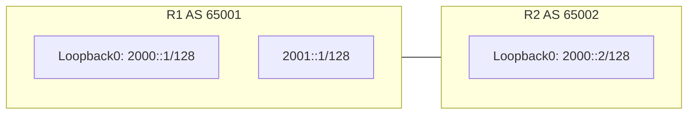

**答案：** **正确**

**解析：**
```
MP_UNREACH_NLRI用于撤销不可达路由。当R1取消引入2001::1/128路由后，会向EBGP邻居R2发送Update报文，其中MP_UNREACH_NLRI的Next Hop字段取值为2000::1（即R1建立邻居的Loopback0接口地址）。
```

---

## 第4题

**题目：** 网络工程师通过Console口登录某一台NetEngine AR6120时，发现密码错误，无法登录，如果该设备仍然能够通过Telnet账号登录，且用户账号具有修改Console口密码的权限，此时他可以通过Telnet登录设备修改Console口密码。

**答案：** **正确**

**解析：**
```
如果该设备仍然可以通过Telnet账号登录，说明该Telnet账号具有访问设备的权限。因此，网络工程师可以通过Telnet登录设备，并使用具有修改Console口密码权限的用户账号来修改Console口密码。
```

---

## 第5题

**题目：** 如图所示的网络，R1和R2互联接口规划的IP地址已在图中标出，但R1和R2无法Ping通，因此网络工程师查看R1和R2接口的配置，根据配置信息判断，R2接口掩码配置错误是导致该故障的原因。

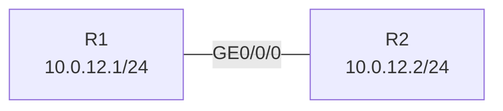

```
[R1]display current-configuration interface GE 0/0/0
interface GE0/0/0
 ip address 10.0.12.1 255.255.255.0
#

[R2]display current-configuration interface GE 0/0/0
interface GE0/0/0
 ip address 10.0.12.2 255.255.255.252
#
```

**答案：** **错误**

**解析：**
```
从配置上查看，10.0.12.2和R1接口地址是同一网段内地址，10.0.12.1也是R2接口地址的同一网段。虽然R2的掩码是255.255.255.252（/30），但10.0.12.1和10.0.12.2都在10.0.12.0/30网段内（范围是10.0.12.0~10.0.12.3），因此两者在同一网段，可以Ping通。所以R2接口掩码配置错误不是导致故障的原因。
```

---

## 第6题

**题目：** 如图所示，为了实现VPN路由在Hub&Spoke组网中正确的传递，管理员在Hub-PE与Hub-CE之间部署了IGP，在Spoke-PE与Spoke-CE之间部署了EBGP。

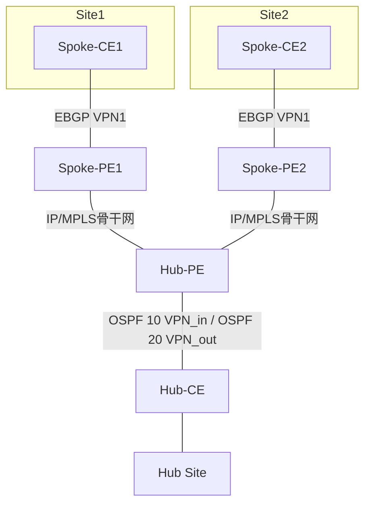

**答案：** **错误**

**解析：**
```
Hub and Spoke有以下组网方案：
①Hub-CE与Hub-PE，Spoke-PE与Spoke-CE使用EBGP。
②Hub-CE与Hub-PE，Spoke-PE与Spoke-CE使用IGP。
即两端的协议类型应该一致。题目中说Hub-PE与Hub-CE之间部署IGP，Spoke-PE与Spoke-CE之间部署EBGP，这种配置是错误的，无法正确传递VPN路由。
```

---

## 第7题

**题目：** 网络管理员可以用clock timezone命令设置设备的时区信息。如果两台网络设备的时区设置不一致，会导致这两台设备运行的动态路由协议无法正常建立邻居关系。

**答案：** **错误**

**解析：**
```
网络管理员无法用clock timezone命令直接设置设备的时区信息。他们需要设置路由器或交换机的硬件时钟来改变时区信息。即使两台网络设备的时区设置不一致，也不一定会导致这两台设备运行的动态路由协议无法正常建立邻居关系。动态路由协议会自动调整自身以适应不同的时钟设置。
```

---

## 第8题

**题目：** 如图所示的OSPF网络，链路的Cost值已在图中标出，R1开启OSPF IP FRR，则R1到达10.0.3.3/32的主路径为R1-R2-R3，备份路径为R1-R4-R2-R3。

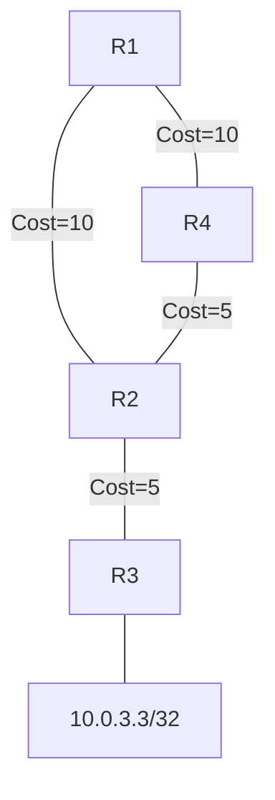

**答案：** **正确**

**解析：**
```
开销满足双保护条件，因此备份路径为R1-R4-R2-R3可以正常启用。
主路径开销：R1-R2-R3 = 10 + 5 = 15
备份路径开销：R1-R4-R2-R3 = 10 + 5 + 5 = 20
满足FRR备份路径条件。
```

---

## 第9题

**题目：** 网络工程师在进行故障处理时，如果忘记Console口密码，华为NetEngine AR系列路由器支持在BootROM下配置跳过console口密码启动。

**答案：** **正确**

**解析：**
```
AR路由器恢复Console口密码提供如下方法：
方法一：通过Telnet登录设备修改Console口密码。
方法二：在BootROM下配置跳过Console口密码启动后，修改Console口密码。
方法三：在BootROM下重命名当前启动配置文件，以空配置启动后修改Console口密码。
```

---

## 第10题

**题目：** 如图所示的OSPFv3网络，R1、R2、R3互联的端口开启OSPFv3，并且均配置了IPv6全球单播地址，其中R1和R3是DR，则R1和R3均会产生IntraArea-Prefix-LSA。

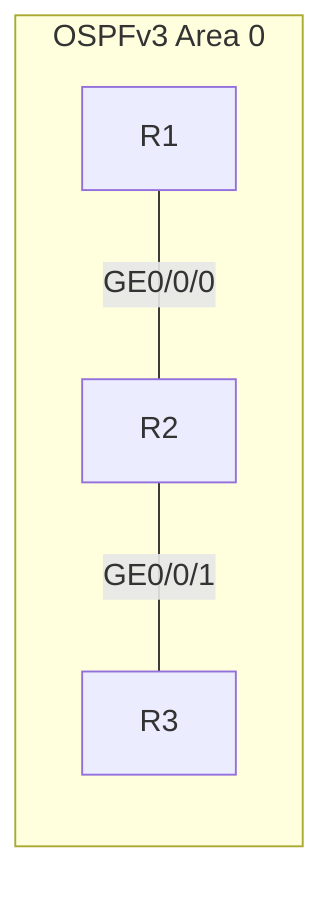

**答案：** **正确**

**解析：**
```
Intra-Area-Prefix-LSA：每个设备及DR都会产生一个或多个此类LSA，在所属的区域内传播。
- 设备产生的此类LSA，描述与Router-LSA相关联的IPv6前缀地址。
- DR产生的此类LSA，描述与Network-LSA相关联的IPv6前缀地址。
因为R1和R3都是DR，所以它们都会产生IntraArea-Prefix-LSA。
```

---

## 第11题

**题目：** 如图所示的网络，R1和R2已通过Loopback0接口建立EBGP邻居关系，R1将2001::1/128的路由引入BGP，则R1发送的update报文中，在MP_REACH_NLRI的Next Hop字段的取值为2000::1。


**答案：** **正确**

**解析：**
```
R1将2001::1/128的路由引入BGP后，它会在Update报文中使用MP_REACH_NLRI来通知其BGP邻居该路由可达，并将Next Hop字段设置为2000::1（即R1建立EBGP邻居的Loopback0接口地址）。
```

---

## 第12题

**题目：** 在网络相对稳定、对路由收敛时间要求较高的组网环境中，可以指定OSPF LSA的更新时间间隔为0来取消LSA的更新时间间隔，使得拓扑或者路由的变化可以立即通过LSA发布到网络中，从而加快网络中路由的收敛速度。

**答案：** **正确**

**解析：**
```
OSPF协议规定LSA接收的时间间隔1秒，是为了防止网络连接或者路由频繁动荡引起的过多占用设备资源的情况。
在网络相对稳定、对路由收敛时间要求较高的组网环境中，可以指定LSA接收的时间间隔为0来取消LSA接收的时间间隔，使得拓扑或者路由的变化可以立即被感知到，从而加快路由的收敛。
如果对网络没有特殊要求，建议使用命令的缺省值。
```

---

## 第13题

**题目：** 如图所示的组网，R1和R2通过直连接口无法建立EBGP邻居关系，网络工程师首先查看了R1和R2 BGP相关的配置，据此判断，R1和R2无法建立EBGP邻居关系的原因是Keepalive和Hold参数不匹配。


```
[R1]display current-configuration configuration bgp
bgp 100
 private-4-byte-as enable
 peer 10.0.12.2 as-number 200
 #
 ipv4-family unicast
  peer 10.0.12.2 enable
 #

[R2]display current-configuration configuration bgp
bgp 200
 timer keepalive 120 hold 360
 private-4-byte-as enable
 peer 10.0.12.1 as-number 100
 #
 ipv4-family unicast
  peer 10.0.12.1 enable
 #
```

**答案：** **错误**

**解析：**
```
Keepalive和Holdtime双方不一致不会影响邻居关系的建立，会进入协商，将采用双方中较小的保活时间来使用，所以无法建立和这个原因没关系。
```

---

## 第14题

**题目：** 如图所示的IS-IS IPv6网络，在R1上查看LSDB，从输出信息可以推断R1是DIS。

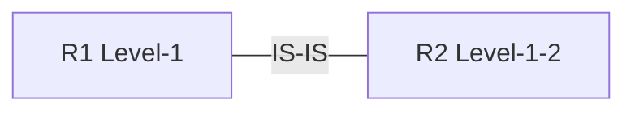

```
<R1> display isis lsdb
Database information for ISIS(1)
 Level-1 Link State Database
LSPID                  Seq Num  Checksum  Holdtime  Length  ATT/P/OL
0000.0000.0001.00-00*  0x0000000b  0x6aad  621      131     0/0/0
0000.0000.0001.01-00*  0x00000006  0x5363  621       54     0/0/0
0000.0000.0002.00-00   0x0000000d  0xcae6  510      101     0/0/0
```

**答案：** **正确**

**解析：**
```
0000.0000.0001.01.00表示这个设备是DIS。
DIS（指定中间系统）产生的伪节点LSP的LSP ID格式为：SystemID.01-00，其中01表示伪节点。从输出中看到0000.0000.0001.01-00*，说明R1（System ID为0000.0000.0001）是DIS。
```

---

## 第15题

**题目：** MPLS支持承载多种网络协议业务，包括单播IPv4业务、组播IPv4业务、单播IPv6业务、组播IPv6业务等。

**答案：** **正确**

**解析：**
```
MPLS（多协议标签交换）是一种用于数据包交换的网络技术，它支持承载多种网络协议业务，包括单播IPv4业务、组播IPv4业务、单播IPv6业务、组播IPv6业务等。
```

---

## 第16题

**题目：** 路由反射器和它的客户机组成一个集群(Cluster)，使用AS内唯一的ClusterID作为标识。当一条路由第一次被RR反射的时候，如果没有Cluster List属性，RR会把本地Cluster ID添加到Cluster List的前面。如果一条路由中已经存在了Cluster_List属性，则照不再修改Cluster List属性。

**答案：** **错误**

**解析：**
```
路由反射器和它的客户机组成一个集群，但集群的标识并非由唯一的ClusterID决定，而是由集群内的所有路由器共同维护的Cluster List属性来决定的。当一条路由第一次被照反射的时候，通常需要将其Cluster ID添加到Cluster List中，而不是将Cluster ID添加到Cluster List的前面。同时，当一条路由中已经存在了Cluster_List属性时，通常会根据集群的配置和来决定是否需要修改Cluster List属性。
```

---

## 第17题

**题目：** 管理员静态配置LSP的Ingress节点时，推荐采用指定下一跳的方式建立静态LSP，确保本地路由表中存在与指定目的IP地址精确匹配的路由项。

**答案：** **正确**

**解析：**
```
建立静态LSP的组网中，在Ingress节点进行配置：
a. 执行命令system-view，进入系统视图。
b. 执行命令static-lsp ingress lsp-name destination ip-address { mask-length | mask }，配置静态LSP的Ingress节点。
推荐采用指定下一跳的方式建立静态LSP，确保本地路由表中存在与指定目的IP地址精确匹配的路由项。
```

---

## 第18题

**题目：** 如图所示的IS-IS IPv6网络，当网络稳定后，R1可以Ping通2000:12::0，并且通过"display ipv6 neighbors"可以查看2000:12::0对应的MAC地址。

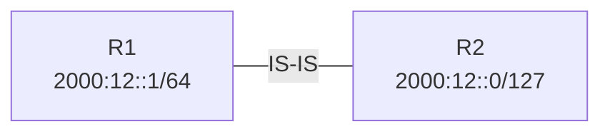

**答案：** **正确**

**解析：**
```
测试过，R1可以Ping通2000:12::0，可以查看2000:12::0对应的MAC地址。
虽然R1的地址前缀是/64，R2的地址前缀是/127，但两者在同一链路上，通过IS-IS可以学习到对方的路由，并且IPv6邻居发现可以解析到对方的MAC地址。
```

---

## 第19题

**题目：** 在BGP/MPLS IP VPN网络中，PE和P设备间通过运行MP-BGP来交换公网标签，从而实现P设备基于标签进行数据转发。

**答案：** **错误**

**解析：**
```
PE和P设备之间运行LDP，交换公网标签，建立PE之间的LSP隧道（公网隧道）。
MP-BGP用于PE之间交换VPNv4路由和私网标签，而不是用于PE和P设备之间交换公网标签。公网标签是通过LDP协议分配的。
```

---

## 第20题

**题目：** 网络维护可以分为两类:日常维护和故障排除。如果维护人员技术水平高，他就可以根据经验维护网络，无需遵循操作规范。

**答案：** **错误**

**解析：**
```
网络维护不仅仅是技术问题，而且也是管理问题。日常维护对操作人员的技术要求不高，但对操作的规范性要求比较高。
无论维护人员技术水平如何，都必须遵循操作规范进行网络维护，以确保网络的稳定和安全。
```

---

## 第21题

**题目：** MP_REACH_NLRI的地址族信息域由2字节的地址族标识AFI和1字节的子地址族标识SAFI组成。当BGP-IPv4单播地址族下传递公网IPv4路由时，SAFI是1，当BGP-IPv6单播地址族下传递公网IPv6路由时，SAFI也是1。

**答案：** **正确**

**解析：**
```
BGP在IPv4地址族下的配置：
- 维护公网BGP邻居，并且传递公网IPv4路由信息。当BGP-IPv4单播地址族下传递公网IPv4路由时，SAFI是1。
- 传递公网IPv4标签路由，SAFI是4。

BGP在IPv6地址族下的配置：
- 维护公网IPv6 BGP邻居，并且传递公网IPv6路由信息。当BGP-IPv6单播地址族下传递公网IPv6路由时，SAFI是1。
- 传递IPv6标签路由，SAFI是4。
```

---

## 第22题

**题目：** 高级ACL根据源IP地址、目的IP地址、IP协议类型、TCP源/目的端口、UDP源/目的端口号等信息来定义规则，使用路由策略调用高级ACL可以实现BGP路由控制。

**答案：** **错误**

**解析：**
```
Route-Policy里面只能调用基本ACL（即编号2000-2999的ACL，仅根据源IP地址定义规则），不能调用高级ACL。因此使用路由策略调用高级ACL无法实现BGP路由控制。
```

---

## 第23题

**题目：** 两台设备间已建立好LDP会话，此时管理员修改了一台设备的传输地址，它会导致LDP会话中断，从而造成业务中断。

**答案：** **正确**

**解析：**
```
LDP会话是基于传输地址进行通信的，当传输地址被修改后，两台设备间的LDP会话将会中断，导致业务中断。
```

---

## 第24题

**题目：** 如图所示的OSPFv3网络，R1、R2、R3互联的端口开启OSPFv3，每一台设备的RouterID为10.0.X.X,其中X为设备的编号。在R3上查看某一条LSA的详细信息，从输出信息中可以推断出该LSA是由R2生成，并且它描述的是与Network-LSA相关联的IPv6前缀地址。


```
LS Age: 1214
LS Type: Intra-Area-Prefix-LSA
Link State ID: 0.0.0.2
Originating Router: 10.0.2.2
LS Seq Number: 0x80000004
Retransmit Count: 0
Checksum: 0x8DCF
Length: 44
Number of Prefixes: 1
Referenced LS Type: 0x2002
Referenced Link State ID: 0.0.0.4
Referenced Originating Router: 10.0.2.2

Prefix: 2000:23::/64
Prefix Options: 0 (-|-|-|-|-)
Metric: 0
```

**答案：** **正确**

**解析：**
```
从输出信息中可以看到：
- Originating Router: 10.0.2.2，说明该LSA由Router ID为10.0.2.2的设备（即R2）生成。
- LS Type: Intra-Area-Prefix-LSA
- Referenced LS Type: 0x2002，表示引用的是Network-LSA（Type 2 LSA）。
Intra-Area-Prefix-LSA中，如果Referenced LS Type是0x2002（Network-LSA），则说明该LSA描述的是与Network-LSA相关联的IPv6前缀地址，由DR产生。
```

---

## 第25题

**题目：** 在配置VLAN聚合时，将Sub-VLAN加入Super-VLAN之前，必须删除该Sub-VLAN对应的VLANIF接口。

**答案：** **正确**

**解析：**
```
在配置VLAN聚合时，将Sub-VLAN加入Super-VLAN之前，必须删除该Sub-VLAN对应的VLANIF接口。这是因为在将一个VLAN加入另一个VLAN聚合时，必须确保两者在物理层上是分离的。
Sub-VLAN不能配置VLANIF接口，只有Super-VLAN可以配置VLANIF接口。
```

---

## 第26题

**题目：** 当网络设备的硬件发生故障时，通常可以采用替换法，例如更换光模块、更换单板、更换电源模块等，在执行以上操作时，需要佩戴防静电腕带。

**答案：** **正确**

**解析：**
```
人的身体和衣服有可能带有静电。这些静电可能会通过直接接触或靠近等方法被传递到电子设备上，从而损坏敏感的电子元件。防静电腕带可以将人体上的静电安全地导入地面，避免对设备的损坏。
```

---

## 第27题

**题目：** 华为NetEngine AR6120和AR6121均有两个业务接口卡槽位，且这两个槽位可以合并为1个槽位。

**答案：** **正确**

**解析：**
```
2个SIC槽位可以通过拆卸滑道合并为1个WSIC槽位。
2个SIC槽位+下面的WSIC槽位可以通过拆卸滑道合并为1个XSIC槽位。
2个XSIC槽位可以通过拆卸滑道合并为1个EXSIC槽位。
```

---

## 第28题

**题目：** 如图所示的OSPFv3网络，区域1为普通区域。R2会生成Inter-Area-Prefix-LSA，用于描述区域内某个网段的路由，区域0和区域1中都存在这种类型的LSA。

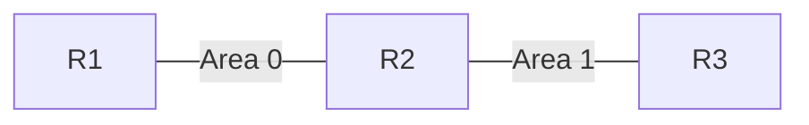

**答案：** **正确**

**解析：**
```
R2作为ABR会生成3类LSA（Inter-Area-Prefix-LSA），用于描述跨区域的前缀路由信息；
区域0内有存在用于描述区域1各网段的路由的Inter-Area-Prefix-LSA；
区域1内有存在用于描述区域0各网段的路由的Inter-Area-Prefix-LSA。
```

---

## 第29题

**题目：** 一般大型的、重要的割接项目，都要求在实验室内搭建环境进行提前验证，这种方式被称为实验局测试。实验局测试成功代表割接方案可行，无需再约客户进行评审。

**答案：** **错误**

**解析：**
```
在实验室内搭建环境进行验证是验证割接方案可行的一种重要方法。实验局测试成功代表割接方案可行，但是这并不意味着无需再约客户进行评审。无论方案是否在实验室环境中验证成功，都需要客户的审计和确认，以确保割接方案满足他们的需求和期望。割接也可能会带来额外的影响，需要把可能出现的影响尽量都同步给客户。
```

---

## 第30题

**题目：** 为了保证BGP协议免受攻击，可以在BGP邻居之间使用MD5认证来降低被攻击的可能性。MD5算法配置简单，配置后生成单一密码，需要人为干预才可以更换密码。

**答案：** **正确**

**解析：**
```
MD5是一种被广泛使用的加密算法。在BGP配置中，可以使用MD5来对邻居间的通信进行认证，以确保接收到的路由更新实际上是来自邻居，而非攻击者。一旦MD5认证配置完成，就会生成一个密码，确实需要人为干预才能更改这个密码。这有助于保护路由协议不受到某些类型的网络攻击，如欺骗攻击和回放攻击。
```

---

## 第31题

**题目：** 如图所示的网络，R1和R2通过SW1相连，如果SW1未启用STP，则R1和R2无法互相Ping通。

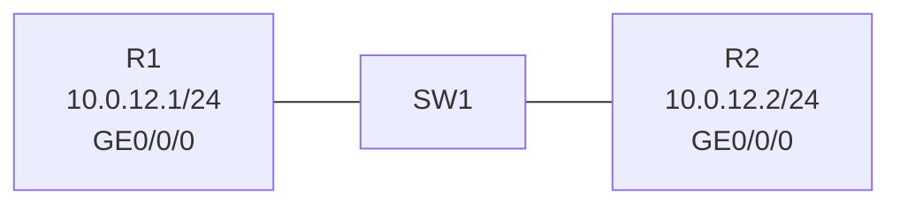

**答案：** **错误**

**解析：**
```
STP是生成树协议，用来破解环路功能的，本拓扑没有存在环路，无需启用STP。
即使交换机未启用STP，只要没有环路，两个路由器通过交换机连接是可以正常通信的，可以互相Ping通。
```

---

## 第32题

**题目：** OSPF与BFD联动就是将BFD和OSPF协议关联起来，加快OSPF协议对于网络拓扑变化的响应。BFD状态变为UP后，OSPF邻居状态才能达到Full状态。BFD状态变为Down后，OSPF邻居状态才能变为Down状态。

**答案：** **错误**

**解析：**
```
导致OSPF邻居状态变为Down状态的原因很多，不一定就是BFD down的原因。
OSPF与BFD联动是将BFD和OSPF协议进行关联，目的是加快OSPF对网络拓扑变化的感知能力。BFD状态变为Down会快速触发OSPF邻居状态变为Down，但OSPF邻居状态变为Down不一定是BFD Down导致的，还有其他多种原因（如接口Down、邻居超时等）。
```

---

## 第33题

**题目：** BGP基于前缀的ORF（Outbound Route Filtering）能力，能将本端设备配置的基于前缀的入口策略通过路由刷新报文发送给BGP邻居,BGP邻居根据这些策略构造出口策略，在路由发送时对路由进行过滤。相比于在BGP邻居上配置路由策略，这种方式不仅避免了本端设备接收大量无用的路由，降低了本端设备的CPU使用率，还有效减少了本端设备的配置工作。

**答案：** **正确**

**解析：**
```
ORF的好处在于可以减少不必要的路由信息交换，从而降低网络带宽消耗和CPU的使用率。
BGP基于前缀的ORF能力允许本端将入口过滤策略发送给对端，让对端在出口就进行过滤，避免发送无用路由，减少了本端接收和处理无用路由的开销。
```

---

## 第34题

**题目：** 如图所示的OSPFv3网络，R1、R2、R3互联的端口开启OSPFv3，并且均配置了IPv6全球单播地址，则R1、R2、R3都会产生Intra-Area-Prefix LSA。


**答案：** **正确**

**解析：**
```
Intra-Area-Prefix-LSA：每个设备及DR都会产生一个或多个此类LSA，在所属的区域内传播。
- 设备产生的此类LSA，描述与Router-LSA相关联的IPv6前缀地址。
- DR产生的此类LSA，描述与Network-LSA相关联的IPv6前缀地址。
因为每台设备都会产生描述自己前缀的Intra-Area-Prefix-LSA，所以R1、R2、R3都会产生。
```

---

## 第35题

**题目：** OSPF邻居之间周期性发送Hello报文建立和维护邻接关系，并且Hello定时器的时间间隔要保持一致，否则不能建立邻接关系。为了加速OSPF收敛，网络工程师可以将Hello报文的时间间隔设置为1ms。

**答案：** **错误**

**解析：**
```
ospf timer hello interval命令中，interval参数指定接口发送Hello报文的时间间隔，取值范围是1~65535，单位是秒。
因此Hello报文的时间间隔最小是1秒，不能设置为1ms。
```

---

## 第36题

**题目：** 如图所示的OSPFv3网络，R1和R2的接口均有两个IPv6地址，虽然R1和R2 IPv6地址前缀长度不同，它们仍然能够建立OSPFv3邻居关系。假如R2是DR，那么在R2产生的Intra-Area-Prefix-LSA中会包含四个前缀。

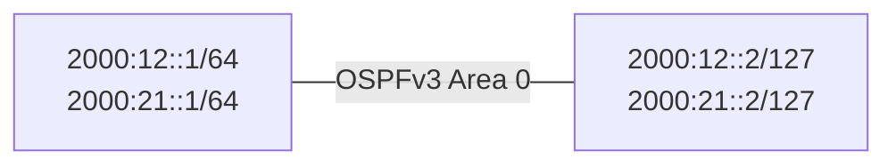

**答案：** **正确**

**解析：**
```
实验测试过，R2产生的Intra-Area-Prefix-LSA中会包含四个前缀。
OSPFv3不检查IP地址前缀是否一致即可建立邻居。R2作为DR，其产生的Intra-Area-Prefix-LSA会包含该链路上的所有前缀，共四个（2000:12::/64、2000:21::/64、2000:12::2/127、2000:21::2/127对应的网段前缀）。
```

---

## 第37题

**题目：** 当交换机配置了端口隔离功能后，缺省情况下，属于同一VLAN的不同主机无法进行二层和三层通信。

**答案：** **错误**

**解析：**
```
缺省情况下，端口隔离模式为二层隔离三层互通。
即配置端口隔离后，同一隔离组内的端口之间二层隔离，但三层可以互通。因此题目说"无法进行二层和三层通信"是错误的。
```

---

## 第38题

**题目：** BGP协议支持使用"filter-policy acl-number import"命令对接收的路由信息进行过滤，acl-number的取值范围是2000-3999。

**答案：** **错误**

**解析：**
```
acl-number的取值范围是2000-2999，即只能使用基本ACL（2000-2999），不能使用高级ACL（3000-3999）。
```

---

## 第39题

**题目：** 当IP报文进入MPLS域中，入节点会检查源IP地址对应的Tunnel ID，当Tunnel ID不为0x0时，入节点会对该报文执行MPLS转发。

**答案：** **错误**

**解析：**
```
官方介绍，检查目的IP地址，不是源地址。
MPLS转发流程：当IP报文进入MPLS域时，首先查看FIB表，检查目的IP地址对应的Tunnel ID值是否为0x0。
- 如果Tunnel ID值为0x0，则进入正常的IP转发流程。
- 如果Tunnel ID值不为0x0，则进入MPLS转发流程。
```

---

## 第40题

**题目：** 在如图所示的Hub&Spoke组网中，Hub-PE可以通过手工配置允许本地AS编号重复实现路由的正确传递。

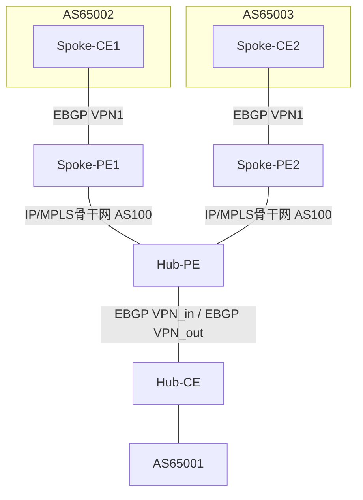

**答案：** **正确**

**解析：**
```
需要手工配置允许本地AS编号重复，不然hub-PE与hub-CE之间的防环机制会拒绝之间的路由。
可以通过peer allow-as-loop命令配置本地AS号的重复次数。
```

---

## 第41题

**题目：** MAC地址表中的表项分为动态表项、静态表项和黑洞表项。同时交换机的MAC地址表中还存在一种业务类型的MAC地址表项，这类表项一般是通过动态表项转换来的。

**答案：** **正确**

**解析：**
```
MAC地址表中的表项分为：动态表项、静态表项和黑洞表项。
另外交换机的MAC地址表中还存在一种业务类型的MAC地址表项，譬如：安全MAC、MUX MAC、Authen MAC、Guest MAC等。
该类MAC地址表项是由对应业务维护的，一般是通过动态表项转换来的。
```

---

## 第42题

**题目：** 如图所示的IS-IS网络，R1通过"default-route-advertise always level-1"命令引入了缺省路由，则R3能通过IS-IS学习到该缺省路由。

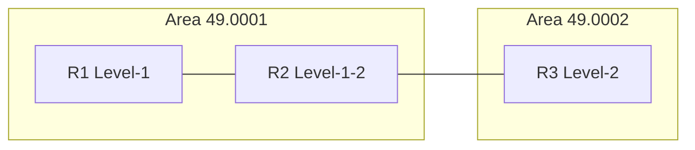

**答案：** **错误**

**解析：**
```
如果在Level-1设备上配置了该命令，那么该设备只会向Level-1区域发布缺省路由，不会将缺省路由发布到Level-2区域。
相似题总结：
R2-R3区域号不同时，R1产生默认路由；
R2-R3区域号相同时，R1不产生默认路由；
R1引入缺省路由（L1）时，R2产生默认路由，下一跳指向R1。同时R3不产生。
```

---

## 第43题

**题目：** Trap信息是系统检测到故障而产生的通知，主要记录故障等系统状态信息。如果网络管理员想要通过命令行查看Trap信息，需要首先使能SNMP代理功能。

**答案：** **正确**

**解析：**
```
Trap信息是SNMP的一部分，用来通知网络管理系统发生了重要事件，比如设备故障、连接中断等。为了查看这些Trap信息，网络管理员确实需要启用SNMP代理功能。
```

---

## 第44题

**题目：** OSPF支持等价负载分担，当组网中存在的等价路由数量大于maximum load-balancing命令配置的等价路由数量时，如果接口的优先级和接口索引都相同，则负载分担选取下一跳IP地址小的路由。

**答案：** **错误**

**解析：**
```
当组网中存在的等价路由数量大于maximum load-balancing命令配置的等价路由数量时，按照下面原则选取有效路由进行负载分担：
a. 路由优先级：负载分担选取优先级高的等价路由进行负载分担。
b. 接口索引：如果路由的优先级相同，则比较接口的索引，负载分担选取接口索引大的路由进行负载分担。
c. 下一跳IP地址：如果路由优先级和接口索引都相同，则比较下一跳IP地址，负载分担选取IP地址大的路由进行负载分担。
所以是选取IP地址大的，不是小的。
```

---

## 第45题

**题目：** 如图所示的网络，R1和R2配置了单跳BFD检测，网络工程师发现BFD会话Down因此查询了R1和R2 BFD相关的配置，配置信息已在图中标出。此外，网络工程师在R1上执行了Ping 10.0.12.2的操作，输出信息如图所示。据此判断，BFD会话Down的可能原因是UDP端口为4784的报文被拒绝通过。

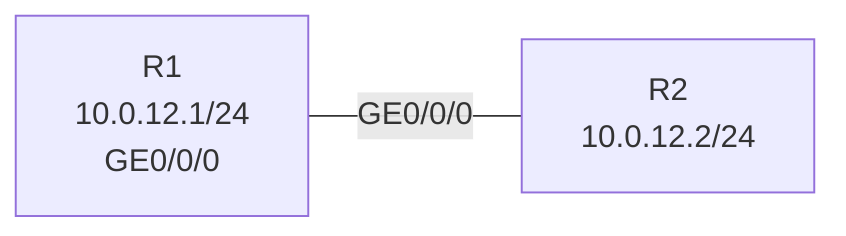

```
R1配置：
bfd toR2 bind peer-ip 10.0.12.2
 discriminator local 1
 discriminator remote 2
#

R2配置：
bfd toR1 bind peer-ip 10.0.12.1
 discriminator local 2
 discriminator remote 1
#

<R1> ping 10.0.12.2
  PING 10.0.12.2: 56 data bytes, press CTRL_C to break
    Reply from 10.0.12.2: bytes=56 Sequence=1 ttl=255 time=14 ms
    Reply from 10.0.12.2: bytes=56 Sequence=2 ttl=255 time=11 ms
```

**答案：** **正确**

**解析：**
```
Ping测试通过，说明IP层连通性没有问题，BFD会话的配置也正确（本地和远端鉴别器匹配）。
BFD使用UDP端口4784（单跳）进行通信。如果IP层正常但BFD会话Down，可能的原因是UDP端口4784的报文被防火墙或ACL拒绝通过。
```

---

## 第46题

**题目：** 某企业网络如图所示，若CE2双归属PE2和PE3，有可能产生Type 5 LSA路由环路，可以通过在PE2和PE3设备上设置route-tag命令来进行防环，当PE3收到的路由的Route Tag与本地配置的一样，则会忽略该路由。

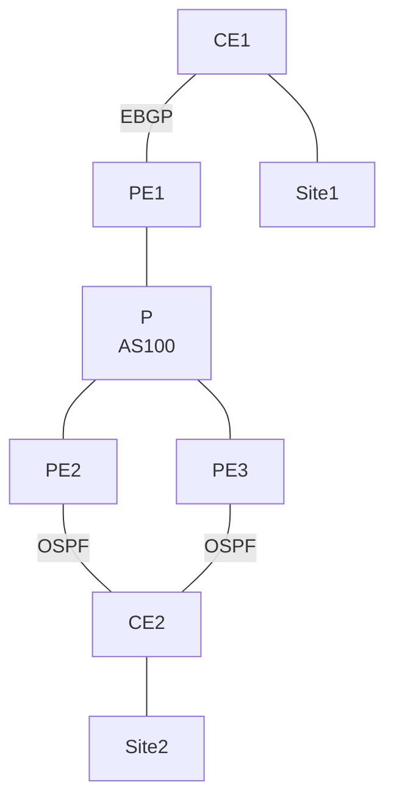

**答案：** **正确**

**解析：**
```
Route Tag实际上就是一个可以附加在LSA上的标签，它提供了一个额外的检查，以确定是否该接受或忽略某个路由。
在BGP/MPLS IP VPN场景中，当CE双归属PE时，可能产生Type 5 LSA路由环路。通过在PE上配置route-tag，当PE收到的OSPF路由携带的Route Tag与本地配置的相同时，会忽略该路由，从而防止环路。
```

---

## 第47题

**题目：** 在MPLS网络中，用LSR ID来唯一标识一个LSR（Label Switching Router），LSR ID缺省为设备某个物理接口IP地址，可以手工配置为Loopback接口地址。

**答案：** **错误**

**解析：**
```
缺省情况下没有LSR ID，必须手工配置为设备上存在的IP地址。
LSR ID不会自动从物理接口IP地址获取，必须手动配置。
```

---

## 第48题

**题目：** IPSG是一种基于三层接口的源IP地址过滤技术，它能够防止恶意主机伪造合法主机的IP地址来仿冒合法主机访问合法网络资源的行为。

**答案：** **错误**

**解析：**
```
IPSG是一种基于二层接口的源IP地址过滤技术，它利用交换机上的绑定表对IP报文进行过滤。绑定表由IP地址、MAC地址、VLAN ID和接口组成，包括静态和动态两种。
静态绑定表是用户手工创建的，动态绑定表由DHCP Snooping绑定表生成。
因此IPSG是基于二层接口的，不是三层接口。
```

---

## 第49题

**题目：** dir命令与ls命令用来显示FTP服务器上所有文件或指定文件的信息，同时可以将指定文件的信息保存至本地设备。

**答案：** **正确**

**解析：**
```
dir命令与ls命令用来显示FTP服务器上所有文件或指定文件的信息，同时可以将指定文件的信息保存至本地设备。
命令格式：
dir [ remote-filename [ local-filename ] ]
ls [ remote-filename [ local-filename ] ]
```

---

## 第50题

**题目：** MPLS根据数据的转发方向确定上、下游关系，MPLS标签报文从上游LSR发出，被下游LSR接收并处理;同理，MPLS标签的发布也是从上游向下游逐个分配。

**答案：** **错误**

**解析：**
```
MPLS根据数据的转发方向确定上、下游关系，MPLS标签报文从上游LSR发出，被下游LSR接收并处理，但是标签的分发实际上是按照相反的方向进行的。标签从下游LSR发出，然后被上游LSR接收。这通常被称为"下游按需分配"模式，该模式是最常见的标签分发方式。
标签的分配方向是从下游到上游，而数据转发方向是从上游到下游。
```

---

## 第51题

**题目：** 当到达同一目的地址存在多条等价路由时，可以通过BGP等价负载分担实现均衡流量的目的。但是公网中到达同一目的地的IBGP路由和EBG由不能形成负载分担。

**答案：** **正确**

**解析：**
```
配置maximum load-balancing ebgp命令后，仅EBGP路由形成负载分担；
配置maximum load-balancing ibgp命令后，仅IBGP路由形成负载分担。
IBGP路由和EBGP路由优先级不同（EBGP优先级高于IBGP），因此不能形成等价负载分担。
```

---

## 第52题

**题目：** 在执行割接项目时，网络工程师可集中在客户的网络维护中心进行远程操作，并且指导现场施工人员完成硬件相关的操作，例如设备上电、设备连线等。

**答案：** **正确**

**解析：**
```
在执行割接项目时，网络工程师确实可以在客户的网络维护中心进行远程操作。在大型网络环境中，许多任务都可以通过远程管理软件或系统进行。例如，配置更改、软件更新和故障排除等操作都可以远程完成。同时，如果需要进行更具物理性质的操作，例如设备上电、设备连接线路等，网络工程师可以通过电话或视频会议等方式指导现场施工人员进行。
```

---

## 第53题

**题目：** 网络工程师可以通过现场观察NetEngine AR6120的接口指示灯判断链路连接是否正常，但无法判断接口是否配置了IP地址。

**答案：** **正确**

**解析：**
```
指示灯可以判断链路的物理层状态，无法判断接口是否配置了IP地址，这是一个逻辑配置，无法通过硬件设备的指示灯来判断。
```

---

## 第54题

**题目：** 虽然广播网中IS-IS同一网段上的同一级别的路由器之间都会形成邻接关系，即包括所有的非DIS路由器之间也会形成邻接关系。但在IS-IS与BFD联动的实现上，只在DIS和非DIS之间建立BFD会话，非DIS之间不启动BFD会话。

**答案：** **正确**

**解析：**
```
官方文档原话：
虽然广播网中IS-IS同一网段上的同一级别的路由器之间都会形成邻接关系，即包括所有的非DIS路由器之间也会形成邻接关系，但在IS-IS与BFD联动的实现上，只在DIS和非DIS之间建立BFD会话，而非DIS之间不启动BFD会话，而P2P网络直接在邻居间创建会话。
如果同一链路上的同一对路由器形成的是Level-1-2的类型的邻居，在广播网中IS-IS会针对这两个Level分别创建两个邻接BFD会话，但在P2P网络中IS-IS只会创建一个邻接BFD会话。
```

---

## 第55题

**题目：** 设备运行环境是指设备运行的机房、供电、散热等外部环境，这是设备运行的基础条件。对于设备运行环境的维护，工作人员只能亲临现场才能完成。

**答案：** **正确**

**解析：**
```
设备运行环境：硬件运行环境是指设备运行的机房、供电、散热等外部环境，这是设备运行的基础条件。
对于设备环境的维护，工作人员需要亲临现场，甚至借助一些专业工具进行观察、测量。
注意：此处说的是设备运行环境的维护，并不是设备的维护。
```

---

## 第56题

**题目：** 如图所示的IS-IS网络，链路的Cost值已在图中标出，R1开启IS-IS Auto FRR，则R1到达10.0.3.3/32的主路径为R1-R2-R3，备份路径为R1-R4-R2-R3。

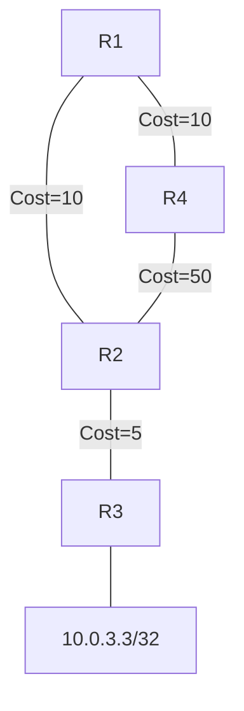

**答案：** **错误**

**解析：**
```
IS-IS LFA Auto FRR会进行流量保护，只有满足cost(R4-R2) < cost(R1-R4) + cost(R1-R2)时，备份路径才有效。
主路径开销：R1-R2-R3 = 10 + 5 = 15
备份路径（经R4到R2）：R1-R4-R2 = 10 + 50 = 60
cost(R4-R2) = 50，而cost(R1-R4) + cost(R1-R2) = 10 + 10 = 20
50 > 20，不满足LFA不等式条件，因此R1-R4-R2-R3不能作为备份路径。
```

---

## 第57题

**题目：** AS-path属性是BGP协议的私有属性，"if-match as-path-filter"命令仅对BGP路由有效。

**答案：** **正确**

**解析：**
```
AS路径过滤器是一组针对BGP路由的AS_Path属性进行过滤的规则。在BGP的路由信息中，包含有AS_Path属性，AS_Path属性记录了BGP路由从本地到目的地址所要经过的所有AS编号，因此基于AS_Path属性定义一些过滤规则，就可以实现对BGP路由信息的过滤。
由于AS_Path属性是BGP协议的私有属性，因此AS路径过滤器也仅应用于BGP协议。
```

---

## 第58题

**题目：** 当Is-IS网络中有多条冗余链路时，可能会出现多条等价路由，针对等价路由中的某一条路由，网络管理员可以通过"nexthop x.x.x.x weight value"命令调整其优先级，value值越小，表示优先级越高。

**答案：** **正确**

**解析：**
```
nexthop命令用来配置等价路由的优先级。
undo nexthop命令用来取消等价路由的优先级。
缺省情况下，不设置等价路由的优先级。
命令格式：nexthop ip-address weight value
value值越小，表示优先级越高。
```

---

## 第59题

**题目：** 当交换机某端口上配置了基本QinQ功能后，只有从该端口收到带有VLAN Tag的报文，才会为该报文打上本端口缺省VLAN的Tag，从而达到扩展VLAN空间的目的。

**答案：** **错误**

**解析：**
```
端口上配置了基本QinQ功能后，不论从该端口收到报文是否带有VLAN Tag，设备都会为该报文打上本端口缺省VLAN的Tag。
即无论是带Tag还是不带Tag的报文，都会被打上外层Tag（即端口缺省VLAN的Tag）。
```

---

## 第60题

**题目：** 当增加了新特性或者需要对原有性能进行优化，以及解决当前运行版本的问题时，需要对设备进行升级。此时需要加载高版本的系统软件,并重新启动设备来实现。华为NetEngine AR系列的设备使用相同的软件包，例如AR6120、AR6280、AR6000V。

**答案：** **错误**

**解析：**
```
华为NetEngine AR系列的软件包和设备型号有关系，不同型号的设备使用不同的软件包，不能混用。
AR6120、AR6280、AR6000V等不同型号的设备有各自对应的系统软件包。
```

---

## 第61题

**题目：** OSPFv3报文封装在IPv6报文内，可以采用单播、组播和广播的形式发送。

**答案：** **错误**

**解析：**
```
不包含广播。OSPFv3报文封装在IPv6报文内，可以采用单播和组播的形式发送。
```

---

## 第62题

**题目：** 某台IS-IS路由器自己生成的LSP信息如图所示，从LSP信息中可以推断该路由器非本链路的DIS。

```
0000.0000.0004.00-00  0x00000003  0x4ccd  1022  161  0/0/0
SOURCE  0000.0000.0004.00
NLPID   IPV6
AREA ADDR  49.0001
INTF ADDR V6 2000:14::4
INTF ADDR V6 2000:24::4
INTF ADDR V6 2000::4
Topology  Standard, IPV6
+MT NBR ID  0000.0000.0002.01  COST: 10  MT: 2 (IPV6)
IPV6       2000:14::/64        COST: 10  MT: 2
IPV6       2000:24::/64        COST: 10  MT: 2
IPV6       2000::4/128         COST: 0   MT: 2
```

**答案：** **正确**

**解析：**
```
0000.0000.0004.00中的最后00代表非DIS。
LSP ID格式为SystemID-PseudonodeID-FragmentNumber，其中PseudonodeID（伪节点ID）为00表示该路由器不是DIS（指定中间系统），非0值则表示是DIS。
```

---

## 第63题

**题目：** IS-IS LSP分片由LSP ID中的LSP Number字段进行标识，这个字段的长度是4 bit. 因此，一个IS-IS进程最多可产生256个LSP分片，携带的信息量有限。通过增加附加系统ID，可以让IS-IS进程产生更多LSP分片。

**答案：** **错误**

**解析：**
```
IS-IS LSP Number字段的长度其实是10bit，而不是4bit。由于这个字段的长度是10bit，所以一个IS-IS进程可以产生的LSP分片的最大数量是2^10 = 1024个，而不是256个。
```

---

## 第64题

**题目：** MPLS标签是一个20 bit长的本地标识符，当管理员配置静态LSP时，可以手动指定入标签和出标签，取值范围为0~1048575。

**答案：** **错误**

**解析：**
```
标签空间划分如下：
- 0~15：特殊标签
- 16~1023：静态LSP和静态CR-LSP共享的标签空间
- 1024及以上：LDP、RSVP-TE、MP-BGP等动态信令协议的标签空间

静态LSP标签取值范围是16~1023，而非0~1048575。
```

---

## 第65题

**题目：** OSPF支持等价负载分担，当组网中存在的等价路由数量大于maximum load-balancing命令配置的等价路由数量时，如果路由的优先级相同则负载分担选取接口索引大的路由。

**答案：** **正确**

**解析：**
```
当组网中存在的等价路由数量大于maximum load-balancing命令配置的等价路由数量时，按照下面原则选取有效路由进行负载分担：
a. 路由优先级：负载分担选取优先级高的等价路由进行负载分担。
b. 接口索引：如果路由的优先级相同，则比较接口的索引，负载分担选取接口索引大的路由进行负载分担。
c. 下一跳IP地址：如果路由优先级和接口索引都相同，则比较下一跳IP地址，负载分担选取IP地址大的路由进行负载分担。
```

---

## 第66题

**题目：** MPLS标签是一个20 bit长的标识符，当管理员配置静态LSP时，不同MPLS设备的标签值不能相互重叠

**答案：** **错误**

**解析：**
```
标签是本地有效标识符，不同设备上的标签值可以重叠。
```

---

## 第67题

**题目：** 某企业网络工程师想通过部署VLAN聚合和MUX VLAN实现节约IP地址，并隔离二层互访，那么同时为了节省VLAN资源，该工程师可以将super VLAN和MUX VLAN设置为同一VLAN ID

**答案：** **错误**

**解析：**
```
将Super-VLAN和MUX VLAN设置为同一VLAN ID会导致VLAN ID冲突，影响网络的正常运行。正确的做法是为每个VLAN分配唯一的VLAN ID。
```

---

## 第68题

**题目：** 根据本地维护的LSDB，运行OSPF协议的设备通过SPF算法计算出以自己为根的最短路径树，并根据这一最短路径树决定到目的网络的下一跳。如果网络频繁变化，可以将SPF计算的最长间隔设置为0，从而提升路由收敛速度

**答案：** **错误**

**解析：**
```
SPF计算的最长间隔是为了避免在网络状态频繁变化时导致计算过于频繁从而消耗过多计算资源。将它设置为0意味着任何微小改动都会引发立即的SPF计算，这反而可能导致路由器的CPU负载过重，严重影响设备性能和网络稳定性。
```

---

## 第69题

**题目：** 在MPLS网络中，当一台LSR(Label Switching Router)接收到对端发送过来的Hello消息后，会建立LDP邻接体关系，其中Hello消息会采用组播或单播的形式发送。

**答案：** **正确**

**解析：**
```
当一台LSR接收到对端发送的Hello消息后，会建立LDP邻接关系，并且Hello消息的确可以采取组播或单播两种形式发送。
```

---

## 第70题

**题目：** 随着企业网络规模的不断扩大，某一个企业计划将分散部署的服务器集中移动到同一个机房统一管理，在搬迁的某一个阶段，工作内容为硬件搬迁。在此阶段，网络工程师不需要执行设备调测，因此网络工程师无需制定割接方案。

**答案：** **错误**

**解析：**
```
机房搬迁虽然不需要执行设备调测，制定迁接方案仍然是必要的。迁接方案不仅仅关注设备的调试，而且包括设备的拆卸、包装、搬运、安装，以及确保设备在搬迁过程和搬迁后到达新位置后可以正常工作。
```

---

## 第71题

**题目：** 在BGP/MPLS IP VPN网络中，CE和PE设备之间只能通过IGP或BGP协议进行路由打通。

**答案：** **错误**

**解析：**
```
还有包括静态路由，静态路由不属于IGP或BGP。
PE与CE之间的路由协议可以是：EBGP、IBGP、RIP、OSPF、IS-IS、静态路由。
```

---

## 第72题

**题目：** 如图所示的IS-IS IPv6网络，R1和R2的接口均有两个IPv6地址，由于R1和R2 IPv6地址前缀长度不同，它们无法建立邻居关系。

```mermaid
graph LR
    R1 ---|IS-IS| R2
    R1: R1<br/>2000:12::1/64<br/>2000:21::1/64
    R2: R2<br/>2000:12::0/127<br/>2000:21::2/127
```

**答案：** **错误**

**解析：**
```
IS-IS协议建立邻居关系的关键参数包括系统ID、区域地址、网络类型及认证信息，而IPv6地址前缀长度不影响邻居发现。即使接口IPv6前缀长度不同（如R1使用/64、R2使用/127），只要Hello报文中的区域地址、网络类型等参数匹配，仍可正常建立邻居关系。
```

---

## 第73题

**题目：** 使能了DHCP Snooping的设备根据DHCP客户端发送的DHCP请求报文信息会生成DHCP Snooping绑定表，从而实现后续报文的匹配检查，防范非法用户的攻击。

**答案：** **错误**

**解析：**
```
使能了DHCP Snooping的设备将用户的DHCP请求报文通过信任接口发送给合法的DHCP服务器。设备根据DHCP服务器回应的DHCP ACK报文信息生成DHCP Snooping绑定表。后续设备再从使能了DHCP Snooping的接口接收用户发来的DHCP报文时，会进行匹配检查，能够有效防范非法用户的攻击。
```

---

## 第74题

**题目：** 为防止攻击者伪造BGP报文对设备进行攻击，可以通过配置GTS功能检测IP报文头中的TTL值的范围来对设备进行保护。如果某台设备配置了"peer x.x.x.x valid-ttl-hops 100"，则被检测的报文的TTL值有效范围为[155, 255].

**答案：** **错误**

**解析：**
```
hops：指定需要检测的TTL跳数值。整数形式，取值范围是1~255，缺省值是255。
如果配置为hops，则被检测的报文的TTL值有效范围为[255-hops+1, 255]，
所以配置100时应该是[255-100+1, 255] = [156, 255]，而非[155, 255]。
```

---

## 第75题

**题目：** 在路由器上使用"display version|begin uptime"命令，则输出信息的首个单词为"uptime"

**答案：** **错误**

**解析：**
```
使用display version | begin uptime命令后的输出会从包含"uptime"的行开始显示，比如回显如下：
HUAWEI AR2200 uptime is 2 weeks, 3 days, 6 hours, 30 minutes
从上面的输出可以看到，首个单词是"HUAWEI"（设备名称），而不是"uptime"。
```

---

## 第76题

**题目：** IP报文在MPLS网络中经过的路径称为标签交换路径LSP,LSP是一个双向路径，指明了数据流的传递方向。

**答案：** **错误**

**解析：**
```
一个转发等价类在MPLS网络中经过的路径称为标签交换路径LSP（Label Switched Path）。
LSP是从入口到出口的一个单向路径。
```

---

## 第77题

**题目：** MPLS支持多层标签嵌套，当设备收到MPLS报文后，会先处理靠近二层首部的标签，即栈顶MPLS标签。

**答案：** **正确**

**解析：**
```
标签栈（Label Stack）是指标签的排序集合。靠近二层首部的标签称为栈顶MPLS标签或外层MPLS标签（Outer MPLS label）；靠近IP首部的标签称为栈底MPLS标签或内层MPLS标签（Inner MPLS label）。
标签栈按后进先出方式组织标签，从栈顶开始处理标签。
```

---

## 第78题

**题目：** 在BGP/MPLS IP VPN网络中，为了保留引入的OSPF路由信息，BGP在MP_REACH_NLRI属性中携带Domain ID来标识和区分不同的OSPF域

**答案：** **错误**

**解析：**
```
MP_REACH_NLRI: Multiprotocol Reachable NLRI，多协议可达NLRI。用于发布可达路由及下一跳信息，和OSPF域无关。
OSPF进程的域ID包含在此进程生成的路由中，在将OSPF路由引入BGP中时，域ID被附加到BGP VPN路由上，作为BGP的扩展团体属性传递，并不是在MP_REACH_NLRI属性中携带。
```

---

## 第79题

**题目：** 如图所示的网络，R2 GE0/0/0接口开启DHCP Server功能，地址池为全局地址池。R1 GE0/0/0和GE0/0/1接口作为DHCP客户端，缺省情况下，只有一个接口能获取IP地址。

```mermaid
graph LR
    R1 ---|GE0/0/0| SW1
    R1 ---|GE0/0/1| SW1
    SW1 ---|GE0/0/0 10.1.1.1/24| R2
```

配置信息：
```
ip pool pool1
 gateway-list 10.1.1.1
 network 10.1.1.0 mask 255.255.255.0
#
ip pool pool2
 gateway-list 10.1.2.1
 network 10.1.2.0 mask 255.255.255.0
#
```

**答案：** **正确**

**解析：**
```
R2的接口地址为10.1.1.1，地址池pool1网段是10.1.1.0/24，与R2接口在同一网段，所以只有pool1可用。R1的两个接口作为DHCP客户端，在缺省情况下，DHCP服务器从同一地址池中分配地址，但由于只有一个地址池与R2接口匹配，因此两个接口只能从同一个地址池获取地址，实际上只有一个接口能获取到IP地址（注意：此题核心考点是全局地址池的选择机制，R2接口IP属于pool1，因此只有pool1生效）。
```

---

## 第80题

**题目：** 为了保证BGP协议免受攻击，可以在BGP邻居之间使用Keychain认证来降低被攻击的可能性。其中keychain具有一组密码，可以根据配置自动切换，适用于对安全性能要求比较高的网络。

**答案：** **正确**

**解析：**
```
BGP使用TCP作为传输协议，只要TCP数据包的源地址、目的地址、源端口、目的端口和TCP序号是正确的，BGP就会认为这个数据包有效，但数据包的大部分参数对于攻击者来说是不难获得的。为了保证BGP协议免受攻击，可以在BGP邻居之间使用MD5认证或者Keychain认证来降低被攻击的可能性。其中Keychain具有一组密码，可以根据配置自动切换，但是配置过程较为复杂，适用于对安全性能要求比较高的网络。
```

---

## 第81题

**题目：** 如图所示的OSPFv3网络，R1、R2、R3互联的端口开启OSPFv3，每一台设备的Router ID为10.0.x.x，其中x为设备的编号。在R3上查看某一条LSA的详细信息，从输出信息中可以推断出R1和R2是网络中的DR。

```
LS Age: 642
LS Type: Router-LSA
Link State ID: 0.0.0.0
Originating Router: 10.0.2.2
LS Seq Number: 0x80000008
Retransmit Count: 0
Checksum: 0x903D
Length: 56
Flags: 0x01(-|-|-|-|B)
Options: 0x000013(-|R|-|-|E|V6)

Link connected to: a Transit Network
  Metric: 1
  Interface ID: 0x3
  Neighbor Interface ID: 0x3
  Neighbor Router ID: 10.0.1.1
Link connected to: a Transit Network
  Metric: 1
  Interface ID: 0x4
  Neighbor Interface ID: 0x4
  Neighbor Router ID: 10.0.2.2
```

**答案：** **正确**

**解析：**
```
在Router-LSA中，Transit Network类型的链路描述的是到DR的连接，Neighbor Router ID即为DR的Router ID。
从R2（Originating Router: 10.0.2.2）生成的Router-LSA中可以看到：
- 第一条Transit Network链路的Neighbor Router ID为10.0.1.1，即R1是DR
- 第二条Transit Network链路的Neighbor Router ID为10.0.2.2，即R2自己是DR
因此可以推断出R1和R2分别是各自网段的DR。
```

---

## 第82题

**题目：** 某台IS-IS路由器自己生成的LSP信息如图所示，从LSP信息中可以推断该路由器配置了5个IPv6地址

```
0000.0000.0002.00-00*  0x0000000b  0xf5f6  1192  150  0/0/0
SOURCE  0000.0000.0002.00
NLPID   IPV6
AREA ADDR  49.0001
INTF ADDR V6  2000:24::2
Topology  Standard, IPV6
IPV6  2000:24::/64   COST: 10  MT: 2
IPV6  2000:14::/64   COST: 20  MT: 2
IPV6  2000:42::/64   COST: 20  MT: 2
IPV6  2000::4/128    COST: 10  MT: 2
IPV6  2001:4/128     COST: 10  MT: 2
```

**答案：** **错误**

**解析：**
```
LSP中的5个IPv6前缀是该路由器发布的路由信息（包括学习到的和自身的），并不是路由器本地配置的IPv6地址。
路由器自身的IPv6地址是通过INTF ADDR V6字段来标识的，图中只有INTF ADDR V6 2000:24::2，代表该路由器配置了1个IPv6接口地址。
```

---

## 第83题

**题目：** 在大型BGP网路中，对等体的数目众多，配置和维护极为不便。对于存在相同配置的BGP对等体，可以将它们加入一个BGP对等体组进行批量配置，简化管理的难度，并提高路由发布效率。配置IBGP对等体组时，不需要指定对等体组的AS号，配置EBGP对等体组时，必须指定对等体组的AS号。

**答案：** **正确**

**解析：**
```
在配置BGP对等体组的时候，对于IBGP（内部BGP）对等体，没有必要制定对等体组的AS号，因为内部BGP对等体是在同一个AS中。然而，对于EBGP（外部BGP）对等体，必须指定对等体组的AS号，因为EBGP对等体是在不同的AS之间。
```

---

## 第84题

**题目：** 如图所示的组网，R1和R2通过直连接口无法建立EBGP邻居关系，网络工程师首先查看了R1和R2 BGP相关的配置，据此判断，R1和R2无法建立EBGP邻居关系的原因是RouterID和接口IP地址不一致。

```mermaid
graph LR
    R1 ---|GE0/0/0| R2
    R1: R1<br/>10.0.12.1/24<br/>AS 100<br/>router-id 10.0.12.2
    R2: R2<br/>10.0.12.2/24<br/>AS 200<br/>router-id 10.0.12.1
```

R1配置：
```
bgp 100
 router-id 10.0.12.2
 peer 10.0.12.2 as-number 200
 #
 ipv4-family unicast
  peer 10.0.12.2 enable
```

R2配置：
```
bgp 200
 router-id 10.0.12.1
 peer 10.0.12.1 as-number 100
 #
 ipv4-family unicast
  peer 10.0.12.1 enable
```

**答案：** **错误**

**解析：**
```
RouterID只是一个标识，只要不冲突就可以，不需要和接口IP地址一致。
R1的router-id是10.0.12.2，R2的router-id是10.0.12.1，两者不冲突，所以不会因为RouterID和接口IP地址不一致而导致邻居无法建立。
```

---

## 第85题

**题目：** 两台LSR（Label Switching Router）之间交换Hello消息触发LDP会话的建立，Hello消息中会携带传输地址，其中传输地址较小的设备将作为主动方，发起建立TCP连接。

**答案：** **错误**

**解析：**
```
两个LSR之间互相发送Hello消息，Hello消息中携带传输地址，双方使用传输地址建立LDP会话。
传输地址较大的一方作为主动方，发起建立TCP连接。
```

---

## 第86题

**题目：** I-SPF和PRC可以提高IS-IS路由的收敛速度。它们都是只对发生变化的路由进行重新计算。不同的是，PRC不需要计算节点路径，而是根据ISPF算出来的SPT来更新路由。

**答案：** **正确**

**解析：**
```
增量最短路径优先算法I-SPF（Incremental SPF）：是指当网络拓扑改变的时候，只对受影响的节点进行路由计算，而不是对全部节点重新进行路由计算，从而加快了路由的计算。

部分路由计算PRC（Partial Route Calculation）：是指当网络上路由发生变化的时候，只对发生变化的路由进行重新计算。
PRC的原理与I-SPF相同，都是只对发生变化的路由进行重新计算。不同的是，PRC不需要计算节点路径，而是根据I-SPF算出来的SPT来更新路由。
```

---

## 第87题

**题目：** Type7 LSA是为了支持NSSA区域而新增的一种LSA类型，用于描述引入的外部路由信息。它由NSSA区域的自治域边界路由器(ASBR)产生，它扩散范围和Type5 LSA类似，除了普通区域和Stub区域外，Type7 LSA将扩散至OSPF网络中的所有NSSA区域

**答案：** **错误**

**解析：**
```
Type 7 LSA只在它们自己的NSSA区域进行扩散，Type 7 LSA不会直接扩散进其他NSSA区域，而是会由ABR转换成Type 5 LSA再扩散到其他区域(包括其他NSSA区域)。
```

---

## 第88题

**题目：** 大中型企业网络可分为接入层、汇聚层、核心层，网络工程师在对任一层次执行的影响现网业务的操作都需要制定割接方案。

**答案：** **正确**

**解析：**
```
为了避免或尽可能减少对业务的影响，网络工程师在对任一层次执行的影响现网业务的操作都需要制定割接方案，提前制定出的详细操作步骤和应急处理措施。
```

---

## 第89题

**题目：** 缺省情况下，P2P、Broadcast类型的接口发送OSPF Hello报文的时间间隔的值为10秒，邻居失效时间是40秒。

**答案：** **正确**

**解析：**
```
网络类型不同发送的hello报文时间间隔有差异。默认情况下：
P2P、Broadcast类型接口发送Hello报文的时间间隔的值为10秒；
P2MP、NBMA类型接口发送Hello报文的时间间隔的值为30秒；
邻居失效时间是Hello间隔时间的4倍。
```

---

## 第90题

**题目：** 如图所示，为保证交换机Core和ACC_1间正常进行MACsec会话协商，要求交换机AGG_1支持二层协议透传功能。

```mermaid
graph TD
    Core ---|MACsec| AGG_1
    Core ---|MACsec| AGG_2
    AGG_1 --- ACC_1
    AGG_2 --- ACC_2
    ACC_1 --- PC1[PC]
    ACC_2 --- PC2[PC]
```

**答案：** **正确**

**解析：**
```
MACsec（Media Access Control Security）是基于802.1AE协议的二层安全技术，通过对数据帧进行加密和完整性校验来保证数据传输的安全性。
Core和ACC_1之间跨越了AGG_1交换机进行MACsec会话协商，需要AGG_1支持二层协议透传功能，以确保MACsec协商报文（如MKA协议报文）能够正常通过中间设备。
```

---

## 第91题

**题目：** 在创建IPv6静态路由时，对于点到点接口，必须指定出接口。对于广播类型接口，必须指定下一跳。

**答案：** **错误**

**解析：**
```
点到点接口：可以指定出接口，但是也可以只指定下一跳，两种都可以，不是必须只能指定出接口这种方式。
广播（或多访问）接口：因为可能有多个设备连接，所以通常需要指定下一跳的地址。
```

---

## 第92题

**题目：** 当网络中短时间内出现大量MAC地址漂移现象，一般是因为网络中存在环路，可以通过STP生成树协议消除二层环路。

**答案：** **正确**

**解析：**
```
MAC地址漂移是指设备上一个VLAN内有两个端口学习到同一个MAC地址，后学习到的MAC地址表项覆盖原MAC地址表项的现象。
正常情况下，网络中不会在短时间内出现大量MAC地址漂移的情况。出现这种现象一般都意味着网络中存在环路，可以通过查看告警信息和漂移记录，快速定位和排除环路。STP生成树协议可以消除二层环路。
```

---

## 第93题

**题目：** 为了将NSSA区域引入的外部路由发布到其它区域，需要把Type7 LSA转化为Type5 LSA以便在整个OSPF网络中通告。缺省情况下，执行LSA转换的路由器是NSSA区域中Router ID最大的区域边界路由器(ABR)

**答案：** **正确**

**解析：**
```
当NSSA区域中有多个ABR时，系统会根据规则自动选择一个ABR作为转换器（通常情况下NSSA区域选择Router ID最大的设备），将Type7 LSA转换为Type5 LSA。
```

---

## 第94题

**题目：** 在CE多归属场景，若PE使能了BGP的AS号替换功能，还可以配置SOO特性来避免环路，即在PE与CE的EBGP对等体通过命令peer soo使能该特性。

**答案：** **正确**

**解析：**
```
在BGP/MPLS IP VPN中，SOO（Site of Origin）属性用于防止路由反向传播回原VPN而引发的环路。
在CE多归属场景中，当PE使能了AS号替换（as-override）功能后，AS路径防环机制失效，此时可以配置SOO特性来避免环路。
```

---

## 第95题

**题目：** 当管理员采用命令static-lsp egress配置MPLS域内设备的静态LSP时，需要同时指定入标签值和出标签值。

**答案：** **错误**

**解析：**
```
在配置MPLS的静态LSP（标签交换路径）时，通常是通过static-lsp egress命令配置出口节点，并且只需要指定入标签值，而不需要指定出标签值。因为在MPLS架构中，出口节点会弹出（pop）标签，所以不需要为其分配一个出标签。
```

---

## 第96题

**题目：** 使用"display ospfv3 peer verbose"查看OSPFv3邻居信息，在输出信息中可以看到对端的Router ID，对端接口的全局单播地址，邻居的状态等内容。

**答案：** **错误**

**解析：**
```
可以看到对端的Router ID，对端接口的链路本地地址，邻居的状态等内容。但是无法看到对端接口的全局单播地址。

display ospfv3 peer verbose命令显示信息描述：
- Router ID：邻居的Router ID
- Address：接口链路本地地址
- State：邻居状态
```

---

## 第97题

**题目：** 如图所示的网络，R2 GE0/0/0接口开启DHCP Server功能，地址池为全局地址池。R1 GE0/0/0和GE0/0/1接口作为DHCP客户端，缺省情况下,R1任何一个接口都不能获取IP地址。

```mermaid
graph LR
    R1 ---|GE0/0/0| SW1
    R1 ---|GE0/0/1| SW1
    SW1 ---|GE0/0/0 10.0.12.2/24| R2
```

配置信息：
```
ip pool pool1
 gateway-list 10.1.1.1
 network 10.1.1.0 mask 255.255.255.0
#
ip pool pool2
 gateway-list 10.1.2.1
 network 10.1.2.0 mask 255.255.255.0
#
```

**答案：** **正确**

**解析：**
```
R2接口IP地址是10.0.12.2/24，而全局地址池pool1是10.1.1.0/24，pool2是10.1.2.0/24。
全局地址池的选择是根据DHCP服务器接收DHCP请求报文的接口IP地址所在网段来选择的。
由于R2的接口IP是10.0.12.2/24，与pool1(10.1.1.0/24)和pool2(10.1.2.0/24)都不在同一网段，因此全局地址池无法匹配，R1的任何接口都不能获取IP地址。
```

---

## 第98题

**题目：** 在路由器上使用"display current-configuration |include 10.0.2.*"命令，可以看到当前配置中包含"10.0.2"的全部信息。

**答案：** **正确**

**解析：**
```
使用"display current-configuration | include 10.0.2."命令可以查看当前配置中包含"10.0.2"开头的所有信息。
在这里"|"代表管道，表示将前一个命令的输出作为后一个命令的输入。
"include"用于查询包含特定字符串的行；而"10.0.2."则是所要查询的内容；"*"代表零个或多个字符。
```

---

## 第99题

**题目：** MP-BGP通过新增路径属性MP_REACH_NLRI，在BGP/MPLS IP VPN网络中发布VPNv4路由信息或撤销不可达路由。

**答案：** **错误**

**解析：**
```
MP_REACH_NLRI: Multiprotocol Reachable NLRI，多协议可达NLRI。用于发布可达路由及下一跳信息。
MP_UNREACH_NLRI: Multiprotocol Unreachable NLRI，多协议不可达NLRI。用于撤销不可达路由。
因此，撤销不可达路由是通过MP_UNREACH_NLRI属性实现的，而非MP_REACH_NLRI。
```

---

## 第100题

**题目：** LSP快速扩散特性可以加快LSP的扩散速度，正常情况下，当IS-IS收到其它路由器发来的LSP时，如果此LSP比本地LSDB中相应的LSP要新，则更新LSDB中的LSP，并用一个定时器定期将LSDB内已更新的LSP扩散出去，而使能了LSP快速扩散特性的设备收到一个或多个较新的LSP时，在路由计算之前，先将小于指定数目的LSP扩散出去，加快LSDB的同步过程。

**答案：** **正确**

**解析：**
```
在IS-IS中，路由器通过生成和接收Link State Packets (LSPs)来维护Link State Database (LSDB)。当路由器收到一个新的或者更新的LSP时，它会将这个LSP添加到它的LSDB并在之后的一段时间内将其扩散给其他路由器。
LSP快速扩散特性使得设备在收到较新的LSP时，在路由计算之前，先将小于指定数目的LSP扩散出去，从而加快LSDB的同步过程，提高网络收敛速度。
```

---

## 第101题

**题目：** 在MPLS网络中，管理员同时部署了端到端的QoS功能，那么MPLS网络中的倒数第二跳设备可以基于PHP特性将MPLS标签弹出，从而让Egress能够基于内层报文的QoS优先级进行报文处理。

**答案：** **错误**

**解析：**
```
部署QoS的场景下，标签被弹出后，其中的优先级（EXP字段）也会一并丢失。
PHP（Penultimate Hop Popping，倒数第二跳弹出）特性下，倒数第二跳设备弹出标签后，Egress节点无法再从标签中获取QoS优先级信息，因此不能基于内层报文的QoS优先级进行报文处理。
```

---

## 第102题

**题目：** 在同一个交换机接口上，管理员只能配置对广播、未知组播、未知单播、已知组播和已知单播报文中的一种进行流量抑制。

**答案：** **错误**

**解析：**
```
在一般的现代交换机上，网络管理员可以同时对广播、未知组播、未知单播、已知组播和已知单播报文进行流量抑制。这些类型的流量抑制可以单独或者同时被应用到交换机接口上，这有助于防止交换机接口被特定类型的流量淹没，从而保护网络质量。
```

---

## 第103题

**题目：** 每个OSPFv3路由器都会为每个链路产生一个Link-LSA，描述此链路上的link-local地址、IPv6前缀地址以及接口编号等信息，并提供将会在Network-LSA中设置的链路选项，它仅在本链路内传播。

**答案：** **错误**

**解析：**
```
Link-LSA是作用于本地链路的，没有描述接口编号信息。
Link-LSA报文格式包含：
- Rtr Pri（路由器优先级）
- Options
- Link-Local Interface Address（链路本地接口地址）
- Number of prefixes（前缀数量）
- IPv6前缀信息
```

---

## 第104题

**题目：** 某企业网络如图所示，若CE2双归属PE2和PE3，有可能产生Type3 LSA路由环路，可以通过在PE2和PE3设备上设置dn-bit-set disable命令来进行防环。

```mermaid
graph LR
    Site1 --- CE1
    CE1 ---|OSPF| PE1
    PE1 --- P
    P --- PE2
    P --- PE3
    PE2 ---|OSPF| CE2
    PE3 ---|OSPF| CE2
    CE2 --- Site2
```

**答案：** **错误**

**解析：**
```
为了防止路由环路，OSPF多实例进程使用一个bit位作为标志位，称为DN位。
dn-bit-set disable命令用来禁止设置OSPF LSA的DN位，这可能会产生路由环路，而不是防环。
DN位的作用是：PE从CE接收到LSA后，将DN位置位，再通过其他PE发布给CE时，CE的OSPF进程会检查DN位，如果DN位被置位，则忽略该LSA，从而防止环路。
```

---

## 第105题

**题目：** 如果交换机连接的用户变动比较频繁，可以通过端口安全把动态MAC地址转换为Sticky mac地址。这样可以在用户变动时，通过表项老化及时清除绑定的旧MAC地址表项。

**答案：** **错误**

**解析：**
```
Sticky MAC地址（粘性MAC地址）是端口安全的一种方式，它不会老化，设备重启后表项也不会丢失。
因此，当用户变动时，Sticky MAC地址不会通过老化自动清除，需要手动删除或通过其他方式处理。
动态MAC地址转换为Sticky MAC地址后，就不再受老化时间影响，适合相对固定的接入场景，而不适合用户变动频繁的场景。
```

---

## 第106题

**题目：** 如图所示的网络，R1和R2配置了单跳BFD检测，网络工程师发现BFD会话Down，因此查询了R1和R2 BFD相关的配置，配置信息已在图中标出根据配置信息判断，BFD会话Down的原因是R1和R2配置的时间参数不匹配。

```mermaid
graph LR
    R1 ---|GE0/0/0| R2
    R1: R1<br/>10.0.12.1/24
    R2: R2<br/>10.0.12.2/24
```

R1配置：
```
bfd toR2 bind peer-ip 10.0.12.2
 discriminator local 1
 discriminator remote 2
 min-tx-interval 1500
 min-rx-interval 1500
#
```

R2配置：
```
bfd toR1 bind peer-ip 10.0.12.1
 discriminator local 2
 discriminator remote 1
#
```

**答案：** **错误**

**解析：**
```
BFD的时间参数不匹配是可以协商出时间的，取两端协商最小值，所以不是参数原因。
BFD会话建立时，两端会协商实际的发送和接收间隔，取本端配置和对端配置中的最小值，因此时间参数不一致不会导致BFD会话Down。
```

---

## 第107题

**题目：** 在BGP/MPLS IP VPN网络中，两个站点的CE设备之间需建立MP-EBGP对等体关系，从而实现VPN路由端到端的传递

**答案：** **错误**

**解析：**
```
端到端的VPN路由是通过PE设备，而不是直接通过CE设备来实现的。
在BGP/MPLS IP VPN中，CE与PE之间交换路由，PE之间通过MP-BGP交换VPNv4路由，CE之间不需要直接建立MP-EBGP对等体关系。
```

---

## 第108题

**题目：** 交换机的某个接口处于error-down状态，可能是由于该接口接收到的广播报文的平均速率超过了管理员在风暴控制中设置的最大阈值。

**答案：** **正确**

**解析：**
```
如果有配置了广播风暴控制，并且配置了风暴控制动作为error-down，那么当平均速率超过了管理员在风暴控制中设置的最大阈值时会造成接口处于error-down状态，因此是可能的原因之一。

风暴控制的动作可选：error-down | block | suppress
当配置为error-down时，超过阈值的接口会被关闭。
```

---

## 第109题

**题目：** 在BGP/MPLS IP VPN网络中，若要修改VPN实例下的RD值，必须先去使能VPN实例相应的地址族或删除该VPN实例。

**答案：** **正确**

**解析：**
```
RD配置后不能被修改或删除。如果要修改RD或删除RD，需要先删除对应的VPN实例或者去使能VPN实例IPv4地址族。
```

---

## 第110题

**题目：** 当交换机配置了端口隔离功能后，缺省情况下，属于同一VLAN的不同主机无法进行一层和三层通信。

**答案：** **错误**

**解析：**
```
缺省情况下，端口隔离模式为二层隔离三层互通。
即同一隔离组内的端口之间二层被隔离，但三层仍可以通信，并不是一层和三层都无法通信。
```

---

## 第111题

**题目：** 为了保证LDP消息的可靠发送，LDP的Discovery消息、Session消息、Advertisement消息和Notification消息都使用TCP传输。

**答案：** **错误**

**解析：**
```
为保证LDP消息的可靠发送，除了Discovery(Hello)消息使用UDP(端口646)外，LDP的Session消息、Advertisement消息和Notification消息都使用TCP(端口646)传输。
```

---

## 第112题

**题目：** 在BGP/MPLS IP VPN网络中，PE设备之间可以通过BGP-4协议进行VPNv4路由的传递

**答案：** **错误**

**解析：**
```
BGP-4传递的是IPv4路由。MP-BGP才是传递VPNv4路由。
PE设备之间需要通过MP-BGP（多协议BGP）来传递VPNv4路由，BGP-4不支持VPNv4地址族。
```

---

## 第113题

**题目：** 如图所示的IS-IS IPv6网络，当网络稳定后，R2可以Ping通2000:12::1，但是通过"display ipv6 neighbors"无法看到2000:12::1对应的MAC地址。

```mermaid
graph LR
    R1 ---|IS-IS| R2
    R1: R1<br/>2000:12::1/64
    R2: R2<br/>2000:12::2/127
```

**答案：** **错误**

**解析：**
```
当R2 Ping通2000:12::1后，R2会通过NDP（邻居发现协议）学习到R1的MAC地址，并将其保存在IPv6邻居表中。
因此通过"display ipv6 neighbors"命令是可以看到2000:12::1对应的MAC地址的。
```

---

## 第114题

**题目：** 如图所示的网络，R1和R2建立EBGP邻居关系，R1通过"network 2000::1/128"命令引入Loopback接口的路由，在R1发送的更新报文中Next Hop属性(公认必遵属性)的取值为2000:12::1

```mermaid
graph LR
    R1 ---|2000:12::/64| R2
    R1: R1<br/>AS 65001<br/>2000::1/128 (Loopback)
    R2: R2<br/>AS 65002
```

**答案：** **正确**

**解析：**
```
R1发送的update报文中Next Hop是给对端（R2）选路用的；简单理解就是R1告诉R2，发往2000::1地址的下一跳要发给2000:12::1。
在EBGP邻居之间传递路由时，Next Hop属性会被设置为发送端的接口地址，即R1的直连接口地址2000:12::1。
```

---

## 第115题

**题目：** 如图所示的OSPFv3网络，R1、R2、R3互联的端口开启OSPFv3，其中R1和R3是DR，在R3的LSDB中可以看到R1生成的Intra-Area-Prefix-LSA和Link-LSA。

```mermaid
graph LR
    R1 ---|GE0/0/0| R2
    R2 ---|GE0/0/1| R3
    subgraph OSPFv3 Area 0
    direction LR
    R1
    R2
    R3
    end
```

**答案：** **错误**

**解析：**
```
每个设备都会为每个链路产生一个Link-LSA，描述到此Link上的link-local地址、IPv6前缀地址，并提供将会在Network-LSA中设置的链路选项，它仅在此链路内传播。
R1生成的Link-LSA只会在R1-R2之间的链路传播，因此在R3的LSDB中看不到R1生成的Link-LSA。
```
