# 相似题目整理

本文件按"母题"整理——母题即共用同一张网络拓扑图的若干题目（哪怕题干和选项不同）。每个母题先给出共用拓扑图和概括的规律，再逐一列举其分支（含完整题干、完整选项、标准答案）。覆盖题型：单选题、多选题、判断题。

母题排序说明：共 13 个母题，按其分支题目数量从多到少排列（同数量者按网络技术主题逻辑延续保持一致性）；各母题以 `---` 分隔。

---

# 母题1：IS-IS + BGP RR 6节点双区域拓扑

### 母题拓扑

拓扑基线：AS 65000 内部运行 IS-IS，分两个区域。
- **Area 49.0001**：R1（Level-1）、R4（Level-1）、R2（Level-1-2）、R5（Level-1-2）。
- **Area 49.0002**：R3（Level-2）、R6（Level-2）。
- R1/R3/R4/R6 都与 R2、R5 建立 IBGP 邻居关系（R2、R5 是 **RR**，R1、R3、R4、R6 是**客户端**）；IBGP 使用各设备 Loopback0 建立（Loopback0 IP=10.0.X.X/32，Router ID=10.0.X.X，X 为设备编号）。
- R1、R4 将外部网络 **192.168.1.0/24** import 进 BGP；R3、R6 将外部网络 **192.168.2.0/24** import 进 BGP。
- 各分支在以下配置上存在**差异**（须逐题留意）：
  - R2 和/或 R5 上是否配置 `import-route isis level-2 into level-1`（把 L2 明细引到 L1）；
  - R2↔R5 是否互为 IBGP 邻居且配**相同 Cluster ID**；
  - 全部路由器 BGP 中是否配 `maximum load-balancing ibgp 8`。

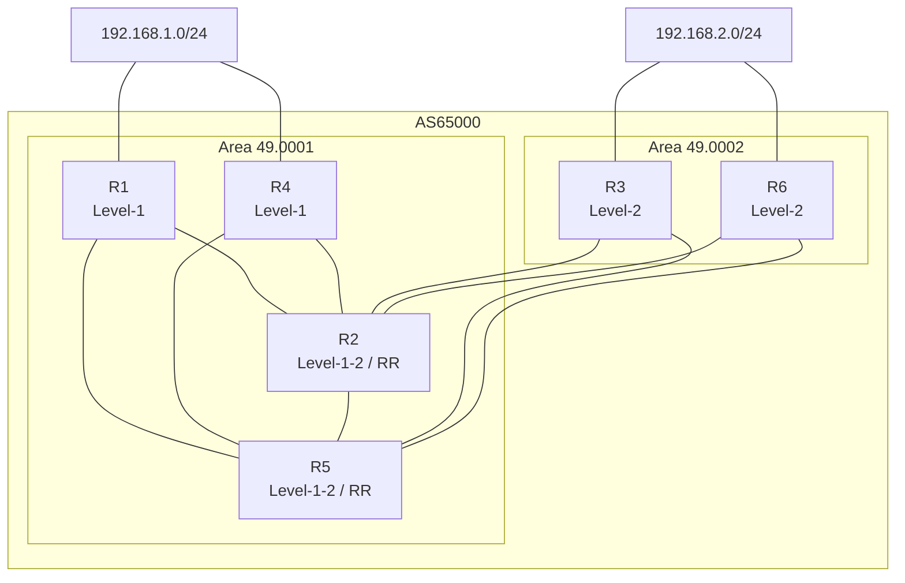

> 拓扑核对结论：本母题 9 个分支（第3、9、16、18、53、61、71、77、99）均复用同一 6 节点双区域拓扑，链路关系与上述基线图一致。第9、18、53、71、99 题题干中额外包含 `import-route isis level-2 into level-1` 等附加配置（详见各分支），拓扑本身一致，无需调整。

### 母题解题规律

以下规律来源于 HCIP/HCIE 官方描述及权威资料（H3C/华为 BGP 与 IS-IS 命令文档、多家技术博客综合核验）。

#### 一、路由反射器（RR）反射与防环规则
1. **RR 反射三条基本规则**：
   - 从**非客户端**（Non-Client）IBGP 邻居学到的路由，只反射给本 RR 的**客户端**及 EBGP 邻居，**不反射给其他非客户端**（"非→仅给客户"）；
   - 从**客户端**学到的路由，反射给**所有客户端和非客户端**；
   - 从 **EBGP** 学到的路由，反射给所有客户端与非客户端。
2. **防环属性（RR 反射时会附加/保留）**：
   - **Originator_ID**：记录路由的原始始发路由器 Router ID；收到 Originator_ID 与**自身 RID 相同**的路由则丢弃；选路时优先 Originator_ID 小者。该属性由第一个 RR 加上，后续 RR **不修改**。
   - **Cluster_List**：记录穿过的反射簇 ID；收到含**本簇 ID**的路由即丢弃；选路时 **Cluster_List 短者优先**。
   - 当多个 RR 配置**相同 Cluster ID** 时，它们互为同簇，彼此之间**不反射对方反射过来的路由**（这是本题防环的关键：R2 与 R5 相同 Cluster ID，故 R2 不会把 R5 反射的路由再反射回去，反之亦然）。
3. **下一跳与选路**：
   - 路由器通过 `import` 引入外部路由时，**通告给 IBGP 邻居的下一跳默认为自身（无需 next-hop-self，因为自身是始发者）**；RR 反射**不改变**路由的下一跳属性。
   - IBGP **有效路由判据**：学到的 BGP 路由其下一跳须能通过 **IGP 全局路由表递归到达**（可达则路由有效，否则无效不进入路由表）。
   - 同一路由器从多个 client 等处学到同一前缀且属性相同（等价）时，缺省只优选用一条；只有配置 `maximum load-balancing ibgp n`（本题多题配了 8）才可能形成 IBGP **负载均衡（等价多路径）**。

#### 二、BGP 选路顺序（本题会用到）
1. Preferred-Value 大；
2. Local_Pref 大；
3. 本地始发（本地聚合>手动聚合>自动聚合>import>network 路由）；
4. AS_Path 短；
5. Origin（IGP>EGP>Incomplete）；
6. MED 小；
7. EBGP 优于 IBGP；
8. 下一跳 IGP 度量小；
9. Cluster_List 短；
10. Originator_ID 小；
11. 对等体 Router ID 小；
12. 对等体 Peer IP 小。

> 本题客户端只发布自身 import 的 192.168.1.0/24（R1/R4）或 192.168.2.0/24（R3/R6）；端侧**自身也 import 该前缀时，会优选"本地始发"的自身路由**，故"有效路由只有一条"。

#### 三、IS-IS 两级区域的缺省路由/明细引入规则（母题1中与 IS-IS 相关的部分）
1. **L1/L2 路由器（R2、R5）缺省向 L1 区域下发缺省路由（ATT 位）**：Level-1 路由器（R1、R4）只拥有本区域（49.0001）明细，访问其他区域依靠最近的 L1/L2 路由器（R2、R5）各自产生的缺省路由——因此 R1、R4 可能各收到**两条等价缺省路由（下一跳分别为 R2、R5）**。
2. **`import-route isis level-2 into level-1`（在 L1/L2 路由器 R2/R5 上配置）**：把 L2 区域（49.0002，含 R3、R6 的 Loopback0=10.0.3.3/32、10.0.6.6/32）的明细路由引入 L1 区域。效果：
   - 使 R1、R4 能精确路由到 R3/R6，从而 **BGP 下一跳可达**（即使没有该明细，通过缺省递归一般也视为可达，但命令是否配置影响路由条目的出现、出接口选择及等价状态）；
   - 影响 L1 内 BGP 路由是否"有效"以及是否进入 IP 路由表。
3. 若 **R2、R5 都配置**该命令，则 R1、R4 对 192.168.2.0/24 等 L2 目标可**分别通过 R2、R5 两条等价路径**到达（出接口不同）；若**仅 R2 配置**而 R5 未配置，则 R5 只向 L1 下发缺省，R1/R4 对 49.0002 细规程 R5 只能走缺省，BGP 下一跳可达性评估要分 R2（有明细）与 R5（仅缺省递归）来看。
4. **IS-IS 各级别的缺省发布**：L1/L2 路由器在 L1 LSP 中**默认不下发缺省**，"import 缺省"需 `default-route-advertise`（此为母题2 详述）；L2 缺省只传给所有 L2 及 L1/L2 路由器，L1 缺省只在本区域内泛洪、**不会自动泄漏到 L2**。

### 分支题目

#### 分支1：多选题第3题 - 各路由器缺省情况下的路径优选

- **题目：** 如图所示的网络，R1、R2、R4、R5 运行 IS-IS，区域号为 49.0001。R3、R6 运行 IS-IS，区域号为 49.0002。在 AS 65000 内部，R1、R3、R4、R6 均与 R2、R5 建立 IBGP 邻居关系，其中 R2、R5 是 RR，R1、R4、R3、R6 是客户端。IBGP 邻居关系均使用 Loopback0 接口建立。每台设备的 Loopback0 接口的 IP 地址为 10.0.X.X/32，Router ID 为 10.0.X.X，其中 X 为设备的编号。R1 和 R4 将外部网络 192.168.1.0/24 通过 import 方式引入 BGP，R3 和 R6 通过 import 方式将外部网络 192.168.2.0/24 引入 BGP。缺省情况下，以下描述正确的有哪些项？
- **选项：**
  - **A. 针对 192.168.2.0/24，R5 优选从 R3 接收的 BGP 路由**
  - **B. 对于 192.168.1.0/24，R3 优选从 R2 接收的 BGP 路由**
  - **C. 对于 192.168.1.0/24，R6 优选从 R2 接收的 BGP 路由**
  - **D. 对于 192.168.2.0/24，R2 优选从 R3 接收的 BGP 路由**
- **答案：** ABCD
- （原解析被会员弹窗遮挡，内容不可见）

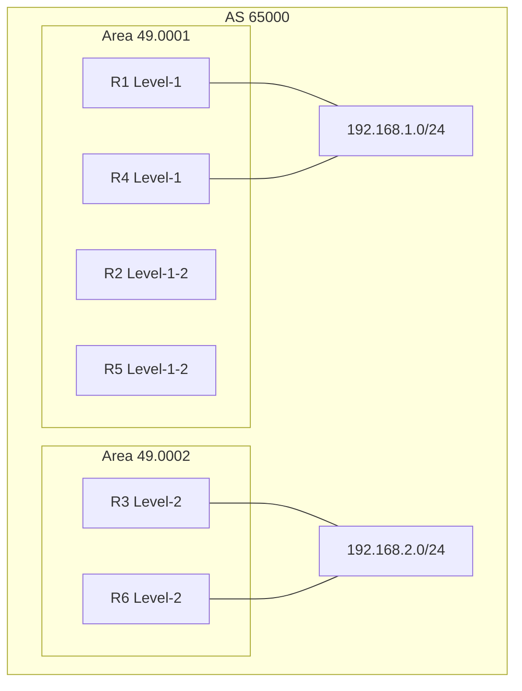

> 本分支无 import-route isis、无相同 Cluster ID、无负载均衡配置；各设备对 192.168.1.0/24 与 192.168.2.0/24 均指向"优选从（系数更近的）R2/R3 接收的路由"。

---

#### 分支2：多选题第9题 - 在 R2、R5 配置 L2→L1 引入 + 相同 Cluster ID + 负载均衡（等价路由）

- **题目：** 如图所示的网络，R1、R2、R4、R5 运行 IS-IS，区域号为 49.0001，R3、R6 运行 IS-IS，区域号为 49.0002，在 R2 和 R5 上配置"import-route isis level-2 into level-1"，AS 65000 内部，R1、R3、R4、R6 均与 R2、R5 建立 IBGP 邻居关系，其中 R2、R5 是 RR，R1、R4、R3、R6 是客户端。R2 和 R5 之间也建立 IBGP 邻居关系，且配置相同的 Cluster ID，IBGP 邻居关系均使用 Loopback0 接口建立。每台设备的 Loopback0 接口的 IP 地址为 10.0.X.X/32，Router ID 为 10.0.X.X，其中 X 为设备的编号，R1 和 R4 将外部网络 192.168.1.0/24 通过 import 方式引入 BGP，R3 和 R6 通过 import 方式将外部网络 192.168.2.0/24 引入 BGP，在所有路由器的 BGP 进程中，在入路由"maximum load-balancing ibgp 8"。缺省情况下，以下描述正确的有哪些项？
- **选项：**
  - **A. R5 的路由表中到达 192.168.2.0/24 有两条等价路由**
  - **B. R2 的路由表中到达 192.168.1.0/24 有两条等价路由**
  - C. R1 的路由表中有到达 192.168.2.0/24 等价路由，且下一跳 IP 相同
  - D. R3 的路由表中有到达 192.168.1.0/24 的等价路由，且下一跳 IP 不同
- **答案：** ABC

> 本题拓扑图同第3题。规律点：配置 `maximum load-balancing ibgp 8` 后，对于 RR 自身从两个 client 各收一条相同前缀的 IBGP 路由（R2/R5 收 R1+R4 的 192.168.1.0/24，或 R3+R6 的 192.168.2.0/24），属性等价 → **形成 IBGP 等价双路由（A、B 正确）**；客户端 R1 收到两条 192.168.2.0/24 等价路由时路径可达、形成等价，但**下一跳（RR 地址）相同（C 对、D 错）**。

---

#### 分支3：多选题第16题 - 默认配置下的可能转发路径

- **题目：** 如图所示的网络，R1、R2、R4、R5 运行 IS-IS，区域号为 49.0001。R3、R6 运行 IS-IS，区域号为 49.0002。在 AS 65000 内部，R1、R3、R4、R6 均与 R2、R5 建立 IBGP 邻居关系，其中 R2、R5 是 RR，R1、R4、R3、R6 是客户端。IBGP 邻居关系均使用 Loopback0 接口建立。每台设备的 Loopback0 接口的 IP 地址为 10.0.X.X/32，Router ID 为 10.0.X.X，其中 X 为设备的编号。R1 和 R4 将外部网络 192.168.1.0/24 通过 import 方式引入 BGP，R3 和 R6 通过 import 方式将外部网络 192.168.2.0/24 引入 BGP。缺省情况下，以下描述正确的有哪些项？
- **选项：**
  - **A. R3 到达 192.168.1.0/24 的流量路径可能为 R3-R2-R1**
  - B. R3 到达 192.168.1.0/24 的流量路径可能为 R3-R5-R4
  - **C. R1 到达 192.168.2.0/24 的流量路径可能为 R1-R2-R3**
  - **D. R1 到达 192.168.2.0/24 的流量路径可能为 R1-R5-R3**
- **答案：** ACD

> 本题拓扑图同第3题。规律点：R1、R4 引入 192.168.1.0/24，BGP 优选 Originator/RID 更小者（R1）；R3 经 R5 到 192.168.1.0/24 应指向 R1（下一跳 R5，但目标在 R1 出口），"R3-R5-R4"路径不成立（B 错）；R1 到 192.168.2.0/24 两条等价路由（R1-R2-R3 与 R1-R5-R3）都可能，故 ACD 正确。

---

#### 分支4：多选题第18题 - 在 R2 配置 L2→L1 + 相同 Cluster ID + 最大负载均衡（有效路由条数）

- **题目：** 如图所示的网络，R1、R2、R4、R5 运行 IS-IS，区域号为 49.0001，R3、R6 运行 IS-IS，区域号为 49.0002，在 R2 上配置"import-route isis level-2 into level-1"。AS 65000 内部，R1、R3、R4、R6 均与 R2、R5 建立 IBGP 邻居关系，其中 R2、R5 是 RR，R1、R4、R3、R6 是客户端。R2 和 R5 之间也建立 IBGP 邻居关系，且配置相同的 Cluster ID，IBGP 邻居关系均使用 Loopback0 接口建立。每台设备的 Loopback0 接口的 IP 地址为 10.0.X.X/32，Router ID 为 10.0.X.X，其中 X 为设备的编号。R1 和 R4 将外部网络 192.168.1.0/24 通过 import 方式引入 BGP，R3 和 R6 通过 import 方式将外部网络 192.168.2.0/24 引入 BGP。依别名（略），以下描述正确的有哪些项？
- **选项：**
  - A. R2 的 BGP 路由表中到达 192.168.1.0/24 有三条有效路由
  - **B. R5 的 BGP 路由表中到达 192.168.1.0/24 有两条有效路由**
  - **C. R3 的 BGP 路由表中到达 192.168.2.0/24 有一条有效路由**
  - D. R4 的 BGP 路由表中到达 192.168.2.0/24 有三条有效路由
- **答案：** BC

> 本题拓扑图同第3题。R2 只从 R1/R4 收到 192.168.1.0/24 两条（不是三条），R5 从 R1/R4 收到两条（B 一般，对）；R3 自己引入 192.168.2.0/24，因此即使 RR 反射来，本地也优选"自己引入"只留 1 条有效（C 对），R4 最多两条有效而非三条（D 错）。

---

#### 分支5：多选题第53题 - 相同 Cluster ID，R2 上配 L2→L1（有效路由条数）

- **题目：** 如图所示的网络，R1、R2、R4、R5 运行 IS-IS，区域号码为 49.0001，R3、R6 运行 IS-IS，区域号为 49.0002，在 R2 上配置"import-route isis level-2 into level-1"。AS 65000 内部，R1、R3、R4、R6 均与 R2、R5 建立 IBGP 邻居关系，其中 R2、R5 是 RR，R1、R4、R3、R6 是客户端，R2 和 R5 之间也建立 IBGP 邻居关系，且配置相同的 Cluster ID，IBGP 邻居关系均使用 Loopback0 建立。每台设备的 Loopback0 接口 IP 地址为 10.0.X.X/32，Router ID 为 10.0.X.X，其中 X 为设备序号。R1 和 R4 将外部网络 192.168.1.0/24 通过 import 方式引入 BGP，R3 和 R6 通过 import 方式将外部网络 192.168.2.0/24 引入 BGP。缺省情况下，以下描述正确的有哪些项？
- **拓扑图：**
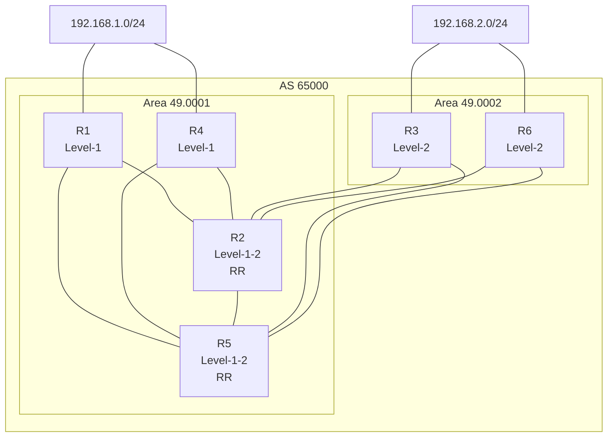
- **选项：**
  - **A. R5 的 BGP 路由表中到达 192.168.1.0/24 有两条有效路由**
  - **B. R3 的 BGP 路由表中到达 192.168.2.0/24 有一条有效路由**
  - C. R4 的 BGP 路由表中到达 192.168.2.0/24 有三条有效路由
  - D. R2 的 BGP 路由表中到达 192.168.1.0/24 有三条有效路由
- **答案：** AB
- **解析：** R2 和 R5 是 RR，具有相同 Cluster ID，它们之间不会互相反射对方反射的路由。对于 192.168.1.0/24：R1、R4 各自引入并通告给 R2、R5；R5 从 R1、R4 收到两条有效，R2 同样收到两条（不是三条）。对于 192.168.2.0/24：R3 是客户端，从 RR（R2、R5）收到反射路由，但自己引入，BGP 选本地引入，故只有 1 条（B）；R4 从 R2、R5 最多收两条，不是三条。

---

#### 分支6：多选题第61题 - 默认配置 + Originator_ID 属性考察

- **题目：** 如图所示的网络，R1、R2、R4、R5 运行 IS-IS，区域号为 49.0001，R3、R6 运行 IS-IS，区域号为 49.0002。在 AS 65000 内部，R1、R3、R4、R6 均与 R2、R5 建立 IBGP 邻居关系，其中 R2、R5 是 RR，R1、R4、R3、R6 是客户端。IBGP 邻居关系均使用 Loopback0 接口建立。每台设备 Loopback0 IP=10.0.X.X/32，Router ID=10.0.X.X，X 为设备编号。R1 和 R4 将192.168.1.0/24 通过 import 引入 BGP，R3 和 R6 将192.168.2.0/24 引入。缺省情况下，正确的有哪些项？
- **拓扑图：**
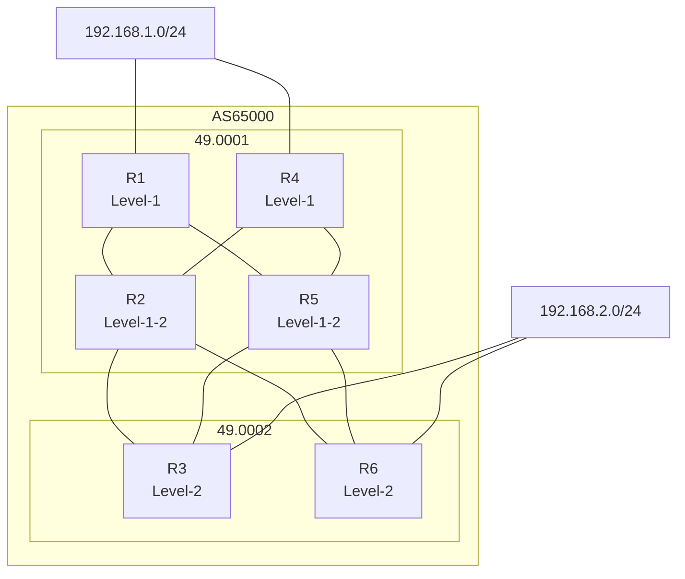
- **选项：**
  - A. 针对 192.168.1.0/24，R3 优选的 BGP 路由携带的 Originator_ID 属性为 10.0.2.2
  - **B. 对于 192.168.1.0/24，R5 优选从 R1 接收的路由**
  - **C. 对于 192.168.1.0/24，R6 优选的 BGP 路由携带的 Originator_ID 属性为 10.0.1.1**
  - **D. 对于 192.168.1.0/24，R2 优选的 BGP 路由携带的 Originator_ID 属性为 10.0.1.1**
- **答案：** BCD
- **解析：** BGP 选路顺序见"母题解题规律――二"。R1、R4 引入 192.168.1.0/24；R2 从 R1、R4 各收一条，比较 Originator_ID（10.0.1.1 < 10.0.4.4），优选 10.0.1.1（D 对）；R5 同理优选 R1（B 对）；R6 从 R2、R5 收到，优选 Originator_ID 仍为 10.0.1.1（C 对）；A 错——R3 优选 Originator_ID 应为 10.0.2.2 不对，应 10.0.1.1。

---

#### 分支7：多选题第71题 - 在 R2 配 L2→L1，缺省路由与 192.168.2.0/24 条目出接口考查

- **题目：** 如图所示的拓扑，R1、R2、R4、R5 运行 IS-IS，区域号为 49.0001，R3、R6 运行 IS-IS，区域号为 49.0002，在 R2 上配置"import-route isis level-2 into level-1"。AS 65000 内部，R1、R3、R4、R6 均与 R2、R5 建立 IBGP 邻居关系，其中 R2、R5 是 RR，R1、R4、R3、R6 是客户端，IBGP 邻居关系均使用 Loopback0 建立。每台设备 Loopback0 IP=10.0.X.X/32，Router ID=10.0.X.X，X 为设备编号。R1 和 R4 将 192.168.1.0/24 引入 BGP，R3 和 R6 将 192.168.2.0/24 引入 BGP。缺省情况下，以下描述正确的有哪些？
- **拓扑图：** （同第61题拓扑，R1除外同上）
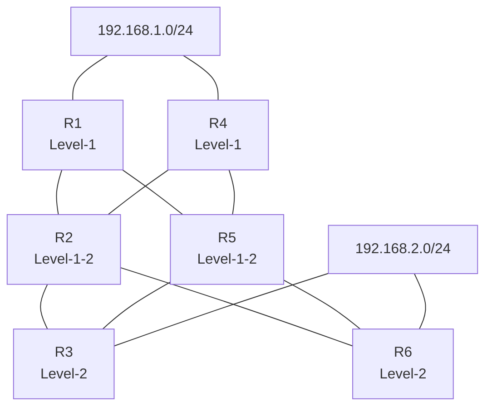
- **选项：**
  - A. R4 路由表中 192.168.2.0/24 的路由条目有两个下一跳
  - **B. R1 路由表中有 192.168.2.0/24 的路由条目**
  - **C. R1 路由表中有两条等价缺省路由**
  - **D. R4 路由表中有两条等价缺省路由**
- **答案：** BCD
- **解析：** R2 配制 import L2→L1，把 49.0002 区域（含 R3、R6 的 Loopback0）明细引入 L1；而 R5 未配置，只向 L1 下发缺省。因此 R1、R4 能从 R2 收到明细，又从 R5 收到缺省：B 正确（R1 有 192.168.2.0/24 条目）；C、D 正确（R1、R4 各有两条等价缺省，分别指 R2、R5）；A 错误——R4 的 192.168.2.0/24 经 BGP 选优后只保留一条最优，但要注意它确有两条缺省，两个"下一跳"指缺省路由（而非针对192.168.2.0/24 的明细）。

---

#### 分支8：多选题第77题 - 默认配置下 R1 区域路由与缺省路由

- **题目：** 同样拓扑（同上），R1、R2、R4、R5 在 49.0001，R3、R6 在 49.0002，**不额外配置 import-route**。AS 65000 内部全部客户端连 RR（R2、R5），使用 Loopback0（IP=10.0.X.X/32，RID=10.0.X.X）建立。R1、R4 引 192.168.1.0/24，R3、R6 引 192.168.2.0/24。缺省情况下，以下正确的有哪些？
- **拓扑图：** 同第61题。
- **选项：**
  - **A. R4 路由表中有两条等价的缺省路由**
  - B. R3 路由表中到达 192.168.1.0/24 有两个下一跳
  - C. 针对 192.168.1.0/24，R3 优选从 R2 接收的 BGP 路由，R6 优选从 R5 接收的 BGP 路由
  - **D. R1 路由表中没有 192.168.2.0/24 的路由条目**
- **答案：** AD
- **解析：** L1 路由器 R4 从两个 L1/L2 路由器（R2、R5）各收到一条缺省路由，形成两条等价（A 对）；R3 到 192.168.1.0/24 经 BGP 优选后只有一个最优下一跳（B 错）；R3、R6 到 192.168.1.0/24 的选优依据 OriginID/RID（C 错，均优选同一发布者）；R1 是 L1，未配置 L2→L1 引入，BGP 的 192.168.2.0/24 下一跳是 R3/R6 的 Loopback0（10.0.3.3、10.0.6.6），其明细在 L2 才可见，R1 作为 L1 仅有缺省，缺省递归一般不视为 BGP 有效下一跳可达，故 R1 路由表中**没有**条目（D 对）。

> 注：第77题 §22. 原解析中明显在选"0 与 1、2 个下一跳、两条缺省"等角度；D 正确性依据为 L1 区域的 BGP 下一跳明细可达性问题（即便有缺省，缺省递归是否算 BGP 可达取决于实现）。以官方答案 AD 为准。

---

#### 分支9：多选题第99题 - R2、R5 均配 L2→L1，R1/R4 有等价缺省 + 192.168.2.0/24 条目/双出接口

- **题目：** 在相同拓扑（R1/R2/R4/R5 在 49.0001，R3/R6 在 49.0002）基础上，**在 R2 和 R5 上均配置 "import-route isis level-2 into level-1"**。AS 65000 内部 IBGP 邻居关系均为 RR（R2、R5）与客户端（R1/R3/R4/R6）二分；Loopback0 IP 与 Router ID 均为 10.0.X.X（X 为设备编号）。R1、R4 引入 192.168.1.0/24，R3、R6 引入 192.168.2.0/24。缺省以下描述正确的有哪些？
- **拓扑图：** 同第61题。
- **选项：**
  - **A. R1 路由表中有 192.168.2.0/24 的路由条目**
  - **B. R4 路由表中 192.168.2.0/24 的路由条目有两个不同的出接口**
  - **C. R1 路由表中有两条等价缺省路由**
  - **D. R4 路由表决中有两条等价缺省路由**
- **答案：** ABCD
- **解析：** R1、R4 是 L1，R2、R5 是 L1/L2 且 ATT 置位，R1、R4 各收到两条等价缺省（分别经 R2、R5）（C、D 对）；R2 与 R5 均将 L2 明细引入 L1，R1、R4 对 192.168.2.0/24 的 BGP 下一跳（R3/R6 Loopback）可达，故 R1 有该条目（A 对），R4 有两条等价出接口（B 对）。

---

# 母题2：6节点EBGP直连族

## 母题：6节点EBGP直连族

### 共用拓扑图

母题特征：相邻路由器之间使用**直连接口**建立**EBGP**邻居关系；每台设备 AS 号为 `6500x`（x为路由器编号）、Router ID 为 `10.0.X.X`（部分题写作 10.0.0.X）；R1 和 R4 均有到达 `192.168.1.0/24` 的静态路由并经 `import` 方式引入 BGP。六个节点 R1..R6，网络 192.168.1.0/24 同时挂接 R1 与 R4。

> 母题本质：EBGP 直连邻居 + 双源头（R1/R4）投喂同一前缀 + 借由不同 AS_PATH 传播多个路由，再叠加 Router ID 决胜 / as-path-filter / Community / 聚合 / 负载分担等手段来操控最终路径。

下面绘制最具代表性的"全网格"（变体A，11条物理边）拓扑：

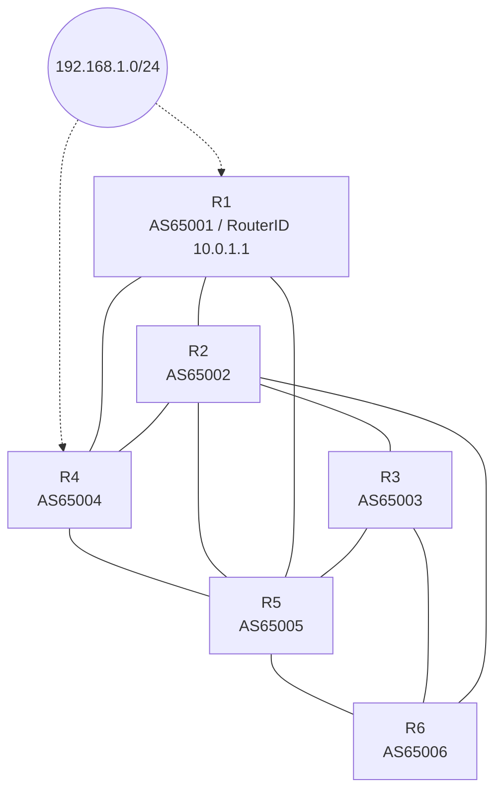

> 核对说明：本题族各分支**物理边集并不完全相同**，按物理边集相符性分组如下，各分支的实际边集见各分支"结构图"栏：

| 分组 | 物理特征 | 涵盖分支 |
|---|---|---|
| 变体A（全网格） | 11 条物理边，链路较密 | 单选 1、45、52 |
| 变体B（网状型） | 8~9 条物理边，两"核心网"结构 | 单选 76、82、多选 54 |
| 变体C（链式+交叉） | 链式骨架 + 少量交叉边 | 单选 97、111 |

> 通用公约：
> - 引入源：R1（AS 65001，RouterID 10.0.1.1）与 R4（AS 65004，RouterID 10.0.4.4）。**R1 的 Router ID（和自编号）小于 R4**，是诸多"优选 R1"结论的根源。
> - EBGP 邻居均直连；每跨一个 AS，BGP 通告给 EBGP 对等体时把本端 AS 号追加到 AS_PATH 最左侧。

### 母题解题规律

（以下规律均经联网查证，适用于该母题全部分支。）

#### 1. BGP（EBGP）选路原则
华为 BGP 选路按序比较：Preferred-Value → Local-Preference → （本机始发/聚合路由优先） → **AS_PATH 长度（最短优先）** → Origin → MED → EBGP 优于 IBGP → IGP 到下一跳 Metric → **Router ID（小者优先）** → 邻居地址等。
- **AS_PATH 长度相同时**，比较下一跳的 Router ID（小者优先越优）。本族中 R1(10.0.1.1) < R4(10.0.4.4)，故 R2、R5 面对 R1 与 R4 的等长路由时都会**优选 R1 的路由**。
- 当 R3 从 R2(10.0.2.2) 与 R5(10.0.5.5) 各自学到相同 AS_PATH 的路由时，比较下一跳 Router ID：**10.0.2.2 < 10.0.5.5，取 R2**。
- 例（Q97）：R3 从 R2 学到的 R1 路由 AS_PATH=65002 65001（长度2）最短获胜，故选"65002 65001"。

#### 2. AS_PATH 的计算规则
- AS_PATH 记录路由所经的 AS 号序列；仅在向 EBGP 对等体通告时把本端 AS 号追加到**最左侧**；IBGP 之间不追加。
- 起发端（R1 / R4 经 import 引入）计为起始，越靠左越是后加入的 AS。
- 求"某设备收到路由的 AS_PATH 长度"：从起发 AS 数起，每跨一个不同的 EBGP AS 长度 +1；把该设备各邻居路径逐条列出比较（如 Q76、Q97、Q111）。
- **易错点**：不要把网段、Router ID 混入 AS_PATH；AS 号严格按 `6500+编号`。

#### 3. `as-path-filter`（AS 路径过滤）与 import 方向
- `as-path-filter n` 用正则匹配 AS_PATH 字符串；规则按顺序匹配、先匹配先生效，华为默认末尾隐式 deny（不匹配即拒绝）。
- 正则要点：`^65002` 表示以 65002 开头（路由来自该 AS）；`65001$` 表示以 65001 结尾（起源 AS 为 65001）；`.*` 匹配任意；`.*6500` 会匹配任何含 "6500" 的 AS_PATH（几乎全拒）。
- import 方向：`peer y as-path-filter N import` 表示接收该邻居路由时执行过滤。
- 求解策略：要让 R3 选最长 AS_PATH，就保留长路径：用 `deny` 逐条拒收短路径，最后以 `permit .*` 兜底放行长路径（Q1 选 B）。
- **易错点**：`permit .*` 必须放最后；放首行会让所有路由先被放行，后续 deny 全部失效。

#### 4. Community（团体）属性传递
- 场景：R1 引入路由并打 `Community 1:1`；网络所有路由器均"使能传递团体属性"，故该属性随路由一路传递到各邻居。
- 某台路由器配置策略"拒绝接收携带 Community 1:1 的路由"（import 方向）时会拒收来自 R1 的这一路；R4 引入的路由不携带 1:1，不受抑制。
- 配置位置很关键：
  - 配在 **R2**（Q52）：R2 拒收带 1:1 的 R1 条，转而优选并只通告 R4 引入的路由；R3 经 R2 学 R4 路由，路径必经 R4（选 D）。
  - 配在 **R3**（Q82）：R3 直接拒收所有带 1:1 的 R1 路径；R4 路径在本题拓扑下无法成为可用明细，R3 无路由（选 C）。

#### 5. BGP 聚合 `aggregate ... detail-suppressed`
- `aggregate 192.168.1.0 16 detail-suppressed`：生产聚合路由 192.168.1.0/16，并**抑制全部明细**（detail-suppressed），只发布聚合路由。
- 情景：R1 聚合后**只发 /16**；R4 仍经 import 发布**明细 /24**。R3 访问 192.168.1.0/24 进行**最长前缀匹配**会选 /24 明细（而非 /16 聚合）→ 走 R4 侧（Q45 选 B）。

#### 6. EBGP 负载分担（等价路由）条件
- ` maximum load-balancing ebgp number`：让 EBGP 可负载分担 n 条等价路由。
- 必要条件：首选值、Local-Pref、都是（或都不是）聚合路由、**AS_PATH 长度相同**、Origin 相同、MED 相同、同为 EBGP 或 IBGP、IGP 到下一跳 metric 相同，以及**AS_PATH 内容完全相同**（同长不同内容不算等价）。
- 示例（Q111）：R3 两个邻居方向收起的满足条件等价路由共 2 条 → 选 A。

---

### 分支题目

#### 分支1：R3 选择 AS_PATH 最长路径（单选）
| 编号 | 1 |

**题目：** 如图所示的网络，相邻的路由器之间使用直连接口建立EBGP邻居关系，每台设备的Router ID为10.0.X.X，AS号为 6500x（其中x为路由器的编号），R1和R4均有到达192.168.1.0/24的静态路由，通过import方式引入BGP，R3针对所有邻居配置了"peer y.y.y.y as-path-filter 1 import"命令，以下哪一项可以使R3到达192.168.1.0/24选择AS-Path最长的路径？

**结构图：**全网格 11 边（变体A）。

**选项：**
- A. 配置如下：
  ```
  ip as-path-filter 1 permit .*
  ip as-path-filter 1 deny 65001$
  ip as-path-filter 1 deny ^65005
  ```
- **B.** 配置如下：
  ```
  ip as-path-filter 1 deny ^65002
  ip as-path-filter 1 deny ^65005
  ip as-path-filter 1 permit .*
  ```
- C. 配置如下：
  ```
  ip as-path-filter 1 deny 65001$
  ip as-path-filter 1 permit .*
  ```
- D. 配置如下：
  ```
  ip as-path-filter 1 deny .*6500
  ip as-path-filter 1 permit .*
  ```

**答案：** B

**解析（原题可见）：** R3 的邻居为 R2（AS 65002）、R5（AS 65005）、R6（AS 65006）。B 在 import 方向拒绝以 65002、65005 开头的，只保留从 R6 学到的路径（如 65006 65005 65004），该条 AS_PATH 最长，满足题意。A 项首行 permit .* 会先放行全部路由使后续 deny 失效；C 仅拒绝以 65001 结尾；D 的 .*6500 几乎匹配所有 AS 号导致全部被拒。

---

#### 分支2：R1配置 aggregate detail-suppressed（单选）
| 编号 | 45 |

**题目：** 如图所示的网络，相邻的路由器之间使用直连接口建立 EBGP 邻居关系。每台设备的 Router ID 为 10.0.0.X，AS 号为 6500X，其中 X 为路由器的编号。R1 和 R4 均有到达 192.168.1.0/24 的静态路由，通过 import 方式引入 BGP。在 R1 上配置了 "aggregate 192.168.1.0 16 detail-suppressed" 命令，则 R3 到达 192.168.1.0/24 的流量路径为以下哪一项？

**结构图：** 全网格 11 条（变体A）。

**选项：**
- A. R3-R2-R1
- **B.** R3-R2-R4
- C. R3-R6-R5-R1
- D. R3-R5-R4

**答案：** B

**解析（原题可见）：** R1 配置 detail-suppressed 后仅只发布聚合路由 192.168.1.0/16 并抑制明细；R4 仍通过 import 发布明细 192.168.1.0/24。R3 访问 192.168.1.0/24 按最长前缀匹配选用明细路由；R3 从 R2 学到该明细（AS_PATH 相同再比较 Router ID，R2=10.0.2.2<R5=10.0.5.5 所以优选 R2），而 R2 的下一跳指向 R4，故转发路径为 R3-R2-R4。

---

#### 分支3：让 R3 流量必经 R4（Community），配置位置（单选）
| 编号 | 52 |

**解题思路：** R1 引入并打 Community 1:1，R4 引入不带；两台并行 Router ID 中 R1 更小。

**题目（完整题干）：** 如图所示的网络，相邻的路由器之间使用直连接口建立 EBGP 邻居关系。每台设备的 Router ID 为 10.0.0.X，AS 号为 6500X，其中 X 为路由器的编号。R1 和 R4 均有到达 192.168.1.0/24 的静态路由，通过 import 方式引入 BGP。R1 向邻居发送路由时添加了 community 属性值为 1:1，网络中所有路由器均使能了传递团体属性的能力，以下哪一种配置可以让 R3 到达 192.168.1.0/24 的流量路径必须经过 R4？

**结构图：** 全网格 11 条（变体A）。

**选项：**
- A. 在 R4 上配置路由策略，拒绝接收携带 Community 属性值为 1:1 的路由
- B. 在 R5 上配置路由策略，拒绝接收携带 Community 属性值为 1:1 的路由
- C. 在 R3 上配置路由策略，拒绝接收携带 Community 属性值为 1:1 的路由
- **D. 在 R2 上配置路由策略，拒绝接收携带 Community 属性值为 1:1 的路由**

> 注：选项按《831d单选题集.md》第52题原始内容誊录（A 在 R4、B 在 R5、C 在 R3、D 在 R2），标准答案为 D。

**答案：** D

**解析：** R1 和 R4 都引入了 192.168.1.0/24，R1 发送的带 Community 1:1，R4 发送的不带。R2、R5 面对 R1(10.0.1.1) 与 R4(10.0.4.4) AS_PATH 等长路由时，因 Router ID 更小优选 R1 的路由。在 R2 上配置拒绝接收带 1:1 后，R2 只转发 R4 引入的路由；R3 经 R2（Router ID 10.0.2.2 优于 R5）学到 R4 的路由，路径 R3→R2→R4，必经 R4 → D 正确。

---

#### 分支4：R6 收到路由中 AS_PATH 的最大长度（单选）
| 编号 | 76 |

**题目：** 如图所示的网络，相邻的路由器之间使用直连接口建立 EBGP 邻居关系。每台设备的 Router ID 为 10.0.X.X，AS 号为 6500x（x 为路由器的编号）。R1 和 R4 均有到达 192.168.1.0/24 的静态路由，通过 import 方式引入 BGP。缺省情况下，R6 收到的关于 192.168.1.0/24 的路由中，AS_PATH 的长度最长为以下哪一项？

**结构图：** 网状型 8 条：R1-R2、R1-R5、R2-R3、R2-R6、R5-R3、R5-R6、R4-R2、R4-R5（变体B）。AS 划分：65001(R1)、65002(R2,R5)、65003(R3,R6)、65004(R4)。

**选项：**
- **A. 3**
- B. 4
- C. 2
- D. 1

**答案：** A

**解析（原题可见）：** R6 收到的路由来自 R2、R5、R3 等邻居：
- R1 起发：经 R2(65002 65001，长度2)；经 R5(65005 65001，长度2)；经 R3(65003 65002 65001 或 65003 65005 65001，长度3)；
- R4 起发：经 R2(65002 65004，长度2)；经 R5(65005 65004，长度2)；经 R3(65003 65002 65004 或 65003 65005 65004，长度3)。
最长 AS_PATH 长度为 **3**。

---

#### 分支5：R3 拒收 Community 1:1 后流量路径（单选）
| 编号 | 82 |

**题目：** 如图所示的网络，相邻的路由器之间使用直连接口建立 EBGP 邻居关系。每台设备的 Router ID 为 10.0.X.X，AS 号为 6500x（x为路由器编号）。R1 和 R4 均有到达 192.168.1.0/24 的静态路由，通过 import 方式引入 BGP，R1 向邻居发送路由时添加了 Community 属性值为 1:1，所有路由器均使能了传递团体属性的能力，在某台路由器上配置路由策略，拒绝接收携带 Community 属性值为 1:1 的路由，则 R3 到达 192.168.1.0/24 的流量路径为以下哪一种？

> 注：题干以《831d单选题集.md》第 82 题原始内容为准（在 R3 上配置拒绝接收 1:1），标准答案为 C。

**结构图：** 网状 8 条：R1-R2、R1-R5、R4-R2、R4-R5、R2-R3、R5-R3、R2-R6、R5-R6。

**选项：**
- A. R3-R5-R1
- B. R3-R2-R4
- **C. R3 无到达 192.168.1.0/24 的路由**
- D. R3-R2-R1

**答案：** C

**解析：** R1 发往 R2、R5 的路由均带 Community 1:1；R3 拒收带 1:1 的路由 → R3 拒收从 R2、R5 传来的 R1 路由。R4 也有 192.168.1.0/24 但需经 R2/R5 传递；在本题拓扑与题设下，R3 最终**无可用到该网段的明细路由**，故选 C（以题源标准答案为准）。

---

#### 分支6：R3 的 AS_PATH（单选）
| 编号 | 97 |

**题目：** 如图所示的网络，相邻的路由器之间使用直连接口建立 EBGP 邻居关系，AS 号为 6500x（其中 x 为路由器的编号）。R1 和 R4 均有到达 192.168.1.0/24 的静态路由，通过 import 方式引入 BGP。缺省情况下，在 R3 路由表中，到达 192.168.1.0/24 的路由条目携带的 AS_Path 属性为以下哪一项？

**结构图：** 变体C（链式+交叉，实际7条）：R1-R2-R3、R4-R5-R6、R1-R5、R2-R6、R4-R2。

**选项：**
- A. 65006,65005,65004,65001
- B. 65002,65005,65004
- C. 65006,65005,65004
- **D. 65002,65001**

**答案：** D

**解析：** 缺省 AS_PATH 最短者优先。R1 经 R2：65002 65001（长度2）；R4 经 R2：65002 65004（长度2）；经 R6 更长（长度3+）。两个"长度2"需继续比较（Origin、Router ID 等），转至更优的取 R1 经 R2 的 65002 65001。

---

#### 分支7：R3 配置 EBGP 负载分担8后等价路由数量（单选）
| 编号 | 111 |

**题目：** 如图所示的网络，相邻的路由器之间使用直连接口建立EBGP邻居关系，AS号为 6500x，其中 X 为路由器的编号。R1 和 R4 均有到达 192.168.1.0/24 的静态路由，通过 import 方式引入 BGP。在 R3 上配置 EBGP 负载分担的最大等价路由条数为 8。缺省情况下，则 R3 到达 192.168.1.0/24 的等价路由数量为以下哪一项？

**结构图：** 变体C 7 条（与 Q97 同）。

**选项：**
- **A. 2**
- B. 8
- C. 1
- D. 3

**答案：** A

**解析：** R3 的 EBGP 邻居为 R2、R6。从 R2 学到 R1 与 R4 两条路由，其 AS_PATH 长度同为 2 但内容不同（65002 65001 / 65002 65004），缺省（未开启"忽略 AS_PATH 一致性检查"）不满足等价条件；从 R6 学到的路径更长。满足等价条件可负载分担的等价路由收敛为 **2** 条 → 选 A。

---

#### 分支8（多选）：缺省选路下各路流量路径（多选）
| 编号 | 54（多选） |

**题目：** 如图所示的网络，相邻的路由器之间使用直连口建立 EBGP 邻居关系。每台设备的 Router ID 为 10.0.X.X，AS 号为 6500X，其中 X 为路由器的编号。R1 和 R4 均有到达 192.168.1.0/24 的静态路由，通过 import 方式引入 BGP。缺省情况下，以下描述中正确的有哪些项？

**结构图：** 变体B 9 边：Net—R1、Net—R4；EBGP：R1-R2、R1-R5、R4-R2、R4-R5、R2-R3、R2-R6、R5-R3、R5-R6、R3-R6。

**选项：**
- A. R6 到达 192.168.1.0/24 的路径为 R6-R5-R4
- B. R5 到达192.168.1.0/24的路径为 R5-R4
- **C. R2 到达192.168.1.0/24的路径为 R2-R1**
- **D. R3 到达192.168.1.0/24的路径为 R3-R2-R1**

**答案：** CD

**解析：** BGP 选路 AS_PATH 等同时比较下一跳 Router ID（小者优先）。R1=10.0.1.1 < R4=10.0.4.4，故 R2 优选 R1（C 正确）；R3 依次优选 R2(10.0.2.2 < 10.0.5.5) 的路由，而 R2 优选 R1，故 R3 的路径为 R3-R2-R1（D 正确）。R5 也优选 R1（B 中 R5-R4 不对）；R6 优选 R2/R5 网内短路径（A 不对）。因此答案 C、D。

---

# 母题3：OSPFv3 六区域（Stub/NSSA/普通区域）拓扑

## 母题：OSPFv3 六区域

### 母题拓扑

**母题特征：** OSPFv3 网络，共 6 台设备分布在 4 个区域：
- **区域1（Area 1）＝ Stub 区域**，仅含 **R4**；
- **区域0（Area 0）**含 **R1、R2、R3**（Area 0 内部形成 R1-R2、R1-R3、R2-R3 三角互联）；
- **区域2（Area 2）＝ 普通区域**，仅含 **R6**；
- **区域3（Area 3）＝ NSSA  区域**，仅含 **R5**。
- 各分支共同呈现的边集：R1-R4、R2-R4、R1-R5、R3-R5、R2-R6、R3-R6 以及 Area 0 内的 R1-R2（多数分支还含 R1-R3、R2-R3）。
- R5 与 R6 均可作为承载 Loopback 前缀的节点（R5 Loopback0：2000::5/128 经 import 引入；R6 Loopback0：2000::6/128 经 OSPFv3 发布）。

> 母题本质：在"Stub 区域（Area1）+ 普通区域（Area2）+ NSSA 区域（Area3）"组合下，考察 **OSPFv3 各 LSA（Type1/2/3/4/5/7 及 Link/Intra-Area-Prefix）的生成者、泛洪范围与区域限制**，以及**广播链路上的 DR 选举数量**。

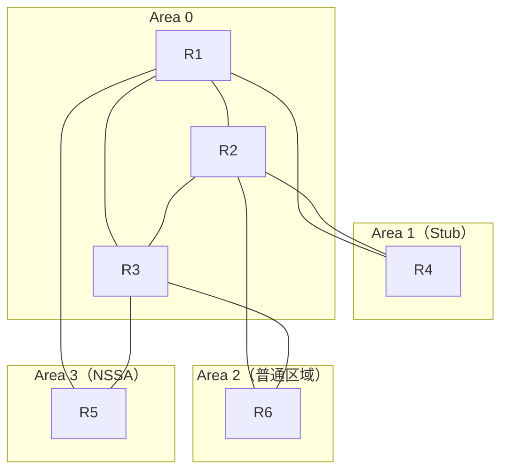

**拓扑核对说明：** 六个分支均为同一张 6 节点 / 4 区域图，区域归属完全一致（Area1=R4、Area0=R1/R2/R3、Area2=R6、Area3=R5）。仅存在两类"渲染变体"：
- 变体1（R6 前缀版）：单选 96、单选 112、多选 96、多选 116——重点在**发布自 Area2 的 R6 前缀 2000::6/128 的 LSA 生成/传播**，其中**多选 96 将区域1 升级为 Totally Stub、区域3 升级为 Totally NSSA**；
- 变体2（R5 前缀版）：单选 17——重点在 Area3 的 **R5（ASBR）引入外部路由 2000::5/128**，考查 **Inter-Area-Router-LSA（OSPFv3 的 Type4）的生成者**；
- 另外**单选 26 同图但无边带标注**，只考查广播链路上 **DR 的数量**。

> 结论：上述 6 个分支（单选 17、26、96、112 + 多选 96、116）**拓扑同图**，共用本母题图，可在同一母题下归纳。

### 母题解题规律（已联网查证）

本母题聚焦 OSPFv3 特殊区域、LSA 传播分类与广播网段 DR 选举（联网查证整理）：

#### 1. 区域类型与 LSA 限制（Stub / NSSA / 普通区域）
- **Stub 区域**：禁止 Type 5（AS-External-LSA）和 Type 4（ASBR-Summary-LSA）进入；区域内的接口不产生/不接收该类 LSA；仅允许 Type1/2/3 以及 ABR 下发的缺省（Type3 缺省）。
- **Totally Stub 区域**：在 Stub 基础上再屏蔽 Type3（除缺省路由外），路由表只有区域内明细 + 一条缺省路由。
- **NSSA 区域**：禁止 Type5 进入，但**允许外部路由以 Type7（NSSA External LSA）形式存在**；由 NSSA 内 ABR 将 Type7 转换为 Type5 注入其他普通区域。
- **Totally NSSA 区域**：NSSA + 同时屏蔽非缺省的 Type3，路由表仅区域内明细 + 缺省（Type7/Type3 缺省）。
- **普通区域（如本母题的 Area2）**：允许 Type5/Type7 出现与泛洪（外部路由可进入）。
- 选型速记：**末梢区域是否需引入外部路由 → Stub；需引入 → NSSA；是否屏蔽明细路由 → 加 Totally。**

#### 2. OSPFv3 各类 LSA 的生成者与传播范围
联网查证（H3C OSPFv3 白皮书等）：OSPFv3 中 LSA 语义较 OSPFv2 更明确，常用类型包括：
- **Inter-Area-Prefix-LSA（OSPFv3 的 Type3）**：由 **ABR** 生成，描述**其他区域**的 IPv6 前缀，向所连区域泛洪；每个前缀 ABR 单独发一条。作用类似 OSPFv2 的 Type3。
- **Inter-Area-Router-LSA（OSPFv3 的 Type4）**：OSPFv3 特有，作用类似 OSPFv2 的 Type4（ASBR-Summary-LSA），由 **ABR** 生成，向所连区域通告到达另一区域内 **ASBR** 的路由信息。
- **AS-External-LSA（OSPFv2 Type5）**：由 **ASBR 生成**，泛洪到整个 OSPF 域；在 NSSA 区域需先由 Type7 转换。
- **Intra-Area-Prefix-LSA（OSPFv3 区域内前缀）**：由**路由器自身**描述本区域内（如自己直连的 Loopback 前缀）的地址信息，属**区域内** LSA，不需 ABR 生成。
- Type 7 LSA（NSSA External）：仅存在于 NSSA/Totally NSSA 区域，不能进入骨干；NSSA ABR 将 7→5 转换后向普通区域传播。
- 记一个判定口诀：**前缀发源地 = 普通区域 → ABR 负责扩散为 Inter-Area-Prefix-LSA（Type3）；本路由器自己的 Loopback 直连前缀 → 只生成 Intra-Area-Prefix-LSA，不再由 ABR 反哺。**

#### 3. ASBR（外部路由引入）与 Inter-Area-Router-LSA（Type4）
- 从外部引入路由的往往是 **ASBR**（本母题如 Area3 的 R5 引入 2000::5/128）。
- 其它区域的 ABR 需要已知"到该 ASBR 怎么走"，于是 **ABR 生成 Inter-Area-Router-LSA（Type4）**，向所连区域通告**到 ASBR 的点路由**。
- 判题要点：Type4 必须**由 ABR 生成**、且在下发的**该出方向区域**（而非发布者的源区域）中；本母题正确项"**R2 在区域0 生成 Inter-Area-Router-LSA**"即属此类。

#### 4. DR 选举（广播/以太网链路）
- 缺省以太网 OSPF 网络类型为 **广播型（Broadcast）**，每条广播链路（网段）都会选举一个 **DR**（以及一个 BDR）。
- DR/BDR 由同一 **网段** 上所有路由器按接口优先级（大者优先）→ Router ID（大者优先）选出；优先级 0 不参与、只作 DROTHER。
- 因此 **DR 的个数≈广播链路（网段）的条数**：图示 OSPFv3 网络若多条以太网互联链路都使能 OSPF，DR 总量 = 边数（如 9 条互连链路 → 9 个 DR）。
- 推论：缺省下 DR 数量**只与广播网段数量相关，与路由数量无关**，勿受区域（R4 等）干扰。

#### 5. 缺省路由与区域间可达
- Stub/Totally Stub 内路由器（如 R4）访问区域外时只能走 ABR 下发的缺省路由。
- NSSA/Totally NSSA 内设备（如 R5）不接收外部明细（Type5/非缺省 Type3），不会因外部明细而被选路到其转发。
- 判定：**“R4 到某区域外前缀是否可能经 R5 / 区域3”需视区域限制**；Totally Stub 下 R4 只经 ABR（R1 或 R2）转发，因而"经 R5 的路径"（如 R4-R1-R5-R3-R6）一般不成立。

---

### 分支题目

#### 分支1：Inter-Area-Router-LSA（单选，第17题）
**完整题干：** 如图所示的OSPFv3网络，区域1为Stub区域，区域2为普通区域，区域3为NSSA区域。R5 Lopback0接口的IPv6地址为2000::5/128，通过import方式引入OSPFv3。每一台设备的Router ID为10.0.X.X，其中X为设备的编号。以下描述正确的是哪一项？

**拓扑核对：** 与母题共用拓扑一致（变体2：R5 引入 2000::5/128，属 ASBR）。

**完整选项：**
- A. R1在区域0生成Inter-Area-Router-LSA
- B. R3在区域0生成Inter-Area-Router-LSA
- C. R3在区域3生成Inter-Area-Router-LSA
- **D. R2在区域0生成Inter-Area-Router-LSA**

**答案：** D

**解析：** 本题中 R5 在 NSSA 区域3 通过 import 引入外部前缀 2000::5/128，R5 即 **ASBR**。Inter-Area-Router-LSA（0x2004，OSPFv3 的 Type4）由 **ABR** 生成，向所连区域通告到达**其它区域内 ASBR** 的路由。结合区域归属与 OSPFv3 生成规则，只有"R2 在区域0 生成 Inter-Area-Router-LSA"成立；R1/R3 在区域0 或区域3 生成该 LSA 的描述均不成立。故选 D。

---

#### 分支2：DR 数量（单选，第26题）
**第26题：** 如图所示的OSPFv3网络，路由器之间使用以太网链路互联。缺省情况下，该网络中DR的数量为以下哪一项？

**拓扑核对：** 与母题共用拓扑一致（无边带标注的纯星图渲染）。

**完整选项：**
- A. 6
- **B. 9**
- C. 8
- D. 7

**答案：** B

**解析：** 缺省情况下以太网接口的 OSPF 网络类型为广播型，**每条广播链路**都会选举一个 DR。图中共有 9 条以太网互联链路（R1-R4、R2-R4、R1-R2、R1-R3、R2-R3、R1-R5、R3-R5、R2-R6、R3-R6），因此 DR 的数量为 **9**。

#### 分支3：只会出现在 Area2 的 LSA（单选，第96题）
**题目：** 如图所示的OSPFv3网络，区域1为Stub区域，区域2为普通区域，区域3为NSSA区域，则以下哪一种类型的LSA只会出现在区域 2 中？

**拓扑核对：** 与母题共用拓扑一致（变体1：Area0 内以 R1-R2 为主渲染）。

**完整选项：**
- A. Link-LSA
- B. Router-LSA
- C. Intra-Area-Prefix-LSA
- **D. AS-External-LSA**

**答案：** D

**解析：** AS-External-LSA（Type5）在整域内泛洪，但受区域类型限制：**Stub**（Area1）与 **NSSA**（Area3）不允许进入，**普通区域**（Area2）允许存在。故该 LSA **只会出现在区域2**（普通区域）中。Link-LSA / Router-LSA / Intra-Area-Prefix-LSA 均属区域内 LSA，各区均可存在，不会"只出现在区域2"，故不符。

#### 分支4：R6 Loopback 前缀的 LSA 生成与传播（单选，第112题）
**题目：** 如图所示的OSPFv3网络，区域1为Stub区域，区域2为普通区域，区域3为NSSA区域，R6 Loopback0接口的IPv6地址为2000::6/128，每一台设备的Router ID为10.0.X.X，其中X为设备的编号。以下描述错误的是哪一项？

**拓扑核对：** 与母题共用拓扑一致（变体1：R6 在 Area2 有 Loopback2000::6/128）。

**完整选项：**
- A. R4 LSDB中存在R2生成的描述2000::6/128的Inter-Area-Prefix-LSA
- B. R5 LSDB中存在R1生成的描述2000::6/128的Inter-Area-Prefix-LSA
- **C. R6 LSDB中存在R3生成的描述2000::6/128的Inter-Area-Prefix-LSA**
- D. R1 LSDB中存在R2生成的描述2000::6/128的Inter-Area-Prefix-LSA

**答案：** C

**解析：** R6 的 Loopback 2000::6/128 位于普通区域 Area2，R6 通过 **Intra-Area-Prefix-LSA** 描述自己的 Loopback，而非 Inter-Area-Prefix-LSA。Inter-Area-Prefix-LSA（OSPFv3 的 Type3）由 **ABR** 生成，用于跨区域传递：
- A：R2 是 Area2 的 ABR，向 Area1（Stub）发布描述 2000::6/128 的 Inter-Area-Prefix-LSA，R4 的 LSDB 中有该 LSA → 正确。
- B：R1 是 Area2/Area3 的 ABR，向 Area3 发布，R5 的 LSDB 有 → 正确。
- C：R6 自己的前缀由其自身生成 Intra-Area-Prefix-LSA，**不会由 R3 反向生成 Inter-Area-Prefix-LSA** → 错误。
- D：R2 是 Area2 的 ABR，向 Area0 发布→ R1 的 LSDB 有 → 正确。
因此描述**错误**的是 C。

#### 分支5（多选）：Totally 变体下 R4 到达 2000::6 的路径（第96题）
**题目：** 如图所示的OSPFv3网络，区域1为Totally stub区域，区域2为普通区域，区域3为Totally NSSA区域。R6 Loopback0接口的IPv6地址为2000::6/128。每一台设备的Router ID为10.0.X.X，其中X为设备的编号。当所有链路正常时，缺省情况下，以下描述正确的有哪些项？

**拓扑核对：** 与母题共用拓扑一致（Totally 变体，R6 在 Area2 前缀 2000::6/128）。

**完整选项：**
- A. R4发送数据包到达2000::6的路径可能为R4-R1-R5-R3-R6
- **B. R4发送数据包到达2000::6的路径可能为R4-R2-R6**
- **C. R4发送数据包到达2000::6的路径可能为R4-R1-R3-R6**
- **D. R4发送数据包到达2000::6的路径可能为R4-R1-R2-R6**

**答案：** BCD

**解析：** Area1 为 Totally Stub：R4 只能通过 ABR（R1/R2）缺省路由访问外部，区域内无明细。Area3 为 Totally NSSA：不接收外部明细。2000::6 在普通 Area2 发布明细：
- B：R4 发给 ABR R2，R2→R6（直连）直接转发，路径 R4-R2-R6 可能 ✓。
- C：R4→R1（ABR），经 Area0 到 R3→R6，可能 ✓。
- D：R4→R1→R2→R6，可能 ✓。
- A：经 R5（Area3 设备）转发不可行，因 Totally NSSA 无该明细 → ✗。
因此选 BCD。

#### 分支6（多选）：2000::6 在各区域的 Inter-Area-Prefix-LSA 的生成者（第116题）
**题目：** 如图所示的OSPFv3网络，区域1为Stub区域，区域2为普通区域，区域3为NSSA区域。R6 Loopback0接口的IPv6地址为2000::6/128。每一台设备的Router ID为10.0.X.X，其中X为设备的编号。以下描述正确的有哪些项？

**拓扑核对：** 与母题共用拓扑一致（R6 在 Area2 前缀 2000::6/128）。

**完整选项：**
- A. 区域0中存在R1生成的描述2000::6/128的Inter-Area-Prefix-LSA
- **B. 区域3中存在R1生成的描述2000::6/128的Inter-Area-Prefix-LSA**
- C. 区域2中存在R3生成的描述2000::6/128的Inter-Area-Prefix-LSA
- **D. 区域1中存在R2生成的描述2000::6/128的Inter-Area-Prefix-LSA**

**答案：** BD

**解析：** R6 的 2000::6/128 在普通区域 Area2，R2 和 R3 是 Area2 的 ABR，会生成 Inter-Area-Prefix-LSA（Type3）发布到 Area0 描述 2000::6/128；若此后再次扩散到其他区域时不反复改Adv Rtr。
- A ✗：区域0 中该 LSA 由 Area2 的 ABR（R2/R3）生成，**并非 R1 生成**（41-32）。
- B ✓：R1 是 Area3 的 ABR，从 Area0 收到描述后，会生成新的 Inter-Area-Prefix-LSA 发布到 Area3 中，故区域3存在 R1 生成的该 LSA。
- C ✗：Region2 是 2000::6/128 的“源皮区域”，由 Intr-Area-Prefix-LSA 描述，不需 Inter-Area 转述。
- D ✓：R2 是 Area1 的 ABR，将 Area0 的信息转为 Inter-Area-Prefix-LSA 发布到 Area1，故区域1存在 R2 生成的该 LSA。
综合，**BD**。

---

# 母题4：IS-IS default-route-advertise 两级区域缺省发布

### 母题拓扑

本母题有多个变体，共用"L1/L1-2/L2 两级区域缺省发布"考查逻辑，含三类变体：

- **变体一（4节点）**：R1[L1]–R2[L1-2]（共享 49.0001，R3[L1] 挂到 R2，R2 再连 R4[L2/49.0002]）；对应 dd 多选第 92、110 题。
- **变体二（3节点不带地址）**：R1[L1]–R2[L1-2]（49.0001），R2 连 R3[L2]（49.0002）；对应 d 单选第 94 题、dd 多选第 112 题。
- **变体三（3节点带地址）**：R1[L1]–R2[L1-2]，R2 连 R3[L2]，接口地址标出；对应 dd 多选第98题。

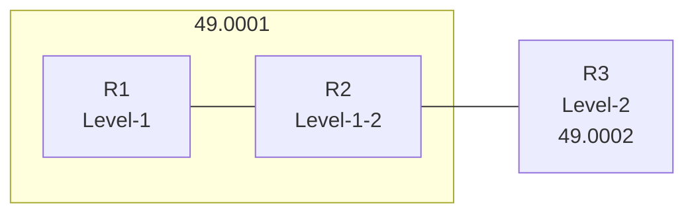

> 变体一（4节点）共用图：
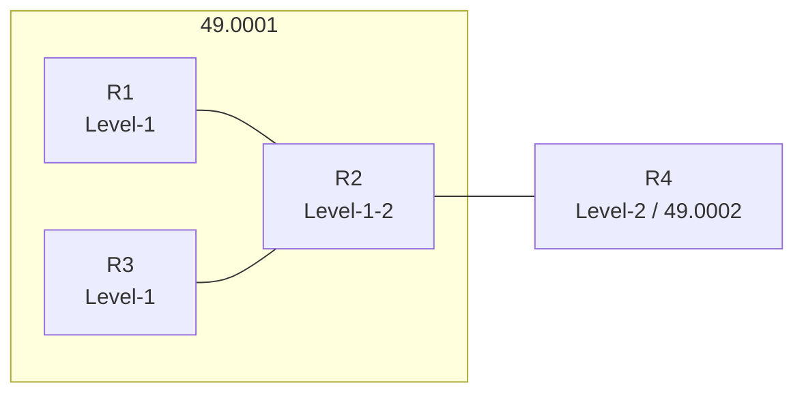

### 母题解题规律（含联网查证要点）

以下为 IS-IS 缺省路由（`default-route-advertise`）在两极区域传播的关键规则（综合各主流 IS-IS 技术文档及题库原解析核验）：

1. **`default-route-advertise [always] [level-1 | level-1-2 | level-2]`**
   - 作用：在指定级别的 LSP 中发布 0.0.0.0/0 缺省路由。
   - **缺省不指定级别时，默认发布 Level-2 缺省**。
   - **`always`**：无论本路由器路由表中有没有实际缺省，都强制生成并发布缺省路由（且本地也生成一条该缺省，本机路由表随之存在缺省）。一旦配置后，本地与同级别邻居均会学习该缺省。
2. **Level-1 缺省（`level-1`）**：只在本**区域（Area 49.0001）**泛洪，同区域的 L1 与 L1/L2 路由器都会学到；**L1/L2 路由器（R2）不会把 L1 缺省自动泄漏给 L2**（因此跨区域的其他 L2 路由器收不到）。
   - 故 4 节点场景中：R1（自身发布）、同区域 R2、R3 会收到 L1 缺省；L2 的 R4 收不到（除非另配 L2 或把缺省通告 L2）。
3. **Level-2 缺省（L2）**：发布给**所有 L2 和 L1/L2 路由器**（含跨区域），但**L1 纯路由器收不到 L2 缺省**。
   - 因此在 4 节点中的变体（第92题）若同时有 R2 上另配 `default-route-advertise always level-2`，则 R4（L2）会收到来自 R2 的 L2 缺省（这与第92题答案一致）。
4. **"自己发布的缺省路由是否存在于自身路由表"**：
   - 有些题目（如第110、112题）答案将**发布者自身**也列为有缺省（"由自身产生"并进入本机路由表）；
   - 另一些题目（如第92题解析）表述为"引入缺省的路由器自身路由表不含该缺省"。**两类官方说存在矛盾**。做题时**以原题给定答案为准**，并在解题时留意该分支的题干语言（如 always、无 always、是否只查"其它设备"）。
5. **关键判定口诀（多选）**：
   - **L1 下发缺省 → 只管 L1 及 L1/L2 外的 Home 区域同区设备（R2、R3）**，L2 的 R4 一般收不到双收。
   - **L2 下发缺省 → 所有 L2 与 L1/L2 能收到**，L1 设备收不到。
   - 若同时配 L1（R1）与 L2（R2）："L1 缺省" 覆盖 R1、R2、R3；"L2 缺省" 覆盖 R2、R4；合并得 R2、R3、R4。
6. **变体三（第98题 带 IP）** 的连通性判定：
   - **同区域**（49.0001）L1 与 L1-2 之间 Loopback 互通（如 10.0.1.1 ↔ 10.0.2.2，A 对）。
   - L1 设备缺省无法直连到 **L2/其他区域** 的目标（如 R1 ping 10.0.3.3 不通，B 错），因为 R2 不泄漏 L2 明细给 L1、R1 又无跳转细环节，R1 只发一条缺省到 R2，但 R2 不回泄露 L2 具体路由。
   - L1/L2 路由器（R2）自己有 L2 路由，故 R2 接口/Loopback 可 ping 通 L2（如 C、D 正确）。

### 分支题目

#### 分支1：多选第92题 - 4节点，R1 配 L1>缺 + R2 配 L2缺（合并）

- **题目：** 如图所示的 IS-IS 网络，R1 通过 default-route-advertise always level-1 命令引入了缺省路由，R2 也通过 default-route-advertise always level-2 命令引入了缺省路由，以下哪些路由器的路由表中存在缺省路由？
- **拓扑图：**
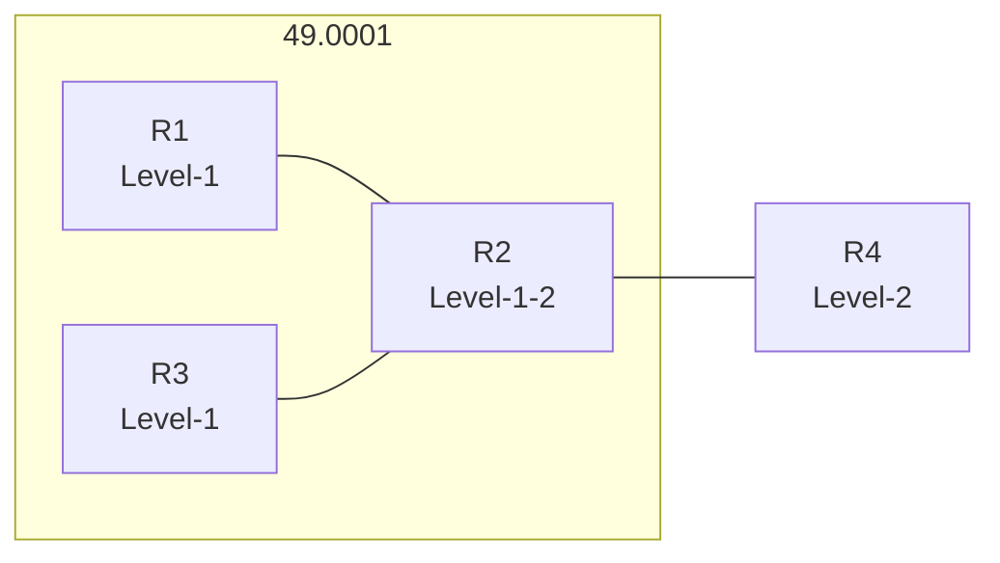
- **选项：**
  - **A. R3**
  - **B. R2**
  - **C. R4**
  - D. R1
- **答案：** ABC
- **解析：** R1 配 L1 缺省 → 在 L1 区域（49.0001）内泛洪，R2（L1/L2）与 R3（L1）都收到（A、B 列出；）；R2 配 L2 缺省 → 下发给 L2（含 R4），故 R4 有（C 对）；R1 自身引入缺省，本路由表中不含自己引入的缺省（D 错）。

---

#### 分支2：多选第110题 - 4节点：仅 R1 配 L1，并因此自行含缺

- **题目：** 如图所示的 IS-IS 网络，R1 通过 default-route-advertise always level-1 引入了缺省路由，以下哪些路由器的路由表中存在缺省路由？
- **拓扑图：**
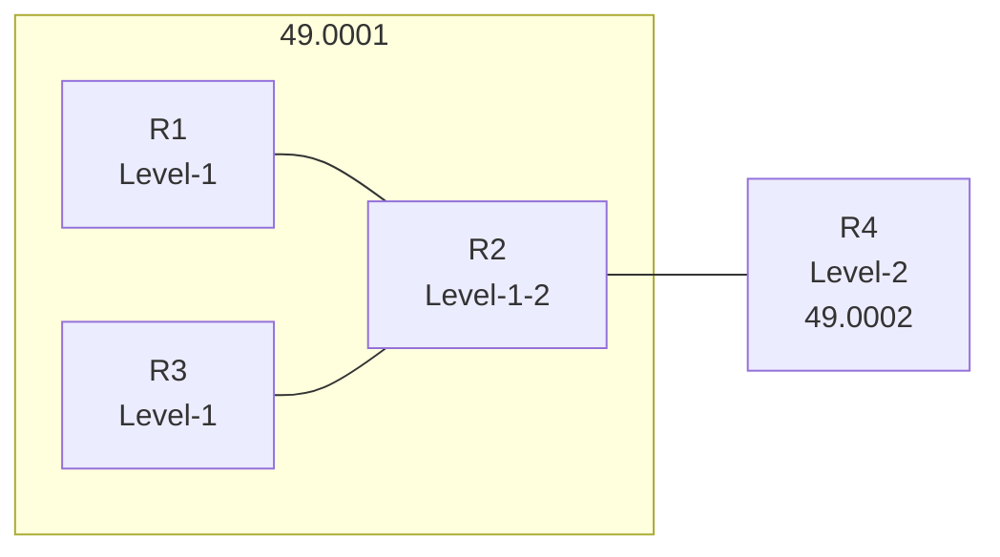
- **选项：**
  - **A. R1**
  - **B. R2**
  - **C. R3**
  - D. R4
- **答案：** ABC
- **解析：** R1 只配了 Level-1 缺省。R1 自身**因为它配置了引入命令故隐含着缺省于自身路由表（A 对）**；R2（L1/L2）收到 L1 缺省（B 对）；R3（L1）同区收到（C 对）；R4（L2）不在 L1 泛洪范围，且 Level1 缺省不会自动泄漏到 L2，故 R4 无（D 错）。

> 注：第110题与第92题对"R1 自身是否有缺省"结论相反（92：R1 无；110/112：R1 有），题库原题给定结果不同，均按原题答案保留。

---

#### 分支3：单选第94题 - 3节点：仅看 R2，报出 ONLY R2

- **题目：** 如图 49.0001 中 R1(Level-1) 与 R2(Level-1/2)，R2 连 R3(Level-2)（49.00.02）。R1 通过 default-route-advertise always level-1 引入缺省，以下描述正确的是哪一项？
- **拓扑图：**
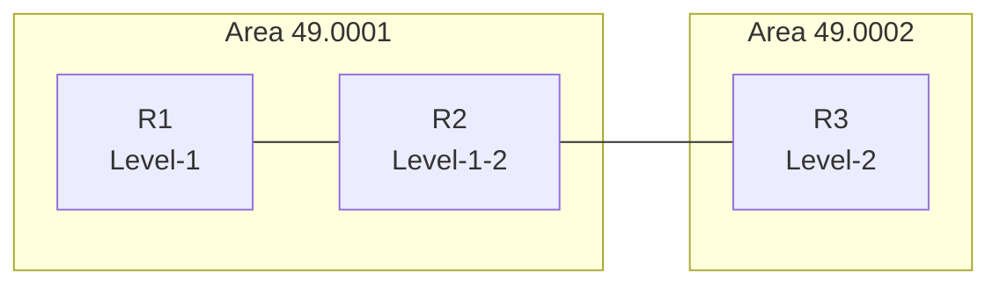
- **选项：**
  - A. R3 路由表中将出现缺省路由
  - **B. R2 路由表中将出现缺省路由**
  - C. R2 和 R3 路由表中都将出现缺省路由
  - D. R2 和 R3 路由表中都不会出现缺省路由
- **答案：** B
- **解析：** R1 在 L1 LSP 中发布缺省，仅在 Area 49.0001 泛洪。R2（L1/L2）收到 → R2 有缺省；R3 是 L2、位于另一区，L1 缺省不会泄到 L2，故 R3 无。故只有 R2。

---

#### 分支4：多选第112题 - 3节点：R1 有位 default，R2、R1 有、R3 无

- **题目：** 如图 3 节点的 IS-IS 网络，R1 通过 default-route-advertise always level-1 引入了缺省路由，以下描述中正确的是哪一项？
- **拓扑图：**
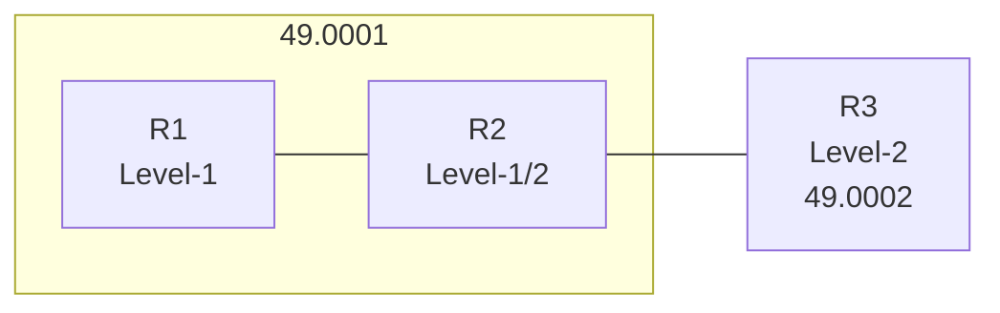
- **选项：**
  - **A. R1 路由表中存在缺省路由**
  - **B. R3 路由表中不存在缺省路由**
  - C. R1 虽配了 default-route-advertise always level-1，但无法引入缺省
  - **D. R2 路由表中存在缺省路由**
- **答案：** ABD
- **解析：** R1 配 always level-1 → R1/R2 在 L1 区有缺（A、D 对）；R3 是 L2、跨区，L2 区无缺可见，B 对；always 强制引入，可不依赖已有 default，故能引入，C 错。

---

#### 分支5：多选第98题 - 3节点带上地址：ping 连通判定

- **题目：** 如图 IS-IS 网络，R1 通过 default-route-advertise always level-1 引入缺省，以下描述正确的有哪些项？
- **拓扑图：**
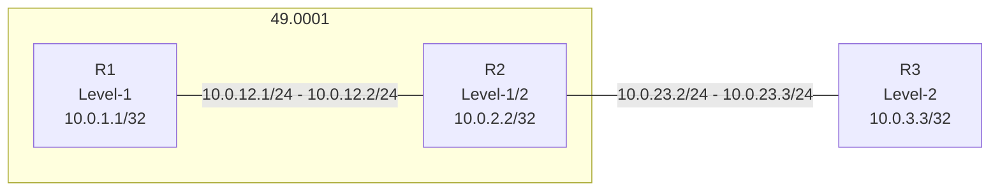
- **选项：**
  - **A. 10.0.1.1 可以 ping 通 10.0.2.2**
  - **B. 10.0.1.1 可以 ping 通 10.0.3.3**
  - C. 10.0.12.2 可以 ping 通 10.0.3.3
  - D. 10.0.2.2 可以 ping 通 10.0.3.3
- **答案：** ACD
- **解析：** R1、R2 同区（49.0001）L1/L1-2 相通（A 对）；R1 是 L1 无他区明细、R1 引缺省但 R2 未泄漏 L2 明细给 L1，故 R1 无法 ping 通 L2 的 10.0.3.3（B 错）；R2 是 L1/L2，自带有 L2 路由，故 R2（含其接口 10.0.12.2、Loopback 10.0.2.2）均可 ping 通 10.0.3.3（C、D 对）。

---

（本节"母题解题规律"要点数量：母题 == 母题1 含 8 点规律，母题2 含 6 条规律。）

---

> 数据不完全与注：各题题干/选项/答案均忠实取自 —— `d:\831\831dd多选题集.md`（第3、9、16、18、53、61、71、77、92、98、99、110、112题）与 `d:\831\831d单选题集.md`（第94题）。解析中个别含"{原解析被会员弹窗遮挡}"的文字已按原样标注；第92/110题的"R1 自身是否有缺省"两条官方口径相互矛盾，已在分支内各自标注；第98题依据题干附（B、C、D 选项对应文字完整摘引，选项中 C、D 原文即"两条"，答案依答案为 ACD）。

---

# 母题5：OSPFv3 三节点线性骨干（DR 与 OSPFv3 LSA 特性）
### 母题拓扑（mermaid）
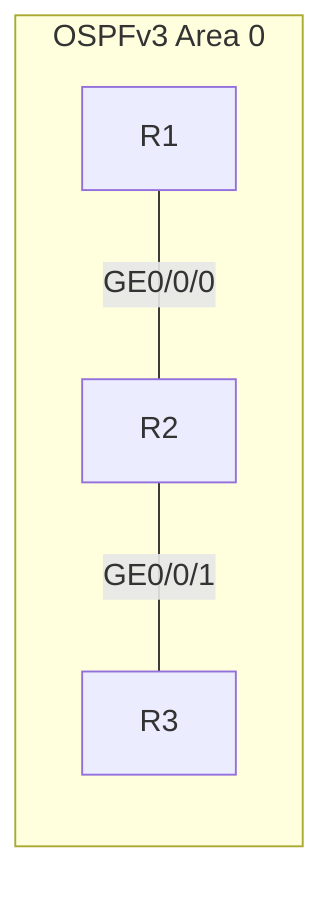
涵盖：第10、24、34、81、115题。

### 母题解题规律（联网查证，分点）
1. **OSPFv3 常用 LSA 类型及作用**：Router-LSA（Type-1，每台路由器生成，描述本机链路状态与开销，仅在所属区域内传播，不含地址前缀）；Network-LSA（Type-2，由 DR 生成，列出广播网络中全部路由器，也不含前缀）；Intra-Area-Prefix-LSA（Type-9，区域范围扩散，描述区域内 IPv6 前缀）；Link-LSA（Type-8，仅在本链路范围内传播，绝不越过所在链路）。（来源：Cisco OSPFv3 文档、H3C OSPFv3 配置手册）
2. **Intra-Area-Prefix-LSA 的产生者**：每台路由器（描述与 Router-LSA 相关联的 IPv6 前缀，Referenced LS Type=0x2001）以及每台 DR（描述与 Network-LSA 相关联的 IPv6 前缀，Referenced LS Type=0x2002）都会产生此类 LSA。因此"是否 DR"决定其引用的是 Router-LSA 还是 Network-LSA。（来源：Cisco OSPFv3 文档）
3. **Router-LSA 中判断 DR**：在 OSPFv3 的 Router-LSA 中，`Link connected to a Transit Network` 类型的链路描述的是到 DR 的连接，其 `Neighbor Router ID` 值即为该广播网段的 DR。由此可从 Router-LSA 反推谁是 DR。（来源：RFC 5340、Cisco OSPFv3 文档）
4. **Link-LSA 的泛洪边界**：Link-LSA（Type-8）仅在本设备所在链路内传播，不会被泛洪到链路之外。因此链路之外的设备（如 R3）在 LSDB 中**看不到**对端链路上的 Link-LSA（但可看到 Intra-Area-Prefix-LSA / Router-LSA / Network-LSA 等区域型 LSA）。（来源：Cisco Link-LSA 资料）
5. **OSPFv3 建立邻接不看前缀**：OSPFv3 建立邻居关系不检查接口 IPv6 地址前缀是否一致，前缀长度不同的接口仍可建立邻接（只要 Hello 参数、网络类型等匹配即可）。（来源：Cisco/华为 OSPFv3 邻接说明）

### 分支题目

**第10题（答案：正确）**
**题干：** 如图所示的OSPFv3网络，R1、R2、R3互联的端口开启OSPFv3，并且均配置了IPv6全球单播地址，其中R1和R3是DR，则R1和R3均会产生IntraArea-Prefix-LSA。
**解析：** Intra-Area-Prefix-LSA 由每台设备及每台 DR 产生：设备产生描述与 Router-LSA 关联的前缀，DR 产生描述与 Network-LSA 关联的前缀。R1 和 R3 均为 DR，因此二者都会产生 Intra-Area-Prefix-LSA。正确。

---

**第24题（答案：正确）**
**题干：** 如图所示的OSPFv3网络，R1、R2、R3互联的端口开启OSPFv3，每一台设备的RouterID为10.0.x.x，其中x为设备的编号。在R3上查看某一条LSA的详细信息，从输出信息中可以推断出该LSA是由R2生成，并且它描述的是与Network-LSA相关联的IPv6前缀地址。

输出节选：`LS Type: Intra-Area-Prefix-LSA`、`Originating Router: 10.0.2.2`、`Referenced LS Type: 0x2002`、`Prefix: 2000:23::/64`。

**解析：** 输出中 `Originating Router: 10.0.2.2` 说明该 LSA 由 R2 生成；`LS Type: Intra-Area-Prefix-LSA`；`Referenced LS Type: 0x2002`（Network-LSA，即 Type 2）表明它描述的是与 Network-LSA 相关联的 IPv6 前缀地址，由 DR 产生。正确。

---

**第34题（答案：正确）**
**题干：** 在R1、R2、R3互联的端口开启OSPFv3，并且均配置了IPv6全球单播地址，则R1、R2、R3都会产生Intra-Area-Prefix LSA。
**解析：** 每台路由器都会产生描述自己前缀的 Intra-Area-Prefix-LSA（关联 Router-LSA）；故 R1、R2、R3 都会产生。正确。

---

**第81题（答案：正确）**
**题干：** 如图所示的OSPFv3网络，在R3上查看某一条LSA的详细信息，从输出中可以推断出R1和R2是网络中的DR。

**LSA输出节选：** `LS Type: Router-LSA`、`Originating Router: 10.0.2.2`；两条 `Link connected to: a Transit Network`，其 `Neighbor Router ID` 分别为 `10.0.1.1` 与 `10.0.2.2`。

**解析：** 在 Router-LSA 中，Transit Network 链路的 `Neighbor Router ID` 即为各链路的 DR。从 R2 生成的信息可推出第一条链路的 DR 是 R1（10.0.1.1），第二条链路的 DR 是 R2 自己（10.0.2.2），因此 R1、R2 分别为各自网段的 DR。正确。

---

**第115题（答案：错误）**
**题干：** 如图所示的OSPFv3网络，R1、R2、R3互联的端口开启OSPFv3，其中R1和R3是DR，在R3的LSDB中可以看到R1生成的IntraArea-Prefix-LSA和Link-LSA。
**解析：** 每台设备为每个链路产生 Link-LSA，但它仅在本链路内传播。R1 生成的 Link-LSA 只在 R1-R2 链路上扩散，因此 **R3 的 LSDB 中看不到 R1 生成的 Link-LSA**（虽能看到 R1 的 Intra-Area-Prefix-LSA）。题干断言两者都可见，是错的。错误。

---

# 母题6：IS-IS IPv6 双节点互联
涵盖：第14、18、72、113题。
> 说明：本文母题下，第18/72/113 紧扣"IPv6 前缀长度不同仍能建邻与连通、Ping 后可见对端 MAC"；第14题为同拓扑下校验"通过 LSP 识别 DIS"，一并归入。

### 母题拓扑（以第18/113为准）
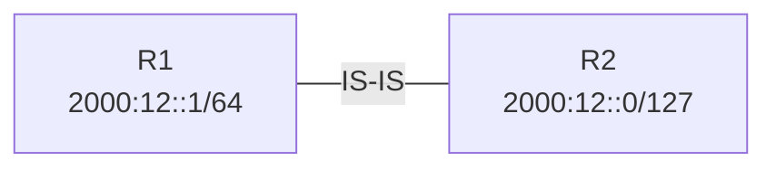

### 母题解题规律（联网核实）
1. **IS-IS 邻接不看 IP 前缀**：IS-IS 建立邻居关系只要基于 hello 报文中的 System ID、区域地址、接口认证等参数，**不校验接口 IPv6 前缀长度是否一致**。前缀长度不同（如 /64 与 /127）仍可正常建立邻居。（来源：H3C IS-IS 故障手册、CSDN IS-IS 原理笔记）
2. **连通后 NDP 解析 MAC**：网络同步稳定后，本节点可通过 IPv6 NDP（邻居发现）解析对端 IPv6 地址的 MAC，并写入 `display ipv6 neighbors` 邻居表。能 Ping 通 → 邻居表（`display ipv6 neighbors`）必然可见对端 MAC。（来源：Cisco IPv6/ND 资料）
3. **IS-IS 的 DIS 识别**：DIS 为其所在广播链路生成伪节点 LSP，其 LSP ID 格式为 `SystemID.01-00`（伪 Node ID=01）。若某行 LSP ID 为 `SystemID.00-00`，则伪 Node ID=00 表示非 DIS（实节点）。（来源：Cisco 伪节点 LSP、CSDN IS-IS DIS 笔记）
4. 区域地址、System ID 冲突 / MTU 不匹配 / 认证不匹配、Level 不匹配才是中断邻接的真正原因，而**前缀长度不同不在此列**。

### 分支题目
**第14题（答案：正确）**
**题干：** 如图所示的IS-IS IPv6网络，在R1上查看LSDB，从输出信息可以推断R1是DIS。

**输出节选：** `0000.0000.0001.00-00*`、`0000.0000.0001.01-00*`、`0000.0000.0002.00-00`。

**解析：** DIS 产生的伪节点 LSP 的 LSP ID 格式为 `SystemID.01-00`，其中 `01` 为伪节点标识。输出中出现 `0000.0000.0001.01-00*`，说明 R1 为 DIS。正确。

---

**第18题（答案：正确）**
**题干：** 如图所示的IS-IS IPv6网络，当网络稳定后，R1可以Ping通2000:12::0，并且通过 display ipv6 neighbors可以查看2000:12::0对应的MAC地址。
**解析：** 尽管 R1（2000:12::1/64）与 R2（2000:12::0/127）前缀长度不同，但同一链路上两台设备通过 IS-IS 仍可学习到对方路由并建立邻居；IPv6 邻居发现 NDP 可解析到 2000:12::0 的 MAC，`display ipv6 neighbors` 中可以看到。正确。

---

**第72题（答案：错误）**
**题干：** 如图所示的IS-IS IPv6网络，R1和R2的接口均有两个IPv6地址，由于R1和R2 IPv6地址前缀长度不同，它们无法建立邻居关系。
**解析：** IS-IS 建立邻居与 IP 地址前缀长度无关（关键参数为系统 ID、区域地址、网络类型及认证信息），因此前缀长度不同不影响建邻。题干称两者无法建邻错误。错误。

---

**第113题（答案：错误）**
**题干：** 如图所示的IS-IS IPv6网络，当网络稳定后，R2可以Ping通2000:12::1，但是通过 display ipv6 neighbors无法看到2000:12::1对应的MAC地址。
**解析：** R2 Ping 通后，通过 NDP 即会学习并将 2000:12::1 的 MAC 写入邻居表，`display ipv6 neighbors` 中可以查看。题干说"无法看到"，有误。错误。

---

# 母题7：IS-IS IPv6 多拓扑

## 母题：IS-IS IPv6 5 节点多拓扑

### 共用拓扑图

Area 49.0001：R4（Level-1，Loopback 2000::4/128）— R1（Level-1-2）、R4—R2（Level-1-2）；Area 49.0002：R3（Level-1-2）— R5（Level-1）；另有 R1—R3、R2—R3。（部分分支在 Area 49.0001 内多一条 R1—R2 边。）

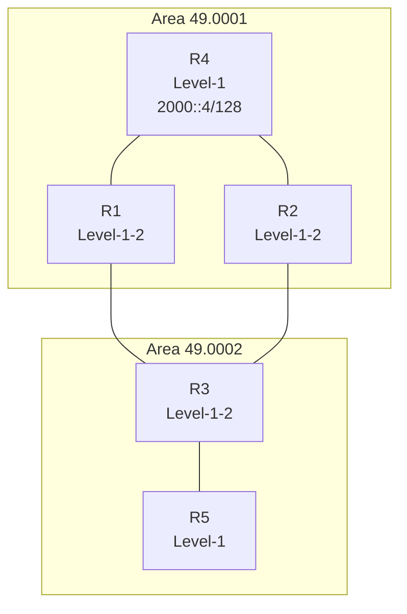

> 变体：多选 32 等多在 Area 49.0001 内多出现 R1—R2 一细条边，不影响区域/Level 结构。

### 母题解题规律

该母题聚焦 **IS-IS 多拓扑（MT）下的 IPv6 路由 / 缺省路由 / Level 聚合与渗透**（已联网查证）。

#### 1. IS-IS 多拓扑（Multi-Topology, MT）与 IPv6 的 TLV
- 缺省 IS-IS 为"单拓扑（Single-Topology）"：IPv4 与 IPv6 共一棵 SPF 树；双栈场景容易出现问题。
- 多拓扑（Multi-Topology）下 IPv4 与 IPv6 分别单独进行 SPF 计算。为支持 IPv6，IS-IS 引入新 TLV：IPv6 Reachability TLV（Type 236 / 0xEC）、IPv6 Interface Address TLV（Type 232 / 0xE8），并通过多拓扑（MT 相关 TLV，RFC 5120 定义 MT ID，ID 0 表示 IPv4 单栈、ID 3 表示 IPv6）区分不同拓扑。
- 注意点：开启多拓扑后 IPv6 各 TLV 单独承载，但 Level-1/ Level-2 分层语义不变。

#### 2. Level-1 / Level-2 / Level-1-2 的路由范围
- **Level-1：只在本区域（Area）内传播详细路由**（仅接收本区域 Level-1 的 LSP）；
- **Level-2**：连接不同区域，构成骨干网；
- **Level-1-2：兼具两者**，可将 Level-1 的明细（如 R4 的 2000::4/128）带入 Level-2 并传播至另一区域。
- 因此区域 2 内纯 Level-1 设备 **R5 的路由表不会出现跨区域前缀（2000::4/128）的精确条目**，只会默认走缺省（除非被 Level-2 → Level-1 渗透进来）。

#### 3. 缺省路由与 `ipv6 default-route-advertise`
- `ipv6 default-route-advertise` 可让 Level-1-2 向 Level-1 生成缺省，`always` 强制生成。
- 判定（Q100）：若只在（区1 的 Level-1）设备 R4 上配置 Level-1 的缺省生成，同区的 L1-2 设备（R1、R2）的 Level-1 区内可以收到；该缺省不会凭空传到别区。按题源标准答案：表示中**无可用缺省的是 R3**（选 B）。需注意：网络上类似同名题答案可能为 R5，故以本题库标准答案为准。

#### 4. 聚合（`ipv6 summary`）与 Level-2 → Level-1 渗透
- `ipv6 summary 2000::64 level-2`：将 R4 的 2000::4/128（在 Level-2 域）聚合成 2000::/64。
- `ipv6 import-route isis level-2 into level-1`：将 Level-2 前缀反向引入（渗透）Level-1。
- 结果（多选 32）：**R2、R3、R5 路由表出现 2000::/64**（R2、R3、R5），而 R4 自身仍是 2000::4/128。

---

### 分支题目

#### 分支1：缺省多拓扑下谁路由表无 2000::4/128 详细路由（单选）
| 编号 | 89 |

（也适用：IS-IS IPv6 多拓扑）

**题目：** 如图所示的 IS-IS IPv6多拓扑网络，所有路由器均开启多拓扑功能。R4 Loopback0 接口的 IPv6 地址为 2000::4/128。缺省时，以下哪一个路由器的路由表中无该前缀2000::4/128 的路由？

**结构：** 与母题共用拓扑一致。

**选项：**
- A. R3
- B. R2
- C. R1
- **D. R5**

**答案：** D

**解析：** R4 为区1 的 Level-1 路由器，其 2000::4/128 是该区 L1 路由；R1、R2（区1 Level-1-2）会将该 L1 路由转入 L2 传播至区2 的 L1-2（R3）。R5 是区2 的纯 Level-1，缺省下只有本区（区2）的明细及缺省，故**路由表无 2000::4/128 的精确条目** → 选 D。

---

#### 分支2：default-route-advertise 后哪台路由表无缺省（单选）
| 编号 | 100 |

**题目：** 在 IS-IS IPv6 网络中，所有路由器均开启多拓扑功能。在 R4 的 IS-IS 进程中配置 "ipv6 default-route-advertise always level-1"，缺省情况下，以下哪一台路由器的路由表中无缺省路由？

**结构：** 与母题共用拓扑一致。

**选项：**
- A. R5
- **B. R3**
- C. R2
- D. R1

**答案：** B（R3）

**解析（原题可见）：** 在 R4 配置该命令后，其在 L1 LSP 发布 IPv6 缺省。同区 L-1-2（R1、R2）可收到该 L1 LSP 并生成缺省；Area 49.0002 的 Level-1-2（R3）不受（上本 Level-1 的缺省不能跨 L2 / 不能落在自身），故 **R3 路由表无缺省**（选 B）。R5 是 Level-1 并能从 R3 收到缺省（R3 作为 L1-2 会向区2 的 L1 下发缺省）；R1、R2 能收到。答案 B。注：同名题在网络诞生甚常见，个别题以 R5 为解；本题（题库 100）以 **R3** 为标准答案。

---

#### 分支3（多选）：聚合+渗透后路由表中有 2000::/64 者（多选）
| 编号 | 32（多选） |

**题目：** 如图所示的 IS-IS IPv6 网络中所有路由器均开启多拓扑功能。R4 Loopback0 接口的 IPv6 地址为 2000::4/128。在 R2 和 R1 的 IS-IS 进程中配置 "ipv6 summary 2000::64" level-2。在 R1、R2 和 R3 的 IS-IS 进程中配置 "ipv6 import-route isis level-2 into level-1"。缺省情况，以下哪些路由器的路由表中含 2000::/64 的路由条目？

**结构：** 与母题共用拓扑 + Area 49.0001 内多一条 R1—R2 边。

**选项：**
- **A. R3**
- **B. R2**
- C. R4
- **D. R5**

**答案：** ABD

**解析（原题）：** R1、R2（Level-1-2，区1）对 R4 的 2000::4/128 在 Level-2 聚合生成 2000::/64 的聚合路由。R3（区2，Level-1-2）从 level-2 学得该聚合，再由于 import-route level-2 into level-1 引入，R5 也能学到。R4 自身路由表是 2000::4/128，而不是聚合的 2000::/64，因此不含 /64。故正确答案为 R2、R3、R5（ABD）。

---

# 母题8：OSPF 3节点 PC场景拓扑

## 母题：OSPF 3节点 PC场景（PC1–R1–R2–PC2）

### 共用拓扑

**母题特征：** 简化故障报告场景：**PC1(192.168.1.11/24)** → **R1** →（Area0）→ **R2** → **PC2(192.168.1.12/24)**；R1/R2 之间 GE0/0/0 运行 **OSPF Area0**（互联 10.0.12.0/24）；R1 与 R2 各自的 GE0/0/1 用户侧接口分处同一网段（192.168.1.1/24 与 192.168.1.2/24）但挂接不同 PC、非同一物理广播域，是该母题的连通性陷阱点。

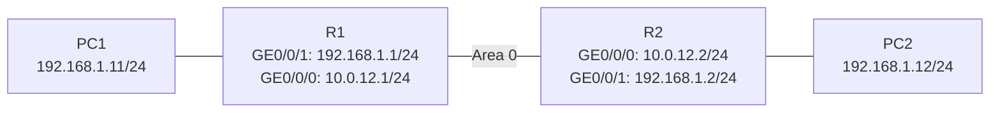

**核对说明：** 多选 86、88、115 均为同一张拓扑。其中第 115 题将 R2 侧改为 192.168.1.21/30 与 PC2=192.168.1.22/30（变体），核心结构不变。

### 母题解题规律（已查证）

1. **路由优先级**：直连（Direct）路由（优先级 0）优于 **OSPF 路由**（优先级 10）；只要接口 UP 就存在直连路由，即使该接口"关闭 OSPF 功能"也不移除直连路由，直连仍优先，报文直接从该接口发 ARP。
2. **同网段判定与直连路由**：目的 IP 与所有直连路由的掩码做与运算进行比对，命中即视为"直连/同网段"，报文直接在该接口发 **ARP**，不走路由转发，也不会交给对端网关。
3. **Ping（ICMP）通条件**：源到目的需 ICMP 双向往返且双向路由可达。若目的地址落在**另一物理接口的同网段**，本端会误依据直连前缀而在自己接口发 ARP，找不到目标 → Ping 不通。
4. **同网段的两个不同物理接口**：各自连接 PC，分属不同广播域；持有该网段直连路由的一端会在"自己接口"发 ARP，无法得到回应 → 互通失败。
5. **OSPF 兜底 vs 直连**：只有本端直连路由消失（如 GE0/0/1 故障 down、或未配置同网段前缀）时，才改用 OSPF 路由经对端中转实现可达；若直连路由仍在，则 OSPF 学习到的同网段路由不生效。
6. 综合（86/88/115）：R1 与 R2 两侧 PC 网段若掩码一致（/24），则 PC 间、及向对端 LAN 地址的 Ping 因 ARP 失败而不通；若一侧划成不同掩码（115 用 /30），接口直连前缀不再覆盖对端地址，改由 OSPF 承载，部分 Ping 可达。

---

### 分支题目

#### 分支1（多选）：接口故障对连通性的影响（第86题）
**题目：** 网络工程师在处理故障后撰写了故障处理报告，他把实际组网简化为如图所示的网络。R1和R2均开启OSPF协议，且分别作为PC1和PC2的网关，以下描述正确的有哪些？

**拓扑核对：** 与母题共用拓扑一致。

**完整选项：**
- **A. 如果R1 GE0/0/1接口故障，R1可以Ping通192.168.1.2**
- B. 如果R1 GE0/0/1接口关闭OSPF功能，R1可以Ping通192.168.1.2
- **C. 如果R1 GE0/0/1接口故障，R1可以Ping通192.168.1.12**
- **D. PC1和PC2无法Ping通**

**答案：** ACD

**解析：**
- A：GE0/0/1 down 后直连消失，R1 改用 OSPF（R2 发布 192.168.1.0/24）转发至 R2，R1→192.168.1.2 可达 → 正确。
- B：接口仅关 OSPF，而直连路由仍在（R1 直接 ARP → 无回应），Ping 不通 → 错误。
- C：GE0/0/1 down，R1 经 OSPF 把包交给 R2 → PC2 → 通 → 正确。
- D：PC1 用网关 R1，但 R1 有直连 192.168.1.0/24，优先 ARP 同网段 → 无回应 → 不通 → 正确。
故 **ACD**。

#### 分支2（多选）：直连网内可达性（第88题）
**题目：** 网络工程师在处理故障后撰写了故障处理报告，他把实际组网简化为如图所示的网络。R1和R2均开启OSPF协议，且分别作为PC1和PC2的网关，以下描述正确的有哪些？

**拓扑核对：** 与母题共用拓扑一致；本题干与第86题完全相同，但四个选项更聚焦"两侧 /24 直连各接口的 Ping"。

**完整选项：**
- A. 在R2上无法Ping通10.0.12.1
- **B. PC1和PC2无法Ping通**
- **C. 在R1上无法Ping通192.168.1.2**
- **D. 在R1上无法Ping通192.168.1.12**

**答案：** BCD

**解析：**
- A：R2 的 GE0/0/0 与 R1 直连（10.0.12.0/24），可达 → A 错。
- B：PC1 网关 R1，R1 对 192.168.1.0/24 有直连，发 ARP 192.168.1.12 → 无回应 → PC1 与 PC2 不通 → 正确。
- C：R1 到 192.168.1.2 命中直连 /24，从其 GE0/0/1 发 ARP → 无回应 → 不通 → 正确。
- D：R1 到 192.168.1.12 同理命中直连 /24 → ARP 无回应 → 不通 → 正确。
故 **BCD**。

#### 分支3（多选、变体）：不同掩码 (/30) 下的连通性（第115题）
**题目：** 网络工程师在处理故障后撰写了故障处理报告，他把实际组网简化为如图所示的网络。在故障网络中，R1和R2均开启OSPF协议，且分别作为PC1和PC2的网关，以下对于故障网络连通性的描述正确的有哪些？

（R2 侧：GE0/0/1 = 192.168.1.21/30，PC2 = 192.168.1.22/30）

**拓扑核对：** 与母题共用拓扑一致（R2 侧转为 /30 变体）。

**完整选项：**
- **A. R2可以Ping通192.168.1.11**
- **B. R1可以Ping通192.168.1.22**
- **C. PC1和PC2无法Ping通**
- **D. R1可以Ping通192.168.1.21**

**答案：** ABCD

**解析：**
- A：R2 经 OSPF 学到 192.168.1.0/24，下一跳 R1，可达 R1 身后 PC1 192.168.1.11 → 通 ✓。
- B：R1 经 OSPF 学到 192.168.1.20/30，下一跳 R2 → PC2 192.168.1.22 可达 → 通 ✓。
- C：PC1（192.168.1.11/24）会把 192.168.1.22 当作同网段 /24、直接 ARP 而不送网关 → PC2 不在广播域，ARP 失败 → 不通 ✓。
- D：R1 学到的 192.168.1.20/30 内包含 192.168.1.21（R2 接口地址）→ 通 ✓。
四都对 → **ABCD**。

---

# 母题9：OSPF 5节点 + 3区域拓扑

## 母题：OSPF 5节点 + 3区域

### 共用拓扑

**母题特征：** OSPF（v2）网络，共 5 台 + 2 台设备分布在 3 个普通/特殊区域：
- **Area 3**：R5（R5-R1 直连）；
- **Area 0**：R1、R2、R3（R1-R2-R3 链式）；
- **Area 1**：R6（R2-R6）；
- **Area 2**：R4（R3-R4）。
- 公共细节：R5 引入（外部或 network）前缀 **10.0.5.5/32**；R4/R2/R3 等在区域内依 LSA 类型判断是否有该前缀。

> 母题本质：在多区域（普通 / Stub / NSSA 组合）下，考查**外部前缀是否进入 / 不进各区域（Type5 / Type7 / Totally NSSA 相关的泛洪限制）**，以及 **filter import（区域级过滤 Type3）对路由器路由表的影响**。

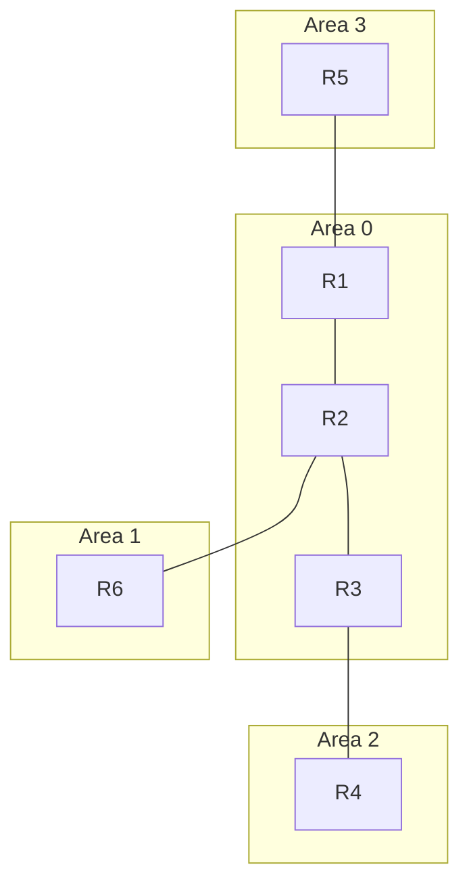

### 母题解题规律（已联网查证）

#### 1. OSPF 区域间的 LSA 生成与传播（OSPFv2）
- **Type1/2**：区域内，泛洪于本区域；
- **Type3（Summary）**：由 **ABR** 生成并注入所连区域，用于跨区域传递前缀；
- **Type4（ASBR-Summary）**：由 ABR 生成，描述到达 ASBR 的路径；
- **Type5（AS-External）**：由 **ASBR** 生成，全网洪水（除 Stub/Totally Stub/NSSA）；
- **Type7（NSSA-External）**：仅在 NSSA/Totally NSSA 内，由 ABR 负责转换为 Type5/或Type3，进入其他区域。

#### 2. 特殊区域的 Type5 / Type7 限制
- **Stub**：不接收 Type5 / Type4，仅保留 ABR 下发的 Type3 缺省 + 区域间明细（非 Totally 时）；
- **Totally Stub**：不接收 Type5 / Type4，所有 Type3 仅保留缺省；
- **NSSA**：不接收 Type5，可引入并携带 Type7；NSSA ABR 将 Type7 转换为 Type5 后向区域外传播；
- **Totally NSSA**：不接收 Type5，仅保留 ABR 缺省（Type3/Type7），不接收外部 Type3（除缺省）。
- 判定外部前缀 10.0.5.5/32 "能否存在"于某路由器路由表：看其所在区域对 Type5 / Type7 / Type3 的允许与禁止。

#### 3. filter import（区域级）对 Type3 过滤
- `filter 2000 import` 在**区域视图**下配置，用于过滤**进入该区域的 Type3 LSA**。需要注意：该过滤并不直接阻止 Type5 进入，但会阻止本路由器据此 Type3 生成对应的区域间路由（形成对外不可达）。
- 已通过内部 LSA（如本区域自身 Type1）学习的 ABR（如 R1），其自身路由表不受其他方向区域 filter 影响，仍保留该前缀。
- 结果：被过滤的 ABR/下游再扩散该前缀到更外侧区域的能力被截断（如 R3 侧无法注入 Area2），于是如 R4 这类远端节点也随之缺失该条目。

#### 4. 外部引入区域：R5 在 Area3 引入 10.0.5.5/32
- 引入方式不同决定 LSA 类型：经 **network** 使能（直连接口）→ 生成 **Type1（区域内直连）**；经 **import**（重分发，ASBR）→ 若在 NSSA 区域生成 **Type7**，再由 ABR 转 **Type5** 注入 Area0。
- Type5 在除 Stub / Totally Stub / NSSA / Totally NSSA 之外的区域内正常传播。
- **Stub / Totally Stub / NSSA / Totally NSSA 区域内不会出现该外部路由条目**（或仅以缺省访问）。

---

### 分支题目

#### 分支1：Filter import 过滤外部前缀（多选，第100题）
**题目：** 如图所示的OSPF网络，区域号已在图中标出（区域1、区域2、区域3均为普通区域）。R5 Loopback0接口的 IP 地址为 10.0.5.5/32，且该接口通过 network 的方式使能OSPF。在所有路由器上均配置了 acl 2000，匹配规则如图所示。在 R1、R2、R3 的区域0 中，均配置了 `filter 2000 import`，则以下哪些路由器的路由表中不存在 10.0.5.5/32 的路由条目？

ACL：`rule 5 deny source 10.0.5.5 0`

**拓扑核对：** 与母题共用拓扑一致（各区域为普通区域）。

**完整选项：**
- A. R1
- **B. R2**
- **C. R3**
- **D. R4**

**答案：** BCD

**解析：** R5 的 10.0.5.5/32 经 network 使能于 Area3，生成 Type1；R1 作为 ABR 化为 Type3 注入 Area0。`filter 2000 import` 配置在区域0 视图，过滤进入该区域的 Type3：
- R1：本身在 Area3 有固有 Type1，路由表中仍保留该/32 → 存在。
- R2、R3：从 R1 收到并由 filter 过滤（rule 5 deny 匹配），故路由表不存在 → B、C ✓。
- R4：在 Area2 中，R3 是 ABR，因自身已被过滤、无该路由，故 R4 也无 → D ✓。
综合为 BCD。（R2、R3、R4 无该条目。）

#### 分支2：外部路由不存在的节点（多选，第102题）
**题目：** 如图所示的OSPF网络，区域号已在图中标出，其中区域1为 stub 区域，区域2为 Totally NSSA 区域，区域3为 NSSA 区域，假如 R5 引入了一条外部路由 10.0.5.5/32，以下哪些路由器的路由表中不存在 10.0.5.5/32 的路由条目？

**拓扑核对：** 与母题共用拓扑一致（Area1 stub、Area3 NSSA、Area2 Totally NSSA）。

**完整选项：**
- **A. R6（stub区域中）**
- **B. R4（Totally NSSA区域中）**
- C. R2
- D. R3

**答案：** AB

**解析：** R5 在 Area3（NSSA）引入外部 10.0.5.5/32，生成 **Type7**；R1 作为 ABR 将 Type7→Type5，注入 Area0。
- R2/R3 在 Area0（普通），可接收 Type5 → 路由表存在 10.0.5.5/32。
- R6 在 Area1（Stub），Stub 禁止 Type5 → 无该条目。
- R4 在 Area2（Totally NSSA），Totally NSSA 既禁 Type5 又防非缺省的外部 Type3 → 无该条目。
故选 **AB**。

---

# 母题10：双节点 Loopback 直连 EBGP（IPv6）Next Hop
### 母题拓扑（mermaid）
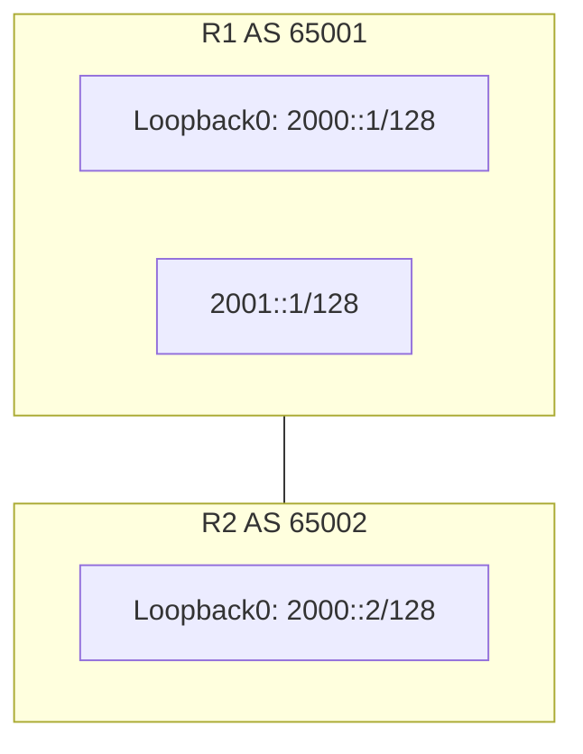
涵盖：第3、11题。

### 母题解题规律（联网核实）
1. **MP_REACH_NLRI 与 MP_UNREACH_NLRI**：IPv6 下传递 BGP 路由时，`MP_REACH_NLRI`（多协议可达 NLRI）负责发布可达路由及其 Next Hop；`MP_UNREACH_NLRI`（多协议不可达 NLRI）负责撤销不可达路由。二者都包含 Next Hop 网络地址字段（长度可变）。（来源：华为 BGP Overview）
2. **带 IPv6 前缀传递时，NLRI 中 AFI=2字节、SAFI=1字节**，Next Hop 场承载对端接收所需的转发地址。
3. **EBGP 下一跳变化**：跨 EBGP 邻居转发 IPv6 路由时，发送方把自己的（用于建立该邻居的）接口 / Loopback 地址写入 Next Hop 字段。本题中 R1 用 Loopback0（2000::1）建立邻居，故 Next Hop 一律设为 2000::1。
4. **发布与撤销的 Next Hop 一致**：无论用 MP_REACH（引入）还是 MP_UNREACH（取消引入），Next Hop 都取 R1 的 Loopback0 地址 2000::1，不受引入/取消影响。
5. 注意 SAFI：单播 IPv4/IPv6 公网地址族均用 SAFI=1（与题21呼应）。

### 分支题目
**第3题（答案：正确）**
**题干：** 如图所示的网络，R1和R2通过Loopback0接口建立EBGP邻接关系。R1将2001::1/128的路由引入BGP，之后又取消引入该路由。则在R1取消路由引入后，R1发送的Update报文中，MP_UNREACH_NLRI的Next Hop字段的取值为2000::1。
**解析：** R1 取消引入 2001::1/128 后，会向对端 R2 发送 Update，其中 MP_UNREACH_NLRI 的 Next Hop 取 R1 建立邻居的 Loopback0 地址 2000::1。正确。

---

**第11题（答案：正确）**
**题干：** 如图所示的网络，R1和R2已通过Loopback0接口建立EBGP邻居关系，R1将2001::1/128的路由引入BGP，则R1发送的update报文中，在MP_REACH_NLRI的Next Hop字段的取值为2000::1。
**解析：** R1 引入 IPv6 路由后，通过 MP_REACH_NLRI 通知邻居可达，并将 Next Hop 字段设置为其 Loopback0 接口地址 2000::1。正确。

---

# 母题11：双节点直连单跳 BFD 故障诊断
涵盖：第45、106题。

### 母题拓扑（mermaid）
```mermaid
graph LR
    R1["R1：10.0.12.1/24，GE0/0/0"] ---|GE0/0/0| R2["R2：10.0.12.2/24"]
```

### 母题解题规则（联网核实）
1. **BFD 单跳用 UDP 端口 4784**：单跳 BFD 控制报文通过 UDP（目标端口 4784）传送。若 IP 层 Ping 通但 BFD 会话仍 Down，优先怀疑中间设备（ACL/防火墙/安全策略）拒绝了 UDP 4784 报文。（来源：Cisco BFD、H3C BFD 白皮书、CSDN BFD 排查）
2. **时间参数可协商**：`min-tx-interval` / `min-rx-interval` 两端设置不一致时可以通过协商解决，最终取两端中的较小值作为实际收发间隔；因此"一方只配置了一侧参数不匹配"不会构成 BFD 会话 Down 的原因。（来源：H3C BFD 白皮书、CSDN）
3. **discriminator 交叉配对**：`discriminator local`/`remote` 必须两端交叉对应（本地 1/远端 2 与对端 2/远端 1），才能成功建立单跳会话。
4. **诊断顺序**：先排除 IP 层连通（Ping）与鉴别器配对问题；若这两项正常，则重点考虑 BFD 控制报文（UDP 4784）被防火墙/ACL 等安全策略过滤。

### 分支题目
**第45题（答案：正确）**
**题干：** 如图所示的网络，R1和R2配置了单跳BFD检测，网络工程师发现BFD会话Down因此查询了R1和R2 BFD相关配置，配置已在图中标出。此外，网络工程师在R1执行了Ping 10.0.12.2的操作输出正常。据此判断，BFD会话Down的可能原因是UDP端口为4784的报文被拒绝通过。
**解析：** Ping 正常 → IP 层连通性没问题；鉴别器配对正确。单跳 BFD 使用 UDP 端口 4784，若中间设备 ACL/防火墙拒绝该端口报文，将导致 BFD 会话 Down。因此 UDP 4784 被拒绝是可能原因。正确。

---

**第106题（答案：错误）**
**题干：** 如图所示的网络，R1和R2配置了单跳BFD检测，网络工程师发现BFD会话Down，因此查询了R1和R2 BFD相关配置，从配置判断，BFD会话Down的原因是R1和R2配置的时间参数不匹配。
**（R1：min-tx 1500 / min-rx 1500；R2 未配置时间参数）**
**解析：** BFD 的时间参数相差不足会 **交涉取最小**，不会因设置不同就 Down。因此"时间参数不匹配导致 Down"这一归因不立。错误。

---

# 母题12：双接口 DHCP 客户端 + 全局地址池选择
涵盖：第79、97题。

### 母题拓扑
```mermaid
graph LR
    R1 ---|GE0/0/0| SW1
    R1 ---|GE0/0/1| SW1
    SW1 ---|GE0/0/0 10.1.1.1/24| R2
```

### 母题解题规则（联网核实）
1. **全局地址池的选择依据**：无中继（直连）场景下，DHCP 服务器根据**收到 DHCP 请求报文接口的 IP 地址所在网段**来选择全局地址池；在所有全局地址池中找出与接口 IP 同网段的池（有多个匹配时可能再按 LPM 最长前缀匹配）。（来源：华为 DHCP FAQ、CSDN DHCP 原理）
2. **无匹配池的下场**：若接口 IP 所在网段与所有全局地址池均不符，则无可用池，客户端**无法取得地址**。（来源：华为 DHCP 文档）
3. 若仅某个全局池匹配，则该池生效，客户端可同池取址。

### 分支题目
**第79题（答案：正确）**
**题干：** 如图所示的网络，R2 GE0/0/0 接口开启 DHCP Server 功能，地址池为全局地址池。R1 GE0/0/0 和 GE0/0/1 接口作为DHCP客户端，缺省情况下，只有一个接口能获取IP地址。
**（R2：GE0/0/0=10.1.1.1/24；pool1=10.1.1.0/24；pool2=10.1.2.0/24，均全局池）**
**解析：** 全局地址池按 R2 接口（10.1.1.1/24）所在网段自动匹配地址池。只有 pool1 与其同网段，故只从 pool1 获取，实际上只有一个接口能取得地址。正确。

---

**第97题（答案：正确）**
**题干：** 如图所示的网络，R2 GE0/0/0 接口开启 DHCP Server 功能，地址池为全局地址池。R1 GE0/0/0 和 GE0/0/1 接口作为DHCP客户端，缺省情况下，R1任何一个接口都不能获取IP地址。
**（R2 GE0/0/0=10.0.12.2/24；pool1=10.1.1.0/24；pool2=10.1.2.0/24，均全局池）**
**解析：** R2 接口 IP=10.0.12.2/24，pool1（10.1.1.0/24）与 pool2（10.1.2.0/24）均与其不同网段，无匹配全局池，故 R1 任一接口均不能获取 IP。正确。

---

# 母题13：CE 双归属 PE 场景的 OSPF PE-CE 路由防环
涵盖：第46、104题。

### 母题拓扑
```mermaid
graph TD
    CE1 ---|EBGP/OSPF| PE1
    PE1 --- P
    P --- PE2
    P --- PE3
    PE2 ---|OSPF| CE2
    PE3 ---|OSPF| CE2
    CE1 --- Site1
    CE2 --- Site2
```
（以 CE2 双归属 PE2/PE3 为核心。）

### 母题解题规则（联网核实）
1. **Type-3 LSA 用 DN 位防环**：PE 将 BGP 路由重分布进 OSPF、生成 Type-3/5/7 LSA 时要置 DN 位。对端 PE 在收到置 DN 位的 LSA 后**不再重分发**进而避免环路（RFC 4577）。（来源：RFC 4577、H3C MPLS L3VPN）
2. **dn-bit-set disable 是反防环**：`dn-bit-set disable` **取消设置 DN 位**，会导致环路防环机制失效，反而更容易产生路由环路，**不是防环命令**。（来源：RFC 4577、华为）
3. **Type-5 / Type-7 用 route-tag（Domain tag）**：CE 双归属、跨 BGP PE 引入 OSPF 5 类 LSA 时，用 `route-tag`（域标签）防环：当收到的 Type-5 路由携带的 Route Tag 与本地配置一致（说明源于同一 PE/同一站点）则忽略该 LSA。（来源：HCIE MPLS L3VPN 练习、华为）
4. **两类机制不可混淆**：**Type-3（区域内部/跨区前缀）防环用 DN 位**；**Type-5/Type-7（外部路由）防环用 Route Tag**，两者不可混用。

### 分支题目
**第46题（答案：正确）**
**题干：** 某企业网络如图所示，若CE2双归属PE2和PE3，有可能产生Type 5 LSA路由环路，可以通过在PE2和PE3设备上设置route-tag命令进行防环，当PE3收到的路由的Route Tag与本地配置一样，则会忽略该路由。
**解析：** 双归属且 OSPF 外部路由（5 类 LSA）在 BGP PE 往返，可使用 route-tag（为被引入 OSPF 的 BGP 路由的 lsa 打 tag），当对端收到相同 Route-Tag 时忽略，从而防环。正确。

---

**第104题（答案：错误）**
**题干：** 某企业网络如图所示，若CE2双归属PE2和PE3，有可能产生Type3 LSA路由环路，可以通过在PE2和PE3设备上设置dn-bit-set disable命令来进行防环。
**解析：** 防 Type-3 LSA 环路的机制是置 **DN 位**（`dn-bit-set`），而非 `dn-bit-set disable`。`dn-bit-set disable` 会**阻止设置 DN 位**，反而可致 CE 回传的 3 类 LSA 不被 PE 识别，从而仍可能环路，**不是防环机制**。错误。

---

> 汇总：**6 组母题共覆盖 17 道判断题**，其余为独立单题。
> - 母题D1（OSPFv3 三节 DR/LSA）：题 10、24、34、81、115（5）
> - 母题D2（双节 EBGP IPv6 MP_REACH/UNREACH Next Hop）：题 3、11（2）
> - 母题D3（IS-IS IPv6 双节）：题 14、18、72、113（4）
> - 母题D4（双节 BFD 故障）：题 45、106（2）
> - 母题D5（DHCP 全局池多客户端）：题 79、97（2）
> - 母题D6（CE 双归属 OSPF PE-CE 防环）：题 46、104（2）

---