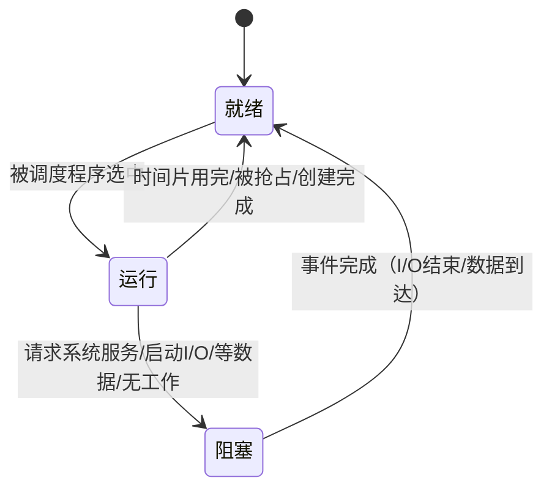

多道程序环境特点:

| 特点       | 说明                                |
| -------- | --------------------------------- |
| **独立性**  | 每个程序逻辑上独立运行，互不干扰                  |
| **随机性**  | 输入/输出、中断发生时刻不可预测                  |
| **资源共享** | CPU、内存、I/O设备等资源被多个程序共享，导致执行速度相互制约 |

资源共享是并发的基础，也是竞态条件（Race Condition）和死锁问题的根源。现代操作系统通过临界区、信号量、管程等机制解决资源竞争。

## 1.进程（Process）

进程是程序（指令 + 数据）关于数据集合上的一次运行活动，是资源分配的基本单位

进程 ≠ 程序。程序是静态的代码文件（存储在磁盘），进程是程序的动态执行实例（驻留内存）。一个程序可对应多个进程（如同时打开多个 Chrome 标签页）

| 特点      | 含义                   |
| ------- | -------------------- |
| **并行性** | 多个进程可在多核 CPU 上真正并行执行 |
| **独立性** | 独立资源分配单元，拥有独立的地址空间   |
| **异步性** | 以不可预知的速度向前推进         |
| **动态性** | 有生命周期（创建 → 执行 → 消亡）  |
| **交往性** | 进程间可能需要通信或同步         |

进程由三部分组成：
- PCB（进程控制块）：内核数据结构，描述进程状态
- 指令（程序段）：可执行代码
- 数据：程序运行所需的数据

扩充：现代操作系统中，进程地址空间通常划分为 代码段（Text）、数据段（Data）、堆（Heap）、栈（Stack）。

### 1.1 进程控制块（PCB, Process Control Block）

PCB是
- 进程的灵魂，是进程存在的唯一标志
- 必须常驻内存（通常在内核空间）
- 运行状态只能通过操作系统读取

扩充：Linux 中 PCB 对应 task_struct 结构体（位于 include/linux/sched.h），非常庞大（数百个字段），包含进程状态、调度信息、文件系统信息、信号处理等

其具体内容包括:

| 类别       | 具体信息                        |
| -------- | --------------------------- |
| **标识信息** | 进程名、进程号（PID）、进程标识符          |
| **调度信息** | 进程优先级、当前状态、资源清单             |
| **通信信息** | 消息队列指针                      |
| **队列信息** | 进程队列指针（用于链接同类状态的进程）         |
| **文件信息** | 打开文件表（文件描述符表）               |
| **现场信息** | PSW（程序状态字）、时钟、界地址寄存器、通用寄存器等 |

PCB的组成方式通常有:

| 方式       | 说明                         |
| -------- | -------------------------- |
| **线性方式** | 所有 PCB 存放在一个数组中，实现简单但查找效率低 |
| **索引方式** | 按状态建立索引表，指向对应 PCB          |
| **链接方式** | 同一状态的 PCB 用链表链接            |
| **队列方式** | 就绪队列、等待队列、运行队列             |

### 1.2 进程控制

通过原语（Primitive）实现对进程生命周期中各种状态转换的控制。

| 原语        | 功能                    |
| --------- | --------------------- |
| **创建原语**  | 为新进程分配资源并初始化          |
| **撤销原语**  | 回收进程占用的全部资源，销毁 PCB    |
| **挂起原语**  | 将进程从内存换出到外存（七状态模型）    |
| **激活原语**  | 将挂起进程从外存换入内存          |
| **阻塞原语**  | 进程因等待某事件而主动放弃 CPU     |
| **唤醒原语**  | 当等待事件完成后，将进程从阻塞态变为就绪态 |
| **改变优先级** | 动态调整进程调度优先级           |

原语是原子操作，执行期间不可被中断，通常通过关中断或锁机制实现

创建进程:
- 申请空白 PCB：从 PCB 池中获取
- 为新进程分配资源：内存、I/O 设备等
- 初始化 PCB：填入标识、状态、优先级等信息
- 插入就绪队列：将新进程置为就绪态，等待调度

| 时机       | 场景                                |
| -------- | --------------------------------- |
| 用户登录     | 系统为用户创建 shell 进程                  |
| 系统初始化    | 启动时创建系统进程（如 init/systemd）         |
| 用户系统调用   | 调用 `fork()` / `CreateProcess()` 等 |
| 初始化批处理作业 | 作业调度程序创建进程执行作业                    |

运行 → 就绪 的三种情况：
- 时间片用完（分时系统）
- 进程创建完成（新进程进入就绪队列，原进程让出 CPU）
- 被调度程序抢占（抢占式调度，高优先级进程到达）
- 注：非抢占式调度下，"运行 → 就绪" 的条件是进程运行结束。

运行 → 阻塞 的四种情况：
- 请求系统服务：如请求分配打印机
- 启动某种操作：如启动 I/O 读写
- 新数据尚未到达：等待网络数据、管道输入等
- 无新工作可做：如消费者等待生产者生产数据

在三状态基础上增加：
- 创建态（New）：PCB 已创建，资源尚未完全分配
- 结束态（Terminated）：进程执行完毕，PCB 尚未回收

如Linux 进程五种状态：
- R（Running/Runnable）：运行或就绪
- S（Interruptible Sleep）：可中断睡眠（阻塞，可被信号唤醒）
- D（Uninterruptible Sleep）：不可中断睡眠（通常等待 I/O，不可被信号唤醒）
- Z（Zombie）：僵尸状态（进程已终止，PCB 等待父进程回收）
- T（Stopped）：停止状态（被信号暂停，如 SIGSTOP）

```mermaid
stateDiagram-v2
    [*] --> 运行就绪_R: 创建进程 (fork)
    
    state 运行就绪_R {
        [*] --> 就绪
        就绪 --> 运行: 调度器选中 (schedule)
        运行 --> 就绪: 时间片用完 (timeslice)
    }
    
    运行就绪_R --> 可中断睡眠_S: 等待事件/锁\n可被信号唤醒
    运行就绪_R --> 不可中断睡眠_D: 等待 I/O 完成\n不可被信号唤醒
    运行就绪_R --> 停止_T: SIGSTOP/SIGTSTP
    运行就绪_R --> 僵尸_Z: exit() 终止\n等待父进程回收
    
    可中断睡眠_S --> 运行就绪_R: 事件完成 / 收到信号
    不可中断睡眠_D --> 运行就绪_R: I/O 完成 (中断唤醒)
    停止_T --> 运行就绪_R: SIGCONT (继续运行)
    僵尸_Z --> [*]: 父进程调用 wait()
    
    note left of 运行就绪_R
        <b>R (Running/Runnable)</b>
        运行态 + 就绪态
        可被调度器切换
    end note
    
    note right of 可中断睡眠_S
        <b>S (Interruptible Sleep)</b>
        可中断的睡眠
        • 等待资源/事件
        • 可被信号唤醒
        • 常见: read()、write()
    end note
    
    note right of 不可中断睡眠_D
        <b>D (Uninterruptible Sleep)</b>
        不可中断睡眠
        • 通常等待 I/O
        • 信号无法唤醒
        • 又称"深度睡眠"
        • 常见: 磁盘 I/O、NFS
    end note
    
    note right of 停止_T
        <b>T (Stopped)</b>
        暂停执行
        • SIGSTOP 暂停
        • SIGCONT 恢复
        • 常见于调试
    end note
    
    note right of 僵尸_Z
        <b>Z (Zombie)</b>
        僵尸状态
        • 进程已终止
        • PCB 残留
        • 等待父进程回收
        • 不占用内存资源
    end note
```

在五状态基础上增加挂起/激活机制：

| 状态               | 说明                       |
| ---------------- | ------------------------ |
| **挂起（Suspend）**  | 进程从内存换出到外存（内 → 外），释放内存资源 |
| **激活（Activate）** | 进程从外存换入内存（外 → 内），恢复执行能力  |

挂起的细分：
- 就绪挂起：进程在外存，只要换入内存即可运行
- 阻塞挂起：进程在外存且等待某事件

扩充：挂起常用于内存交换（Swapping）和调试（如 gdb 的断点挂起）。Linux 中通过 swap 分区或 swapfile 实现

## 2.线程（Thread）

- 进程中的实体，不能独立于进程存在
- CPU 调度和分派的基本单位
- 不同线程可执行相同的程序（如 Web 服务器多个线程处理相同请求逻辑）
- 同一进程中各线程共享内存空间（代码段、数据段、堆、打开的文件等）
- 自己不拥有系统资源，只拥有运行必需的少量资源（寄存器、栈）
- 每个线程有标识符和线程描述表（TCB），记录寄存器和用户栈等现场
- 线程的引入是为了减少并发开销。进程切换需要切换页表、刷新 TLB，开销大；线程切换只需保存/恢复寄存器和栈，开销小得多。

| 特点          | 说明            |
| ----------- | ------------- |
| **花费开销少**   | 创建/销毁线程比进程快得多 |
| **切换花费时间少** | 无需切换地址空间      |
| **内部通信快**   | 共享内存，可直接读写变量  |
| **能独立工作**   | 有独立的执行流和栈     |

现代 CPU 支持超线程（Hyper-Threading）技术，一个物理核心可模拟两个逻辑核心，操作系统将其视为两个独立的调度单元。

### 2.1 POSIX(Portable Operating System Interface,可移植操作系统接口) 线程操作

| 函数               | 含义                |
| ---------------- | ----------------- |
| `pthread_create` | 创建线程              |
| `pthread_exit`   | 结束当前线程            |
| `pthread_join`   | 阻塞等待指定线程退出，回收其资源  |
| `pthread_yield`  | 线程主动让出 CPU，进入就绪队列 |

- pthread_join 类似进程的 wait()，用于同步和资源回收
- pthread_yield 是协作式让出，调度器不保证立即切换
- 还有 pthread_detach（分离线程，退出后自动回收）、pthread_cancel（请求取消线程）等常用操作

## 3.CPU 调度分类

| 调度级别     | 别名   | 功能                     | 频率      |
| -------- | ---- | ---------------------- | ------- |
| **高级调度** | 作业调度 | 决定**哪些作业**可进入内存创建进程    | 最低（分钟级） |
| **中级调度** | 内存调度 | 决定**哪些进程**可调入内存（挂起/激活） | 中等      |
| **低级调度** | 进程调度 | 决定**哪个就绪进程**获得 CPU     | 最高（毫秒级） |

## 4.调度（Scheduling）

功能:
- 记录状态：维护系统中所有进程的执行状态
- 选择进程：从就绪队列中选出下一个执行的进程
- 上下文切换：将选中进程的 PCB 现场信息（PSW、通用寄存器等）装入 CPU 寄存器，使其占用 CPU 执行

| 方式                        | 说明                      |
| ------------------------- | ----------------------- |
| **可抢占式（Preemptive）**      | 高优先级进程到达时，立即抢占当前进程的 CPU |
| **不可抢占式（Non-preemptive）** | 进程执行完毕或主动放弃 CPU 后才进行调度  |

常见调度算法:

| 算法          | 英文   | 特点                                               |
| ----------- | ---- | ------------------------------------------------ |
| **先来先服务**   | FCFS | 按到达顺序执行，简单公平；**不可抢占**；对长作业有利，短作业等待时间长            |
| **最短作业优先**  | SJF  | 优先执行估计运行时间最短的；对长作业不公平（饥饿）                        |
| **轮转法**     | RR   | 按时间片轮流执行；时间片大小影响性能                               |
| **最高响应比优先** | HRRF | 响应比 = (等待时间 + 要求服务时间) / 要求服务时间；兼顾 FCFS 和 SJF 的优点 |
| **多级反馈队列**  | MLFQ | 多个优先级队列，时间片不同；进程可在队列间升降级；最实用                     |

