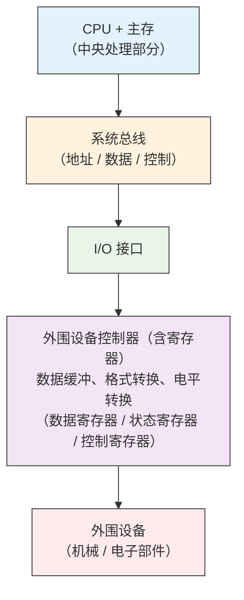

## 1.IO设备管理

按共享属性分类

| 类型       | 特点                             | 典型设备       |
| -------- | ------------------------------ | ---------- |
| **独占设备** | 一段时间内只能被一个进程占用，分配不当可能造成死锁      | 打印机、磁带机、键盘 |
| **共享设备** | 可同时被多个进程交替访问，宏观上共享，微观上串行       | 磁盘、光盘      |
| **虚拟设备** | 通过 SPOOLing 技术将独占设备改造为可共享的逻辑设备 | 虚拟打印机      |

按信息组织方式分类:

| 类型       | 传输单位                   | 特点                  | 典型设备             |
| -------- | ---------------------- | ------------------- | ---------------- |
| **块设备**  | 块（Block，通常 512B ~ 4KB） | 传输速率高、可寻址（随机读写）、有缓冲 | 磁盘、磁带、U盘、SSD     |
| **字符设备** | 字符（Byte）               | 传输速率低、不可寻址、常采用中断驱动  | 键盘、鼠标、显示器、打印机、串口 |

> 块设备支持 DMA 和通道控制，字符设备通常采用中断控制方式。

### 2.I/O 硬件组成

设备控制器：是 CPU 与 I/O 设备之间的接口，负责接收 CPU 命令并控制设备。

控制器内部寄存器：
- 数据寄存器：暂存 CPU 与设备间传输的数据
- 状态寄存器：记录设备当前状态（忙/就绪/错误）
- 控制寄存器：存放 CPU 发来的控制命令

### 3.I/O 设备数据传输控制方式

| 控制方式       | 数据单位 | CPU 干预频率     | 并行性           | 适用场景        |
| ---------- | ---- | ------------ | ------------- | ----------- |
| **程序直接控制** | 字/字节 | 极高（轮询）       | 无             | 简单系统、早期计算机  |
| **中断控制**   | 字/字节 | 每传送完一个数据中断一次 | CPU 与设备部分并行   | 键盘、鼠标等字符设备  |
| **DMA**    | 块    | 仅在开始和结束时干预   | CPU 与设备高度并行   | 磁盘等块设备      |
| **通道控制**   | 块/数组 | 极低（执行通道程序）   | CPU、通道、设备三者并行 | 现代计算机大量数据交换 |

程序直接控制方式（Programmed I/O）:
- 原理：CPU 通过轮询（Polling）不断检查设备状态寄存器，直到设备就绪。
- 特点："忙-等待"（Busy-Waiting），CPU 利用率极低。
- 缺点：CPU 与外设串行工作，严重浪费 CPU 资源。

中断控制方式（Interrupt-driven I/O）
- 原理：设备就绪后主动向 CPU 发中断请求，CPU 只在收到中断时才处理 I/O。
- 优点：实现了主机与外围设备的并行工作，CPU 无需轮询。
- 关键硬件：中断控制器、地址总线、数据总线、设备控制器。
- 适用场景：键盘等以字符为单位的低速设备。
- 缺点：每次传输仍需 CPU 干预，不适合高速批量数据传输。

DMA 方式（Direct Memory Access）
- 原理：DMA 控制器接管总线，直接在设备和主存之间批量传输数据，无需 CPU 逐字干预。
- 特点：
    - "窃取"（Cycle Stealing）总线控制权，在总线空闲时传输。
    - 仅在传输开始和结束时需要 CPU 干预。
- 关键硬件：DMA 控制器、地址总线、数据总线。
- 适用场景：磁盘等块设备的批量存取。
- DMA 控制器组成：内存地址寄存器、字计数器、数据缓冲寄存器、控制/状态寄存器。

通道控制方式（Channel I/O）
- 原理：通道是专门的 I/O 处理机，工作在内存中执行通道程序，实现外围设备统一管理和外设与内存间的数据传输。
- 特点：
    - 所需 CPU 干预更少（只需启动通道）。
    - 可以实现 CPU、通道和 I/O 设备三者并行。
    - 通道指令主要限于与 I/O 操作有关的指令和程序。
- 关键硬件：通道控制器、地址总线、数据总线、设备控制器、通道程序代码（存放在主存中）。
- 适用场景：现代计算机内的大量数据交换。

通道类型:

| 类型         | 工作方式                | 适用设备           |
| ---------- | ------------------- | -------------- |
| **字节多路通道** | 分时为多个设备服务，每次传输一个字节  | 低速字符设备（打印机、终端） |
| **数组多路通道** | 分时为多个设备服务，每次传输一个数据块 | 高速块设备（磁盘）      |
| **数据选择通道** | 独占式为一个设备服务，直到传输完毕   | 高速块设备（磁带）      |

## 4.I/O 软件分层结构

|  层次 | 名称             | 位置   | 功能说明                                    | 示例                                     |
| :-: | :------------- | :--- | :-------------------------------------- | :------------------------------------- |
| 第4层 | 用户层 I/O 软件     | 用户空间 | 提供用户接口、假脱机系统、格式化处理                      | C 标准库 `printf()`、`scanf()`；SPOOLing 系统 |
| 第3层 | 设备无关层（设备独立性软件） | 内核空间 | 统一命名、设备保护、缓冲管理、逻辑块映射、设备分配与释放、出错处理、存储块分配 | 系统调用层                                  |
| 第2层 | 设备驱动程序         | 内核空间 | 与具体硬件交互，设置设备寄存器，转换上层命令为硬件操作             | 磁盘驱动、网卡驱动                              |
| 第1层 | 中断处理程序         | 内核空间 | 响应硬件中断，保存现场，唤醒阻塞进程，完成 I/O 后续处理          | 中断服务例程 ISR                             |

调用关系说明：

|      调用方向     | 流程                                 |
| :-----------: | :--------------------------------- |
| **用户请求 → 硬件** | 用户层 → 设备无关层 → 设备驱动程序 → 中断处理程序 → 硬件 |
| **硬件响应 → 用户** | 硬件 → 中断处理程序 → 设备驱动程序 → 设备无关层 → 用户层 |

设备无关层向上层（设备独立性软件）提供一致的系统调用接口，隐藏硬件差异。

| 功能                 | 说明                                    |
| ------------------ | ------------------------------------- |
| **（1）统一命名**        | 实现**逻辑设备名**与**物理设备名**的转换（通过逻辑设备表 LUT） |
| **（2）设备保护**        | 检查用户是否有权访问设备，防止非法访问                   |
| **（3）缓冲管理**        | 对不同速度的设备使用缓冲区匹配速率，减少中断次数              |
| **（4）提供与设备无关的逻辑块** | 将不同物理设备的块大小统一为逻辑块，屏蔽硬件差异              |
| **（5）独占设备的分配与释放**  | 管理独占设备的申请、分配、回收                       |
| **（6）出错处理**        | 向用户报告 I/O 错误（如设备故障、读写错误）              |
| **（7）存储设备的块分配**    | 管理磁盘等存储设备的空闲块分配                       |

> 设备独立性（Device Independence）指应用程序独立于具体物理设备，使用逻辑设备名请求设备，由系统完成逻辑到物理的映射

## 5.I/O 设备管理

设备表:建立逻辑设备与物理设备之间的对应关系,其结构：
- DCT（设备控制表）：每个设备一张，记录设备类型、标识符、状态、指向 COCT 的指针等。
- COCT（控制器控制表）：每个控制器一张，记录控制器状态、与通道连接的指针等。
- CHCT（通道控制表）：每个通道一张，记录通道状态、等待队列等。
- SDT（系统设备表）：整个系统一张，记录所有设备的情况，是设备分配的起点。
- LUT（逻辑设备表）：实现逻辑设备名到物理设备名的映射。

设备管理任务：
- 缓冲区管理：缓解 CPU 与 I/O 设备速度不匹配的矛盾。
- 设备分配：根据请求分配设备，需考虑：
    - 设备固有属性：独占/共享/虚拟
    - 设备分配算法：先来先服务（FCFS）、优先级高者优先
    - 设备分配安全性：避免死锁（安全分配方式/不安全分配方式）
    - 设备独立性：用户使用逻辑设备名
- 设备处理：启动设备、处理中断、执行 I/O 操作。
- 虚拟设备实现：通过 SPOOLing 技术将独占设备虚拟为共享设备。
- 实现设备独立：用户程序使用逻辑设备名。

引入的关键技术：

| 技术              | 作用                        |
| --------------- | ------------------------- |
| **缓冲技术**        | 解决 CPU 与 I/O 速度不匹配，减少中断次数 |
| **设备分配技术**      | 合理分配设备，提高利用率，避免死锁         |
| **SPOOLing 技术** | 将独占设备改造为虚拟共享设备            |
| **DMA 技术**      | 实现块设备高速数据传输，减少 CPU 干预     |
| **通道技术**        | 实现 I/O 操作的独立处理和并行         |

缓冲技术详解：

| 类型       | 原理                | 特点               |
| -------- | ----------------- | ---------------- |
| **单缓冲**  | 一个缓冲区，CPU 与外设串行访问 | 简单，仍存在等待         |
| **双缓冲**  | 两个缓冲区交替使用         | CPU 与外设可并行，提高利用率 |
| **循环缓冲** | 多个缓冲区组成环形队列       | 适合生产-消费速率不匹配     |
| **缓冲池**  | 系统统一管理多个缓冲区       | 资源共享，动态分配，效率最高   |

缓冲池管理
- 目的：实现进程访问缓冲区的同步。
- 组成（由系统统一管理）：
    - 空闲缓冲区队列（emq）
    - 输入队列（inq）：装满输入数据的缓冲区
    - 输出队列（outq）：装满输出数据的缓冲区
- 工作方式：
    - 收容输入：从设备读入数据到空闲缓冲区
    - 提取输入：从输入队列取数据送用户进程
    - 收容输出：用户进程将数据送入空闲缓冲区，挂到输出队列
    - 提取输出：从输出队列取数据送设备输出
    - 同步问题：使用信号量机制（如 PV 操作）实现进程对缓冲区的互斥访问和同步。

SPOOLing 技术（假脱机技术）：

SPOOLing（Simultaneous Peripheral Operations On-Line）是实现虚拟设备的核心技术  

| 组件                | 功能                |
| ----------------- | ----------------- |
| **输入井 / 输出井**     | 磁盘上的缓冲区，模拟脱机输入/输出 |
| **输入缓冲区 / 输出缓冲区** | 内存中的临时缓冲          |
| **输入进程 / 输出进程**   | 负责数据在内存与磁盘井之间的传输  |
| **井管理程序**         | 管理井中数据的存取         |

工作流程（以打印机为例）
- 用户进程请求打印 → 输出进程将数据写入输出井。
- 用户进程认为打印已完成，继续执行（实际未真正打印）。
- 打印机空闲时，输出进程从输出井取数据真正打印。
- 效果：将独占的打印机虚拟为多台逻辑打印机，多个用户可同时"打印"。

