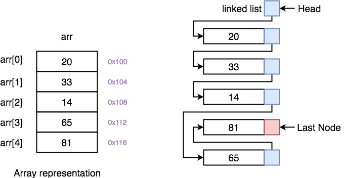

线性表（Linear List）又称线性存储结构，是最简单的一种存储结构，专门用来存储逻辑关系为“一对一”的数据。在一个数据集中，如果每个数据的左侧都有且仅有一个数据和它有关系，数据的右侧也有且仅有一个数据和它有关系，那么这些数据之间就是“一对一“的逻辑关系。

## 1.定义

线性表是具有相同数据类型的 n（n≥0 ）个数据元素的有限序列。
- n 称为表长
- 当 n=0 时，线性表是一个空表
一般表示为：L=(a1,a2,…,an) ，其中 ai  为数据元素，i=1,2,…,n

| 术语       | 含义                                |
| -------- | --------------------------------- |
| **位序**   | $a_i$ 是线性表中的"第 $i$ 个"元素，$i$ 即为其位序 |
| **表头元素** | $a_1$，线性表的第一个元素                   |
| **表尾元素** | $a_n$，线性表的最后一个元素                  |
| **直接前驱** | 除第一个元素外，每个元素有且仅有一个直接前驱            |
| **直接后继** | 除最后一个元素外，每个元素有且仅有一个直接后继           |

> 某一元素的左侧相邻元素称为该元素的“直接前驱”，此元素左侧的所有元素统称为该元素的“前驱元素”；

> 某一元素的右侧相邻元素称为该元素的“直接后继”，此元素右侧的所有元素统称为该元素的“后继元素”；

> 数据元素所占空间一样大（同质性）

> 元素之间有次序（有序性）

> 位序从 1 开始，数组下标从 0 开始 —— 这是贯穿后续代码的核心转换关系

> 思考题：所有的整数按递增次序排列，是线性表吗？答：不是。因为整数集是无限的，不满足线性表"有限序列"的要求。

## 2.分类

- 不破坏数据的前后次序，将它们连续存储在内存空间中，这样的存储方案称为顺序存储结构（简称顺序表）
- 将所有数据分散存储在内存中，数据之间的逻辑关系全靠“链”维系，这样的存储方案称为链式存储结构（简称链表）。

## 3.操作

| 操作                    | 功能              | 记忆归类  |
| --------------------- | --------------- | ----- |
| `InitList(&L)`        | 初始化，分配内存        | **创** |
| `DestroyList(&L)`     | 销毁，释放内存         | **销** |
| `ListInsert(&L,i,e)`  | 第 i 位插入元素 e     | **增** |
| `ListDelete(&L,i,&e)` | 删除第 i 位，e 带回被删值 | **删** |
| `LocateElem(L,e)`     | 按值查找            | **查** |
| `GetElem(L,i)`        | 按位查找            | **查** |

对于顺序表（数组实现）：

| 操作                | 时间复杂度    | 关键点                 |
| ----------------- | -------- | ------------------- |
| 按位查找 `GetElem`    | **O(1)** | 随机存取，直接 `data[i-1]` |
| 按值查找 `LocateElem` | O(n)     | 顺序遍历                |
| 插入 `ListInsert`   | O(n)     | 需移动第 i 位及之后的所有元素    |
| 删除 `ListDelete`   | O(n)     | 需移动第 i 位之后的所有元素     |
| 求表长/判空/输出         | O(1)     | 直接读取 `length`       |

对于链表（指针实现）：

| 操作                | 时间复杂度                       | 关键点               |
| ----------------- | --------------------------- | ----------------- |
| 按位查找 `GetElem`    | O(n)                        | 从头遍历到第 i 个结点      |
| 按值查找 `LocateElem` | O(n)                        | 顺序遍历              |
| 插入 `ListInsert`   | **O(n)** 查找 + **O(1)** 修改指针 | 找到前驱后，只需改两个指针     |
| 删除 `ListDelete`   | **O(n)** 查找 + **O(1)** 修改指针 | 找到前驱后，只需改一个指针     |
| 求表长 `Length`      | O(n)                        | 需遍历计数（除非带尾指针/长度域） |

