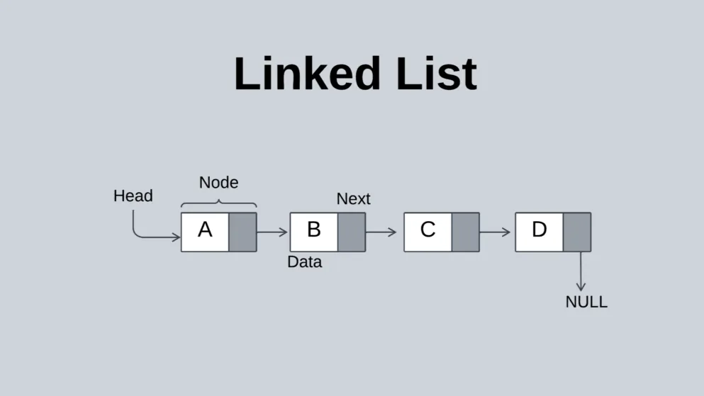
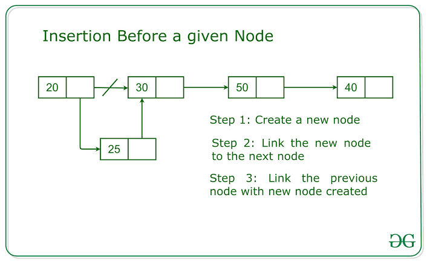
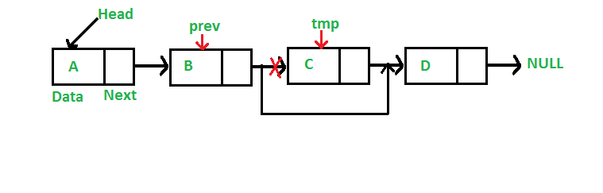

## 1.定义

单链表是链式存储的线性表。每个结点除存放数据元素外，还需存储指向下一个结点的指针。
- 顺序表：逻辑相邻 = 物理相邻，支持随机存取，存储密度高，但需要大片连续空间，扩容不便。
- 单链表：逻辑相邻 ≠ 物理相邻，不需要连续空间，扩容方便，但不支持随机存取，需要额外空间存储指针。



```c
// 定义单链表结点类型
struct LNode {
    ElemType data;          // 数据域
    struct LNode *next;     // 指针域，指向下一个结点
};

// 用 typedef 给数据类型起别名，简化代码
// typedef struct LNode LNode; 之后，可直接用 LNode 代替 struct LNode
typedef struct LNode LNode;
typedef struct LNode *LinkList;

// 申请一个新结点
LNode *p = (LNode *)malloc(sizeof(LNode));
```

| 方式        | 特点                            | 默认 |
| --------- | ----------------------------- | ---- |
| **带头结点**  | 头结点不存储数据，统一空表与非空表操作，方便处理边界    | Y   |
| **不带头结点** | 第一个结点即存储数据，空表判断需单独处理（L==NULL） |      |

初始化过程如下：

```c
bool InitList(LinkList &L) {
    L = (LNode *)malloc(sizeof(LNode));  // 分配头结点
    if (L == NULL)                       // 内存不足，分配失败
        return false;
    L->next = NULL;                      // 头结点之后暂时无结点
    return true;
}
```

## 2.查找

### 2.1 按位查找

GetElem(L, i)获取表 L 中第 i 个位置的结点（i=0 时返回头结点）

```c
LNode *GetElem(LinkList L, int i) {
    if (i < 0) return NULL;     // i 不合法
    LNode *p = L;               // p 指向当前扫描结点
    int j = 0;                  // j 记录当前是第几个结点（头结点为0）
    while (p != NULL && j < i) {
        p = p->next;
        j++;
    }
    return p;                   // 返回第 i 个结点（若 i 过大则返回 NULL）
}
```

时间复杂度为O(n)，因为最坏情况下需要遍历整个链表。最好情况是查找头结点，时间复杂度为O(1)。

### 2.2 按值查找

LocateElem(L, e)查找第一个数据域等于 e 的结点

```c
LNode *LocateElem(LinkList L, ElemType e) {
    LNode *p = L->next;         // 从第1个数据结点开始
    while (p != NULL && p->data != e)
        p = p->next;
    return p;                   // 找到返回该结点，否则返回 NULL
}
```

时间复杂度为O(n)，因为最坏情况下需要遍历整个链表。最好情况是查找第一个结点就找到，时间复杂度为O(1).

## 3.插入

ListInsert(L, i, e)在第 i 个位置插入元素 e（插在结点 i-1 之后）

```c
bool ListInsert(LinkList &L, int i, ElemType e) {
    if (i < 1) return false;            // i 不合法
    LNode *p = GetElem(L, i - 1);       // 找到第 i-1 个结点
    if (p == NULL) return false;        // i 值过大，不合法
    
    LNode *s = (LNode *)malloc(sizeof(LNode));
    s->data = e;
    s->next = p->next;                  // 新结点指向原第 i 个结点
    p->next = s;                        // 第 i-1 个结点指向新结点
    return true;
}
```




在结点 p 之前插入元素：可后插后交换数据（偷天换日），达到 O(1) 效果。

```c
bool InsertPriorNode(LNode *p, ElemType e) {
    if (p == NULL) return false;
    LNode *s = (LNode *)malloc(sizeof(LNode));
    if (s == NULL) return false;
    s->next = p->next;      // s 先连到 p 后面
    p->next = s;
    s->data = p->data;      // 交换数据域
    p->data = e;
    return true;
}
```

## 4.删除

ListDelete(L, i, &e) 删除第 i 个结点，并用 e 返回其值。

```c
bool ListDelete(LinkList &L, int i, ElemType &e) {
    if (i < 1) return false;
    LNode *p = GetElem(L, i - 1);       // 找到第 i-1 个结点
    if (p == NULL) return false;
    if (p->next == NULL) return false;  // 第 i-1 个结点后无结点
    
    LNode *q = p->next;                 // q 指向被删除结点
    e = q->data;                          // 用 e 返回数据
    p->next = q->next;                    // 将 q 从链中"断开"
    free(q);                              // 释放空间
    return true;
}
```



## 5.求表长

```c
int Length(LinkList L) {
    int len = 0;
    LNode *p = L;
    while (p->next != NULL) {
        p = p->next;
        len++;
    }
    return len;
}
```

## 6.单链表的建立

单链表的建立通常有两种方式：头插法和尾插法。

### 6.1 尾插法（正向建立）

每次将新结点插到链表尾部，需维护一个尾指针 r。

```c
LinkList List_TailInsert(LinkList &L) {
    int x;
    // 建立头结点（空壳，不存数据）
    L = (LinkList)malloc(sizeof(LNode));
    
    // r 是"尾巴"，初始指向头结点
    LNode *s, *r = L;
    
    scanf("%d", &x);
    while (x != 9999) {           // 9999 是结束信号
        // 为新数据造一个"数据长度"
        s = (LNode *)malloc(sizeof(LNode));
        s->data = x;              
        
        // 把新数据挂到尾巴后面
        r->next = s;
        
        // 尾指针前移，r 始终指向最后一个结点
        r = s;
        
        scanf("%d", &x);
    }
    
    // 尾巴封口，防止野指针
    r->next = NULL;
    
    return L;
}
```

|       方式      |   每次插入操作   |   n 次总时间  |
| :-----------: | :--------: | :-------: |
| 不用 r，每次从头遍历 | 遍历到尾部 O(n) | **O(n²)** |
| 用 r 直接定位尾部 |  直接插入 O(1) |  **O(n)** |

### 6.2 头插法（逆向建立）

每次新结点都插到头结点之后，输入顺序与链表顺序相反

```c
LinkList List_HeadInsert(LinkList &L) {
    int x;
    // 建立头结点
    L = (LinkList)malloc(sizeof(LNode));
    L->next = NULL;               // 初始为空表（重要！）
    
    scanf("%d", &x);
    while (x != 9999) {
        LNode *s = (LNode *)malloc(sizeof(LNode));
        s->data = x;
        
        // 新结点的 next 指向原来的第一个结点
        s->next = L->next;
        
        // 头结点指向新结点
        L->next = s;
        
        scanf("%d", &x);
    }
    return L;
}
```

|       特性       |     尾插法     |     头插法    |
| :------------: | :---------: | :--------: |
|    **插入位置**    |     链表尾部    |    头结点之后   |
| **输入 vs 输出顺序** |  **相同**（正向） | **相反**（逆向） |
|  **是否需要额外指针**  | 需要 `r`（尾指针） |     不需要    |
|    **时间复杂度**   |     O(n)    |    O(n)    |
|    **空间复杂度**   |  O(1) 额外空间  |  O(1) 额外空间 |
|    **典型应用**    |     按序建表    |  **链表逆置**  |


头插法的经典应用：链表逆置

给定一个链表 1 → 2 → 3 → 4 → NULL，如何原地逆置为 4 → 3 → 2 → 1 → NULL？

```c
LinkList Reverse(LinkList L) {
    LNode *p = L->next;      // p 遍历原链表
    LNode *q;                // q 临时保存 p 的下一个
    
    L->next = NULL;          // 断开头结点，准备重新建表
    
    while (p != NULL) {
        q = p->next;         // 先保存 p 的后继，防止断链
        
        // 把 p 结点用头插法插入到新链表中
        p->next = L->next;   // p 指向新表的第一个结点
        L->next = p;         // 头结点指向 p
        
        p = q;               // p 后移，继续处理下一个
    }
    
    return L;
}

/*
原链表: [头] → [1] → [2] → [3] → [4] → NULL

Step 1: 取 1 头插 → [头] → [1] → NULL
Step 2: 取 2 头插 → [头] → [2] → [1] → NULL
Step 3: 取 3 头插 → [头] → [3] → [2] → [1] → NULL
Step 4: 取 4 头插 → [头] → [4] → [3] → [2] → [1] → NULL
 */
```

| 坑                          | 说明                                               |
| :------------------------- | :----------------------------------------------- |
| **头插法忘记 `L->next = NULL`** | 初始时头结点必须指向 NULL，否则第一个 `s->next = L->next` 会访问野指针 |
| **尾插法忘记 `r->next = NULL`** | 最后一个结点的 next 必须置空，否则遍历链表时会死循环                    |
| **逆置时没保存 `p->next`**       | `p->next = L->next` 会断链，必须先用 `q` 保存原后继           |
| **malloc 返回值不检查**          | 实际工程中应检查 `s == NULL` 的情况                         |


## 7.总结

| 操作                | 时间复杂度 | 说明             |
| ----------------- | ----- | -------------- |
| 按位查找 `GetElem`    | O(n)  | 需顺序遍历          |
| 按值查找 `LocateElem` | O(n)  | 需顺序遍历          |
| 按位插入 `ListInsert` | O(n)  | 查找耗时，插入本身 O(1) |
| 按位删除 `ListDelete` | O(n)  | 查找耗时，删除本身 O(1) |
| 后插/指定结点后删         | O(1)  | 已知前驱结点时        |
| 尾插法建表             | O(n)  | 维护尾指针          |
| 头插法建表             | O(n)  | 每次插在头部         |

|        | 单链表（链式存储）              | 对比：顺序表（顺序存储）     |
| ------ | ---------------------- | ---------------- |
| **优点** | **不要求大片连续空间**，改变容量方便   | 可随机存取，存储密度高      |
| **缺点** | **不可随机存取**，要耗费一定空间存放指针 | 要求大片连续空间，改变容量不方便 |

- 优点：
    - 空间灵活：结点分散在内存各处，不需要像数组那样申请一整块连续空间，动态分配即可。
    - 扩容方便：插入新元素时只需 malloc 一个新结点并修改指针，无需像顺序表那样整体搬迁或重新分配。
- 缺点：
    - 不可随机存取：只能从头结点开始依次遍历，查找第 i 个元素必须逐个移动指针，时间复杂度为 O(n)。
    - 存储密度低：每个结点除了存储数据本身，还需额外存储一个 next 指针，存在结构性开销。
    - 失去顺序表的随机访问优势：无法像数组那样通过 L[i] 直接定位元素。


