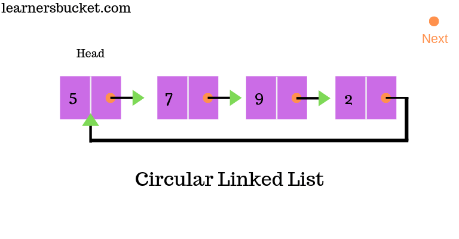
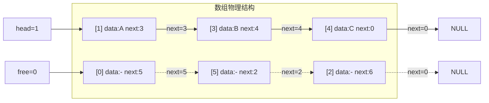
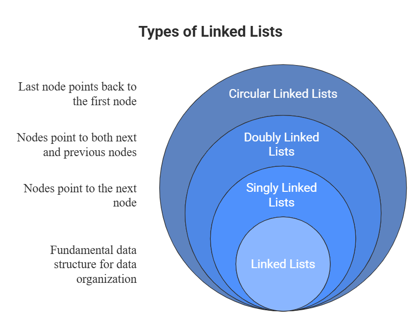

## 1.双链表（Doubly Linked List）

| 特性   | 单链表            | 双链表               |
| ---- | -------------- | ----------------- |
| 方向性  | 只能单向遍历（后继）     | 可前向、可后向遍历         |
| 前驱访问 | 无法直接获取前驱，需从头遍历 | 通过 `prior` 指针直接访问 |
| 存储密度 | 略高（只有一个指针域）    | 略低（两个指针域）         |

```c
typedef struct DNode {
    ElemType data;              // 数据域
    struct DNode *prior, *next; // 前驱、后继指针
} DNode, *DLinklist;
```

初始化过程如下：
```c
bool InitDLinkList(DLinklist &L) {
    L = (DNode *)malloc(sizeof(DNode));
    if (L == NULL) return false;  // 内存不足
    L->prior = NULL;              // 头结点的 prior 永远指向 NULL
    L->next = NULL;               // 初始为空表
    return true;
}
```
### 1.1 插入操作

在结点 *p 之后插入结点 *s

```c
bool InsertNextDNode(DNode *p, DNode *s) {
    if (p == NULL || s == NULL) return false;
    
    s->next = p->next;        // s 的后继指向 p 的原后继
    if (p->next != NULL)      // 若 p 不是表尾，更新原后继的前驱
        p->next->prior = s;
    s->prior = p;             // s 的前驱指向 p
    p->next = s;              // p 的后继指向 s
    return true;
}
```
注意这个顺序不可以改变，否则会导致指针指向错误。

另外对于后插实现前插：
- 双链表可以很方便地实现"前插"：先找到 p 的前驱 q，然后在 q 之后插入。时间复杂度 O(1)（因为 p->prior 直接可得）。
- 单链表的前插必须从头遍历找前驱，时间复杂度 O(n)。

### 1.2 删除操作

删除 *p 的后继结点 *q

```c
bool DeleteNextDNode(DNode *p) {
    if (p == NULL) return false;
    DNode *q = p->next;
    if (q == NULL) return false;  // p 已经是表尾，无后继可删
    
    p->next = q->next;            // p 的后继绕过 q
    if (q->next != NULL)          // 若 q 不是表尾
        q->next->prior = p;       // 更新 q 后继的前驱
    free(q);
    return true;
}
```
如果需要销毁双链表：循环删除头结点的后继，最后释放头结点。

### 1.3 遍历操作

```c
void ListTraverse(DLinklist L) {
    DNode *p = L->next;
    while (p != NULL) {
        printf("%d ", p->data);
        p = p->next;
    }
    printf("\n");
}
``` 

## 2.循环链表（Circular Linked List）

循环链表（Circular Linked List）分为单循环链表（Single Circular Linked List）和双循环链表（Double Circular Linked List）。

### 2.1 单循环链表



与普通单链表的唯一区别：表尾结点的 next 不指向 NULL，而是指向头结点。形成一个"环"，没有明显的终点。

```c
typedef struct LNode {
    ElemType data;
    struct LNode *next;
} LNode, *LinkList;

bool InitList(LinkList &L) {
    L = (LNode *)malloc(sizeof(LNode));
    if (L == NULL) return false;
    L->next = L;          // 头结点 next 指向自己
    return true;
}

// 判空
bool Empty(LinkList L) {
    return (L->next == L);
}

// 判断 p 是否为表尾结点
bool isTail(LinkList L, LNode *p) {
    return (p->next == L);
}
```

| 操作                 | 普通单链表         | 循环单链表    |
| ------------------ | ------------- | -------- |
| 从某结点出发访问**所有**其他结点 | 只能访问后继，无法访问前驱 | 绕一圈可访问全部 |
| 找头结点（已知尾指针）        | O(n)          | O(1)     |
| 找尾结点（已知头指针）        | O(n)          | O(n)     |

在使用循环单链表时，我们使用尾指针表示法
- 通常用头指针 L 指向头结点；可以让 L 指向表尾结点。
- 好处：表尾结点的 next 就是头结点，所以：
    - 找头：L->next → O(1)
    - 找尾：L 本身 → O(1)
- 在频繁进行头插、尾插、头删、尾删的场景下，尾指针表示法效率极高。

### 2.2 双循环链表

表头结点的 prior 指向表尾结点，表尾结点的 next 指向头结点，形成一个双向的环。

```c
bool InitDLinkList(DLinklist &L) {
    L = (DNode *)malloc(sizeof(DNode));
    if (L == NULL) return false;
    L->prior = L;   // 头结点 prior 指向自己
    L->next = L;    // 头结点 next 指向自己
    return true;
}

bool Empty(DLinklist L) {
    return (L->next == L);  // 自己指向自己即为空
}

bool isTail(DLinklist L, DNode *p) {
    return (p->next == L);  // 若 p 的后继指向自己，说明 p 是表尾
}

```

- 在循环双链表中，任意位置插入/删除都不需要判断边界（因为不存在 NULL）。
- 例如后插操作，无需 if (p->next != NULL) 这类判断，代码更简洁。


## 3.静态链表（Static Linked List）

- 单链表：结点离散分布在内存中，通过指针（地址）链接。
- 静态链表：用数组模拟链表，用数组下标（游标）代替指针，适用于不支持指针类型的高级语言（如早期 BASIC、FORTRAN），或需要固定内存池的场景。

分配一整片连续的内存空间（数组）,每个结点包含：data（数据域） + next（游标，存放下一个结点的数组下标）
- 0 号结点充当头结点（数据域通常不存有效数据）。
- 游标为 -1 表示到达表尾（相当于 NULL）。

```c
#define MaxSize 10

// 写法一
typedef struct {
    ElemType data;
    int next;
} SLinkList[MaxSize];   // SLinkList 是"含 MaxSize 个结点的数组"类型

// 写法二（等价）
struct Node {
    ElemType data;
    int next;
};
typedef struct Node SLinkList[MaxSize];

void test() {
    SLinkList a;            // 等价于 struct Node a[MaxSize];
    // a 是一个静态链表
}
```

- 初始化
    - 0 号结点（头结点）的 next 置为 -1。
    剩余空闲结点需要维护一个空闲链表（备用链表），方便分配和回收空间。
- 插入（第 i 个位置）
    - 从空闲链表中取一个结点（分配空间）。
    - 找到第 i-1 个结点（通过游标遍历）。
    - 修改游标：新结点的 next = 前驱结点的 next；前驱结点的 next = 新结点下标。
- 删除（第 i 个位置）
    - 找到第 i-1 个结点，记待删结点下标为 q。   
    - 修改游标：前驱结点的 next = q 的 next。
    - 将 q 结点回收到空闲链表（游标管理，避免"内存泄漏"）。

静态链表的插入、删除不需要移动元素，只需修改游标，时间复杂度仍为 O(n)（主要消耗在查找第 i-1 个结点），体现了链式存储的优势。



数据链：head=1 → A(1) → B(3) → C(4) → NULL

空闲链：free=0 → 空(0) → 空(5) → 空(2)  → NULL

| 概念         | 说明                        |
| ---------- | ------------------------- |
| `next` 字段  | 不是内存地址，而是**数组下标**         |
| `next = 0` | 表示链表结束（相当于传统链表的 `NULL`）   |
| `head`     | 指向数据链的第一个节点下标             |
| `free`     | 指向空闲链的第一个节点下标，插入时从这里"借"节点 |


| 特性       | 单链表      | 双链表       | 循环单链表     | 循环双链表     | 静态链表           |
| -------- | -------- | --------- | --------- | --------- | -------------- |
| **空间**   | 不连续      | 不连续       | 不连续       | 不连续       | **连续**（数组）     |
| **指针域**  | 1个       | 2个        | 1个        | 2个        | 1个游标（int）      |
| **前驱访问** | 不可直接访问   | 可直接访问     | 不可直接访问    | 可直接访问     | 不可直接访问         |
| **遍历终点** | `NULL`   | `NULL`    | 回到头结点     | 回到头结点     | 游标 `-1`        |
| **表尾操作** | 需遍历 O(n) | 需遍历 O(n)  | 尾指针可 O(1) | 尾指针可 O(1) | 需遍历 O(n)       |
| **适用场景** | 通用       | 频繁双向遍历/删除 | 环形结构、调度算法 | 环形结构、双向环  | 无指针支持的语言、固定内存池 |

