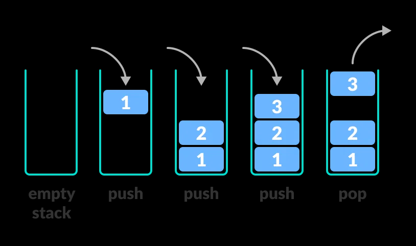

## 1.栈的定义

栈（Stack） 是只允许在一端进行插入或删除操作的线性表,包含:
- 栈顶（Top）：允许进行插入和删除操作的一端
- 栈底（Bottom）：不允许操作的一端
- 空栈：不含任何元素的空表
- 从数据结构三要素看栈：
    - 逻辑结构：线性结构（与线性表相同）
    - 运算（基本操作）：受限的插入删除（只能在一端）
    - 存储结构：顺序存储或链式存储（存储结构不同，运算的实现方式不同）



核心特点:
- 后进先出（LIFO, Last In First Out）
- 生活类比：叠在一起的盘子（只能从最上面拿/放）、烤串（只能从最上面拿/放）等
- 应用：函数调用、表达式求值、撤销操作等

| 操作              | 说明               |
| --------------- | ---------------- |
| `InitStack(&S)` | 初始化栈             |
| `Push(&S, x)`   | 进栈：将元素 x 压入栈顶    |
| `Pop(&S, &x)`   | 出栈：弹出栈顶元素，用 x 返回 |
| `GetTop(S, &x)` | 读栈顶：获取栈顶元素，栈保持不变 |
| `StackEmpty(S)` | 判空：栈空返回 true     |
| `StackFull(S)`  | 判满（顺序栈需要）        |


## 2.顺序栈(Sequential Stack)（顺序存储实现）

使用静态数组存放栈中元素，并设置一个栈顶指针 top 来指向栈顶元素。

```c
#define MaxSize 10          // 定义栈中元素的最大个数

typedef struct {
    ElemType data[MaxSize]; // 静态数组存放栈中元素
    int top;                // 栈顶指针
} SqStack;
```

分配连续的存储空间，大小为 MaxSize * sizeof(ElemType)

初始化栈：

```c
bool InitStack(SqStack &S) {
    S.top = -1;  // 栈顶指针指向栈底
    return true;
}
```

top = -1 表示空栈,此时 top 指向当前栈顶元素(空),我们通常这样判空:

```c
bool StackEmpty(SqStack S) {
    return (S.top == -1);   // 栈空返回 true
}
```

### 2.1 进栈（Push）

```c
bool Push(SqStack &S, ElemType x) {
    if (S.top == MaxSize - 1)   // 栈满，报错
        return false;
    
    S.top = S.top + 1;          // 指针先加 1
    S.data[S.top] = x;          // 新元素入栈
    return true;
}
```

或者简写为:

```c
S.data[++S.top] = x;            // 先 ++，再赋值
```

注意:

```c
S.data[S.top] = x;            // 错误！先赋值到当前 top 位置
S.top = S.top + 1;            // 再移动指针，会覆盖原有栈顶元素
//或
S.data[S.top++] = x;          // 后置++，先使用原值再自增，同样错误
```

### 2.2 出栈（Pop）

```c
bool Pop(SqStack &S, ElemType &x) {
    if (S.top == -1)            // 栈空，报错
        return false;
    
    x = S.data[S.top];          // 栈顶元素先出栈
    S.top = S.top - 1;          // 指针再减 1
    return true;
}
```

或者简写为:

```c
x = S.data[S.top--];            // 先取值，再--
```

### 2.3 读栈顶元素（GetTop）

```c
bool GetTop(SqStack S, ElemType &x) {
    if (S.top == -1)
        return false;
    x = S.data[S.top];          // 只读取，不修改 top
    return true;
}
```

### 2.4 判满（StackFull）

```c
bool StackFull(SqStack S) {
    return (S.top == MaxSize - 1);   // 栈满返回 true
}
```

### 2.5 共享栈/双栈(Share Stack, Double Stack)

两个栈共享同一片数组空间，两个栈顶从数组两端向中间延伸。

```c
#define MaxSize 10

typedef struct {
    ElemType data[MaxSize];
    int top0;           // 0 号栈栈顶指针
    int top1;           // 1 号栈栈顶指针
} ShStack;
```

- 0 号栈：栈底在数组始端，top0 = -1 表示空
- 1 号栈：栈底在数组末端，top1 = MaxSize 表示空
- 判满条件：top0 + 1 == top1（两个栈顶指针相邻）,共享栈提高了空间利用率，只有当两个栈同时满时才会溢出。


## 3.链栈(Link Stack)（链式存储实现）

采用链式存储的栈，本质上是一个只能在一端操作的单链表。

```c
typedef struct Linknode {
    ElemType data;              // 数据域
    struct Linknode *next;      // 指针域
} *LiStack;                     // 栈类型定义
```

| 方式            | 初始化              | 特点                 |
| ------------- | ---------------- | ------------------ |
| **带头结点**      | `S->next = NULL` | 进栈/出栈是对头结点的后插/后删操作 |
| **不带头结点（推荐）** | `S = NULL`       | 代码更简洁，节省一个结点空间     |

| 链栈操作   | 对应单链表操作  | 操作位置      |
| ------ | -------- | --------- |
| **进栈** | 头插法建立单链表 | 在链表头部插入   |
| **出栈** | 删除首元结点   | 删除链表第一个结点 |

初始化链栈：

```c
bool InitStack(LiStack &S) {
    S = NULL;                   // 空栈
    return true;
}
```
S = NULL 表示空栈,此时 S 指向 NULL,我们通常这样判空:

```c
bool StackEmpty(LiStack S) {
    return (S == NULL);   // 栈空返回 true
}
``` 

### 3.1 进栈（Push）

```c
bool Push(LiStack &S, ElemType x) {
    Linknode *p = (Linknode *)malloc(sizeof(Linknode));
    if (p == NULL)              // 内存分配失败
        return false;
    
    p->data = x;
    p->next = S;                // 新结点指向原栈顶
    S = p;                      // 更新栈顶指针
    return true;
}
```

本质就是头插法建立单链表,在链表头部插入新结点,新结点指向原栈顶,栈顶指针指向新结点。

### 3.2 出栈(Pop)

```c
bool Pop(LiStack &S, ElemType &x) {
    if (S == NULL)              // 栈空
        return false;
    
    Linknode *p = S;            // p 指向栈顶结点
    x = p->data;                // 取出栈顶元素
    S = S->next;                // 更新栈顶指针
    free(p);                    // 释放原栈顶结点
    return true;
}
```

### 3.3 读栈顶元素（GetTop）

```c
bool GetTop(LiStack S, ElemType &x) {
    if (S == NULL)
        return false;
    x = S->data;
    return true;
}
```

链栈不需要判满,因为链栈的内存是动态分配的,当栈满时,会自动申请新的内存空间。

| 特性        | 顺序栈                    | 链栈          |
| --------- | ---------------------- | ----------- |
| **存储方式**  | 静态数组（连续）               | 动态链表（离散）    |
| **空间管理**  | 预先分配，可能浪费或溢出           | 动态分配，理论上无上限 |
| **进栈/出栈** | O(1)                   | O(1)        |
| **存取效率**  | O(1)                   | O(1)        |
| **判满**    | 需要（`top == MaxSize-1`） | 不需要         |
| **适用场景**  | 元素数量可预估                | 元素数量变化大     |

## 4.栈的应用

括号匹配：利用栈检查表达式中的括号是否配对：遇到左括号入栈，遇到右括号出栈匹配。

```c
bool MatchMatch(char *expr) {
    LiStack S;
    InitStack(S);
    int i = 0;
    while (expr[i] != '\0') {
        if (expr[i] == '(' || expr[i] == '[' || expr[i] == '{') {
            Push(S, expr[i]);
        } else if (expr[i] == ')' || expr[i] == ']' || expr[i] == '}') {
            if (StackEmpty(S)) {
                return false;
            }
            Pop(S);
        }
        i++;
    }
    return StackEmpty(S);
}
```

递归的非递归实现:系统调用栈的本质就是栈。任何递归算法都可以借助显式栈改写为非递归版本（如 DFS、二叉树遍历）。

进制转换:将十进制数 N 转换为 d 进制：反复 N % d 入栈，然后依次出栈。

```c
bool ConvertToBase(int N, int d, char *str) {
    LiStack S;
    InitStack(S);
    int i = 0;
    while (N != 0) {
        Push(S, N % d);
        N /= d;
    }
    while (!StackEmpty(S)) {
        str[i++] = Pop(S);
    }
    str[i] = '\0';
    return true;
}
```


