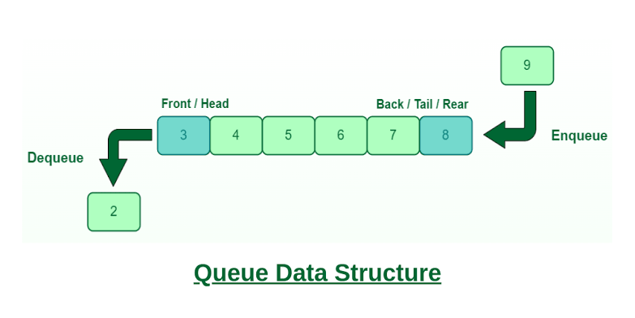

## 1. 队列(queue)的定义和性质

队列是只允许在一端进行插入，在另一端进行删除的线性表（逻辑结构仍为线性结构）。与栈对比：栈只允许在一端进行插入和删除；队列则是"一头进、一头出"。




| 术语            | 含义        | 操作权限         |
| ------------- | --------- | ------------ |
| **队头（Front）** | 队列的最前端    | 允许**删除**（出队） |
| **队尾（Rear）**  | 队列的最末端    | 允许**插入**（入队） |
| **空队列**       | 不含任何元素的队列 | —            |

先进先出（FIFO, First In First Out）
先进入队列的元素先出队，类似于现实生活中的排队买票、食堂打饭。

| 操作                 | 功能                            | 备注   |
| ------------------ | ----------------------------- | ---- |
| `InitQueue(&Q)`    | 初始化队列，构造空队列                   | 创    |
| `DestroyQueue(&Q)` | 销毁队列，释放内存空间                   | 销    |
| `EnQueue(&Q, x)`   | **入队**：若队列未满，将 x 加入队尾         | 增    |
| `DeQueue(&Q, &x)`  | **出队**：若队列非空，删除队头元素并用 x 返回    | 删    |
| `GetHead(Q, &x)`   | **读队头**：若队列非空，将队头元素值赋给 x（不删除） | 查    |
| `QueueEmpty(Q)`    | 判队列是否为空                       | 辅助判断 |

## 2. 队列的顺序实现（循环队列）

顺序队列使用一段连续的存储空间（静态数组）存放元素，并设置队头指针 front 和队尾指针 rear

```c
#define MaxSize 10

typedef struct {
    ElemType data[MaxSize];  // 静态数组存放队列元素
    int front, rear;         // 队头指针和队尾指针
} SqQueue;
```
- front：指向队头元素
- rear：指向队尾元素的后一个位置（下一个应该插入的位置）

初始化队列：
```c
void InitQueue(SqQueue &Q) {
    Q.front = Q.rear = 0;   // 初始时均指向 0
}
```

同样地,初始化条件即为判空条件：`front == rear`

```c
bool QueueEmpty(SqQueue Q) {
    return Q.rear == Q.front;   // 队空条件
}
```

### 2.1 入队(EnQueue)

普通顺序队列存在"假溢出"问题：队尾指针到达数组末尾后，即使数组前端有空闲空间也无法继续入队。

假溢出的原因是front 和 rear 都是单向递增的。出队操作只是把元素"标记为无效"，并没有真正释放数组前端的空间。随着操作进行，整个队列像一列火车一样不断向右"漂移"，最终尾部撞墙。

| 步骤 | 操作  | 队列状态（数组）          | front | rear |
| -- | --- | ----------------- | ----- | ---- |
| 1  | 入 A | `[A, _, _, _, _]` | 0     | 1    |
| 2  | 入 B | `[A, B, _, _, _]` | 0     | 2    |
| 3  | 入 C | `[A, B, C, _, _]` | 0     | 3    |
| 4  | 出 A | `[_, B, C, _, _]` | 1     | 3    |
| 5  | 出 B | `[_, _, C, _, _]` | 2     | 3    |
| 6  | 入 D | `[_, _, C, D, _]` | 2     | 4    |
| 7  | 入 E | `[_, _, C, D, E]` | 2     | 5    |

此时 rear == 5，到达数组末尾。虽然数组前端（索引 0、1）明显空着，但按照普通顺序队列的判断逻辑，队列已满，无法再入队。这就是假溢出（False Overflow）：
- 物理上：数组还有空闲单元
- 逻辑上：队尾指针越界，系统认为已满

循环队列（Circular Queue）：让 rear 到达数组末尾后，绕回索引 0 继续利用空闲空间。这样可以避免假溢出问题，同时利用数组的所有空间。

```c
rear = (rear + 1) % capacity
front = (front + 1) % capacity
```
此时:入队操作为:

```c
bool EnQueue(SqQueue &Q, ElemType x) {
    if (队列已满)               // 见下方队满判断
        return false;
    Q.data[Q.rear] = x;         // 新元素插入队尾
    Q.rear = (Q.rear + 1) % MaxSize;  // 队尾指针加1取模
    return true;
}
```

### 2.2 出队(DeQueue)

```c
bool DeQueue(SqQueue &Q, ElemType &x) {
    if (QueueEmpty(Q))
        return false;
    x = Q.data[Q.front];        // 取出队头元素
    Q.front = (Q.front + 1) % MaxSize; // 队头指针加1取模
    return true;
}
```

### 2.3 判断队列是否满(QueueFull)

我们上面引入了循环队列来解决假溢出的问题,但这也带来了新的问题：如何判断队列是否满？

由于循环队列中队空和队满都是 rear == front，需要额外区分。三种常见方案：

| 方案               | 实现方式                              | 队满条件                            | 队空条件                            | 最多元素数         |
| ---------------- | --------------------------------- | ------------------------------- | ------------------------------- | ------------- |
| **① 牺牲一个单元**     | 约定 `(rear+1)%MaxSize == front` 为满 | `(Q.rear+1)%MaxSize == Q.front` | `Q.rear == Q.front`             | `MaxSize - 1` |
| **② 增设 size 变量** | 记录当前队列长度                          | `Q.size == MaxSize`             | `Q.size == 0`                   | `MaxSize`     |
| **③ 增设 tag 变量**  | 记录最近操作（0=删除，1=插入）                 | `Q.rear == Q.front && tag == 1` | `Q.rear == Q.front && tag == 0` | `MaxSize`     |


### 2.4 读队头(GetHead)

```c
bool GetHead(SqQueue Q, ElemType &x) {
    if (QueueEmpty(Q))
        return false;
    x = Q.data[Q.front];
    return true;
}
```

### 2.5 队长(QueueLength)

```c
// 牺牲一个单元时的长度计算
int QueueLength(SqQueue Q) {
    return (Q.rear - Q.front + MaxSize) % MaxSize;
}
```

这里的(Q.rear - Q.front + MaxSize) % MaxSize 理解为:
- rear 在 front 后面（未绕圈）—— rear >= front,长度直接就是 rear - front
- rear 在 front 前面（已绕圈）—— rear < front,长度是rear - front + MaxSize
- 合并为：(rear + MaxSize - front) % MaxSize 

## 3.队列的链式实现（链队列）

链队列使用链表存储，本质上是一个同时带有头指针和尾指针的单链表。好处是没有队满问题（除非内存耗尽）。

```c
// 链式队列结点
typedef struct LinkNode {
    ElemType data;
    struct LinkNode *next;
} LinkNode;

// 链式队列
typedef struct {
    LinkNode *front, *rear;  // 队头和队尾指针
} LinkQueue;
```

初始化(带头结点的链队列)过程:

```c
void InitQueue(LinkQueue &Q) {
    Q.front = Q.rear = (LinkNode *)malloc(sizeof(LinkNode));
    Q.front->next = NULL;   // 头结点的 next 置空
}
```

这也说明了链队列的判空条件：`Q.front == Q.rear`

```c
bool IsEmpty(LinkQueue Q) {
    return Q.front == Q.rear;   // 或 Q.front->next == NULL
}
```

### 3.1 入队(EnQueue)

使用尾插法即可:

```c
void EnQueue(LinkQueue &Q, ElemType x) {
    LinkNode *s = (LinkNode *)malloc(sizeof(LinkNode));
    s->data = x;
    s->next = NULL;
    Q.rear->next = s;   // 新结点插入到 rear 之后
    Q.rear = s;         // 修改表尾指针
}
```

### 3.2 出队(DeQueue)

```c
bool DeQueue(LinkQueue &Q, ElemType &x) {
    if (IsEmpty(Q)) return false;
    LinkNode *p = Q.front->next;  // p 指向队头元素
    x = p->data;
    Q.front->next = p->next;      // 删除队头结点
    if (Q.rear == p)              // 若原队列只有一个结点，删除后变空
        Q.rear = Q.front;
    free(p);
    return true;
}
```

## 4.双端队列（Deque）

双端队列是只允许从两端插入、两端删除的线性表，是栈和普通队列的推广。

| 数据结构            | 插入位置   | 删除位置    |
| --------------- | ------ | ------- |
| **栈（Stack）**    | 一端     | 同一端     |
| **队列（Queue）**   | 一端（队尾） | 另一端（队头） |
| **双端队列（Deque）** | 两端均可   | 两端均可    |

"从两端插入、两端删除"是特征而非本质,否则就会陷入误区:这有什么意义?难道不是随便一个数组或链表就可以实现吗?

真正的 Deque 核心在于两端都要 O(1)，而普通数组和单链表都做不到这一点。

| 结构                    | 头部操作         | 尾部操作                  | 问题          |
| --------------------- | ------------ | --------------------- | ----------- |
| **普通数组**              | 插入/删除 = O(n) | 插入/删除 = O(n) 或均摊 O(1) | 头部移动所有元素，太慢 |
| **单链表**               | 插入/删除 = O(1) | 插入/删除 = O(n)          | 找尾节点必须遍历，太慢 |
| **动态数组（如 ArrayList）** | 插入/删除 = O(n) | 均摊 O(1)               | 头部仍然是灾难     |

所以双端队列使用循环数组或者双链表实现。
- 循环数组法:用环形数组 + 头尾指针，两端都是真正的 O(1)
- 双链表法:每个节点存 prev 和 next，头尾各一个指针，两头都是 O(1)

考点:给定输入序列 1, 2, 3, 4，判断某输出序列是否能由双端队列得到。
- 栈能实现的序列：双端队列一定能实现（只使用一端即可模拟栈）。
- 队列能实现的序列：双端队列一定能实现（按正常FIFO输出）。
- 核心矛盾：若输出序列中存在形如 ... i ... j ... k ...，且 i < k < j 的"交错"模式，通常需要双端特性才能实现。


