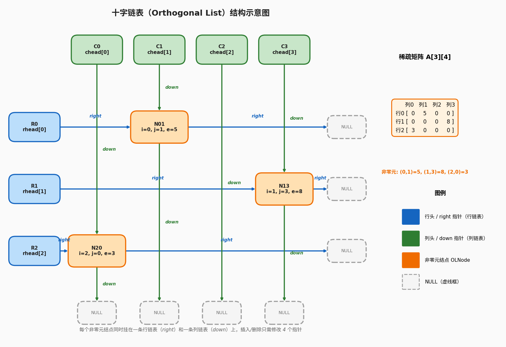

## 1.数组存储结构回顾

一维数组Loc(a[i])=LOC+i×L(0≤i<n)
- L=sizeof(ElemType) 
- 下标默认从 0 开始

二维数组Loc(a[i][j])

| 方式      | 公式                                                             |
| ------- | -------------------------------------------------------------- |
| **行优先** | $\text{Loc}(b[i][j]) = \text{LOC} + (i \times N + j) \times L$ |
| **列优先** | $\text{Loc}(b[i][j]) = \text{LOC} + (j \times M + i) \times L$ |

以下所有特殊矩阵的压缩，默认采用行优先存储

## 2.对称矩阵的压缩存储

n 阶方阵 A ，满足 aij=aji（关于主对角线对称）

```c
        列0  列1  列2  列3
行0  [ a00  a01  a02  a03 ]
行1  [ a01  a11  a12  a13 ]   ← a10 = a01
行2  [ a02  a12  a22  a23 ]   ← a20 = a02, a21 = a12
行3  [ a03  a13  a23  a33 ]
```

只需存储下三角区（含主对角线），或上三角区（含主对角线）,元素总数：1+2+3+⋯+n=n(n+1)/2,用一维数组 B[n(n+1)/2] 存储即可

存下三角，行优先为例:

| 情况                  | 存储位置                                 |
| ------------------- | ------------------------------------ |
| $i \ge j$（下三角及主对角线） | 实际存储到 $B[k]$                         |
| $i < j$（上三角）        | 对称过去取 $a_{ji}$，即查 $B$ 中 $a_{ji}$ 的位置 |

第 0 行到第 i−1 行共有 1+2+⋯+i=i(i+1)/2个元素,第 i 行中 aij是第 j 个,若下标从 1 开始,k=i(i+1)/2+j


## 3.三角矩阵的压缩存储

三角矩阵分为下三角矩阵和上三角矩阵，其中某一块区域元素全为同一常数 c 

```c
[ a00   c    c    c  ]
[ a10  a11   c    c  ]
[ a20  a21  a22   c  ]
[ a30  a31  a32  a33 ]
```

压缩方式：存下三角区 + 最后多一个位置存常数 c ,数组大小：n(n+1)/2+1

下标映射（i≥j ）:k=i(i+1)/2+j（与对称矩阵下三角完全相同）
上三角元素（i< j）：统一取 B[n(n+1) /2]，即最后一个元素 c 。

```c
[ a00  a01  a02  a03 ]
[  c   a11  a12  a13 ]
[  c    c   a22  a23 ]
[  c    c    c   a33 ]
```

压缩方式：存上三角区 + 最后多一个位置存常数 c ,数组大小：n(n+1)/2+1

下标映射（i≥j ）:统一取 B[n(n+1) /2]，即最后一个元素 c 。
上三角元素（i< j）:
- 逐层各自存:第0层存n个元素,第1层存n-1个元素,第2层存n-2个元素,⋯,第i-1层存n-i+1个元素,累计(2n-i+1)i/2个元素
- 第 i 行中，aij是第 (j−i) 个元素（因为该行从 aii开始）
- k=(2n-i+1)i/2+j-i=(n-i-1)/2+j

## 4.三对角矩阵（带状矩阵）

非零元素仅出现在：
- 主对角线（i=j ）
- 上对角线（i=j−1 ，即 j=i+1 ）
- 下对角线（i=j+1 ，即 j=i−1 ）

```c
[ a00  a01   0    0   ]
[ a10  a11  a12   0   ]
[  0   a21  a22  a23  ]
[  0    0   a32  a33  ]
```

压缩思路:将三条对角线上的元素按行优先存入一维数组 B ,非零元素总数：3n−2 （首行和末行各2个，中间每行3个）

下标映射:对于元素 aij,当∣i−j∣≤1 时：k=2i+j
- 前 i 行（第 0  行到第 i−1  行）中：
    - 第 0 行有 2 个元素
    - 第 1 行到第 i−1  行，每行有 3 个元素
    - 前 i 行共有：2+3(i−1)=3i−1  个元素
- 第 i  行中：
    - ai,i−1（下对角线）是第 0 个
    - aii（主对角线）是第 1 个
    - ai,i+1（上对角线）是第 2 个
    - 所以 aij 在第 i 行中是第 (j−(i−1))=j−i+1 个
- k=2i+j

## 5.稀疏矩阵的压缩存储

非零元素个数 s≪m×n（远小于总元素数），且分布无规律

### 5.1 三元组表（顺序存储）

每个非零元素用一个三元组 (i,j,aij) 表示，外加矩阵的行数、列数、非零元个数

```c
#define MAXSIZE 1000

typedef struct {
    int i, j;           // 行号、列号（通常从1开始）
    ElemType e;         // 元素值
} Triple;

typedef struct {
    Triple data[MAXSIZE];
    int mu, nu, tu;     // 行数、列数、非零元个数
} TSMatrix;
```

例如:

```c
[ 0  0  3  0 ]
[ 0  5  0  0 ]
[ 0  0  0  7 ]
```

| i | j | e |
| - | - | - |
| 1 | 3 | 3 |
| 2 | 2 | 5 |
| 3 | 4 | 7 |

优缺点:
- 优点:
    - 节省空间（当 s≪mn  时）
- 缺点：
    - 失去随机存取能力，访问 aij需要顺序查找或二分
    - 矩阵运算（如转置、乘法）需要特殊算法

### 5.2 十字链表（链式存储）

当矩阵非零元位置经常变化（如矩阵加减导致零元变非零、非零元变零）时，三元组表的插入删除效率低，改用十字链表。

本质为:每个非零元结点同时挂在"行链表"和"列链表"上，像十字路口一样纵横交错。
- 行头指针数组 rhead[]：每行一个头指针
- 列头指针数组 chead[]：每列一个头指针


```c
typedef struct OLNode {
    int i, j;               // 行号、列号
    ElemType e;             // 元素值
    struct OLNode *right;   // 同行下一个非零元
    struct OLNode *down;    // 同列下一个非零元
} OLNode, *OLink;
```



优缺点:
- 优点:
    - 灵活处理非零元增减,适合稀疏矩阵的加减运算
        - 插入或删除一个非零元时，只需修改它前后各两个指针（共 4 个），不用像三元组表那样搬移数组元素
    - 随机存取能力好,直接通过指针访问非零元
- 缺点：
    - 空间开销大（每个非零元多两个指针）
    - 矩阵运算（如转置、乘法）需要特殊算法

| 矩阵类型  | 存储对象          | 压缩后大小                  | 核心公式（0开始）                                | 适用场景      |
| ----- | ------------- | ---------------------- | ---------------------------------------- | --------- |
| 对称矩阵  | 下三角+主对角       | $\frac{n(n+1)}{2}$     | $k = \frac{i(i+1)}{2} + j$（$i \ge j$）    | 对称关系数据    |
| 下三角矩阵 | 下三角+主对角 + 常数c | $\frac{n(n+1)}{2} + 1$ | 同上，$i<j$ 时取末尾 $c$                        | 下三角有效数据   |
| 上三角矩阵 | 上三角+主对角 + 常数c | $\frac{n(n+1)}{2} + 1$ | $k = \frac{i(2n-i-1)}{2} + j$（$i \le j$） | 上三角有效数据   |
| 三对角矩阵 | 三条对角线         | $3n - 2$               | $k = 2i + j$（$\|i-j\| \le 1$）            | 带状矩阵、差分方程 |
| 稀疏矩阵  | 非零元三元组        | $s$ 个三元组               | $(i, j, value)$                          | 大规模稀疏数据   |


