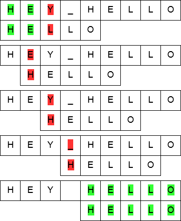

字符串模式匹配是在主串中找到与模式串相同的子串，并返回其所在位置，如：
- Word 文档中的「查找」功能（Ctrl+F）
- 搜索引擎的关键词检索（如百度/Google 搜索）

| 术语               | 含义                 | 特点             |
| ---------------- | ------------------ | -------------- |
| **主串（Text）**     | 被检索的字符串，记为 `S`     | 通常很长           |
| **模式串（Pattern）** | 要在主串中查找的字符串，记为 `T` | 通常较短           |
| **子串**           | 主串中连续的一段字符         | **一定存在**于主串中   |
| **模式串匹配结果**      | 模式串是主串的子串时才成功      | **不一定**能在主串中找到 |

## 1.朴素模式匹配算法（Naive Pattern Matching）（Brute-Force）

暴力枚举，逐个尝试：
- 从主串 S 的第 1 个字符开始，与模式串 T 逐个字符比较；
- 若当前字符相等，则两个指针同时后移，继续比较；
- 若当前字符不等，则主串指针 i 回溯到下一个子串的起始位置，模式串指针 j 回到开头；
    - 假设当前主串指针为 i，模式串指针为 j，说明本轮已经匹配了 j-1 个字符
    - 本轮匹配的起始位置 = i - (j - 1) = i - j + 1
    - 下一轮应从下一个位置开始，即起始位置 +1
    - 新的 i = (i - j + 1) + 1 = i - j + 2，新的 j = 1（模式串指针回溯到开头）
    - 指针回溯公式：i = i - j + 2;  j = 1;
- 复上述过程，直到匹配成功或主串遍历完毕。



朴素模式匹配算法的时间复杂度：`O(n × m)`

| 情况     | 复杂度              | 说明                                               |
| ------ | ---------------- | ------------------------------------------------ |
| **最好** | `O(m)`           | 第一趟第一个字符就不匹配，或第一趟直接成功                            |
| **最坏** | `O((n-m+1) × m)` | 每趟都比较到模式串最后一位才失败。典型案例：`S="aaaaaaab"`, `T="aaab"` |
| **平均** | `O(n × m)`       | 暴力枚举的常规代价                                        |

空间复杂度：`O(1)` —— 仅使用常数个指针变量，无需额外辅助空间。

算法思路简单直接，采用纯粹的暴力穷举，没有利用「已匹配部分」的信息来优化跳跃。每次失配后，主串指针 i 都要回溯，导致大量重复比较。最坏情况下接近 O(n×m)，对于长文本（如 DNA 序列、日志文件）不可接受。

## 2.KMP模式匹配算法（Knuth-Morris-Pratt）

> KMP 算法由 D.E.Knuth、J.H.Morris 和 V.R.Pratt 三人于 1977 年联合提出，因此取三人姓氏首字母命名为 KMP（Knuth-Morris-Pratt）。

在朴素模式匹配中，一旦失配：
- 主串指针 i 回溯到本轮起始位置的下一个位置；
- 模式串指针 j 直接归零回到开头；
- 已匹配成功的字符信息被完全浪费，导致最坏时间复杂度高达 O(n×m)。

KMP 的核心改进：
- 主串指针 i 永不回溯，仅根据模式串自身的结构信息，调整模式串指针 j 的位置。

### 2.1 原理

假设在某次匹配中，主串 S 与模式串 T 的前 j-1 个字符已经成功匹配，但在第 j 个字符处失配：

```
S:  ... [已匹配 j-1 个字符]   X  ...
T:      [已匹配 j-1 个字符]   Y
                             ↑
                             j 失配
```

此时我们已知一个事实：主串中那 j-1 个已匹配的字符，与模式串 T[1..j-1] 是完全相同的。因此，失配后该做什么，完全取决于模式串 T[1..j-1] 自身的结构，与主串 S 无关

如果 T[1..j-1] 中存在相同的前缀和后缀，我们可以直接把模式串向右滑动，让前缀对齐到原来后缀的位置，然后继续比较，而不需要让 i 往回走，下面我们举一个例子：

```
滑动前：
S: ... a b a a b X ...
T:     a b a a b c
                 ↑ 失配

滑动后（让 T 的第一处"ab" 对齐T的第二处中的 "ab"）：
S: ... a b a a b X ...
T:           a b a a b c
                 ↑ 从这里继续比！
```

主串指针 i 始终指着 X 没动过！ 只有模式串 T 在动。我们这就得出KMP 的本质：预先算出模式串每个位置失配时，应该滑到哪里（即 j 跳到哪里），这就是 next 数组。

next[j] 的含义：
- 当模式串的第 j 个字符与主串失配时，模式串指针 j 应该跳回到哪个位置。
- 换句话说，它是一张"失配跳转表"。

对于模式串 T，长度为 m：
- next[1] = 0（固定，记住就行）
- 对于 j ≥ 2：
    - 看子串 T[1] 到 T[j-1]（注意不含 T[j] 本身！）
    - 找出这个子串的最长相等真前后缀
    - next[j] = 该最长相等前后缀的长度 + 1
    - 如果没有相等的前后缀，则 next[j] = 1
- 真前后缀：前缀不能是整个串本身，后缀也不能是整个串本身。也就是说，长度必须小于 j-1。

如：

```c
位置:  1  2  3  4  5  6
字符:  a  b  a  a  b  c
```
- next[1] = 0
- next[2] = 0+1=1(真前缀：无（长度必须 < 1，不存在）,真后缀：无,最长相等前后缀长度 = 0)
- ("ab") next[3] = 0+1=1(真前缀："a",真后缀："b",最长相等前后缀长度 = 0)
- ("aba") next[4] = 1+1=2(真前缀："a,ab",真后缀："a,ba",最长相等前后缀长度 = 1)
- ("abaa") next[5] = 1+1=2(真前缀："a,ab,aba",真后缀："a,aa,baa",最长相等前后缀长度 = 1)
- ("abaab") next[6] = 2+1=3(真前缀："a,ab,aba,abaa",真后缀："b,ab,aab,baab",最长相等前后缀长度 = 2)

所以 next 数组为：`[0, 1, 1, 2, 2, 3]`。
- 第 6 位 c 失配 → j 跳到 next[6] = 3
- 第 5 位 b 失配 → j 跳到 next[5] = 2
- 第 4 位 a 失配 → j 跳到 next[4] = 2
- 第 3 位 a 失配 → j 跳到 next[3] = 1
- 第 2 位 b 失配 → j 跳到 next[2] = 1
- 第 1 位 a 失配 → j 跳到 next[1] = 0（特殊处理：整体右移一位）

我们举个实例观察：
- 主串 S（1-based）：a b a a b a a b c a b a a b c（长度 15）
- 模式串 T：a b a a b c（长度 6）
- next 数组：[0, 1, 1, 2, 2, 3]

```c
第 6 步失配时的局面：
S: a b a a b [a] a b c a b a a b c
              ↑i=6
T: a b a a b [c]
              ↑j=6
```

第 6 位 c 失配 → j 跳到 next[6] = 3,直接比较 S[6] 和 T[3]

```c
S: a b a a b [a] a b c a b a a b c
              ↑i=6
T:       a b [a] a b c
              ↑j=3
```

| 项目            | 复杂度            | 说明                     |
| ------------- | -------------- | ---------------------- |
| **求 next 数组** | `O(m)`         | 模式串自匹配，`j` 只增不减，总体线性   |
| **匹配过程**      | `O(n)`         | 主串指针 `i` 永不回溯，最多遍历一遍主串 |
| **总时间**       | **`O(n + m)`** | 相比朴素的 `O(n×m)` 是质的飞跃   |
| **空间**        | `O(m)`         | 需要额外数组存储 `next`        |


### 2.2 KMP算法（或next数组）的进一步优化：nextval

当 T\[j] == T[next\[j\]] 时，如果 S\[i\] ≠ T\[j\]，那么必然也有 S\[i\] ≠ T\[j\]]，这次比较是冗余的。

例如模式串 T = "aaaab"：

| j        | 1 | 2 | 3 | 4 | 5 |
| -------- | - | - | - | - | - |
| T\[j]    | a | a | a | a | b |
| next\[j] | 0 | 1 | 2 | 3 | 4 |


若 S[i] ≠ T[2]（即 S[i] ≠ 'a'），则 next[2]=1，但 T[1] 也是 'a'，必然仍不匹配，继续跳 next[1]=0。中间步骤浪费

优化规则：
- nextval[1] = 0（默认）
- 若 T\[j\] == T[next\[j\]]，则 nextval\[j\] = nextval[next\[j\]]；
- 否则 nextval\[j\] = next\[j\]

| j               | 1     | 2     | 3     | 4     | 5     |
| --------------- | ----- | ----- | ----- | ----- | ----- |
| T\[j]           | a     | a     | a     | a     | b     |
| next\[j]        | 0     | 1     | 2     | 3     | 4     |
| **nextval\[j]** | **0** | **0** | **0** | **0** | **4** |

在这里，明显有：T\[4\]=T[next\[4\]]=T[3]=T[next[3]]=T[2]=T[next[2]]=T[1],所以有nextval[4]=nextval[3]=nextval[2]=nextval[1]=0


