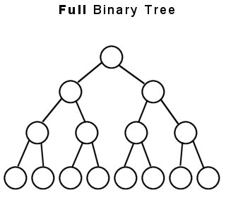
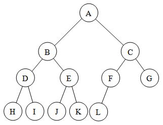
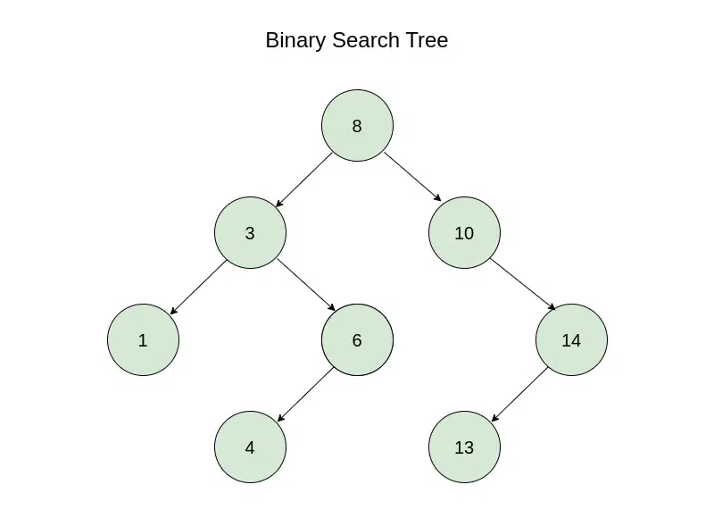
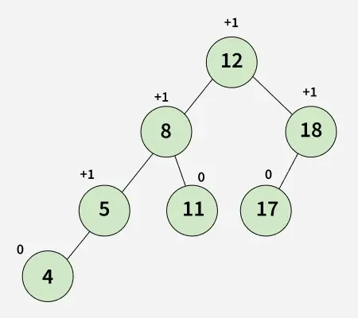

## 1. 二叉树的定义

二叉树是 n (n≥0) 个结点的有限集合：
- 空二叉树：n=0 
- 非空二叉树：由一个根结点和两棵互不相交的、分别称为左子树和右子树的二叉树组成
- 二叉树是递归定义的数据结构。
- 二叉树 ≠ 度为 2 的有序树。
    - 度为 2 的树要求至少有一个结点度为 2；二叉树允许结点度为 0、1、2，甚至为空树。（**度为2的树强调度最大的结点度为2，二叉树强调每一个结点的度上限为2**。）
    - 度为 2 的有序树若某结点只有一个孩子，不区分左右；二叉树必须明确是左孩子还是右孩子。

| 特点       | 说明                          |
| -------- | --------------------------- |
| 结点子树限制 | 每个结点至多只有两棵子树（度 ≤ 2）         |
| 左右有序   | 左子树和右子树**不能颠倒**，二叉树是**有序树** |
| 递归结构   | 左、右子树本身也是二叉树                |

二叉树一般有几种基本形态：空二叉树 (∅)，只有根结点，只有左子树，只有右子树，左右子树都有。

### 1.1 几种特殊的二叉树

#### 满二叉树（Full Binary Tree）

定义：高度为 h ，且恰好含有 2^h−1 个结点的二叉树。这里2^h−1是 (2^h-1)/(2-1)的结果。
- 只有最后一层有叶子结点
- 不存在度为 1 的结点（所有分支结点度均为 2）
- 按层序从 1 开始编号，具有如下性质：
    - 结点 i 的左孩子为 2i ，右孩子为 2i+1 
    - 结点 i 的父结点为 ⌊i/2⌋ （若存在）

####  完全二叉树（Complete Binary Tree）

定义：当且仅当其每个结点都与高度为 h  的满二叉树中编号为 1∼n  的结点一一对应时，称为完全二叉树。
- 有最后两层可能有叶子结点
- 最多只有一个度为 1 的结点
- 编号规则同满二叉树
- 若 i≤⌊n/2⌋ ，则结点 i 为分支结点；若 i>⌊n/2⌋ ，则为叶子结点
- 若某结点只有一个孩子，则一定是左孩子

#### 二叉排序树（BST，Binary Search Tree）

左子树上所有结点的关键字均小于根结点；右子树上所有结点的关键字均大于根结点。左右子树也分别为二叉排序树。

#### 平衡二叉树（AVL，Adelson-Velskyii-Mirzayev Tree，AVL Tree）

任意结点的左、右子树高度差的绝对值不超过 1 的二叉排序树，用于保证查找效率为 O(logn) 

## 2. 二叉树的性质

### 2.1 普通二叉树性质

#### 叶子结点数与二分支结点数的关系

设非空二叉树中度为 0、1、2 的结点个数分别为 n0、n1、n2，则有：
- 结点总数：n=n0+n1+n2
- 总度数 = n−1 （除根外每个结点有一条入边），n=总度数+1=n1+2n2+1
- n0+n1+n2=n1+2n2+1，即 n0=n2+1（叶子结点比度为 2 的结点多 1 个）

#### 第 i 层的最大结点数为 2^（i−1） （i≥1 ）

不做解释，见前一章

#### 高度为 h 的二叉树的结点数范围

| 情况               | 结点数       |
| ---------------- | --------- |
| **至多**（满二叉树）     | $2^h - 1$ |
| **至少**（每层只有一个结点） | $h$       |

### 2.2 完全二叉树性质

#### 具有 n (n>0) 个结点的完全二叉树的高度 h

高为 h  的满二叉树有 2^h−1  个结点；高为 h−1  的满二叉树有2^(h−1) -1个结点,完全二叉树 n 满足：2^(h−1) -1 < n <= 2^h - 1,取对数得 h−1 <= log2n <= h，故 h=⌊log2n⌋+1 

#### 由总结点数 n 推各度结点数

完全二叉树最多只有一个度为 1 的结点，即 n1=1或 n1=0。结合n0=n2+1  可知n0+n2必为奇数

|  总结点数 $n$  | $n_1$ | $n_0$ | $n_2$ |
| :--------: | :---: | :---: | :---: |
|  $2k$（偶数）  |   1   |  $k$  | $k-1$ |
| $2k-1$（奇数） |   0   |  $k$  | $k-1$ |

#### 顺序存储中的下标关系

| 关系          | 公式                               |
| ----------- | -------------------------------- |
| 结点 $i$ 的父结点 | $\lfloor i/2 \rfloor$（$i > 1$ 时） |
| 结点 $i$ 的左孩子 | $2i$（若 $2i \leq n$）              |
| 结点 $i$ 的右孩子 | $2i+1$（若 $2i+1 \leq n$）          |
| 结点 $i$ 的层次  | $\lfloor \log_2 i \rfloor + 1$   |

