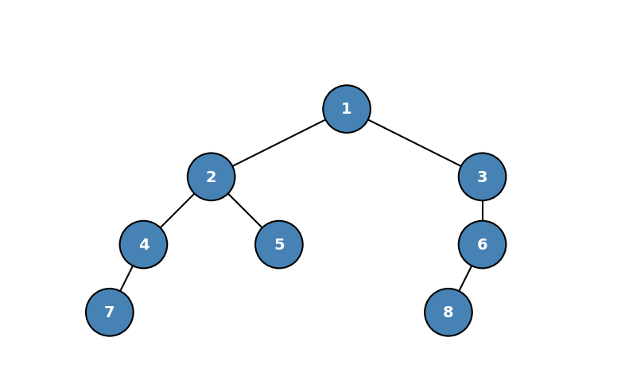

## 1.存储结构

### 1.1 顺序存储

用一组地址连续的存储单元（如一维数组）自上而下、自左至右存储二叉树结点。关键在于结点编号必须与完全二叉树的编号规则严格对应，空结点在数组中需占位。编号映射公式（根结点编号为1）：
- 结点 i 的左孩子编号：2i
- 结点 i 的右孩子编号：2i + 1
- 结点 i 的父结点编号：⌊i / 2⌋ （向下取整）
- 若 2i > n，则结点 i 无左孩子；若 2i+1 > n，则无右孩子。(n为总结点数)

对于高度为 h 且仅有 h 个结点的单支树（例如所有结点均只有右孩子），为了满足编号映射，数组长度仍需达到满二叉树的规模，即至少需要 2^h - 1 个存储单元。空间浪费率 = (2^h - 1 - h) / (2^h - 1)，随 h 增大趋近于 100%。

结论：顺序存储结构仅适用于完全二叉树或满二叉树。对于一般形态的二叉树，链式存储是更优选择。

### 1.2 链式存储结构（二叉链表）

```c
typedef struct BiTNode {
    ElemType data;                    // 数据域
    struct BiTNode *lchild, *rchild;  // 左、右孩子指针
} BiTNode, *BiTree;
```

- 含有 n 个结点的二叉链表共有 2n 个指针域。
- 除根结点外，每个结点有且仅有一个父结点指针指向它，故有效指针数为 n - 1。
- 空指针域数 = 2n - (n - 1) = n + 1。这些空指针是构造线索二叉树的基础。

优点：存储空间与树的结点数线性相关，不受树形形态影响，适用于任意二叉树。

## 2.二叉树的深度优先遍历（递归遍历）

任一非空二叉树可视为根结点（N）、左子树（L）、右子树（R）的递归组合。根据访问根结点的时机，定义三种遍历次序。从根结点出发，沿左子树深入直至空结点，再回溯遍历右子树。模拟该路线，每个结点在递归过程中会被“路过”恰好三次。
- 先序遍历：第一次路过该结点时立即访问。(**根左右**)
- 中序遍历：第二次路过该结点时（即左子树递归返回后）访问。(**左根右**)
- 后序遍历：第三次路过该结点时（即右子树递归返回后）访问。(**左右根**)

### 2.1 先序遍历 (PreOrder) 

- 若树空，则无操作。
- 访问根结点。
- 先序遍历左子树。
- 先序遍历右子树。

```c
void PreOrder(BiTree T) {
    if (T != NULL) {
        visit(T);                 // 第一次路过访问
        PreOrder(T->lchild);
        PreOrder(T->rchild);
    }
}
```


- 根结点 1
- 1 的左子 2、右子 3
- 2 的左子 2、右子 3
- 3 只有右子 6
- 4 的左子 7；6 的左子 8

```c
// c  ro-l-r 
// 层数 根 左 右
c1 ro-l-r ：1 （l）（r）
---
c2 (c1.l) : ro-l-r : 2 （l） 5
c2 (c1.r) : ro-l-r : 3  null (r)
---
c3 (c2.l) : ro-l-r : 4  7 null
c3 (c2.r) : ro-l-r : 6  8 null
---
1 2 4 7 5 3 6 8
```

### 2.2 中序遍历 (InOrder)

- 若树空，则无操作。
- 中序遍历左子树。
- 访问根结点。
- 中序遍历右子树。

```c
void InOrder(BiTree T) {
    if (T != NULL) {
        InOrder(T->lchild);       // 第二次路过时访问
        visit(T);
        InOrder(T->rchild);
    }
}
```


```c
// c  l-ro-r 
// 层数 左 根 右
c1 l-ro-r : (l) 1 (r)
---
c2 (c1.l) : l-ro-r : (l) 2 5
c2 (c1.r) : l-ro-r : null 3 (r)
---
c3 (c2.l) : l-ro-r : 7 4 null
c3 (c2.r) : l-ro-r : 8 6 null   
---
7 4 2 5 1 3 8 6
```

### 2.3 后序遍历 (PostOrder)

- 若树空，则无操作。
- 后序遍历左子树。
- 后序遍历右子树。
- 访问根结点。

```c
void PostOrder(BiTree T) {
    if (T != NULL) {
        PostOrder(T->lchild);
        PostOrder(T->rchild);
        visit(T);                 // 第三次路过访问
    }
}
```


```c
// c  l-r-ro
// 层数 左 右 根
c1 l-r-ro : (l) (r) 1
---
c2 (c1.l) : l-r-ro : (l) 5 2
c2 (c1.r) : l-r-ro : null (r) 3
---
c3 (c2.l) : l-r-ro : 7 null 4
c3 (c2.r) : l-r-ro : 8 null 6
---
7 4 5 2 8 6 3 1
```

## 3.二叉树的宽度(广度)优先遍历（层序遍历）

- 初始化一个辅助队列。
- 将根结点入队。
- 循环执行以下操作，直至队列为空：
    - 队头结点出队，并访问该结点。  
    - 若该结点存在左孩子，则将左孩子入队。
    - 若该结点存在右孩子，则将右孩子入队。

```c
typedef struct LinkNode {
    BiTNode *data;        // 存储的是二叉树结点指针，而非数据域
    struct LinkNode *next;
} LinkNode;

typedef struct {
    LinkNode *front, *rear;
} LinkQueue;

void LevelOrder(BiTree T) {
    LinkQueue Q;
    InitQueue(Q);
    BiTree p;
    EnQueue(Q, T);                // 根结点入队
    while (!IsEmpty(Q)) {
        DeQueue(Q, p);            // 队头出队
        visit(p);
        if (p->lchild != NULL)
            EnQueue(Q, p->lchild);
        if (p->rchild != NULL)
            EnQueue(Q, p->rchild);
    }
}
```


```c
// r 队尾 f 队头
r--null--f
1入队 r--1--f
1出队 r--null--f,累计出队1
1的左右孩子2、3入队 r--3-2--f
2出队 r--3--f,累计出队1-2
2的左右孩子4、5入队 r--5-4-3--f
3出队 r--5-4--f,累计出队1-2-3
3的右子6入队 r--6-5-4--f
4出队 r--6-5--f,累计出队1-2-3-4
4的左子7入队 r--7-6-5--f
5出队 r--7-6--f,累计出队1-2-3-4-5
5没有左右子，不入队，6出队 r--7--f,累计出队1-2-3-4-5-6
6的左子8入队 r--8-7--f
7出队 r--8--f,累计出队1-2-3-4-5-6-7
8出队 r--null--f,累计出队1-2-3-4-5-6-7-8
```
引入辅助队列的意义是保证层序遍历的顺序。其原理是：层序遍历不是递归结构（不像前/中/后序遍历有天然的递归定义），而是基于广度优先（BFS）的。队列使得我们不需要回溯父节点来寻找下一个该访问的节点——队列头部始终指向"下一个该访问的节点"，实现了遍历指针的线性推进。
- 访问当前节点时，将其左子节点、右子节点依次入队
- 由于队列 FIFO 的特性，先被访问的节点的子节点一定排在后面被访问节点的子节点前面
- 这保证了第 k 层的所有节点一定在第 k+1 层任何节点之前被处理

时间复杂度与空间复杂度：均为 O(n)（n 为结点数），最坏空间复杂度 O(n)（满二叉树最底层队列规模）

## 4.由遍历序列构造（还原）二叉树

若已知中序遍历序列，再附带先序、后序或层序中的任意一种，即可唯一确定一棵二叉树。（中序序列负责划分左右子树区间；先序/后序/层序负责确定当前子树的根结点）
- 仅知先序序列或仅知层序序列，可对应多种二叉树形态。
- 仅知先序 + 后序（缺少中序），通常无法唯一确定（除非树为满二叉树）

对于时间复杂度，
- 若每次在中序序列中查找根结点采用线性扫描，则时间复杂度为 O(n^2)。
- 若使用哈希表预处理中序序列中元素的下标（值 -> 索引），则每次查找为 O(1)，整体时间复杂度可优化至 O(n)。

### 4.1 基于前、中序序列构造二叉树

- 前序序列的第一个元素为当前子树的根结点。
- 在中序序列中定位该根结点，左侧所有元素构成左子树的中序序列，右侧构成右子树的中序序列。
- 根据左、右子树中序序列的长度，在前序序列中划分出对应的左、右子树前序序列（紧跟在根之后，按长度切分）。
- 对左、右子树递归执行上述步骤，直至序列为空。


| 遍历方式              | 结果                                |
| ----------------- | --------------------------------- |
| **前序**（根 → 左 → 右） | **1 → 2 → 4 → 7 → 5 → 3 → 6 → 8** |
| **中序**（左 → 根 → 右） | **7 → 4 → 2 → 5 → 1 → 3 → 8 → 6** |
| **后序**（左 → 右 → 根） | **7 → 4 → 5 → 2 → 8 → 6 → 3 → 1** |

如上图、表，前、中序序列为：
- 前序：1 2 4 7 5 3 6 8
- 中序：7 4 2 5 1 3 8 6

```c
root = 1
--- 
(7 4 2 5) 1 (3 8 6)
----
(7 4 2 5) in "1 2 4 7 5 3 6 8" = (2 4 7 5)
root(7 4 2 5)=2
(7 4) 2 (5)
--
(3 8 6) in "1 2 4 7 5 3 6 8" = (3 6 8)
root(3 8 6)=3
(null) 3 (8 6)
----
...如此往返就可以还原二叉树结构了
```

### 4.2 基于后、中序序列构造二叉树

- 后序序列的最后一个元素为当前子树的根结点。
- 在中序序列中定位该根结点，划分左、右子树的中序序列。
- 根据左、右子树中序序列的长度，在后序序列的前半部分切分出对应的左、右子树后序序列（左子树在前，右子树在后，二者连续）。
- 递归构造左右子树。

### 4.3 基于中序、层序序列构造二叉树

- 层序序列的第一个元素为整个树的根结点。
- 在中序序列中定位根结点，划分左、右子树的中序序列。
- 遍历层序序列中除去根结点的剩余部分，将元素分别归类到左子树集合和右子树集合（保持它们在层序中的相对顺序），得到左、右子树的层序序列。
- 递归构造左右子树。


| 遍历方式              | 结果                                |
| ----------------- | --------------------------------- |
| **中序**（左 → 根 → 右） | **7 → 4 → 2 → 5 → 1 → 3 → 8 → 6** |
| **层序**（从上到下，从左到右） | **1 → 2 → 3 → 4 → 5 → 6 → 7 → 8** |

如上图、表,中、层序序列为：
- 中序：7 4 2 5 1 3 8 6
- 层序：1 2 3 4 5 6 7 8

```c
root = 1
----
(7 4 2 5) 1 (3 8 6)
层序(左)：7 4 2 5 ---> 2 4 5 7
层序(右)：3 8 6 ---> 3 6 8 
得到第二层子树的root分别为2,3
---
以此类推
```


