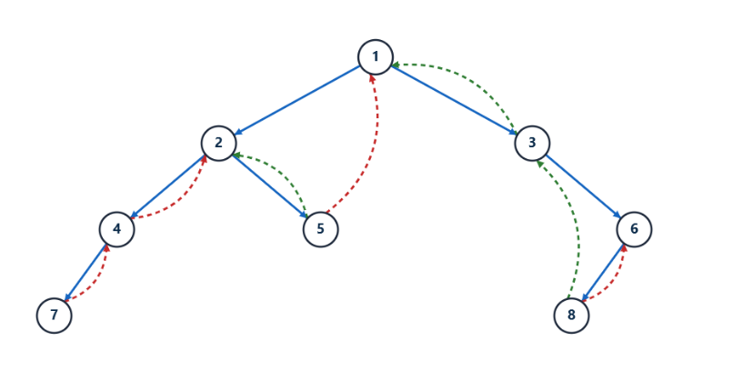
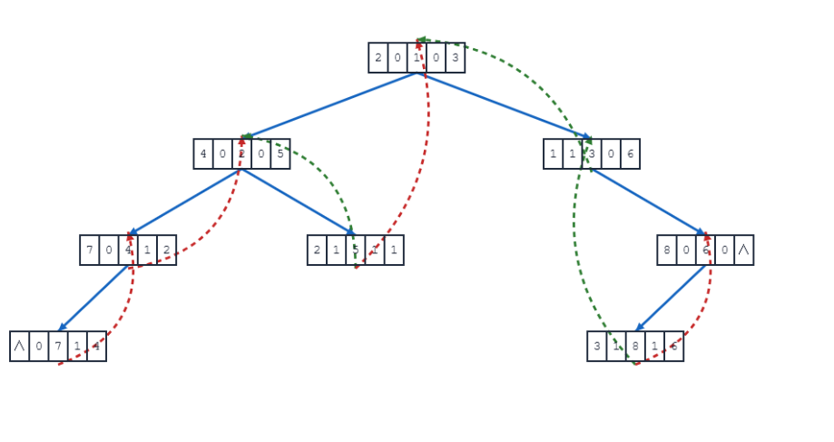
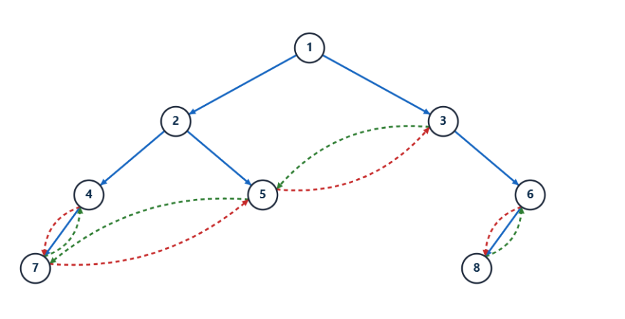
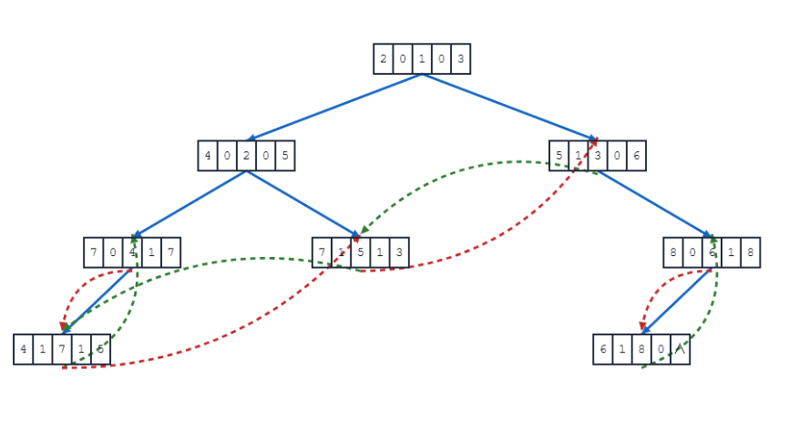
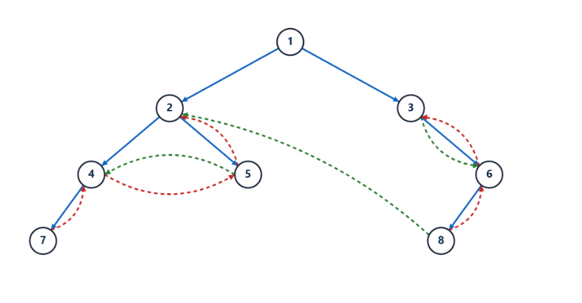
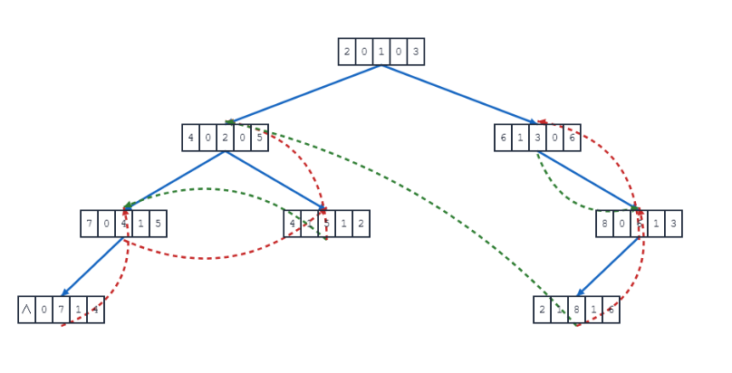
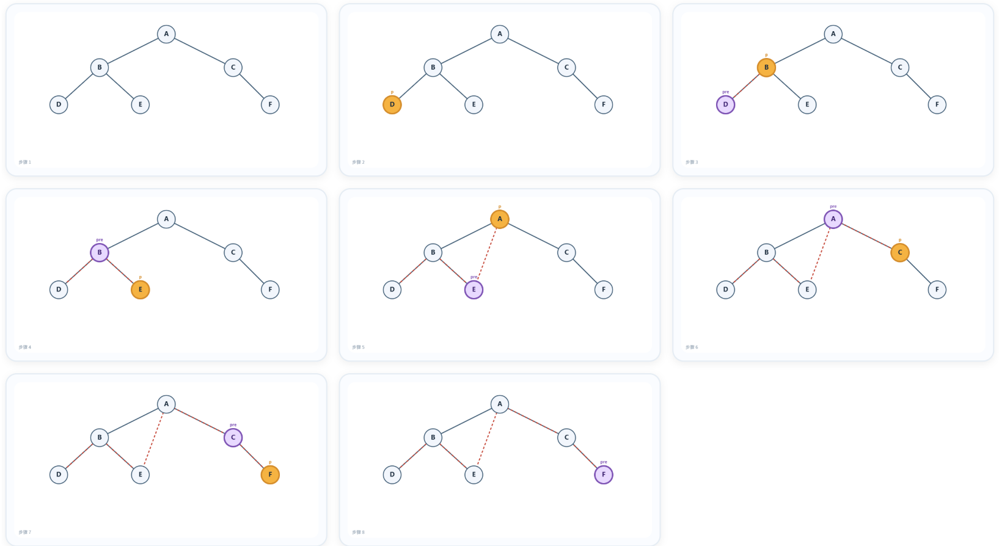
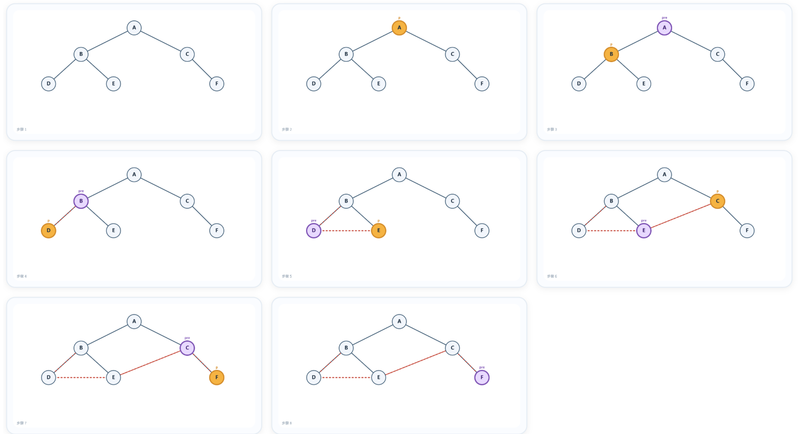
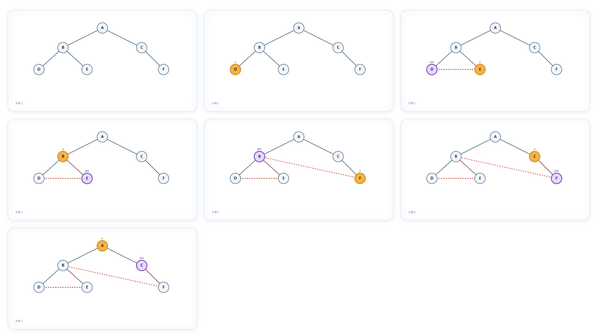

## 1.线索二叉树（Threaded Binary Tree）

### 1.1 定义和性质

n 个结点的二叉链表共有 2n 个指针域，其中只有 n-1 个用于指向孩子(理由是，除了根节点外所有结点都有一个父节点)，剩余 n+1 个指针域为空。
- 线索化：利用这些空指针域，存储结点在某一遍历序列中的前驱和后继信息。
- 线索：指向前驱或后继的指针称为线索。
- 线索二叉树：在二叉链表的基础上，利用线索域，实现快速遍历。

线索二叉树的优势：
- 快速从一个指定结点出发，找到其前驱/后继；
- 实现遍历的非递归化，空间复杂度降至 O(1)；
- 方便从任一结点出发进行遍历，无需从根开始。

### 1.2 实现

在二叉链表基础上增加两个标志位 ltag 和 rtag，分别表示左子树和右子树是否为线索。

```c
typedef struct ThreadNode {
    ElemType data;
    struct ThreadNode *lchild, *rchild;
    int ltag, rtag;      // 左右线索标志
} ThreadNode, *ThreadTree;
```

|   标志位  |  值  | 含义                  |
| :----: | :-: | :------------------ |
| `ltag` |  0  | `lchild` 指向**左孩子**  |
| `ltag` |  1  | `lchild` 指向**前驱线索** |
| `rtag` |  0  | `rchild` 指向**右孩子**  |
| `rtag` |  1  | `rchild` 指向**后继线索** |

其意义在于拯救了浪费掉的空指针域，将所有 lchild==NULL 的指针连向遍历序列中的前驱；将所有 rchild==NULL 的指针连向遍历序列中的后继。

| 类型          | 线索指向           |
| :---------- | :------------- |
| **中序线索二叉树** | 中序遍历序列的前驱 / 后继 |
| **先序线索二叉树** | 先序遍历序列的前驱 / 后继 |
| **后序线索二叉树** | 后序遍历序列的前驱 / 后继 |

### 1.3 计算（手算）

- 确定类型：中序 / 先序 / 后序；
- 写出遍历序列，给每个结点标注访问顺序；
- 找空链域：将所有 lchild==NULL 的指针连向遍历序列中的前驱；将所有 rchild==NULL 的指针连向遍历序列中的后继；
- 修改 tag：被用作线索的指针，对应 ltag 或 rtag 置为 1。

依旧以我们的老朋友为例：


| 遍历方式              | 结果                                |
| ----------------- | --------------------------------- |
| **前序**（根 → 左 → 右） | **1 → 2 → 4 → 7 → 5 → 3 → 6 → 8** |
| **中序**（左 → 根 → 右） | **7 → 4 → 2 → 5 → 1 → 3 → 8 → 6** |
| **后序**（左 → 右 → 根） | **7 → 4 → 5 → 2 → 8 → 6 → 3 → 1** |

#### 1.3.1 中序线索二叉树

中序：7 → 4 → 2 → 5 → 1 → 3 → 8 → 6

对于叶子结点：
- 7前驱无，后继为4
- 5前驱为2，后驱为1
- 8前驱为3，后继为6

对于度为1的结点：
- 4的后继为2
- 3的前驱为1
- 6的后继为无



（上图中少画了2个null请注意，分别是7的前驱线索和6的后继线索）

储存结构示意图如下：



#### 1.3.2 先序线索二叉树

先序：1 → 2 → 4 → 7 → 5 → 3 → 6 → 8

对于叶子结点：
- 7前驱4，后继为5
- 5前驱为7，后驱为3
- 8前驱为6，后继为无

对于度为1的结点：
- 4的后继为7
- 3的前驱为5
- 6的后继为8



（上图中少画了1个null请注意，是8的后继线索）

储存结构示意图如下：



#### 1.3.3 后序线索二叉树

后序：7 → 4 → 5 → 2 → 8 → 6 → 3 → 1

对于叶子结点：
- 7前驱空，后继为4
- 5前驱为4，后驱为2
- 8前驱为2，后继为6

对于度为1的结点：
- 4的后继为5
- 3的前驱为6
- 6的后继为3



（上图中少画了1个null请注意，是7的前驱线索）

储存结构示意图如下：



## 2.二叉树的线索化算法

核心思想：改造递归遍历算法，在访问结点时建立线索。使用全局指针 pre 记录当前访问结点的前驱。
- pre 永远指着刚才路过的那个结点。
- 当前结点 p 是现在访问的结点。

我们使用“牵线”作喻：
- 如果 p 左边是空的，就把线拴到 pre 身上（p->lchild = pre）。
- 如果 pre 右边是空的，就把线从 pre 牵到 p 身上（pre->rchild = p）。
- 这就像是你走在一条路上，每遇到一个新结点，就回头和上一个结点手拉手

### 2.1 中序线索化算法

```c
ThreadNode *pre = NULL;   // 全局变量，指向当前访问结点的前驱

// 中序线索化（左根右）
void InThread(ThreadTree p) {
    if (p != NULL) {
        InThread(p->lchild);    // 线索化左子树
        
        // --- visit(p)：建立线索 ---
        if (p->lchild == NULL) {        // 左子树为空，建立前驱线索
            p->lchild = pre;
            p->ltag = 1;
        }


        if (pre != NULL && pre->rchild == NULL) {  // 建立pre的后继线索
            pre->rchild = p;
            pre->rtag = 1;
        }
        pre = p;                // pre后移
        
        InThread(p->rchild);    // 线索化右子树
    }
}

// 封装入口
void CreateInThread(ThreadTree T) {
    pre = NULL;
    if (T != NULL) {
        InThread(T);
        // 处理最后一个结点：中序最后一个结点的右孩子必为空
        pre->rtag = 1;          // （教材中有时显式置 pre->rchild = NULL）
    }
}
```

或者使用使用引用参数，避免全局变量

```c
void InThread(ThreadTree p, ThreadTree &pre) {
    if (p != NULL) {
        InThread(p->lchild, pre);
        if (p->lchild == NULL) {
            p->lchild = pre; p->ltag = 1;
        }
        if (pre != NULL && pre->rchild == NULL) {
            pre->rchild = p; pre->rtag = 1;
        }
        pre = p;
        InThread(p->rchild, pre);
    }
}

void CreateInThread(ThreadTree T) {
    ThreadTree pre = NULL;
    if (T != NULL) {
        InThread(T, pre);
        pre->rchild = NULL;   // 最后一个结点后继为空
        pre->rtag = 1;
    }
}
```

### 2.2 先序线索化算法

```c
void PreThread(ThreadTree p) {
    if (p != NULL) {
        // --- visit(p)：先处理根 ---
        if (p->lchild == NULL) {
            p->lchild = pre; p->ltag = 1;
        }
        if (pre != NULL && pre->rchild == NULL) {
            pre->rchild = p; pre->rtag = 1;
        }
        pre = p;
        
        // 必须先判断 ltag，防止死循环！
        if (p->ltag == 0)        // 左孩子不是线索，才递归
            PreThread(p->lchild);
        if (p->rtag == 0)        // 右孩子不是线索，才递归
            PreThread(p->rchild);
    }
}
```

这里需要注意：
- 处理根时，如果左孩子为空，就把 p->lchild 指向 pre（前驱）。
- 然后递归进入左子树时，如果没有判断 ltag，程序会误把刚刚指向 pre 的线索当作真正的左孩子，又回到 pre。
- 结果就是 A → B → A → B…… 绕圈圈，栈溢出。

### 2.3 后序线索化算法

```c
void PostThread(ThreadTree p) {
    if (p != NULL) {
        PostThread(p->lchild);
        PostThread(p->rchild);
        
        // --- visit(p)：左右根 ---
        if (p->lchild == NULL) {
            p->lchild = pre; p->ltag = 1;
        }
        if (pre != NULL && pre->rchild == NULL) {
            pre->rchild = p; pre->rtag = 1;
        }
        pre = p;
    }
}
```

### 2.4 关于线索化算法直观的演示

本章res目录下我建立了一个演示程序：[线索化算法演示](res/线索化算法演示.html)

步骤截图如下：（以中序、先序、后序线索化为例）






## 3.在线索二叉树中找前驱/后继

### 3.1 中序线索二叉树 

- 找中序后继
    - 若 p->rtag == 1：后继为 p->rchild
    - 若 p->rtag == 0：p 必有右孩子，后继 = 右子树中最左下结点
- 找中序前驱
    - 若 p->ltag == 1：前驱为 p->lchild
    - 若 p->ltag == 0：p 必有左孩子，前驱 = 左子树中最右下结点

> 这里很好理解，因为中序遍历的顺序是：左根右，对于一棵线索二叉树，左子树的右下结点一定是根结点的前驱，右子树的左下结点一定是根结点的后继。

```c
// 找到以p为根的子树中，第一个被中序遍历的结点（最左下）
ThreadNode* Firstnode(ThreadNode *p) {
    while (p->ltag == 0) p = p->lchild;
    return p;
}

// 找p的中序后继
ThreadNode* Nextnode(ThreadNode *p) {
    if (p->rtag == 0) return Firstnode(p->rchild);
    else return p->rchild;
}

// 找到以p为根的子树中，最后一个被中序遍历的结点（最右下）
ThreadNode* Lastnode(ThreadNode *p) {
    while (p->rtag == 0) p = p->rchild;
    return p;
}

// 找p的中序前驱
ThreadNode* Prenode(ThreadNode *p) {
    if (p->ltag == 0) return Lastnode(p->lchild);
    else return p->lchild;
}
```

利用线索实现非递归中序遍历（空间 O(1)）

```c
void Inorder(ThreadNode *T) {
    for (ThreadNode *p = Firstnode(T); p != NULL; p = Nextnode(p))
        visit(p);
}
```

### 3.2 先序线索二叉树 

- 找先序后继
    - 若 p->rtag == 1：后继为 p->rchild
    - 若 p->rtag == 0：p 必有右孩子
    - 若 p 有左孩子 → 后继为左孩子
    - 若 p 没有左孩子 → 后继为右孩子
- 找先序前驱
    - 若 p->ltag == 1：前驱为 p->lchild
    - 若 p->ltag == 0：p 必有左孩子，无法直接找到先序前驱（先序中左右子树结点都是根的后继，不可能是根的前驱）


解决方案（需三叉链表 / 父指针）：
- p 是左孩子 → 父结点即为前驱
- p 是右孩子，且左兄弟为空 → 父结点即为前驱
- p 是右孩子，且左兄弟非空 → 前驱为左兄弟子树中最后一个被先序遍历的结点
- p 是根结点 → 没有先序前驱

### 3.3 后序线索二叉树 

- 找后序前驱
    - 若 p->ltag == 1：前驱为 p->lchild
    - 若 p->ltag == 0：p 必有左孩子
    - 若 p 有右孩子 → 前驱为右孩子
    - 若 p 没有右孩子 → 前驱为左孩子
- 找后序后继
    - 若 p->rtag == 1：后继为 p->rchild
    - 若 p->rtag == 0：p 必有右孩子，无法直接找到后序后继（后序中左右子树结点都是根的前驱，不可能是根的后继）

解决方案（需三叉链表 / 父指针）：
- p 是右孩子 → 父结点即为后继
- p 是左孩子，且右兄弟为空 → 父结点即为后继
- p 是左孩子，且右兄弟非空 → 后继为右兄弟子树中第一个被后序遍历的结点
- p 是根结点 → 没有后序后继


