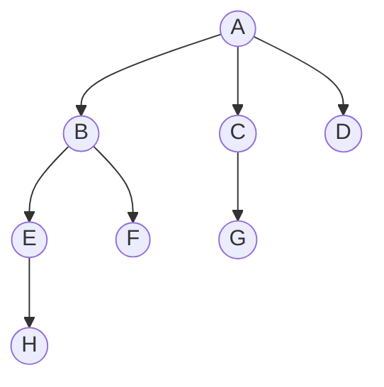
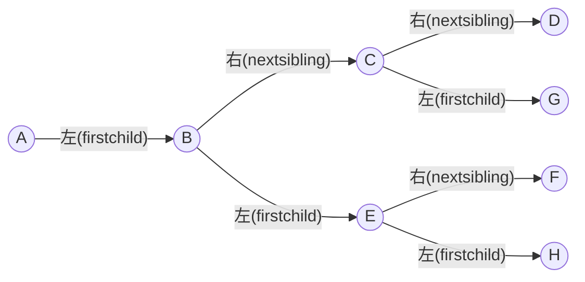

## 1. 树的表示

树的逻辑结构
- 树是 n (n≥0) 个结点的有限集合。
- n=0 时称为空树。
- n>0 时满足：
    - 有且仅有一个特定的称为根的结点；
    - 其余结点可分为 m (m>0)  个互不相交的有限集合 T1,T2,...,Tm 每个集合本身又是一棵树，称为根结点的子树。
    
由于树的结点度数（孩子个数）不固定，无法像二叉树那样直接用简单的左右指针表示，因此有三种经典存储方式。

| 存储方式        | 存储类型  | 找双亲    | 找孩子           | 特点              |
| ----------- | ----- | ------ | ------------- | --------------- |
| **双亲表示法**   | 顺序存储  | $O(1)$ | $O(n)$        | 适合频繁查双亲的场景      |
| **孩子表示法**   | 顺序+链式 | $O(n)$ | $O(1)$~$O(d)$ | 适合频繁查孩子的场景      |
| **孩子兄弟表示法** | 链式存储  | $O(n)$ | $O(1)$（第一个）   | 形态同二叉树，可利用二叉树算法 |


### 1.双亲表示法（Parent Representation）

每个结点中保存指向其双亲的“指针”（数组下标），是一种顺序存储结构

```c
#define MAX_TREE_SIZE 100

typedef struct {
    ElemType data;   // 数据元素
    int parent;      // 双亲位置域（数组下标）
} PTNode;

typedef struct {
    PTNode nodes[MAX_TREE_SIZE];  // 结点数组
    int n;                        // 结点数
} PTree;
```

例如：

|  下标 | data |  parent |
| :-: | :--: | :-----: |
|  0  |   A  | -1（根节点） |
|  1  |   B  |    0    |
|  2  |   C  |    0    |
|  3  |   D  |    0    |
|  4  |   E  |    1    |
| ... |  ... |   ...   |

优缺点：
- 优点
    - 查指定结点的双亲很方便（O(1) ）
    - 新增元素无需按逻辑次序存储，直接放在数组末尾即可
- 缺点	
    - 查找指定结点的孩子只能从头遍历整个数组（O(n) ）
    - 若删除非叶子结点，需处理其子树；删除叶子结点可直接置空或标记


### 2.孩子表示法（Child Representation）

顺序存储各个结点，每个结点中保存孩子链表的头指针，是一种顺序 + 链式存储的混合结构。

```c
// 孩子链表结点
struct CTNode {
    int child;              // 孩子结点在数组中的位置
    struct CTNode *next;    // 下一个孩子
};

// 顺序表中的表头结点
typedef struct {
    ElemType data;
    struct CTNode *firstChild;  // 指向第一个孩子
} CTBox;

// 树的整体定义
typedef struct {
    CTBox nodes[MAX_TREE_SIZE];
    int n, r;  // n:结点数, r:根的位置
} CTree;
```

优缺点：
- 优点
    - 查指定结点的孩子很方便（直接遍历链表）
- 缺点	
    - 查指定结点的双亲不方便（需遍历所有链表）

可将双亲表示法与孩子表示法结合，在表头结点中再增加一个 parent 域，形成双亲孩子表示法，兼顾两者优点。但其空间效率较低，因为每个结点需要多个域。

### 3.孩子兄弟表示法（Child-Sibling Representation）

用二叉链表存储树，每个结点包含：
- firstchild：指向第一个孩子（看作左指针）
- nextsibling：指向右兄弟（看作右指针）

```c
typedef struct CSNode {
    ElemType data;
    struct CSNode *firstchild;    // 第一个孩子
    struct CSNode *nextsibling;   // 右兄弟
} CSNode, *CSTree;
```

相当于将一棵树转换为二叉树，每个结点的左子树指向第一个孩子，右子树指向右兄弟。例如：


可以转化为：



## 2.树、森林与二叉树的转换

### 2.1 树 → 二叉树（孩子兄弟表示法）

如上，略

### 2.2 森林（m (m≥0)棵互不相交的树的集合） → 二叉树

本质：用二叉链表存储森林。森林中各个树的根节点之间视为兄弟关系（右兄弟指针连接）
- 将森林中的每棵树分别转换为二叉树；
- 将第一棵树的根作为转换后二叉树的根；
- 将第二棵树的根作为第一棵树根的右孩子；
- 将第三棵树的根作为第二棵树根的右孩子，以此类推


## 3.树和森林的遍历

### 3.1 树的遍历

#### 3.1.1 先根遍历

若树非空，先访问根结点，再依次对每棵子树进行先根遍历。

```c
void PreOrder(TreeNode *R) {
    if (R != NULL) {
        visit(R);                    // 访问根结点
        while (R还有下一个子树T) {
            PreOrder(T);             // 先根遍历下一棵子树
        }
    }
}
```

树的先根遍历序列 = 该树对应二叉树的先序遍历序列

#### 3.1.2 后根遍历

若树非空，先依次对每棵子树进行后根遍历，最后访问根结点

```c
void PostOrder(TreeNode *R) {
    if (R != NULL) {
        while (R还有下一个子树T) {
            PostOrder(T);            // 后根遍历下一棵子树
        }
        visit(R);                    // 访问根结点
    }
}
```

树的后根遍历序列 = 该树对应二叉树的中序遍历序列

#### 3.1.3 层序遍历

广度优先遍历，使用队列实现。
- 若树非空，根结点入队；
- 若队列非空，队头元素出队并访问，同时将该元素的所有孩子依次入队；
- 重复步骤2直到队列为空。

### 3.2 森林的遍历

#### 3.2.1 先序遍历森林

- 访问森林中第一棵树的根结点；
- 先序遍历第一棵树中根结点的子树森林；
- 先序遍历除去第一棵树之后剩余的树构成的森林。

效果等同于依次对森林中各个树进行先根遍历；也等同于对森林转换后的二叉树进行先序遍历。

#### 3.2.2 中序遍历森林

- 中序遍历森林中第一棵树的根结点的子树森林；
- 访问第一棵树的根结点；
- 中序遍历除去第一棵树之后剩余的树构成的森林。

效果等同于依次对森林中各个树进行后根遍历；也等同于对森林转换后的二叉树进行中序遍历。


