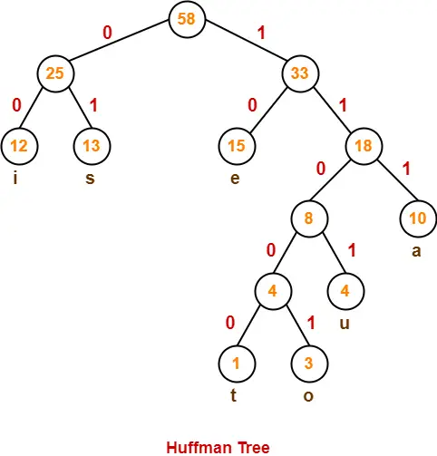

## 1.哈夫曼树的定义

在含有 n  个带权叶结点的二叉树中，WPL 最小的二叉树称为哈夫曼树（Huffman Tree），也称最优二叉树（Optimal Binary Tree）。它不一定是唯一的（形态可能不同），但最小的 WPL 值是唯一的。



如上图，一个哈夫曼树具有的元素有：
- 结点的权（Weight）：结点被赋予的一个具有某种现实含义的数值，可以表示结点的重要性、出现频率、访问概率、代价等
- 结点的带权路径长度：从树的根结点到该结点的路径长度（经过的边数）与该结点上权值的乘积。$L_i = w_i \times l_i$,其中 wi为权值，li为路径长度
- 树的带权路径长度（WPL）:树中所有叶子结点的带权路径长度之和,$WPL = \sum_{i=1}^{n} w_i l_i$


## 2.贪心算法构造哈夫曼树

给定 n  个权值分别为 w1, w2, ..., wn 的带权结点：
- 初始化：将这 n  个结点分别作为 n  棵仅含一个结点的二叉树，构成森林 F 。
- 选取与合并：从 F  中选取两棵根结点权值最小的树，构造一个新结点作为它们的父结点，新结点的权值为这两棵树根结点权值之和。将权值较小的作为左子树（或任意指定左右）。
- 更新森林：从 F  中删除刚才选出的两棵树，将新合并得到的树加入 F  中。
- 重复：重复步骤 2 和 3，直至 F  中只剩下一棵树为止，这棵树即为哈夫曼树。

如：字符集：{a, b, c, d, e}，权值：{1, 3, 2, 7, 2}

```c
选取a,e,合并为新树,权值为3。目前森林权值为{3, 2, 7, 3}
选取b,c,合并为新树,权值为5。目前森林权值为{5, 7, 3}
选取ae，bc,合并为新树,权值为8。目前森林权值为{8, 7}
合并aebc，d得到哈夫曼树。
```
得到哈夫曼树(真实的哈夫曼树全画圆形结点就可以了，下图这种画法只是为了方便标记叶子结点)如下：

```mermaid
graph TD
    R((15)) --> D[7 (d)]
    R --> N1((8))
    N1 --> N2((3))
    N1 --> N3((5))
    N2 --> A[1 (a)]
    N2 --> E[2 (e)]
    N3 --> B[3 (b)]
    N3 --> C[2 (c)]
```

WPL=1×3+2×3+2×3+3×3+7×1=31

检验：3+5+8+15=31（内部结点之和）

## 3.哈夫曼树的性质

- 每个初始结点最终都成为叶结点，且权值越小的结点到根结点的路径长度越大（频率低的字符编码长，频率高的编码短）。
- 哈夫曼树的结点总数为 2n−1（n 个叶结点，n−1 个非叶结点）
    - 原因是对于二叉树：叶子结点比度为 2 的结点多 1 个
- 哈夫曼树中不存在度为 1 的结点（即没有只有一个孩子的结点），是严格的/正则的二叉树（所有非叶结点度均为 2）
- 哈夫曼树的形态不唯一（左右子树可以交换，相同权值选取顺序不同也可能导致形态不同），但WPL 必然相同且为最优

## 4.哈夫曼编码（Huffman Code）

- 统计频率：将字符集中每个字符的出现频度（或概率）作为权值。
- 构建哈夫曼树：以这些权值构造哈夫曼树，每个字符对应一个叶结点。
- 生成编码：从根结点出发，向左子树走标记为 0，向右子树走标记为 1（或相反）。从根到每个叶结点的路径上的 0/1 序列即为该字符的哈夫曼编码。

性质：
- 最优性：在所有基于字符频率的前缀编码中，哈夫曼编码的平均编码长度最短。
- 不唯一性：由于哈夫曼树不唯一（左右子树可交换，0/1 分配可互换），哈夫曼编码也不唯一，但平均码长相同。

应用场景：
- 文件压缩：ZIP、GZIP、RAR 等工具的核心算法之一。
- 图像/音频压缩：JPEG 图像压缩（对 DCT 系数进行哈夫曼编码）、MP3 音频编码。
- 数据传输：减少网络传输带宽。


