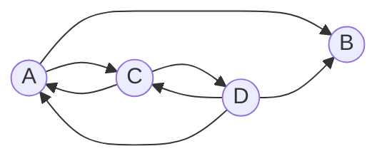
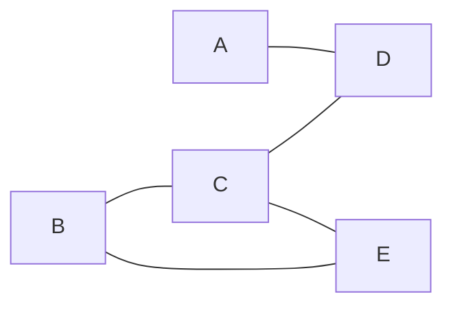

## 1.图的定义

图（Graph）由顶点集 V 和边集 E 组成，记为G=(V,E)
- V(G) ：图 G  中顶点的有限非空集合，记 V={v1,v2,...,vn}
- ∣V∣ ：图 G  中顶点的个数，也称为图的阶
- E(G) ：图 G  中顶点之间的关系（边）集合，E={(u,v)∣u∈V,v∈V} 。
- ∣E∣ ：图 G  中边的条数。
- 图不可以是空图：线性表可以是空表，树可以是空树，但图不可以是空图，即顶点集 V  一定是非空集。边集 E  可以为空（E=∅ ），此时图中只有顶点而没有边.

## 2.图的基本分类和基本性质

### 2.1 无向图（Undirected Graph）

若 E  是无向边（简称边）的有限集合，则图 G  为无向图。
- 边是顶点的无序对，记为 (v,w)  或 (w,v) ，满足 (v,w)=(w,v) 。
- 顶点 v  和 w  互为邻接点。
- 边 (v,w)  依附于顶点 v  和 w ，或者说边 (v,w)  和顶点 v,w  相关联

关于无向图的度有以下结论：
- 顶点 v  的度是指依附于该顶点的边的条数，记为 TD(v) 。
- 握手定理：在具有 n  个顶点、e  条边的无向图中，所有顶点的度之和等于边数的 2 倍：$\sum_{i=1}^{n} \mathrm{TD}(v_i) = 2e$


### 2.2 有向图（Directed Graph）
- 若 E  是有向边（也称弧）的有限集合，则图 G  为有向图。
- 弧是顶点的有序对，记为 ⟨v,w⟩ 。
- v  称为弧尾（起点），w  称为弧头（终点）。
- ⟨v,w⟩  称为从顶点 v  到顶点 w  的弧，也称 v  邻接到 w ，或 w  邻接自 v 。
- 注意：⟨v,w⟩!=⟨w,v⟩ 

关于有向图的度有以下结论：
- 入度 ID(v) ：以顶点 v  为终点的有向边的数目。
- 出度 OD(v) ：以顶点 v  为起点的有向边的数目。
- 顶点 v  的度等于其入度和出度之和：TD(v)=ID(v)+OD(v)
- 有向图握手定理：在具有 n  个顶点、e  条边的有向图中：$\sum_{i=1}^{n} \mathrm{ID}(v_i) = \sum_{i=1}^{n} \mathrm{OD}(v_i) = e$


### 2.3 简单图（Simple Graph）和多重图（Multigraph）

- 简单图（数据结构课程主要研究的对象）需同时满足：
    - 无向图中不存在重复边；
    - 不存在顶点到自身的边（自环）。
- 多重图：图 G  中某两个结点之间的边数多于一条，又允许顶点通过同一条边和自己关联，则 G  为多重图。


### 2.4 连通图与强连通图

先解释一下路径、回路、简单路径、简单回路、路径长度、点到点的距离和连通性等概念：
- 路径：顶点 v 到顶点 w 的路径是指从顶点 v 开始，通过边到达顶点 w 的序列。
- 回路（环）：第一个顶点和最后一个顶点相同的路径。
- 简单路径：在路径序列中，顶点不重复出现的路径。
- 简单回路：除第一个顶点和最后一个顶点外，其余顶点不重复出现的回路。
- 路径长度：路径上边的数目。
- 点到点的距离：从顶点 u  出发到顶点 v  的最短路径若存在，则此路径的长度称为从 u  到 v  的距离；若从 u  到 v  根本不存在路径，则记该距离为无穷（∞ ）
- 无向图中：若从顶点 v  到顶点 w  有路径存在，则称 v  和 w  是连通的。
- 有向图中：若从顶点 v  到顶点 w  和从顶点 w  到顶点 v  之间都有路径，则称这两个顶点是强连通的.

连通图（无向图）
- 若图 G  中任意两个顶点都是连通的，则称图 G  为连通图，否则称为非连通图。
- 若图 G  是连通图，则最少有 n−1  条边（此时为一棵树）。
- 若图 G  是非连通图，则最多可能有 $C_{n-1}^2$ 条边（即 n−1  个顶点构成完全图，剩余 1 个顶点孤立）。

强连通图（有向图）
- 若图中任何一对顶点都是强连通的，则称此图为强连通图。
- 若 G  是强连通图，则最少有 n  条边（形成一个回路）。

### 2.5 子图与生成子图

子图
- 设有两个图 G=(V,E)  和 G=(V',E') ，若 V'  是 V 的子集，且 E'  是 E 的子集，则称 G' 是 G  的子图。
- 注意：并非任意挑几个顶点、几条边都能构成子图，所挑的边必须依附于所挑的顶点。

生成子图
- 若有满足 V'(G)=V（G）且 E(G)=E'（G）  则称其为 G 的生成子图（即顶点集与原图相同，边集是原图边集的子集）


### 2.6 连通分量与强连通分量

连通分量（无向图）
- 无向图中的极大连通子图称为连通分量。
- 极大的的含义：子图必须连通，且包含尽可能多的顶点和边（再添加原图中的其他顶点或边就无法保持连通）。
- 非连通无向图有多个连通分量。


强连通分量（有向图）
- 有向图中的极大强连通子图称为有向图的强连通分量。


### 2.7 生成树与生成森林

生成树
- 连通图的生成树是包含图中全部顶点的一个极小连通子图。
- 若图中顶点数为 n ，则它的生成树含有 n−1  条边。
- 极小的含义：对生成树而言，若砍去它的一条边，则会变成非连通图；若加上一条边则会形成一个回路。
- 一个连通图可能有多个不同的生成树。

生成森林
- 在非连通图中，各个连通分量的生成树构成了非连通图的生成森林。


### 2.8 边的权与带权图（网）

- 边的权：在一个图中，每条边都可以标上具有某种含义的数值，该数值称为该边的权值。
- 带权图/网：边上带有权值的图称为带权图，也称网（Network）。
带权路径长度：当图是带权图时，一条路径上所有边的权值之和，称为该路径的带权路径长度。

### 2.9 完全图

无向完全图：无向图中任意两个顶点之间都存在边。若顶点数 ∣V∣=n ，则边数 $|E| \in [0, C_n^2] = [0, n(n-1)/2]$.

有向完全图：有向图中任意两个顶点之间都存在方向相反的两条弧。若顶点数 ∣V∣=n ，则边数 $|E| \in [0, n(n-1)] = [0, n(n-1)]$.

### 2.10 稀疏图与稠密图

- 稀疏图：边数很少的图。
- 稠密图：边数很多的图。
- 没有绝对的界限，一般来说当 ∣E∣<∣V∣log∣V∣时，可以将 G  视为稀疏图

### 2.11 树、森林与图表示

树：不存在回路，且连通的无向图。
- n 个顶点的树，必有 n−1 条边。
- 常见考点：n 个顶点的图，若∣E∣>n−1 ，则一定有回路。

森林：若干棵互不相交的树的集合。

有向树：一个顶点的入度为 0，其余顶点的入度均为 1 的有向图.


## 3. 图的储存结构和对应性质

图的存储主要包括四种方法：邻接矩阵、邻接表、十字链表、邻接多重表

### 3.1 邻接矩阵

#### 3.1.1 邻接矩阵的结构

对于具有 n 个顶点的图 G=(V,E) ，用一个 n×n 的方阵 A 表示，其中元素 A[i][j] 定义如下：

$$
A[i][j] = \begin{cases} 1, & \text{若 }(v_i, v_j)\text{ 或 }\langle v_i, v_j\rangle \in E(G) \\ 0, & \text{若 }(v_i, v_j)\text{ 或 }\langle v_i, v_j\rangle \notin E(G) \end{cases}
$$

即：
- 若顶点 v_i  和 v_j 之间存在边（无向图）或弧（有向图），则对应位置为 1；否则为 0。
- 无向图邻接矩阵为对称矩阵，A[i][j]=A[j][i] 

```c
#define MaxVertexNum 100

typedef struct {
    char Vex[MaxVertexNum];                    // 顶点表
    int Edge[MaxVertexNum][MaxVertexNum];      // 邻接矩阵（边表）
    int vexnum, arcnum;                        // 当前顶点数和边数/弧数
} MGraph;
```

- 顶点表 Vex 数组存储各顶点的信息，可根据实际需求将 char 类型替换为更复杂的结构体类型。
- 邻接矩阵 Edge 数组中，对于无权图，元素取值为 0 或 1；也可用 bool 型或枚举型变量表示边是否存在。
- vexnum 记录当前图中实际顶点数，arcnum 记录当前边数/弧数。

对于带权图（网），邻接矩阵的元素不再仅是 0/1，而是存储对应边的权值。不存在的边（或弧）用一个特殊值"无穷"（∞ ）表示。

```c
#define MaxVertexNum 100
#define INFINITY 最大的int值       // 宏定义常量"无穷"

typedef char VertexType;            // 顶点的数据类型
typedef int EdgeType;               // 边上权值的数据类型

typedef struct {
    VertexType Vex[MaxVertexNum];
    EdgeType Edge[MaxVertexNum][MaxVertexNum];  // 存储边的权值
    int vexnum, arcnum;
} MGraph;
```

#### 3.1.2 邻接矩阵的性质

- 若顶点 vi,vj 之间存在边（或弧），则 A[i][j]=wij（该边的权值）。
- 若顶点 vi,vj之间不存在边（或弧），则 A[i][j]=∞ （通常取 int 类型的上限值表示）。
- 对角线元素 A[i][i]=0 （表示顶点到自身的距离为 0；若不允许自环，也可设为 ∞ ，具体依算法需求而定）。
- 有向网与无向网的存储方式类似，区别在于有向网的弧具有方向性，矩阵不一定对称。

基于邻接矩阵的图操作:
- 顶点度:
    - 无向图：第 i 个顶点的度等于邻接矩阵第 i 行（或第 i 列）中非零元素（对于带权图则为非 ∞ 元素）的个数，$\mathrm{TD}(v_i) = \sum_{j=0}^{n-1} A[i][j] \quad (\text{元素为 }0/1\text{ 时})$
    - 有向图：度数等于出度与入度之和，$\mathrm{TD}(v_i) = \mathrm{OD}(v_i) + \mathrm{ID}(v_i)$
        - 出度：第 i 行中非零元素的个数，$\mathrm{OD}(v_i) = \sum_{j=0}^{n-1} A[i][j]$
        - 入度：第 i 列中非零元素的个数，$\mathrm{ID}(v_i) = \sum_{j=0}^{n-1} A[j][i]$
- 查找邻接边
    - 无向图：遍历第 i 行，所有值为 1（或对应权值）的位置 j 即为顶点 i 的邻接点
    - 有向图：
        - 遍历第 i 行，所有值为 1（或对应权值）的位置 j 即为顶点 i 的出边
        - 遍历第 j 列，所有值为 1（或对应权值）的位置 i 即为顶点 j 的入边
- 求某个顶点的度、入度、出度，或查找其所有邻接边，均需要遍历对应行或列的全部 n  个元素，因此时间复杂度均为 O(∣V∣)

邻接矩阵法的性能分析：
- 邻接矩阵需要存储一个 ∣V∣×∣V∣的二维数组，因此空间复杂度为：O(∣V∣^2)
    - 空间复杂度仅与顶点数有关，与实际边数无关。
    - 因此，邻接矩阵法特别适合存储稠密图（边数接近完全图）。
    - 对于稀疏图（边数远小于∣V∣^2），会造成大量空间浪费（大量 0 或 ∞ 元素）
- 无向图邻接矩阵的压缩存储,由于无向图的邻接矩阵为对称矩阵，可以采用压缩存储策略，只存储主对角线及其以下（或以上）的三角区域元素，从而节省近一半空间.下标映射（假设矩阵下标从 1 开始，数组 B  下标从 0 开始）:
    - $k = \begin{cases} \dfrac{i(i-1)}{2} + j - 1, & i \geq j \quad (\text{下三角区及主对角线}) \\[8pt] \dfrac{j(j-1)}{2} + i - 1, & i < j \quad (\text{上三角区，利用对称性 } a_{i,j} = a_{j,i}) \end{cases}$

路径计数定理:设图 G 的邻接矩阵为 A（矩阵元素为 0/1），则 A^n [i][j] 等于由顶点 i 到顶点 j 的长度为 n 的路径的数目,如A^2[i][i]>0  表示顶点 i 存在长度为 2 的回路（经过某个中间顶点再回到自身）

### 3.2 邻接表(Adjacency List)

#### 3.2.1 邻接表的结构

邻接表（Adjacency List）是图的一种顺序+链式混合存储结构，其核心思想与树的孩子表示法类似：
- 顺序部分：用一个一维数组（称为顶点表）存储图中的所有顶点信息。
- 链式部分：对每个顶点，建立一个单链表（称为边链表），存储从该顶点出发的所有边（或弧）所指向的邻接顶点。

```c
//顶点：
typedef struct VNode {
    VertexType data;         // 顶点信息
    ArcNode *first;          // 指向第一条依附于该顶点的边/弧
} VNode, AdjList[MaxVertexNum];

//边结点：
typedef struct ArcNode {
    int adjvex;              // 边/弧指向的邻接顶点的编号
    struct ArcNode *next;    // 指向下一条边/弧的指针
    // InfoType info;        // 可选：边的权值或其他信息
} ArcNode;

typedef struct {
    AdjList vertices;        // 顶点表数组
    int vexnum, arcnum;      // 图的当前顶点数和边数/弧数
} ALGraph;
```

#### 3.2.2 邻接表的性质


对于无向图的邻接表：
- 对于无向图中的每一条边 (u,v) ，需要在顶点 u 的边链表中添加一个指向 v 的结点，同时在顶点 v 的边链表中添加一个指向 u 的结点。
- 因此，无向图的边结点总数为 2∣E∣（每条边被存储两次）。
- 空间复杂度：O(∣V∣+2∣E∣) ，即 O(∣V∣+∣E∣) 
- 顶点vi的度等于其边链表中结点的个数。求度的时间复杂度为 O(1) 到 O(TD(vi)) ，只需遍历该顶点的边链表即可

对于有向图的邻接表：
- 对于有向图中的每一条弧 ⟨u,v⟩ ，仅在顶点 u 的边链表中添加一个指向 v 的结点（记录的是出边）。
- 因此，有向图的边结点总数为 ∣E∣ 
- 空间复杂度：O(∣V∣+∣E∣)
- 出度：顶点 vi的出度等于其边链表中结点的个数，遍历该链表即可求得。
- 入度：需要遍历整个图中所有顶点的边链表，统计指向 vi 的结点个数。因此，求入度不方便，时间复杂度为 O(∣V∣+∣E∣) 。
- 度数：度 = 出度 + 入度。由于入度求解困难，有向图邻接表中求度也不方便

图的邻接表表示方式不唯一。对于同一个图，由于建立边链表时各边结点的链接顺序可以不同（取决于边的输入顺序或建图算法），可能得到不同的邻接表结构，但它们表示的是同一个图。

邻接表法存储带权图（网）：只需在边结点 ArcNode 中增加一个数据域 info（或 weight）用于存储该边（或弧）的权值即可

```c
typedef struct ArcNode {
    int adjvex;
    struct ArcNode *next;
    int weight;              // 边的权值
} ArcNode;
```

对于性能分析：
- 优势操作：遍历一个顶点的所有邻接点非常高效，时间复杂度与该顶点的度成正比。
- 劣势操作：
    - 判断任意两顶点间是否有边：需要遍历链表，最坏 O(∣V∣) 。
    - 有向图中求入度：需要遍历所有边链表，O(∣V∣+∣E∣) 。

在实际应用中，邻接表是存储图最常用的方式之一，尤其适用于：
- 稀疏图（如社交网络、Web图等）。
- 需要频繁遍历某个顶点的所有邻接点的算法（如DFS、BFS、Dijkstra等）。
- 带权图（网）的存储。

| 对比维度          | 邻接表                                            | 邻接矩阵                 |
| ------------- | ---------------------------------------------- | -------------------- |
| **存储方式**      | 顺序+链式存储                                        | 数组实现的顺序存储            |
| **空间复杂度**     | 无向图：$O(\|V\| + 2\|E\|)$；有向图：$O(\|V\| + \|E\|)$ | $O(\|V\|^2)$         |
| **适用场景**      | 适合存储**稀疏图**（边数少）                               | 适合存储**稠密图**（边数多）     |
| **表示唯一性**     | **不唯一**（边结点顺序可变）                               | **唯一**（顶点编号确定后）      |
| **判断边是否存在**   | 需要遍历链表，$O(\mathrm{TD}(v))$                     | $O(1)$，直接查矩阵元素       |
| **求无向图顶点的度**  | 遍历边链表，$O(\mathrm{TD}(v))$                      | 遍历行/列，$O(\|V\|)$     |
| **求有向图顶点的出度** | 遍历边链表，$O(\mathrm{OD}(v))$                      | 遍历第 $i$ 行，$O(\|V\|)$ |
| **求有向图顶点的入度** | 需遍历全图所有链表，$O(\|V\| + \|E\|)$                   | 遍历第 $i$ 列，$O(\|V\|)$ |
| **找相邻顶点**     | 遍历边链表即可                                        | 需遍历对应行或列             |
| **找有向图的入边**   | 不方便（需全局遍历）                                     | 遍历对应列即可              |


### 3.3 十字链表（Cross-Edge List）存有向图

| 特性            | 邻接矩阵                     | 邻接表                            |    |                                        |
| ------------- | ------------------------ | ------------------------------ | -- | -------------------------------------- |
| **空间复杂度**     | O(\| V\|²) | 有向图 O(\|V\|+\|E\|)；无向图 O(\|V\|+2\|E\|) |
| **计算度/出度/入度** | 必须遍历对应行或列                | 计算有向图的度、**入度不方便**，其余很方便        |    |                                        |
| **找相邻边**      | 必须遍历对应行或列，时间复杂度 O(\|V\|) | 找有向图的**入边不方便**（需遍历整个邻接表），其余很方便 |    |                                        |
| **删除边或顶点**    | 删除边很方便，删除顶点需大量移动数据       | 无向图中删除边或顶点都不方便                 |    |                                        |
| **适用场景**      | 稠密图                      | 稀疏图                            |    |                                        |
| **表示唯一性**     | 唯一                       | 不唯一                            |    |                                        |

十字链表是为了解决邻接表查找入边困难而设计的存储结构，能够同时高效管理有向图的入边和出边,其结构如下：
- 弧结点（边结点）
    - tailvex：弧尾顶点编号（即发出该弧的顶点）
    - headvex：弧头顶点编号（即接收该弧的顶点）
    - info：权值或其他信息
    - hlink：指向下一条弧头相同的弧（即同一顶点的入边链）
    - tlink：指向下一条弧尾相同的弧（即同一顶点的出边链）
- 顶点结点，所有顶点结点采用数组顺序存储，每个顶点结点包含以下字段信息：
    - data：数据域，存储顶点信息
    - firstin：指向以该顶点为弧头的第一条弧（入边链头指针）
    - firstout：指向以该顶点为弧尾的第一条弧（出边链头指针）

例如下图：
- 顶点集 V = {A, B, C, D}（对应下标 0 ~ 3），弧集 E = {<A,B>, <A,C>, <C,A>, <C,D>, <D,A>, <D,B>, <D,C>}，七条弧依次编号为 a0 ~ a6
- 顶点 A 的 firstout 指向弧 <A,B>，通过 tlink 可找到 <A,C>
- 顶点 A 的 firstin 指向弧 <C,A>，通过 hlink 可找到 <D,A>
- 顶点 D 的 firstout 指向弧 <D,A>，通过 tlink 依次找到 <D,B>、<D,C>



| 指标        | 分析                                  |
| --------- | ----------------------------------- |
| **空间复杂度** | O(\|V\|+\|E\|)。每个顶点一个结点，每条弧一个结点，无冗余 |
| **查找出边**  | 顺着 firstout → tlink 的绿色线路遍历，很方便     |
| **查找入边**  | 顺着 firstin → hlink 的橙色线路遍历，很方便      |
| **删除操作**  | 删除边或顶点都很方便，直接修改指针即可                 |
| **适用范围**  | **只能用于存储有向图**                       |
| **表示唯一性** | 不唯一                                 |

实际存储如下：

|  下标 | data | firstin | firstout |   所指入弧  |   所指出弧  |
| :-: | :--: | :-----: | :------: | :-----: | :-----: |
|  0  |   A  |    a2   |    a0    | \<C, A> | \<A, B> |
|  1  |   B  |    a0   |   NULL   | \<A, B> |    无    |
|  2  |   C  |    a1   |    a2    | \<A, C> | \<C, A> |
|  3  |   D  |    a3   |    a4    | \<C, D> | \<D, A> |

| 弧标签 |    弧    | tailvex | headvex | hlink | tlink |
| :-: | :-----: | :-----: | :-----: | :---: | :---: |
|  a0 | \<A, B> |    0    |    1    |  → a5 |  → a1 |
|  a1 | \<A, C> |    0    |    2    |  → a6 |  NULL |
|  a2 | \<C, A> |    2    |    0    |  → a4 |  → a3 |
|  a3 | \<C, D> |    2    |    3    |  NULL |  NULL |
|  a4 | \<D, A> |    3    |    0    |  NULL |  → a5 |
|  a5 | \<D, B> |    3    |    1    |  NULL |  → a6 |
|  a6 | \<D, C> |    3    |    2    |  NULL |  NULL |


### 3.4 邻接多重表（Adjacency Multilist）存无向图

| 特性        | 邻接矩阵   | 邻接表                           |    |                          |
| --------- | ------ | ----------------------------- | -- | ------------------------ |
| **空间复杂度** | O(\|V\|²) | O(\|V\|+2\|E\|)（每条边存储两次） |
| **核心问题**  | 空间复杂度高 | 每条边对应两份冗余信息；删除顶点、删除边等操作时间复杂度高 |    |                          |


邻接多重表是为了解决邻接表存储无向图时边信息冗余、删除操作复杂而设计的存储结构。其核心思想是：每条边只对应一份数据，但通过两个链接指针分别将该边挂接到其两个顶点各自的边链表中
- 边结点
    - i, j：该边依附的两个顶点编号
    - info：权值或其他信息
    - iLink：指向下一条依附于顶点 i 的边
    - jLink：指向下一条依附于顶点 j 的边
- 顶点结点
    - data：数据域，存储顶点信息
    - firstedge：指向与该顶点相连的第一条边

以包含 5 个顶点的无向图 G = (V, E) 为例：
- V = {A(0), B(1), C(2), D(3), E(4)}
- E = {(A,D), (B,C), (B,E), (C,D), (C,E)}



实际存储如下：

|  下标 | data | firstedge | 说明                   |
| :-: | :--: | :-------: | :------------------- |
|  0  |   A  |    → e0   | 顶点 A 的第一条边为 e0 (A-D) |
|  1  |   B  |    → e1   | 顶点 B 的第一条边为 e1 (B-C) |
|  2  |   C  |    → e1   | 顶点 C 的第一条边为 e1 (B-C) |
|  3  |   D  |    → e0   | 顶点 D 的第一条边为 e0 (A-D) |
|  4  |   E  |    → e4   | 顶点 E 的第一条边为 e4 (C-E) |

| 边标签 |    边   | i (下标) | j (下标) | iLink | jLink |
| :-: | :----: | :----: | :----: | :---: | :---: |
|  e0 | (A, D) |    0   |    3   |  NULL |  → e3 |
|  e1 | (B, C) |    1   |    2   |  → e2 |  → e3 |
|  e2 | (B, E) |    1   |    4   |  NULL |  NULL |
|  e3 | (C, D) |    2   |    3   |  → e4 |  NULL |
|  e4 | (C, E) |    2   |    4   |  NULL |  → e2 |


| 指标        | 分析                                     |
| --------- | -------------------------------------- |
| **空间复杂度** | O(\|V\|+\|E\|)。每个顶点一个结点，每条边仅一个结点，无冗余   |
| **删除边**   | 很方便。只需删除一个边结点，并调整相关顶点的 firstedge 和链接指针 |
| **删除顶点**  | 很方便。删除该顶点及其所有关联的边结点即可                  |
| **适用范围**  | **只能用于存储无向图**                          |
| **表示唯一性** | 不唯一                                    |


### 3.6 十字链表和邻接多重表的对比

| 维度        | 十字链表                               | 邻接多重表                      |
| --------- | ---------------------------------- | -------------------------- |
| **顶点组织**  | 一维数组（顺序存储）                         | 一维数组（顺序存储）                 |
| **边/弧组织** | 链表结点（链式存储）                         | 链表结点（链式存储）                 |
| **空间复杂度** | O(\|V\|+\|E\|)                     | O(\|V\|+\|E\|)             |
| **核心思想**  | 用**两个链接域**将同一条弧挂接到两个不同的链表（入边链、出边链） | 用**两个链接域**将同一条边挂接到两个顶点的边链表 |
| **解决痛点**  | 邻接表找入边困难                           | 邻接表边信息冗余、删除困难              |


              
| 项目       | 十字链表                                  | 邻接多重表               |
| -------- | ------------------------------------- | ------------------- |
| **数据域**  | `data`                                | `data`              |
| **指针域**  | `firstin`（第一条入弧）<br>`firstout`（第一条出弧） | `firstedge`（第一条依附边） |
| **差异本质** | 有向图区分**方向**，需两个头指针                    | 无向图无方向，只需一个头指针      |


| 域        | 十字链表（弧结点）                      | 邻接多重表（边结点）                |
| -------- | ------------------------------ | ------------------------- |
| **端点标识** | `tailvex`（弧尾）<br>`headvex`（弧头） | `i`（一端顶点）<br>`j`（另一端顶点）   |
| **信息域**  | `info`（权值等）                    | `info`（权值等）               |
| **链接域1** | `hlink`：同**弧头**的下一条弧           | `iLink`：依附于顶点 **i** 的下一条边 |
| **链接域2** | `tlink`：同**弧尾**的下一条弧           | `jLink`：依附于顶点 **j** 的下一条边 |

- 十字链表的 tailvex/headvex 具有方向语义（谁发出、谁接收），链接域按方向角色（弧头/弧尾）组织。
- 邻接多重表的 i/j 仅是无差别的两个端点，链接域按端点编号（i 侧/j 侧）组织，不区分谁发谁收。

十字链表是有向图的“方向化双链”，邻接多重表是无向图的“无差别双链”。二者如同一对“孪生结构”：共享“双指针挂接单结点”的骨架，但因有向/无向这一根本差异，导致结点命名、链接语义和顶点表结构发生了方向性分化


