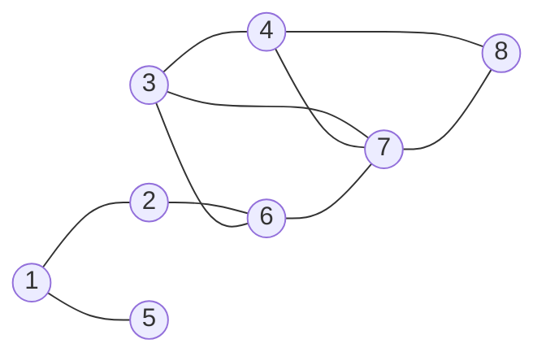
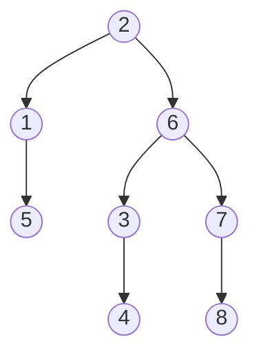
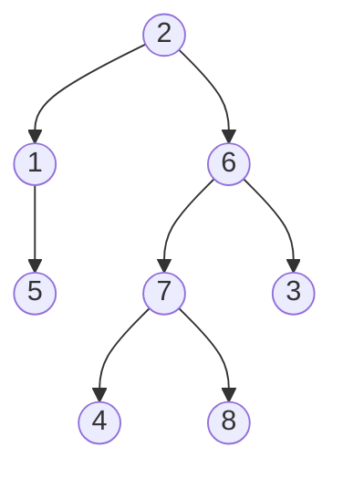

图的遍历是图算法的基础，主要包括两大策略：
- 广度优先遍历（BFS, Breadth-First Search）
- 深度优先遍历（DFS, Depth-First Search）

我们先回忆树（可以视作没有环路的图）的2种遍历

树的深度优先遍历（先根遍历）：从根结点出发，能往更深处走就尽量往深处走。每当访问一个结点时，检查是否还有与当前结点相邻且未被访问过的子结点，有则继续向下一层深入。

树的广度优先遍历（层序遍历）:按层次展开。通过根结点找到下一层结点（如 2, 3, 4），再通过下一层结点找到再下一层结点（如 5, 6, 7, 8），逐层向外扩散。

## 1.图的深度优先遍历（DFS，Depth-First Search）

### 1.1 算法实现（递归）

图的 DFS 与树的先根遍历极为相似，但存在一个关键区别：图中可能存在环（回路），因此必须设置访问标记数组 visited[]，防止顶点被重复访问而陷入死循环。从起始顶点出发，沿着一条路径尽可能深入地探索，直到无法继续前进时回溯，再探索其他分支。

```c
bool visited[MAX_VERTEX_NUM];   // 访问标记数组，初始全为 false

// 从顶点 v 出发，深度优先遍历图 G
void DFS(Graph G, int v) {
    visit(v);                   // 访问顶点 v
    visited[v] = TRUE;          // 设已访问标记
    
    // w 为 v 的邻接点；依次检查所有邻接点
    // FirstNeighbor(G, v)：返回顶点 v 的第一个邻接点，无则返回 -1
    // NextNeighbor(G, v, w)：返回顶点 v 相对于 w 的下一个邻接点

    for (int w = FirstNeighbor(G, v); w >= 0; w = NextNeighbor(G, v, w)) {
        if (!visited[w]) {      // w 为 v 的尚未访问的邻接顶点
            DFS(G, w);          // 递归访问
        }
    }
}
```

例如下图：



| 步骤 | 当前访问 | 栈状态（自底向上）                  | visited 数组变化      |
| -- | ---- | -------------------------- | ----------------- |
| 1  | 1    | `DFS(1)`                   | `visited[1]=true` |
| 2  | 2    | `DFS(2) → DFS(1)`          | `visited[2]=true` |
| 3  | 6    | `DFS(6) → DFS(2) → DFS(1)` | `visited[6]=true` |
| 4  | 3    | `DFS(3) → DFS(6) → ...`    | `visited[3]=true` |
| 5  | 4    | `DFS(4) → DFS(3) → ...`    | `visited[4]=true` |
| 6  | 7    | `DFS(7) → DFS(4) → ...`    | `visited[7]=true` |
| 7  | 8    | `DFS(8) → DFS(7) → ...`    | `visited[8]=true` |
| 8  | 回溯   | 逐层出栈                       | —                 |
| 9  | 5    | `DFS(5) → DFS(1)`          | `visited[5]=true` |


由于图可能存在多条路径到达同一顶点（如 6→3 和 6→7→3），visited[] 数组的判重机制确保了每个顶点仅被访问一次

这个算法的复杂度：

| 存储结构     | 时间复杂度              | 原因                              |
| -------- | ------------------ | ------------------------------- |
| **邻接矩阵** | $O(\|V\|^2)$       | 对每个顶点，需扫描整行（$\|V\|$ 个元素）来找所有邻接点 |
| **邻接表**  | $O(\|V\| + \|E\|)$ | 访问所有顶点一次，并扫描所有边一次               |

空间复杂度：$O(\|V\|)$，包括 visited[] 数组 $O(\|V\|)$ 和递归栈深度（最坏$O(\|V\|)$ ）


## 1.2 深度优先生成树（DFS Tree）

在 DFS 过程中，首次访问某个顶点时经过的那条边称为树边（Tree Edge），由所有树边构成的子图即为深度优先生成树。
- 若图是连通图，则产生一棵生成树，包含全部|V|个顶点。
- 若图是非连通图，则产生深度优先生成森林（每棵生成树对应一个连通分量）。

生成树的形态不唯一，取决于起始顶点和邻接点的访问顺序。

在DFS过程中，
- 连通图：从任一顶点出发，一次 DFS/BFS 即可访问所有顶点。
- 非连通图：一次遍历只能访问一个连通分量。需循环检查 visited[] 数组，对每一个尚未访问的顶点重新调用 DFS/BFS，从而遍历整个图。


## 2.图的广度优先遍历（BFS，Breadth-First Search）

### 2.1 算法实现（队列）

图的 BFS 类似于树的层序遍历。从起始顶点出发，先访问其所有邻接点（第一层），再依次访问这些邻接点的未访问邻接点（第二层），以此类推，像水波一样逐层向外扩展。实现上需要借助队列（Queue）的 FIFO 特性。

```c
bool visited[MAX_VERTEX_NUM];

void BFS(Graph G, int v) {
    InitQueue(Q);           // 初始化辅助队列
    
    visit(v);
    visited[v] = TRUE;
    Enqueue(Q, v);          // 顶点 v 入队
    
    while (!isEmpty(Q)) {
        Dequeue(Q, v);      // 队头元素出队
        
        // 检查 v 的所有邻接点
        for (int w = FirstNeighbor(G, v); w >= 0; w = NextNeighbor(G, v, w)) {
            if (!visited[w]) {
                visit(w);
                visited[w] = TRUE;
                Enqueue(Q, w);  // 新访问的顶点入队
            }
        }
    }
}
```

其过程为：
- 初始化：初始化一个辅助队列 Q 来控制访问顺序，并借助全局布尔数组 visited[] 记录每个顶点是否已被访问过。
- 起始顶点处理：首先访问起始顶点处理：首先访问起始顶点 v，将其标记为“已访问”，然后立即将 v 入队。
- 循环遍历：当队列非空时，循环执行以下操作：
    - 将队头顶点出队，记为 v。
    - 逐一检查 v 的所有未被访问过的邻接点 w。
    - 对于每个这样的邻接点 w，立即访问它、标记为“已访问”，并将其入队（等待后续以该顶点为起点向外扩展）。
- 终止条件：当队列为空时，表示从起始顶点 v 出发所能到达的所有顶点均已按“由近及远”的层次顺序访问完毕，算法结束。

例如下图：


| 步骤 | 队列（队头→队尾） | 当前出队 | 新访问顶点 |
| -- | --------- | ---- | ----- |
| 1  | `2`       | 2    | 1, 6  |
| 2  | `1, 6`    | 1    | 5     |
| 3  | `6, 5`    | 6    | 3, 7  |
| 4  | `5, 3, 7` | 5    | —     |
| 5  | `3, 7`    | 3    | 4     |
| 6  | `7, 4`    | 7    | 8     |
| 7  | `4, 8`    | 4    | —     |
| 8  | `8`       | 8    | —     |

其复杂度为：

| 存储结构     | 时间复杂度              | 原因                       |
| -------- | ------------------ | ------------------------ |
| **邻接矩阵** | $O(\|V\|^2)$       | 每个顶点出队后，需扫描矩阵中对应的一行来找邻接点 |
| **邻接表**  | $O(\|V\| + \|E\|)$ | 每个顶点入队/出队一次，每条边被检查一次     |

空间复杂度：$O(\|V\|)$，包括 visited[] 数组和队列（最坏情况下队列中同时存储 $O(\|V\|)$ 个顶点）。

### 2.2 广度优先生成树（BFS Tree）

BFS 过程中，由首次发现某顶点的那条边构成树边，形成的树称为广度优先生成树。

以上述遍历为例，生成树的边为：
- 2-1, 2-6
- 1-5
- 6-3, 6-7
- 3-4
- 7-8

即如图：



也可以是其他形态，如：



在无权图中，BFS 生成树中从根到任意顶点的路径长度，即为原图中两顶点间的最短路径（边数最少）。与 DFS 类似，非连通图会产生广度优先生成森林。

| 对比项             | DFS（深度优先）               | BFS（广度优先）                 |
| --------------- | ----------------------- | ------------------------- |
| **核心策略**        | 一条路走到底，回溯后再走其他路         | 层层扩散，先近后远                 |
| **辅助结构**        | 系统递归栈（或显式栈）             | 队列（Queue）                 |
| **与树的联系**       | 先根遍历                    | 层序遍历                      |
| **时间复杂度（邻接矩阵）** | $O(\|V\|^2)$            | $O(\|V\|^2)$              |
| **时间复杂度（邻接表）**  | $O(\|V\| + \|E\|)$      | $O(\|V\| + \|E\|)$        |
| **空间复杂度**       | $O(\|V\|)$              | $O(\|V\|)$                |
| **生成树**         | 深度优先生成树                 | 广度优先生成树                   |
| **典型应用**        | 拓扑排序、强连通分量、迷宫求解、判断路径存在性 | 无权图最短路径、社交网络中的“好友推荐”、层次遍历 |


