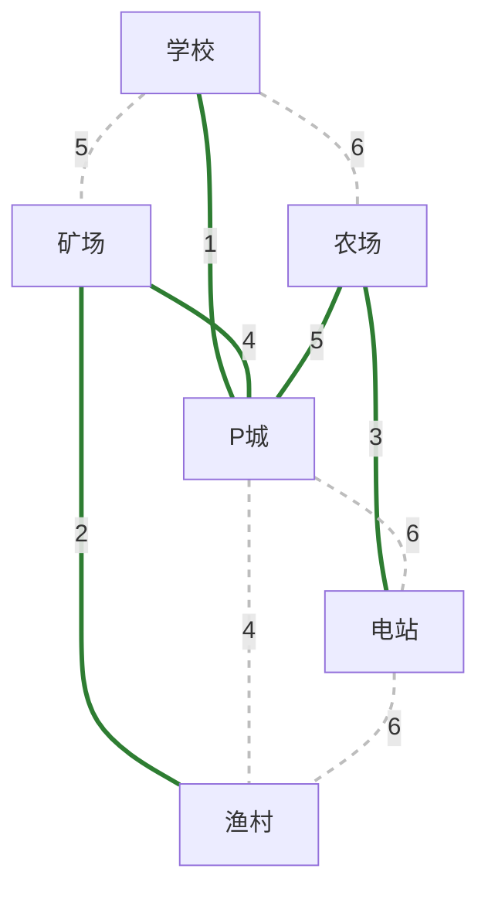

## 1.生成树（Spanning Tree）

连通图的生成树是包含图中全部顶点的一个极小连通子图。
- 全部顶点：生成树必须覆盖原图所有 n  个顶点，不能遗漏。
- 极小连通：边数不能再少，否则图将不再连通。
    - 若图中顶点数为 n ，则它的生成树恰好含有 n−1  条边。
    - 删边：对生成树而言，若砍去它的任意一条边，则会变成非连通图。
    - 加边：若加上一条边，则会形成一个回路（环）。

| 类型                    | 说明                         |
| --------------------- | -------------------------- |
| **广度优先生成树（BFS Tree）** | 从某顶点出发进行广度优先搜索（BFS）得到的生成树。 |
| **深度优先生成树（DFS Tree）** | 从某顶点出发进行深度优先搜索（DFS）得到的生成树。 |

同一个图的生成树不唯一。根据遍历起点和邻接点访问顺序不同，可能得到不同的生成树。

## 2.最小生成树（Minimum Cost Spanning Tree）

在带权连通图中，常遇到这类问题：例如道路规划，要求将所有地方（顶点）连通，且总成本（边权之和）尽可能低。这就是最小生成树问题。

设 G=(V,E) 是一个连通带权无向图，T 是 G 的生成树。T 的各边权值之和称为 T 的权，记为 W(T) 。最小生成树就是 G 中权值 W(T) 最小的生成树。

## 3.Kruskal 算法（克鲁斯卡尔）求最小生成树

Kruskal 算法是一种贪心算法，适用于稀疏图。它的基本思想是：从小到大选择边，保证不形成回路，直到生成树中有 n−1 条边为止。

Kruskal 算法的关键在于如何判断两个顶点是否已连通。这里使用并查集（Disjoint Set Union, DSU）来维护顶点的连通分量。
- Find(x)查找顶点 x 所属的集合（根节点）
- Union(x, y)合并顶点 x 和 y 所在的两个集合
- 路径压缩 + 按秩合并可以将每次操作的时间复杂度优化到接近 O(1) 

所以全过程为：
- 初始化：将每个顶点视为一个独立的集合。
- 将所有边按权值从小到大排序。
- 依次考察每条边 (u, v)：
    - 若 Find(u) ≠ Find(v)（不连通，属于不同集合）：
        - 将该边加入生成树；
        -  Union(u, v)（合并两个集合）。
    - 若 Find(u) = Find(v)（已连通）：
        - 跳过该边，避免形成回路。
- 重复步骤 3，直到已选边数 = n-1。

如下图：

生成过程：
- 第 1 轮：选权值 1（学校-P城）。两顶点原本各自独立，不连通，连起来。集合：{学校, P城}
- 第 2 轮：选权值 2（矿场-渔村）。两顶点各自独立，不连通，连起来。集合：{学校, P城}, {矿场, 渔村}
- 第 3 轮：选权值 3（农场-电站）。两顶点各自独立，不连通，连起来。集合：{学校, P城}, {矿场, 渔村}, {农场, 电站}
- 第 4 轮：选权值 4（矿场-P城）。矿场在 {矿场, 渔村}，P城在 {学校, P城}，不连通，连起来。集合合并为：{学校, P城, 矿场, 渔村}, {农场, 电站}
- 第 5 轮：考察权值 4（P城-渔村）。P城和渔村已在同一集合 {学校, P城, 矿场, 渔村} 中，已连通，跳过！（避免成环）
- 第 6 轮：考察权值 5（学校-矿场）。两者在同一集合，跳过。
- 第 7 轮：考察权值 5（农场-P城）。农场在 {农场, 电站}，P城在 {学校, P城, 矿场, 渔村}，不连通，连起来。此时所有 6 个顶点连通，算法结束。

最终最小生成树：
- 选中的边：学校-P城(1)、矿场-渔村(2)、农场-电站(3)、矿场-P城(4)、农场-P城(5)
- 总权值：1+2+3+4+5=15 
- 边数：6−1=5  条（符合生成树性质）

| 步骤       | 时间复杂度                  | 说明                           |
| -------- | ---------------------- | ---------------------------- |
| 排序所有边    | $O(E \log E)$          | 通常采用快速排序或堆排序                 |
| 并查集操作    | $O(E \cdot \alpha(V))$ | $\alpha$ 为阿克曼函数的反函数，极小，可视为常数 |
| **总复杂度** | **$O(E \log E)$**      | 主要由排序决定                      |

Kruskal 算法更适合 稀疏图（E << V^2），因为它直接对边进行操作，与顶点数关系不大。

## 4.Prim 算法（普里姆）求最小生成树

Prim 算法是一种贪心算法，适用于稠密图。它的基本思想是：从某顶点出发，逐步扩展生成树，每次选择一条权值最小的边，将一个新的顶点加入生成树。
- 每次选择连接"已选顶点集"和"未选顶点集"的权值最小的边
- 面向顶点，每次从"已选集合"向外扩展最小横切边，天然无环
- 时间复杂度：
    - 邻接矩阵 + 简单扫描：O(V^2)
    - 邻接表 + 优先队列（二叉堆）：O(ElogV) 
- 适用场景：更适合稠密图。

