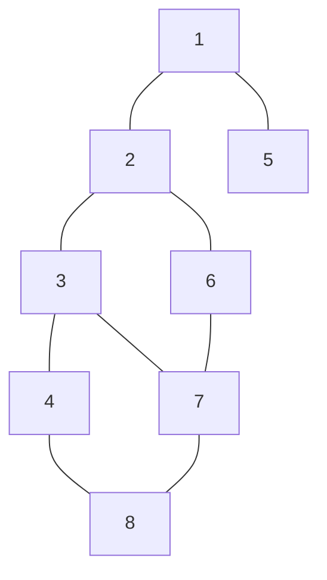
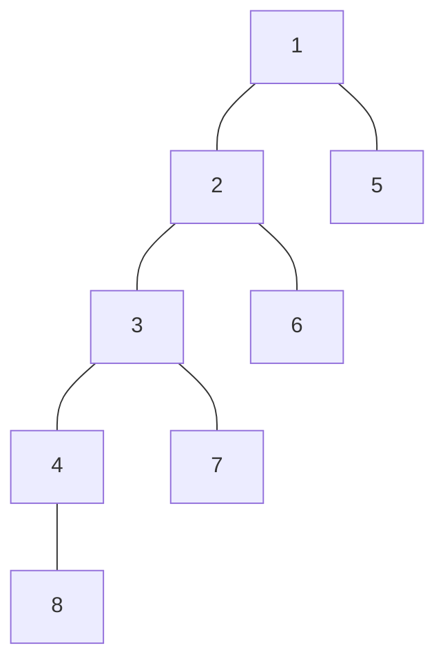
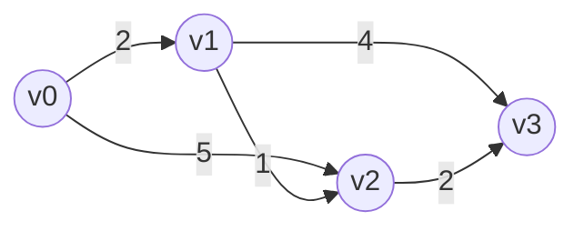
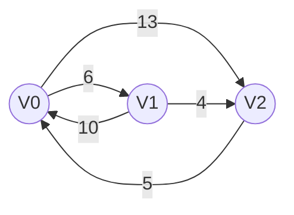

最短路径指从源点到目标点的路径中，边的权重总和最小的的路径。

| 问题类型         | 适用算法       | 适用图类型       |
| ------------ | ---------- | ----------- |
| **单源最短路径**   | BFS算法      | 无权图（或边权全为1） |
| **单源最短路径**   | Dijkstra算法 | 带权图、无权图     |
| **各顶点间最短路径** | Floyd算法    | 带权图、无权图     |

BFS算法天然适合解决无权图的单源最短路径问题。因为 BFS 按"层"扩展，第一次访问到某个顶点时，经过的边数一定是最少的

## 1.BFS算法最短路径

- 无权图可以视为一种特殊的带权图，每条边的权值都为 1。
- BFS 从源点出发，逐层向外扩展。第 k  层访问到的顶点，距离源点的最短路径长度恰好为 k 。
因此，第一次被访问时的距离就是最短距离。

以下图为例：



它的其中一个BFS生成树如下：



| 数组        | 含义                      | 初始值         |
| --------- | ----------------------- | ----------- |
| `d[i]`    | 从源点 $u$ 到顶点 $i$ 的最短路径长度 | `∞`（表示暂不可达） |
| `path[i]` | 顶点 $i$ 在最短路径上的**前驱结点**  | `-1`（表示无前驱） |


在本例中为：
- 从 1 开始，访问邻居 2 和 5 → 加入树边 1-2, 1-5
- 访问 2 的未访问邻居 3 和 6 → 加入 2-3, 2-6
- 访问 5（无新邻居）
- 访问 3 的未访问邻居 4 和 7 → 加入 3-4, 3-7
- 访问 6，邻居 7 已访问，跳过
- 访问 4 的未访问邻居 8 → 加入 4-8
- 访问 7 和 8，所有邻居均已访问，结束
因此生成树的边集为：{1-2, 1-5, 2-3, 2-6, 3-4, 3-7, 4-8}，共 7 条边，连接全部 8 个顶点。

| 顶点 $i$       | 1 | 2  | 3 | 4 | 5 | 6 | 7 | 8 |
| ------------ | - | -- | - | - | - | - | - | - |
| **d\[i]**    | 0 | 1 | 2 | 3 | 1 | 2 | 3| 4|
| **path\[i]** | -1 | 1 | 2 | 3 | 1 | 2 | 3 | 4 |

时间复杂度：
- 每个顶点最多入队、出队各一次：O(∣V∣) 
- 每条边最多被检查一次（邻接表存储）：O(∣E∣) 
- 总时间复杂度：O(∣V∣+∣E∣) 

空间复杂度：
- d[]、path[]、visited[] 数组：O(∣V∣) 
- 队列最多存储 ∣V∣个顶点：O(∣V∣) 
- 总空间复杂度：O(∣V∣) 


## 2.Dijkstra算法最短路径

艾兹格·W·迪杰斯特拉（Edsger Wybe Dijkstra, 1930~2002）
- 1972年图灵奖得主
- 主要贡献横跨多个领域：
    - 操作系统：提出 "goto 有害理论"、信号量机制（PV原语）、银行家算法（死锁避免）、哲学家进餐问题（死锁经典模型）
    - 数据结构：Dijkstra最短路径算法（考研大题/小题高频考点）

算法维护一个已确定最短路径的顶点集合S ，初始时只有源点v0在 S 中。然后重复以下步骤 n−1 轮：
- 选点：从 V−S  中选择距离源点最近（dist最小）的顶点 vi加入 S 
- 松弛：以 vi为中介，检查其所有邻接顶点 vj，尝试更新 vj 的最短距离：$dist[j] = \min(dist[j],\ dist[i] + arcs[i][j])$
- 一旦顶点被加入 S （final标记为true），其最短路径长度即已确定（在非负权图前提下）。
    - Dijkstra一旦将顶点标记为final，就不再允许更新。但负权边的存在使得"已确定"的顶点后续可能被更短路径经过。
    - 结论：Dijkstra算法不适用于有负权值的带权图。负权图应使用 Bellman-Ford算法 或 SPFA算法。

Dijkstra算法通常使用三个核心数组（假设图有 n 个顶点，编号 0∼n−1 ，源点为 v0）

| 数组         | 含义               | 初始值                                            |
| ---------- | ---------------- | ---------------------------------------------- |
| `final[n]` | 标记各顶点是否已找到最短路径   | `final[0]=true`，其余为 `false`                    |
| `dist[n]`  | 当前从源点到该顶点的最短路径长度 | `dist[0]=0`，其余为 `arcs[0][k]`                   |
| `path[n]`  | 路径上的前驱顶点（用于回溯路径） | `path[0]=-1`；若 `arcs[0][k]==∞` 则为 `-1`，否则为 `0` |

初始化：
- final[0] = true，dist[0] = 0，path[0] = -1
- 对其余每个顶点 vk
    - final[k] = false
    - dist[k] = arcs[0][k]（源点到vk的直接距离，无边则为∞）
    - path[k] = (arcs[0][k] == ∞) ? -1 : 0

主循环（共 n−1 轮）:
- 遍历所有顶点，找到满足 final[i]==false 且 dist[i] 最小的顶点 vi
- 令 final[i] = true（vi的最短路径已确定）
- 松弛操作：遍历 vi的所有邻接顶点 vj
    - ​若 final[j] == false 且 dist[i] + arcs[i][j] < dist[j]
    - 则更新：dist[j] = dist[i] + arcs[i][j]，path[j] = i
- 注：arcs[i][j] 表示 vi--vj的弧的权值.

以下图为例：



其邻接矩阵表示为：

```
       v₀  v₁  v₂  v₃
v₀     0   2   5   ∞
v₁     ∞   0   1   4
v₂     ∞   ∞   0   2
v₃     ∞   ∞   ∞   0
```

初始化为：final[0] = true，dist[0] = 0，path[0] = -1

|顶点|final	|dist	|path|
|--|------|------|------|
|v₁	|false	|arcs[0][1] = 2	|0|
|v₂	|false	|arcs[0][2] = 5	|0|
|v₃	|false	|arcs[0][3] = ∞	|-1|

目前状态为:
```
final = [true, false, false, false]
dist  = [0, 2, 5, ∞]
path  = [-1, 0, 0, -1]
```

现在开始第一轮：v₁、v₂、v₃里面，dist最小的是 v₁，选 v₁ 加入 S ，final[1] = true
- 松弛 v₁ 的邻接顶点：
    - v₁ → v₂，权值 1，dist[1] + 1 = 2 + 1 = 3，因为 3 < dist[2] = 5，所以更新
    - v₁ → v₃，权值 4，dist[1] + 4 = 2 + 4 = 6，因为 6 < ∞，所以更新

目前状态为:
```
final = [true, true, false, false]
dist  = [0, 2, 3, 6]
path  = [-1, 0, 1, 1]
```

开始第二轮：v₂、v₃里面，dist最小的是 v₂，选 v₂ 加入 S ，final[2] = true
- 松弛 v₂ 的邻接顶点：
    - v₂ → v₃，权值 2，dist[2] + 2 = 3 + 2 = 5，因为 5 < dist[3] = 6，所以更新

目前状态为:
```
final = [true, true, true, false]
dist  = [0, 2, 3, 5]
path  = [-1, 0, 1, 2]
```

开始第三轮：v₃ 是唯一未加入 S 的顶点，选 v₃ 加入 S ，final[3] = true
- 松弛 v₃ 的邻接顶点（无邻接顶点，跳过）

最终结果：
```
final = [true, true, true, true]
dist  = [0, 2, 3, 5]
path  = [-1, 0, 1, 2]
```

我们可以发现：Dijkstra算法和prim算法非常相似，都是贪心策略，每次选择当前最优解（最短距离或最小权值边），然后更新相关顶点的状态。

其区别在于：
- Dijkstra算法是针对**单源最短路径问题**，每次选择当前距离源点最近的顶点加入集合 S ，然后松弛其邻接顶点。
- Prim算法是针对**最小生成树问题**，每次选择当前权值最小的边加入生成树，然后更新相关顶点的状态。

时间复杂度分析
- 基础实现（数组线性查找）
    - 每一轮：遍历所有顶点找最小值 O(n)  + 遍历邻接点更新 O(n) 
    - 总共 n−1 轮，总时间复杂度 O(n^2)
- 使用优先队列（最小堆）维护未确定顶点的距离：
    - 选点操作降为 O(log∣V∣) 
    - 每条边最多引发一次堆调整
    - 总时间复杂度：O((∣V∣+∣E∣)log∣V∣) 
    - 当图为稀疏图时，堆优化效率显著优于基础实现.


## 3.Floyd算法最短路径

Robert W. Floyd（罗伯特·弗洛伊德），1936–2001，1978 年图灵奖得主。
- 主要贡献：Floyd 算法（Floyd-Warshall 算法）、堆排序算法（Heap Sort）

| 问题类型          | 适用算法      | 适用图类型       |
| ------------- | --------- | ----------- |
| **单源最短路径**    | BFS       | 无权图         |
|               | Dijkstra  | 带权图、无权图     |
| **各顶点间的最短路径** | **Floyd** | **带权图、无权图** |

Floyd 算法用于求解图中任意两顶点之间的最短路径（All-Pairs Shortest Paths）

Floyd 算法采用动态规划（Dynamic Programming）思想，将问题求解分为 n 个阶段（n 为顶点数）：对于 n 个顶点的图 G，求任意一对顶点 Vi-->Vj之间的最短路径，按"允许中转的顶点集合"逐步扩展：

| 阶段       | 允许中转的顶点集合                       | 含义                  |
| -------- | ------------------------------- | ------------------- |
| **#初始**  | 不允许在其他顶点中转                      | 仅保留直接相连的边           |
| **#0**   | 允许在 $V_0$ 中转                    | 尝试经过 $V_0$ 是否能缩短路径  |
| **#1**   | 允许在 $V_0, V_1$ 中转               | 在前一阶段基础上，尝试经过 $V_1$ |
| **#2**   | 允许在 $V_0, V_1, V_2$ 中转          | 尝试经过 $V_2$          |
| **...**  | ...                             | ...                 |
| **#n-1** | 允许在 $V_0, V_1, ..., V_{n-1}$ 中转 | 所有顶点均可作为中转点，得到最终解   |


第 k 阶段的最短路径是在第 k-1 阶段的基础上，考虑"是否经过顶点 Vk 作为中转点"可以缩短路径

Floyd 算法维护两个 n×n 矩阵：
- 距离矩阵 A（Adjacency / Distance Matrix）
    - $A^{(k)}[i][j]$ 表示从顶点 Vi到 Vj只允许经过 V0∼Vk作为中转点时的最短路径长度
    - $A^{(-1)}$即为图的邻接矩阵:
        - 对角线 A[i][i]=0,
        - 有直接边：值为边的权值,
        - 无直接边：值为 ∞ （无穷大）
- 路径矩阵 path（Path / Intermediate Matrix）
    - $path^{(k)}[i][j]$ 表示从 Vi到 Vj的最短路径中，经过的最后一个中转顶点（Vk）编号
    - $path^{(-1)}[i][j]=-1$ 表示从 Vi到 Vj的最短路径没有中转点（要么是直达边，要么不连通）

对于第 k  阶段（考虑顶点 Vk 作为中转点）：

$$
A^{(k)}[i][j] = \min \left( A^{(k-1)}[i][j],\quad A^{(k-1)}[i][k] + A^{(k-1)}[k][j] \right)
$$

我们举一个简单的例子来说明：



初始矩阵如下：

| $A^{(-1)}$ | $V_0$ | $V_1$    | $V_2$ |
| ---------- | ----- | -------- | ----- |
| $V_0$      | 0     | 6        | 13    |
| $V_1$      | 10    | 0        | 4     |
| $V_2$      | 5     | $\infty$ | 0     |

| $path^{(-1)}$ | $V_0$ | $V_1$ | $V_2$ |
| ------------- | ----- | ----- | ----- |
| $V_0$         | -1    | -1    | -1    |
| $V_1$         | -1    | -1    | -1    |
| $V_2$         | -1    | -1    | -1    |


0 阶段：允许在 V0 中转
- V2到 V1 的路径可以经过 V0，长度为 5 + 6 = 11 < ∞，所以更新 A[2][1] = 11，path[2][1] = 0

1 阶段：允许在 V0, V1 中转
- V0到 V2 的路径可以经过 V1，长度为 6 + 4 = 10 < 13，所以更新 A[0][2] = 10，path[0][2] = 1

2 阶段：允许在 V0, V1, V2 中转
- V1到 V0 的路径可以经过 V2，长度为 4 + 5 = 9 < 10，所以更新 A[1][0] = 9，path[1][0] = 2

注意：Floyd算法可以处理带负权边的图，但不能处理有负权回路的图。因为负权回路会导致最短路径长度无限小，无法收敛。

| 指标        | 复杂度      | 说明                  |
| --------- | -------- | ------------------- |
| **时间复杂度** | $O(n^3)$ | 三重循环，每层最多 n 次       |
| **空间复杂度** | $O(n^2)$ | 两个 n×n 矩阵（A 和 path） |


| 特性          | BFS 算法            | Dijkstra 算法 | Floyd 算法       |
| ----------- | ----------------- | ----------- | -------------- |
| **无权图**     | ✓                 | ✓           | ✓              |
| **带权图**     | ✗                 | ✓           | ✓              |
| **带负权值的图**  | ✗                 | ✗           | ✓              |
| **带负权回路的图** | ✗                 | ✗           | ✗              |
| **时间复杂度**   | $O(V+E)$ 或 $O(V)$ | $O(V^2)$    | $O(V^3)$       |
| **通常用于**    | 求无权图的单源最短路径       | 求带权图的单源最短路径 | 求带权图中各顶点间的最短路径 |
