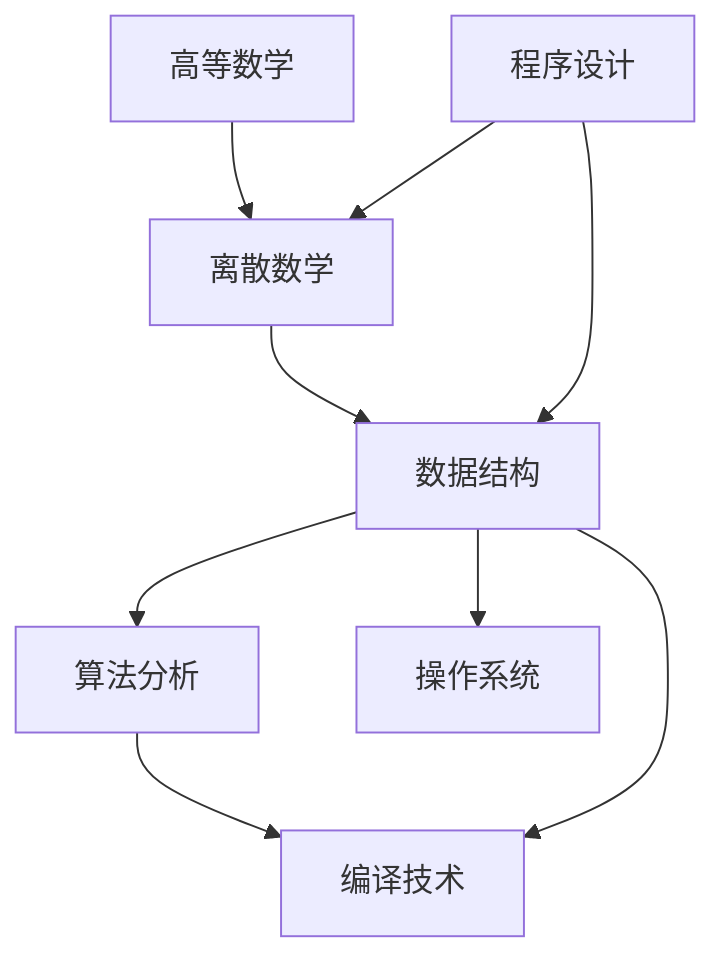
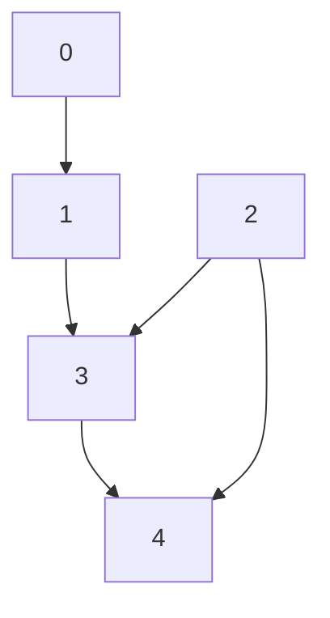

## 1.前置概念与核心定义

AOV 网（Activity On Vertex Network）
- 定义：用 DAG 图（有向无环图） 表示一个工程或流程。
- 顶点：表示活动；有向边 <Vᵢ, Vⱼ>：表示活动 Vᵢ 必须先于活动 Vⱼ 进行（Vᵢ 是 Vⱼ 的前驱，Vⱼ 是 Vᵢ 的后继）。
- 反例警示：若存在 洗番茄 → 切番茄 且 切番茄 → 洗番茄，形成环，则不是 DAG，也就不是 AOV 网（这在工程中通常意味着“死锁”）。

例如下图：



拓扑排序（Topological Sort）
- 严格定义：由 DAG 顶点组成的序列，满足：
    - 每个顶点出现且只出现一次；
    - 若顶点 A 在序列中排在顶点 B 的前面，则在图中不存在从顶点 B 到顶点 A 的路径。
- 直观含义：拓扑排序 = 找到做事的合法先后顺序。
- 非唯一性：每个 AOV 网都有一个或多个拓扑排序序列。当且仅当图中任意时刻入度为 0 的顶点唯一时，拓扑序列才唯一。


## 2.拓扑排序算法（Kahn 算法，基于 BFS 思想）

反复从图中取走入度为 0 的顶点（它没有任何前驱限制，可以立即执行）：
- 初始化栈/队列，将所有入度为 0 的顶点入栈/队；
- 容器非空时循环：
    - 栈顶/队首元素出栈/出队并输出（记入拓扑序列）；
    - 遍历该顶点的所有出边，将其邻接点的入度减 1；若某邻接点入度减为 0，则将其压入栈/队；
- 循环结束后，若输出顶点数 count < 顶点总数，说明有向图中存在回路，排序失败；否则返回 true，排序成功。

| 结构 | 作用 |
|---|---|
| `indegree[]` | 记录当前顶点入度（动态更新） |
| `print[]` | 记录拓扑序列（配合 count 计数） |
| 栈 S / 队列 Q | 保存入度为 0 的顶点（决定输出的相对顺序） |


```c
bool TopologicalSort(Graph G){
    InitStack(S);                       // 初始化栈，存储入度为0的顶点
    for(int i=0; i<G.vexnum; i++)
        if(indegree[i]==0)
            Push(S,i);                  // 将所有入度为0的顶点进栈
    int count=0;                        // 计数，记录当前已经输出的顶点数
    while(!IsEmpty(S)){                 // 栈不空，则存在入度为0的顶点
        Pop(S,i);                       // 栈顶元素出栈
        print[count++]=i;               // 输出顶点i
        for(p=G.vertices[i].firstarc; p; p=p->nextarc){
            // 将所有i指向的顶点的入度减1，并将入度减为0的顶点压入栈S
            v=p->adjvex;
            if(!(--indegree[v]))
                Push(S,v);              // 入度为0，则入栈
        }
    }//while
    if(count < G.vexnum)
        return false;                   // 排序失败，有向图中有回路
    else
        return true;                    // 拓扑排序成功
}
```

如下图所示：



| 步骤 | 出栈 | print[] | indegree[] 变化 | 栈 S |
|---|---|---|---|---|
| 初始 | — | [-1,-1,-1,-1,-1] | [0,1,0,2,2] | [0, 2]（0先入，2后入，2在栈顶）|
| 1 | 2 | [2,...] | 3: 2→1，4: 2→1 | [0] |
| 2 | 0 | [2,0,...] | 1: 1→0 ⇒ 1 入栈 | [1] |
| 3 | 1 | [2,0,1,...] | 3: 1→0 ⇒ 3 入栈 | [3] |
| 4 | 3 | [2,0,1,3,...] | 4: 1→0 ⇒ 4 入栈 | [4] |
| 5 | 4 | [2,0,1,3,4] | — | 空 |

拓扑序列：2 → 0 → 1 → 3 → 4，count = 5 = vexnum，排序成功

## 3.逆拓扑排序

对一个 AOV 网逆拓扑排序：
- 从 AOV 网中选择一个没有后继（出度为 0）的顶点并输出；
- 从网中删除该顶点和所有以它为终点的有向边；
- 重复 ① 和 ② 直到当前的 AOV 网为空。

在 DFS 中，先递归处理完所有后继顶点，再输出当前顶点（即 print 放在 for 循环之后，递归返回时输出），得到的输出序列恰好是逆拓扑序列。


```c
void DFSTraverse(Graph G){              // 对图G进行深度优先遍历
    for(v=0; v<G.vexnum; ++v)
        visited[v]=FALSE;               // 初始化已访问标记数组
    for(v=0; v<G.vexnum; ++v)           // 本代码中是从v=0开始遍历
        if(!visited[v])
            DFS(G,v);
}

void DFS(Graph G,int v){                // 从顶点v出发，深度优先遍历图G
    visited[v]=TRUE;                    // 设已访问标记
    for(w=FirstNeighbor(G,v); w>=0; w=NextNeighbor(G,v,w))
        if(!visited[w]){                // w为v的尚未访问的邻接顶点
            DFS(G,w);
        }//if
    print(v);                           // 【关键】输出顶点（在所有后继处理完之后）
}
```


如下图所示：


| 阶段 | 递归栈 | 逆拓扑序列 |
|---|---|---|
| DFS(0)→DFS(1)→DFS(3)→DFS(4)，4 无未访问邻居，输出 4 | [0(w=1), 1(w=3)] | 4 |
| 回溯到 3，输出 3 | [0(w=1)] | 4 3 |
| 回溯到 1，输出 1 | [0] | 4 3 1 |
| 回溯到 0，输出 0 | 空 | 4 3 1 0 |
| v=2 未访问：DFS(2)，邻居 3 已访问，无未访问邻居，输出 2 | [2] | 4 3 1 0 2 |

## 4.一些补充

时间复杂度
- 邻接表 + 栈/队列（Kahn）：每个顶点入栈/出栈一次，每条边被检查一次 → O(V + E)；
- DFS 实现：同样每条边、每个顶点只访问一次 → O(V + E)；
- 若使用邻接矩阵，寻找邻接点需遍历整行，时间复杂度退化为 O(V²)。


容器选择与字典序控制
- 栈实现（后进先出）：同一时刻多个入度为 0 的顶点时，后入栈的先输出；
- 队列实现（先进先出）：按发现顺序输出，序列更"自然"，是经典的 BFS 写法；
- 优先队列（小根堆）实现：若题目要求字典序最小的拓扑序列，将普通队列替换为小根堆即可（如 LeetCode 207 变体）。

