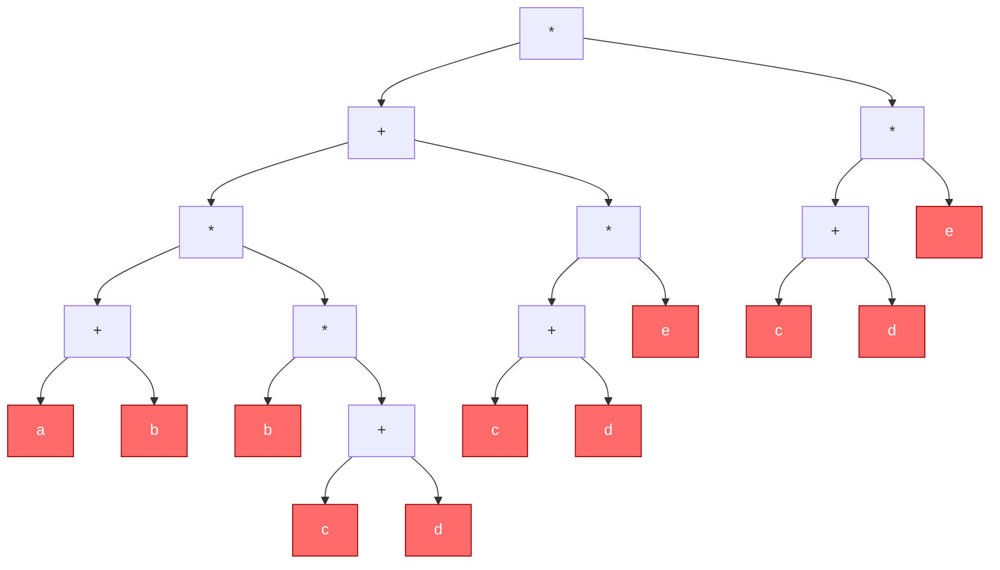
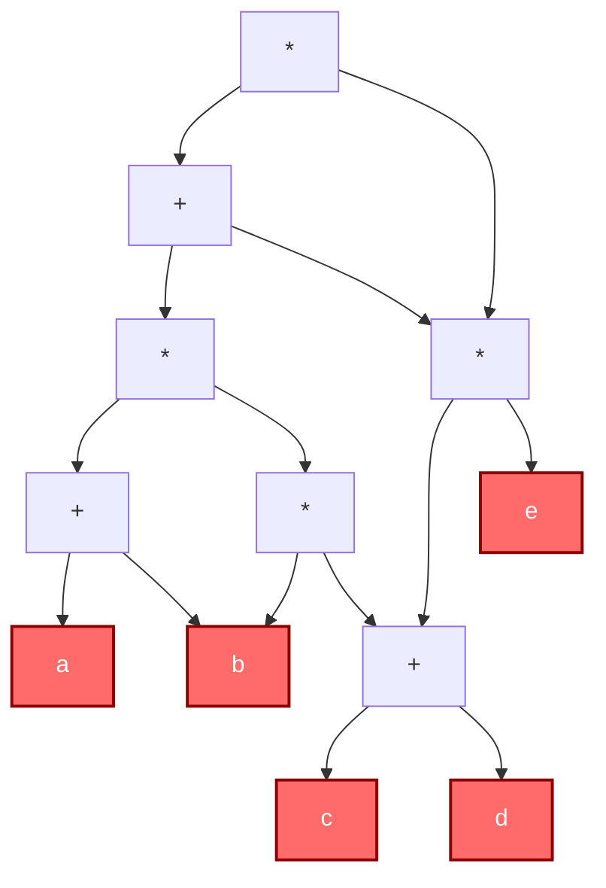

## 1.定义

若一个有向图中不存在环（即不存在从某顶点出发经过若干条边后能回到该顶点的路径），则称为有向无环图，简称 DAG
- 有向图：边具有方向性（用箭头表示）
- 无环：任意顶点不可通过有向边回到自身
- 与有向树不同：DAG 中一个节点可以有多个父节点（即多个节点指向它），这是实现"共享子表达式"的关键

| 对比维度     | 二叉树表示          | DAG 表示                |
| -------- | -------------- | --------------------- |
| **空间效率** | 重复子表达式需要重复创建节点 | 重复子表达式共享同一节点，节省空间     |
| **计算效率** | 重复子表达式会被重复计算   | 重复子表达式只需计算一次，结果可被多处引用 |
| **结构特点** | 严格的树形，子节点不共享   | 图结构，允许子表达式共享（多对一）     |
| **本质**   | 表达式的语法结构       | 表达式的语义等价优化结构          |

DAG 描述表达式本质上是做了公共子表达式消除（CSE, Common Subexpression Elimination）


## 2.构建方法

- 排列操作数：将表达式中涉及的各个操作数不重复地排成一排（作为图的叶子节点/底层）。
- 标注运算顺序：标出各个运算符的生效顺序（即按表达式括号优先级和结合性，确定每个运算符的先后编号）。同等优先级的运算符，先后顺序"有点出入无所谓"，不影响最终 DAG 结构。
- 分层加入运算符：按 Step 2 的顺序，自下而上逐层加入运算符节点，注意分层原则：
    - 每个运算符节点应放在其操作数所在层之上的新层
    - 保持层次清晰，不要跨层混乱放置
- 同层合并（合体）：从底向上逐层检查：同层中是否存在运算符相同且操作数来源相同的节点？
    - 若存在 → 合并为一个节点（让多个父节点共享它）
    - 若不存在 → 保持独立

例如：

```
((a + b) * (b * (c + d)) + (c + d) * e) * ((c + d) * e)
```

绘制二叉树如下：


我们合并相同的叶子结点：



## 3.DAG的一些性质和应用

| 类型        | 全称                         | 应用          | 与 DAG 的关系      |
| --------- | -------------------------- | ----------- | -------------- |
| **DAG**   | 有向无环图                      | 表达式描述、任务依赖  | 基础结构           |
| **AOV 网** | Activity On Vertex Network | 拓扑排序、课程先修关系 | 顶点表示活动，边表示优先关系 |
| **AOE 网** | Activity On Edge Network   | 关键路径、工程调度   | 边表示活动，顶点表示事件   |

表达式 DAG 可以看作一种特殊的 AOV 网：运算符节点是"活动"，操作数依赖是"优先关系"。

DAG 的一个重要性质：一定存在拓扑排序：对表达式 DAG 进行拓扑排序，即可得到该表达式的一种合法求值顺序（保证每个运算符在其操作数都计算完成后才执行）。求拓扑序的方法：
- repeatedly 选择入度为 0 的节点输出
- 删除该节点及其出边
- 循环直至所有节点输出


DAG 描述表达式是编译器基本块优化的核心技术之一：
- 公共子表达式消除（CSE）
    - 如讲义所示，识别并合并重复计算的子表达式
    - 减少指令数量和寄存器压力
- 死代码消除
    - DAG 中没有被任何后续节点引用的子图可以被删除
- 常量折叠
    - 如果 DAG 叶子节点是常量，可以在编译期直接计算
- 寄存器分配
    - DAG 的拓扑序可以作为寄存器分配的依据

