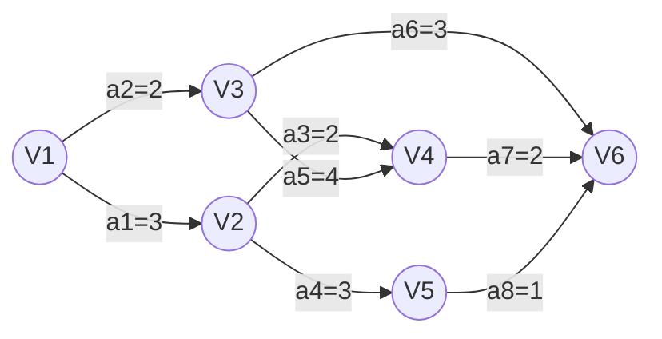

## 1.AOE网

AOE网（Activity On Edge Network）即边表示活动的网络。它是一种带权的有向无环图，用于描述工程项目的进度安排。
- 顶点（Vertex）：表示事件。它标志着指向该顶点的所有活动（前驱活动）已经完成，从该顶点出发的活动（后继活动）可以开始。
- 有向边（Edge）：表示活动。
- 边的权值（Weight）：表示完成该活动所需的开销（如时间）。
- 源点（Source）：入度为0的顶点，表示整个工程的开始。
- 汇点（Sink）：出度为0的顶点，表示整个工程的结束。

AOE网的两个核心性质：
- 只有在某顶点所代表的事件发生后，从该顶点出发的各有向边所代表的活动才能开始。
- 只有在进入某顶点的各有向边所代表的活动都已结束时，该顶点所代表的事件才能发生。

这和AOV网的区别在于：

| 比较维度 | AOV网 | AOE网 |
| :--- | :--- | :--- |
| 节点（顶点） | 表示活动（工序） | 表示事件（时间点/里程碑） |
| 边（弧） | 表示先后顺序（无权重） | 表示活动（工序），且带有权重（持续时间） |
| 主要算法 | 拓扑排序 | 关键路径法（求ve、vl、e、l） |
| 主要目的 | 判断工程是否可行（有无环） | 计算最短工期及赶工重点（关键活动） |
| 是否有权值 | 无权（无权图） | 有权（带权有向图） |

假设你要做一顿“番茄炒蛋”：
- 用AOV网表示：节点是“洗番茄”、“切番茄”、“打鸡蛋”、“炒菜”。边只表示顺序（必须先切番茄才能炒，必须先打鸡蛋才能炒）。它只关心先做什么，后做什么。
- 用AOE网表示：节点是“准备就绪”、“下锅前”、“出锅”。边是活动：“洗切番茄（需5分钟）”、“打蛋液（需2分钟）”、“翻炒（需6分钟）”。它关心的是最短总共需要多少分钟（13分钟），以及“翻炒”是绝对不能拖延的关键活动。

## 2.关键路径相关参数和1计算

关键路径与关键活动定义
- 路径长度：路径上各活动持续时间（权值）之和。
- 关键路径：从源点到汇点的所有路径中，具有最大路径长度的路径。（关键路径可能不止一条）
- 关键活动：关键路径上的活动。
- 工程工期：完成整个工程的最短时间等于关键路径的长度。

**事件 $v_k$ 的最早发生时间 $ve(k)$**：
- 决定了所有从 $v_k$ 开始的活动能够开工的最早时间。
- 计算方法：从源点向汇点方向推（按拓扑排序序列）。
    - $ve(\text{源点}) = 0$
    - $ve(k) = \max \{ ve(j) + \text{Weight}(v_j, v_k) \}$，其中 $v_j$ 是 $v_k$ 的任意前驱。

**事件 $v_k$ 的最迟发生时间 $vl(k)$**：
- 指在不推迟整个工程完成的前提下，该事件最迟必须发生的时间。
- 计算方法：从汇点向源点方向推（按逆拓扑排序序列）。
    - $vl(\text{汇点}) = ve(\text{汇点})$
    - $vl(k) = \min \{ vl(j) - \text{Weight}(v_k, v_j) \}$，其中 $v_j$ 是 $v_k$ 的任意后继。

 **活动 $a_i$ 的最早开始时间 $e(i)$**：
- 等于该活动弧的起点所表示的事件的最早发生时间。
    - $e(i) = ve(k)$

**活动 $a_i$ 的最迟开始时间 $l(i)$**：
- 指在不推迟整个工程完成的前提下，该活动最迟必须开始的时间。
    - $l(i) = vl(j) - \text{Weight}(v_k, v_j)$
    *理解：终点事件的最迟发生时间减去活动持续时间。*

**时间余量**
- $d(i) = l(i) - e(i)$
- 含义：在不增加完成整个工程所需总时间的情况下，活动 $a_i$ 可以拖延的时间。
- 若 $d(i) = 0$，即 $l(i) = e(i)$，则该活动为**关键活动**。

如下图：

根据一个拓扑排序V1-V2-V3-V5-V4-V6，计算各事件的最早发生时间 $ve$：
- $ve(V1) = 0$
- $ve(V2) = ve(V1) + 3 = 3$
- $ve(V3) = ve(V1) + 2 = 2$
- $ve(V5) = ve(V2) + 3 = 6$
- $ve(V4) = \max\{ve(V2) + 2, ve(V3) + 4\} = \max\{5, 6\} = 6$
- $ve(V6) = \max\{ve(V4) + 2, ve(V5) + 1, ve(V3) + 3\} = \max\{8, 7, 5\} = 8$

我们知道，$vl(V6) = ve(V6)$，因为V6是汇点，没有后继活动。

根据逆拓扑排序V6-V4-V5-V3-V2-V1，计算各事件的最迟发生时间 $vl$：
- $vl(V6) = ve(V6) = 8$
- $vl(V4) = \min\{vl(V6) - 2\} = 6$
- $vl(V5) = \min\{vl(V6) - 1\} = 7$
- $vl(V3) = \min\{vl(V4) - 4, vl(V6) - 3\} = \min\{2, 5\} = 2$
- $vl(V2) = \min\{vl(V4) - 2, vl(V5) - 3\} = \min\{4, 4\} = 4$
- $vl(V1) = \min\{vl(V2) - 3, vl(V3) - 2\} = \min\{1, 0\} = 0$

现在对于每个活动 $a_i$，我们可以计算其最早开始时间 $e(i)$ 和最迟开始时间 $l(i)$：
- 活动$a1$：
    - $e(a1) = ve(V1) = 0$
    - $l(a1) = vl(V2) - a1 = 4 - 3 = 1$
    - $d(a1) = l(a1) - e(a1) = 1 - 0 = 1$

- 活动$a2$：
    - $e(a2) = ve(V1) = 0$
    - $l(a2) = vl(V3) - a2 = 2 - 2 = 0$
    - $d(a2) = l(a2) - e(a2) = 0 - 0 = 0$，$a2$为关键活动。

- 活动$a3$：
    - $e(a3) = ve(V2) = 3$
    - $l(a3) = vl(V4) - a3 = 6 - 2 = 4$
    - $d(a3) = l(a3) - e(a3) = 4 - 3 = 1$

- 活动$a4$：
    - $e(a4) = ve(V2) = 3$
    - $l(a4) = vl(V5) - a4 = 7 - 3 = 4$
    - $d(a4) = l(a4) - e(a4) = 4 - 3 = 1$

- 活动$a5$：
    - $e(a5) = ve(V3) = 2$
    - $l(a5) = vl(V6) - a5 = 6 - 4 = 2$。
    - $d(a5) = l(a5) - e(a5) = 2 - 2 = 0$，$a5$为关键活动。

- 活动$a6$：
    - $e(a6) = ve(V3) = 2$
    - $l(a6) = vl(V6) - a6 = 8 - 3 = 5$
    - $d(a6) = l(a6) - e(a6) = 5 - 2 = 3$，

- 活动$a7$：
    - $e(a7) = ve(V4) = 6$
    - $l(a7) = vl(V6) - a7 = 8 - 2 = 6$
    - $d(a7) = l(a7) - e(a7) = 6 - 6 = 0$，$a7$为关键活动。

我们可以得知工期最短为8天，关键活动为$a2$、$a5$、$a7$，关键路径为V1-V3-V4-V6。

