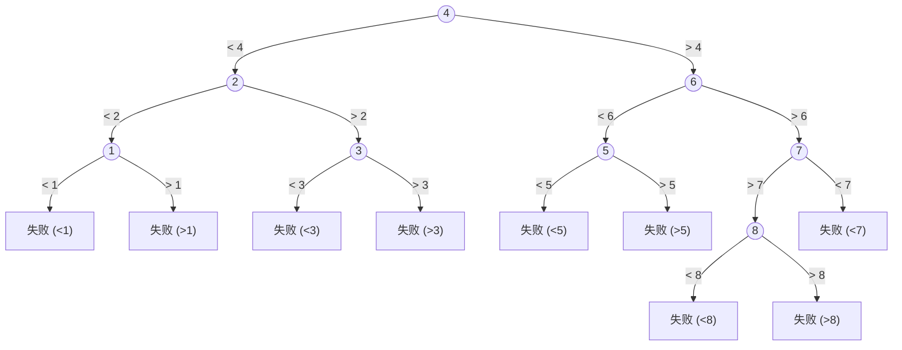

## 1. 顺序查找（Sequential Search）

顺序查找，又称线性查找，是所有查找算法中最基础、最直观的一种查找算法。

从线性表的一端开始，逐个将记录的关键字与给定值（Key）进行比较。若相等，则查找成功；若扫描完整个表仍未找到，则查找失败

其核心哲学是“以时间换通用性”。它不依赖于数据的任何先验知识（如是否有序），也不依赖于存储结构（顺序或链式），因此具有最广泛的适用性。这种“暴力”的遍历方式，使其成为在数据量小或数据无序时的默认选择

### 1.1 朴素实现 (Naive Implementation)

查找表定义:

```c
typedef struct {
    ElemType *elem;   // 动态数组基址
    int TableLen;     // 表的长度
} SSTable;
```

朴素顺序查找:

```c
int Search_Seq_Naive(SSTable ST, ElemType key) {
    int i;
    // 循环条件包含两个判断：1. 是否越界 2. 是否找到
    for (i = 0; i < ST.TableLen && ST.elem[i] != key; ++i);
    
    // 查找成功返回下标，失败返回-1
    return (i == ST.TableLen) ? -1 : i;
}
```

在每一次循环迭代中，CPU都需要执行两次条件判断 (i < ST.TableLen 和 ST.elem[i] != key)。当数据量 n 很大时，这 n 次额外的边界检查会带来不可忽视的开销

### 1.2 哨兵优化实现 (Sentinel Optimization) 

这是一种精巧的优化技巧，旨在减少循环内的比较次数

```c
// 哨兵顺序查找 (数据从下标1开始存储)
int Search_Seq_Sentinel(SSTable ST, ElemType key) {
    ST.elem[0] = key; // 1. 设置“哨兵”：将待查关键字存入0号位置
    int i;
    // 2. 从表尾开始向前查找，循环条件只有一个判断
    for (i = ST.TableLen; ST.elem[i] != key; --i);
    
    // 3. 返回下标：若返回0则失败，否则成功
    return i; 
}
```

其性质如下：
- 免去越界检查：由于 0 号位置被设置为 key，循环最坏的情况也会在下标 i=0 处因 ST.elem[0] == key 而终止。这保证了循环必然会结束，从而省去了 i >= 1 的边界判断。
- 减少比较次数：循环条件从两个 (i < len && elem[i] != key) 减少到一个 (elem[i] != key)。在数据量巨大时，这节省了近一半的循环判断开销，显著提升了执行效率。
- 前提条件：此优化要求数据元素从下标 1 开始存储，预留出 0 号位置作为“哨兵岗”。

### 1.3 平均查找长度 (ASL) 分析

查找成功时的 ASL
- 前提：假设查找每个元素的概率相等，即 Pi = 1/n。
- 比较次数：查找第1个元素需比较1次，第2个需2次，...，第 n 个需 n 次。
- ASL_成功 = (1/n) * (1 + 2 + ... + n) = (1/n) * [n(n+1)/2] = (n+1)/2
- 结论：在等概率情况下，顺序查找成功时，平均需要比较表长一半的元素。

查找失败时的 ASL（无序）
- 由于元素无序，无法提前判断目标值是否存在。必须扫描完整个表（n 个元素）才能断定查找失败。
- ASL_失败：比较次数恒为 n (或 n+1，取决于实现细节，文档中取 n+1)。效率极低

查找成功时的 ASL（有序）：
- 假设表为递增有序。在查找过程中，如果当前元素 elem[i] 已经大于目标值 key，那么 key 必然不存在于表中（因为后续元素都比 elem[i] 大）。此时可以立即终止查找，判定失败。
- ASL_成功依旧约等于 (n+1)/2
- 有序表的 n+1 个失败情况，其比较次数分别为 1, 2, ..., n-1, n, n。
- ASL_失败 = (1 + 2 + ... + (n-1) + n + n) / (n+1) = (n(n-1)/2 + 2n) / (n+1) = n/2 + n/(n+1)
- 结论：对于有序表，查找失败的 ASL 从 O(n) 降低到了约 n/2，效率提升近一倍。这是利用数据“有序性”带来的巨大优势

我们在计算时可以引入查找判定树(Search Decision Tree)来辅助分析查找效率,详见补充文档"[数据结构\7.查找\7.2p1-查找判定树.md](7.2p1-%E6%9F%A5%E6%89%BE%E5%88%A4%E5%AE%9A%E6%A0%91.md)"


## 2.折半查找（Binary Search）

折半查找，又称“二分查找”，仅适用于有序的顺序表（数组）。链表不支持随机访问，无法使用折半查找。

核心思想：
- 在有序表中，取中间位置 mid 的记录作为比较对象。
- 若给定值 key 等于 mid 位置的关键字，则查找成功。
- 若 key 小于 mid 位置的关键字，则在前半部分继续查找。
- 若 key 大于 mid 位置的关键字，则在后半部分继续查找。
- 重复上述过程，直到查找成功或查找范围为空（low > high）为止。

### 2.1 算法实现

指针定义：
- low：查找范围的下界（初始为 0）。
- high：查找范围的上界（初始为 TableLen - 1）。
- mid：中间位置，计算公式为 mid = (low + high) / 2（向下取整）。

查找逻辑：
- 循环条件：while (low <= high)
- 比较：
    - L.elem[mid] == key：返回 mid（成功）。
    - L.elem[mid] > key：high = mid - 1（向左找）。
    - L.elem[mid] < key：low = mid + 1（向右找）。
- 失败：循环结束仍未找到，返回 -1

### 2.2 分析时间复杂度和平均查找长度

以有序表 [1, 2, 3, 4, 5, 6, 7] 为例，mid = floor((low + high) / 2)



- 平衡性：折半查找的判定树一定是平衡二叉树。
- 结点数关系：对于任意结点，其右子树结点数与左子树结点数之差为 0 或 1。
    - 若区间元素个数为奇数：左右子树元素个数相等。
    - 若区间元素个数为偶数：右子树比左子树多 1 个元素（当 mid = floor((low+high)/2) 时）。
- 树高：含n个元素的折半查找树的树高为log2(n+1)。

性能分析：
- 时间复杂度：O(log2(n))
- ASL(成功)：<= h
- ASL(失败)：<= h

## 3.分块查找（Block Search）

### 3.1 算法实现

在文件/顺序表之上，建立一张索引表（Index Table），其中每个索引项记录两块信息：

| 字段          | 含义                             |
| ----------- | ------------------------------ |
| `maxValue`  | 本分块的**最大关键字**                  |
| `low, high` | 本分块在底层顺序表中的**存储区间（起始下标与结束下标）** |


```c
// 索引表
typedef struct {
    ElemType maxValue;   // 该分块内元素的最大值
    int low, high;       // 该分块在顺序表中的区间
} Index;

// 顺序表存储实际元素
ElemType List[100];
```

我们要求：
- 每一个分块（Block）内部，元素之间不要求有序，即块内元素可以任意存放；
- 但块与块之间必须有序：第 i 块中所有元素的关键字都小于第 i+1 块中所有元素的关键字（等价于：第 i 块的最大值 < 第 i+1 块的最大值，且索引表中按各块最大关键字从小到大排列）

例如：

```
底层顺序表 List：下标 0 ~ 13
┌───┬───┬───┬───┬───┬───┬───┬───┬───┬───┬───┬───┬───┬───┐
│ 7 │10 │13 │19 │16 │20 │27 │22 │30 │40 │36 │43 │50 │48 │
└───┴───┴───┴───┴───┴───┴───┴───┴───┴───┴───┴───┴───┴───┘
  0   1   2   3   4   5   6   7   8   9  10  11  12  13
```

改为分块索引表

```
索引表（5 块）：
┌─────┬─────┬─────┬─────┬─────┐
│ 10  │ 20  │ 30  │ 40  │ 50  │   ← 各块 maxValue
├─────┼─────┼─────┼─────┼─────┤
│0,1  │2,5  │6,8  │9,10 │11,13│   ← 各块存储区间
│     │     │     │     │     │
└─────┴─────┴─────┴─────┴─────┘
  0     1     2     3     4       ← 索引表下标
```

查找过程：
- 第一级：在索引表中查找，确定目标若存在，必落在哪一块：
    - 顺序扫描索引表，找到第一个满足 maxValue ≥ key 的索引项（在索引表有序的前提下也可用折半查找）。
    - 若所有索引项 maxValue < key，则查找失败，直接结束。
- 第二级：在确定的块内查找：
    - 根据该索引项记录的 [low, high] 区间，在该块内部做顺序查找（块内无序，只能用顺序查找）。
    - 命中则成功；若块内查完仍未命中，则失败。

比如查找 $key = 22$ ：
- 找到maxValue >= 22的索引项为第3块，即[6,8]
- 在第3块内查找，找到22，成功。

### 3.2 分析时间复杂度和平均查找长度

- n：表中元素总数；
- b：分块数；
- s：每块元素个数（为简化先假设每块等长，n = b × s）

查找某个元素的总比较次数 = 索引表中查找该块所需次数 + 块内查找该元素所需次数：ASL=ASL(B)+ASL(S)
- ASL(B)：索引表中查找该块平均所需次数。
- ASL(S)：块内查找该元素平均所需次数。

两级都用顺序查找，索引表长为 b，块长为 s，等概率时：
- ASL(B) = (b+1)/2（对 b 个索引项顺序查找的平均长度）
- ASL(S) = (s+1)/2（对 s 个元素顺序查找的平均长度）
- $ASL = \frac{b+1}{2} + \frac{s+1}{2} = \frac{1}{2}\left(\frac{n}{s} + s\right) + 1$
    - 对 s 求极值（或直接用均值不等式）：当 s = √n 时 ASL 取最小值：$ASL_{\min} = \sqrt{n} + 1$
    - 最优分块是让每块大小约等于 √n（块数也约等于 √n），此时时间复杂度为 O(√n)，优于顺序查找的 O(n)，差于折半查找的 O(log n)

索引表用折半查找、块内顺序查找(索引表长度 b 通常不大且严格有序，适合折半)：
- ASL = ASL(B) + ASL(S) = $\lceil \log_2(b+1) \rceil + \frac{s+1}{2}$

若索引表本身也较大，可对索引表再分块（多级索引），这就是数据库中 B+ 树多层索引思想的雏形。

| 维度 | 分析                                                                         |
| -- | -------------------------------------------------------------------------- |
| 优点 | ① 在块内无序的前提下，比纯顺序查找快得多（O(√n)）；② 插入、删除只需在块内进行（若块不满），**无需整体移动大量元素**，适合动态变化的数据 |
| 缺点 | ① 需要额外存储索引表，空间开销 O(b)；② 块满时需要"裂块"，维护索引表有额外代价；③ 静态数据下效率仍不及折半查找              |


|         | 顺序查找          | 折半查找                  | 分块查找                  |
| ------- | ------------- | --------------------- | --------------------- |
| 数据结构要求  | 任意（顺序/链式）     | **顺序存储 + 整体有序**       | 顺序存储 + **块间有序**（块内无序） |
| 平均比较次数  | (n+1)/2 ≈ n/2 | log₂(n+1) − 1 ≈ log₂n | √n + 1（最优分块、两级顺序）     |
| 时间复杂度   | O(n)          | O(log n)              | **O(√n)**             |
| 插入删除适应性 | 链表好           | 差（需移动）                | **较好（块内局部操作）**        |
| 存储开销    | 无             | 无                     | 需索引表                  |


