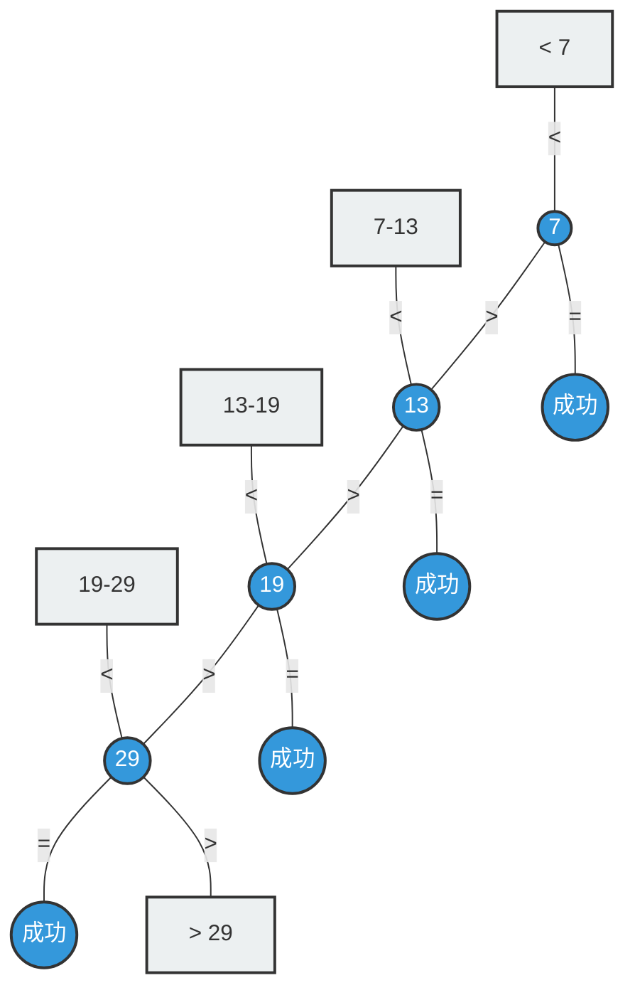

## 1.定义与使用

查找判定树 (Search Decision Tree)用树形结构，清晰地描绘了查找算法在寻找一个目标值时，所有可能经历的比较路径和最终结果。
- 圆形节点（内部节点）：代表一次成功的查找。节点里的值就是表中实际存在的元素。
- 方形节点（外部/失败节点）：代表一次失败的查找。它不是一个真实存在的值，而是一个“空隙”或一个范围，表示目标值如果落在这里，查找就会失败。
- 从任意圆形节点出发
    - < 分支指向“小于”的路径
    - = 分支代表查找成功，路径终止
    - \> 分支指向“大于”的路径

顺序查找的判定树非常特殊，它不是一棵平衡的树，而是一条严重向右（或向左）倾斜的单链。这是由顺序查找“挨个比较”的线性思想决定的。

以一个有序表 {7, 13, 19, 29} 为例

成功查找：要找到 19，需要依次比较 7、13、19，共 3 次。这正好对应了节点 19 在判定树中的层数。

失败查找：要确定 15 不存在（它位于 13 和 19 之间），需要依次比较 7、13，然后发现 15 < 19，从而进入失败节点 F2。共比较了 3 次。这正好对应了失败节点 F2 的父节点（即 19）所在的层数。

## 2.一些补充

通过这棵“偏科”的判定树，我们可以深刻理解顺序查找的性能瓶颈：
- 树的高度 = 最坏情况：判定树的高度为 n，这意味着最坏情况下（查找最后一个元素或查找失败），需要进行 n 次比较。时间复杂度为 O(n)。
- 不平衡是效率低下的根源：理想的查找树（如二分查找的判定树）是平衡的，高度为 log₂n。而顺序查找的判定树退化成了一条链，高度为 n。这直观地解释了为什么顺序查找在数据量大时效率很低。
- 有序性的价值：正是因为表是有序的，我们才能构建出这样一棵有意义的判定树，并清晰地定义出 n+1 个失败区间。如果是无序表，一旦开始比较，除了“相等”和“不相等”外，无法得出“大于”或“小于”的有效信息来引导搜索，也就无法构建出这样结构清晰的判定树来分析失败的 ASL。