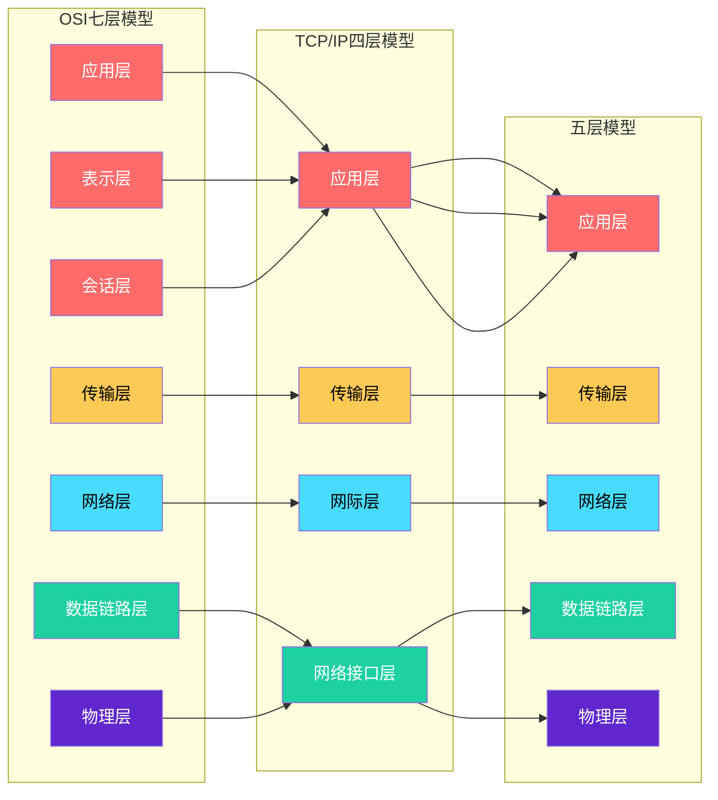
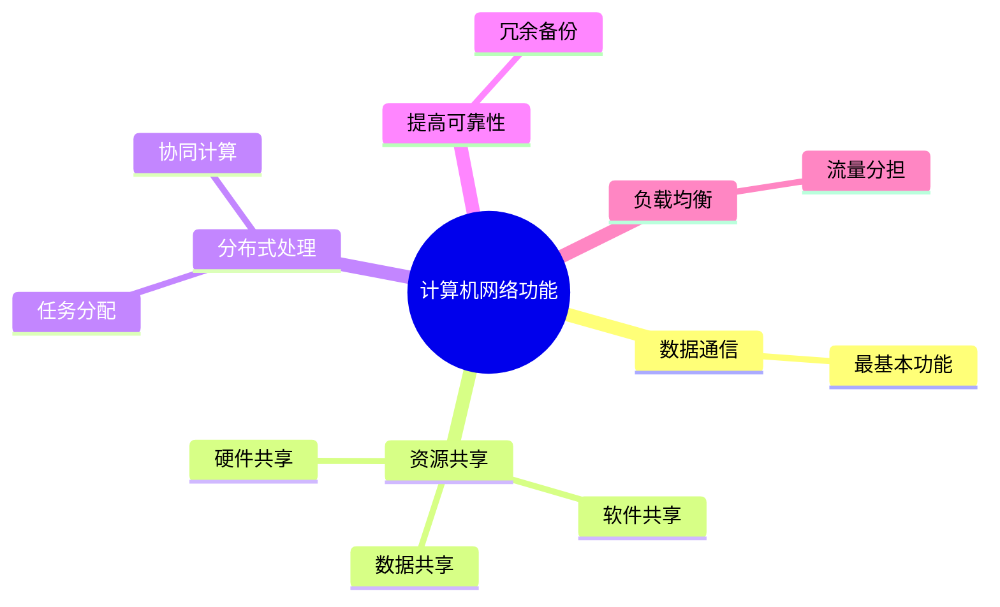
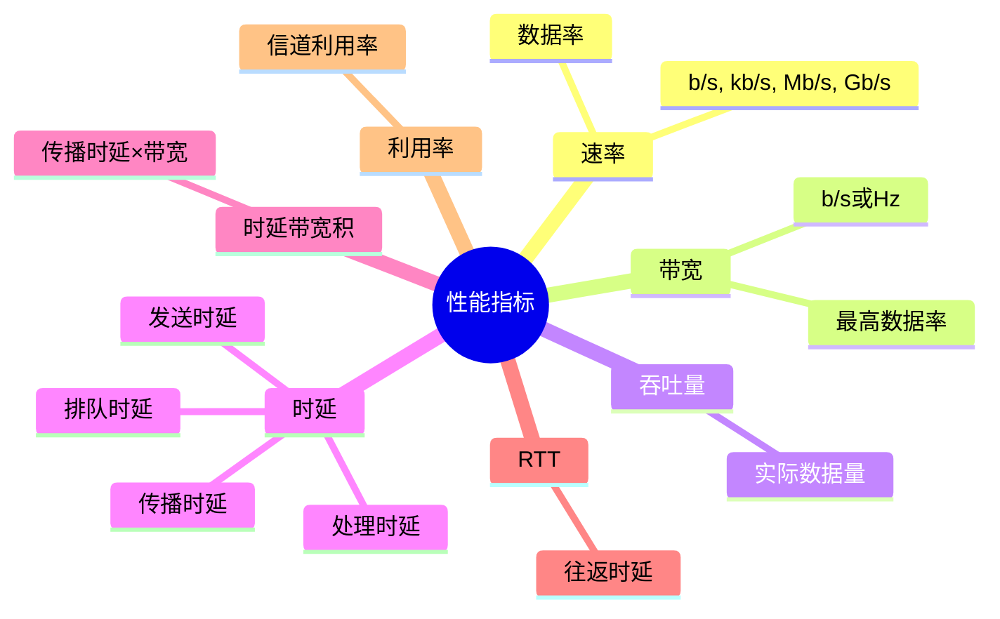
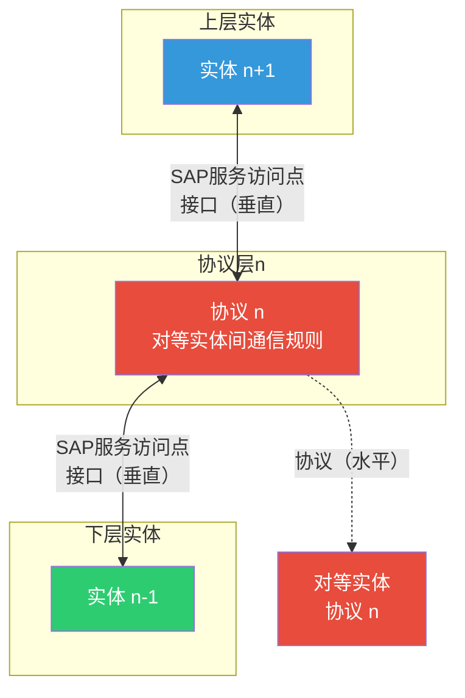

## 1.计算机网络的概念

定义：将分布在不同地理位置的、具有独立功能的多台计算机及其外部设备，通过通信线路连接起来，在网络操作系统、网络管理软件及网络通信协议的管理和协调下，实现资源共享和信息传递的计算机系统。
> 连通性（Connectivity）：使上网用户之间可以交换信息

> 共享（Sharing）：资源共享（硬件、软件、数据）

> 传递（Transmission）：信息在不同计算机之间的传递

| 层次        | 核心功能                | 数据单位               | 关键设备/协议      |
| --------- | ------------------- | ------------------ | ------------ |
| **物理层**   | 透明传输比特流             | 比特(bit)            | 中继器、集线器      |
| **数据链路层** | 成帧、差错控制、流量控制、介质访问控制 | 帧(frame)           | 网桥、交换机、网卡    |
| **网络层**   | 路由选择、拥塞控制、异构网络互联    | 数据报/分组(packet)     | 路由器、IP       |
| **传输层**   | 端到端可靠/不可靠传输、复用分用    | 报文段(segment)/用户数据报 | TCP、UDP      |
| **应用层**   | 为特定应用提供协议支持         | 报文(message)        | HTTP、FTP、DNS |

## 2.计算机网络的组成

| 组成部分   | 说明                                      |
| ------ | --------------------------------------- |
| **硬件** | 主机（端系统）、通信链路（双绞线、光纤、无线电波）、交换设备（路由器、交换机） |
| **软件** | 网络操作系统、网络协议软件、应用软件                      |
| **协议** | 网络通信的规则集合（语法、语义、同步）                     |

按工作方式分类：
- 边缘部分：由所有连接在互联网上的主机组成，用户直接使用（C/S方式、P2P方式）
- 核心部分：由大量网络和连接网络的路由器组成，为边缘部分提供服务

## 3.计算机网络的功能

- 数据通信（最基本功能）
- 资源共享
- 分布式处理
- 提高可靠性
- 负载均衡

## 4.计算机网络的分类

| 分类标准      | 类型                            | 特点                  |
| --------- | ----------------------------- | ------------------- |
| **按分布范围** | 广域网WAN、城域网MAN、局域网LAN、个人区域网PAN | WAN使用交换技术，LAN使用广播技术 |
| **按使用者**  | 公用网、专用网                       |                     |
| **按交换技术** | 电路交换、报文交换、分组交换                | 核心考点！(见下方表格详细说明)               |
| **按拓扑结构** | 总线型、星型、环型、网状型                 |                     |
| **按传输技术** | 广播式网络、点对点网络                   |                     |

| 交换方式     | 原理              | 优点            | 缺点             | 适用场景    |
| -------- | --------------- | ------------- | -------------- | ------- |
| **电路交换** | 建立专用物理通路，通信期间独占 | 传输时延小、实时性强    | 建立连接时间长、信道利用率低 | 电话网络    |
| **报文交换** | 整个报文存储转发        | 无需建立连接、信道利用率高 | 转发时延大、对设备要求高   | 早期电报    |
| **分组交换** | 报文切分成分组，独立存储转发  | 高效、灵活、可靠      | 有一定时延、需要额外开销   | 互联网（主流） |

分组交换的两种方式：
- 数据报：无连接，每个分组独立路由（如IP）
- 虚电路：面向连接，先建立逻辑连接（如ATM、X.25）

按分布范围:

1.局域网（LAN）：  
   在某一地理区域内由计算机、服务器以及各种网络设备组成的网络。局域网的覆盖范围一般是方圆几千米以内。  
   典型的局域网有：一家公司的办公网络，一个网吧的网络，一个家庭网络等。  
2.城域网（MAN）：  
   在一个城市范围内所建立的计算机通信网络。  
   典型的城域网有：宽带城域网、教育城域网、市级或省级电子政务专网等。  
3.广域网（WAN）：  
  通常覆盖很大的地理范围，从几十公里到几千公里。  
  它能连接多个城市甚至国家，并能提供远距离通信，形成国际性的大型网络。  
  典型的广域网有：Internet（因特网）。

按拓扑（**网络拓扑 = 网络设备 + 传输介质**）类型：

- 星型网络：  
  所有节点通过一个中心节点连接在一起。  
  优点：容易在网络中增加新的节点。通信数据必须经过中心节点中转，易于实现网络监控。  
  缺点：中心节点的故障会影响到整个网络的通信。  
- 总线型网络：  
  所有节点通过一条总线（如同轴电缆）连接在一起。  
  优点：安装简便，节省线缆。某一节点的故障一般不会影响到整个网络的通信。  
  缺点：总线故障会影响到整个网络的通信。某一节点发出的信息可以被所有其他节点收到，安全性低。  
- 环型网络：    
  所有节点连成一个封闭的环形。  
  优点：节省线缆。  
  缺点：增加新的节点比较麻烦，必须先中断原来的环，才能插入新节点以形成新环。  
- 树型网络：  
  树型结构实际上是一种层次化的星型结构。  
  优点：能够快速将多个星型网络连接在一起，易于扩充网络规模。  
  缺点：层级越高的节点故障导致的网络问题越严重。
- 全网状网络：  
  所有节点都通过线缆两两互联。  
  优点：具有高可靠性和高通信效率。  
  缺点：每个节点都需要大量的物理端口，同时还需要大量的互连线缆。成本高，不易扩展。  
- 部分网状网络：  
  只是重点节点之间才两两互连。  
  优点：成本低于全网状网络。  
  缺点：可靠性比全网状网络有所降低。四不像  

## 5.计算机网络的性能指标

| 指标          | 符号 | 定义               | 单位                    |
| ----------- | -- | ---------------- | --------------------- |
| **速率/数据率**  | R  | 单位时间内传输的数据量      | b/s, kb/s, Mb/s, Gb/s |
| **带宽**      | B  | 单位时间内信道能通过的最高数据率 | b/s（或Hz）              |
| **吞吐量**     |    | 单位时间内通过某网络的实际数据量 | b/s                   |
| **时延**      |    | 数据从网络一端到另一端所需时间  | s, ms, μs             |
| **时延带宽积**   |    | 传播时延 × 带宽        | bit                   |
| **往返时延RTT** |    | 发送方发送数据到收到确认的时间  | s, ms                 |
| **利用率**     | U  | 信道利用率/网络利用率      | 百分比                   |

## 6.协议、服务、接口
| 概念         | 定义                       |
| ---------- | ------------------------ |
| **实体**     | 任何可发送或接收信息的硬件或软件进程       |
| **协议**     | 控制两个对等实体进行通信的规则的集合（水平方向） |
| **服务**     | 下层为上层提供的功能（垂直方向）         |
| **接口/SAP** | 相邻两层之间交换信息的连接点           |

协议的三要素：
- 语法：数据与控制信息的结构或格式
- 语义：需要发出何种控制信息、完成何种动作、做出何种响应
- 同步（时序）：事件实现顺序的详细说明
