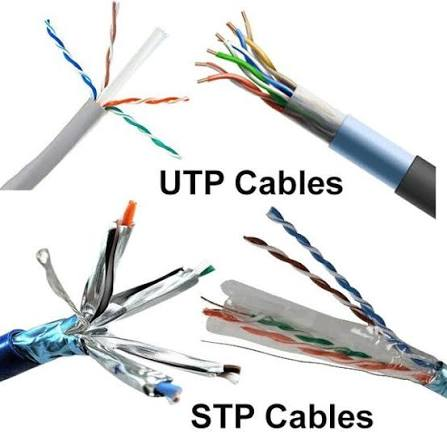
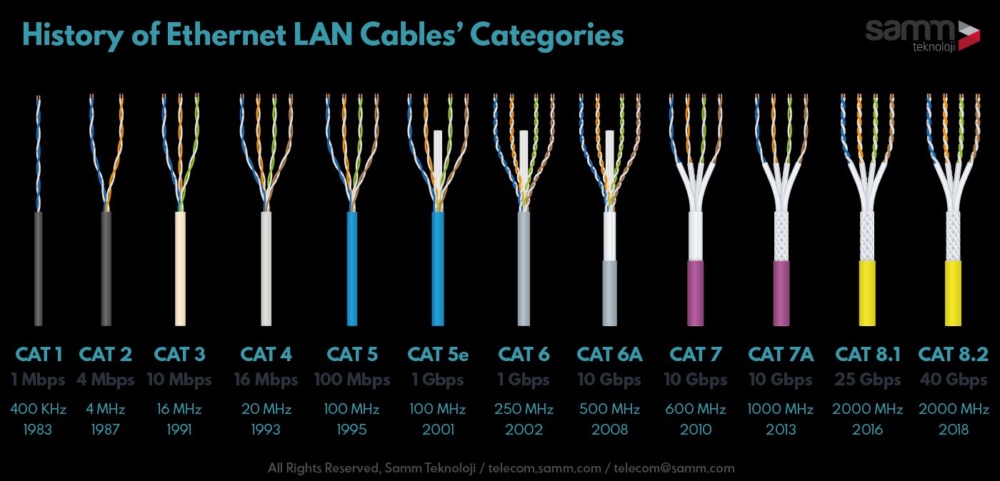
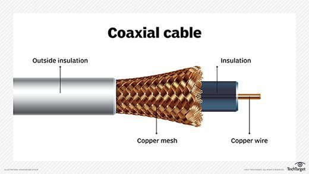
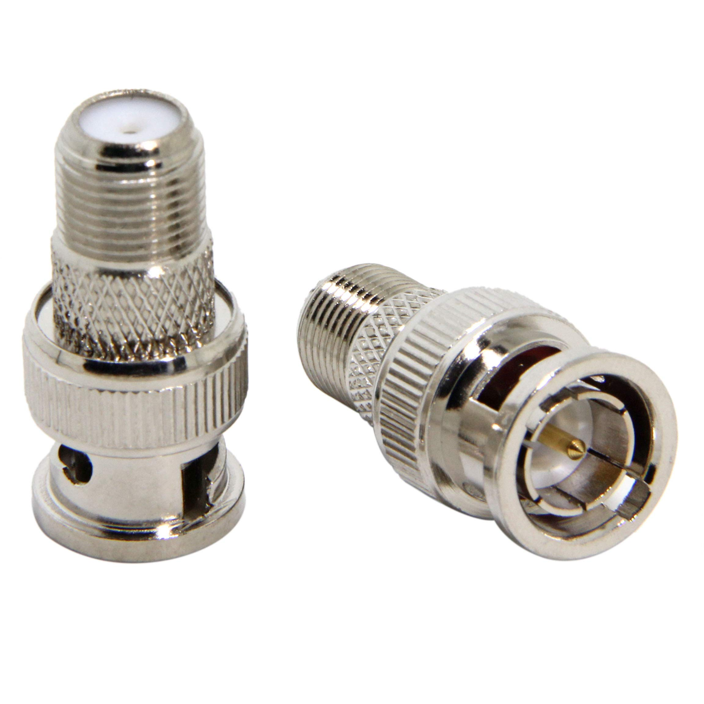
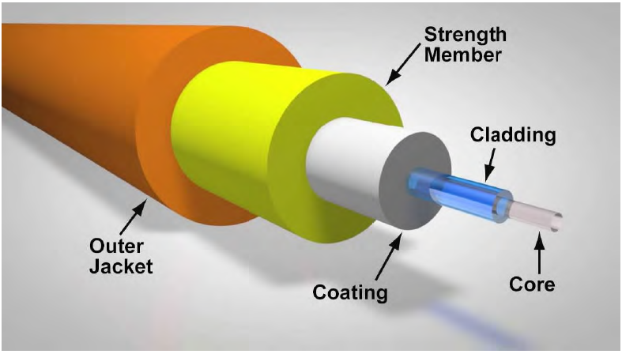
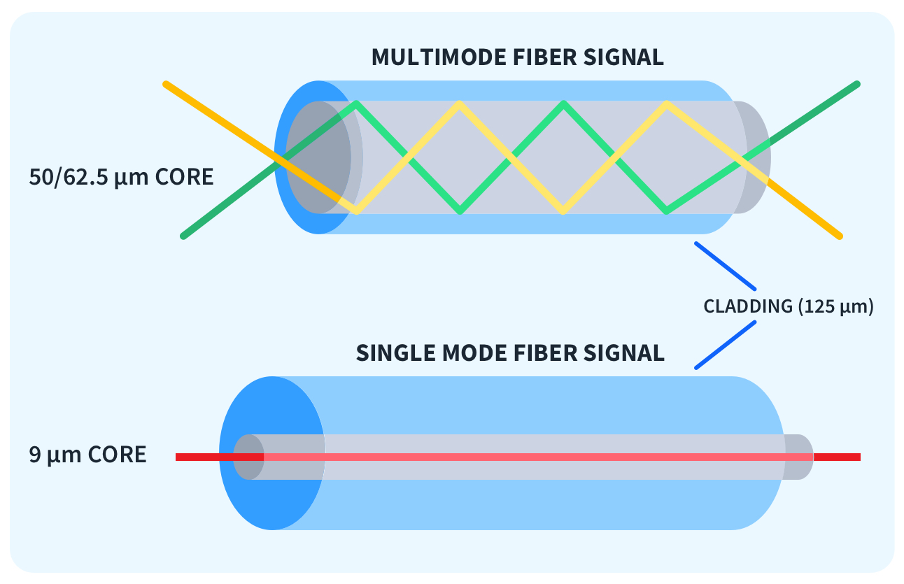
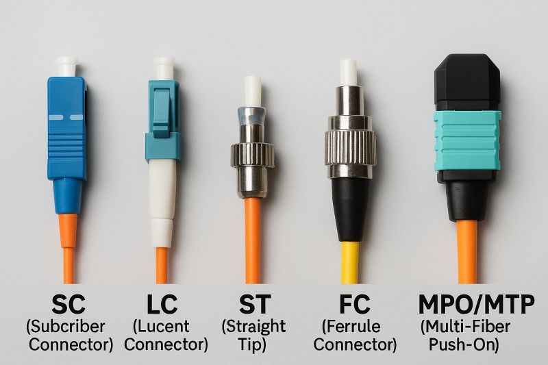
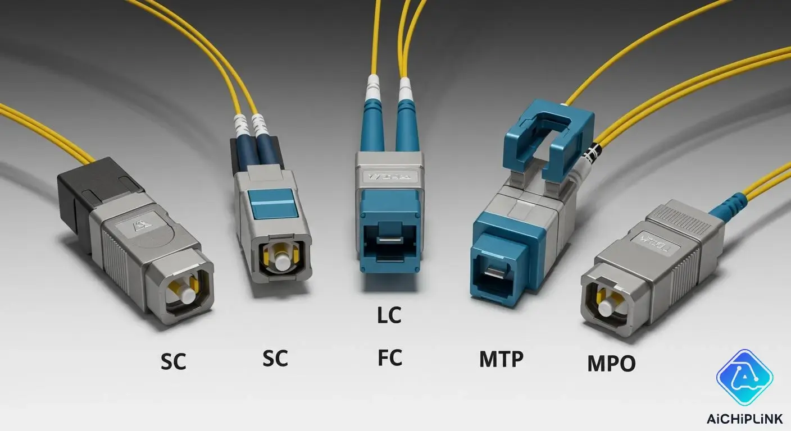

| 介质       | 结构             | 特点              | 应用                 |
| -------- | -------------- | --------------- | ------------------ |
| **双绞线**  | 两根绝缘铜线绞合       | 便宜、易安装、抗干扰一般    | 以太网（最常用）           |
| **同轴电缆** | 铜芯+绝缘层+屏蔽层+外护套 | 抗干扰强、带宽高        | 有线电视（75Ω）、局域网（50Ω） |
| **光纤**   | 光导纤维传递光脉冲      | 带宽极大、损耗小、抗干扰、保密 | 主干网、长途通信           |
| **无线**   | 无线电波传递信息      | 无物理连接、可移动、成本高 | 无线网络、移动通信       |
| **红外**   | 红外线传递信息      | 无物理连接、可移动、成本高 | 红外通信、红外传感器       |
| **微波**   | 微波传递信息      | 无物理连接、可移动、成本高 | 微波通信、微波传感器       |

## 1.物理介质

### 1.1 双绞线（Twisted Pair）

两根绝缘铜导线按一定密度相互绞合，绞合目的是**减少相邻导线间的电磁干扰**，提高信号传输质量。

| 类型               | 屏蔽层    | 特点          | 应用场景     |
| ---------------- | ------ | ----------- | -------- |
| **UTP** (非屏蔽双绞线) | 无      | 便宜、易安装、易弯曲  | 以太网（最常用） |
| **STP** (屏蔽双绞线)  | 有金属屏蔽层 | 抗干扰更强、更贵、更硬 | 电磁环境复杂场所 |

| 类型               | 全称   | 特点          |
| ---------------- | -------- | ----------- |
| **F/UTP** (非屏蔽双绞线) |铝箔总屏蔽双绞线（FTP）	|整根电缆包铝箔|
| **S/UTP** (屏蔽双绞线) |编织总屏蔽双绞线（STP）	|整根电缆包金属编织网|
| **SF/UTP** (双层屏蔽双绞线) |双层总屏蔽双绞线（SFTP）	|铝箔+编织双层|

| 类别               | 带宽/速率        | 特点               |
| ---------------- | ------------ | ---------------- |
| **Cat 3** (三类线)  | 16 MHz       | 早期电话线、10BASE-T   |
| **Cat 5** (五类线)  | 100 MHz      | 100BASE-TX       |
| **Cat 5e** (超五类) | 100 MHz      | 千兆以太网(1Gbps)，最普及 |
| **Cat 6** (六类线)  | 250 MHz      | 千兆，更严格的串扰标准      |
| **Cat 6a** (超六类) | 500 MHz      | 万兆以太网(10Gbps)    |
| **Cat 7/8**      | 600-2000 MHz | 屏蔽双绞线，数据中心       |

### 1.2 同轴电缆（Coaxial Cable）

> 同轴电缆是由内导体铜质芯线、绝缘层、网状编织的外导体屏蔽层，由于外导体屏蔽层以及绝缘保护套所组成(**铜芯导体 → 绝缘层 → 金属屏蔽层(编织网) → 外护套**)，由于外导体屏蔽层的作用，同轴电缆具有很好的抗干扰性，被广泛使用在传输较高速率的数据。目前高质量的同轴电缆的带宽已接近1GHz。

| 类型               | 阻抗  | 应用                |
| ---------------- | --- | ----------------- |
| **基带同轴电缆** (50Ω) | 50Ω | 局域网，数字信号传输        |
| **宽带同轴电缆** (75Ω) | 75Ω | 有线电视(CATV)，模拟信号传输 |

特点：
- 抗干扰能力强于双绞线（有屏蔽层）
- 常宽高于双绞线
- 价格较贵，安装较复杂
- 逐渐被光纤和双绞线取代

常见接头：
- BNC接头：细同轴电缆（10BASE2）
- F型接头：有线电视
- N型接头：粗同轴电缆（10BASE5）
> 历史应用：10BASE5（粗缆，500m）、10BASE2（细缆，185m）—— 以太网早期标准。

### 1.3 光纤（Optiberic Fiber）

> 光纤是光纤通信的传输介质，在发送端有光源。可采用发光二极管或半导体激光器。它们在电脉冲的作用下发射光信号。在接收端利用发光二极管做成光检测器，在检查到光脉冲后转换成电脉冲。

光纤主要是由石英玻璃拉丝而成的，主要由纤丝和包层构成双层通信圆柱体（**纤芯(Core) → 包层(Cladding) → 涂覆层(Coating) → 护套(Jacket)**）。光波通过纤丝进行传导通信的，利用光的折射原理，只要入射角足够大，就会出现全反射，如果光线碰到了包层就会又折射回纤芯，就这要不断重复，光就沿着光纤传输下去。

| 类型             | 纤芯直径          | 光源         | 特点               | 应用            |
| -------------- | ------------- | ---------- | ---------------- | ------------- |
| **多模光纤** (MMF) | 50μm 或 62.5μm | LED（发光二极管） | 多条光路、色散大、带宽较低、便宜 | 局域网、短距离（<2km） |
| **单模光纤** (SMF) | 8-10μm        | 激光二极管(LD)  | 单条光路、色散小、带宽极高、贵  | 长途通信、城域网、骨干网  |

优势：
- 带宽极高：理论可达Tbps级别
- 损耗极低：单模光纤每公里损耗<0.2dB
- 抗电磁干扰：光信号不受电磁场影响
- 无串音：光不会泄漏到相邻光纤
- 保密性好：难以窃听，需物理接入
- 重量轻、细：同容量下重量远小于铜缆
- 无电火花：适合易燃易爆环境

劣势：
- 价格较贵（但单公里成本已低于铜缆）
- 需要光电转换设备
- 不能过度弯曲（最小弯曲半径限制）
- 接口清洁度要求高

常见接头：
- SC接头：单模光纤（100BASE-SX）方形推拉式
- FC接头：单模光纤（100BASE-SX）圆形螺纹锁紧式
- ST接头：多模光纤（10BASE-TX）卡口旋转式
- LC接头：多模光纤（10BASE-TX）小型化，1.25mm套管
- MPO接头：多模光纤（10BASE-TX）多芯（12/24芯）

工作窗口：
| 窗口   | 波长     | 特点            |
| ---- | ------ | ------------- |
| 第一窗口 | 850nm  | 多模光纤，短距离      |
| 第二窗口 | 1310nm | 单模/多模，中等距离    |
| 第三窗口 | 1550nm | 单模光纤，长距离，损耗最低 |

## 2.无线介质

电磁波的公式：C=λF ，C 为光速，λ 为波长，F 为频率。从公式可以看出：电磁波频率、波长呈反比关系

- 频率越高，数据传输能力越强
- 波长越短，"信号指向性" 越强，信号越趋于直线传播
- 波长越长，"绕射性" 越好，也就是信号 "穿墙" 能力越强

结论：长波更适合长距离、非直线通信。短波更适合短距离、高速通信，若用于长距离通信需建立中继站；短波信号指向性强，要求信号接收器 "对准" 信号源。

### 2.1 无线（Wireless）

电磁波包含很多种类，按照频率从低到高的顺序排列为：无线电波、红外线、可见光、紫外线、X射线及γ射线

| 特性 | 说明 |
| ---- | ---- |
| **特点** | 频率较低，波长长，可穿透墙壁（穿透能力强），传输距离长，信号指向性弱 |
| **广泛应用** | Wi-Fi（Wi-Fi 信号频率约为 2.4GHz）、蓝牙、蜂窝通信（4G/5G） |
| **优点** | 可穿透障碍；成本低，易部署 |
| **缺点** | 容易受到干扰；速率相对低（相比光纤等） |

### 2.2 红外（Infrared）

| 特性 | 说明 |
| ---- | ---- |
| **特点** | 频率高于微波，低于可见光，需要视距，不能穿透障碍物，信号指向性强 |
| **应用** | 电视遥控器、某些短距离数据传输 |
| **优点** | 成本低；干扰少（因为使用环境局限） |
| **缺点** | 传输距离短；受障碍物影响严重 |

### 2.3 微波（Microwave）

无线电波其频谱范围为：10KHz~300GHz，微波是无线电波中的一个有限频带（300MHz~300GHz，，即波长在1米~1毫米的电磁波）的简称，是分米波、厘米波、毫米波（波长10mm（30GHz）-1mm（300GHz）的电磁波）的统称

（微波的基本性质通常呈现为穿透、反射、吸收三个特性。对于玻璃、塑料和瓷器，微波几乎是穿越而不被吸收。对于水和食物等就会吸收微波而使自身发热。而对金属类东西，则会反射微波。）

波长越长其绕射能力越强（可以绕过比其波长小的物体）；频率越高其穿透能力越强。

| 特性 | 说明 |
| ---- | ---- |
| **特点** | 频率范围 300 MHz ～ 300 GHz，频率带宽高，信号指向性强，保密性差（容易被窃听），需要视距（LOS），发射与接收之间不能有障碍物 |
| **应用** | 地面微波通信、卫星通信（卫星作为信号中继器，传播时延较大，高速卫星信号频率 40GHz） |
| **优点** | 可用于远距离通信；架设成本低（不需铺设线路） |
| **缺点** | 易受天气、障碍物影响；安全性和稳定性受限 |

## 

