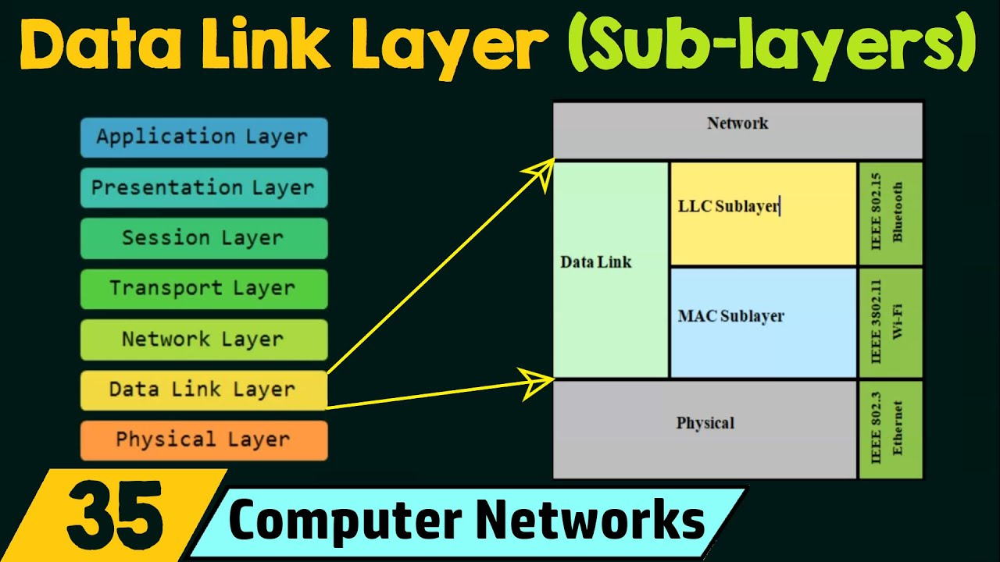
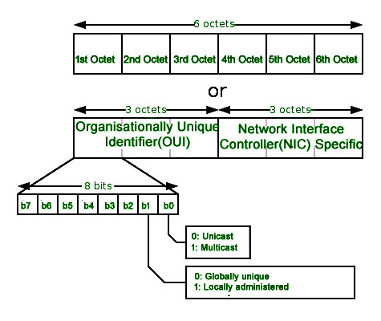

## 1.概述

在原始的、有差错的物理传输线路的基础上，采取**差错检测、差错控制与流量控制**等方法，将有差错的物理线路改进成逻辑上无差错的数据链路，以便向网络层提供高质量的服务。

在数据链路层中，与它的下一层—物理层相邻的是MAC子层，与它的上一层—网络层相邻的是LLC子层。所以MAC子层接受物理层的服务，为LLC子层服务，而LLC子层则是接受MAC子层服务，为网络层服务。

而各层是通过各层间的SAP（Service Access Point，服务访问点）来提供或接受服务的。SAP是邻层实体（“实体”也就是对应层的逻辑功能）间实现相互通信的逻辑接口，位于两层边界处。

| 概念       | 定义                                                   |
| -------- | ---------------------------------------------------- |
| **结点**   | 主机、路由器                                               |
| **链路**   | 网络中两个结点之间的**物理通道**，传输介质主要有双绞线、光纤和微波。分为有线链路、无线链路      |
| **数据链路** | 网络中两个结点之间的**逻辑通道**，把实现控制数据传输**协议**的硬件和软件加到链路上就构成数据链路 |
| **帧**    | 链路层的协议数据单元，封装网络层数据报                                  |

五大功能：

| 功能           | 说明                                        |
| ------------ | ----------------------------------------- |
| **为网络层提供服务** | 无确认无连接服务、有确认无连接服务、有确认面向连接服务。**有连接一定有确认！** |
| **链路管理**     | 连接的建立、维持、释放（用于面向连接的服务）                    |
| **组帧**       | 将网络层数据报封装成帧                               |
| **流量控制**     | 限制发送方速率，防止接收方缓冲区溢出                        |
| **差错控制**     | 帧错/位错的检测与纠正                               |

## 2.MAC子层

与各种传输介质访问有关的问题都放在“MAC子层”来解决。其主要功能包括：数据帧的封装/卸装，帧的寻址和识别（通过MAC地址进行的），帧的接收与发送，帧的差错控制、介质访问冲突控制等。

在 MAC 层中，有一个非常关键的概念就是 MAC 地址。MAC 地址主要用于识别数据链路中互联的节点，例如主机、路由器等。

MAC 地址长 48 bit，在使用网卡(NIC) 的情况下，MAC 地址一般都会烧入 ROM 中。因此，任何一个网卡的 MAC 地址都是唯一的。MAC 地址的结构如下：

| 部分                                                      | 长度           | 含义                                 |
| ------------------------------------------------------- | ------------ | ---------------------------------- |
| **OUI（Organisationally Unique Identifier）**             | 前 3 字节（24 位） | 组织唯一标识符，由 IEEE 分配给设备制造商，用于标识厂商     |
| **NIC Specific（Network Interface Controller Specific）** | 后 3 字节（24 位） | 网络接口控制器特定标识，由厂商自行分配，用于区分同一厂商下的不同设备 |

第一个字节（1st Octet）的最后两位（b1 和 b0）具有特殊含义：
- b1：用于判断地址的类型，0 表示广播地址，1 表示单播地址。
- b0：用于判断地址的类型，0 表示多播地址，1 表示单播地址。

## 3.LLC子层

数据链路层中与传输介质访问无关的问题都集中在LLC子层来解决，为网络层提供服务。其主要功能包括逻辑链路的建立和释放、提供与网络层的接口（也就是前面说到的SAP）、数据传输差错控制、给数据帧加上传输序列号等。

由于网络层上可能有许多种通信协议同时存在，而且每一种通信协议又可能同时与多个对象沟通，因此当LLC子层从MAC子层收到一个数据包时必须能够判断要送给网络层的是哪一个通信协议。为了达到这种功能，在LLC子层中提供了“数据链路层”的SAP，作为与“网络层”通信交互的接口

