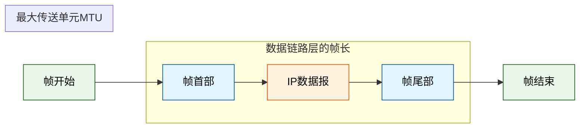
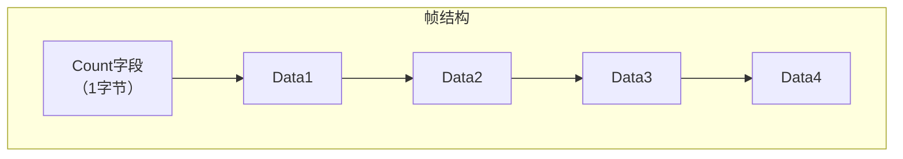
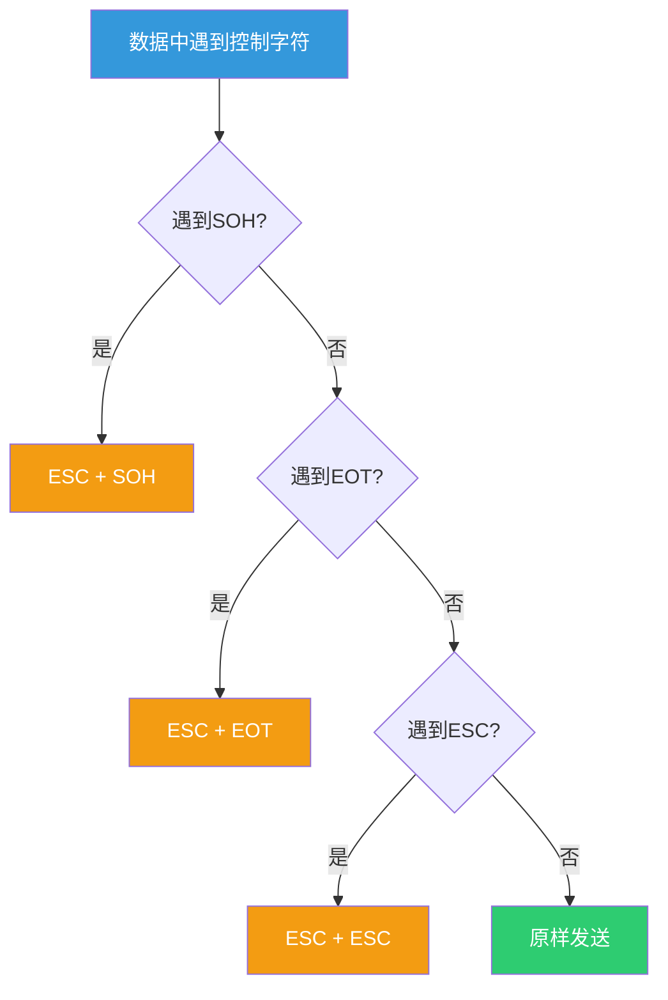
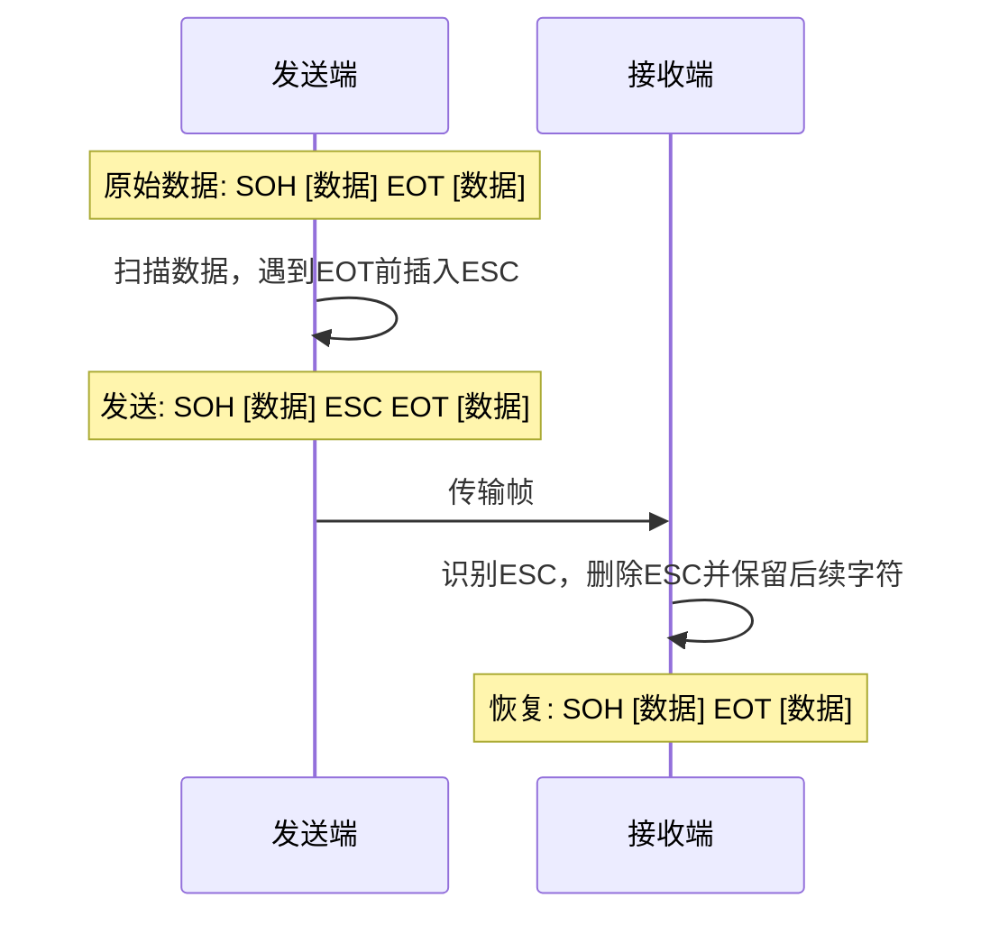
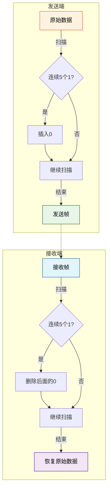
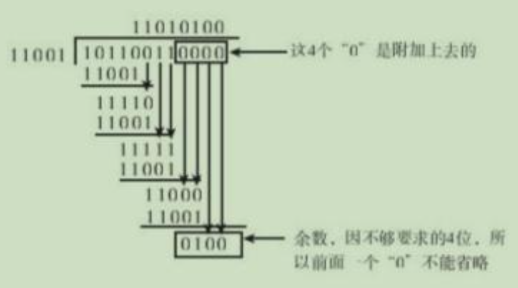

## 1.封装成帧

在一段数据的前后部分添加首部和尾部，这样就构成了一个帧。接收端在收到物理层上交的比特流后，就能根据首部和尾部的标记，从收到的比特流中识别帧的开始和结束。

### 1.1 帧的结构

一个帧由 Header、Payload Field、Trailer 组成，网络层数据报就封装在 Payload Field 字段中。根据不同的物理介质，每个帧的结构也不同

- 帧头(Frame header)：它包含帧的源地址和目的地址。
- 有效载荷(Payload Field)：它包含要传递的数据和信息。
- 尾部标记(Trailer)：它包含错误检测和错误纠正位。
- 标记(Flag)：它标记了帧的开始和结束。
- 帧同步：接收方应当能从接收到的二进制比特流中区分出帧的起始和终止。

帧的类型主要有两种，固定大小的帧和可变大小的帧。
- 固定大小的帧(Fixed-sized Framing)：表示帧的大小是固定的，帧的长度充当帧的边界，因此它不需要额外的边界位来标识帧的开始和结束。
- 可变大小的帧(Sized Framing)：表示每个真的大小是不固定的，因此保留了其他机制来标记一帧的结束和下一帧的开始。它通常用于局域网，在可变大小的帧中定义帧定界符的两种方法是 
   - 长度字段(Length Field): 使用长度字段来确定帧的大小。它用于以太网（IEEE 802.3）
   - 结束定界符(End Delimiter): 经常用于令牌环

### 1.2 组帧的四种方法:

| 方法              | 原理                                         | 特点                               |
| --------------- | ------------------------------------------ | -------------------------------- |
| **1. 字符计数法**    | 帧首部使用一个计数字段（第一个字节，八位）来标明帧内字符数              | 痛点：鸡蛋装在一个篮子里了（Count字段出错会导致灾难性后果） |
| **2. 字符（节）填充法** | 使用特定字符（SOH、EOT）作为帧定界符，数据中出现定界符时前面插入转义字符ESC | 适用于文本文件（ASCII码）                  |
| **3. 零比特填充法**   | 发送端：连续5个1后立即填入1个0；接收端：发现连续5个1时删除后面的0       | 适用于二进制数据，HDLC协议使用                |
| **4. 违规编码法**    | 利用编码中不会出现的电平组合（如曼彻斯特编码中的"高-高"、"低-低"）来定界帧   | 物理层编码冗余，常用                       |

>**字符计数法：**

一般不用

帧的第一个字节（8位）不承载数据，而是专门用来记录本帧包含的总字符数（包括计数字段本身）

| 优点           | 缺点                                                      |
| ------------ | ------------------------------------------------------- |
| 实现简单，无需转义处理  | **致命缺陷**：Count字段一旦出错（如噪声导致从5变成6），后续所有帧的边界都会错位，造成"灾难性后果" |
| 透明性好，数据内容无限制 | 无法自同步恢复，错误会级联传播                                         |

**字符（节）填充法 (Byte/Character Stuffing)**

用于：早期串口通信，基于文本的协议（如某些早期的链路层协议）

使用特殊控制字符作为帧的定界符：

- SOH (Start Of Header, 0x01)：帧开始
- EOT (End Of Transmission, 0x04)：帧结束

当数据部分恰好出现这些控制字符时，发送方在前面插入一个转义字符 ESC (0x1B)，接收方收到后删除 ESC 还原原始数据。如果数据中出现了 ESC 本身，也要转义：ESC → ESC ESC

| 优点                         | 缺点                                |
| -------------------------- | --------------------------------- |
| 错误不会级联传播（SOH/EOT损坏只会影响当前帧） | 只适用于**文本数据**（ASCII字符集）            |
| 实现相对简单                     | 不适用于任意二进制数据（如图片、音频的原始字节流可能包含控制字符） |
| 有明确的帧边界标记                  | 需要额外的转义处理，增加少量开销                  |

**零比特填充法 (Bit Stuffing / Zero Bit Insertion)**

用于：HDLC协议（High-Level Data Link Control），PPP协议（Point-to-Point Protocol）的异步传输模式

使用一个特殊的比特模式作为帧定界符：01111110（6个连续的1，前后各一个0，即 0x7E）

- 发送端处理：
> 扫描数据比特流，每当发现连续5个1时，立即在其后插入1个0
> 这样数据中永远不会出现连续6个1，也就不会与定界符 01111110 混淆

- 接收端处理：
> 扫描比特流，每当发现连续5个1时，检查后面的比特：
> - 如果是 0 → 删除这个0（这是填充的，还原数据）
> - 如果是 1 → 后面跟着 0 就是定界符 01111110；否则出错

| 优点                           | 缺点                               |
| ---------------------------- | -------------------------------- |
| 适用于**任意二进制数据**（图片、音频、可执行文件等） | 实现比字符填充稍复杂（比特级操作）                |
| 定界符唯一，不会与数据混淆                | 有少量比特开销（平均每 2^5 = 32 个比特可能插入1个0） |
| 错误局部化，不会级联                   |                                  |

**违规编码法 (Bit Stuffing / Zero Bit Insertion)**

利用物理层编码方案本身的冗余来标识帧边界。就像写代码时，某些变量名是保留关键字（比如 class、if），正常情况下你不会用它们当变量名。违规编码法就是：故意用物理层编码里"不可能出现"的电平组合，来当帧的"保留关键字"。

以曼彻斯特编码为例：
- 0 → 低→高跳变；
- 1 → 高→低跳变

每个比特周期内必有电平跳变（这是曼彻斯特编码的核心特征，用于自带时钟同步），那么，"高-高"（无跳变） 和 "低-低"（无跳变） 这两种电平组合在正常数据中永远不会出现。发送方在帧首/帧尾故意发送这种违规编码组合，接收方检测到就知道是帧边界。

## 2.透明传输

不管所传数据是什么样的比特组合，都应当能够在链路上传送。因此，链路层就"看不见"有什么妨碍数据传输的东西。**当所传数据中的比特组合恰巧与某一个控制信息完全一样时，就必须采取适当的措施，使收方不会将这样的数据误认为是某种控制信息。**

### 2.1 字符填充法：（参考上面的字符填充法说明）

### 2.2 零比特填充法：（参考上面的零比特填充法说明）

## 3.差错控制

差错控制主要包括以下几个方面：

### 3.1 差错的来源

差错主要由噪声引起，可分为两类：

- **全局性噪声**：随机热噪声（热噪声）
  - 解决办法：提高信噪比来减少或避免干扰

- **局部性噪声**：冲击噪声
  - 解决办法：通常利用编码技术来解决

### 3.2 差错类型

| 类型 | 说明 | 示例 |
|:---|:---|:---|
| **位错** | 比特位出错，1变成0，0变成1 | - |
| **帧错-丢失** | 某些帧未能到达接收端 | 收到[#1]-[#3]（缺少#2） |
| **帧错-重复** | 某些帧被多次接收 | 收到[#1]-[#2]-[#2]-[#3] |
| **帧错-失序** | 帧到达顺序与发送顺序不一致 | 收到[#1]-[#3]-[#2] |

### 3.3 差错控制技术

| 层次      | 对象       | 目的                             |
| ------- | -------- | ------------------------------ |
| 物理层编码   | **单个比特** | 解决传输过程中比特的同步等问题，如曼彻斯特编码        |
| 数据链路层编码 | **一组比特** | 通过冗余码的技术实现一组二进制比特串在传输过程是否出现了差错 |

#### 奇偶校验码（Parity Check Code）

在n位信息元后面附加1位校验元，使整个码字中"1"的个数满足奇/偶要求。示例：字符S的ASCII编码从低到高依次为 1100101（偶校验）

| 选项         | 码字      | "1"的个数 | 奇校验能否检测？     |
| ---------- | ------- | ------ | ------------ |
| A. 1100011 | 1100011 | 4（偶）   | 偶数个错误（2位错） |
| B. 1100101 | 1100101 | 4（偶）   | 与原码相同（无错）  |
| C. 1100110 | 1100110 | 4（偶）   | 偶数个错误（2位错） |
| D. 1101011 | 1101011 | 5（奇）   | 奇数个错误（1位错） |

只能检查出奇数个比特错误，检错能力为50%

#### CRC循环冗余码（Cyclic Redundancy Check）

在数据发送之前，先按某种关系附加上一定的冗余位，构成一个符合某一规则的码字后再发送。

- 加0：假设生成多项式G(x)的阶为r，则加r个0
- 模2除法：数据加0后除以多项式，余数为冗余码/FCS/CRC检验码的比特序列。这里推荐使用**逐位进行异或**运算（和模2除法的结果相同）

余数就是FCS校验码，将FCS校验码放在原始帧最后，接收端拿到数据后，用二进制除法除以比特串，若余数为0，则没有差错，反之有差错。

#### 海明码（Hamming Code）纠错编码

海明码是一种可以纠正单比特错误的线性纠错码。它的核心思想是：在数据位中插入多个校验位，每个校验位负责监督特定位置的数据位，通过校验位的组合定位错误位置。

| 符号        | 含义               | 关系式                      |
| :-------- | :--------------- | :----------------------- |
| $n$       | 码字总长度（数据位 + 校验位） | $n = k + r$              |
| $k$       | 数据位个数            | —                        |
| $r$       | 校验位个数            | $2^r \geq k + r + 1$|
| $d_{min}$ | 最小汉明距离           | $d_{min} = 3$            |

汉明距离（Hamming Distance）是两个等长二进制串之间，对应位置不同的比特个数。最小汉明距离（Minimum Hamming Distance）是指一个编码方案中，所有合法码字对之间汉明距离的最小值，它决定了这个编码方案的检错能力和纠错能力上限。

| 能力                | 条件                                   | 直观解释                  |
| :---------------- | :----------------------------------- | :-------------------- |
| 检测 $e$ 位错误    | $d_{min} \geq e + 1$                 | 错 $e$ 位后不会"撞"到另一个合法码字 |
| 纠正 $t$ 位错误    | $d_{min} \geq 2t + 1$                | 每个码字的"纠错球"半径 $t$ 不重叠  |
| 同时检 $e$ 纠 $t$ | $d_{min} \geq e + t + 1$（$e \geq t$） | 检错球和纠错球不重叠            |

最小汉明距离为 3 意味着：任意两个合法码字之间至少相差 3 个比特，因此可以检测 2 位错误、纠正 1 位错误。

校验位 Pi放置在 2^(i−1)的位置（即第 1, 2, 4, 8, 16... 位）

| 校验位   | 位置 | 二进制表示 | 监督的数据位（该位为1的位置）                     |
| :---- | :- | :---- | :---------------------------------- |
| $P_1$ | 1  | 0001  | 所有二进制末位为1的位置：1, 3, 5, 7, 9, 11...   |
| $P_2$ | 2  | 0010  | 所有二进制第二位为1的位置：2, 3, 6, 7, 10, 11... |
| $P_3$ | 4  | 0100  | 所有二进制第三位为1的位置：4, 5, 6, 7, 12, 13... |
| $P_4$ | 8  | 1000  | 所有二进制第四位为1的位置：8, 9, 10, 11, 12...   |

例子：对数据 1011（k=4）进行海明码编码

$$
2^r \geq 4 + r + 1
$$

$$
n = 4 + r
$$

$$
r=3，n=7
$$

| 位置 | 7     | 6     | 5     | 4     | 3     | 2     | 1     |
| :- | :---- | :---- | :---- | :---- | :---- | :---- | :---- |
| 内容 | $D_4$ | $D_3$ | $D_2$ | $P_3$ | $D_1$ | $P_2$ | $P_1$ |
| 值  | 1     | 0     | 1     | ?     | 1     | ?     | ?     |

P1（位置1）：监督 1,3,5,7
P2（位置2）：监督 2,3,6,7 
P3（位置4）：监督 4,5,6,7

$$
\begin{align}
P_1 &= D_1 \oplus D_2 \oplus D_4 = 1 \oplus 1 \oplus 1 = 1 \\
P_2 &= D_1 \oplus D_3 \oplus D_4 = 1 \oplus 0 \oplus 1 = 0 \\
P_3 &= D_2 \oplus D_3 \oplus D_4 = 1 \oplus 0 \oplus 1 = 0
\end{align}
$$

| 位置 | 7  | 6  | 5  | 4     | 3  | 2     | 1     |
| :- | :- | :- | :- | :---- | :- | :---- | :---- |
| 内容 | 1  | 0  | 1  | **0** | 1  | **0** | **1** |

接收方收到：1010**0**01（假设第3位发生翻转）

| 校验组             | 计算                                 | 结果    |
| :-------------- | :--------------------------------- | :---- |
| $S_1$ (1,3,5,7) | $1 \oplus 0 \oplus 1 \oplus 1 = 1$ | **1** |
| $S_2$ (2,3,6,7) | $0 \oplus 0 \oplus 0 \oplus 1 = 1$ | **1** |
| $S_3$ (4,5,6,7) | $0 \oplus 1 \oplus 0 \oplus 1 = 0$ | **0** |

S3S2S1=(110)2=(3)10

| 特性          | 说明                                                                                |
| :---------- | :-------------------------------------------------------------------------------- |
| 纠正单比特错误   | 核心优势                                                                              |
| 检测双比特错误  | 能发现但**不能纠正**（会误判为单比特错并误纠）                                                         |
| 无法处理多比特错误 | 3位及以上错误可能无法检测                                                                     |
| 扩展方案     | **SEC-DED**（Single Error Correction - Double Error Detection）：增加一个全局偶校验位，可区分单错和双错 |

