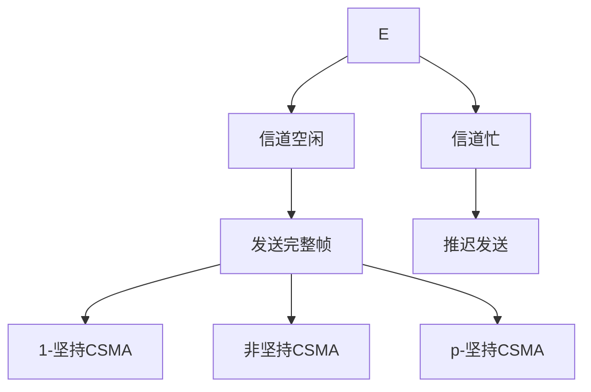
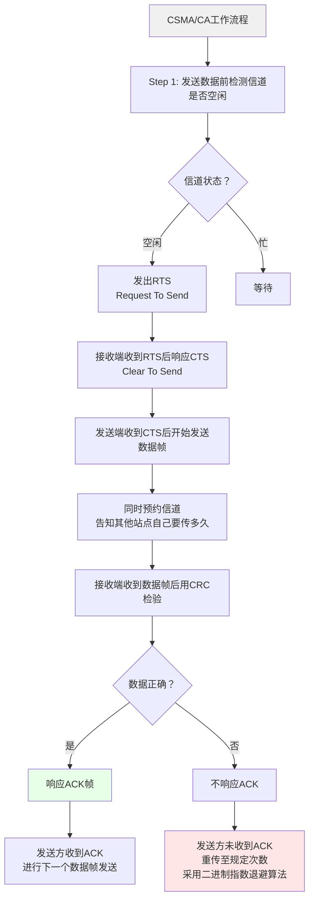

介质访问控制可分为两大类：静态划分信道和动态分配信道。

**静态划分信道**（信道划分介质访问控制）包括：
- 频分多路复用 FDM
- 时分多路复用 TDM
- 波分多路复用 WDM
- 码分多路复用 CDM

**动态分配信道**包括：
- 轮询访问介质访问控制
  - 令牌传递协议
- 随机访问介质访问控制（动态媒体接入控制/多点接入）
  - ALOHA协议
  - CSMA协议
  - CSMA/CD协议
  - CSMA/CA协议

## 1.ALOHA协议

ALOHA协议由Norm Abramson在夏威夷大学提出，分为两类：

- 纯ALOHA协议
> 核心思想：不监听信道，不按时间槽发送，随机重发——"想发就发"
> 冲突检测：接收方检测出差错后不予确认，发送方在一定时间内收不到确认则判断发生冲突
> 冲突解决：超时后等待一随机时间再重传

- 时隙ALOHA协议（Slotted ALOHA）
> 核心思想：把时间分成若干个相同的时间片（时隙），所有用户在时间片开始时刻同步接入网络信道
> 冲突处理：若发生冲突，必须等到下一个时间片开始时刻再发送
> 本质：控制"想发就发"的随意性

| 特性   | 纯ALOHA | 时隙ALOHA       |
| ---- | ------ | ------------- |
| 吞吐量  | 更低     | 更高            |
| 效率   | 更低     | 更高            |
| 发送时机 | 想发就发   | 只有在时间片段开始时才能发 |

## 2.CSMA协议（载波监听多路访问）

> 全称：Carrier Sense Multiple Access,CS（载波侦听/监听）：每个站在发送数据之前要检测一下总线上是否有其他计算机在发送数据,MA（多点接入）：表示许多计算机以多点接入的方式连接在一根总线上

### 2.1 1-坚持CSMA

坚持指的是对于监听信道"忙"之后的坚持,如果一个主机要发送消息，先监听信道
空闲则直接传输，不必等待忙则一直监听，直到空闲马上传输如果有冲突（一段时间内未收到肯定回复），则等待一个随机长的时间再监听，重复上述过程

- 优点：只要媒体空闲，站点就马上发送，避免了媒体利用率的损失
- 缺点：假如有两个或两个以上的站点有数据要发送，冲突就不可避免

### 2.2 非坚持CSMA

非坚持指的是对于监听信道"忙"之后就不继续监听,空闲则直接传输，不必等待,忙则等待一个随机的时间之后再进行监听

- 优点：采用随机的重发延迟时间可以减少冲突发生的可能性
- 缺点：可能存在大家都在延迟等待过程中，使得媒体仍可能处于空闲状态，媒体使用率降低

### 2.3 p-坚持CSMA

p-坚持指的是对于监听信道"空闲"的处理,空闲则以p概率直接传输，不必等待；概率1-p等待到下一个时间槽再传输,忙则持续监听直到信道空闲再以p概率发送,若冲突则等到下一个时间槽开始再监听并重复上述过程

- 优点：既能像非坚持算法那样减少冲突，又能像1-坚持算法那样减少媒体空闲时间
- 缺点：发生冲突后还是要坚持把数据帧发送完，造成了浪费

| 状态       | 1-坚持CSMA | 非坚持CSMA         | p-坚持CSMA               |
| -------- | -------- | --------------- | ---------------------- |
| **信道空闲** | 马上发      | 马上发             | p概率马上发，1-p概率等到下一个时隙再发送 |
| **信道忙**  | 继续坚持监听   | 放弃监听，等一个随机时间再监听 | 持续监听，直到信道空闲再以p概率发送     |

> 比喻（买奶茶）：
> 1-坚持CSMA：超想喝！到我就买，没到我就排队等！
> 非坚持CSMA：超我就买，没我就买，没到我就排队等！
> 非坚持：不急喝。到我就买，没到我就一会再来。
> p-坚持CSMA：随性喝。到我按概率买，没到继续等，等到再按概率买。

## 3.CSMA/CD协议（载波监听多点接入/碰撞检测）

> Carrier Sense Multiple Access with Collision Detection,CD：碰撞检测（冲突检测），"边发送边监听"，适配器边发送数据边检测信道上信号电压的变化情况，以便判断自己在发送数据时其他站是否也在发送数据（半双工网络）

### 3.1 传播时延对载波监听的影响

最迟多久才能知道自己发送的数据没和别人碰撞？ 

- 最迟时间最多是两倍的总线端到端的传播时延（2τ）
- 总线的端到端往返传播时延 = 争用期/冲突窗口/碰撞窗口
- 只要经过2τ时间还没有检测到碰撞，就能肯定这次发送不会发生碰撞

为什么先听后发还会冲突？ 

因为电磁波在总线上总是以有限的速率传播的。

### 3.2 如何确定碰撞后的重传时机？——截断二进制指数规避算法

> 确定基本退避（推迟）时间为争用期 2τ

定义参数k，它等于重传次数，但k不超过10，即 k = min[重传次数, 10]
- 当重传次数不超过10时，k等于重传次数
- 当重传次数大于10时，k就不再增大而一直等于10

从离散的整数集合 [0, 1, ..., 2ᵏ-1] 中随机取出一个数r，重传所需要退避的时间就是 r倍的基本退避时间，即 2rτ.当重传达16次仍不能成功时，说明网络太拥挤，认为此帧永远无法正确发出，抛弃此帧并向高层报告出错。

若连续多次发生冲突，就表明可能有较多的站参与争用信道。使用此算法可使重传需要推迟的平均时间随重传次数的增大而增大，因而减小发生碰撞的概率，有利于整个系统的稳定。

### 3.3 最小帧长问题

A站发了一个很短的帧，但发生了碰撞，不过帧在发送完毕后才检测到发生碰撞，没法停止发送（因为发完了）。

解决方案——最小帧长：帧的传输时延至少要两倍于信号在总线中的传播时延

最小帧长 = 总线传播时延 × 数据传输速率 × 2 = 2τ × 数据传输速率

以太网规定最短帧长为64B，凡是长度小于64B的都是由于冲突而异常终止的无效帧。

## 4.CSMA/CA协议（载波监听多点接入/碰撞避免）

> Carrier Sense Multiple Access with Collision Avoidance,CA：碰撞避免（冲突避免），"边发送边监听"，适配器边发送数据边检测信道上信号电压的变化情况，以便判断自己在发送数据时其他站是否也在发送数据（半双工网络）

三大机制：

- 预约信道
- ACK帧（确认机制）
- RTS/CTS帧（可选，解决隐蔽站问题）

流程：

- 发送数据前，先检测信道是否空闲
- 空闲则发出RTS（Request To Send），RTS包括发射端的地址、接收端的地址、下一份数据将持续发送的时间等信息；信道忙则等待
- 接收端收到RTS后，将响应CTS（Clear To Send）
- 发送端收到CTS后，开始发送数据帧（同时预约信道：发送方告知其他站点自己要传多久数据）
- 接收端收到数据帧后，将用CRC来检验数据是否正确，正确则响应ACK帧
- 发送方收到ACK就可以进行下一个数据帧的发送，若没有则一直重传至规定重发次数为止（采用二进制指数退避算法来确定随机的推迟时间）

| 对比项        | CSMA/CD                                                  | CSMA/CA                                 |
| ---------- | -------------------------------------------------------- | --------------------------------------- |
| **相同点**    | 都从属于CSMA的思路，核心是**先听再说**。两个在接入信道之前都须要进行监听，当发现信道空闲后，才能进行接入 |                                         |
| **传输介质**   | 总线式以太网【**有线**】                                           | 无线局域网【**无线**】                           |
| **载波检测方式** | 通过电缆中电压的变化来检测，当数据发生碰撞时，电缆中的电压就会随着发生变化                    | 采用能量检测（ED）、载波检测（CS）和能量载波混合检测三种检测信道空闲的方式 |
| **冲突处理**   | **检测冲突**，边发送边监听                                          | **避免冲突**，无法做到全面检测碰撞                     |
| **重传机制**   | 截断二进制指数退避算法                                              | 二进制指数退避算法                               |
| **其他**     | 二者出现冲突后都会进行有上限的重传                                        |                                         |

## 5. 轮询访问介质访问控制

轮询协议
- 主结点轮流"邀请"从属结点发送数据
- 问题：轮询开销、等待延迟、单点故障（主结点故障）

令牌传递协议（详见[局域网和令牌环](3.5-NPEE-SE-局域网和令牌环.md)）
- 令牌：一个特殊格式的MAC控制帧，不含任何信息，控制信道使用，确保同一时刻只有一个结点独占信道
- 令牌环网无碰撞.每个结点可在一定时间内（令牌持有时间）获得发送数据的权利，不是无限制持有
- 问题：令牌开销、等待延迟、单点故障
- 应用：令牌环网（物理星型拓扑，逻辑环形拓扑）
- 适用场景：负载较重、通信量较大的网络

