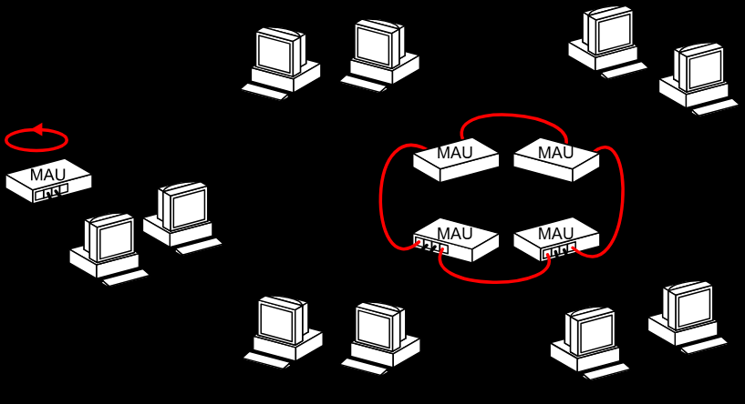

## 1.基本概念

在某一区域内由多台计算机互联成的计算机组，使用广播信道:
- 覆盖地理范围较小（如一座或集中的建筑群内）
- 使用专门铺设的传输介质（双绞线、同轴电缆），数据传输速率高（10Mb/s ~ 10Gb/s）
- 通信延迟时间短，误码率低，可靠性较高
- 各站为平等关系，共享传输信道
- 多采用分布式控制和广播式通信，能进行广播和组播

局域网拓扑结构：

| 拓扑        | 特点                           | 优缺点                                     |
| --------- | ---------------------------- | --------------------------------------- |
| **星型拓扑**  | 中心节点（集线器）是控制中心，任意两节点通信最多只需两步 | 传输速度快、建网容易；但可靠性低、有单点故障                  |
| **总线型拓扑** | 所有节点共享一条总线                   | 网络可靠性高、节点响应快、共享资源能力强、成本低；但某节点故障可能影响整个系统 |
| **环形拓扑**  | 节点连成闭合环路                     | 通信设备和线路节省；但有单点故障、不便于扩充、响应延时长            |
| **树型拓扑**  | 层次化结构                        | 易于拓展、易于隔离故障；但容易有单点故障                    |

局域网介质访问控制：

| 方法          | 适用拓扑                                                        |
| ----------- | ----------------------------------------------------------- |
| **CSMA/CD** | 常用于**总线型局域网**，也用于树型网络                                       |
| **令牌总线**    | 常用于**总线型局域网**，也用于树型网络。将工作站按一定顺序（如接口地址大小）形成逻辑环，只有令牌持有者才能控制总线 |
| **令牌环**     | 用于**环形局域网**，如令牌环网                                           |

## 2.令牌环网

令牌环网（Token Ring）是一种早期局域网（LAN）拓扑与介质访问控制（MAC）协议，由 IBM 在 1980 年代主导开发，IEEE 标准化为 802.5。

网络中的所有站点通过物理环（或逻辑环）连接。一个称为令牌（Token）的特殊数据帧在环上单向循环：

- 空令牌：当站点没有数据要发送时，令牌在环上自由流转。
- 数据发送：站点捕获到空令牌后，将其标记为"忙"，并附加自己的数据帧发送出去。
- 数据接收：数据帧经过目标站点时，目标站点复制数据，但帧继续沿环传输。
- 回收确认：发送站点收到自己发出的帧（绕环一周后返回），确认传输成功，然后释放空令牌，传递给下一个站点。

关键点：任何时刻环上只有一个令牌，因此从根本上避免了以太网的碰撞问题。

| 特性        | 说明                                       |
| --------- | ---------------------------------------- |
| **确定性延迟** | 每个站点获得信道的最大等待时间是可计算的，适合实时应用              |
| **无冲突**   | 令牌机制天然避免了 CSMA/CD 的碰撞问题                  |
| **优先级机制** | 支持多级优先级（通过令牌中的优先级位），高优先级站点可优先获取令牌        |
| **故障恢复**  | 配备监控站（Monitor Station），能检测并回收"流浪"帧，修复环断裂 |
| **物理拓扑**  | 实际布线常采用**星型**（通过多站访问单元 MSAU/MAU），但逻辑上是环  |

令牌环网在 1990 年代逐渐被交换式以太网（Ethernet）取代，主要原因：

- 成本高：网卡、集线器比以太网贵得多
- 速率瓶颈：主流为 4 Mbps 和 16 Mbps，难以扩展到更高速度
- 维护复杂：环断裂或令牌丢失需要监控站介入，故障排查困难
- 以太网进化：交换式以太网 + 全双工模式消除了碰撞域问题，速率从 10 Mbps 飙升至 10 Gbps+

如今令牌环网已基本退出商用市场，但在网络原理教学和某些工业控制网络中仍有参考价值。其"令牌"思想也影响了后续技术，如光纤分布式数据接口（FDDI）和某些实时通信协议。

| 维度        | 令牌环网 (802.5) | 以太网 (802.3)                |
| --------- | ------------ | -------------------------- |
| **介质访问**  | 令牌传递         | CSMA/CD（早期）/ 交换式（现代）       |
| **碰撞**    | 无            | 半双工时有，全双工时无                |
| **延迟确定性** | 高（可预测）       | 低（但不确定）                    |
| **成本**    | 高            | 低                          |
| **速率演进**  | 停滞于 16 Mbps  | 10M → 100M → 1G → 10G → 更高 |
| **现状**    | 淘汰           | 绝对主流                       |

