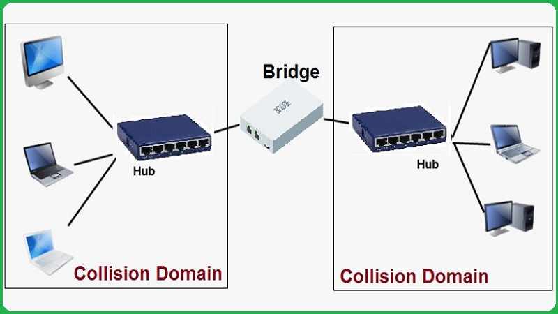

## 1.网桥（Bridge）

网桥是两个端口的链路层设备，用于连接两个使用相同或相似协议的局域网段（如两个以太网段）。核心机制为自学习 + 转发/过滤

自学习表构建过程：
- 网桥收到帧时，记录源 MAC 地址和到达端口的映射关系
- 网桥通过逆向学习建立转发表（Forwarding Table）

| 目标 MAC 位置        | 处理方式              |
| ---------------- | ----------------- |
| 转发表中查到，且端口 ≠ 入端口 | **转发**到对应端口       |
| 转发表中查到，且端口 = 入端口 | **丢弃**（过滤，避免环路）   |
| 转发表中未查到          | **泛洪**（向所有其他端口广播） |

网桥类型：

- **透明网桥**：终端设备"感知不到"网桥存在，IEEE 802.1D 标准
- **源路由网桥**：由源端决定完整路径，用于 Token Ring 网络
- **远程网桥**：通过 WAN 链路连接远距离 LAN

优点：

- 隔离冲突域，提升网络性能
- 扩展网络物理距离
- 连接不同传输介质（如双绞线 ↔ 光纤）

缺点：

- 引入转发延迟（存储-转发）
- 无法隔离广播域（广播风暴风险）
- 端口少（仅 2 个），扩展性有限

## 2.交换机（Switch）

交换机本质上是多端口网桥，但具备更强大的功能和性能。

交换机类型：

- 按工作层次
  - **二层交换机**：纯 MAC 地址转发
  - **三层交换机**：集成路由功能（基于 IP 转发）
  - **四层/七层交换机**：基于端口/应用层内容转发（负载均衡）

- 按应用场景
  - **接入层交换机**：连接终端用户，端口多、成本低
  - **汇聚层交换机**：聚合接入层流量，支持 VLAN、ACL
  - **核心层交换机**：高速转发，支持路由、QoS、冗余协议

交换方式：

- **存储-转发**：接收完整帧，校验 CRC 后转发，延迟高，适用于可靠性要求高的场景
- **直通交换**：读到目标 MAC 立即转发，延迟极低，适用于延迟敏感场景（如语音）
- **无碎片交换**：收到 64 字节后转发（过滤残帧），延迟中，兼顾速度与可靠性

### 3.无线接入点 (Wireless AP)

AP 是无线局域网与有线局域网的桥梁，工作在链路层，将 802.11 无线帧转换为 802.3 以太网帧。

| 模式                | 说明                              |
| ----------------- | ------------------------------- |
| **FAT AP (胖 AP)** | 独立工作，自带管理功能，适合小型网络              |
| **FIT AP (瘦 AP)** | 仅射频功能，由 AC (接入控制器) 集中管理，适合大规模部署 |
| **Mesh AP**       | 无线回传，无需有线连接，自组网                 |

> BSS (Basic Service Set)： 一个 AP 覆盖的基本服务单元
> ESS (Extended Service Set)： 多个 AP 组成扩展服务集，使用相同 SSID
> **漫游**： 终端在不同 AP 间移动时保持连接连续性   

## 4.链路层设备总结

- 基于 MAC 地址工作：识别帧中的源/目的 MAC 进行决策
- 处理帧格式：能够解析以太网帧头（目的 MAC、源 MAC、类型/长度）
- 维护转发表：通过自学习动态建立 MAC-端口映射
- 执行帧校验：检查帧长度、CRC 校验等
- 流量控制：部分设备支持 802.3x 流量控制

| 特性    | 集线器 | 网桥     | 二层交换机  | 三层交换机 | 路由器   |
| ----- | --- | ------ | ------ | ----- | ----- |
| 工作层次  | 物理层 | 链路层    | 链路层    | 网络层   | 网络层   |
| 转发依据  | 比特流 | MAC 地址 | MAC 地址 | IP 地址 | IP 地址 |
| 隔离冲突域 | 否   | 是      | 是      | 是     | 是     |
| 隔离广播域 | 否   | 否      | 否      | 是     | 是     |
| 端口数量  | 多   | 2      | 多      | 多     | 少     |
| 转发速度  | 慢   | 中      | 快      | 快     | 较慢    |

