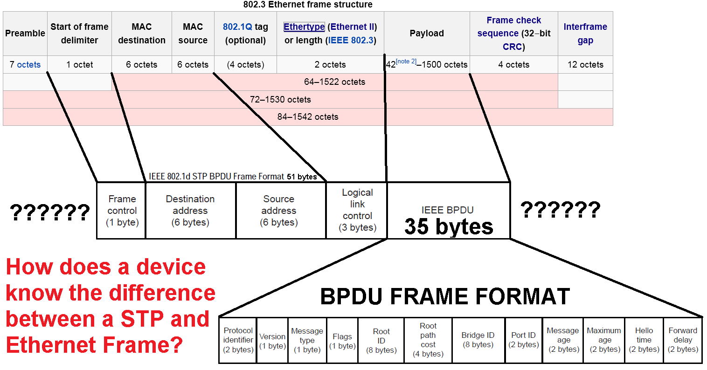

## 1.为什么需要生成树协议？

在以太网中，二层数据帧没有 TTL（生存时间）字段（这是三层 IP 报文才有的机制）。一旦网络中存在物理环路，广播帧就会在交换机之间无限循环，引发两大灾难：

1. **广播风暴**
   - **原理**：交换机对未知单播/广播帧执行泛洪（Flooding），环路中帧无休止转发
   - **后果**：网络带宽被耗尽，设备 CPU 飙升，全网瘫痪

2. **MAC 地址漂移**
   - **原理**：同一 MAC 地址从不同接口不断被学习，MAC 表项不断刷新
   - **后果**：交换机无法正确转发数据，业务中断

单设备组网：存在单点故障风险吃；多设备冗余组网：物理链路冗余必然形成环路。因此，需要在保持物理冗余的同时，逻辑上阻塞部分端口，构建一棵无环的生成树。这就是 STP 存在的必要性——只要有交换机，就应该开启生成树。

## 2.STP 核心概念与参数

### 2.1 桥 ID（BID）

BID 是交换机的唯一标识，由两部分组成：
- 桥优先级（16 bit）：可配置范围 0–61440，必须是 4096 的倍数（后 12 bit 固定为 0）
- 桥 MAC 地址（48 bit）：设备的硬件地址

根桥的 BID 也称为 RID（Root ID）

```ENSP
[S1] stp priority <0-61440>     # 修改桥优先级
[S1] display bridge mac-address  # 查看桥MAC地址
```

### 2.2 根桥（Root Bridge）

根桥是生成树的"树根"，全网有且只有一个。选举规则：
- 比较桥优先级，越小越优先
- 优先级相同，比较桥 MAC 地址，越小越优先
- 根桥角色可以被抢占——如果网络中接入优先级更小的交换机，会重新选举根桥。

### 2.3 路径开销（Cost）

每个运行 STP 的接口都有 Cost 值，与带宽成反比：

| 带宽       | 802.1D Cost | 802.1t Cost |
| -------- | ----------- | ----------- |
| 10 Mbps  | 100         | 2,000,000   |
| 100 Mbps | 19          | 200,000     |
| 1 Gbps   | 4           | 20,000      |
| 10 Gbps  | 2           | 2,000       |

根路径开销（RPC）：非根桥设备到达根桥的路径上，所有出接口 Cost 的叠加值。在根桥视角上，是去往非根桥的入接口开销叠加。

### 2.4  端口 ID（PID）

由两部分组成：
- 端口优先级（4 bit）：可配置范围 0–240，必须是 16 的倍数，默认 128
- 端口编号（12 bit）

```ENSP
[S1-GigabitEthernet0/0/1] stp port priority <0-240>
```

## 3.BPDU 报文结构

BPDU（Bridge Protocol Data Unit）是 STP 的协议报文，分为两种类型：
- **配置 BPDU**：用于配置 STP 参数，如桥优先级、端口优先级等
- **状态 BPDU**：用于交换 STP 状态信息，如端口角色、根桥信息等

### 3.1 配置 BPDU（0x00）

| 字段                | 说明                                      | 默认值  |
| ----------------- | --------------------------------------- | ---- |
| **Flags**         | TC bit(0位): 拓扑变更标志; TCA bit(7位): 拓扑变更确认 | —    |
| **Root ID**       | 根桥 BID                                  | —    |
| **RPC**           | 根路径开销                                   | —    |
| **Bridge ID**     | 发送者 BID                                 | —    |
| **Port ID**       | 发送端口 PID                                | —    |
| **Hello Time**    | BPDU 发送间隔                               | 2 秒  |
| **Max Age**       | BPDU 最大老化时间                             | 20 秒 |
| **Forward Delay** | 转发延迟                                    | 15 秒 |
| **Message Age**   | 消息寿命（转发次数计数）                            | 0    |





```ensp
# 华为设备中时间配置单位为厘秒（1 秒 = 100 厘秒）：
[S2] stp timer hello 400      # 4秒
[S2] stp timer max-age 3000   # 30秒
```

### 3.2 状态 BPDU（0x80）

拓扑变更通知报文。当检测到拓扑变化时，变更设备向上游发送 TCN，逐跳通告至根桥。

## 4. 选举过程：四步优选法

STP 按照以下严格顺序选择最优配置 BPDU：
1. 最小的 Root ID（根桥ID）
2. 最小的 RPC（根路径开销）
3. 最小的 Bridge ID（发送者桥ID）
4. 最小的 Port ID（发送端口ID）

选举流程:

- 初始状态：每台设备认为自己是根桥，发送 BPDU 宣告自身为根
- 接收比较：收到其他设备的 BPDU 后，按四步优选法对比
- 根桥确定：全网优先级最高的设备成为根桥
- 根端口选举：非根桥上，接收最优 BPDU 的端口成为根端口（RP）——每台非根桥有且只有一个 RP
- 指定端口选举：每个网段上，发送最优 BPDU 的端口成为指定端口（DP）
- 阻塞剩余端口：既不是 RP 也不是 DP 的端口成为预备端口（AP），进入阻塞状态

> 根桥的所有活动端口都是指定端口（DP）。

## 5.端口角色与状态

| 角色       | 缩写 | 功能             | 存在位置       |
| -------- | -- | -------------- | ---------- |
| **指定端口** | DP | 发送最优 BPDU，转发数据 | 每个网段一个     |
| **根端口**  | RP | 接收最优 BPDU，转发数据 | 非根桥有且只有一个  |
| **预备端口** | AP | 阻塞状态，备份路径      | 华为优化表示阻塞端口 |

| 状态             | 接收 BPDU | 发送 BPDU | 学习 MAC | 转发数据 | 持续时间               |
| -------------- | ------- | ------- | ------ | ---- | ------------------ |
| **Disable**    | ✗       | ✗       | ✗      | ✗    | —                  |
| **Blocking**   | ✓       | ✗       | ✗      | ✗    | —                  |
| **Listening**  | ✓       | ✓       | ✗      | ✗    | 15s（Forward Delay） |
| **Learning**   | ✓       | ✓       | ✓      | ✗    | 15s（Forward Delay） |
| **Forwarding** | ✓       | ✓       | ✓      | ✓    | —                  |

> Listening 15s：用于完成根桥选举和端口角色计算，防止临时环路
> Learning 15s：用于学习 MAC 地址，防止大量未知单播帧泛洪

## 6.STP → RSTP → MSTP

| 特性          | STP (802.1D)        | RSTP (802.1w)                       | MSTP (802.1s) |
| ----------- | ------------------- | ----------------------------------- | ------------- |
| **收敛时间**    | 30-50 秒             | **1-2 秒**                           | **1-2 秒**     |
| **端口状态**    | 5 种                 | 3 种（Discarding/Learning/Forwarding） | 3 种           |
| **端口角色**    | 3 种（RP/DP/Blocking） | 5 种（+Alternate/Backup）              | 7 种           |
| **VLAN 支持** | 单生成树                | 单生成树                                | **多实例生成树**    |
| **负载均衡**    | 否                   | 否                                   | **是**         |
| **BPDU 发送** | 仅根桥发送               | 所有设备主动发送                            | 按实例发送         |
| **兼容性**     | —                   | 兼容 STP                              | 兼容 STP/RSTP   |

### 6.1 RSTP 的核心改进
- 端口状态简化：合并 Blocking/Listening/Disable 为 Discarding
- 新增端口角色：
    - Alternate Port：根端口的备份（其他设备比较落败）
    - Backup Port：指定端口的备份（同一设备上 DP 的备份）
- P/A 机制（Proposal/Agreement）：快速协商，实现秒级收敛
- 所有设备主动发送 BPDU：不再依赖根桥周期性发送

### 6.2 MSTP 的核心增强
- MSTP 在 RSTP 基础上引入多实例概念：
    - 将不同 VLAN 映射到不同的生成树实例（Instance）
    - 每个实例独立计算生成树拓扑
    - 不同 VLAN 流量走不同路径，实现链路负载分担
- 大幅提高冗余链路的带宽利用率

> 华为 MSTP 配置三要素（必须一致才能形成同一 MST 域）：
> - 域名：用于标识 MST 域的唯一名称
> - 修订号：用于记录配置变更次数，确保设备同步
> - VLAN-实例映射表（VLAN-to-Instance Mapping）

```ensp
# 查看 STP 状态
[S7] display stp brief

# 开启/关闭生成树
[Huawei] stp enable
[Huawei] stp disable

# 修改模式
[S1] stp mode stp      # 802.1D
[S1] stp mode rstp     # 802.1w
[S1] stp mode mstp     # 802.1s（默认）

# 配置桥优先级
[S1] stp priority 4096

# 配置边缘端口
[S1-GigabitEthernet0/0/1] stp edged-port enable

```
