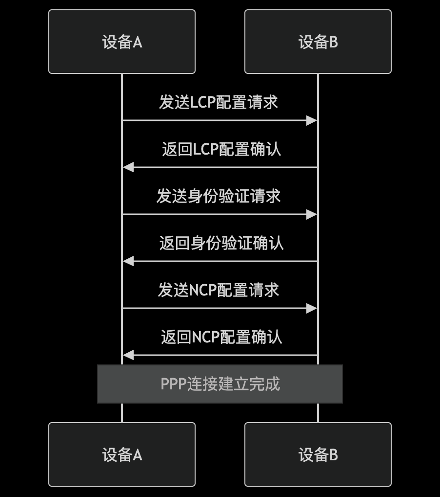
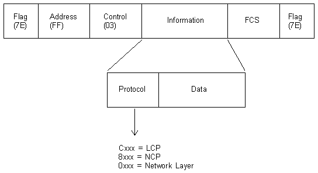

PPP（Point-to-Point Protocol，点对点协议）是一种用于在点对点链路上传输数据的协议。PPP 广泛应用于拨号连接、DSL、VPN 等场景，支持多种网络层协议（如 IP、IPX）的封装和传输。

## 1.PPP的工作原理

| 属性       | 说明                             |
| -------- | ------------------------------ |
| **全称**   | Point-to-Point Protocol（点到点协议） |
| **层次**   | 数据链路层（广域网）                     |
| **工作方式** | 全双工链路，点到点数据传输封装                |
| **特点**   | 无 MAC 地址（区别于以太网），直接点对点通信       |



- LCP（Link Control Protocol）协商：
> 设备 A 和设备 B 通过 LCP 协商链路参数（如最大帧大小、身份验证协议）。
- 身份验证：
> 设备 A 和设备 B 使用身份验证协议（如 PAP、CHAP）验证对方身份。
- NCP（Network Control Protocol）协商：
> 设备 A 和设备 B 通过 NCP 协商网络层协议（如 IP、IPX）的参数。

PPP 支持两种链路的透明传输：

- 面向字节的异步链路：采用字节填充法。当信息字段中出现 0x7E 时，将其替换为 0x7D 0x5E；出现 0x7D 时，替换为 0x7D 0x5D。
- 面向比特的同步链路：采用比特填充法。发送端在发现连续 5 个 "1" 后插入一个 "0"；接收端删除连续 5 个 "1" 后的 "0"。  

> 为什么是 0x7D 和 0x5E/0x5D？

> PPP帧使用标志字节（Flag Byte）0x7E（即二进制 0111 1110）来标识帧的开始和结束：如果信息字段里恰好出现了 0x7E，接收方会误以为帧结束了,我们使用一个转义字节（Escape Byte）0x7D标记"下一个字节需要特殊处理"。如遇到 0x5E → 发送 0x7D 0x5E，遇到 0x5D → 发送 0x7D 0x5D.

> 为什么是 0x7D 作为转义字节？

> 0x7D = 0111 1101，与标志字节 0x7E = 0111 1110 仅差最低位（0x7D 末位是1，0x7E 末位是0）。
> 选择它的原因：
>  - 易识别：与帧定界符 0x7E 高度相似，便于硬件/软件统一处理
>  - 避免冲突：0x7D 本身不是控制字符，在数据中出现的概率相对较低
>  - 历史沿袭：源自 HDLC 协议的转义约定

> 为什么第二个字节是 0x5E 和 0x5D？

> 这是异或运算（XOR）的结果：0x7E XOR 0x20 = 0x5E,0x7D XOR 0x20 = 0x5D即：原字节与 0x20（第5位取反）进行异或。
> 为什么用 0x20？
>  - 0x20 是 ASCII 空格，第5位（从0开始数）为1
>  - 翻转第5位后，数值落入 0x00-0x1F 控制字符区域附近，明确标识这些是"被转义的数据"而非真正的控制字符
>  - 保持最高位为0，确保与7位ASCII兼容


## 2.PPP 帧格式



| 字段                  | 长度      | 值/说明                               |
| ------------------- | ------- | ---------------------------------- |
| **Flag（标志）**        | 1 Byte  | `0x7E`（二进制 `01111110`），标识帧的起始和结束   |
| **Address（地址）**     | 1 Byte  | 固定为 `0xFF`（广播地址），PPP 为点到点链路，无需寻址   |
| **Control（控制）**     | 1 Byte  | 固定为 `0x03`，表示无序号帧，PPP 不提供可靠传输和流量控制 |
| **Protocol（协议）**    | 2 Bytes | 标识封装的上层协议类型                        |
| **Information（信息）** | 可变      | 承载上层协议数据，最大长度由 MRU 决定，默认 1500 字节   |
| **FCS（帧校验序列）**      | 2 Bytes | CRC 校验和，用于检测帧完整性                   |
| **Flag（标志）**        | 1 Byte  | `0x7E`，标识帧结束                       |

其中Protocol字段标识了上层协议类型，如 IP、IPX 等。

| 值        | 含义               |
| -------- | ---------------- |
| `0x0021` | IP 数据报           |
| `0xC021` | LCP 报文           |
| `0xC023` | PAP 报文           |
| `0xC223` | CHAP 报文          |
| `0x8021` | IPCP 报文（IP 控制协议） |

## 3.PPP 链路建立流程

### 3.1 链路层协商（LCP 协商）

LCP（Link Control Protocol，链路控制协议）负责链路层参数的协商，是 PPP 链路建立的第一步。只要链路开启，就会自动进行协商。

| 参数                            | 说明                                               |
| ----------------------------- | ------------------------------------------------ |
| **MRU（Maximum Receive Unit）** | 最大接收单元，默认 1500 字节。在 VRP 平台上，MRU 使用接口配置的 MTU 值表示。 |
| **认证协议**                      | 协商下一阶段是否进行认证，以及使用 PAP 还是 CHAP                    |
| **魔术字（Magic Number）**         | 随机生成的数字，用于检测链路环路。两端产生相同魔术字的概率几乎为 0。              |
| **多链路捆绑（MP）**                 | 是否为多链路捆绑                                         |

本端 AR1 发送 Configure-Request 报文，携带协商参数。对端 AR2 收到后，有三种响应方式：
- 识别但不认可参数 → 回复 Configure-NAK，携带认可参数值 → AR1 重新发送 Request
- 不识别某些参数 → 回复 Configure-Reject，携带不识别的参数 → AR1 重新发送 Request（去掉不识别参数）
- 识别且认可参数 → 回复 Configure-ACK → LCP 协商通过

### 3.2 认证协商（可选）

认证协商通过链路建立阶段协商的认证方式进行。PPP 支持 PAP 和 CHAP 两种认证协议，一条 PPP 链路的两端可以使用不同的认证协议，但被认证方必须支持认证方要求使用的协议并正确配置用户名和密码。

PAP 是密码认证协议，采用两次握手：
- 被认证端发送 Authenticate-Request 报文，携带明文的用户名和密码
- 认证端收到后，与本地存储对比：
  - 相同 → 回复 Authenticate-ACK，认证通过
  - 不同 → 回复 Authenticate-NAK，认证失败

特点：明文传输用户名和密码，安全性差，容易被窃听。

```ensp
# 认证端（AR1）
[AR1]aaa
[AR1-aaa]local-user test password cipher Huawei@123
[AR1-aaa]local-user test service-type ppp
[AR1]int Serial 1/0/0
[AR1-Serial1/0/0]ppp authentication-mode pap    # 只有认证端选择认证模式
# 被认证端（AR2）
[AR2]interface Serial 1/0/0
[AR2-Serial1/0/0]ppp pap local-user test password cipher Huawei@123
```

CHAP 是挑战握手认证协议，采用三次握手，密码不以明文传输，安全性更高:
- 认证端发送 Challenge 报文，携带报文 ID、挑战随机数、可选的用户名
- 被认证端收到后计算：将密码 + 报文 ID + 挑战随机数通过 MD5 计算得到 HASH 值 1
- 被认证端发送 Response 报文，携带 HASH 值 1、报文 ID、接口用户名
- 认证端收到后计算：
  - 根据用户名找出对应密码
  - 将密码 + 报文 ID + 挑战随机数通过 MD5 计算得到 HASH 值 2
- 认证端对比 HASH 值 1 和 HASH 值 2：
  - 相等 → 回复 Success，认证通过
  - 不等 → 回复 Failure，认证失败

注意：如果认证端发送的 Challenge 报文携带了用户名，被认证端会使用该用户名对应的密码进行计算，而非自身接口用户名对应的密码。

```mermaid
sequenceDiagram
    autonumber
    participant 认证端 as 认证端（AR1）
    participant 被认证端 as 被认证端（AR2）

    %% === 第一次握手：Challenge ===
    rect rgb(30, 30, 50)
        Note over 认证端,被认证端: 第一次握手 — Challenge
        认证端->>被认证端: Challenge 报文<br/>{ 报文ID, 挑战随机数, [可选用户名] }
    end

    %% 被认证端本地计算
    Note over 被认证端: 本地计算<br/>HASH值1 = MD5( 密码 + 报文ID + 挑战随机数 )

    %% === 第二次握手：Response ===
    rect rgb(30, 50, 30)
        Note over 认证端,被认证端: 第二次握手 — Response
        被认证端->>认证端: Response 报文<br/>{ HASH值1, 报文ID, 接口用户名 }
    end

    %% 认证端本地计算
    Note over 认证端: 本地计算<br/>HASH值2 = MD5( 密码 + 报文ID + 挑战随机数 )

    %% === 第三次握手：Success / Failure ===
    rect rgb(50, 30, 30)
        Note over 认证端,被认证端: 第三次握手 — 验证结果
        alt HASH值1 == HASH值2
            认证端->>被认证端: Success 报文<br/>认证通过 
        else HASH值1 != HASH值2
            认证端->>被认证端: Failure 报文<br/>认证失败 
        end
    end

    %% 关键提示
    Note over 认证端,被认证端: 密码始终以哈希形式传输，不在链路上暴露明文
```



```ensp
# 认证端（AR1）
[AR1]aaa
[AR1-aaa]local-user test password cipher Huawei@123
[AR1-aaa]local-user test service-type ppp
[AR1]int Serial 1/0/0
[AR1-Serial1/0/0]ppp authentication-mode chap    # 只有认证端选择认证模式
[AR1-Serial1/0/0]ppp chap user abc                # 认证端自身使用的用户名
# 被认证端（AR2）
[AR2]aaa
[AR2-aaa]local-user abc password cipher Huawei@123
[AR2-aaa]local-user abc service-type ppp
[AR2]interface Serial 1/0/0
[AR2-Serial1/0/0]ppp chap user test               # 被认证端发送的用户名
[AR2-Serial1/0/0]ppp chap password cipher Huawei@123
```

### 3.3 网络层协商（NCP 协商）

NCP（Network Control Protocol，网络控制协议）负责网络层参数的协商。对于 IP 网络，使用 IPCP（IP Control Protocol）进行协商。

其中：IPCP 的两个核心功能：
- 代替免费 ARP，检测地址冲突：协商双方 IP 地址是否冲突
- 代替 ARP，不需要获取对端 MAC：PPP 链路不存在 MAC 地址，通过 NCP 协商直接确定对端网络层可达性

协商过程：
- 配置 IP 地址后的设备（AR1）发送 Configure-Request 报文，携带自身 IP 地址。
- AR2 收到后进行参数检测：
  - IP 地址相同 → 认为参数不合法，回复 Configure-NAK
  - IP 地址不同 → 认为参数合法，回复 Configure-ACK

#### 3.3.1 静态 NCP 协商

手工配置 IP 地址，两端可以任意配置，只要确保地址不同即可。即使两端地址不在同一网段，也可以正常通信，因为 NCP 协商通过后，设备会自动为其添加一条 32 位直连路由条目。为 PPP 添加的路由条目只需要确保出接口是自身的 Serial 接口即可，不需要指定下一跳。

```ensp
[AR1]ip route-static 2.2.2.2 32 Serial 1/0/0
```

#### 3.3.2 动态 NCP 协商

被认证端的地址通过认证端自动获取：
- AR2 发送 Configure-Request，携带 IP 地址 0.0.0.0
- AR1 收到后判断地址为 0.0.0.0，认为参数不合法，回复 Configure-NAK，携带地址池中分配的地址
- AR2 收到 NAK 后，使用报文中携带的地址，重新发送 Request 报文

```ensp
# 认证端（AR1）配置地址池
[AR1]ip pool PPP
[AR1-ip-pool-PPP]network 192.168.1.0 mask 24

[AR1]interface Serial 1/0/0
[AR1-Serial1/0/0]ip address 100.1.1.1 31
[AR1-Serial1/0/0]remote address pool ppp

# 被认证端（AR2）
[AR2]interface Serial 1/0/0
[AR2-Serial1/0/0]ip address ppp-negotiate
```
