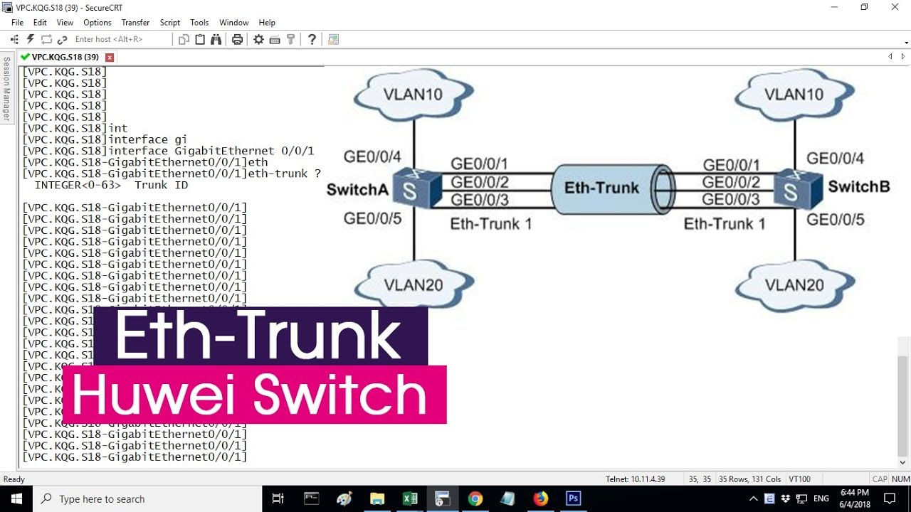

## 1.链路聚合的作用

**设备冗余**通过增加交换机等网络设备来实现，主要解决单点设备故障导致全网瘫痪的问题，但需配置 STP 防止环路。**链路冗余**通过增加物理链路来实现，主要解决单条链路故障导致通信中断的问题，但 STP 会将冗余链路阻塞。

网络转发的瓶颈是带宽，带宽可以通过增加链路获得。但 STP（生成树协议）的存在，会将新增的链路识别为环路并进行阻塞。逻辑上链路没有增加，带宽瓶颈依然存在。

**通过链路聚合技术，将多条物理链路虚拟化为逻辑上的一条链路，从而规避 STP 的阻塞机制**。在 STP 的视角中，聚合后的链路只表现为一个逻辑接口，不存在物理环路，因此不会被阻塞。


## 2.链路聚合的实现

| 术语                 | 定义                     |
| ------------------ | ---------------------- |
| **聚合组（Eth-Trunk）** | 将多个物理接口捆绑在一起形成的逻辑接口    |
| **成员接口 / 成员链路**    | 加入聚合组的物理接口及其对应的物理链路    |
| **活动接口 / 活动链路**    | 参与数据转发的成员接口和链路         |
| **非活动接口 / 非活动链路**  | 处于备份状态、不参与数据转发的成员接口和链路 |
| **聚合模式**           | LACP 模式、手工模式           |



### 2.1 手工模式

```ensp
[S1] interface Eth-Trunk 1                          // 创建逻辑聚合组
[S1-Eth-Trunk1] mode manual load-balance            // 配置为手工模式
[S1-Eth-Trunk1] trunkport GigabitEthernet 0/0/2 0/0/3   // 将物理接口加入逻辑组（方式一）

// 或在物理接口视图下加入（方式二）
[S1-GigabitEthernet0/0/3] eth-trunk 1
```
| 特点      | 说明                       |
| ------- | ------------------------ |
| 无协商机制   | 两端设备不发送协商报文，直接强制将接口加入聚合组 |
| 所有成员均活跃 | 所有加入组的物理接口默认都是活跃接口       |
| 配置简单    | 无需复杂的优先级和选举机制            |

手工模式存在以下问题：

**无法区分活跃/非活跃链路**：所有加入的物理接口都是活跃接口，无法设置备份链路。

**单通问题**：一端配置为链路聚合，另一端未配置或未正确配置时，该端接口仍可能变为 `up` 状态，导致数据黑洞（一端发、一端不收）。

**无错误检测**：无法动态检测链路故障或配置不一致问题。

### 2.2  LACP 模式（Link Aggregation Control Protocol）

LACP 基于 IEEE 802.3ad 标准，通过发送 LACPDU（Link Aggregation Control Protocol Data Unit） 报文进行两端信息的动态协商。

| 子模式         | 协商失败时的行为               | 适用场景             |
| ----------- | ---------------------- | ---------------- |
| **LACP 静态** | 物理端口状态变为 `down`        | 要求严格的链路一致性，不允许单通 |
| **LACP 动态** | 物理端口退出聚合组，保持 `up` 正常转发 | 需要链路灵活切换的场景      |

```ensp
[S1] interface Eth-Trunk 1
[S1-Eth-Trunk1] mode lacp-static                      // 配置为 LACP 静态模式
[S1-Eth-Trunk1] trunkport GigabitEthernet 0/0/2 0/0/3  // 将物理接口加入聚合组

// 设置最大活跃成员链路数（控制活跃/非活跃链路数量）
[S1-Eth-Trunk1] max active-linknumber <1-8>           // 默认值为成员接口总数
```
| 优势             | 说明                                  |
| -------------- | ----------------------------------- |
| **动态协商**       | 两端通过 LACPDU 交换信息，自动确认聚合关系           |
| **活跃/非活跃链路区分** | 可设置主链路和备份链路，实现链路冗余                  |
| **避免单通**       | 协商失败时端口 `down` 或退出聚合组，防止数据黑洞        |
| **带宽可控**       | 通过 `max active-linknumber` 精确控制可用带宽 |

## 3.LACP 选举机制详解

### 3.1活跃链路的选择（接口级选举）

```ensp
[S1-GigabitEthernet0/0/4] lacp priority <0-65535>    
// 设置接口 LACP 优先级，默认 32768
```
| 比较规则                | 说明               |
| ------------------- | ---------------- |
| **第一优先级：LACP 优先级值** | 值越小越优先           |
| **第二优先级：接口编号**      | 优先级相等时，接口编号越小越优先 |

该比较方式只在第一次选举非活跃成员时生效。如果已经存在非活跃接口，后续即使修改优先级，也不会重新触发选举（除非开启抢占功能）。

### 3.2 主备设备的选举（设备级选举）

如果设备两端选择的非活跃链路不同（例如 A 端选 G0/0/3 为非活跃，B 端选 G0/0/4 为非活跃），会导致协商不一致。此时需要通过主备设备选举，由主设备统一决定哪条链路为非活跃。

```ensp
[S1] lacp priority <0-65535>    // 设置系统 LACP 优先级，默认 32768
```
| 比较规则                | 说明                 |
| ------------------- | ------------------ |
| **第一优先级：系统优先级值**    | 值越小越优先             |
| **第二优先级：系统 MAC 地址** | 优先级相等时，MAC 地址越小越优先 |

主备角色不是固定的，可以根据优先级值的改变而动态变化。

### 链路抢占功能

```ensp
[S1-Eth-Trunk1] lacp preempt enable                  // 开启链路抢占（两端都要配置）
[S1-Eth-Trunk1] lacp preempt delay <10-180>          // 修改抢占延迟，默认 30 秒
```
| 项目       | 说明                                   |
| -------- | ------------------------------------ |
| **作用**   | 当更高优先级的接口恢复或加入时，自动抢占成为活跃链路           |
| **要求**   | 主备设备两端都必须开启抢占功能                      |
| **延迟时间** | 默认 30 秒，可调整范围 10~180 秒（防止链路抖动导致频繁切换） |


## 4.负载分担机制

基于流的负载分担（默认方式）:

```ensp
[S1-Eth-Trunk1] load-balance ?
  dst-ip       基于目标 IP
  dst-mac      基于目标 MAC
  src-dst-ip   基于源目 IP（默认方式）
  src-dst-mac  基于源目 MAC
  src-ip       基于源 IP
  src-mac      基于源 MAC
```
| 方式            | 哈希依据           | 适用场景            |
| ------------- | -------------- | --------------- |
| `src-dst-ip`  | 源 IP + 目的 IP   | **默认推荐**，三层网络环境 |
| `src-dst-mac` | 源 MAC + 目的 MAC | 二层交换环境          |
| `src-ip`      | 仅源 IP          | 多对一通信场景         |
| `dst-ip`      | 仅目的 IP         | 一对多通信场景         |
| `src-mac`     | 仅源 MAC         | 终端设备区分          |
| `dst-mac`     | 仅目的 MAC        | 服务器负载均衡         |

Eth-Trunk 默认采用基于流的负载分担，通过哈希算法将同一数据流固定到同一条链路。

## 5.链路聚合与 STP 的关系

在 STP 中，链路聚合只显示逻辑接口（Eth-Trunk），不显示物理成员接口。因此 STP 不会对成员接口进行阻塞操作。

| 项目          | 说明                                       |
| ----------- | ---------------------------------------- |
| **BPDU 发送** | 随机选择一个成员接口发送 STP 的 BPDU 报文               |
| **STP 角色**  | 链路聚合接口的 STP 角色 = 发送 BPDU 的那个物理接口的 STP 角色 |

链路聚合的接口自身存在防环机制：从成员接口收到的流量，不会向其他成员接口转发。这意味着即使物理上形成了环路（例如两台交换机之间有多条链路），聚合组内部也会阻止流量在成员接口之间循环。

### 6.查看链路聚合状态

```ensp
[S1] display interface Eth-Trunk 1        // 查看链路聚合的详细状态
[S1] display eth-trunk 1                  // 查看聚合组成员信息
[S1] display lacp statistics eth-trunk 1  // 查看 LACP 协议统计信息
```
