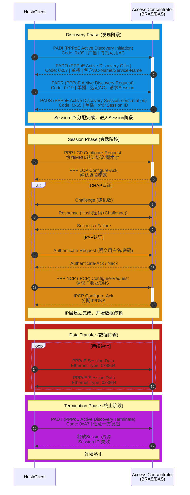
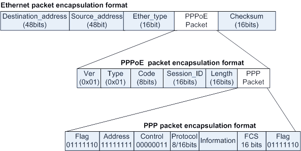

## 1.PPPoE 协议简述

PPP 协议设计之初是为点到点串行链路（如电话线、专线）服务的，它天然假设链路两端各只有一台设备。但以太网是广播型多路访问网络，一条链路上可以连接多台设备。如果要在以太网上实现 PPP 的链路控制、认证、计费等功能，就需要一种机制让 PPP 能够"跑在"以太网上——这就是 PPPoE。

PPPoE 的核心思想很简单：先进行 PPP 的封装，再进行以太网的封装。数据在发送时，先被封装成 PPP 帧，然后 PPP 帧再被封装进以太网帧中传输。这样，以太网只负责"把包送到对端"，而 PPP 负责"建立连接、认证用户、协商 IP"。

| 特性          | PPP         | PPPoE                    |
| ----------- | ----------- | ------------------------ |
| **链路类型**    | 点到点串行链路     | 以太网（广播型多路访问）             |
| **寻址方式**    | 无需寻址（点到点）   | 需要以太网 MAC 地址             |
| **建立过程**    | 直接 LCP 协商   | 先 Discovery 阶段，再 PPP 流程  |
| **会话标识**    | 无（链路本身就是会话） | Session ID               |
| **MTU/MRU** | 默认 1500     | 最大 1492（受 PPPoE 头开销限制）   |
| **应用场景**    | 专线、拨号       | 宽带接入（ADSL/光纤）            |
| **多用户支持**   | 单链路单用户      | 单链路多用户（通过 Session ID 区分） |


PPPoE 的典型应用场景包括：
- 家庭宽带拨号上网：用户通过光猫或路由器拨号，运营商 BRAS 设备作为 PPPoE 服务器端进行认证和计费
- 企业专线接入：企业通过 PPPoE 拨号接入运营商网络，实现用户控制和流量统计
- 校园网/酒店网：通过 PPPoE 实现多用户的独立认证和计费

## 2.PPPoE 的三个阶段

PPPoE 的工作流程分为三个阶段：发现阶段（Discovery）、会话阶段（Session） 和 终结阶段（Terminate）。



发现阶段的目的是在客户端（Host）和服务器端（Access Concentrator，AC）之间建立会话标识（Session ID）。由于以太网是广播网络，客户端一开始不知道服务器在哪里，因此需要通过广播发现。



| 字段             | 长度      | 说明                                             |
| -------------- | ------- | ---------------------------------------------- |
| **Version**    | 4 bits  | PPPoE 版本号，固定为 `0x1`                            |
| **Type**       | 4 bits  | PPPoE 类型，固定为 `0x1`                             |
| **Code**       | 1 Byte  | 标识报文类型，发现阶段各报文取值不同                             |
| **Session ID** | 2 Bytes | 会话标识。发现阶段为 `0x0000`，PADS 中由服务器分配唯一值            |
| **Length**     | 2 Bytes | Payload 字段的长度（字节数）                             |
| **Payload**    | 可变      | 发现阶段为 TLV（Type-Length-Value）格式的标签，会话阶段为 PPP 报文 |


| 报文       | Code 值 | Session ID | 说明                  |
| -------- | ------ | ---------- | ------------------- |
| **PADI** | `0x09` | `0x0000`   | 客户端广播发起发现           |
| **PADO** | `0x07` | `0x0000`   | 服务器单播响应             |
| **PADR** | `0x19` | `0x0000`   | 客户端单播请求建立会话         |
| **PADS** | `0x65` | 分配的值       | 服务器确认，分配 Session ID |
| **PADT** | `0xA7` | 会话的值       | 终止会话（可在会话建立后任意时间发送） |

PPPoE 发现阶段包含两个重要的安全标签：
- **Host-Uniq**（主机唯一标识）：
    - 由客户端生成的一个唯一值，包含在 PADI 中
    - 服务器在 PADO 中原样返回
    - 客户端通过匹配 Host-Uniq 确认响应来自自己发起的请求
    - 防止在多客户端环境下响应混乱
- **AC-Cookie**（接入集中器 Cookie）：
    - 由服务器生成的 16 字节随机值，包含在 PADO 中
    - 客户端在 PADR 中原样返回
    - 服务器可根据源 MAC 地址重新生成唯一值，用于防止 DoS 攻击
    - 确保只有真正参与发现过程的客户端才能进入会话阶段

会话阶段是 PPPoE 的核心工作阶段，此时 Session ID 已经建立，客户端和服务器之间执行标准的 PPP 流程。

会话阶段的详细过程与标准 PPP 相同：
- **LCP 协商**：协商 MRU、认证协议、魔术字等链路层参数
- **认证协商**：使用 PAP 或 CHAP 进行用户身份验证
- **NCP 协商**：使用 IPCP 协商 IP 地址分配方式（静态或动态）
- **数据传输**：协商完成后，开始正常的 IP 数据报文传输

注意MRU 限制：PPPoE 会话阶段的 MRU 协商不能超过 1492 字节。原因是：
- 以太网 MTU 为 1500 字节
- PPPoE 报头占 6 字节（Version/Type/Code/Session ID/Length）
- PPP 报头至少占 2 字节（Protocol 字段）

因此 PPP 的 MRU 最大为 1500 - 6 - 2 = 1492 字节

如果上层应用发送的数据包超过此限制，需要进行分片或调整 TCP MSS 值。

PPPoE 会话可以在建立后的任意时间由客户端或服务器端终止。终止方式：
- 发送 PADT（PPPoE Active Discovery Terminate）报文
    - Code 字段为 0xA7
    - Session ID 为要终止的会话标识
- 发送方或接收方在收到 PADT 后，必须停止使用该 Session ID 发送流量

常见触发场景：
- 用户主动断开拨号连接
- 服务器端检测到异常（如欠费、超时）
- 物理链路断开

## 3.PPPoE 客户端配置（VRP）

PPPoE 客户端配置分为三个步骤：创建拨号接口、绑定物理接口、配置缺省路由。

```ensp
[R1]dialer-rule
[R1-dialer-rule]dialer-rule 1 ip permit
[R1-dialer-rule]quit

[R1]interface dialer 1
[R1-Dialer1] dialer user enterprise           # 对端用户名，必须与服务器端一致
[R1-Dialer1] dialer-group 1                   # 将接口置于拨号访问组
[R1-Dialer1] dialer bundle 1                  # 指定 Dialer Bundle 编号
[R1-Dialer1] ppp chap user enterprise@huawei  # CHAP 认证用户名
[R1-Dialer1] ppp chap password cipher huawei123
[R1-Dialer1] ip address ppp-negotiate         # 通过 PPP 协商自动获取 IP
```

| 命令                          | 作用                                                |
| --------------------------- | ------------------------------------------------- |
| `dialer-rule`               | 进入 Dialer-rule 视图，配置发起 PPPoE 会话的条件（如允许 IP 流量触发拨号） |
| `interface dialer number`   | 创建并进入 Dialer 接口，这是 PPPoE 客户端的逻辑接口                 |
| `dialer user user-name`     | 配置对端用户名，必须与服务器端 PPP 用户名匹配                         |
| `dialer-group group-number` | 将接口置于一个拨号访问组，与 dialer-rule 关联                     |
| `dialer bundle number`      | 指定 Dialer Bundle，用于将物理接口与拨号接口关联                   |
| `ip address ppp-negotiate`  | 通过 NCP 协商自动获取 IP 地址                               |

```ensp
[R1]interface GigabitEthernet 0/0/1
[R1-GigabitEthernet0/0/1] pppoe-client dial-bundle-number 1
[R1-GigabitEthernet0/0/1] quit
```

| 命令                                       | 作用                                  |
| ---------------------------------------- | ----------------------------------- |
| `pppoe-client dial-bundle-number number` | 将物理接口与 Dialer Bundle 绑定，建立 PPPoE 会话 |

```ensp
[R1]ip route-static 0.0.0.0 0.0.0.0 dialer 1
```

这条路由的作用是：当路由表中没有匹配项时，流量通过 Dialer 1 接口发起 PPPoE 会话。也就是说，没有流量时链路保持空闲，有流量时自动拨号建立连接。

## 4. PPPoE 服务器端配置（VRP）

PPPoE 服务器端配置分为三个步骤：创建地址池与虚拟模板、将物理接口与虚拟模板绑定、创建认证用户。

```ensp
# 创建地址池与虚拟模板
[R2]ip pool pool1
[R2-ip-pool-pool1] network 192.168.1.0 mask 255.255.255.0
[R2-ip-pool-pool1] gateway-list 192.168.1.254
[R2-ip-pool-pool1] quit

[R2]interface Virtual-Template 1
[R2-Virtual-Template1] ppp authentication-mode chap    # 配置认证方式
[R2-Virtual-Template1] ip address 192.168.1.254 255.255.255.0
[R2-Virtual-Template1] remote address pool pool1       # 指定地址池

# 将物理接口与虚拟模板绑定
[R2]interface GigabitEthernet 0/0/0
[R2-GigabitEthernet0/0/0] pppoe-server bind virtual-template 1
[R2-GigabitEthernet0/0/0] quit

# 创建访问用户
[R2]aaa
[R2-aaa] local-user enterprise password cipher Huawei@123
[R2-aaa] local-user enterprise service-type ppp
# 这里创建的用户名 enterprise 和密码 Huawei@123 必须与客户端配置的 dialer user 和 ppp chap user 匹配
```


