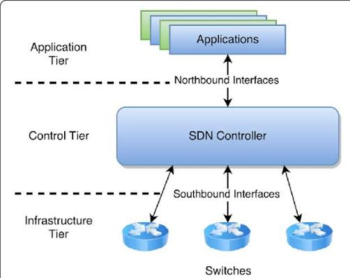

网络层是OSI参考模型中的第三层，位于传输层之下、数据链路层之上。它的主要任务是把分组从源端传到目的端，为分组交换网上的不同主机提供通信服务。网络层的传输单位是数据报（Datagram）。

## 1.网络层的核心功能

功能一：路由选择与分组转发（最佳路径）
> 路由选择是指确定数据报从源主机到目的主机的最佳传输路径的过程。分组转发则是指路由器根据路由表将到达的数据报从输入端口转发到合适的输出端口的过程。这两个功能紧密配合，共同完成数据报在网络中的传输。路由选择关注的是"走哪条路"，而分组转发关注的是"怎么把包送出去"。

功能二：异构网络互联
> 网络层能够将不同类型的物理网络（如以太网、WiFi、4G/5G移动网络等）互联起来，使得运行在不同网络上的主机能够相互通信。路由器是实现异构网络互联的关键设备，它屏蔽了底层物理网络的差异，向上层提供统一的网络服务接口。

功能三：拥塞控制
> 当网络中某段时间内对资源（如带宽、缓存）的需求超过了可用资源时，网络就会处于拥塞状态。拥塞控制的目标是在网络出现或即将出现拥塞时，采取一定的措施来缓解这种拥塞，防止网络性能的急剧下降甚至崩溃。

> 拥塞控制的方法主要分为两类：
> - 开环控制（静态方法）：在设计网络时预先考虑可能发生拥塞的因素，通过合理的资源分配和流量控制来预防拥塞的发生。这种方法不依赖网络当前的运行状态，实现简单但灵活性较差。
> - 闭环控制（动态方法）：通过监测网络的运行状态，当检测到拥塞时动态调整网络参数（如降低发送速率、改变路由等）来缓解拥塞。这种方法响应及时，但需要额外的监测和控制开销。

## 2.软件定义网络（SDN）

一种网络架构范式，将网络的控制平面与数据平面分离，通过软件集中管理网络行为。

### 2.1 路由器功能：转发与路由选择

路由器的核心功能可以分为两个方面：

- 转发（Forwarding）
> 转发是指当数据报到达路由器的某个输入链路时，路由器根据转发表将该数据报转发到适当的输出链路的过程。转发的特点是：
> - 时间短，通常由硬件实现
> - 属于数据平面的功能
> - 关注的是"本地动作"，即路由器根据转发表对单个数据报进行快速处理

- 路由选择（Routing）
> 路由选择是指确定数据报从源主机到目的主机的端到端路径的过程。路由选择的特点是：
> - 时间较长，通常由软件实现
> - 属于控制平面的功能
> - 关注的是"全局策略"，即确定网络中各路由器之间的路由方式

| 特性      | 数据平面           | 控制平面              |
| ------- | -------------- | ----------------- |
| 功能      | 数据处理过程中的具体转发操作 | 控制和管理网络协议的运行      |
| 实现方式    | 通常硬件实现         | 通常软件实现            |
| 典型协议/操作 | 转发表查询、数据报转发    | OSPF、RIP、BGP等路由协议 |
| 关注点     | 单个数据报的快速处理     | 网络全局路由策略的制定       |

### 2.2 数据平面详解

数据平面执行的主要功能是根据转发表进行转发，这是路由器的本地动作。

转发表（Forwarding Table）是由路由表（Routing Table）生成的。路由表包含了到达各个目的网络的路径信息，而转发表则是路由表的优化形式，用于快速查找。当分组到达路由器时，路由器检查分组首部中的目的地址，查询转发表，确定输出端口，然后将分组从该端口转发出去。

转发表的生成过程：路由选择算法根据网络拓扑和链路状态信息计算出路由表，然后路由器根据路由表生成优化的转发表，用于实际的数据报转发。

### 2.3 控制平面详解

在传统方法中，路由选择算法运行在每台路由器中，每台路由器都包含转发和路由选择两种功能。

在一台路由器中的路由选择算法与其他路由器中的路由选择算法通信（通过交换路由选择报文），共同计算出路由表和转发表。每台路由器独立运行相同的路由选择协议，通过相互交换路由信息，最终收敛到一致的路由表。

> 这种方式的特点是：
> - 分布式计算，无中心节点
> - 每台路由器既是数据转发设备，也是路由计算设备
> - 典型协议：RIP、OSPF、BGP

SDN（软件定义网络）是一种新兴的网络架构，其核心思想是将控制平面从路由器物理上分离。

SDN的核心思想：
- 路由器仅实现转发功能（数据平面）
- 远程控制器负责计算和分发转发表，供每台路由器使用
- 路由器通过交换包含转发表和其他路由选择信息的报文与远程控制器通信

> 因为计算转发并与路由器交互的控制器是用软件实现的，所以网络是"软件定义的"

> SDN的优势：
> - 集式控制，便于全局优化
> - 控制逻辑与转发硬件解耦，便于灵活编程
> - 支持网络虚拟化和自动化管理
> - 远程控制器可以部署在高可靠性的数据中心中，由ISP或第三方管理

### 2.4 SDN控制平面结构

SDN控制平面主要由两个核心组件构成：

- SDN控制器（网络操作系统）
> SDN控制器维护准确的网络状态信息，包括远程链路、交换机和主机的状态。它为运行在控制平面中的网络控制应用程序提供这些信息。SDN控制器通常是逻辑集中的（可以在多台服务器上实现分布式部署），是SDN架构的大脑。

- 网络控制应用程序
> 这些应用程序根据SDN控制器提供的方法，能够监视、编程和控制下面的网络设备。网络控制应用程序实现了具体的网络策略，如路由选择、接入控制、负载均衡等。

SDN控制器在逻辑上可以分为三个层次：

- 对于网络控制应用程序的接口（北向接口）
> SDN控制器通过"北向接口"与网络控制应用程序交互。该API允许网络控制应用程序在状态管理层之间读写网络状态。北向接口通常是RESTful API，便于上层应用开发。

- 网络范围状态管理层
> 由SDN控制平面作出的最终控制决定，将要求控制器具有有关网络的主机、链路等最新状态信息。这一层负责维护全局网络视图，包括网络拓扑、链路状态、流量统计等信息。

- 通信层（南向接口）
> SDN控制器与受控网络设备之间的通信通过OpenFlow协议等实现，包含"南向接口"。南向接口负责将控制器的指令下发到网络设备，并将设备的状态信息上报给控制器。

