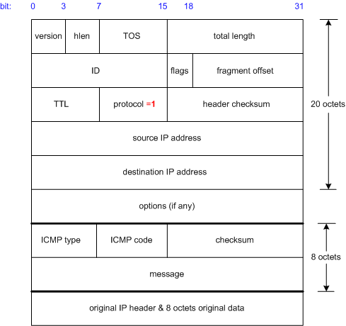
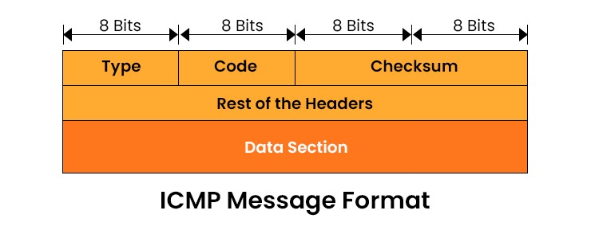
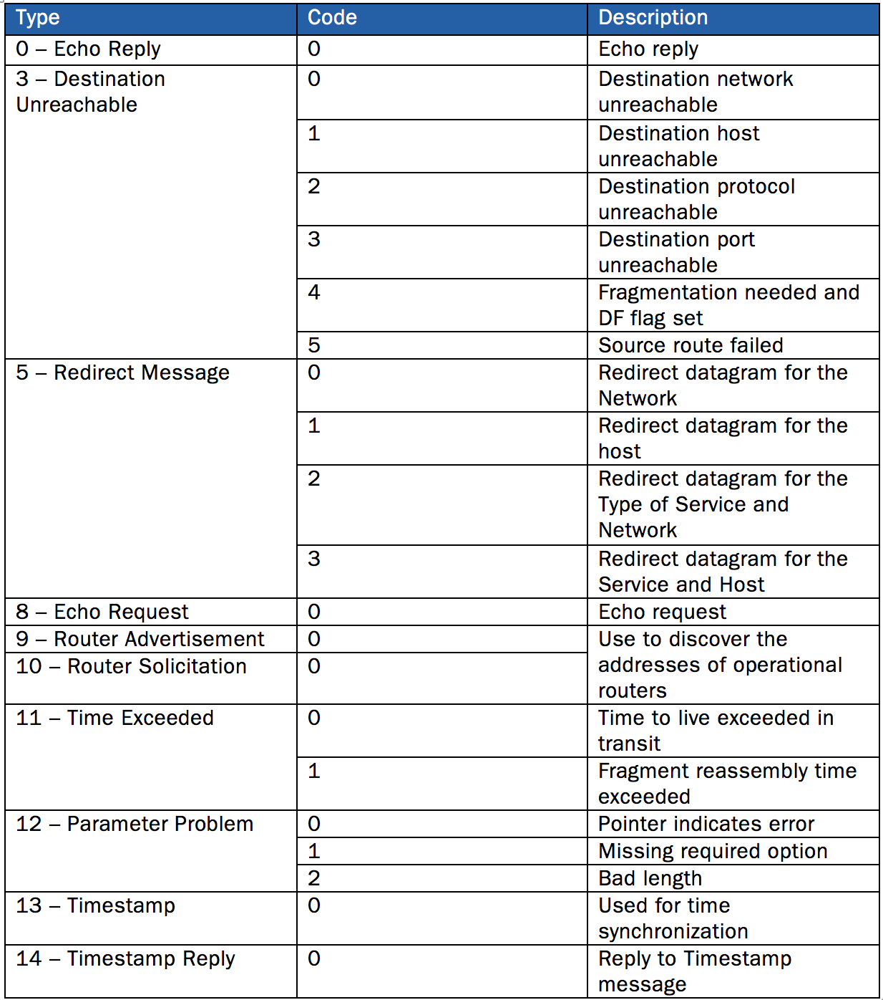
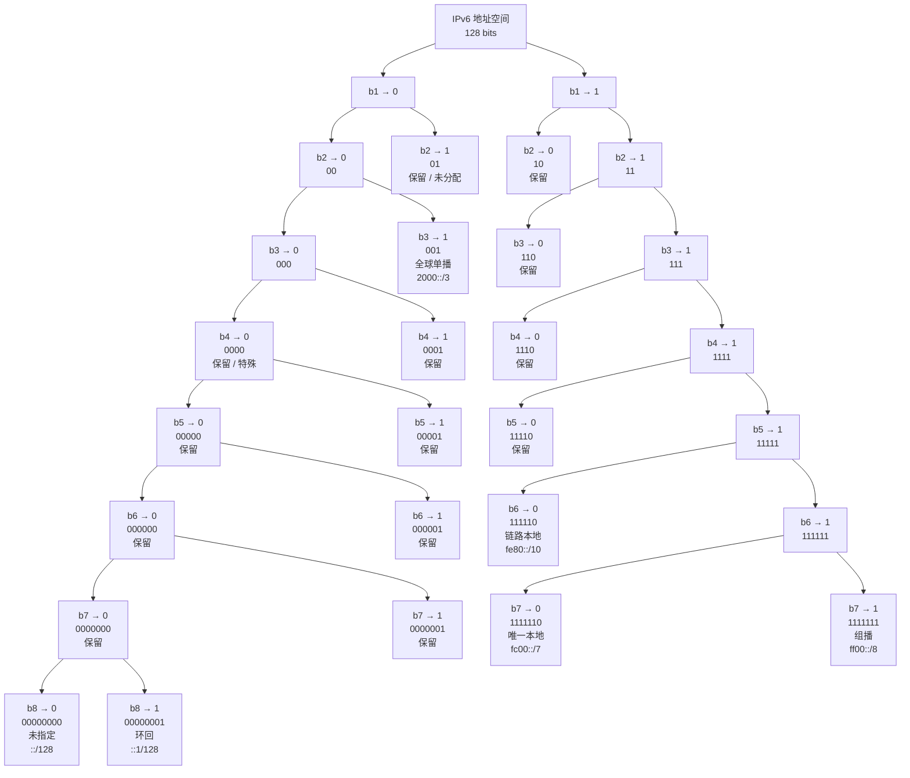
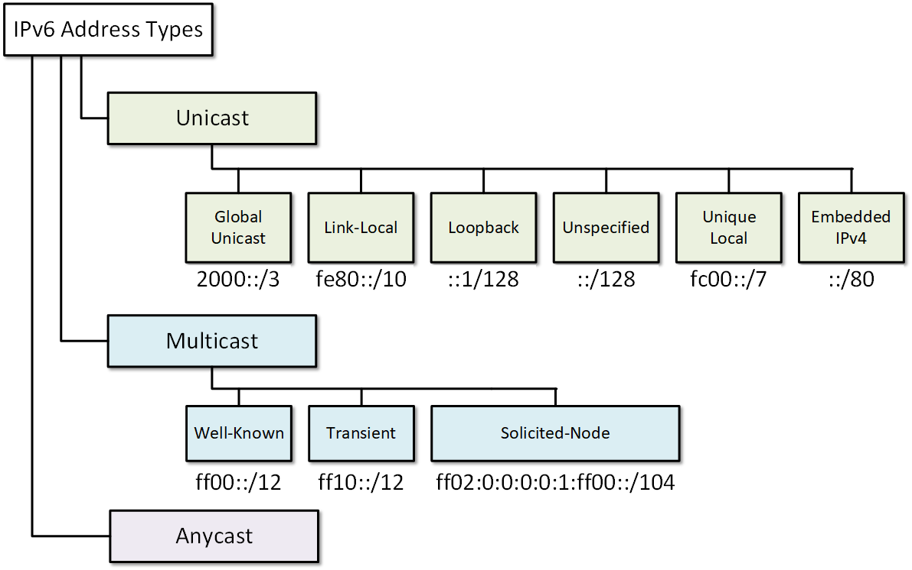
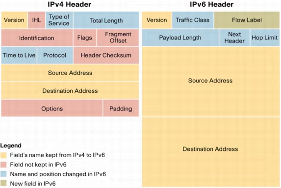
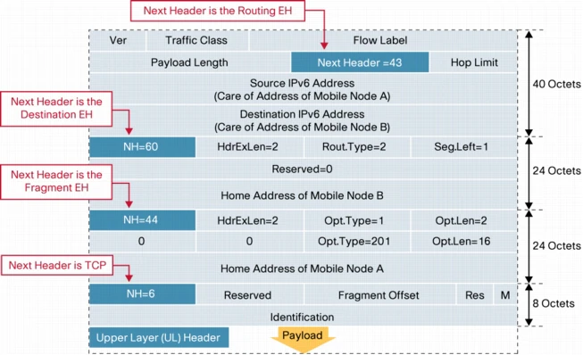
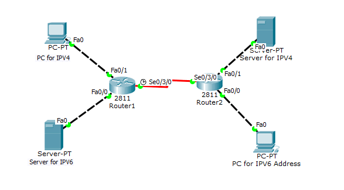
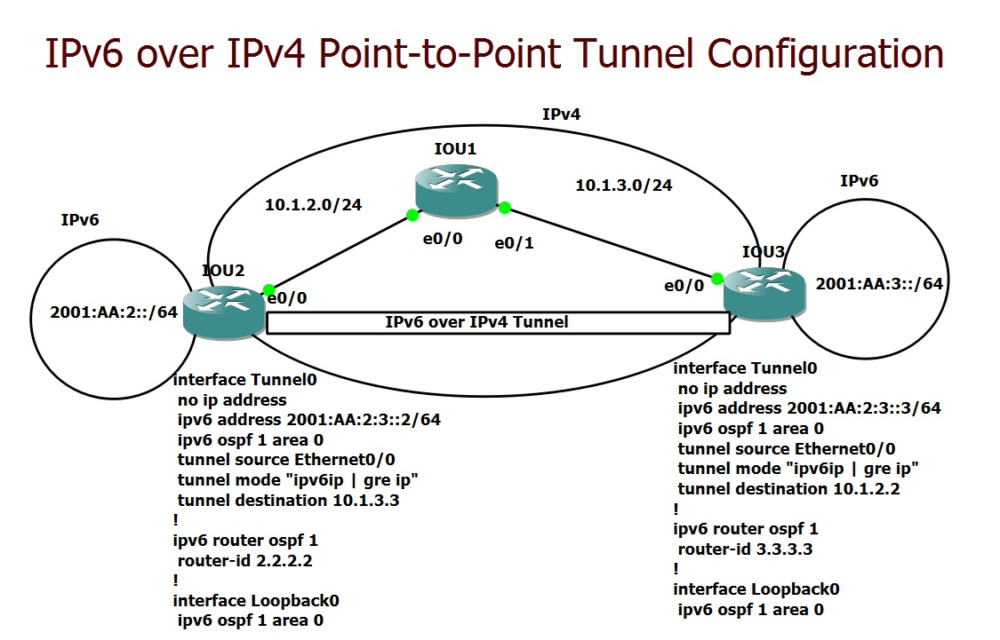

## 1.IP协议简述

⽹际协议 IP 是 TCP/IP 体系中两个最主要的协议之⼀。与 IP 协议配套使⽤的还有三个协议：

- 地址解析协议 ARP；
    - RARP：反向地址解析协议
- ⽹际控制报⽂协议 ICMP；
- ⽹际组管理协议 IGMP。


## 2.虚拟互联网络

如果要把在全世界数以百万计的网络都互相连接起来，并且能够相互通信，是一件很复杂的事情。网络技术是不断发展的，市场上总是有很多不同性能、不同网络协议的网络。将网络互相连接起来需要使用一些中间设备，又称为中间系统或中继（relay）系统：

| 层次        | 中间设备              | 功能说明                       |
| --------- | ----------------- | -------------------------- |
| 物理层       | 转发器（Repeater/中继器） | 对信号进行放大和整形，延长传输距离          |
| 数据链路层     | 网桥/桥接器（Bridge）    | 在数据链路层实现局域网互联，基于 MAC 地址转发帧 |
| 网络层       | 路由器（Router）       | 在网络层实现网络互联，基于 IP 地址转发分组    |
| 数据链路层+网络层 | 桥路器（Brouter）      | 兼具网桥和路由器的功能                |
| 网络层以上     | 网关（Gateway）       | 在传输层及以上实现网络互联，进行协议转换       |

实际的互联网是通过一些路由器连接的，由于参与互联的计算机网络都使用相同的网际 IP 协议，因此可以把互联以后的网络看成是一个虚拟互联网络（Virtual Internet）。

所谓虚拟互联网络也就是逻辑互联网络：IP 协议可以使这些性能各异的网络从用户看起来好像是一个统一的网络；使用 IP 协议的虚拟互联网络可简称为 IP 网。
使用虚拟互联网络的好处是：当互联网上的主机进行通信时，就好像在一个网络上通信一样，而看不见互连的各具体的网络异构细节。


## 3.IP地址和子网掩码

整个互联网就是一个单一的、抽象的网络。IP 地址就是给互联网上的每一台主机（或路由器）的每一个接口分配的一个在全世界范围内唯一的 32 位标识符。IP 地址由互联网名字和数字分配机构 ICANN（Internet Corporation for Assigned Names and Numbers）进行分配。

分类 IP 地址将 IP 地址划分成若干个类别，每一类地址都有两个固定长度的字段组成：
- 网络号（net-id）：标志主机（或路由器）所连接的网络，一个网络号在整个互联网中是唯一的。
- 主机号（host-id）：用于识别该网络中的主机。一台主机号在它前面的网络号所指定的网络的范围内必须是唯一的。

| 类别  | 网络号位数           | 主机号位数 | 第一个字节范围   | 默认子网掩码        | 最大网络数                | 每个网络最大主机数                 |
| --- | --------------- | ----- | --------- | ------------- | -------------------- | ------------------------- |
| A 类 | 8 位（第1位固定为0）    | 24 位  | 0 ~ 127   | 255.0.0.0     | $2^7 - 2 = 126$      | $2^{24} - 2 = 16,777,214$ |
| B 类 | 16 位（前2位固定为10）  | 16 位  | 128 ~ 191 | 255.255.0.0   | $2^{14} = 16,384$    | $2^{16} - 2 = 65,534$     |
| C 类 | 24 位（前3位固定为110） | 8 位   | 192 ~ 223 | 255.255.255.0 | $2^{21} = 2,097,152$ | $2^8 - 2 = 254$           |

除了常用的 A 类、B 类、C 类地址外，还有 D 类、E 类地址。

**D 类地址（多播/组播地址）**

| 属性          | 说明                     |
| ----------- | ------------------------------------- |
| **前缀位**     | `1110`                                                   |
| **第一个字节范围** | 224 ~ 239                                                |
| **用途**      | 多播（Multicast），一对多通信                                      |
| **结构特点**    | 无网络号和主机号划分，整个32位标识一个多播组                                  |
| **典型地址**    | `224.0.0.1`（所有主机）、`224.0.0.2`（所有路由器）、`239.0.0.0/8`（私有多播） |
| **使用限制**    | 不能分配给单个主机，不能作为源地址                                        |

D 类地址的前四位固定为 1110，第一个字节范围为 224 ~ 239（即 11100000 ~ 11101111）。
- 用途：用于多播（Multicast），即一对多的通信方式。一个 D 类地址标识一组主机，数据报发送给该组的所有成员。
- 特点：D 类地址没有网络号和主机号的划分，整个 32 位地址都用于标识一个多播组。

常见多播地址：
- 224.0.0.1：所有主机组（All Hosts Group），同一子网内所有参与多播的主机
- 224.0.0.2：所有路由器组（All Routers Group），同一子网内所有参与多播的路由器
- 224.0.0.5：OSPF 路由器
- 224.0.0.9：RIP-2 路由器
- 224.0.0.13：PIM 路由器
- 239.0.0.0/8：管理范围多播地址（私有多播，类似 192.168.x.x）

> D 类地址不能分配给单个主机作为普通 IP 地址使用，也不能出现在 IP 数据报的源地址字段中。


**E 类地址（保留地址）**

| 属性          | 说明                        |
| ----------- | ------------------------- |
| **前缀位**     | `1111`                    |
| **第一个字节范围** | 240 ~ 255                 |
| **用途**      | 保留给将来使用或实验研究              |
| **现状**      | 不用于实际 Internet 通信         |
| **特殊地址**    | `255.255.255.255` 为受限广播地址 |

> 注：A 类地址中网络号全 0 表示"本网络"，网络号 127（01111111）保留作为本地软件环回测试（loopback test）之用，故最大网络数为 2^7−2 。主机号全 0 表示"本主机"，全 1 表示"所有主机"（广播地址），故需减 2。

**点分十进制记法（Dotted Decimal Notation）**

对于主机和路由器来说，IP 地址都是 32 位的二进制代码，可读性不好。因此引入了点分十进制记法（Dotted Decimal Notation）：把 32 位的 IP 地址中每 8 位为一组用等效的十进制数字表示各组之间加入一个点

例如：二进制 IP 地址 10000000 00001011 00000011 00011111 转换为点分十进制为 128.11.3.31。

| 网络类别 | 最大可指派的网络数            | 第一个可指派的网络号 | 最后一个可指派的网络号     | 每个网络中的最大主机数 | 说明            |
| ---- | -------------------- | ---------- | --------------- | ----------- | ------------- |
| A 类  | 126 ($2^7 - 2$)      | 1          | 126             | 16,777,214  | 可指派给大型网络      |
| B 类  | 16,384 ($2^{14}$)    | 128.0      | 191.255         | 65,534      | 可指派给中型网络      |
| C 类  | 2,097,152 ($2^{21}$) | 192.0.0    | 223.255.255     | 254         | 可指派给小型网络      |
| D 类  | —                    | 224.0.0.0  | 239.255.255.255 | —           | 多播地址，不指派给单个主机 |
| E 类  | —                    | 240.0.0.0  | 255.255.255.255 | —           | 保留地址，不用于实际通信  |

IP 地址分等级的优点:
- 方便 IP 地址的管理：IP 地址管理机构在分配 IP 地址时只分配网络号，而剩下的主机号则由得到该网络号的单位自行分配。
- 减小路由表存储空间：路由器仅根据目的主机所连接的网络号来转发分组（而不考虑目的主机号），这样可以使路由表中的项目数大幅度减少。

子网掩码是一个 32 位地址，是与 IP 地址结合使用的一种技术。将 32 位的子网掩码与 IP 地址进行二进制形式的按位逻辑"与"（AND）运算，得到的便是网络地址。将子网掩码二进制的非（取反）结果和 IP 地址二进制进行逻辑"与"运算，得到的就是主机地址。简单的说：**用连续的 1 对应网络号和子网号，用连续的 0 对应主机号。**

对于 A 类地址，默认子网掩码是 255.0.0.0，对于 B 类地址，默认子网掩码是 255.255.0.0，对于 C 类地址，默认子网掩码是 255.255.255.0。对于子网划分，则考虑子网号的位数。例如，将 C 类地址划分子 2 个子网（需1位子网号），子网掩码为 255.255.255.128。


## 4.划分子网

 具体内容转到：[4.2p1.IMP-子网划分专题](4.2p1.IMP-子网划分专题.md)
 
**划分子网的必要性**

- 节省 IP 地址资源，提高利用率。例如，某个学校有四个机房，每个机房 30 台机器。如果不划分子网，需要申请 4 个 C 类地址。C 类地址每个网络最多可容纳 254 台主机，每个机房只用 30 个 IP，造成 4×(256−30)=904  个 IP 的浪费。划分子网后，只需申请一个 C 类地址，划分成 4 个子网即可。
- 避免路由表过大。给每一个物理网络分配一个网络号会使得路由表变得太大，导致网络性能变差。
- 减少广播带来的负面影响。广播数据包只能在同一网段中传输。通过划分子网，网络规模变小，网络中用户数减少，广播所占用的资源也就减少，提高了整体性能。

划分子网的基本思路：

划分⼦⽹纯属⼀个单位内部的事情，单位对外仍然表现为没有划分⼦⽹的⽹络。
具体方法：从主机号借用若干个位作为子网号（subnet-id），主机号 host-id 相应减少了若干个位。IP 地址={<网络号>,<子网号>,<主机号>} 

子网划分的方法：
- 固定长度子网：所划分的所有子网的子网掩码都是相同的。
- 变长子网（VLSM）：各子网可以使用不同的子网掩码，更加灵活，但增加了管理复杂度。

## 5.无类型域间选路（CIDR）

分类 IP 地址的划分存在不科学之处：C 类地址同一个网络下只有 254 个主机，显然有点少；B 类地址同一个网络中可以放 65,534 台主机，一般企业达不到这样的规模。因此，需要一种按需分配 IP 地址的方式。

无类型域间选路（CIDR，Classless Inter-Domain Routing）打破了原来设计中几类地址的做法，将 32 位的 IP 地址一分为二，前面是网络号，后面是主机号。例如：10.100.122.2/24，斜杠后面的数字 24 表示前 24 位是网络号，后 8 位是主机号。

CIDR 的优点：
- 使用变长的"网络前缀"：替代分类中的网络号和主机号，IP 地址从三级编址（使用子网掩码）又回到了两级编址。
- 路由聚合（构成超网）：可以将网络前缀相同的连续 IP 地址组成"CIDR 地址块"，一个"CIDR 地址块"可以表示很多地址。在互联网中，只要有可能，就显示为一个聚合的网络。路由聚合减少了路由器之间的路由选择信息交换，提高了整个互联网的性能。
- 有效分配 IPv4 地址空间：通过分配适当大小的 CIDR 地址块，按需分配 IP 地址。

其中：超网（Supernetting），又称路由聚合（Route Aggregation）或汇总（Summarization），是将多个连续的、较小的网络地址块合并成一个更大的网络地址块的技术。它是子网划分（Subnetting）的逆过程。

超网的核心目的：
- 减少路由表大小：将多个路由条目合并为一条
- 提高路由效率：减少路由器处理开销
- 缓解 IPv4 地址枯竭：更灵活地分配地址空间
- 这是 CIDR（无类别域间路由）的基础

核心思想：向左借位

| 操作       | 方向 | 掩码变化            | 结果      |
| -------- | -- | --------------- | ------- |
| **子网划分** | 向右 | 掩码变长（/24 → /26） | 网络变多、变小 |
| **超网聚合** | 向左 | 掩码变短（/24 → /22） | 网络变少、变大 |

构成条件（必须同时满足）:
- 地址连续性：待合并的网络必须在地址空间上是连续的
- 数量是 2 的幂：必须合并 2、4、8、16… 个网络
- 起始地址对齐：第一个网络的地址必须能被合并数量整除(起始网络号 % 合并数量 == 0)

假设某 ISP 拥有以下 4 个连续的 C 类网络：

```
192.168.0.0/24
192.168.1.0/24
192.168.2.0/24
192.168.3.0/24
```

- 检查连续性
> 网络号连续：0, 1, 2, 3 
> 数量是 2 的幂：4 = 2² 

- 检查对齐
> 起始地址 192.168.0.0,合并数量 4,0 % 4 == 0 （满足对齐条件）

- 原始掩码 /24（255.255.255.0），需要合并 4 个网络：
> 借位数 n = log₂(4) = 2
> 新掩码 = 24 - 2 = /22（255.255.252.0）

- 确定超网地址 192.168.0.0 /22

192.168.1.0/24 到 192.168.4.0/24,不符合检查对齐条件，不能合并在一起，我们可以从二进制看清：

| 值 | 二进制（8位）     | 前6位          |
| - | ----------- | ------------------ |
| 1 | `000000` 01 | `000000`           |
| 2 | `000000` 10 | `000000`           |
| 3 | `000000` 11 | `000000`           |
| 4 | `000001` 00 | `000001`           |

诶，那我们再往左移一位，就符合对齐条件了....吗？其实不然，如果真的合并为00000-xxx，那么未提及的00000 101,00000 110,00000 111全都被合并进去了。

这种情况下如果必须要进行聚合：从最小的地址开始，每次都尝试尽可能大的 2 的幂次块，前提是起始地址能被该块大小整除。

| 网络 | 十进制 | 二进制        | 能否作为某超网的起始？                                                                       |
| -- | --- | ---------- | --------------------------------------------------------------------------------- |
| 1  | 1   | `00000001` | 不能被 2 整除 → 不能组 /23<br>不能被 4 整除 → 不能组 /22                                          |
| 2  | 2   | `00000010` | 能被 2 整除 → **可以组 /23**（覆盖 2,3）                                                     |
| 3  | 3   | `00000011` | 已被 2.0/23 覆盖                                                                      |
| 4  | 4   | `00000100` | 能被 4 整除 → 理论上可组 /22，但后面没有 5,6,7 跟着<br>能被 2 整除 → 但 4,5 不连续（没有 5）<br>→ **只能单独 /24** |

最后结果为：

```
192.168.1.0/24  
192.168.2.0/23   
192.168.4.0/24   
```


## 6.IP 地址与硬件地址

为什么不使用硬件地址直接通信？

- 硬件地址（MAC 地址）用于直接相连的网络（同一个二层广播网络），用于找到局域网中的主机；IP 地址是软件地址或逻辑地址，用于定位主机所处的网络（网络号不同的网络）。
- 异构网络问题：互联网中很多局域网是异构的，硬件地址格式不同（如以太网使用 48 位 MAC 地址，令牌环网使用不同格式），需要地址转换。
- 连接到互联网上的主机都有一个唯一的 IP 地址。

### 6.1 ARP 协议

ARP（Address Resolution Protocol，地址解析协议）的作用：根据网络层使用的 IP 地址，解析数据链路层使用的网络地址（MAC 地址）。
ARP 的作用范围：直连的网络（同一个二层广播网络）。

ARP 的工作方式：
- ARP 请求：以广播帧形式发送，所有主机接收该帧
- ARP 响应：以单播帧形式发送，只有目标主机接收该帧，其他主机不接收该帧

ARP 协议运行的过程：、
- 当主机 A 欲向本局域网上的某个主机 B 发送 IP 数据报时：先在其 ARP 高速缓存中查看有无主机 B 的 IP 地址：
    - 如有，就可查出其对应的硬件地址，再将此硬件地址写入 MAC 帧，然后通过局域网将该 MAC 帧发往此硬件地址。
    - 如没有，ARP 进程在本局域网上广播发送一个 ARP 请求分组。
- 主机 A 收到 ARP 响应分组后，将得到的 IP 地址到硬件地址的映射写入 ARP 高速缓存。

> - ARP 高速缓存中的每个映射地址项目都设置生存时间（例如 10 ~ 20 分钟），超过生存时间的项目将被删除。
> - ARP 用于解决同一个局域网上的主机或路由器的 IP 地址和硬件地址的映射问题。如果所要找的主机和源主机不在同一个局域网上，那么就要通过 ARP 找到一个位于本局域网上的某个路由器的硬件地址，然后把分组发送给这个路由器，让这个路由器把分组转发给下一个网络。
> - 从 IP 地址到硬件地址的解析是自动进行的，主机的用户对这种地址解析过程是不知道的。

### 6.2 RARP 协议（逆地址解析协议）

RARP（Reverse Address Resolution Protocol）的作用与 ARP 正好相反：根据 MAC 地址解析 IP 地址。

| 对比项      | ARP                         | RARP                                |
| -------- | --------------------------- | ----------------------------------- |
| **全称**   | Address Resolution Protocol | Reverse Address Resolution Protocol |
| **解析方向** | IP 地址 → MAC 地址              | MAC 地址 → IP 地址                      |
| **请求方式** | 广播发送 ARP 请求                 | 广播发送 RARP 请求                        |
| **响应方式** | 单播发送 ARP 响应                 | 单播发送 RARP 响应                        |
| **使用场景** | 已知 IP，求 MAC                 | 已知 MAC，求 IP                         |
| **依赖服务** | 无（自主完成）                     | 需要 RARP 服务器                         |


RARP 工作过程：
- 无盘工作站启动时，从接口卡中读取自己的 MAC 地址
- 向本地网络广播发送 RARP 请求分组（包含自己的 MAC 地址）
- RARP 服务器收到请求后，在映射表中查找对应的 IP 地址
- RARP 服务器向请求主机单播发送 RARP 响应分组
- 请求主机收到响应后，将 IP 地址配置到本机

RARP 的局限性：
- 需要专门的 RARP 服务器，增加管理复杂度
- 无法跨路由器（广播帧不转发），服务器必须与主机同网段
- 功能单一，只能提供 IP 地址，无法提供子网掩码、网关等配置
- 安全性差，无认证机制，易受欺骗攻击

现在几乎不再使用 RARP，DHCP 已成为局域网主机自动获取 IP 地址的标准方式。但了解 RARP 有助于理解地址解析机制的双向性，以及 DHCP 为何成为最终解决方案。


## 7.ICMP 协议

ICMP（Internet Control Message Protocol）的作用：提供主机到主机的控制消息服务，用于诊断和管理网络连接。它工作在网络层（与 IP 同层），但不是传输层协议——不传输用户数据，只负责在 IP 设备（主机、路由器）之间传递控制消息、差错报告和诊断信息。

IP 协议是尽力而为（Best-Effort）的，它只负责把包发出去，不保证送达、不报告失败。这种"沉默"会导致：
- 包被丢弃了，发送方永远不知道
- 路由环路了，包一直在转圈
- 目标主机不存在，请求石沉大海

ICMP 就是 IP 的"反馈系统"，让网络具备基本的自我诊断和错误通报能力。

ICMP 报文直接封装在 IP 数据报中（不经过 TCP/UDP）：



对于一个ip报文，如果它的首部Protocol 字段 = 1（表示载荷是 ICMP），那么这个报文就是 ICMP 报文。原来ip数据部分写ICMP的报文（包含头部和数据）即可。

ICMP的报文格式如下：

| 字段                  | 长度   | 说明                   |
| ------------------- | ---- | -------------------- |
| **类型（Type）**        | 1 字节 | 报文大类，如 0=回显应答，8=回显请求 |
| **代码（Code）**        | 1 字节 | 子类型，细化同一 Type 下的不同场景 |
| **校验和（Checksum）**   | 2 字节 | 覆盖整个 ICMP 报文         |
| **标识符（Identifier）** | 2 字节 | 用于匹配请求与应答（如进程 ID）    |
| **序列号（Sequence）**   | 2 字节 | 用于排序和丢包检测            |
| **数据（Data）**        | 可变   | 通常携带时间戳或原始报文的一部分     |




Type + Code 的组合决定了 ICMP 报文的具体含义：Type 告诉你"出了什么问题的大类"，Code 告诉你"具体是哪一种情况"。两者必须成对解读，单独看任何一个都不完整。



| Type | Code | 名称           | 场景          |
| :--: | :--: | ------------ | ----------- |
|   0  |   0  | Echo Reply   | `ping` 的回应包 |
|   8  |   0  | Echo Request | `ping` 的探测包 |

这是唯一一组 Code 始终为 0 的常用类型，因为"回显"本身没有子场景。

| Type | Code |                       名称                      | 具体含义与触发场景                                  |
| :--: | :--: | :-------------------------------------------: | ------------------------------------------ |
|   3  |   0  |              **Net Unreachable**              | 路由器没有到达目标网络的路由                             |
|   3  |   1  |              **Host Unreachable**             | 网络可达，但目标主机无响应（如 ARP 失败）                    |
|   3  |   2  |            **Protocol Unreachable**           | 主机收到了 IP 包，但不支持 IP 首部 Protocol 字段指定的协议     |
|   3  |   3  |              **Port Unreachable**             | 主机/路由器支持该协议，但目标端口无进程监听（UDP 典型场景）           |
|   3  |   4  |      **Fragmentation Needed and DF set**      | 包太大需要分片，但 IP 首部的 Don't Fragment 标志为 1，无法分片 |
|   3  |   5  |            **Source Route Failed**            | 源路由选项指定的路径无法完成                             |
|   3  |   6  |        **Destination Network Unknown**        | 目标网络在路由系统中未知                               |
|   3  |   7  |          **Destination Host Unknown**         | 目标主机在本地网络中未知                               |
|   3  |   8  |            **Source Host Isolated**           | 源主机被隔离（已废弃，很少见）                            |
|   3  |   9  |    **Network Administratively Prohibited**    | 管理员 ACL/防火墙禁止访问该网络                         |
|   3  |  10  |      **Host Administratively Prohibited**     | 管理员 ACL/防火墙禁止访问该主机                         |
|   3  |  11  |        **Network Unreachable for TOS**        | 没有符合请求 TOS 的到达该网络的路由                       |
|   3  |  12  |          **Host Unreachable for TOS**         | 没有符合请求 TOS 的到达该主机的路由                       |
|   3  |  13  | **Communication Administratively Prohibited** | 管理员禁止该通信（更通用的防火墙拦截）                        |
|   3  |  14  |         **Host Precedence Violation**         | 包的优先级违反了主机策略                               |
|   3  |  15  |        **Precedence Cutoff in Effect**        | 优先级被截断，无法转发                                |

Type 3 — Destination Unreachable（目的地不可达），这是 Code 最丰富的类型，也是日常排查网络问题最常遇到的。

| Type | Code |              名称              | 场景              |
| :--: | :--: | :--------------------------: | --------------- |
|   5  |   0  |     Redirect for Network     | 针对整个网络的路由优化建议   |
|   5  |   1  |       Redirect for Host      | 针对单个主机的路由优化建议   |
|   5  |   2  | Redirect for TOS and Network | 针对特定 TOS 的网络重定向 |
|   5  |   3  |   Redirect for TOS and Host  | 针对特定 TOS 的主机重定向 |

Type 5 — Redirect（重定向）

| Type | Code |                 名称                | 场景                                |
| :--: | :--: | :-------------------------------: | --------------------------------- |
|  11  |   0  |      TTL Exceeded in Transit      | 包每经过一个路由器 TTL 减 1，减到 0 时被丢弃并返回此报文 |
|  11  |   1  | Fragment Reassembly Time Exceeded | 目的主机收到 IP 分片后，在规定时间内未能收齐所有分片，重组失败 |

Type 11 — Time Exceeded（超时），其中 Code 0 是 traceroute 的核心：

```
traceroute 发送 TTL=1 的探测包
第 1 跳路由器：TTL 1→0，丢弃，返回 Type 11, Code 0
traceroute 发送 TTL=2 的探测包
第 2 跳路由器：TTL 2→1→0，丢弃，返回 Type 11, Code 0
...
直到到达目标主机
```


## 8.IP 数据报格式（IPv4）


| 字段名                                   | 位数   | 位置（字节）         | 说明                                                                                                                                                                                                                 |
| ------------------------------------- | ---- | -------------- | ------------------------------------------------------------------------------------------------------------------------------------------------------------------------------------------------------------------ |
| **版本（Version）**                       | 4 位  | 第1字节高4位        | IP 协议的版本号。IPv4 为 `0100`（即 4），IPv6 为 `0110`（即 6）。通信双方使用的 IP 协议版本必须一致                                                                                                                                                |
| **首部长度（IHL, Internet Header Length）** | 4 位  | 第1字节低4位        | 以 **4 字节为单位**表示首部长度。最小值 5（即 $5 \times 4 = 20$ 字节，仅固定部分），最大值 15（即 $15 \times 4 = 60$ 字节，含可变部分）。当首部长度不是 4 字节的整数倍时，必须用填充字段加以填充                                                                                        |
| **区分服务（TOS, Type of Service）**        | 8 位  | 第2字节           | 用来获得更好的服务。旧标准中前 3 位为优先级（0~7，7 最高），后 4 位分别表示最小延迟、最大吞吐量、最高可靠性、最小费用，最后 1 位未用。实际网络中很少使用，通常置为 0。RFC 2474 将其重新定义为 DSCP（差分服务代码点）用于 QoS                                                                                    |
| **总长度（Total Length）**                 | 16 位 | 第3~4字节         | 首部和数据之和的长度，单位为**字节**。最大值为 $2^{16} - 1 = 65535$ 字节。由于受数据链路层 MTU 限制（以太网 MTU 为 1500 字节），实际传送的数据报长度很少超过 1500 字节                                                                                                        |
| **标识（Identification）**                | 16 位 | 第5~6字节         | 计数器，用来产生 IP 数据报的标识。每产生一个数据报，计数器值加 1。当数据报长度超过 MTU 需要分片时，**同一数据报的所有分片具有相同的标识值**，便于接收方将分片重装为原来的数据报                                                                                                                    |
| **标志（Flags）**                         | 3 位  | 第7字节高3位        | 目前只有前两位有意义：<br>• 最高位：保留位，必须为 0<br>• **DF（Don't Fragment，中间位）**：`DF=1` 表示不允许分片；`DF=0` 表示允许分片。若 DF=1 且数据报长度超过 MTU，则路由器丢弃该数据报并返回 ICMP 差错报文<br>• **MF（More Fragment，最低位）**：`MF=1` 表示后面"还有分片"；`MF=0` 表示这是若干数据报片中的"最后一个" |
| **片偏移（Fragment Offset）**              | 13 位 | 第7字节低5位 + 第8字节 | 某片在原始 IP 数据报中的相对位置，以 **8 字节**为单位。即每个分片的长度必须是 8 字节的整数倍（最后一个分片除外）。例如，第一个分片的片偏移为 0，第二个分片若携带 1480 字节数据，则片偏移为 $1480 / 8 = 185$                                                                                          |
| **生存时间（TTL, Time To Live）**           | 8 位  | 第9字节           | 指示数据报在网络中可通过的路由器数的最大值。由源主机设置（通常为 32、64 或 128），每经过一个路由器 TTL 值减 1。当 TTL 减至 0 时，路由器丢弃该数据报，并向源主机发送 **ICMP 时间超过**差错报告报文。TTL 的设计目的是防止数据报在网络中无限循环（如路由环路）                                                                  |
| **协议（Protocol）**                      | 8 位  | 第10字节          | 指出此数据报携带的数据使用何种协议，以便目的主机的 IP 层将数据部分上交给对应的处理过程。常见协议号：<br>• `1` — ICMP<br>• `2` — IGMP<br>• `6` — TCP<br>• `17` — UDP<br>• `41` — IPv6（IPv6 封装在 IPv4 中）<br>• `89` — OSPF                                             |
| **首部检验和（Header Checksum）**            | 16 位 | 第11~12字节       | 只检验数据报的**首部**，不检验数据部分。每经过一个路由器，首部中的 TTL、标志、片偏移等可能发生变化，因此**首部检验和必须重新计算**。计算方法：将首部按 16 位分段，所有段（包括检验和字段先置 0）求和，取反码写入检验和字段。接收方同样计算，若结果为 0 则首部无误                                                                        |
| **源地址（Source Address）**               | 32 位 | 第13~16字节       | 发送方的 IP 地址。在整个数据报传输过程中**保持不变**（除非经过 NAT）                                                                                                                                                                           |
| **目的地址（Destination Address）**         | 32 位 | 第17~20字节       | 接收方的 IP 地址。在整个数据报传输过程中**保持不变**（除非经过 NAT）                                                                                                                                                                           |
IP 首部的可变部分是一个选项字段，用来支持排错、测量以及安全等措施，内容非常丰富。选项字段的长度可变，从 1 个字节到 40 个字节不等，取决于所选择的项目。

| 类型                             | 类型值    | 说明                                                                                     |
| ------------------------------ | ------ | -------------------------------------------------------------------------------------- |
| **记录路由（Record Route）**         | `0x07` | 让数据报经过的每个路由器都记下自己的 IP 地址，用于网络排错和路径追踪。但由于 IP 首部空间有限（最多 40 字节选项），最多只能记录 9 个 IP 地址，实际很少使用 |
| **时间戳（Timestamp）**             | `0x44` | 让每个路由器都记下数据报经过的时间（时间戳），用于测量网络延迟和路由追踪。同样受空间限制                                           |
| **严格源路由（Strict Source Route）** | `0x89` | 指定数据报必须经过的完整路径（所有路由器的 IP 地址列表），不允许偏离。由于安全和灵活性问题，路由器通常忽略此选项                             |
| **松散源路由（Loose Source Route）**  | `0x83` | 指定数据报必须经过的某些关键路由器，但允许经过其他路由器。同样因安全问题很少使用                                               |
| **安全（Security）**               | `0x82` | 用于美国国防部的安全要求，指定数据报的安全级别、处理限制等。在民用互联网中不使用                                               |


填充字段（Padding）
- 确保首部长度为 4 字节的整数倍（因为首部长度字段以 4 字节为单位）。
- 使用全 0 的填充字节补齐。

> 例如，若选项字段长度为 10 字节，则固定部分 20 字节 + 选项 10 字节 = 30 字节，不是 4 的整数倍，需要填充 2 字节，使首部长度为 32 字节（IHL 字段值为 8）。
> 注意：实际上，首部中的可选字段很少被使用。很多路由器在处理 IP 数据报时甚至不处理可选字段，直接将其传递到目的主机。因此，IP 数据报的首部长度通常就是 20 字节（IHL = 5）。

值得注意的是如果 IP 数据报加上数据帧头部后大于 MTU（Maximum Transmission Unit，最大传输单元），数据报文就会分成若干片进行传输。
每一种物理网络都会规定链路层数据帧的最大长度，称为链路层 MTU。原始 IP 数据报总长度为 6578 字节，则原始 IP 数据报中携带的数据为 6558 字节（固定首部 20 字节）。

假设该 IP 分组需通过以太网帧传输（MTU = 1500 字节），则需要分为 5 个 IP 分片：前 4 个 IP 分片每片携带 1480 字节数据（加上 IP 分片首部 20 字节，刚好 1500 字节），最后 1 个 IP 分片携带 638 字节数据。分片后的每个数据报片都独立地选择路由，到达目的站后再进行重组。注意：IP 数据报分片后，每个分片都成为一个独立的 IP 数据报，各自独立传输。只有到达目的站后才进行重组，中间路由器不会重组。

| 分片    | 数据长度 | 片偏移 | 实际偏移 | DF | MF | 总长度  |
| ----- | ---- | --- | ---- | -- | -- | ---- |
| 第 1 片 | 1480 | 0   | 0    | 0  | 1  | 1500 |
| 第 2 片 | 1480 | 185 | 1480 | 0  | 1  | 1500 |
| 第 3 片 | 1480 | 370 | 2960 | 0  | 1  | 1500 |
| 第 4 片 | 1480 | 555 | 4440 | 0  | 1  | 1500 |
| 第 5 片 | 638  | 740 | 5920 | 0  | 0  | 658  |

对 5 个分片逐一解析：
- 标识：均为 0x1234，确认同属一个原始数据报
- DF=0：允许分片
- MF：前 4 片为 1（后面还有），最后一片为 0
- 片偏移：从 0 递增到 740
- 数据范围：标注了每片在原始数据报中的具体字节区间

## 9.IP 数据报格式（IPv6）

| 问题           | 具体表现                        |
| ------------ | --------------------------- |
| **地址枯竭**     | 32 位地址空间约 43 亿个，不足全球人手一台设备  |
| **NAT 的副作用** | 破坏了端到端透明性，P2P/VoIP/游戏联机需要打洞 |
| **配置复杂**     | 需要 DHCP 或手动配置，移动性支持差        |
| **首部可变长**    | 选项字段导致路由器处理效率低，硬件加速困难       |
| **安全性薄弱**    | IPsec 在 IPv4 中是可选扩展，非原生集成   |

IPv6 不是"IPv4 的小修小补"，而是重新设计的网络层协议

### 9.1 IPv6 地址记法

128 位地址，每 16 位为一组，用十六进制表示，共 8 组,如：

```
2001:0db8:85a3:0000:0000:8a2e:0370:7334
```

为了在平时简写，便于人类书写或记忆，制定了压缩规则：

- 前导零省略，每组内前导的 0 可以省略
- 连续零块压缩（::）,连续多个全 0 的组可以用 :: 代替，只能出现一次
> 为什么不能出现两次 ::？因为无法确定每段压缩了多少个 0 块。例如 2001::1::1 有歧义。

```
2001:0db8:0001:0000:0000:0000:0000:0001
→ 2001:db8:1:0:0:0:0:1

2001:db8:1:0:0:0:0:1
→ 2001:db8:1::1

fe80:0000:0000:0000:0202:b3ff:fe1e:8329
→ fe80::202:b3ff:fe1e:8329
```
允许存在IPv4 映射地址（用于 IPv6 与 IPv4 互通）：

```
::ffff:192.0.2.1
```
前 80 位为 0，接着 16 位为 1（ffff），最后 32 位是 IPv4 地址

### 9.2 IPv6 地址结构

|          64 位前缀           |         64 位接口标识符         |
|         (Prefix/Subnet)      |          (Interface ID)        |

以下是 IPv6 地址的前缀划分：

| 类型                       | 前缀范围        | 说明                                |
| ------------------------ | ----------- | --------------------------------- |
| **全球单播（Global Unicast）** | `2000::/3`  | 公网可路由，类似 IPv4 公网地址                |
| **链路本地（Link-Local）**     | `fe80::/10` | 仅在同一二层链路有效，不可路由                   |
| **唯一本地（Unique Local）**   | `fc00::/7`  | 类似 IPv4 私网（10.0.0.0/8 等），但全球唯一概率高 |
| **组播（Multicast）**        | `ff00::/8`  | 一对多，**替代了 IPv4 的广播**              |
| **环回**                   | `::1/128`   | 类似 127.0.0.1                      |
| **未指定**                  | `::/128`    | 类似 0.0.0.0                        |
| **任播（Anycast）**          | 与单播地址同空间    | 语义区别：发给"最近"的一个                    |

这种看起来难记的地址结构其实是RFC 4291（IP Version 6 Addressing Architecture） 中定义的 Format Prefix（格式前缀） 机制。简单来说：地址最高位的若干比特决定了地址的"性质"，路由器通过检查前缀即可快速判定包的处理方式。

IPv6 地址空间从最高位开始，像一棵二叉决策树一样逐位分叉，最终落入不同的地址类型"桶"中。





#### 全球单播

```
| 3位 |  45 位全局路由前缀  |  16 位子网 ID  |    64 位接口标识符    |
| 001 |    (由 ISP 分配)   |  (内部分配)    |  (由主机自动生成)     |
```
#### 链路本地地址（Link-Local）

- 自动生成，无需路由器，插上网线就有
- > fe80:: + EUI-64（基于 MAC 地址扩展）
- 仅在同一广播域有效，路由器不会转发
- 用于 NDP（邻居发现）、路由协议（OSPFv3）等底层协议

#### 唯一本地地址（Unique Local Address, ULA）

```
| 7位     | 1位 |  40 位全局 ID  |  16 位子网 ID  |  64 位接口 ID  |
| 1111110 | L  | 随机生成        | 内部分配       | 自动生成       |
```

| 特性     | IPv4 私网           | IPv6 ULA                         |
| ------ | ----------------- | -------------------------------- |
| 范围     | 任意组织可用            | 任意组织可用                           |
| 冲突概率   | 高（10.0.0.0/8 到处用） | 低（40 位随机全局 ID）                   |
| NAT 需求 | 必须 NAT 才能上公网      | 理论上可直接路由（如果全局 ID 唯一），但通常也做 NPTv6 |

#### 组播地址（Multicast）

```
| 8位 | 4位  | 4位 |        80 位组 ID         |
| ff  | flgs| scop|      (Group Identifier)  |
```
Flags（标志）：
- 0xxx：永久分配（如所有节点组播 ff02::1）
- 1xxx：临时/动态分配

Scope（范围）：

|  值  | 范围   | 典型地址                             |
| :-: | ---- | -------------------------------- |
|  1  | 接口本地 | `ff01::1`（仅本机）                   |
|  2  | 链路本地 | `ff02::1`（所有节点）、`ff02::2`（所有路由器） |
|  5  | 站点本地 | `ff05::2`（站点内所有路由器）              |
|  8  | 组织本地 | —                                |
|  e  | 全球   | —                                |

关键组播地址：
- ff02::1：链路本地所有节点（替代 IPv4 广播）
- ff02::2：链路本地所有路由器
- ff02::1:ffxx:xxxx：请求节点组播（用于 NDP 替代 ARP）


### 9.3 IPV6首部



| 变化                    | 原因                                                          |
| --------------------- | ----------------------------------------------------------- |
| **首部长度固定 40 字节**      | 路由器无需解析可变长选项，硬件处理更快                                         |
| **取消首部校验和**           | 链路层（以太网 FCS）和传输层（TCP/UDP 校验和）已足够，每跳重算浪费 CPU                 |
| **取消分片相关字段**          | **中间路由器不允许分片**，只有源主机可以分片。包太大直接丢弃并返回 ICMPv6 "Packet Too Big" |
| **取消 Identification** | 分片由源主机处理，使用扩展首部中的"分片扩展首部"                                   |
| **新增 Flow Label**     | 标识一组具有相同源/目的/服务的包，路由器可做基于流的转发优化                             |


IPv6 用链式结构扩展功能，而不是把选项塞进固定首部：

```
IPv6 首部
  └── Next Header = 43 (Routing) ──> 路由扩展首部
        └── Next Header = 44 (Fragment) ──> 分片扩展首部
              └── Next Header = 6 (TCP) ──> TCP 首部 + 数据 
```



| Next Header 值 |         扩展首部        | 说明                                       |
| :-----------: | :-----------------: | ---------------------------------------- |
|       0       |  Hop-by-Hop Options | 每个路由器都必须处理（如 Jumbo Payload）              |
|       43      |       Routing       | 源路由（类似 IPv4 的 Loose/Strict Source Route） |
|       44      |       Fragment      | 分片信息（Identification、Offset、M 标志）         |
|       50      |         ESP         | IPsec 封装安全载荷                             |
|       51      |          AH         | IPsec 认证首部                               |
|       60      | Destination Options | 仅目的节点处理                                  |


### 9.4 邻居发现协议（NDP）

IPv6 彻底取消了 ARP 协议，ARP 的功能被整合进 ICMPv6，称为 NDP（Neighbor Discovery Protocol）。

| 功能             | IPv4 方式       | IPv6 方式                                    |
| -------------- | ------------- | ------------------------------------------ |
| 地址解析（MAC ↔ IP） | ARP           | ICMPv6 Neighbor Solicitation/Advertisement |
| 重复地址检测（DAD）    | 无标准机制         | ICMPv6 Neighbor Solicitation               |
| 路由器发现          | DHCP 或手动配置    | ICMPv6 Router Solicitation/Advertisement   |
| 前缀发现           | DHCP 或手动配置    | 路由器通告中的前缀信息                                |
| 重定向            | ICMP Redirect | ICMPv6 Redirect                            |

| Type |           名称           | 作用                                     |
| :--: | :--------------------: | -------------------------------------- |
|  133 |   Router Solicitation  | 主机开机后主动询问："有路由器吗？"                     |
|  134 |  Router Advertisement  | 路由器周期性通告或响应请求："我在，前缀是 xxxx"            |
|  135 |  Neighbor Solicitation | "谁有这个 IP？请回复你的 MAC"（替代 ARP Request）    |
|  136 | Neighbor Advertisement | "我有这个 IP，我的 MAC 是 xx:xx"（替代 ARP Reply） |
|  137 |        Redirect        | "你走错路了，下次直接发给另一个路由器"                   |

相比 ARP 的优势：

- ARP 是二层协议，依赖广播；NDP 是三层协议，使用组播，效率更高
- ARP 报文无认证，容易被伪造；NDP 可结合 SEND（Secure NDP） 做加密认证
- ARP 缓存是独立的；NDP 与 ICMPv6 统一，管理更简单

### 9.5 IPv6 地址自动配置

SLAAC（无状态自动配置）核心思想：主机不需要 DHCP，自己根据路由器通告生成完整地址。

- 主机生成链路本地地址（fe80::/64 + EUI-64）
- 发送 Router Solicitation，请求路由器通告
- 路由器回复 Router Advertisement，包含：
    - 前缀（如 2001:db8:1::/64）
    - 前缀有效期（Preferred/Valid Lifetime）
    - 其他标志位（M/O 位）
- 主机将前缀 + 接口标识符组合，生成全球单播地址
- 执行 DAD（重复地址检测）：发送 NS 询问该地址是否已被使用
- 若无冲突，地址生效

DHCPv6（有状态自动配置）:当需要集中管理、分配 DNS 服务器、域名等额外信息时使用。

| 特性     | SLAAC        | DHCPv6     |
| ------ | ------------ | ---------- |
| 地址分配   | 主机自主生成       | 服务器集中分配    |
| DNS 信息 | 需额外机制（RDNSS） | 服务器直接下发    |
| 地址追踪   | 困难（随机接口 ID）  | 容易（服务器有日志） |
| 适用场景   | 普通家庭/小型网络    | 企业/数据中心    |

路由器通告（RA）中有两个关键标志位，M 位与 O 位,决定主机如何配置：

|   标志  |          名称         | 含义                                       |
| :---: | :-----------------: | ---------------------------------------- |
| **M** |   Managed Address   | 1 = 使用 DHCPv6 获取地址；0 = 使用 SLAAC          |
| **O** | Other Configuration | 1 = 使用 DHCPv6 获取 DNS 等其他信息；0 = 仅通过 RA 获取 |

### 9.6 IPv6 过渡技术

IPv4 不可能一夜之间消失，过渡持续了二十多年。主要技术：

#### 双栈（Dual Stack）

主机/路由器同时运行 IPv4 和 IPv6，根据 DNS 返回的地址类型选择协议。



缺点：需要两套地址、两套路由表、维护两套策略。

#### 隧道技术（Tunneling）

将 IPv6 包封装在 IPv4 包中，穿越 IPv4 网络。

| 隧道类型  | 代表技术             | 说明                               |
| ----- | ---------------- | -------------------------------- |
| 手动隧道  | IPv6 in IPv4 GRE | 点对点配置                            |
| 自动隧道  | 6to4             | 用 IPv4 地址嵌入生成 IPv6 前缀（2002::/16） |
| 自动隧道  | Teredo           | 穿越 NAT，用 UDP 封装                  |
| ISP 级 | 6rd              | 运营商快速部署方案                        |
| 现代标准  | DS-Lite          | IPv4 流量通过 IPv6 隧道到运营商 AFTR       |



协议翻译（Translation）在 IPv4 和 IPv6 之间做协议转换。

| 技术        | 原理                                                           |
| --------- | ------------------------------------------------------------ |
| **NAT64** | 将 IPv6 地址映射到少量 IPv4 地址，允许纯 IPv6 主机访问 IPv4 服务                 |
| **DNS64** | 配合 NAT64，当查询的域名只有 A 记录（IPv4）时，合成一个 AAAA 记录（IPv6），指向 NAT64 前缀 |
| **SIIT**  | 无状态 IP/ICMP 翻译，1:1 地址映射                                      |

