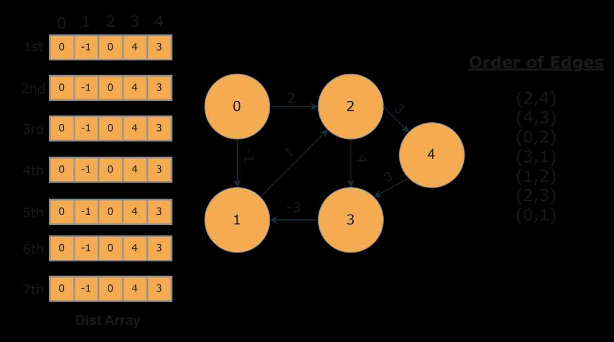
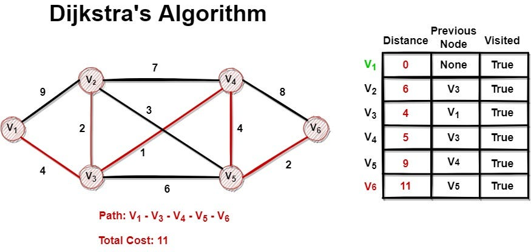
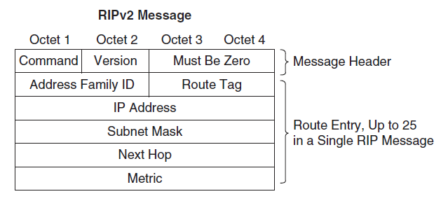
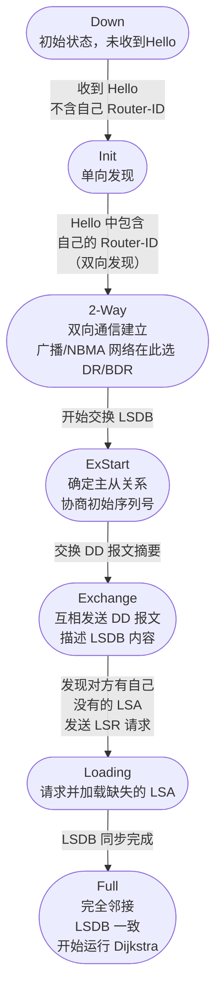
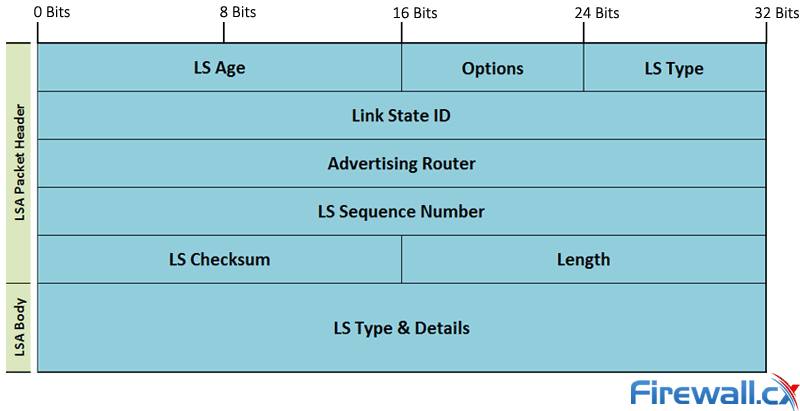

## 1.基础概念

路由是指网络层设备（路由器/三层交换机）根据路由表决定数据包从源到目的地的最优路径的过程。核心要素：
- 路由表：存储目的网络、下一跳、度量值（Metric）、出接口等信息
- 转发：根据路由表将数据包从入接口送到出接口（查表动作）
- 路由选择：计算最优路径的算法过程，根据路由表和数据包的源地址、目的地址、协议等信息，选择最合适的下一跳。
- 路由协议：用于在路由器之间交换路由信息，实现路由选择的动态更新。  

| 维度     | 路由算法                  | 路由协议           |
| ------ | --------------------- | -------------- |
| **本质** | 数学/逻辑方法               | 实现算法的通信规范      |
| **作用** | 计算最优路径                | 在路由器间交换路由信息    |
| **例子** | Dijkstra、Bellman-Ford | OSPF、BGP       |
| **关系** | 协议**封装**了算法           | 算法是协议的**核心引擎** |


## 2.路由算法

路由算法的种类有很多种，根据其更新方式，可以分为静态路由算法和动态路由算法：

- 静态路由算法
  - 原理：管理员手动配置路由条目
  - 优点：无协议开销、安全性高、CPU/带宽占用极低
  - 缺点：无法自动适应拓扑变化、大规模网络维护困难
  - 适用：小型网络、默认路由、特定流量工程
- 动态路由算法
  - 原理：路由器自动发现网络拓扑变化并更新路由表
  - 优点：自适应、可扩展、故障自动收敛
  - 缺点：消耗CPU/内存/带宽、可能存在环路、配置复杂

按算法机制分类可以分为：

**距离向量算法（Distance Vector）**
  - 核心思想：每个路由器只知道自己到邻居的距离，通过逐跳扩散的方式获得全网信息。
  - 代表算法：Bellman-Ford



工作过程：
- 每个路由器维护一张距离向量表（到所有已知目的地的距离和下一跳）
- 周期性地（如每30秒）向所有邻居发送自己的整张路由表
- 收到邻居的路由表后，用Bellman-Ford公式更新自己的表
- 若某条路由的下一跳发来的更新中该路由度量值变大，则同步更新（触发更新）

特性：
- 好消息传得快，坏消息传得慢（Count to Infinity问题）
- 最大跳数限制（如RIP限制15跳）
- 水平分割（Split Horizon）、毒性逆转（Poison Reverse）等防环机制

**链路状态算法（Link State）**
- 核心思想：每个路由器掌握全网拓扑地图，用Dijkstra算法独立计算最短路径。
- 代表算法：Dijkstra



工作过程：
- 发现邻居：通过Hello包发现直连邻居，测量链路代价
- 构造LSA：生成链路状态通告（Link State Advertisement），描述自身直连链路状态
- 泛洪LSA：通过可靠泛洪（Reliable Flooding）将LSA传遍全网，所有路由器收到后构建统一的LSDB（链路状态数据库/拓扑数据库）
- 运行Dijkstra：以自身为根，计算到所有节点的最短路径树（SPT）
- 生成路由表：根据SPT生成到各目的网络的最优路径

特性：
- 收敛速度快（触发更新+可靠泛洪）
- 无跳数限制
- CPU和内存消耗较大（需维护全网拓扑）
- 分层设计支持大规模网络（区域划分）    

**路径向量算法（Path Vector）**
- 核心思想：不仅传递距离，还传递完整的路径信息（经过的AS列表），用于解决距离向量在大型网络中的环路和策略问题。
- 核心机制：
  - 每个路由更新携带完整的路径属性（Path Attributes）
  - 通过路径信息检测环路（如BGP发现路径中包含自己的AS号则拒收）
  - 支持丰富的路由策略（基于路径属性做决策）

| 特性       | 距离向量 (DV)    | 链路状态 (LS)  | 路径向量 (PV)    |
| -------- | ------------ | ---------- | ------------ |
| **算法**   | Bellman-Ford | Dijkstra   | 路径属性比较       |
| **信息范围** | 邻居的整张表       | 全网拓扑       | 全网路径+属性      |
| **收敛速度** | 慢（可能计数到无穷）   | 快          | 中等           |
| **扩展性**  | 差（跳数受限）      | 好（需分层）     | 极好           |
| **环路风险** | 高            | 极低         | 低（AS-Path防环） |
| **资源消耗** | 低CPU/内存      | 高CPU/内存    | 高内存          |
| **典型协议** | RIP          | OSPF/IS-IS | BGP          |

## 3.路由协议

| 类型      | 全称                        | 作用范围   | 代表协议                 |
| ------- | ------------------------- | ------ | -------------------- |
| **IGP** | Interior Gateway Protocol | 自治系统内部 | RIP、OSPF、IS-IS、EIGRP |
| **EGP** | Exterior Gateway Protocol | 自治系统之间 | BGP（唯一主流协议）          |

### 3.1 RIP（Routing Information Protocol）

RIP 是最古老的距离向量协议之一，基于 UDP 520 端口运行，直接封装在 UDP 数据报中传输。

| 特性        | RIPv1              | RIPv2           | RIPng      |
| --------- | ------------------ | --------------- | ---------- |
| **IP版本**  | IPv4               | IPv4            | IPv6       |
| **有类/无类** | 有类（Classful）       | 无类（Classless）   | 无类         |
| **子网掩码**  | 不携带                | 携带（支持VLSM/CIDR） | 携带         |
| **认证**    | 不支持                | 支持明文/MD5        | IPsec      |
| **更新方式**  | 广播 255.255.255.255 | 组播 224.0.0.9    | 组播 FF02::9 |
| **下一跳字段** | 无                  | 有               | 有          |

> RIPv1 根据 IP 地址的 A/B/C 类默认掩码判断网络边界，无法处理子网划分和超网，这在现代网络中是不可接受的。
1.3 报文格式（RIPv2）



- Command：1=Request（请求完整路由表），2=Response（响应/主动更新）
- Route Tag：用于区分内部RIP路由和外部引入的路由
- 一个RIP报文最多携带25条路由条目（受UDP 512字节限制）

| 计时器           | 默认值  | 作用                                  |
| ------------- | ---- | ----------------------------------- |
| **Update**    | 30秒  | 周期性广播/组播整张路由表                       |
| **Invalid**   | 180秒 | 若180秒内未收到某条路由的更新，标记为Invalid（不可达但保留） |
| **Flush**     | 240秒 | 若240秒内仍未收到更新，从路由表中删除                |
| **Hold-down** | 180秒 | 收到坏消息后进入抑制期，期间不接收该路由的更好更新           |

**防环机制详解**:

- **水平分割（Split Horizon）**：从某个接口学到的路由，不再从此接口发出去,若A通过B学到路由X，A不会把X再发回给B
- **毒性逆转（Poison Rever**se）**：从某个接口学到的路由，从此接口发出去时设为 Metric=16（毒性）.
- **抑制计时器（Hold-down）**
    - 当路由器收到某条路由的 Metric 突然变差（如从2跳到16），启动180秒抑制期：
    - 期间忽略任何关于该路由的更新（防止错误信息传播）
    - 抑制期结束后才接受新信息
- **最大跳数限制**：Metric 上限为 16，超过即视为不可达。这从根本上限制了网络直径，也限制了RIP的扩展性。

上述防环机制只能缓解，无法根除。这是距离向量协议的固有缺陷。如计数到无穷问题：

```
拓扑：A — B — C — D（D上有目标网络X）
当D故障时：
  第0轮：D失效，C发现X不可达
  但B可能在C更新前发给C："我到X是2跳"
  C以为："B还能到X，那我经B到X是3跳"
  B收到C的更新："C到X是3跳，那我经C是4跳"
  ... 循环直到双方都达到16
```

### 3.2 OSPF（Open Shortest Path First）

OSPF 是 IP协议号89，直接封装在IP数据报中（不依赖TCP/UDP），使用 224.0.0.5（AllSPFRouters） 和 224.0.0.6（AllDRouters） 组播地址。



| 类型    | 名称                       | 作用                        |
| ----- | ------------------------ | ------------------------- |
| **1** | Hello                    | 发现/维护邻居关系（10秒/次，NBMA 30秒） |
| **2** | DD（Database Description） | 描述本地LSDB摘要信息（类似目录）        |
| **3** | LSR（Link State Request）  | 请求特定LSA                   |
| **4** | LSU（Link State Update）   | 发送完整LSA信息（携带一个或多个LSA）     |
| **5** | LSAck（Link State Ack）    | 确认收到LSA                   |

LSA （Link State Advertisement）是 OSPF 的核心数据单元，所有路由器泛洪 LSA 以构建统一的 LSDB。LSA的首部格式如下：



| 字段 | 大小 | 说明 |
|------|------|------|
| LS Age | 2字节 | LSA 存活时间（秒），MaxAge=3600s，用于老化删除 |
| Options | 1字节 | 可选功能位（如E=外部路由，MC=组播等） |
| LS Type | 1字节 | LSA 类型：1=Router, 2=Network, 3=Summary, 5=External 等 |
| Link State ID | 4字节 | 标识符，含义随类型变化（如Router LSA用Router ID） |
| Advertising Router | 4字节 | 产生此 LSA 的路由器 Router ID |
| LS Sequence Number | 4字节 | 序列号，用于判断 LSA 新旧（越大越新） |
| LS Checksum | 2字节 | Fletcher 校验和，覆盖除 LS Age 外的整个 LSA |
| Length | 2字节 | 整个 LSA 的长度（含头部），字节为单位 |

通常来说，有以下几种 LSA 类型：

| 类型         | 名称                 | 描述                           | 泛洪范围                     |
| ---------- | ------------------ | ---------------------------- | ------------------------ |
| **Type 1** | Router LSA         | 每台路由器产生，描述直连链路状态（接口、邻居、Cost） | 区域内                      |
| **Type 2** | Network LSA        | DR产生，描述广播/NBMA网络的所有路由器列表     | 区域内                      |
| **Type 3** | Summary LSA (IP)   | ABR产生，描述区域间路由                | 区域间（除本区域）                |
| **Type 4** | Summary LSA (ASBR) | ABR产生，描述ASBR的位置              | 区域间                      |
| **Type 5** | External LSA       | ASBR产生，描述外部AS路由（如从RIP/BGP引入） | 全网（除Stub区域）              |
| **Type 7** | NSSA External LSA  | NSSA区域的ASBR产生，描述外部路由         | NSSA区域内，经ABR转为Type 5进入骨干 |

### 3.3 IS-IS（Intermediate System to Intermediate System）

IS-IS 最初为 OSI 的 CLNP（Connectionless Network Protocol）设计，后通过 RFC 1195 扩展支持 IP（称为 Integrated IS-IS）。它直接运行在 数据链路层（Ethertype 0x83CC），不依赖 IP。

### 3.4 EIGRP（Enhanced Interior Gateway Routing Protocol）

EIGRP 是 Cisco 开发的高级距离向量协议（有时称为混合协议），使用 IP协议号88。2013年 Cisco 发布信息性 RFC 7868，部分开放。

### 3.5 BGP（Border Gateway Protocol）

BGP 是 Internet 的事实标准 EGP，当前版本 BGP-4（RFC 4271）。基于 TCP 179 端口，利用 TCP 的可靠性。

| 类型               | 名称   | 作用                                |
| ---------------- | ---- | --------------------------------- |
| **Open**         | 建立连接 | 协商参数（AS号、Hold Time、BGP ID、可选能力）   |
| **Update**       | 路由更新 | 通告/撤销路由（携带路径属性）                   |
| **Notification** | 错误通知 | 检测到错误后发送，随后关闭TCP连接                |
| **Keepalive**    | 保活   | 维持邻居关系（周期为 Hold Time 的 1/3，默认60秒） |

> Route-Refresh：BGP 扩展能力，用于请求邻居重新发送特定地址族的路由。

路径属性是 BGP 的精髓，分为四类：

Well-known Mandatory（公认必遵）,所有 BGP 实现必须识别且在 Update 中必须携带：

| 属性            | 说明                               |
| ------------- | -------------------------------- |
| **Origin**    | 路由来源：IGP(i)、EGP(e)、Incomplete(?) |
| **AS\_Path**  | 经过的AS序列，防环核心（看到包含自己AS号则拒收）       |
| **Next\_Hop** | 到达目的网络的下一跳地址                     |

Well-known Discretionary（公认自决）,所有 BGP 实现必须识别，但可不携带：

| 属性                    | 说明                            |
| --------------------- | ----------------------------- |
| **Local\_Pref**       | 本地优先级，仅在IBGP内传播，越大越优先（控制出站流量） |
| **Atomic\_Aggregate** | 表示路由已被聚合，可能丢失路径信息             |

Optional Transitive（可选过渡），BGP 实现可不支持，但必须传递给其他邻居：

| 属性             | 说明                               |
| -------------- | -------------------------------- |
| **Aggregator** | 执行聚合的路由器ID和AS号                   |
| **Community**  | 路由标记（如 No\_Export、No\_Advertise） |

Optional Non-transitive（可选非过渡），BGP 实现可不支持，且不传递给其他邻居：

| 属性                 | 说明                                         |
| ------------------ | ------------------------------------------ |
| **MED**            | Multi-Exit Discriminator，建议邻居的入站流量入口，越小越优先 |
| **Originator\_ID** | 路由反射器场景，防止环路                               |
| **Cluster\_List**  | 路由反射器集群列表，防环                               |


BGP 高级特性:路由聚合（Aggregation）和BGP 多宿主（Multihoming）

