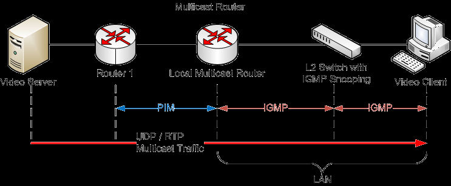

## 1.IP数据报的三种传输方式

| 方式                | 定义                                                           | 特点                                                       |
| ----------------- | ------------------------------------------------------------ | -------------------------------------------------------- |
| **单播（Unicast）**   | 发送数据包到**单个目的地**，每份报文使用一个单播IP地址作为目的地址                         | 点对点传输。发送者和每个接收者之间需要**单独的数据信道**。90个主机接收视频需要发送90份数据。       |
| **广播（Broadcast）** | 发送数据包到同一广播域或子网内的**所有设备**                                     | 点对多点传输。会打扰到不需要该数据的主机，且路由器通常不转发广播。                        |
| **组播（Multicast）** | 发送者仅发送**一次数据**，借助组播路由协议建立组播分发树，数据到达距离用户端尽可能近的节点后才开始**复制和分发** | 点对多点传输。提高了数据传送效率，减少主干网拥塞。组播组成员可在同一物理网络或不同物理网络（需组播路由器支持）。 |

IP组播地址:
- 地址范围：224.0.0.0 ~ 239.255.255.255（D类地址）。
- 特点：
  - 一个D类地址表示一个组播组。
  - 只能用作分组的目标地址，源地址总是单播地址。
  - 组播数据报也是"尽最大努力交付"，应用于UDP（不保证可靠）。
  - 对组播数据报不产生ICMP差错报文。
  - 并非所有D类地址都可作为组播地址（如224.0.0.0~224.0.0.255为预留的局部链路组播地址）。    

硬件组播（以太网组播）
- 组播IP地址需要映射为组播MAC地址才能在本地网络实际传送帧。
- 映射规则：
  - 以太网组播MAC地址以十六进制 01-00-5E 打头。
  - 后6个十六进制位（24位中的低23位）来自IP组播组地址的最后23位。
  - 最高位位固定为0（因为MAC地址第25位固定为0），因此IP组播地址的前4位（1110）和第5位（固定0）不参与映射。
- 地址范围：从 01-00-5E-00-00-00 到 01-00-5E-7F-FF-FF。
- 过滤机制：收到多播数据报的主机，还要在IP层利用软件进行过滤，把不是本主机要接收的数据报丢弃（因为32个IP组播地址可能映射到同一个MAC地址，存在地址重叠）。

## 2.IGMP协议（Internet Group Management Protocol，网际组管理协议）

- 协议层次：与ICMP一样，直接封装在IP数据报中传输（IP协议号2）。
- 作用：让路由器知道本局域网上是否有主机（的进程）参加或退出了某个组播组。
- 注意事项：IGMP只管理本地局域网内的组成员关系，并不负责跨网络的组播路由。

IGMP工作的两个阶段：
- ROUND 1（加入组播组）：
  - 某主机要加入组播组时，向该组播组的组播地址发送一个IGMP报文，声明自己要成为该组成员。
  - 本地组播路由器收到后，利用组播路由选择协议把这组成员关系发给因特网上的其他组播路由器。
- ROUND 2（维护组成员关系）：
  - 本地组播路由器周期性探询本地局域网上的主机（通常125秒一次），询问是否仍是组成员。
  - 只要有一个主机对某个组响应，组播路由器就认为该组是活跃的。
  - 若经过几次探询后没有一个主机响应，组播路由器就认为本网络上没有此组播组的主机，不再把该组成员关系发给其他组播路由器。    

## 3.组播路由选择协议

目的：找出以源主机为根节点的组播转发树，避免在路由器之间兜圈子。

特点：
- 不同的多播组对应不同的多播转发树。
- 同一个多播组，对不同源点也有不同的多播转发树。
- 常使用的三种算法：
  - 基于链路状态的路由选择（如MOSPF）
  - 基于距离向量的路由选择（如DVMRP）
  - 协议无关的组播（PIM）：分为稀疏模式（PIM-SM）和密集模式（PIM-DM）。

