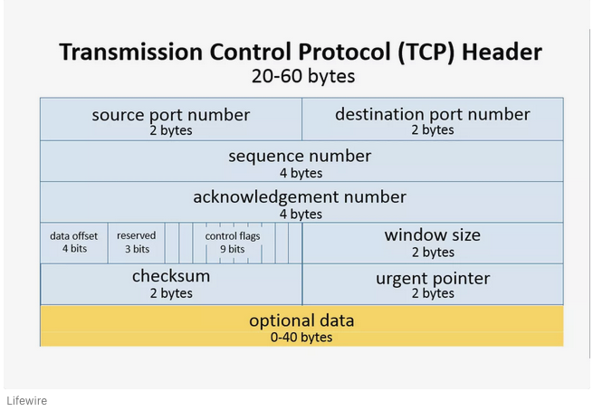
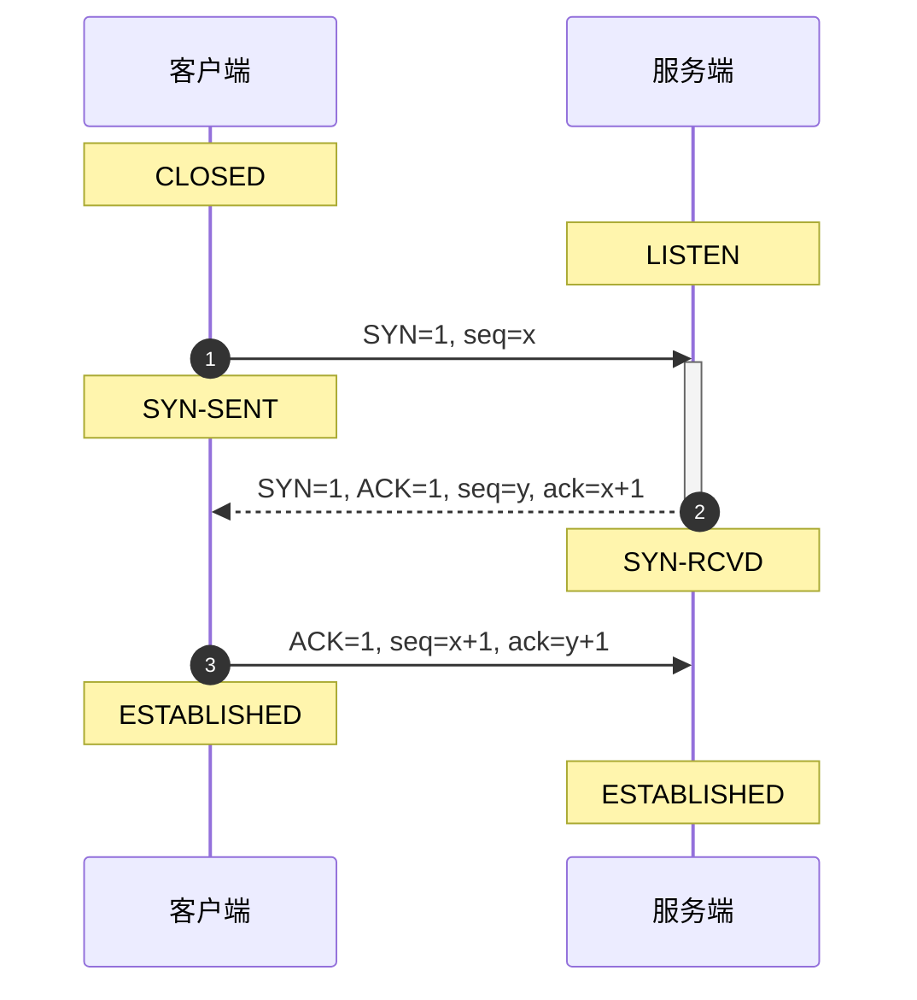
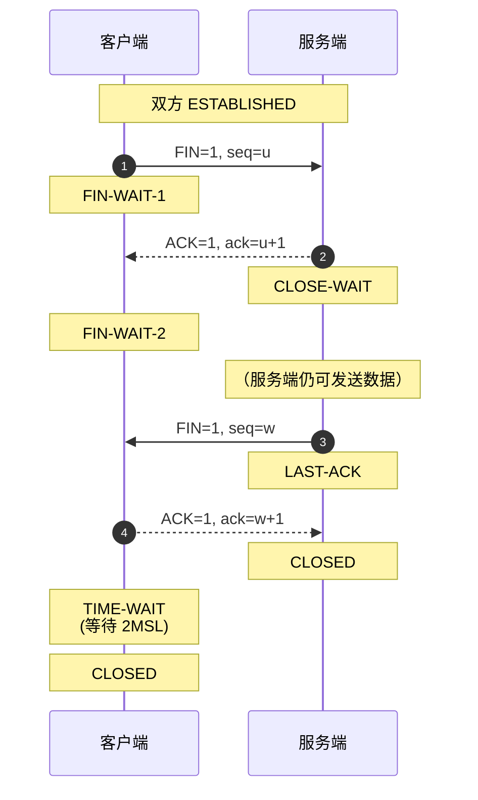
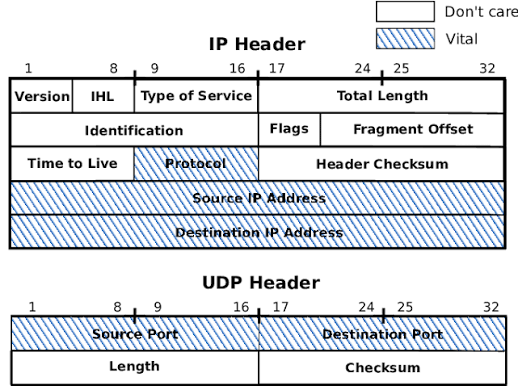
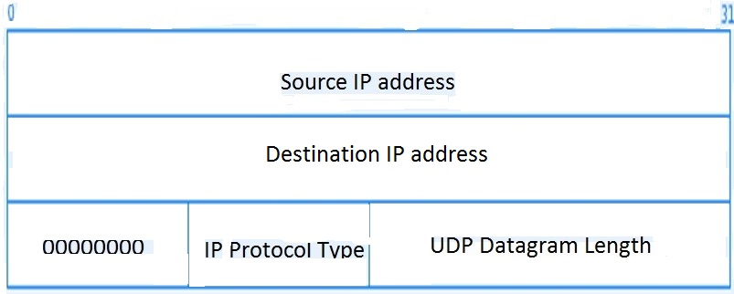

## 1.传输层概述

### 1.1 传输层的地位
传输层是 只有主机（端系统）才有的层次，网络中的路由器、交换机等中间设备一般只工作到网络层。
- 为应用层提供通信服务，同时使用网络层提供的主机到主机通信服务。
- 网络层提供的是主机之间的逻辑通信；传输层则进一步提供进程与进程之间的逻辑通信。


### 1.2 传输层的核心功能
- 进程间逻辑通信：端到端的通信，区分不同应用进程。
- 复用（Multiplexing）与分用（Demultiplexing）：
    - 复用：发送方多个应用进程共用同一个传输层协议发送数据；
    - 分用：接收方传输层根据端口号将数据正确交付给对应的应用进程。
- 差错检测：对收到的报文进行完整性校验（如 UDP/TCP 的检验和）。
- 提供两种协议：TCP（传输控制协议）和 UDP（用户数据报协议）。

## 2.传输层的寻址与端口

### 2.1 端口（Port）的概念

端口是传输层的 SAP（Service Access Point，服务访问点），用于标识主机中的应用进程。
- 端口号只有本地意义：不同计算机上的相同端口号没有直接联系。
- 端口号长度为 16 bit，可表示 0 ~ 65535 共 65536 个不同的端口号。

| 类型                          | 范围            | 说明                                      |
| --------------------------- | ------------- | --------------------------------------- |
| **熟知端口号（Well-known Ports）** | 0 ~ 1023      | 分配给 TCP/IP 体系中最重要的一些应用程序，所有用户都知道        |
| **登记端口号（Registered Ports）** | 1024 ~ 49151  | 为没有熟知端口号的应用程序使用，需向 IANA 登记              |
| **客户端使用的端口号（动态/私有端口）**      | 49152 ~ 65535 | 仅在客户进程运行时才动态选择，又称短暂端口号（Ephemeral Ports） |


| 应用程序   | 熟知端口号 | 
| ------ | ----- | 
| FTP    | 21    | 
| TELNET | 23    | 
| SMTP   | 25    | 
| DNS    | 53    | 
| TFTP   | 69    | 
| HTTP   | 80    | 
| SNMP   | 161   | 

### 2.2 套接字（Socket）

在网络中采用发送方和接收方的套接字组合来识别端点。套接字 Socket = (主机 IP 地址，端口号)。套接字唯一标识了网络中的一个主机和它上面的一个进程。


## 3.TCP和UDP

| 对比维度      | TCP（Transmission Control Protocol） | UDP（User Datagram Protocol） |
| --------- | ---------------------------------- | --------------------------- |
| **连接性**   | 面向连接，数据传输前需建立连接，结束后释放连接            | 无连接，不需要预先建立连接               |
| **可靠性**   | 可靠交付，保证无差错、不丢失、不重复、按序到达            | 尽最大努力交付，不保证可靠               |
| **传输方式**  | 面向**字节流**                          | 面向**报文**                    |
| **时延**    | 时延较大（建立连接、确认、重传等开销）                | 时延小                         |
| **适用场景**  | 大文件传输、可靠通信（如 HTTP、FTP、SMTP）        | 小文件、实时应用（如 DNS、视频流、VoIP）    |
| **广播/多播** | 不支持                                | 支持                          |
| **首部开销**  | 20 B                               | 8 B                         |

### 3.1 TCP的可靠传输机制

TCP 协议的特点：
- 面向连接（虚连接）：通信前需建立连接（三次握手），通信后释放连接（四次挥手）。
- 点对点：每一条 TCP 连接只能有两个端点，只能是一对一的。
- 可靠交付：无差错、不丢失、不重复、按序到达。
- 记忆：可靠有序，不丢不重。
- 全双工通信：通信双方可同时发送和接收数据。
- 发送缓存：存放准备发送的数据 & 已发送但尚未收到确认的数据；
- 接收缓存：存放按序到达但尚未被应用程序读取的数据 & 不按序到达的数据（等待补齐后按序交付）。
- 面向字节流：TCP 把应用程序交下来的数据看成无结构的字节流，不保留报文边界。

> TCP 与 UDP 的根本区别之一：UDP 面向报文（保留应用层报文边界），而 TCP 面向字节流（不保留边界）。TCP 会根据发送缓存和接收窗口的大小，将字节流划分成合适长度的报文段发送，也可以等待积累足够多的字节后再发送。接收方 TCP 将收到的字节按序放入接收缓存，应用进程按需读取，不要求一次读取一个完整的"报文"。

TCP 报文段由 首部 + 数据 两部分组成。首部最短 20 字节（固定首部），最长 60 字节（含选项）。



| 字段           | 长度     | 说明                                         |
| :----------- | :----- | :----------------------------------------- |
| **源端口**      | 16 bit | 发送方端口号                                     |
| **目的端口**     | 16 bit | 接收方端口号                                     |
| **序号（Seq）**  | 32 bit | 本报文段所发送数据的第一个字节的序号                         |
| **确认号（Ack）** | 32 bit | **期望**收到对方下一个报文段的第一个字节的序号；若 `ACK=1`，确认号才有效 |
| **数据偏移**     | 4 bit  | TCP 首部长度，单位是 **4 字节**（即最大值 15 × 4 = 60 B）  |
| **保留**       | 6 bit  | 目前置为 0                                     |
| **控制位**      | 6 bit  | 见下表                                        |
| **窗口**       | 16 bit | 接收方允许对方发送的数据量，单位字节；用于流量控制                  |
| **检验和**      | 16 bit | 检验首部 + 数据；算法同 UDP（伪首部 + 反码求和），协议字段为 **6**  |
| **紧急指针**     | 16 bit | `URG=1` 时有效，指出紧急数据的末尾位置                    |

| 标志      | 名称 | 作用                                         |
| :------ | :- | :----------------------------------------- |
| **URG** | 紧急 | `URG=1` 时，紧急指针有效，数据优先处理                    |
| **ACK** | 确认 | `ACK=1` 时，确认号有效；**建立连接后所有报文段都必须把 ACK 置 1** |
| **PSH** | 推送 | `PSH=1` 时，接收方应尽快将数据交付应用层                   |
| **RST** | 复位 | `RST=1` 时，表明连接出现严重差错，必须释放并重新建立             |
| **SYN** | 同步 | `SYN=1` 时，表示这是一个连接请求或连接接受报文（三次握手用）         |
| **FIN** | 终止 | `FIN=1` 时，表明发送方数据已发完，要求释放连接（四次挥手用）         |

> SYN 和 FIN 虽然都不携带数据，但都要消耗一个序号。

选项字段（长度可变，最大 40 B）
- 最大报文段长度 MSS（Maximum Segment Size）：TCP 报文段中数据字段的最大长度，默认通常 536 B。
- 窗口扩大选项：用于扩大窗口值（因为首部窗口字段只有 16 bit，在高速网络中不够用）。
- 时间戳选项：用于计算 RTT、防止序号绕回（PAWS）。
- 选择确认（SACK）：允许接收方告诉发送方自己收到了哪些不连续的字节块。

#### 3.1.1 TCP连接管理

TCP 连接的建立和释放都需要经过一系列的报文交换，称为三次握手和四次挥手。

TCP三次握手（Three-way Handshake）过程如下：

| 步骤        | 方向    | 报文      | 关键字段                           | 状态变化             |
| :-------- | :---- | :------ | :----------------------------- | :--------------- |
| **第 1 次** | C → S | SYN     | `SYN=1, seq=x`（客户端初始序号）        | 客户端 `SYN-SENT`   |
| **第 2 次** | S → C | SYN+ACK | `SYN=1, ACK=1, seq=y, ack=x+1` | 服务端 `SYN-RCVD`   |
| **第 3 次** | C → S | ACK     | `ACK=1, seq=x+1, ack=y+1`      | 双方 `ESTABLISHED` |


为什么是三次握手？不是两次？

- 原因一：防止历史连接被错误建立
    - 若客户端先发送了 SYN1（因网络延迟滞留），超时后又重发 SYN2 并成功建立连接、传输数据、释放连接。此时滞留的 SYN1 才到达服务端：
    - 如果是两次握手：服务端收到 SYN1 后直接建立连接，但客户端早已释放，服务端会白白维持一个无效连接，浪费资源。
    - 三次握手：服务端回复 SYN+ACK 后，必须等待客户端的 ACK 确认。客户端发现这是旧连接（确认号对不上），会发送 RST 终止，服务端就不会建立错误连接。
- 原因二：同步双方初始序列号
    - TCP 靠序号保证可靠传输。双方都必须把自己的初始序号（ISN）通知对方，并且得到对方的确认。第一次握手：客户端同步自己的 ISN。第二次握手：服务端确认客户端 ISN，并同步自己的 ISN。第三次握手：客户端确认服务端 ISN。两次握手只能保证一方的 ISN 被确认，无法保证双方。
- 原因三：避免资源浪费
    - 两次握手时，若客户端 SYN 在网络中阻塞并重发多次，服务端每收到一个 SYN 就建立一个连接，会造成大量冗余无效连接。

结论：三次握手是理论上建立可靠连接的最少次数，既阻止历史连接，又同步双方序列号。

关于第三次握手携带数据：
- 前两次握手不能携带数据（因为连接尚未建立）。
- 第三次握手可以携带数据。此时客户端已认为连接建立，可以发应用数据。服务端收到后，即使自己还在 SYN-RCVD 状态，也能根据报文中的 ACK 确认建立连接并处理数据。

TCP 是全双工的，每个方向都要单独关闭，因此需要四次挥手。四次挥手（Four-way Handshake）过程如下：

| 步骤        | 方向    | 报文  | 关键字段             | 状态变化                              |
| :-------- | :---- | :-- | :--------------- | :-------------------------------- |
| **第 1 次** | C → S | FIN | `FIN=1, seq=u`   | 客户端 `FIN-WAIT-1`                  |
| **第 2 次** | S → C | ACK | `ACK=1, ack=u+1` | 服务端 `CLOSE-WAIT`；客户端 `FIN-WAIT-2` |
| **第 3 次** | S → C | FIN | `FIN=1, seq=w`   | 服务端 `LAST-ACK`                    |
| **第 4 次** | C → S | ACK | `ACK=1, ack=w+1` | 客户端 `TIME-WAIT`；服务端收到后 `CLOSED`   |


- 第 1、2 次：关闭客户端 → 服务端的发送方向（但服务端仍可发给客户端）。
- 第 3、4 次：关闭服务端 → 客户端的发送方向。

> 第 2 次挥手的 ACK 和第 3 次挥手的 FIN 通常不能合并，因为服务端收到 FIN 后，可能还有数据没发完，必须等应用进程处理完才能发 FIN。只有在服务端恰好也无数据时，才可能合并为 FIN+ACK，看起来像"三次挥手"。

TIME-WAIT 状态与 2MSL:
- 主动关闭方（谁先发 FIN，谁就是主动关闭方）在发送最后一个 ACK 后进入 TIME-WAIT 状态，等待 2MSL（Maximum Segment Lifetime，最长报文段寿命）后才进入 CLOSED。
- 为什么需要 2MSL？
    - 保证最后一个 ACK 能被对方收到：若 ACK 丢失，对方会重传 FIN，主动关闭方在 2MSL 内仍能收到并重发 ACK。
    - 让本次连接的所有报文从网络中消失：防止旧连接的延迟报文出现在下一个新连接中，导致数据混乱。
> MSL 通常取 2 分钟，所以 2MSL = 4 分钟。Linux 中 TIME_WAIT 持续时间通常为 60 秒。



#### 3.1.2 SYN 洪泛攻击（SYN Flood）

攻击原理：
- 攻击者向服务端大量发送 SYN 报文，但收到服务端的 SYN+ACK 后故意不回复 ACK（或伪造不可达的源 IP）。
- 服务端会为每个半连接分配资源（TCB 控制块、缓冲区），放在半连接队列（SYN Queue）中等待。当队列被占满后，正常的连接请求就无法被处理，导致拒绝服务（DoS）。

解决方案：SYN Cookie
- 服务端收到 SYN 后，不立即分配资源，而是根据源 IP、目的 IP、端口、时间戳等信息计算一个特殊的 Cookie 值，作为初始序号放入 SYN+ACK 中发送。
- 若客户端是合法的，会回复 ACK（ack = Cookie + 1），服务端验证 Cookie 合法后才分配资源建立连接。
- 若客户端不回复，服务端不会占用任何资源。


#### 3.1.3 TCP可靠传输

TCP 通过以下机制实现可靠传输：序号、确认、重传。

序号与确认机制:
- 序号（Sequence Number）：TCP 把数据看成无结构字节流，每个字节都按顺序编号。报文段首部的序号字段填写本报文段数据的第一个字节的序号。
- 确认号（Acknowledgment Number）：采用累积确认，确认号表示"期望收到对方下一个报文段的第一个字节的序号"，即确认号之前的数据已全部正确收到。

超时重传:
TCP 每发送一个报文段，就启动一个重传计时器（RTO, Retransmission Time-Out）。
- 若在计时器到期前收到确认，则撤销计时器。
- 若计时器到期仍未收到确认，则重传该报文段。
RTO 的计算：基于往返时间 RTT 动态调整（Jacobson 算法），通常 RTO = RTT_S + 4 × RTT_D。

快速重传（Fast Retransmit）:
超时重传的缺点是等待时间过长。TCP 规定：
- 当收到连续三个重复的 ACK（即对同一个序号的 3 次重复确认），就立即重传对方尚未收到的报文段，无需等待 RTO 到期。

```
发送方：seq=1  seq=2  seq=3  seq=4  seq=5
接收方： 收到 1，回 ACK=2
        收到 2，回 ACK=3
        seq=3 丢失了！
        收到 4，回 ACK=3（重复确认 1）
        收到 5，回 ACK=3（重复确认 2）
        收到 6，回 ACK=3（重复确认 3）← 触发快速重传！
发送方：立即重传 seq=3
```

选择确认（SACK, Selective ACK）:
- 累积确认的问题是：若只丢了中间一个报文段，发送方重传后仍需重传后续所有数据。
SACK 允许接收方在确认号之后，用选项字段报告自己收到的不连续字节块边界，发送方只重传真正丢失的报文段。
- 例如：接收方收到 1~1000 和 2001~3000，但丢了 1001~2000。
    - 普通 ACK：ACK=1001（只能告诉发送方"1001 之后我没收到"）
    - SACK：ACK=1001，同时选项中报告 [2001, 3000] 已收到，发送方只重传 1001~2000。

### 3.2 UDP的无连接传输机制

UDP 在 IP 数据报服务之上仅增加了复用/分用和差错检测功能:
- 无连接：减少开销和发送数据之前的时延。
- 尽最大努力交付：不保证可靠交付，也不使用拥塞控制。
- 面向报文：应用层给 UDP 多长的报文，UDP 就照样发送，一次发送一个完整报文。因此 UDP 适合一次性传输少量数据的网络应用。
- 无拥塞控制：适合很多实时应用（如视频会议、IP 电话），即使网络拥塞也不降低发送速率。
- 首部开销小：仅 8 B（对比 TCP 的 20 B）。
> 面向报文的含义：UDP 对应用层交下来的报文既不合并也不拆分，直接加上首部后交给网络层。若报文过长，IP 层可能需要分片；若过短，则 IP 首部相对开销变大。



| 字段          | 长度           | 说明                          |
| ----------- | ------------ | --------------------------- |
| **源端口号**    | 16 bit (2 B) | 发送方的端口号，可选，不用时可填 0          |
| **目的端口号**   | 16 bit (2 B) | 接收方的端口号                     |
| **UDP 长度**  | 16 bit (2 B) | UDP 用户数据报的**整个长度**（首部 + 数据） |
| **UDP 检验和** | 16 bit (2 B) | 检测整个 UDP 数据报是否有错，有错就丢弃      |

> 分用异常处理：若分用时找不到对应的目的端口号，就丢弃该报文，并向发送方发送 ICMP "端口不可达" 差错报告报文。

#### 3.2.1 UDP 检验和（Checksum）流程


计算检验和时，需要在 UDP 用户数据报之前临时增加一个 12 B 的伪首部，它既不向下传送也不向上递交，仅用于校验计算。其意义在于：

UDP 首部只有 8 字节，里面没有 IP 地址信息。但网络层 IP 协议在转发时可能把 IP 地址搞错（比如路由异常、IP 首部损坏）。如果 UDP 只校验自己的数据，就无法发现「数据送到了错误的主机」这种事故。伪首部的作用：让 UDP 顺便校验一下 IP 源地址、目的地址、协议类型、UDP 长度，确保：
- 数据没发错主机
- 协议类型确实是 UDP（而不是被当成 TCP 处理了）
- 长度没被篡改




| 字段       | 长度  |
| -------- | --- |
| 源 IP 地址  | 4 B |
| 目的 IP 地址 | 4 B |
| 全 0      | 1 B |
| 协议字段（17） | 1 B |
| UDP 长度   | 2 B |

以下面条件发生"TESTING"为例：

| 项目       | 值             | 16 bit 表示                              |
| -------- | ------------- | -------------------------------------- |
| 源 IP     | 153.19.8.104  | `0x9913`, `0x0868`                     |
| 目的 IP    | 171.3.14.11   | `0xAB03`, `0x0E0B`                     |
| 协议 + 全 0 | 0, 17         | `0x0011`                               |
| UDP 长度   | 15（8B首部+7B数据） | `0x000F`                               |
| 源端口      | 1087          | `0x042F`                               |
| 目的端口     | 13            | `0x000D`                               |
| 数据       | "TESTING"     | `0x5445`, `0x5354`, `0x494E`, `0x4700` |

其中求16 bit表示的过程为：

```
字符 → ASCII 十进制 → 十六进制 → 二进制
-------------------------------------------------------
  T   →    84      →   0x54    →  01010100
  E   →    69      →   0x45    →  01000101
  S   →    83      →   0x53    →  01010011
  T   →    84      →   0x54    →  01010100
  I   →    73      →   0x49    →  01001001
  N   →    78      →   0x4E    →  01001110
  G   →    71      →   0x47    →  01000111

--------------------------------------------------------
①  伪首部 - 源IP前16bit:     1001 1001 0001 0011  →  0x9913
②  伪首部 - 源IP后16bit:     0000 1000 0110 1000  →  0x0868
③  伪首部 - 目的IP前16bit:   1010 1011 0000 0011  →  0xAB03
④  伪首部 - 目的IP后16bit:   0000 1110 0000 1011  →  0x0E0B
⑤  伪首部 - 全0+协议17:      0000 0000 0001 0001  →  0x0011
⑥  伪首部 - UDP长度:         0000 0000 0000 1111  →  0x000F

⑦  UDP首部 - 源端口:          0000 0100 0010 1111  →  0x042F
⑧  UDP首部 - 目的端口:        0000 0000 0000 1101  →  0x000D
⑨  UDP首部 - UDP长度:         0000 0000 0000 1111  →  0x000F
⑩  UDP首部 - 检验和(先填0):   0000 0000 0000 0000  →  0x0000

⑪  数据 - "TE":              0101 0100 0100 0101  →  0x5445
⑫  数据 - "ST":              0101 0011 0101 0100  →  0x5354
⑬  数据 - "IN":              0100 1001 0100 1110  →  0x494E
⑭  数据 - "G"+填充:          0100 0111 0000 0000  →  0x4700
```

现在我们需要把全部数据（伪首部 + UDP首部 + 数据）按 16 bit 分组，求和后取反得到检验和。但实际上不需要这么麻烦，直接把伪首部、UDP首部和数据的 16 bit 表示相加即可（但每一小步溢出的进位加到最低位上），最后取反得到检验和。

```
步骤1: 0x9913 + 0x0868 = 0xA17B
步骤2: 0xA17B + 0xAB03 = 0x14C7E  → 溢出！回卷: 0x4C7E + 1 = 0x4C7F
步骤3: 0x4C7F + 0x0E0B = 0x5A8A
步骤4: 0x5A8A + 0x0011 = 0x5A9B
步骤5: 0x5A9B + 0x000F = 0x5AAA
步骤6: 0x5AAA + 0x042F = 0x5ED9
步骤7: 0x5ED9 + 0x000D = 0x5EE6
步骤8: 0x5EE6 + 0x000F = 0x5EF5
步骤9: 0x5EF5 + 0x0000 = 0x5EF5
步骤10: 0x5EF5 + 0x5445 = 0xB33A
步骤11: 0xB33A + 0x5354 = 0x1068E → 溢出！回卷: 0x068E + 1 = 0x068F
步骤12: 0x068F + 0x494E = 0x4FDD
步骤13: 0x4FDD + 0x4700 = 0x96DD  ← 最终和
-----------------------------------------
和:     1001 0110 1101 1101  →  0x96DD
取反:   0110 1001 0010 0010  →  0x6922  ← 这就是检验和！
```

接收端计算前面的 13 步和发送端一样，最终得到 0x96DD。现在加上检验和字段 0x6922：0x96DD + 0x6922 = 0xFFFF

判断规则:
- 如果结果 全为 1（即 0xFFFF） → 无差错
- 如果结果 不是全 1 → 有差错，丢弃数据报，或交给应用层并附上警告
> 为什么是全 1？因为发送端最后一步是「取反」，接收端把「原和」与「取反后的检验和」相加，必然是全 1。这是反码的性质。

