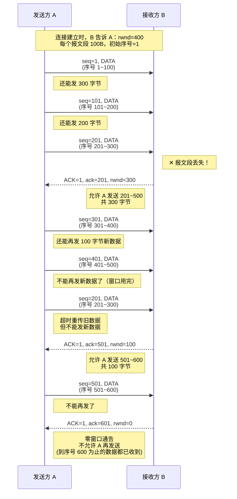
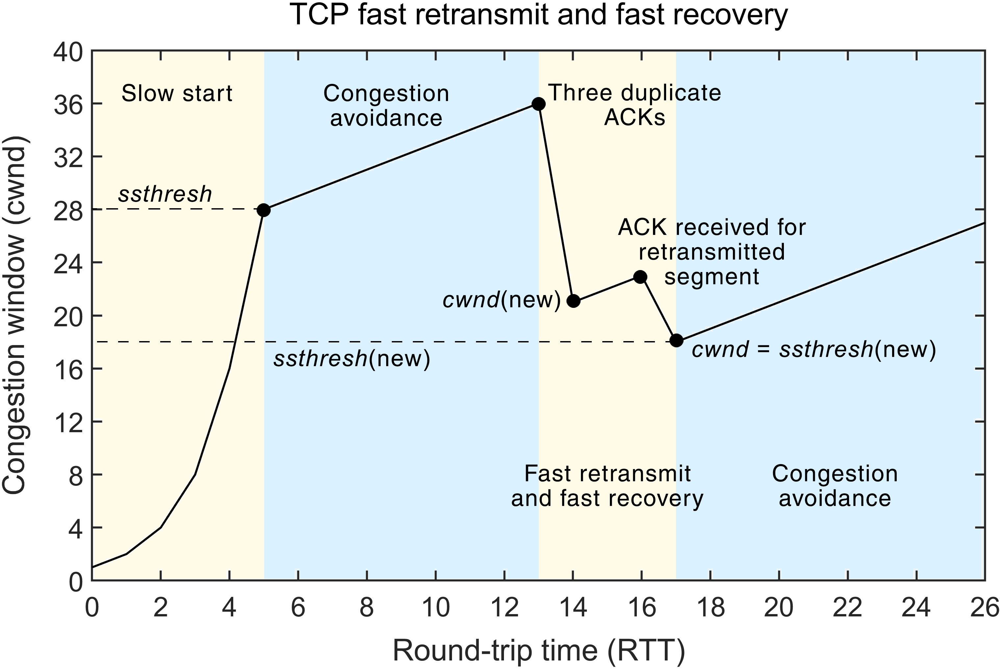
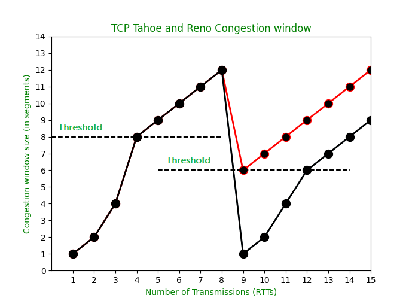
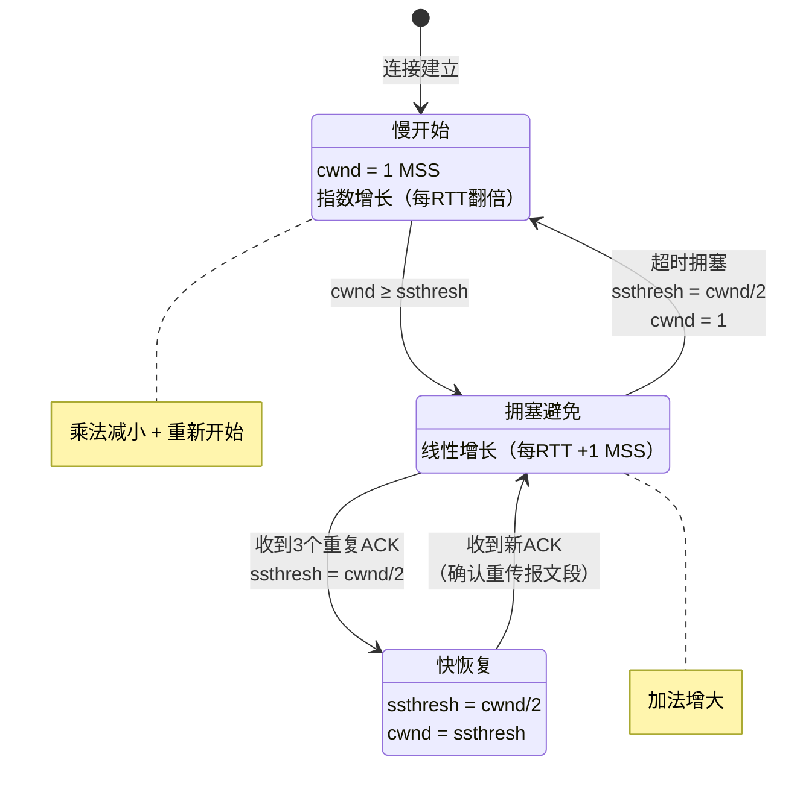

## 1.TCP 流量控制（Flow Control）

流量控制的核心目的：让发送方"慢点"发送，使接收方来得及接收和处理数据，防止因发送速率过快导致接收方缓存溢出而丢包。TCP 利用滑动窗口机制实现流量控制:

- 接收窗口（rwnd, receive window）：接收方根据自己接收缓存的剩余大小动态设置的窗口值，通过 TCP 首部中的"窗口"字段告知发送方。
- 发送窗口：发送方的实际发送窗口大小受两个因素制约，取两者中的最小值：
  - 接收方通告的接收窗口 rwnd
  - 发送方自己维护的拥塞窗口 cwnd（拥塞控制部分）
  - 发送窗口 = Min{rwnd, cwnd}
- 发送窗口大小可以动态变化，随着接收方缓存占用情况实时调整。

当接收方通告 rwnd = 0 后，发送方停止发送数据。但如果接收方之后有空闲缓存并发送了新的窗口通告，而这个报文恰好丢失，则双方会陷入死等状态。解决方案：持续计时器（Persistence Timer）:
- TCP 为每个连接设置一个持续计时器。
- 只要收到对方的零窗口通知，就启动该计时器。
- 若计时器到期，发送方主动发送一个零窗口探测报文段（1 字节数据）。
- 接收方收到探测报文段后，必须在确认中给出当前的窗口值。
    - 若窗口值仍为 0：发送方重新设置持续计时器，等待下一次探测。
    - 若窗口值大于 0：发送方恢复发送。
零窗口探测报文段也能触发接收方的 ACK，起到"保活"作用。

## 2.TCP拥塞控制（Congestion Control）

- 拥塞（Congestion）：当网络中对资源（链路带宽、路由器缓存、处理能力等）的需求总和超过可用资源时，网络性能急剧恶化，吞吐量随输入负荷增大而下降的现象。

- 拥塞控制：防止过多的数据注入到网络中，避免路由器或链路过载。这是一个全局性的过程，涉及网络中所有主机、路由器等。

| 对比维度     | 流量控制                              | 拥塞控制                 |
| :------- | :-------------------------------- | :------------------- |
| **控制对象** | 端到端（发送方 vs 接收方）                   | 全局性（所有主机、路由器、链路）     |
| **控制目的** | 防止发送过快，接收方缓存溢出                    | 防止注入数据过多，网络资源过载      |
| **反馈信息** | 接收方通过 `rwnd` 反馈                   | 发送方根据网络状况（丢包、时延）自行判断 |
| **关系**   | 两者共同决定发送窗口：发送窗口 = Min{rwnd, cwnd} |                      |

TCP 拥塞控制主要包含四种经典算法：
- 慢开始（Slow Start）
- 拥塞避免（Congestion Avoidance）
- 快重传（Fast Retransmit）
- 快恢复（Fast Recovery）

基本假设（便于分析）：
- 数据单方向传送，另一方向只传送确认。
- 接收方总有足够大的缓存空间，因此发送窗口大小仅取决于拥塞程度，即 发送窗口 = cwnd。两个关键窗口/变量：
    - 接收窗口（rwnd）：接收方根据接收缓存设置，反映接收方容量。
    - 拥塞窗口（cwnd）：发送方根据网络拥塞程度估算的窗口值，反映网络当前容量。

### 2.1 慢开始（Slow Start）与拥塞避免（Congestion Avoidance）

慢开始阶段:
- 初始拥塞窗口：cwnd = 1 MSS（一个最大报文段长度）
- 增长方式：每收到一个 ACK，cwnd 增加 1 MSS；每经过一个传输轮次（RTT），cwnd 翻倍（指数增长）。
    - 第 1 个 RTT 后：cwnd = 2
    - 第 2 个 RTT 后：cwnd = 4
    - 第 3 个 RTT 后：cwnd = 8
    - ...

慢开始门限（ssthresh）:
- 设置一个慢开始门限 ssthresh（初始值可设为较大值，如 16 MSS）。
    - 当 cwnd < ssthresh 时：使用慢开始算法（指数增长）。
    - 当 cwnd ≥ ssthresh 时：改用拥塞避免算法（线性增长）。

拥塞避免阶段:
- 增长方式：每经过一个 RTT，无论收到多少 ACK，cwnd 只增加 1 MSS（加法增大）。
- 目的：让窗口缓慢增大，试探网络的承载极限，避免过快注入数据导致拥塞。
- 网络拥塞时的处理（超时检测到拥塞）,当发生超时（判断为网络拥塞）时：
    - 设置新的慢开始门限：ssthresh = max(cwnd / 2, 2)（乘法减小，一般减半）。
    - 重置拥塞窗口：cwnd = 1 MSS。
- 重新进入慢开始阶段。

> "乘法减小"：无论是慢开始还是拥塞避免阶段，只要出现超时拥塞，ssthresh 都减半。
> "加法增大"：拥塞避免阶段 cwnd 线性缓慢增加。

传输轮次（Transmission Round）:
- 定义：发送方发送一批报文段并收到它们全部确认所经历的时间，即一个往返时延 RTT。
- 也可以理解为：从开始发送一批 cwnd 内的报文段，到开始发送下一批 cwnd 内报文段的时间。

### 2.2 快重传（Fast Retransmit）与快恢复（Fast Recovery）

上述慢开始+拥塞避免算法在超时后才重传，恢复速度较慢。快重传和快恢复是对 TCP Reno 版本的改进,用于处理个别报文段丢失（而非网络拥塞）的情况。

快重传
- 触发条件：发送方连续收到 3 个重复的 ACK（对同一个序号的重复确认）。
- 判断：说明某个报文段丢失了，但后续报文段仍被接收方收到（网络未必拥塞，只是个别丢包）。
- 动作：立即重传丢失的报文段，无需等待超时计时器到期。

快恢复（与快重传配合使用）
- 当执行快重传时，不执行慢开始，而是执行快恢复：
- 设置新的门限：ssthresh = cwnd / 2（乘法减小）。
- 设置拥塞窗口：cwnd = ssthresh（直接跳到门限值，而不是 1）。
- 进入拥塞避免阶段（加法增大）。
这样避免了从 cwnd=1 重新开始，提高了恢复效率。

| 版本                 | 收到 3 个重复 ACK 后的处理                                        | 现状     |
| :----------------- | :------------------------------------------------------- | :----- |
| **TCP Tahoe**（旧版）  | `ssthresh = cwnd/2`，然后 `cwnd = 1`，进入**慢开始**              | 已废弃不用  |
| **TCP Reno**（现代主流） | `ssthresh = cwnd/2`，然后 `cwnd = ssthresh`，进入**拥塞避免**（快恢复） | 目前广泛使用 |

