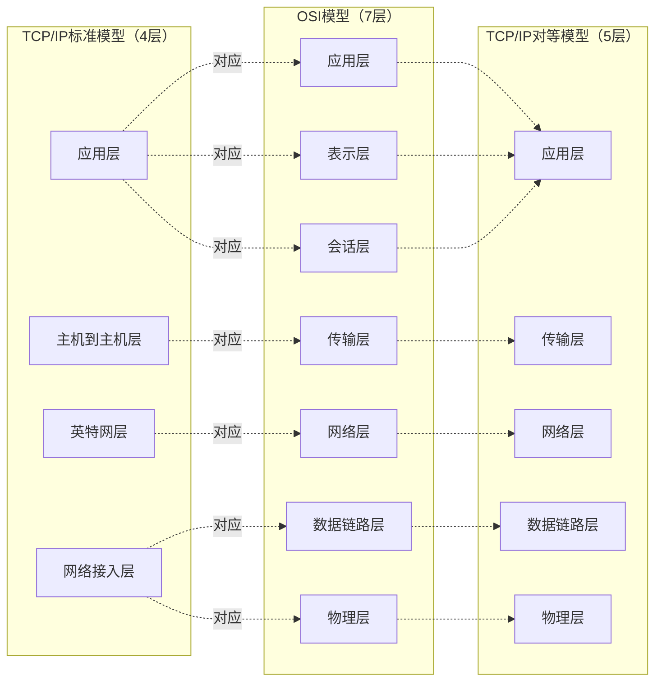

# 计算机网络概述 · 完整笔记

---

## 1.计算机网络发展

### 1.1 世界计算机网络发展

| 时期 | 标志性事件 |
|------|-----------|
| 20世纪50年代以前 | 计算机技术与通信技术结合 |
| 20世纪50年代~70年代中期 | ARPAnet（阿帕网） |
| 20世纪70年代开始 | OSI七层模型 和 TCP/sIP体系 |
| 20世纪90年代开始 | 因特网（Internet） |

### 1.2 我国互联网发展

| 时间 | 事件 |
|------|------|
| 1987年9月20日 | 钱天白教授通过意大利公用分组交换网ITAPAC设在北京的PAD，发出我国第一封电子邮件 |
| 1989年9月 | 国家计委组织建立中关村地区教育与科研示范网络（NCFC），目标是在北京大学/清华大学和中国科学院3个单位间建设高速互联网络，1992年建设完成 |
| 1994年1月4日 | NCFC工程通过美国Sprint公司连入Internet的64k国际专线开通 |
| 1997年6月3日 | 中国科学院网络信息中心组建了中国互联网络信息中心（CNNIC） |

截至2023年6月：
- 网民规模：10.79亿人
- 域名总数：3024万个
- IPv6地址数量：68055块/32
- IPv6活跃用户：7.67亿
- 互联网宽带接入端口：11.1亿个
- 光缆线路总长度：6196万公里
- 移动电话基站总数：1129万个（其中5G基站 293.7万个）
- 活跃App数量：260万个

---

## 2.计算机网络定义

### 2.1 定义

计算机网络是指通过线路互连起来、自治的计算机的集合。

### 2.2 功能

| 功能 | 说明 |
|------|------|
| 资源共享 | 包括硬件共享、软件共享和信息共享 |
| 数据传输 | 基础功能 |
| 集中管理 | |
| 分布式处理 | |
| 负载均衡 | |

---

## 3.计算机网络分类

### 3.1 按覆盖范围分类

| 分类 | 个域网 PAN | 局域网 LAN | 城域网 MAN | 广域网 WAN |
|------|-----------|-----------|-----------|-----------|
| 地理范围 | 一般10~20m内 | 大楼内、园区内部 | 建筑物之间，城区内 | 国内、国际 |
| 特点 | 低功耗、低传输速率、短距离 | 接范围窄、用户数少、配置容易、连接速率高 | 介于局域网和广域网之间 | 距离较远，信息衰减比较严重 |
| 典型案例 | 蓝牙/家庭WiFi | 校园网、企业内部网络 | 教育城域网/运营商城域网 | 运营商骨干网 |

### 3.2 按交换技术分类

| 交换方式 | 特点 | 类比 |
|---------|------|------|
| 电路交换 | 建立连接、数据传送、连接释放（独占线路） | 打电话 |
| 报文交换 | 整个报文存储转发，无需建立连接 | 寄包裹（整个包裹） |
| 分组交换 | 将报文分割为多个分组（Packet），分组存储转发 | 寄包裹（拆成多个小包裹） |

分组交换是现代计算机网络的核心技术。

### 3.3 其他分类方式

| 分类维度 | 类型 |
|---------|------|
| 按采用的协议 | IP网、IPX网等 |
| 按传输介质 | 无线网、有线网（双绞线网络/同轴电缆网络/光纤网络） |
| 按用途 | 教育网络、科研网络、商业网络、企业网络 |
| 按拓扑结构 | 总线型、星形、环形、树形、网状形 |
| 按通信方式 | 点对点传输网络、广播式传输网络 |
| 按服务 | 客户/服务器模式（C/S）、浏览器/服务器模式（B/S）、对等网（P2P） |

---

## 4.计算机网络性能参数

### 4.1 速率

单位：bps（比特/秒）

### 4.2 带宽

单位：Hz（赫兹）

### 4.3 时延

| 时延类型 | 公式/说明 |
|---------|----------|
| 传输时延（发送时延） | = 数据帧长度 / 带宽 |
| 传播时延 | = 信道长度 / 电磁波在信道中的传播速率 |
| 处理时延 | 节点处理数据所需时间 |
| 排队时延 | 数据在队列中等待处理的时间 |

关键常数：
- 电缆介质传播速率：200 km/ms = 200 m/μs = 2×10^8 m/s
- 卫星信号传播延迟：270 ms

---

## 5.OSI/RM 七层模型

### 5.1 为什么要分层

- 通信的双方需要"讲"相同的语言（协议）
- 网络通信的过程很复杂，为了降低复杂性
- 1974年，ISO组织发布了OSI参考模型

### 5.2 OSI七层模型结构

```
7. 应用层  ← 领导A
6. 表示层  ← 领导A
5. 会话层  ← 领导A
4. 传输层  ← 秘书A
3. 网络层  ← 邮递员A
2. 数据链路层 ← 邮递员A
1. 物理层  ← 邮政车
   ↓ 层层封装
传输介质
   ↓ 层层解封装
接收方（逆序解封装）
```

### 5.3 各层功能详解

| 层 | 名称 | 功能 | 数据单位 |
|---|------|------|---------|
| 7 | 应用层 | 对应用程序提供接口 | 数据 Data |
| 6 | 表示层 | 进行数据格式的转换，确保一个系统生成的应用层数据能被另一个系统的应用层识别和理解 | 数据 Data |
| 5 | 会话层 | 在通信双方之间建立、管理和终止会话 | 数据 Data |
| 4 | 传输层 | 建立、维护和取消一次端到端的数据传输过程；控制传输节奏的快慢，调整数据的排序等 | 段 Segment |
| 3 | 网络层 | 定义逻辑地址；实现数据从源到目的地的转发 | 包 Packet |
| 2 | 数据链路层 | 将分组数据封装成帧；在数据链路上实现数据的点到点、或点到多点方式的直接通信；差错检测 | 帧 Frame |
| 1 | 物理层 | 在媒介上传输比特流；提供机械的和电气的规约 | 位 Bit |

记忆口诀：应表会传网数物（从上到下）

---

## 6.TCP/IP 参考模型

### 6.1 概述

TCP/IP协议簇，是现代Internet的核心协议，是实际框架。

### 6.2 三种模型对比



核心对应关系：
- TCP/IP的应用层 = OSI的应用层+表示层+会话层
- TCP/IP的传输层 = OSI的传输层
- TCP/IP的英特网层 = OSI的网络层
- TCP/IP的网络接入层 = OSI的数据链路层+物理层

---

## 7.TCP/IP 常见协议

### 7.1 协议栈总览

```
应用层：POP3  SMTP  Telnet  HTTP/HTTPS  FTP  BGP
       OSPF  NFS  DHCP  SNMP  TFTP  DNS  NTP  RIP
────────────────────────────────────────────────
传输层：        TCP              │        UDP
────────────────────────────────────────────────
Internet层：IP  │  ICMP  │  IGMP  │  ARP  │  RARP
────────────────────────────────────────────────
网络接口层：    CSMA/CD    │    HDLC    │    PPP
```

### 7.2 各层协议速查表

| 层次 | 协议 | 说明 |
|------|------|------|
| 应用层 | HTTP/HTTPS | 超文本传输协议（网页浏览） |
| | FTP | 文件传输协议 |
| | TFTP | 简单文件传输协议（UDP-based） |
| | SMTP | 简单邮件传输协议（发邮件） |
| | POP3 | 邮局协议第3版（收邮件） |
| | Telnet | 远程登录协议 |
| | DNS | 域名解析系统 |
| | DHCP | 动态主机配置协议（自动分配IP） |
| | SNMP | 简单网络管理协议 |
| | NTP | 网络时间协议 |
| | BGP | 边界网关协议 |
| | OSPF | 开放最短路径优先 |
| | RIP | 路由信息协议 |
| | NFS | 网络文件系统 |
| 传输层 | TCP | 传输控制协议（面向连接、可靠） |
| | UDP | 用户数据报协议（无连接、快速） |
| Internet层 | IP | 网际协议 |
| | ICMP | 网际控制报文协议（ping命令） |
| | IGMP | 网际组管理协议 |
| | ARP | 地址解析协议（IP转MAC） |
| | RARP | 反向地址解析协议（MAC转IP） |
| 网络接口层 | CSMA/CD | 载波监听多路访问/冲突检测 |
| | HDLC | 高级数据链路控制 |
| | PPP | 点对点协议 |

---

## 8.发送方数据封装过程

```
应用层：     DATA                          → 数据 Data
              ↓
传输层：     [TCP Header | DATA]           → 段 Segment
              ↓
网络层：     [IP Header  | Payload]        → 包 Packet
              ↓
数据链路层： [Eth Header | Payload | FCS]  → 帧 Frame
              ↓
物理层：     0 1 1 0 0 1 0 1 0 1 ......    → 位 Bit
              ↓
           传输介质
```

封装顺序（从上到下）：数据 → 段 → 包 → 帧 → 比特

解封装顺序（从下到上）：比特 → 帧 → 包 → 段 → 数据

---

## 9.课堂习题巩固

### 习题1

无线个域网的蓝牙技术采用802.15.1标准。与无线宽带网络相比，无线个域网具有：低功耗、低传输速率 和 短距离的特点。

### 习题2

网络应用需要考虑实时性，以下网络服务中实时性要求最高的是（B）

- A. 基于SNMP协议的网管服务
- B. 视频点播服务（正确）
- C. 邮件服务
- D. Web服务

### 习题3

在地面上相距1000公里的两地之间通过电缆传输电磁信号，其延迟时间是（C）

- A. 5μs  B. 10μs  C. 5ms（正确）  D. 10ms

计算：传播时延 = 1000 km / 200 km/ms = 5 ms

### 习题4

下面的选项中，属于OSI传输层功能的是（A）

- A. 通过流量控制发送数据（正确）
- B. 提供传输数据的最佳路径（网络层）
- C. 提供网络寻址功能（网络层）
- D. 允许网络分层

### 习题5

在OSI参考模型中，（B）在物理线路上提供可靠的数据传输服务。

- A. 物理层  B. 数据链路层（正确）  C. 网络层  D. 传输层

### 习题6

在OSI参考模型中，传输层处理的数据单位是（D）

- A. 比特  B. 帧  C. 分组  D. 报文（正确）

### 习题7

TCP/IP协议中传输层的协议有（A），数据从上到下封装的格式为（B）。

（1）A. TCP（正确）（FTP是应用层，ICMP/IGMP是Internet层）

（2）B. 数据 → 段 → 包 → 帧 → 比特（正确）

---

## 10.本章小结

| 知识点 | 核心内容 |
|--------|---------|
| 1. 计算机网络的分类 | 按功能（通信子网/资源子网）、按覆盖范围（PAN/LAN/MAN/WAN） |
| 2. 计算机网络性能参数 | 带宽、最高速率、时延、信道利用率 |
| 3. OSI七层模型 | 应用层、表示层、会话层、传输层、网络层、数据链路层、物理层 |
| 4. TCP/IP四层模型及其协议 | 应用层（POP3、SMTP、FTP、TFTP、HTTP、DHCP、DNS、SNMP、Telnet等）、传输层（TCP和UDP）、Internet层（IP、ICMP、IGMP、ARP、RARP）、网络接口层 |
| 5. 数据的封装与解封 | 段 → 分组/包 → 帧 → 比特 |

考试重点：
1. OSI七层模型各层名称、功能、数据单位
2. TCP/IP模型与OSI模型的对应关系
3. 常见协议所在的层次
4. 数据封装顺序及各层数据单位
5. 传播时延计算（200km/ms）

